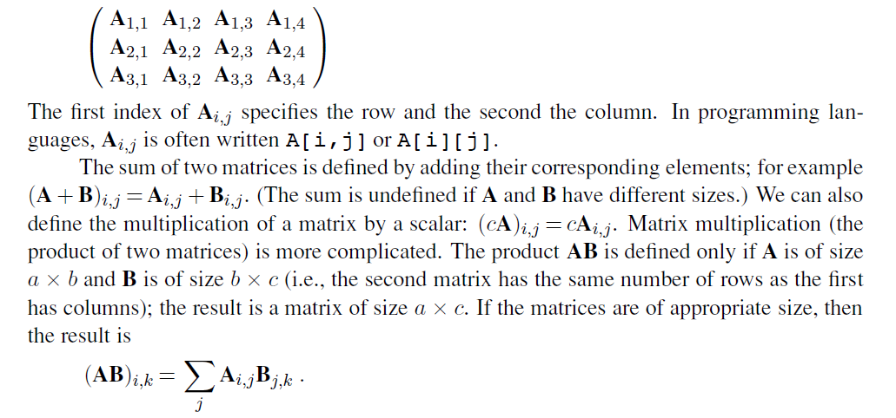
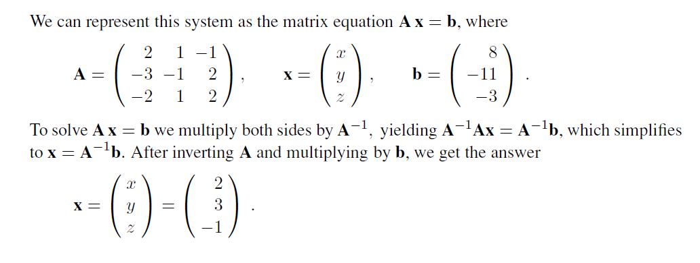
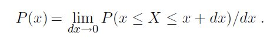
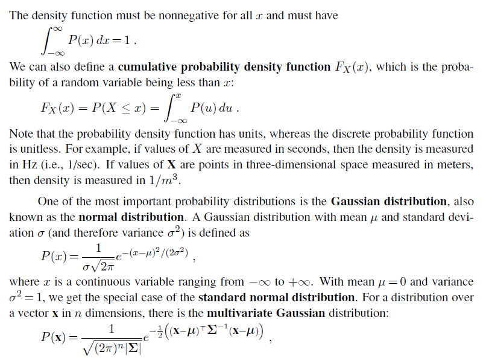
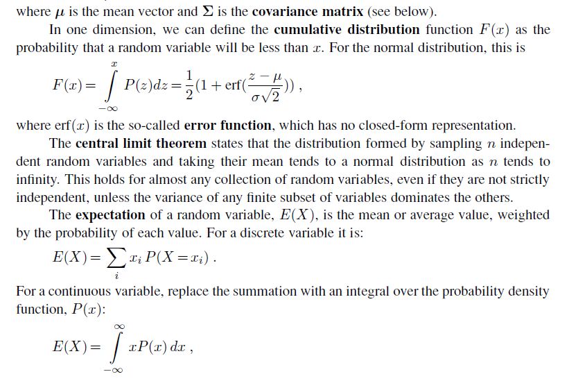
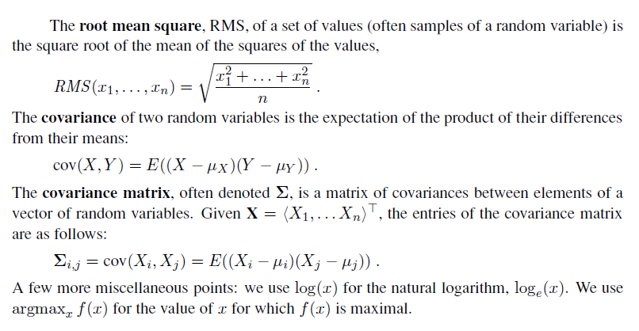

  

# A MATHEMATICAL BACKGROUND

## COMPLEx~i~TY ANALYSIS AND O() NOTATION

Computer scientists are often faced with the task of comparing algorithms to see how fast they run or how much memory they require. There are two approaches to this task. The first is **benchmarking**—running the algorithms on a computer and measuring speed in seconds and memory consumption in bytes. Ultimately, this is what really matters, but a benchmark can be unsatisfactory because it is so specific: it measures the performance of a particular program written in a particular language, running on a particular computer, with a particular compiler and particular input data. From the single result that the benchmark provides, it can be difficult to predict how well the algorithm would do on a different compiler, com- puter, or data set. The second approach relies on a mathematical **analysis of algorithms**,A independently of the particular implementation and input, as discussed below.

### Asymptotic analysis

We will consider algorithm analysis through the following example, a program to compute the sum of a sequence of numbers:
```
function SUMMATION(sequence) returns a number 
sum← 0 
for i = 1 to LENGTH(sequence) do
sum← sum + sequence[i] 
return sum
```
The first step in the analysis is to abstract over the input, in order to find some parameter or parameters that characterize the size of the input. In this example, the input can be characterized by the length of the sequence, which we will call n. The second step is to abstract over the implementation, to find some measure that reflects the running time of the algorithm but is not tied to a particular compiler or computer. For the SUMMATION program, this could be just the number of lines of code executed, or it could be more detailed, measuring the number of additions, assignments, array references, and branches executed by the algorithm.

Either way gives us a characterization of the total number of steps taken by the algorithm as a function of the size of the input. We will call this characterization T (n). If we count lines of code, we have T (n)= 2n + 2 for our example.

If all programs were as simple as SUMMATION, the analysis of algorithms would be a trivial field. But two problems make it more complicated. First, it is rare to find a parameter like n that completely characterizes the number of steps taken by an algorithm. Instead, the best we can usually do is compute the worst case T~worst~ (n) or the average case Tavg(n). Computing an average means that the analyst must assume some distribution of inputs.

The second problem is that algorithms tend to resist exact analysis. In that case, it is necessary to fall back on an approx~i~mation. We say that the SUMMATION algorithm is O(n), meaning that its measure is at most a constant times n, with the possible exception of a few small values of n. More formally,

T (n) is O(f(n)) if T (n) ≤ kf(n) for some k, for all n > n~0~ .

The O() notation gives us what is called an **asymptotic analysis**. We can say without question that, as n asymptotically approaches infinity, an O(n) algorithm is better than an O(n^2^) algorithm. A single benchmark figure could not substantiate such a claim. The O() notation abstracts over constant factors, which makes it easier to use, but less precise, than the T () notation. For example, an O(n^2^) algorithm will always be worse than an O(n) in the long run, but if the two algorithms are T (n^2^ + 1) and T (100n + 1000), then the O(n^2^) algorithm is actually better for n < 110.

Despite this drawback, asymptotic analysis is the most widely used tool for analyzing algorithms. It is precisely because the analysis abstracts over both the exact number of oper- ations (by ignoring the constant factor k) and the exact content of the input (by considering only its size n) that the analysis becomes mathematically feasible. The O() notation is a good compromise between precision and ease of analysis.

## NP and inherently hard problems

The analysis of algorithms and the O() notation allow us to talk about the efficiency of a particular algorithm. However, they have nothing to say about whether there could be a better algorithm for the problem at hand. The field of **complex~i~ty analysis** analyzes problems rather than algorithms. The first gross division is between problems that can be solved in polynomial time and problems that cannot be solved in polynomial time, no matter what algorithm is used. The class of polynomial problems—those which can be solved in time O(n^k^) for some k—is called P. These are sometimes called “easy” problems, because the class contains those problems with running times like O(log n) and O(n). But it also contains those with time O(n^1000^), so the name “easy” should not be taken too literally.

Another important class of problems is NP, the class of nondeterministic polynomial problems. A problem is in this class if there is some algorithm that can guess a solution and then verify whether the guess is correct in polynomial time. The idea is that if you have an arbitrarily large number of processors, so that you can try all the guesses at once, or you are very lucky and always guess right the first time, then the NP problems become P problems. One of the biggest open questions in computer science is whether the class NP is equivalent to the class P when one does not have the luxury of an infinite number of processors or omniscient guessing. Most computer scientists are convinced that P≠NP; that NP problems are inherently hard and have no polynomial-time algorithms. But this has never been proven.

Those who are interested in deciding whether P = NP look at a subclass of NP called the **NP-complete** problems. The word “complete” is used here in the sense of “most extreme” and thus refers to the hardest problems in the class NP. It has been proven that either all the NP-complete problems are in P or none of them is. This makes the class theoretically interesting, but the class is also of practical interest because many important problems are known to be NP-complete. An example is the satisfiability problem: given a sentence of propositional logic, is there an assignment of truth values to the proposition symbols of the sentence that makes it true? Unless a miracle occurs and P = NP, there can be no algorithm that solves _all_ satisfiability problems in polynomial time. However, AI is more interested in whether there are algorithms that perform efficiently on _typical_ problems drawn from a pre- determined distribution; as we saw in Chapter 7, there are algorithms such as WALKSAT that do quite well on many problems.

The class **co-NP** is the complement of NP, in the sense that, for every decision problemCO-NP in NP, there is a corresponding problem in co-NP with the “yes” and “no” answers reversed. We know that P is a subset of both NP and co-NP, and it is believed that there are problems in co-NP that are not in P. The **co-NP-complete** problems are the hardest problems in co-NP.

The class #P (pronounced “sharp P”) is the set of counting problems corresponding to the decision problems in NP. Decision problems have a yes-or-no answer: is there a solution to this 3-SAT formula? Counting problems have an integer answer: how many solutions are there to this 3-SAT formula? In some cases, the counting problem is much harder than the decision problem. For example, deciding whether a bipartite graph has a perfect matching can be done in time O(V E) (where the graph has V vertices and E edges), but the counting problem “how many perfect matches does this bipartite graph have” is #P-complete, meaning that it is hard as any problem in #P and thus at least as hard as any NP problem.

Another class is the class of PSPACE problems—those that require a polynomial amount of space, even on a nondeterministic machine. It is believed that PSPACE-hard problems are worse than NP-complete problems, although it could turn out that NP = PSPACE, just as it could turn out that P = NP.

# VECTORS, MATRICES, AND LINEAR ALGEBRA

Mathematicians define a **vector** as a member of a vector space, but we will use a more concrete definition: a vector is an ordered sequence of values. For example, in two-dimensional space, we have vectors such as **x** \= 〈3, 4〉 and **y** \= 〈0, 2〉. We follow the convention of bold- face characters for vector names, although some authors use arrows or bars over the names: x or ȳ. The elements of a vector can be accessed using subscripts: **z** \= 〈z~1~, z~2~, . . . , z~n~〉. One confusing point: this book is synthesizing work from many subfields, which variously call their sequences vectors, lists, or tuples, and variously use the notations 〈1, 2〉, \[1, 2\], or (1, 2).  

The two fundamental operations on vectors are vector addition and scalar multiplica- tion. The vector addition **x**+**y** is the elementwise sum: **x**+**y** \= 〈3+0, 4+2〉= 〈3, 6〉. Scalar multiplication multiplies each element by a constant: 5**x** \= 〈5× 3, 5 × 4〉= 〈15, 20〉.

The length of a vector is denoted |**x**| and is computed by taking the square root of the sum of the squares of the elements: |**x**|=√ (3^2^ + 4^2^)= 5. The dot product **x** · **y** (also called scalar product) of two vectors is the sum of the products of corresponding elements, that is, **x** · **y** \=∑~i~ x~i~y~i, or in our particular case, **x** · **y** \= 3× 0 + 4× 2= 8.

Vectors are often interpreted as directed line segments (arrows) in an n-dimensional Euclidean space. Vector addition is then equivalent to placing the tail of one vector at the head of the other, and the dot product **x** · **y** is equal to |**x**| |**y**| cos θ, where θ is the angle between **x** and **y**.

A **matrix** is a rectangular array of values arranged into rows and columns. Here is aMATRIX

matrix **A** of size 3 × 4:



Matrix multiplication is not commutative, even for square matrices: **AB** ≠ **BA** in general. It is, however, associative: (**AB**)**C** \= **A**(**BC**). Note that the dot product can be expressed in terms of a transpose and a matrix multiplication:**x** · **y** \= **x** **y**.

The **identity matrix I** has elements **I**~i,j~ equal to 1 when i= j and equal to 0 otherwise. It has the property that **AI** \= **A** for all **A**. The **transpose** of **A**, written **A** is formed by turning rows into columns and vice versa, or, more formally, by **A**~i,j~ = **A**~j,i~. The **inverse** of a square matrix **A** is another square matrix **A**−1 such that **A**−1**A** \= **I**. For a **singular** matrix, the inverse does not ex~i~st. For a nonsingular matrix, it can be computed in O(n3) time. Matrices are used to solve systems of linear equations in O(n^3^) time; the time is dominated by inverting a matrix of coefficients. Consider the following set of equations, for which we want a solution in x, y, and z:

+2x + y − z = 8

−3x− y + 2z = −11

−2x + y + 2z = −3 .  



# PROBABILITY DISTRIBUTIONS

A probability is a measure over a set of events that satisfies three ax~i~oms:

1\. The measure of each event is between 0 and 1. We write this as 0 ≤ P (X = x~i~) ≤ 1, where X is a random variable representing an event and x~i~ are the possible values of X. In general, random variables are denoted by uppercase letters and their values by lowercase letters.

2\. The measure of the whole set is 1; that is, ∑^n^~i=1~ P (X = x~i~)= 1.

3\. The probability of a union of disjoint events is the sum of the probabilities of the indi- vidual events; that is, P (X = x~1~ ∨X = x~2~)= P (X = x~1~) + P (X =x~2~), where x~1~ and x~2~ are disjoint.

A **probabilistic model** consists of a sample space of mutually exclusive possible outcomes, together with a probability measure for each outcome. For example, in a model of the weather tomorrow, the outcomes might be _sunny, cloudy, rainy_, and _snowy_. A subset of these out- comes constitutes an event. For example, the event of precipitation is the subset consisting of {_rainy, snowy_}.

We use **P**(X) to denote the vector of values 〈P (X = x~1~), . . . , P (X =x~n~)〉. We also use P (x~i~) as an abbreviation for P (X = x~i~) and ∑~x~P (x) for ∑^n^~i=1~ P (X = x~i~). The conditional probability P (B|A) is defined as P (B∩A)/P (A). A and B are conditionally independent if P (B|A)= P (B) (or equivalently, P (A|B)= P (A)). For continuous variables, there are an infinite number of values, and unless there are point spikes, the probability of any one value is 0. Therefore, we define a **probability density function**, which we also denote as P (·), but which has a slightly different meaning from the discrete probability function. The density function P (x) for a random variable X, which might be thought of as P (X = x), is intuitively defined as the ratio of the probability that X falls into an interval around x, divided by the width of the interval, as the interval width goes to zero:








**BIBLIOGRAPHICAL AND HISTORICAL NOTES**

The O() notation so widely used in computer science today was first introduced in the context of number theory by the German mathematician P. G. H. Bachmann (1894). The concept of NP-completeness was invented by Cook (1971), and the modern method for establishing a reduction from one problem to another is due to Karp (1972). Cook and Karp have both won the Turing award, the highest honor in computer science, for their work.

Classic works on the analysis and design of algorithms include those by Knuth (1973) and Aho, Hopcroft, and Ullman (1974); more recent contributions are by Tarjan (1983) and Cormen, Leiserson, and Rivest (1990). These books place an emphasis on designing and analyzing algorithms to solve tractable problems. For the theory of NP-completeness and other forms of intractability, see Garey and Johnson (1979) or Papadimitriou (1994). Good texts on probability include Chung (1979), Ross (1988), and Bertsekas and Tsitsiklis (2008).