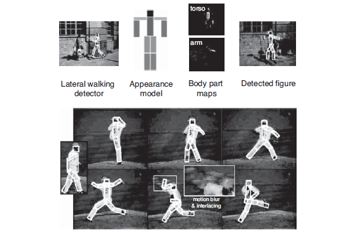
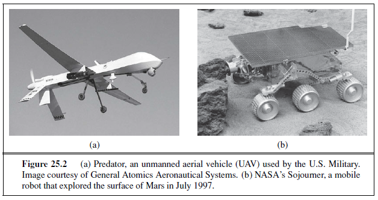
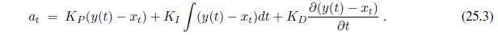

# NATURAL LANGUAGE PROCESSING

_In which we see how to make use of the copious knowledge that is expressed in natural language._

_Homo sapiens_ is set apart from other species by the capacity for language. Somewhere around 100,000 years ago, humans learned how to speak, and about 7,000 years ago learned to write. Although chimpanzees, dolphins, and other animals have shown vocabularies of hundreds of signs, only humans can reliably communicate an unbounded number of qualitatively different messages on any topic using discrete signs.

Of course, there are other attributes that are uniquely human: no other species wears clothes, creates representational art, or watches three hours of television a day. But when Alan Turing proposed his Test (see Section 1.1.1), he based it on language, not art or TV. There are two main reasons why we want our computer agents to be able to process natural languages: first, to communicate with humans, a topic we take up in Chapter 23, and second, to acquire information from written language, the focus of this chapter.

There are over a trillion pages of information on the Web, almost all of it in natural language. An agent that wants to do **knowledge acquisition** needs to understand (at leastKNOWLEDGE ACQUISITION
partially) the ambiguous, messy languages that humans use. We examine the problem from the point of view of specific information-seeking tasks: text classification, information retrieval, and information extraction. One common factor in addressing these tasks is the use of **language models**: models that predict the probability distribution of language expressions.

## LANGUAGE MODELS

Formal languages, such as the programming languages Java or Python, have precisely defined language models. A **language** can be defined as a set of strings; “print(2 + 2)” is a legal program in the language Python, whereas “(2+2) print” is not. Since there are an infinite number of legal programs, they cannot be enumerated; instead they are specified by a set of rules called a *grammar**. Formal languages also have rules that define the meaning or **semantics** of a program; for example, the rules say that the “meaning” of “2 + 2” is 4, and the meaning of “1/0” is that an error is signaled.


Natural languages, such as English or Spanish, cannot be characterized as a definitive set of sentences. Everyone agrees that “Not to be invited is sad” is a sentence of English, but people disagree on the grammaticality of “To be not invited is sad.” Therefore, it is more fruitful to define a natural language model as a probability distribution over sentences rather than a definitive set. That is, rather than asking if a string of _words_ is or is not a member of the set defining the language, we instead ask for P (S =words)—what is the probability that a random sentence would be _words_.

Natural languages are also **ambiguous**. “He saw her duck” can mean either that he saw a waterfowl belonging to her, or that he saw her move to evade something. Thus, again, we cannot speak of a single meaning for a sentence, but rather of a probability distribution over possible meanings.

Finally, natural languages are difficult to deal with because they are very large, and constantly changing. Thus, our language models are, at best, an approximation. We start with the simplest possible approximations and move up from there.

### N-gram character models 

Ultimately, a written text is composed of letters, digits, punctuation, and spaces
in English (and more exotic characters in some other languages). Thus, one of the simplest language models is a probability distribution over sequences of characters. As in Chapter 15, we write P (c~1:N~ ) for the probability of a sequence of N characters, C~1~ through c~N~ . In one Web collection, P (“the”)= 0.027 and P (“zgq”)= 0.000000002. A sequence of written symbols of length n is called an n-gram (from the Greek root for writing or letters), with special case “unigram” for 1-gram, “bigram” for 2-gram, and “trigram” for 3-gram. A model of the probability distribution of n-letter sequences is thus called an n-**gram model**. (But be care-N ful: we can have n-gram models over sequences of words, syllables, or other units; not just over characters.)

An n-gram model is defined as a **Markov chain** of order n − 1. Recall from page 568 that in a Markov chain the probability of character c~i~ depends only on the immediately preceding characters, not on any other characters. So in a trigram model (Markov chain of order 2) we have

P (c~i~ | C~1:i−1~) = P (c~i~ | c~i−2:i−1~) .

We can define the probability of a sequence of characters P (C~1~:N ) under the trigram model by first factoring with the chain rule and then using the Markov assumption:


For a trigram character model in a language with 100 characters, **P**(C~i~|C~i−2:i−1~) has a million entries, and can be accurately estimated by counting character sequences in a body of text of 10 million characters or more. We call a body of text a **corpus** (plural _corpora_), from the Latin word for _body_.  


What can we do with n-gram character models? One task for which they are well suited is **language identification:** given a text, determine what natural language it is written in. This is a relatively easy task; even with short texts such as “Hello, world” or “Wie geht es dir,” it is easy to identify the first as English and the second as German. Computer systems identify languages with greater than 99% accuracy; occasionally, closely related languages, such as Swedish and Norwegian, are confused.

One approach to language identification is to first build a trigram character model of each candidate language, P (c~i~ | c~i−2:i−1~, ), where the variable  ranges over languages. For each  the model is built by counting trigrams in a corpus of that language. (About 100,000 characters of each language are needed.) That gives us a model of **P**(Text |Language), but we want to select the most probable language given the text, so we apply Bayes’ rule followed by the Markov assumption to get the most probable language:


The trigram model can be learned from a corpus, but what about the prior probability P ()? We may have some estimate of these values; for example, if we are selecting a random Web page we know that English is the most likely language and that the probability of Macedonian will be less than 1%. The exact number we select for these priors is not critical because the trigram model usually selects one language that is several orders of magnitude more probable than any other.

Other tasks for character models include spelling correction, genre classification, and named-entity recognition. Genre classification means deciding if a text is a news story, a legal document, a scientific article, etc. While many features help make this classification, counts of punctuation and other character n-gram features go a long way (Kessler _et al._, 1997). Named-entity recognition is the task of finding names of things in a document and deciding what class they belong to. For example, in the text “Mr. Sopersteen was prescribed aciphex,” we should recognize that “Mr. Sopersteen” is the name of a person and “aciphex” is the name of a drug. Character-level models are good for this task because they can associate the character sequence “ex ” (“ex” followed by a space) with a drug name and “steen ” with a person name, and thereby identify words that they have never seen before.

### Smoothing _n_-gram models

The major complication of n-gram models is that the training corpus provides only an estimate of the true probability distribution. For common character sequences such as “ th” any English corpus will give a good estimate: about 1.5% of all trigrams. On the other hand, “ ht” is very uncommon—no dictionary words start with ht. It is likely that the sequence would have a count of zero in a training corpus of standard English. Does that mean we should assign P (“ th”)= 0? If we did, then the text “The program issues an http request” would have an English probability of zero, which seems wrong. We have a problem in generalization: we want our language models to generalize well to texts they haven’t seen yet. Just because we have never seen “ http” before does not mean that our model should claim that it is impossible. Thus, we will adjust our language model so that sequences that have a count of zero in the training corpus will be assigned a small nonzero probability (and the other counts will be adjusted downward slightly so that the probability still sums to 1). The process od adjusting the probability of low-frequency counts is called **smoothing**.

The simplest type of smoothing was suggested by Pierre-Simon Laplace in the 18th century: he said that, in the lack of further information, if a random Boolean variable X has been false in all n observations so far then the estimate for P (X = true) should be 1/(n+2). That is, he assumes that with two more trials, one might be true and one false. Laplace smoothing (also called add-one smoothing) is a step in the right direction, but performs relatively poorly. A better approach is a **backoff model**, in which we start by estimating n-gram counts, but for any particular sequence that has a low (or zero) count, we back off to (n− 1)-grams. **Linear interpolation smoothing** is a backoff model that combines trigram, bigram, and unigram models by linear interpolation. It defines the probability estimate as

P̂ (c~i~|c~i−2:i−1~) = λ3P (c~i~|c~i−2:i−1~) + λ2P (c~i|ci−1~) + λ1P (c~i~) ,

where λ~3~ + λ~2~ + λ~1~ =1. The parameter values λi can be fixed, or they can be trained with an expectation–maximization algorithm. It is also possible to have the values of λi depend on the counts: if we have a high count of trigrams, then we weigh them relatively more; if only a low count, then we put more weight on the bigram and unigram models. One camp of researchers has developed ever more sophisticated smoothing models, while the other camp suggests gathering a larger corpus so that even simple smoothing models work well. Both are getting at the same goal: reducing the variance in the language model.

One complication: note that the expression P (c~i~ | c~i−2:i−1~) asks for P (C~1~ | c~-1:0~) when i = 1, but there are no characters before C~1~. We can introduce artificial characters, for example, defining c~0~ to be a space character or a special “begin text” character. Or we can fall back on lower-order Markov models, in effect defining c-1:0 to be the empty sequence and thus P (C~1~ | c~-1:0~)= P (C~1~).

### Model evaluation

With so many possible n-gram models—unigram, bigram, trigram, interpolated smoothing with different values of λ, etc.—how do we know what model to choose? We can evaluate a model with cross-validation. Split the corpus into a training corpus and a validation corpus. Determine the parameters of the model from the training data. Then evaluate the model on the validation corpus.

The evaluation can be a task-specific metric, such as measuring accuracy on language identification. Alternatively we can have a task-independent model of language quality: calculate the probability assigned to the validation corpus by the model; the higher the probability the better. This metric is inconvenient because the probability of a large corpus will be a very small number, and floating-point underflow becomes an issue. A different way of describing the probability of a sequence is with a measure called **perplexity**, defined as

Perplexity(C~1~:N ) = P (C~1~:N )^1/N^

Perplexity can be thought of as the reciprocal of probability, normalized by sequence length. It can also be thought of as the weighted average branching factor of a model. Suppose there are 100 characters in our language, and our model says they are all equally likely. Then for a sequence of any length, the perplexity will be 100. If some characters are more likely than others, and the model reflects that, then the model will have a perplexity less than 100.

### N-gram word models

Now we turn to n-gram models over words rather than characters. All the same mechanism applies equally to word and character models. The main difference is that the **vocabulary** the set of symbols that make up the corpus and the model—is larger. There are only about 100 characters in most languages, and sometimes we build character models that are even more restrictive, for example by treating “A” and “a” as the same symbol or by treating all punctuation as the same symbol. But with word models we have at least tens of thousands of symbols, and sometimes millions. The wide range is because it is not clear what constitutes a word. In English a sequence of letters surrounded by spaces is a word, but in some languages, like Chinese, words are not separated by spaces, and even in English many decisions must be made to have a clear policy on word boundaries: how many words are in “ne’er-do-well”? Or in “(Tel:1-800-960-5660x123)”?

Word n-gram models need to deal with **out of vocabulary** words. With character models, we didn’t have to worry about someone inventing a new letter of the alphabet.1 But with word models there is always the chance of a new word that was not seen in the training corpus, so we need to model that explicitly in our language model. This can be done by adding just one new word to the vocabulary: <UNK>, standing for the unknown word. We can estimate n-gram counts for <UNK> by this trick: go through the training corpus, and the first time any individual word appears it is previously unknown, so replace it with the symbol <UNK>. All subsequent appearances of the word remain unchanged. Then compute n-gram counts for the corpus as usual, treating <UNK> just like any other word. Then when an unknown word appears in a test set, we look up its probability under <UNK>. Sometimes multiple unknown-word symbols are used, for different classes. For example, any string of digits might be replaced with <NUM>, or any email address with <EMAIL>.

To get a feeling for what word models can do, we built unigram, bigram, and trigram models over the words in this book and then randomly sampled sequences of words from the models. The results are

_Unigram:_ logical are as are confusion a may right tries agent goal the was . . .

_Bigram:_ systems are very similar computational approach would be represented . . .

_Trigram:_ planning and scheduling are integrated the success of naive bayes model is . . .

Even with this small sample, it should be clear that the unigram model is a poor approximation of either English or the content of an AI textbook, and that the bigram and trigram models are much better. The models agree with this assessment: the perplexity was 891 for the unigram model, 142 for the bigram model and 91 for the trigram model.

With the basics of n-gram models—both characterand word-based—established, we can turn now to some language tasks.

## TEXT CLASSIFICATION

We now consider in depth the task of **text classification,** also known as **categorization**: given a text of some kind, decide which of a predefined set of classes it belongs to. Language identification and genre classification are examples of text classification, as is sentiment analysis (classifying a movie or product review as positive or negative) and **spam detection** (classifying an email message as spam or not-spam). Since “not-spam” is awkward, researchers have coined the term **ham** for not-spam. We can treat spam detection as a problem in supervised learning. A training set is readily available: the positive (spam) examples are in my spam folder, the negative (ham) examples are in my inbox. Here is an excerpt:

Spam: Wholesale Fashion Watches -57% today. Designer watches for cheap ... 
Spam: You can buy ViagraFr$1.85 All Medications at unbeatable prices! ... 
Spam: WE CAN TREAT ANYTHING YOU SUFFER FROM JUST TRUST US... 
Spam: Sta.rt earn*ing the salary yo,u d-eserve by o’btaining the prope,r crede’ntials!

Ham: The practical significance of hypertree width in identifying more ... 
Ham: Abstract: We will motivate the problem of social identity clustering: ... 
Ham: Good to see you my friend. Hey Peter, It was good to hear from you. ... 
Ham: PDS implies convexity of the resulting optimization problem Kernel Ridge ...

From this excerpt we can start to get an idea of what might be good features to include in the supervised learning model. Word n-grams such as “for cheap” and “You can buy” seem to be indicators of spam (although they would have a nonzero probability in ham as well). Character-level features also seem important: spam is more likely to be all uppercase and to have punctuation embedded in words. Apparently the spammers thought that the word bigram “you deserve” would be too indicative of spam, and thus wrote “yo,u d-eserve” instead. A character model should detect this. We could either create a full character n-gram model of spam and ham, or we could handcraft features such as “number of punctuation marks embedded in words.”

Note that we have two complementary ways of talking about classification. In the language-modeling approach, we define one n-gram language model for **P**(Message | spam) by training on the spam folder, and one model for **P**(Message | ham) by training on the inbox. Then we can classify a new message with an application of Bayes’ rule:


where P (c) is estimated just by counting the total number of spam and ham messages. This approach works well for spam detection, just as it did for language identification.  

In the machine-learning approach we represent the message as a set of feature/value pairs and apply a classification algorithm h to the feature vector **X**. We can make the language-modeling and machine-learning approaches compatible by thinking of the n-grams as features. This is easiest to see with a unigram model. The features are the words in the vocabulary: “a,” “aardvark,” and the values are the number of times each word appears in the message. That makes the feature vector large and sparse. If there are 100,000 words in the language model, then the feature vector has length 100,000, but for a short email message almost all the features will have count zero. This unigram representation has been called the **bag of words** model. You can think of the model as putting the words of the training corpusin a bag and then selecting words one at a time. The notion of order of the words is lost; a unigram model gives the same probability to any permutation of a text. Higher-order n-gram models maintain some local notion of word order.

With bigrams and trigrams the number of features is squared or cubed, and we can add in other, non-n-gram features: the time the message was sent, whether a URL or an image is part of the message, an ID number for the sender of the message, the sender’s number of previous spam and ham messages, and so on. The choice of features is the most important part of creating a good spam detector—more important than the choice of algorithm for processing the features. In part this is because there is a lot of training data, so if we can propose a feature, the data can accurately determine if it is good or not. It is necessary to constantly update features, because spam detection is an **adversarial task**; the spammers modify their spam in response to the spam detector’s changes.

It can be expensive to run algorithms on a very large feature vector, so often a process of **feature selection** is used to keep only the features that best discriminate between spam and ham. For example, the bigram “of the” is frequent in English, and may be equally frequent in spam and ham, so there is no sense in counting it. Often the top hundred or so features do a good job of discriminating between classes.

Once we have chosen a set of features, we can apply any of the supervised learning techniques we have seen; popular ones for text categorization include k-nearest-neighbors, support vector machines, decision trees, naive Bayes, and logistic regression. All of these have been applied to spam detection, usually with accuracy in the 98%–99% range. With a carefully designed feature set, accuracy can exceed 99.9%.

###  Classification by data compression

Another way to think about classification is as a problem in **data compression**. A lossless compression algorithm takes a sequence of symbols, detects repeated patterns in it, and writes a description of the sequence that is more compact than the original. For example, the text “0.142857142857142857” might be compressed to “0.[142857]*3.” Compression algorithms work by building dictionaries of subsequences of the text, and then referring to entries in the dictionary. The example here had only one dictionary entry, “142857.”

In effect, compression algorithms are creating a language model. The LZW algorithm in particular directly models a maximum-entropy probability distribution. To do classification by compression, we first lump together all the spam training messages and compress them as a unit. We do the same for the ham. Then when given a new message to classify, we append it to the spam messages and compress the result. We also append it to the ham and compress that. Whichever class compresses better—adds the fewer number of additional bytes for the new message—is the predicted class. The idea is that a spam message will tend to share dictionary entries with other spam messages and thus will compress better when appended to a collection that already contains the spam dictionary.

Experiments with compression-based classification on some of the standard corpora for text classification—the 20-Newsgroups data set, the Reuters-10 Corpora, the Industry Sector corpora—indicate that whereas running off-the-shelf compression algorithms like gzip, RAR, and LZW can be quite slow, their accuracy is comparable to traditional classification algorithms. This is interesting in its own right, and also serves to point out that there is promise for algorithms that use character n-grams directly with no preprocessing of the text or feature selection: they seem to be captiring some real patterns.

## INFORMATION RETRIEVAL

**Information retrieval** is the task of finding documents that are relevant to a user’s need for information. The best-known examples of information retrieval systems are search engines on the World Wide Web. A Web user can type a query such as [AI book] into a search engine and see a list of relevant pages. In this section, we will see how such systems are built. An information retrieval (henceforth **IR**) system can be characterized by

1. **A corpus of documents.** Each system must decide what it wants to treat as a document: a paragraph, a page, or a multipage text.

2. **Queries posed in a query language**. A query specifies what the user wants to know.The query language can be just a list of words, such as YHN8[AI bookYHN8]; or it can specify a phrase of words that must be adjacent, as in [“AI book”]; it can contain Boolean operators as in [AI AND book]; it can include non-Boolean operators such as [AI NEAR book] or [AI book site:www.aaai.org].

3. **A result set.** This is the subset of documents that the IR system judges to be **relevant** to the query. By _relevant_, we mean likely to be of use to the person who posed the query, for the particular information need expressed in the query.

4. **A presentation of the result set.** This can be as simple as a ranked list of document titles or as complex as a rotating color map of the result set projected onto a threedimensional space, rendered as a two-dimensional display.

The earliest IR systems worked on a **Boolean keyword model**. Each word in the document collection is treated as a Boolean feature that is true of a document if the word occurs in the document and false if it does not. So the feature “retrieval” is true for the current chapter but false for Chapter 15. The query language is the language of Boolean expressions over features. A document is relevant only if the expression evaluates to true. For example, the query [information AND retrieval] is true for the current chapter and false for Chapter 15.

This model has the advantage of being simple to explain and implement. However, it has some disadvantages. First, the degree of relevance of a document is a single bit, so there is no guidance as to how to order the relevant documents for presentation. Second, Boolean expressions are unfamiliar to users who are not programmers or logicians. Users find it unintuitive that when they want to know about farming in the states of Kansas _and_ Nebraska they need to issue the query [farming (Kansas OR Nebraska)]. Third, it can be hard to formulate an appropriate query, even for a skilled user. Suppose we try [information AND retrieval AND models AND optimization] and get an empty result set. We could try [information OR retrieval OR models OR optimization], but if that returns too many results, it is difficult to know what to try next.

### IR scoring functions

Most IR systems have abandoned the Boolean model and use models based on the statistics of word counts. We describe the **BM25 scoring function**, which comes from the Okapi project of Stephen Robertson and Karen Sparck Jones at London’s City College, and has been used in search engines such as the open-source Lucene project.

A scoring function takes a document and a query and returns a numeric score; the most relevant documents have the highest scores. In the BM25 function, the score is a linear weighted combination of scores for each of the words that make up the query. Three factors affect the weight of a query term: First, the frequency with which a query term appears in a document (also known as TF for term frequency). For the query [farming in Kansas], documents that mention “farming” frequently will have higher scores. Second, the inverse document frequency of the term, or IDF . The word “in” appears in almost every document, so it has a high document frequency, and thus a low inverse document frequency, and thus it is not as important to the query as “farming” or “Kansas.” Third, the length of the document. A million-word document will probably mention all the query words, but may not actually be about the query. A short document that mentions all the words is a much better candidate.

The BM25 function takes all three of these into account. We assume we have created an index of the N documents in the corpus so that we can look up TF (qi, dj), the count of the number of times word qi appears in document dj . We also assume a table of document frequency counts, DF (qi), that gives the number of documents that contain the word qi. Then, given a document dj and a query consisting of the words q1:N , we have


where |dj | is the length of document dj in words, and L is the average document length in the corpus: L = ∑ i |d~i~|/N . We have two parameters, k and b, that can be tuned by cross-validation; typical values are k = 2.0 and b = 0.75. IDF (qi) is the inverse document frequency of word qi, given by


Of course, it would be impractical to apply the BM25 scoring function to every document in the corpus. Instead, systems create an **index** ahead of time that lists, for each vocabulary word, the documents that contain the word. This is called the **hit list** for the word. Then when given a query, we intersect the hit lists of the query words and only score the documents in the intersection.

### IR system evaluation

How do we know whether an IR system is performing well? We undertake an experiment in which the system is given a set of queries and the result sets are scored with respect to human relevance judgments. Traditionally, there have been two measures used in the scoring: recall and precision. We explain them with the help of an example. Imagine that an IR system has returned a result set for a single query, for which we know which documents are and are not relevant, out of a corpus of 100 documents. The document counts in each category are given in the following table:

|  | In result set  |Not in result set |
| ----------| ----------|----------|
| Relevant | 30 |20 |
| Not relevant | 10 |40 |

**Precision** measures the proportion of documents in the result set that are actually relevant. In our example, the precision is 30/(30 + 10)= .75. The false positive rate is 1− .75 = .25. **Recall** measures the proportion of all the relevant documents in the collection that are in the result set. In our example, recall is 30/(30 + 20)= .60. The false negative rate is 1 −.60 = .40. In a very large document collection, such as the World Wide Web, recall is difficult to compute, because there is no easy way to examine every page on the Web for relevance. All we can do is either estimate recall by sampling or ignore recall completely and just judge precision. In the case of a Web search engine, there may be thousands of documents in the result set, so it makes more sense to measure precision for several different sizes, such as “P@10” (precision in the top 10 results) or “P@50,” rather than to estimate precision in the entire result set.

It is possible to trade off precision against recall by varying the size of the result set returned. In the extreme, a system that returns every document in the document collection is guaranteed a recall of 100%, but will have low precision. Alternately, a system could return a single document and have low recall, but a decent chance at 100% precision. A summary of both measures is the f~1~ score, a single number that is the harmonic mean of precision and recall, 2PR/(P + R).

### IR refinements

There are many possible refinements to the system described here, and indeed Web search engines are continually updating their algorithms as they discover new approaches and as the Web grows and changes.  

One common refinement is a better model of the effect of document length on relevance. Singhal _et al._ (1996) observed that simple document length normalization schemes tend to favor short documents too much and long documents not enough. They propose a _pivoted_ document length normalization scheme; the idea is that the pivot is the document length at which the old-style normalization is correct; documents shorter than that get a boost and longer ones get a penalty.

The BM25 scoring function uses a word model that treats all words as completely independent, but we know that some words are correlated: “couch” is closely related to both “couches” and “sofa.” Many IR systems attempt to account for these correlations.

For example, if the query is [couch], it would be a shame to exclude from the result set those documents that mention “COUCH” or “couches” but not “couch.” Most IR systems do **case folding** of “COUCH” to “couch,” and some use a **stemming** algorithm to reduce  “couches” to the stem form “couch,” both in the query and the documents. This typically yields a small increase in recall (on the order of 2% for English). However, it can harm precision. For example, stemming “stocking” to “stock” will tend to decrease precision for queries about either foot coverings or financial instruments, although it could improve recall for queries about warehousing. Stemming algorithms based on rules (e.g., remove “-ing”) cannot avoid this problem, but algorithms based on dictionaries (don’t remove “-ing” if the word is already listed in the dictionary) can. While stemming has a small effect in English, it is more important in other languages. In German, for example, it is not uncommon to see words like “Lebensversicherungsgesellschaftsangestellter” (life insurance company employee). Languages such as Finnish, Turkish, Inuit, and Yupik have recursive morphological rules that in principle generate words of unbounded length.

The next step is to recognize **synonyms**, such as “sofa” for “couch.” As with stemming,this has the potential for small gains in recall, but can hurt precision. A user who gives the query [Tim Couch] wants to see results about the football player, not sofas. The problem is that “languages abhor absolute synonyms just as nature abhors a vacuum” (Cruse, 1986). That is, anytime there are two words that mean the same thing, speakers of the language conspire to evolve the meanings to remove the confusion. Related words that are not synonyms also play an important role in ranking—terms like “leather”, “wooden,” or “modern” can serve to confirm that the document really is about “couch.” Synonyms and related words can be found in dictionaries or by looking for correlations in documents or in queries—if we find that many users who ask the query [new sofa] follow it up with the query [new couch], we can in the future alter [new sofa] to be [new sofa OR new couch].

As a final refinement, IR can be improved by considering **metadata**—data outside of the text of the document. Examples include human-supplied keywords and publication data. On the Web, hypertext **links** between documents are a crucial source of information.

### The PageRank algorithm

**PageRank**^3^ was one of the two original ideas that set Google’s search apart from other Web search engines when it was introduced in 1997. (The other innovation was the use of anchor


text—the underlined text in a hyperlink—to index a page, even though the anchor text was on a _different_ page than the one being indexed.) PageRank was invented to solve the problem of the tyranny of TF scores: if the query is [IBM], how do we make sure that IBM’s home page, ibm.com, is the first result, even if another page mentions the term “IBM” more frequently? The idea is that ibm.com has many in-links (links to the page), so it should be ranked higher: each in-link is a vote for the quality of the linked-to page. But if we only counted in-links, then it would be possible for a Web spammer to create a network of pages and have them all point to a page of his choosing, increasing the score of that page. Therefore, the PageRank algorithm is designed to weight links from high-quality sites more heavily. What is a highquality site? One that is linked to by other high-quality sites. The definition is recursive, but we will see that the recursion bottoms out properly. The PageRank for a page p is defined as:


where PR(p) is the PageRank of page p, N is the total number of pages in the corpus, in~i~ are the pages that link in to p, and C(ini) is the count of the total number of out-links on page ini. The constant d is a damping factor. It can be understood through the **random surfer model**: imagine a Web surfer who starts at some random page and begins exploring.
With probability d (we’ll assume d= 0.85) the surfer clicks on one of the links on the page (choosing uniformly among them), and with probability 1 − d she gets bored with the page and restarts on a random page anywhere on the Web. The PageRank of page p is then the probability that the random surfer will be at page p at any point in time. PageRank can be computed by an iterative procedure: start with all pages having PR(p)= 1, and iterate the algorithm, updating ranks until they converge.  

### The HITS algorithm

The Hyperlink-Induced Topic Search algorithm, also known as “Hubs and Authorities” or HITS, is another influential link-analysis algorithm (see Figure 22.1). HITS differs from PageRank in several ways. First, it is a query-dependent measure: it rates pages with respect to a query. That means that it must be computed anew for each query—a computational burden that most search engines have elected not to take on. Given a query, HITS first finds a set of pages that are relevant to the query. It does that by intersecting hit lists of query words, and then adding pages in the link neighborhood of these pages—pages that link to or are linked from one of the pages in the original relevant set.

Each page in this set is considered an **authority** on the query to the degree that other pages in the relevant set point to it. A page is considered a **hub** to the degree that it points to other authoritative pages in the relevant set. Just as with PageRank, we don’t want to merely count the number of links; we want to give more value to the high-quality hubs and authorities. Thus, as with PageRank, we iterate a process that updates the authority score of a page to be the sum of the hub scores of the pages that point to it, and the hub score to be the sum of the authority scores of the pages it points to. If we then normalize the scores and repeat k times, the process will converge.

Both PageRank and HITS played important roles in developing our understanding of Web information retrieval. These algorithms and their extensions are used in ranking billions of queries daily as search engines steadily develop better ways of extracting yet finer signals of search relevance.

### Question answering

Information retrieval is the task of finding documents that are relevant to a query, where the query may be a question, or just a topic area or concept. **Question answering** is a somewhat different task, in which the query really is a question, and the answer is not a ranked list of documents but rather a short response—a sentence, or even just a phrase. There have been question-answering NLP (natural language processing) systems since the 1960s, but only since 2001 have such systems used Web information retrieval to radically increase their breadth of coverage.

The ASKMSR system (Banko _et al._, 2002) is a typical Web-based question-answering system. It is based on the intuition that most questions will be answered many times on the Web, so question answering should be thought of as a problem in precision, not recall. We don’t have to deal with all the different ways that an answer might be phrased—we only have to find one of them. For example, consider the query [Who killed Abraham Lincoln?] Suppose a system had to answer that question with access only to a single encyclopedia, whose entry on Lincoln said

John Wilkes Booth altered history with a bullet. He will forever be known as the man who ended Abraham Lincoln’s life.

To use this passage to answer the question, the system would have to know that ending a life can be a killing, that “He” refers to Booth, and several other linguistic and semantic facts.  

ASKMSR does not attempt this kind of sophistication—it knows nothing about pronoun reference, or about killing, or any other verb. It does know 15 different kinds of questions, and how they can be rewritten as queries to a search engine. It knows that [Who killed Abraham Lincoln] can be rewritten as the query [* killed Abraham Lincoln] and as [Abraham Lincoln was killed by *]. It issues these rewritten queries and examines the results that come back— not the full Web pages, just the short summaries of text that appear near the query terms. The results are broken into 1-, 2-, and 3-grams and tallied for frequency in the result sets and for weight: an n-gram that came back from a very specific query rewrite (such as the exact phrase match query [“Abraham Lincoln was killed by *”]) would get more weight than one from a general query rewrite, such as [Abraham OR Lincoln OR killed]. We would expect that “John Wilkes Booth” would be among the highly ranked n-grams retrieved, but so would “Abraham Lincoln” and “the assassination of” and “Ford’s Theatre.”

Once the n-grams are scored, they are filtered by expected type. If the original query starts with “who,” then we filter on names of people; for “how many” we filter on numbers, for “when,” on a date or time. There is also a filter that says the answer should not be part of the question; together these should allow us to return “John Wilkes Booth” (and not “Abraham Lincoln”) as the highest-scoring response.

In some cases the answer will be longer than three words; since the components responses only go up to 3-grams, a longer response would have to be pieced together from shorter pieces. For example, in a system that used only bigrams, the answer “John Wilkes Booth” could be pieced together from high-scoring pieces “John Wilkes” and “Wilkes Booth.”

At the Text Retrieval Evaluation Conference (TREC), ASKMSR was rated as one of the top systems, beating out competitors with the ability to do far more complex language understanding. ASKMSR relies upon the breadth of the content on the Web rather than on its own depth of understanding. It won’t be able to handle complex inference patterns like associating “who killed” with “ended the life of.” But it knows that the Web is so vast that it can afford to ignore passages like that and wait for a simple passage it can handle.

## INFORMATION EXTRACTION

**Information extraction** is the process of acquiring knowledge by skimming a text and looking for occurrences of a particular class of object and for relationships among objects. A typical task is to extract instances of addresses from Web pages, with database fields for street, city, state, and zip code; or instances of storms from weather reports, with fields for temperature, wind speed, and precipitation. In a limited domain, this can be done with high accuracy. As the domain gets more general, more complex linguistic models and more complex learning techniques are necessary. We will see in Chapter 23 how to define complex language models of the phrase structure (noun phrases and verb phrases) of English. But so far there are no complete models of this kind, so for the limited needs of information extraction, we define limited models that approximate the full English model, and concentrate on just the parts that are needed for the task at hand. The models we describe in this section are approximations in the same way that the simple 1-CNF logical model in Figure 7.21 (page 271) is an approximations of the full, wiggly, logical model.

In this section we describe six different approaches to information extraction, in order of increasing complexity on several dimensions: deterministic to stochastic, domain-specific to general, hand-crafted to learned, and small-scale to large-scale.

### Finite-state automata for information extraction

The simplest type of information extraction system is an **attribute-based extraction** system that assumes that the entire text refers to a single object and the task is to extract attributes of that object. For example, we mentioned in Section 12.7 the problem of extracting from the text “IBM ThinkBook 970. Our price: $399.00” the set of attributes { Manufacturer=IBM, Model=ThinkBook970, Price=$399.00 }. We can address this problem by defining a **template** (also known as a pattern) for each attribute we would like to extract. The template is defined by a finite state automaton, the simplest example of which is the **regular expression**, or regex. Regular expressions are used in Unix commands such as grep, in programming languages such as Perl, and in word processors such as Microsoft Word. The details vary slightly from one tool to another and so are best learned from the appropriate manual, but here we show how to build up a regular expression template for prices in dollars:

[0-9] matches any digit from 0 to 9

[0-9]+ matches one or more digits

[.][0-9][0-9] matches a period followed by two digits

([.][0-9][0-9])? matches a period followed by two digits, or nothing

[$][0-9]+([.][0-9][0-9])? matches $249.99 or $1.23 or $1000000 or . . .

Templates are often defined with three parts: a prefix regex, a target regex, and a postfix regex. For prices, the target regex is as above, the prefix would look for strings such as “price:” and the postfix could be empty. The idea is that some clues about an attribute come from the attribute value itself and some come from the surrounding text.

If a regular expression for an attribute matches the text exactly once, then we can pull out the portion of the text that is the value of the attribute. If there is no match, all we can do is give a default value or leave the attribute missing; but if there are several matches, we need a process to choose among them. One strategy is to have several templates for each attribute, ordered by priority. So, for example, the top-priority template for price might look for the prefix “our price:”; if that is not found, we look for the prefix “price:” and if that is not found, the empty prefix. Another strategy is to take all the matches and find some way to choose among them. For example, we could take the lowest price that is within 50% of the highest price. That will select $78.00 as the target from the text “List price $99.00, special sale price $78.00, shipping $3.00.”

One step up from attribute-based extraction systems are **relational extraction** systems,which deal with multiple objects and the relations among them. Thus, when these systems see the text “$249.99,” they need to determine not just that it is a price, but also which object has that price. A typical relational-based extraction system is FASTUS, which handles news stories about corporate mergers and acquisitions. It can read the story Bridgestone Sports Co. said Friday it has set up a joint venture in Taiwan with a local concern and a Japanese trading house to produce golf clubs to be shipped to Japan.

**and extract the relations:**

---
e∈ JointVentures ∧ Product(e, “golf clubs”) ∧Date(e, “Friday”) 
    ∧Member(e, “Bridgestone Sports Co”) 
    ∧Member(e, “a local concern”) ∧Member(e, “a Japanese trading house”) .

---

A relational extraction system can be built as a series of **cascaded finite-state transducers**. That is, the system consists of a series of small, efficient finite-state automata (FSAs), where each automaton receives text as input, transduces the text into a different format, and passes it along to the next automaton. FASTUS consists of five stages:

1. Tokenization

2. Complex-word handling

3. Basic-group handling

4. Complex-phrase handling

5. Structure merging

FASTUS’s first stage is **tokenization**, which segments the stream of characters into tokens (words, numbers, and punctuation). For English, tokenization can be fairly simple; just separating characters at white space or punctuation does a fairly good job. Some tokenizers also deal with markup languages such as HTML, SGML, and XML.

The second stage handles **complex words**, including collocations such as “set up” and “joint venture,” as well as proper names such as “Bridgestone Sports Co.” These are recognized by a combination of lexical entries and finite-state grammar rules. For example, a company name might be recognized by the rule

CapitalizedWord+ (“Company” | “Co” | “Inc” | “Ltd”)

The third stage handles **basic groups**, meaning noun groups and verb groups. The idea is to chunk these into units that will be managed by the later stages. We will see how to write a complex description of noun and verb phrases in Chapter 23, but here we have simple rules that only approximate the complexity of English, but have the advantage of being representable by finite state automata. The example sentence would emerge from this stage as the following sequence of tagged groups:

1. NG: Bridgestone Sports Co. 
2. VG: said 
3. NG: Friday 
4. NG: it  
5. VG: had set up 
6. NG: a joint venture 
7. PR: in 
8. NG: Taiwan
9. PR: with
10. NG: a local concern
11. CJ: and 
12. NG: a Japanese trading house 
13. VG: to produce
14. NG: golf clubs 
15. VG: to be shipped 
16. PR: to 
17. NG: Japan 

Here NG means noun group, VG is verb group, PR is preposition, and CJ is conjunction.  

The fourth stage combines the basic groups into **complex phrases**. Again, the aim is to have rules that are finite-state and thus can be processed quickly, and that result in unambiguous (or nearly unambiguous) output phrases. One type of combination rule deals with domain-specific events. For example, the rule

Company+ SetUp JointVenture (“with” Company+)?

captures one way to describe the formation of a joint venture. This stage is the first one in the cascade where the output is placed into a database template as well as being placed in the output stream. The final stage **merges structures** that were built up in the previous step. If the next sentence says “The joint venture will start production in January,” then this step will notice that there are two references to a joint venture, and that they should be merged into one. This is an instance of the **identity uncertainty problem** discussed in Section 14.6.3.

In general, finite-state template-based information extraction works well for a restricted domain in which it is possible to predetermine what subjects will be discussed, and how they will be mentioned. The cascaded transducer model helps modularize the necessary knowledge, easing construction of the system. These systems work especially well when they are reverse-engineering text that has been generated by a program. For example, a shopping site on the Web is generated by a program that takes database entries and formats them into Web pages; a template-based extractor then recovers the original database. Finite-state information extraction is less successful at recovering information in highly variable format, such as text written by humans on a variety of subjects.

### Probabilistic models for information extraction

When information extraction must be attempted from noisy or varied input, simple finite-state approaches fare poorly. It is too hard to get all the rules and their priorities right; it is better to use a probabilistic model rather than a rule-based model. The simplest probabilistic model for sequences with hidden state is the hidden Markov model, or HMM.

Recall from Section 15.3 that an HMM models a progression through a sequence of hidden states, **x**~t~, with an observation **e**~t~ at each step. To apply HMMs to information extraction, we can either build one big HMM for all the attributes or build a separate HMM for each attribute. We’ll do the second. The observations are the words of the text, and the hidden states are whether we are in the target, prefix, or postfix part of the attribute template, or in the background (not part of a template). For example, here is a brief text and the most probable (Viterbi) path for that text for two HMMs, one trained to recognize the speaker in a talk announcement, and one trained to recognize dates. The “-” indicates a background state:

Text: There will be a seminar by Dr. Andrew McCallum on Friday 
Speaker: PRE PRE TARGET TARGET TARGET POST 
Date: PRE TARGET

HMMs have two big advantages over FSAs for extraction. First, HMMs are probabilistic, and thus tolerant to noise. In a regular expression, if a single expected character is missing, the regex fails to match; with HMMs there is graceful degradation with missing characters/words, and we get a probability indicating the degree of match, not just a Boolean match/fail. Second,  


HMMs can be trained from data; they don’t require laborious engineering of templates, and thus they can more easily be kept up to date as text changes over time.

Note that we have assumed a certain level of structure in our HMM templates: they all consist of one or more target states, and any prefix states must precede the targets, postfix states most follow the targets, and other states must be background. This structure makes it easier to learn HMMs from examples. With a partially specified structure, the forward– backward algorithm can be used to learn both the transition probabilities **P**(**X**~t~ |**X**~t−1~) between states and the observation model, **P**(**E**~t~ |**X**~t~), which says how likely each word is in each state. For example, the word “Friday” would have high probability in one or more of the target states of the date HMM, and lower probability elsewhere.

With sufficient training data, the HMM automatically learns a structure of dates that we find intuitive: the date HMM might have one target state in which the high-probability words are “Monday,” “Tuesday,” etc., and which has a high-probability transition to a target state with words “Jan”, “January,” “Feb,” etc. Figure 22.2 shows the HMM for the speaker of a talk announcement, as learned from data. The prefix covers expressions such as “Speaker:” and “seminar by,” and the target has one state that covers titles and first names and another state that covers initials and last names.

Once the HMMs have been learned, we can apply them to a text, using the Viterbi algorithm to find the most likely path through the HMM states. One approach is to apply each attribute HMM separately; in this case you would expect most of the HMMs to spend most of their time in background states. This is appropriate when the extraction is sparse— when the number of extracted words is small compared to the length of the text.  

The other approach is to combine all the individual attributes into one big HMM, which would then find a path that wanders through different target attributes, first finding a speaker target, then a date target, etc. Separate HMMs are better when we expect just one of each attribute in a text and one big HMM is better when the texts are more free-form and dense with attributes. With either approach, in the end we have a collection of target attribute observations, and have to decide what to do with them. If every expected attribute has one target filler then the decision is easy: we have an instance of the desired relation. If there are multiple fillers, we need to decide which to choose, as we discussed with template-based systems. HMMs have the advantage of supplying probability numbers that can help make the choice. If some targets are missing, we need to decide if this is an instance of the desired relation at all, or if the targets found are false positives. A machine learning algorithm can be trained to make this choice.

### Conditional random fields for information extraction

One issue with HMMs for the information extraction task is that they model a lot of probabilities that we don’t really need. An HMM is a generative model; it models the full joint probability of observations and hidden states, and thus can be used to generate samples. That is, we can use the HMM model not only to parse a text and recover the speaker and date, but also to generate a random instance of a text containing a speaker and a date. Since we’re not interested in that task, it is natural to ask whether we might be better off with a model that doesn’t bother modeling that possibility. All we need in order to understand a text is a **discriminative model**, one that models the conditional probability of the hidden attributes given the observations (the text). Given a text **e**1:N , the conditional model finds the hidden state sequence **X**1:N that maximizes P (**X**1:N | **e**1:N ).

Modeling this directly gives us some freedom. We don’t need the independence assumptions of the Markov model—we can have an **x**~t~ that is dependent on **x**1. A framework for this type of model is the **conditional random field,** or CRF, which models a conditional probability distribution of a set of target variables given a set of observed variables. Like Bayesian networks, CRFs can represent many different structures of dependencies among the variables. One common structure is the **linear-chain conditional random field** for representing Markov dependencies among variables in a temporal sequence. Thus, HMMs are the temporal version of naive Bayes models, and linear-chain CRFs are the temporal version of logistic regression, where the predicted target is an entire state sequence rather than a single binary variable.


Let **e**1:N be the observations (e.g., words in a document), and **x**1:N be the sequence of hidden states (e.g., the prefix, target, and postfix states). A linear-chain conditional random field defines a conditional probability distribution:


where α is a normalization factor (to make sure the probabilities sum to 1), and F is a feature function defined as the weighted sum of a collection of k component feature functions:


The λ~k~ parameter values are learned with a MAP (maximum a posteriori) estimation procedure that maximizes the conditional likelihood of the training data. The feature functions are the key components of a CRF. The function fk has access to a pair of adjacent states, **x**~i−1~ and **x**~i~, but also the entire observation (word) sequence **e**, and the current position in the temporal sequence, i. This gives us a lot of flexibility in defining features. We can define a simple feature function, for example one that produces a value of 1 if the current word is ANDREW and the current state is SPEAKER:


How are features like these used? It depends on their corresponding weights. If λ1 > 0, then whenever f~1~ is true, it increases the probability of the hidden state sequence **x**~1:N~ . This is another way of saying “the CRF model should prefer the target state SPEAKER for the word ANDREW.” If on the other hand λ~1~ < 0, the CRF model will try to avoid this association, and if λ~1~ = 0, this feature is ignored. Parameter values can be set manually or can be learned from data. Now consider a second feature function:


This feature is true if the current state is SPEAKER and the next word is “said.” One would therefore expect a positive λ~2~ value to go with the feature. More interestingly, note that both f~1~ and f~2~ can hold at the same time for a sentence like “Andrew said . . . .” In this case, the two features overlap each other and both boost the belief in **x**~1~ = SPEAKER. Because of the independence assumption, HMMs cannot use overlapping features; CRFs can. Furthermore, a feature in a CRF can use any part of the sequence **e**~1:N~ . Features can also be defined over transitions between states. The features we defined here were binary, but in general, a feature function can be any real-valued function. For domains where we have some knowledge about the types of features we would like to include, the CRF formalism gives us a great deal of flexibility in defining them. This flexibility can lead to accuracies that are higher than with less flexible models such as HMMs.

### Ontology extraction from large corpora

So far we have thought of information extraction as finding a specific set of relations (e.g., speaker, time, location) in a specific text (e.g., a talk announcement). A different application of extraction technology is building a large knowledge base or ontology of facts from a corpus. This is different in three ways: First it is open-ended—we want to acquire facts about all types of domains, not just one specific domain. Second, with a large corpus, this task is dominated by precision, not recall—just as with question answering on the Web (Section 22.3.6). Third, the results can be statistical aggregates gathered from multiple sources, rather than being extracted from one specific text.

For example, Hearst (1992) looked at the problem of learning an ontology of concept categories and subcategories from a large corpus. (In 1992, a large corpus was a 1000-page encyclopedia; today it would be a 100-million-page Web corpus.) The work concentrated on templates that are very general (not tied to a specific domain) and have high precision (are almost always correct when they match) but low recall (do not always match). Here is one of the most productive templates:

NP **such as** NP (**,** NP)* (**,**)? ((**and** | **or**) NP)? .


Here the bold words and commas must appear literally in the text, but the parentheses are for grouping, the asterisk means _repetition of zero or more_, and the question mark means _optional._ NP is a variable standing for a noun phrase; Chapter 23 describes how to identify noun phrases; for now just assume that we know some words are nouns and other words (such as verbs) that we can reliably assume are not part of a simple noun phrase. This template matches the texts “diseases such as rabies affect your dog” and “supports network protocols such as DNS,” concluding that rabies is a disease and DNS is a network protocol. Similar templates can be constructed with the key words “including,” “especially,” and “or other.” Of course these templates will fail to match many relevant passages, like “Rabies is a disease.” That is intentional. The “NP is a NP” template does indeed sometimes denote a subcategory relation, but it often means something else, as in “There is a God” or “She is a little tired.” With a large corpus we can afford to be picky; to use only the high-precision templates. We’ll miss many statements of a subcategory relationship, but most likely we’ll find a paraphrase of the statement somewhere else in the corpus in a form we can use.

### Automated template construction

The _subcategory_ relation is so fundamental that is worthwhile to handcraft a few templates to help identify instances of it occurring in natural language text. But what about the thousands of other relations in the world? There aren’t enough AI grad students in the world to create and debug templates for all of them. Fortunately, it is possible to _learn_ templates from a few examples, then use the templates to learn more examples, from which more templates can be learned, and so on. In one of the first experiments of this kind, Brin (1999) started with a data set of just five examples:

(“Isaac Asimov”, “The Robots of Dawn”) 

(“David Brin”, “Startide Rising”) 

(“James Gleick”, “Chaos—Making a New Science”) 

(“Charles Dickens”, “Great Expectations”) 

(“William Shakespeare”, “The Comedy of Errors”)

Clearly these are examples of the author–title relation, but the learning system had no knowledge of authors or titles. The words in these examples were used in a search over a Web corpus, resulting in 199 matches. Each match is defined as a tuple of seven strings,

(_Author, Title, Order, Prefix, Middle, Postfix, URL_) ,

where _Order_ is true if the author came first and false if the title came first, _Middle_ is the characters between the author and title, _Prefix_ is the 10 characters before the match, _Suffix_ is the 10 characters after the match, and _URL_ is the Web address where the match was made.

Given a set of matches, a simple template-generation scheme can find templates to explain the matches. The language of templates was designed to have a close mapping to the matches themselves, to be amenable to automated learning, and to emphasize high precision (possibly at the risk of lower recall). Each template has the same seven components as a match. The Author and Title are regexes consisting of any characters (but beginning and ending in letters) and constrained to have a length from half the minimum length of the examples to twice the maximum length. The prefix, middle, and postfix are restricted to literal strings, not regexes. The middle is the easiest to learn: each distinct middle string in the set of matches is a distinct candidate template. For each such candidate, the template’s _Prefix_ is then defined as the longest common suffix of all the prefixes in the matches, and the _Postfix_ is defined as the longest common prefix of all the postfixes in the matches. If either of these is of length zero, then the template is rejected. The _URL_ of the template is defined as the longest prefix of the URLs in the matches.

In the experiment run by Brin, the first 199 matches generated three templates. The most productive template was

---
- **Title** by Author URL: www.sff.net/locus/c

---

The three templates were then used to retrieve 4047 more (author, title) examples. The examples were then used to generate more templates, and so on, eventually yielding over 15,000 titles. Given a good set of templates, the system can collect a good set of examples. Given a good set of examples, the system can build a good set of templates.

The biggest weakness in this approach is the sensitivity to noise. If one of the first few templates is incorrect, errors can propagate quickly. One way to limit this problem is to not accept a new example unless it is verified by multiple templates, and not accept a new template unless it discovers multiple examples that are also found by other templates.

### Machine reading

Automated template construction is a big step up from handcrafted template construction, but it still requires a handful of labeled examples of each relation to get started. To build a large ontology with many thousands of relations, even that amount of work would be onerous; we would like to have an extraction system with _no_ human input of any kind—a system that could read on its own and build up its own database. Such a system would be relation-independent; would work for any relation. In practice, these systems work on _all_ relations in parallel, because of the I/O demands of large corpora. They behave less like a traditional informationextraction system that is targeted at a few relations and more like a human reader who learns from the text itself; because of this the field has been called **machine reading**.A representative machine-reading system is TEXTRUNNER (Banko and Etzioni, 2008). TEXTRUNNER uses cotraining to boost its performance, but it needs something to bootstrap from. In the case of Hearst (1992), specific patterns (e.g., _such as_) provided the bootstrap, and for Brin (1998), it was a set of five author–title pairs. For TEXTRUNNER, the original inspiration was a taxonomy of eight very general syntactic templates, as shown in Figure 22.3. It was felt that a small number of templates like this could cover most of the ways that relationships are expressed in English. The actual bootsrapping starts from a set of labelled examples that are extracted from the Penn Treebank, a corpus of parsed sentences. For example, from the parse of the sentence “Einstein received the Nobel Prize in 1921,” TEXTRUNNER is able to extract the relation (“Einstein,” “received,” “Nobel Prize”). Given a set of labeled examples of this type, TEXTRUNNER trains a linear-chain CRF to extract further examples from unlabeled text. The features in the CRF include function words like “to” and “of” and “the,” but not nouns and verbs (and not noun phrases or verb phrases). Because TEXTRUNNER is domain-independent, it cannot rely on predefined lists of nouns and verbs.

**Type Template Example Frequency**


TEXTRUNNER achieves a precision of 88% and recall of 45% (f~1~ of 60%) on a large Web corpus. TEXTRUNNER has extracted hundreds of millions of facts from a corpus of a half-billion Web pages. For example, even though it has no predefined medical knowledge, it has extracted over 2000 answers to the query [what kills bacteria]; correct answers include antibiotics, ozone, chlorine, Cipro, and broccoli sprouts. Questionable answers include “water,” which came from the sentence “Boiling water for at least 10 minutes will kill bacteria.” It would be better to attribute this to “boiling water” rather than just “water.”

With the techniques outlined in this chapter and continual new inventions, we are starting to get closer to the goal of machine reading.

## SUMMARY

The main points of this chapter are as follows:

Probabilistic language models based on n-grams recover a surprising amount of information about a language. They can perform well on such diverse tasks as language identification, spelling correction, genre classification, and named-entity recognition.

These language models can have millions of features, so feature selection and preprocessing of the data to reduce noise is important.

**Text classification** can be done with naive Bayes n-gram models or with any of the classification algorithms we have previously discussed. Classification can also be seen as a problem in data compression.  

**Information retrieval** systems use a very simple language model based on bags of words, yet still manage to perform well in terms of **recall** and **precision** on very large corpora of text. On Web corpora, link-analysis algorithms improve performance.

**Question answering** can be handled by an approach based on information retrieval, for questions that have multiple answers in the corpus. When more answers are available in the corpus, we can use techniques that emphasize precision rather than recall.

**Information-extraction** systems use a more complex model that includes limited notions of syntax and semantics in the form of templates. They can be built from finitestate automata, HMMs, or conditional random fields, and can be learned from examples.

In building a statistical language system, it is best to devise a model that can make good use of available **data**, even if the model seems overly simplistic.

**BIBLIOGRAPHICAL AND HISTORICAL NOTES**

N -gram letter models for language modeling were proposed by Markov (1913). Claude Shannon (Shannon and Weaver, 1949) was the first to generate n-gram word models of English. Chomsky (1956, 1957) pointed out the limitations of finite-state models compared with context-free models, concluding, “Probabilistic models give no particular insight into some of the basic problems of syntactic structure.” This is true, but probabilistic models _do_ provide insight into some _other_ basic problems—problems that context-free models ignore. Chomsky’s remarks had the unfortunate effect of scaring many people away from statistical models for two decades, until these models reemerged for use in speech recognition (Jelinek, 1976).

Kessler _et al._ (1997) show how to apply character n-gram models to genre classification, and Klein _et al._ (2003) describe named-entity recognition with character models. Franz and Brants (2006) describe the Google n-gram corpus of 13 million unique words from a trillion words of Web text; it is now publicly available. The **bag of words** model gets its name from a passage from linguist Zellig Harris (1954), “language is not merely a bag of words but a tool with particular properties.” Norvig (2009) gives some examples of tasks that can be accomplished with n-gram models.

Add-one smoothing, first suggested by Pierre-Simon Laplace (1816), was formalized by Jeffreys (1948), and interpolation smoothing is due to Jelinek and Mercer (1980), who used it for speech recognition. Other techniques include Witten–Bell smoothing (1991), Good– Turing smoothing (Church and Gale, 1991) and Kneser–Ney smoothing (1995). Chen and Goodman (1996) and Goodman (2001) survey smoothing techniques.

Simple n-gram letter and word models are not the only possible probabilistic models. Blei _et al._ (2001) describe a probabilistic text model called **latent Dirichlet allocation** that views a document as a mixture of topics, each with its own distribution of words. This model can be seen as an extension and rationalization of the **latent semantic indexing** model of (Deerwester _et al._, 1990) (see also Papadimitriou _et al._ (1998)) and is also related to the multiple-cause mixture model of (Sahami _et al._, 1996).   

Manning and Schütze (1999) and Sebastiani (2002) survey text-classification techniques. Joachims (2001) uses statistical learning theory and support vector machines to give a theoretical analysis of when classification will be successful. Apté _et al._ (1994) report an accuracy of 96% in classifying Reuters news articles into the “Earnings” category. Koller and Sahami (1997) report accuracy up to 95% with a naive Bayes classifier, and up to 98.6% with a Bayes classifier that accounts for some dependencies among features. Lewis (1998) surveys forty years of application of naive Bayes techniques to text classification and retrieval. Schapire and Singer (2000) show that simple linear classifiers can often achieve accuracy almost as good as more complex models and are more efficient to evaluate. Nigam _et al._ (2000) show how to use the EM algorithm to label unlabeled documents, thus learning a better classification model. Witten _et al._ (1999) describe compression algorithms for classification, and show the deep connection between the LZW compression algorithm and maximum-entropy language models.

Many of the n-gram model techniques are also used in bioinformatics problems. Biostatistics and probabilistic NLP are coming closer together, as each deals with long, structured sequences chosen from an alphabet of constituents.

The field of **information retrieval** is experiencing a regrowth in interest, sparked by the wide usage of Internet searching. Robertson (1977) gives an early overview and introduces the probability ranking principle. Croft _et al._ (2009) and Manning _et al._ (2008) are the first textbooks to cover Web-based search as well as traditional IR. Hearst (2009) covers user interfaces for Web search. The TREC conference, organized by the U.S. government’s National Institute of Standards and Technology (NIST), hosts an annual competition for IR systems and publishes proceedings with results. In the first seven years of the competition, performance roughly doubled.

The most popular model for IR is the **vector space model** (Salton _et al._, 1975). Salton’s work dominated the early years of the field. There are two alternative probabilistic models, one due to Ponte and Croft (1998) and one by Maron and Kuhns (1960) and Robertson and Sparck Jones (1976). Lafferty and Zhai (2001) show that the models are based on the same joint probability distribution, but that the choice of model has implications for training the parameters. Craswell _et al._ (2005) describe the BM25 scoring function and Svore and Burges (2009) describe how BM25 can be improved with a machine learning approach that incorporates click data—examples of past search queies and the results that were clicked on.

Brin and Page (1998) describe the PageRank algorithm and the implementation of a Web search engine. Kleinberg (1999) describes the HITS algorithm. Silverstein _et al._ (1998) investigate a log of a billion Web searches. The journal _Information Retrieval_ and the proceedings of the annual _SIGIR_ conference cover recent developments in the field.

Early information extraction programs include GUS (Bobrow _et al._, 1977) and (DeJong, 1982). Recent information extraction has been pushed forward by the annual Message Understand Conferences (MUC), sponsored by the U.S. government. The FASTUS finite-state system was done by Hobbs _et al._ (1997). It was based in part on the idea from Pereira and Wright (1991) of using FSAs as approximations to phrase-structure grammars. Surveys of template-based systems are given by Roche and Schabes (1997), Appelt (1999), and Muslea (1999). Large databases of facts were extracted by Craven _et al._ (2000), Pasca _et al._ (2006), Mitchell (2007), and Durme and Pasca (2008).

Freitag and McCallum (2000) discuss HMMs for Information Extraction. CRFs were introduced by Lafferty _et al._ (2001); an example of their use for information extraction is described in (McCallum, 2003) and a tutorial with practical guidance is given by (Sutton and McCallum, 2007). Sarawagi (2007) gives a comprehensive survey.

Banko _et al._ (2002) present the ASKMSR question-answering system; a similar system is due to Kwok _et al._ (2001). Pasca and Harabagiu (2001) discuss a contest-winning question-answering system. Two early influential approaches to automated knowledge engineering were by Riloff (1993), who showed that an automatically constructed dictionary performed almost as well as a carefully handcrafted domain-specific dictionary, and by Yarowsky (1995), who showed that the task of word sense classification (see page 756) could be accomplished through unsupervised training on a corpus of unlabeled text with accuracy as good as supervised methods.

The idea of simultaneously extracting templates and examples from a handful of labeled examples was developed independently and simultaneously by Blum and Mitchell (1998), who called it **cotraining** and by Brin (1998), who called it DIPRE (Dual Iterative Pattern Relation Extraction). You can see why the term _cotraining_ has stuck. Similar early work, under the name of bootstrapping, was done by Jones _et al._ (1999). The method was advanced by the QXTRACT (Agichtein and Gravano, 2003) and KNOWITALL (Etzioni _et al._, 2005) systems. Machine reading was introduced by Mitchell (2005) and Etzioni _et al._ (2006) and is the focus of the TEXTRUNNER project (Banko _et al._, 2007; Banko and Etzioni, 2008).

This chapter has focused on natural language text, but it is also possible to do information extraction based on the physical structure or layout of text rather than on the linguistic structure. HTML lists and tables in both HTML and relational databases are home to data that can be extracted and consolidated (Hurst, 2000; Pinto _et al._, 2003; Cafarella et al, 2008).

The Association for Computational Linguistics (ACL) holds regular conferences and publishes the journal _Computational Linguistics_. There is also an International Conference on Computational Linguistics (COLING). The textbook by Manning and Schütze (1999) covers statistical language processing, while Jurafsky and Martin (2008) give a comprehensive introduction to speech and natural language processing.

**EXERCISES**

**22.1** This exercise explores the quality of the n-gram model of language. Find or create a monolingual corpus of 100,000 words or more. Segment it into words, and compute the frequency of each word. How many distinct words are there? Also count frequencies of bigrams (two consecutive words) and trigrams (three consecutive words). Now use those frequencies to generate language: from the unigram, bigram, and trigram models, in turn, generate a 100word text by making random choices according to the frequency counts. Compare the three generated texts with actual language. Finally, calculate the perplexity of each model.  

**22.2** Write a program to do **segmentation** of words without spaces. Given a string, such as the URL “thelongestlistofthelongeststuffatthelongestdomainnameatlonglast.com,” return a list of component words: [“the,” “longest,” “list,” . . .]. This task is useful for parsing URLs, for spelling correction when words runtogether, and for languages such as Chinese that do not have spaces between words. It can be solved with a unigram or bigram word model and a dynamic programming algorithm similar to the Viterbi algorithm.

**22.3** (Adapted from Jurafsky and Martin (2000).) In this exercise you will develop a classifier for authorship: given a text, the classifier predicts which of two candidate authors wrote the text. Obtain samples of text from two different authors. Separate them into training and test sets. Now train a language model on the training set. You can choose what features to use; n-grams of words or letters are the easiest, but you can add additional features that you think may help. Then compute the probability of the text under each language model and chose the most probable model. Assess the accuracy of this technique. How does accuracy change as you alter the set of features? This subfield of linguistics is called **stylometry**; itsSTYLOMETRY

successes include the identification of the author of the disputed _Federalist Papers_ (Mosteller and Wallace, 1964) and some disputed works of Shakespeare (Hope, 1994). Khmelev and Tweedie (2001) produce good results with a simple letter bigram model.

**22.4** This exercise concerns the classification of spam email. Create a corpus of spam email and one of non-spam mail. Examine each corpus and decide what features appear to be useful for classification: unigram words? bigrams? message length, sender, time of arrival? Then train a classification algorithm (decision tree, naive Bayes, SVM, logistic regression, or some other algorithm of your choosing) on a training set and report its accuracy on a test set.

**22.5** Create a test set of ten queries, and pose them to three major Web search engines. Evaluate each one for precision at 1, 3, and 10 documents. Can you explain the differences between engines?

**22.6** Try to ascertain which of the search engines from the previous exercise are using case folding, stemming, synonyms, and spelling correction.

**22.7** Write a regular expression or a short program to extract company names. Test it on a corpus of business news articles. Report your recall and precision.

**22.8** Consider the problem of trying to evaluate the quality of an IR system that returns a ranked list of answers (like most Web search engines). The appropriate measure of quality depends on the presumed model of what the searcher is trying to achieve, and what strategy she employs. For each of the following models, propose a corresponding numeric measure.

**a**. The searcher will look at the first twenty answers returned, with the objective of getting as much relevant information as possible.

**b**. The searcher needs only one relevant document, and will go down the list until she finds the first one.

**c**. The searcher has a fairly narrow query and is able to examine all the answers retrieved. She wants to be sure that she has seen everything in the document collection that is relevant to her query. (E.g., a lawyer wants to be sure that she has found _all_ relevant precedents, and is willing to spend considerable resources on that.)

**d**. The searcher needs just one document relevant to the query, and can afford to pay a research assistant for an hour’s work looking through the results. The assistant can look through 100 retrieved documents in an hour. The assistant will charge the searcher for the full hour regardless of whether he finds it immediately or at the end of the hour.

**e**. The searcher will look through all the answers. Examining a document has cost $A; finding a relevant document has value $B; failing to find a relevant document has cost $C for each relevant document not found.

**f**. The searcher wants to collect as many relevant documents as possible, but needs steady encouragement. She looks through the documents in order. If the documents she has looked at so far are mostly good, she will continue; otherwise, she will stop.  

#  NATURAL LANGUAGE FOR COMMUNICATION

_In which we see how humans communicate with one another in natural language, and how computer agents might join in the conversation._

**Communication** is the intentional exchange of information brought about by the production and perception of **signs** drawn from a shared system of conventional signs. Most animals use signs to represent important messages: food here, predator nearby, approach, withdraw, let’s mate. In a partially observable world, communication can help agents be successful because they can learn information that is observed or inferred by others. Humans are the most chatty of all species, and if computer agents are to be helpful, they’ll need to learn to speak the language. In this chapter we look at language models for communication. Models aimed at deep understanding of a conversation necessarily need to be more complex than the simple models aimed at, say, spam classification. We start with grammatical models of the phrase structure of sentences, add semantics to the model, and then apply it to machine translation and speech recognition.

## PHRASE STRUCTURE GRAMMARS

The n-gram language models of Chapter 22 were based on sequences of words. The big issue for these models is **data sparsity**—with a vocabulary of, say, 10^5^ words, there are 10^15^ trigram probabilities to estimate, and so a corpus of even a trillion words will not be able to supply reliable estimates for all of them. We can address the problem of sparsity through generalization. From the fact that “black dog” is more frequent than “dog black” and similar observations, we can form the generalization that adjectives tend to come before nouns in English (whereas they tend to follow nouns in French: “chien noir” is more frequent). Of course there are always exceptions; “galore” is an adjective that follows the noun it modifies. Despite the exceptions, the notion of a **lexical category** (also known as a **part of speech**) such as _noun_ or _adjective_ is a useful generalization—useful in its own right, but more so when we string together lexical categories to form **syntactic categories** such as _noun phrase_ or _verb_ _phrase_, and combine these syntactic categories into trees representing the **phrase structure** of sentences: nested phrases, each marked with a category.


### GENERATIVE CAPACITY

Grammatical formalisms can be classified by their **generative capacity**: the set of languages they can represent. Chomsky (1957) describes four classes of grammatical formalisms that differ only in the form of the rewrite rules. The classes can be arranged in a hierarchy, where each class can be used to describe all the languages that can be described by a less powerful class, as well as some additional languages. Here we list the hierarchy, most powerful class first:

**Recursively enumerable** grammars use unrestricted rules: both sides of the rewrite rules can have any number of terminal and nonterminal symbols, as in the rule A B C → D E . These grammars are equivalent to Turing machines in their expressive power.

**Context-sensitive grammars** are restricted only in that the right-hand side must contain at least as many symbols as the left-hand side. The name “contextsensitive” comes from the fact that a rule such as A X B → A Y B says that an X can be rewritten as a Y in the context of a preceding A and a following B. Context-sensitive grammars can represent languages such as 
a ^n^ b ^n^ c ^n^ (a sequence of n copies of a followed by the same number of bs and then cs). 

In **context-free grammars** (or **CFG**s), the left-hand side consists of a single nonterminal symbol. Thus, each rule licenses rewriting the nonterminal as the right-hand side in _any_ context. CFGs are popular for natural-language and programming-language grammars, although it is now widely accepted that at least some natural languages have constructions that are not context-free (Pullum, 1991). Context-free grammars can represent 
a ^n^ b ^n^, but not a ^n^ b ^n^ c ^n^.

**Regular** grammars are the most restricted class. Every rule has a single nonterminal on the left-hand side and a terminal symbol optionally followed by a nonterminal on the right-hand side. Regular grammars are equivalent in power to finitestate machines. They are poorly suited for programming languages, because they cannot represent constructs such as balanced opening and closing parentheses (a variation of the a ^n^ b ^n^ language). The closest they can come is representing 
a∗b ∗, a sequence of any number of as followed by any number of bs.

The grammars higher up in the hierarchy have more expressive power, but the algorithms for dealing with them are less efficient. Up to the 1980s, linguists focused on context-free and context-sensitive languages. Since then, there has been renewed interest in regular grammars, brought about by the need to process and learn from gigabytes or terabytes of online text very quickly, even at the cost of a less complete analysis. As Fernando Pereira put it, “The older I get, the further down the Chomsky hierarchy I go.” To see what he means, compare Pereira and Warren (1980) with Mohri, Pereira, and Riley (2002) (and note that these three authors all now work on large text corpora at Google).  

There have been many competing language models based on the idea of phrase structure; we will describe a popular model called the **probabilistic context-free grammar**, or PCFG.^1^ A **grammar** is a collection of rules that defines a **language** as a set of allowable strings of words. “Context-free” is described in the sidebar on page 889, and “probabilistic” means that the grammar assigns a probability to every string. Here is a PCFG rule:

VP → Verb [0.70]

VP NP [0.30] .

Here VP (_verb phrase_) and NP (_noun phrase_) are **non-terminal symbols**. The grammar also refers to actual words, which are called **terminal symbols**. This rule is saying that with probability 0.70 a verb phrase consists solely of a verb, and with probability 0.30 it is a VP followed by an NP . Appendix B describes non-probabilistic context-free grammars. 

We now define a grammar for a tiny fragment of English that is suitable for communication between agents exploring the wumpus world. We call this language E0. Later sections improve on E0 to make it slightly closer to real English. We are unlikely ever to devise a complete grammar for English, if only because no two persons would agree entirely on what constitutes valid English.

### The lexicon of E0

First we define the **lexicon**, or list of allowable words. The words are grouped into the lexical categories familiar to dictionary users: nouns, pronouns, and names to denote things; verbs to denote events; adjectives to modify nouns; adverbs to modify verbs; and function words: articles (such as _the_), prepositions (_in_), and conjunctions (_and_). Figure 23.1 shows a small lexicon for the language E0.

Each of the categories ends in . . . to indicate that there are other words in the category. For nouns, names, verbs, adjectives, and adverbs, it is infeasible even in principle to list all the words. Not only are there tens of thousands of members in each class, but new ones– like _iPod_ or _biodiesel_—are being added constantly. These five categories are called **open classes**. For the categories of pronoun, relative pronoun, article, preposition, and conjunction we could have listed all the words with a little more work. These are called **closed classes**; they have a small number of words (a dozen or so). Closed classes change over the course of centuries, not months. For example, “thee” and “thou” were commonly used pronouns in the 17th century, were on the decline in the 19th, and are seen today only in poetry and some regional dialects.

### The Grammar of E0

The next step is to combine the words into phrases. Figure 23.2 shows a grammar for E0, with rules for each of the six syntactic categories and an example for each rewrite rule.^2^ Figure 23.3 shows a **parse tree** for the sentence “Every wumpus smells.”   


gives a constructive proof that the string of words is indeed a sentence according to the rules of E~0~. The E~0~ grammar generates a wide range of English sentences such as the following:

John is in the pit The wumpus that stinks is in 2 2 Mary is in Boston and the wumpus is near 3 2

Unfortunately, the grammar **overgenerates**: that is, it generates sentences that are not grammatical, such as “Me go Boston” and “I smell pits wumpus John.” It also **undergenerates**:there are many sentences of English that it rejects, such as “I think the wumpus is smelly.” We will see how to learn a better grammar later; for now we concentrate on what we can do with the grammar we have.

## SYNTACTIC ANALYSIS (PARSING)

**Parsing** is the process of analyzing a string of words to uncover its phrase structure, according to the rules of a grammar. Figure 23.4 shows that we can start with the S symbol and search top down for a tree that has the words as its leaves, or we can start with the words and search bottom up for a tree that culminates in an S . Both top-down and bottom-up parsing can be inefficient, however, because they can end up repeating effort in areas of the search space that lead to dead ends. Consider the following two sentences:

Have the students in section 2 of Computer Science 101 taken the exam?

Even though they share the first 10 words, these sentences have very different parses, because the first is a command and the second is a question. A left-to-right parsing algorithm would have to guess whether the first word is part of a command or a question and will not be able to tell if the guess is correct until at least the eleventh word, _take_ or _taken._ If the algorithm guesses wrong, it will have to backtrack all the way to the first word and reanalyze the whole sentence under the other interpretation.  


To avoid this source of inefficiency we can use dynamic programming: _every time we analyze a substring, store the results so we won’t have to reanalyze it later._ For example, once we discover that “the students in section 2 of Computer Science 101” is an NP , we can record that result in a data structure known as a **chart**. Algorithms that do this are called **chart** **parsers**. Because we are dealing with context-free grammars, any phrase that was found in the context of one branch of the search space can work just as well in any other branch of the search space. There are many types of chart parsers; we describe a bottom-up version called the **CYK algorithm**, after its inventors, John Cocke, Daniel Younger, and Tadeo Kasami.The CYK algorithm is shown in Figure 23.5. Note that it requires a grammar with all rules in one of two very specific formats: lexical rules of the form X → **word**, and syntactic rules of the form X → Y Z . This grammar format, called **Chomsky Normal Form**, may seem restrictive, but it is not: any context-free grammar can be automatically transformed into Chomsky Normal Form. Exercise 23.8 leads you through the process.

The CYK algorithm uses space of O(n2 m) for the P table, where n is the number of words in the sentence, and m is the number of nonterminal symbols in the grammar, and takes time O(n^3^m). (Since m is constant for a particular grammar, this is commonly described as O(n^3^).) No algorithm can do better for general context-free grammars, although there are faster algorithms on more restricted grammars. In fact, it is quite a trick for the algorithm to complete in O(n3) time, given that it is possible for a sentence to have an exponential number of parse trees. Consider the sentence Fall leaves fall and spring leaves spring.

It is ambiguous because each word (except “and”) can be either a noun or a verb, and “fall” and “spring” can be adjectives as well. (For example, one meaning of “Fall leaves fall” is  

**function** CYK-PARSE(words , grammar ) **returns** P , a table of probabilities

N ← LENGTH(words) 
M ← the number of nonterminal symbols in grammar
P← an array of size [M , N , N ], initially all 0 
/* _Insert lexical rules for each word_ */ 

**for** i = 1 **to** N **do**
**for each** rule of form (X → words i [p]) **do** P [X , i , 1]← p
/* _Combine first and second parts of right-hand sides of rules, from short to long_ */ 
**for** length = 2 **to** N **do**
**for** start = 1 **to** N − length + 1 **do for** len1 = 1 **to** N − 1 **do**
len2 ← length − len1
**for each** rule of the form (X → Y Z [p]) **do** P [X , start , length]←MAX(P [X , start , length],
P [Y , start , len1 ] × P [Z , start + len1 , len2 ] × p)
**return** P

**Figure 23.5** The CYK algorithm for parsing. Given a sequence of words, it finds the most probable derivation for the whole sequence and for each subsequence. It returns the whole table, P , in which an entry P [X , start , len] is the probability of the most probable X of length len starting at position start . If there is no X of that size at that location, the probability is 0.

equivalent to “Autumn abandons autumn.) With E0 the sentence has four parses:

[S [NP Fall leaves] fall] and [S [NP spring leaves] spring] 

If we had c two-ways-ambiguous conjoined subsentences, we would have 2c ways of choosing parses for the subsentences.3 How does the CYK algorithm process these 2c parse trees in O(c3) time? The answer is that it doesn’t examine all the parse trees; all it has to do is compute the probability of the most probable tree. The subtrees are all represented in the P table, and with a little work we could enumerate them all (in exponential time), but the beauty of the CYK algorithm is that we don’t have to enumerate them unless we want to.

In practice we are usually not interested in all parses; just the best one or best few. Think of the CYK algorithm as defining the complete state space defined by the “apply grammar rule” operator. It is possible to search just part of this space using A ∗ search. Each state in this space is a list of items (words or categories), as shown in the bottom-up parse table (Figure 23.4). The start state is a list of words, and a goal state is the single item S . The 


[ [S [NP-SBJ-2 Her eyes] 
[VP were
[VP glazed 
[NP *-2] 
[SBAR-ADV as if
[S [NP-SBJ she] 
[VP did n’t
[VP [VP hear [NP *-1]] or 
[VP [ADVP even] see [NP *-1]] 
[NP-1 him]]]]]]]].]

**Figure 23.6** Annotated tree for the sentence “Her eyes were glazed as if she didn’t hear or even see him.” from the Penn Treebank. Note that in this grammar there is a distinction between an object noun phrase (_NP_) and a subject noun phrase (_NP-SBJ_). Note also a grammatical phenomenon we have not covered yet: the movement of a phrase from one part of the tree to another. This tree analyzes the phrase “hear or even see him” as consisting of two constituent VPs, [VP hear [NP *-1]] and [VP [ADVP even] see [NP *-1]], both of which have a missing object, denoted *-1, which refers to the NP labeled elsewhere in the tree as [NP-1 him].

cost of a state is the inverse of its probability as defined by the rules applied so far, and there are various heuristics to estimate the remaining distance to the goal; the best heuristics come from machine learning applied to a corpus of sentences. With the A

∗ algorithm we don’t have to search the entire state space, and we are guaranteed that the first parse found will be the most probable.

### Learning probabilities for PCFGs

A PCFG has many rules, with a probability for each rule. This suggests that **learning** the grammar from data might be better than a knowledge engineering approach. Learning is easiest if we are given a corpus of correctly parsed sentences, commonly called a **treebank**. The Penn Treebank (Marcus _et al._, 1993) is the best known; it consists of 3 million words which have been annotated with part of speech and parse-tree structure, using human labor assisted by some automated tools. Figure 23.6 shows an annotated tree from the Penn Treebank.

Given a corpus of trees, we can create a PCFG just by counting (and smoothing). In the example above, there are two nodes of the form [S [NP . . .][VP . . .]]. We would count these, and all the other subtrees with root S in the corpus. If there are 100,000 S nodes of which 60,000 are of this form, then we create the rule:

S → NP VP [0.60] .

What if a treebank is not available, but we have a corpus of raw unlabeled sentences? It is still possible to learn a grammar from such a corpus, but it is more difficult. First of all, we actually have two problems: learning the structure of the grammar rules and learning the probabilities associated with each rule. (We have the same distinction in learning Bayes nets.) We’ll assume that we’re given the lexical and syntactic category names. (If not, we can just assume categories X1, . . . Xn and use cross-validation to pick the best value of n.) We can then assume that the grammar includes every possible (X → Y Z ) or (X → _word_) rule, although many of these rules will have probability 0 or close to 0.

We can then use an expectation–maximization (EM) approach, just as we did in learning HMMs. The parameters we are trying to learn are the rule probabilities; we start them off at random or uniform values. The hidden variables are the parse trees: we don’t know whether a string of words wi . . . wj is or is not generated by a rule (X → . . .). The E step estimates the probability that each subsequence is generated by each rule. The M step then estimates the probability of each rule. The whole computation can be done in a dynamic-programming fashion with an algorithm called the **inside–outside algorithm** in analogy to the forward backward algorithm for HMMs. 

The inside–outside algorithm seems magical in that it induces a grammar from unparsed text. But it has several drawbacks. First, the parses that are assigned by the induced grammars are often difficult to understand and unsatisfying to linguists. This makes it hard to combine handcrafted knowledge with automated induction. Second, it is slow: O(n3m 3), where n is

the number of words in a sentence and m is the number of grammar categories. Third, the space of probability assignments is very large, and empirically it seems that getting stuck in local maxima is a severe problem. Alternatives such as simulated annealing can get closer to the global maximum, at a cost of even more computation. Lari and Young (1990) conclude that inside–outside is “computationally intractable for realistic problems.”

However, progress can be made if we are willing to step outside the bounds of learning solely from unparsed text. One approach is to learn from **prototypes**: to seed the process with a dozen or two rules, similar to the rules in E~1~. From there, more complex rules can be learned more easily, and the resulting grammar parses English with an overall recall and precision for sentences of about 80% (Haghighi and Klein, 2006). Another approach is to use treebanks, but in addition to learning PCFG rules directly from the bracketings, also learning distinctions that are not in the treebank. For example, not that the tree in Figure 23.6 makes the distinction between NP and NP − SBJ . The latter is used for the pronoun “she,” the former for the pronoun “her.” We will explore this issue in Section 23.6; for now let us just say that there are many ways in which it would be useful to **split** a category like NP—grammar induction systems that use treebanks but automatically split categories do better than those that stick with the original category set (Petrov and Klein, 2007c). The error rates for automatically learned grammars are still about 50% higher than for hand-constructed grammar, but the gap is decreasing.

### Comparing context-free and Markov models

The problem with PCFGs is that they are context-free. That means that the difference between P (“eat a banana”) and P (“eat a bandanna”) depends only on P (Noun → “banana”) versus P (Noun → “bandanna”) and not on the relation between “eat” and the respective objects. A Markov model of order two or more, given a sufficiently large corpus, _will_ know that “eat a banana” is more probable. We can combine a PCFG and Markov model to get the best of both. The simplest approach is to estimate the probability of a sentence with the geometric mean of the probabilities computed by both models. Then we would know that “eat a banana” is probable from both the grammatical and lexical point of view. But it still wouldn’t pick up the relation between “eat” and “banana” in “eat a slightly aging but still palatable banana” because here the relation is more than two words away. Increasing the order of the Markov model won’t get at the relation precisely; to do that we can use a **lexicalized** PCFG, as described in the next section.

Another problem with PCFGs is that they tend to have too strong a preference for shorter sentences. In a corpus such as the _Wall Street Journal_, the average length of a sentence is about 25 words. But a PCFG will usually assign fairly high probability to many short sentences, such as “He slept,” whereas in the _Journal_ we’re more likely to see something like “It has been reported by a reliable source that the allegation that he slept is credible.” It seems that the phrases in the _Journal_ really are not context-free; instead the writers have an idea of the expected sentence length and use that length as a soft global constraint on their sentences. This is hard to reflect in a PCFG.

## AUGMENTED GRAMMARS AND SEMANTIC INTERPRETATION

In this section we see how to extend context-free grammars—to say that, for example, not every NP is independent of context, but rather, certain NPs are more likely to appear in one context, and others in another context.

### Lexicalized PCFGs

To get at the relationship between the verb “eat” and the nouns “banana” versus “bandanna,” we can use a **lexicalized PCFG**, in which the probabilities for a rule depend on the relationship between words in the parse tree, not just on the adjacency of words in a sentence. Of course, we can’t have the probability depend on every word in the tree, because we won’t have enough training data to estimate all those probabilities. It is useful to introduce the notion of the **head** of a phrase—the most important word. Thus, “eat” is the head of the “eat a banana” and “banana” is the head of the NP “a banana.” We use the notation VP(v) to denote a phrase with category VP whose head word is v. We say that the category VP is **augmented** with the head variable v. Here is an **augmented grammar** that describes theAUGMENTED GRAMMAR

verb–object relation:

VP(v) → Verb(v) NP(n) [P~1~(v, n)]

VP(v) → Verb(v) [P~2~(v)]

NP(n) → Article(a) Adjs(j) Noun(n) [P~3~(n, a)]

Noun(**banana**) → **banana** [pn]

Here the probability P~1~(v, n) depends on the head words v and n. We would set this probability to be relatively high when v is “eat” and n is “banana,” and low when n is “bandanna.”  

Note that since we are considering only heads, the distinction between “eat a banana” and “eat a rancid banana” will not be caught by these probabilities. Another issue with this approach is that, in a vocabulary with, say, 20,000 nouns and 5,000 verbs, P~1~ needs 100 million probability estimates. Only a few percent of these can come from a corpus; the rest will have to come from smoothing (see Section 22.1.2). For example, we can estimateP1(v, n) for a (v, n) pair that we have not seen often (or at all) by backing off to a model that depends only on v. These objectless probabilities are still very useful; they can capture the distinction between a transitive verb like “eat”—which will have a high value for P~1~ and a low value for P2—and an intransitive verb like “sleep,” which will have the reverse. It is quite feasible to learn these probabilities from a treebank.

### Formal definition of augmented grammar rules

Augmented rules are complicated, so we will give them a formal definition by showing how an augmented rule can be translated into a logical sentence. The sentence will have the form of a definite clause (see page 256), so the result is called a **definite clause grammar**, or DCG.We’ll use as an example a version of a rule from the lexicalized grammar for NP with one new piece of notation:

NP(n) → Article(a) Adjs(j) Noun(n) {Compatible(j, n)} .

The new aspect here is the notation {constraint} to denote a logical constraint on some of the variables; the rule only holds when the constraint is true. Here the predicate Compatible(j, n) is meant to test whether adjective j and noun n are compatible; it would be defined by a series of assertions such as Compatible(**black**, **dog**). We can convert this grammar rule into a definite clause by (1) reversing the order of rightand left-hand sides, (2) making a conjunction of all the constituents and constraints, (3) adding a variable si to the list of arguments for each constituent to represent the sequence of words spanned by the constituent, (4) adding a term for the concatenation of words, Append (s~1~, . . .), to the list of arguments for the root of the tree. That gives us

Article(a, s~1~) ∧ Adjs(j, s~2~) ∧ Noun(n, s~3~) ∧ Compatible(j, n)

⇒ NP(n,Append (s~1~, s~2~, s~3~)) .

This definite clause says that if the predicate Article is true of a head word a and a string s~1~, and Adjs is similarly true of a head word j and a string s~2~, and Noun is true of a head word n and a string s~3~, and if j and n are compatible, then the predicate NP is true of the head word n and the result of appending strings s~1~, s~2~, and s~3~.

The DCG translation left out the probabilities, but we could put them back in: just augment each constituent with one more variable representing the probability of the constituent, and augment the root with a variable that is the product of the constituent probabilities times the rule probability.

The translation from grammar rule to definite clause allows us to talk about parsing as logical inference. This makes it possible to reason about languages and strings in many different ways. For example, it means we can do bottom-up parsing using forward chaining or top-down parsing using backward chaining. In fact, parsing natural language with DCGs was one of the first applications of (and motivations for) the Prolog logic programming language. It is sometimes possible to run the process backward and do **language generation** as well as parsing. For example, skipping ahead to Figure 23.10 (page 903), a logic program could be given the semantic form Loves(John ,Mary) and apply the definite-clause rules to deduce

S(Loves(John ,Mary), [**John**, **loves**, **Mary**]) .

This works for toy examples, but serious language-generation systems need more control over the process than is afforded by the DCG rules alone.

E~1~ : S → NPS VP | . . .

NPS → PronounS | Name | Noun | . . .

NPO → PronounO | Name | Noun | . . .

VP → VP NPO | . . .

PP → Prep NPO

PronounS → **I** | **you** | **he** | **she** | **it** | . . .

PronounO → **me** | **you** | **him** | **her** | **it** | . . .

. . .

E2 : S (head) → NP(Sbj , pn , h) VP(pn , head) | . . .

NP(c, pn , head) → Pronoun(c, pn , head ) | Noun(c, pn , head) | . . .

VP(pn , head) → VP(pn , head) NP(Obj , p, h) | . . .

PP(head) → Prep(head) NP(Obj , pn , h)

Pronoun(Sbj , 1S , **I**) → **I** Pronoun(Sbj , 1P , **we**) → **we** Pronoun(Obj , 1S , **me**) → **me**

Pronoun(Obj , 3P , **them**) → **them**

. . .

**Figure 23.7** Top: part of a grammar for the language E~1~, which handles subjective and objective cases in noun phrases and thus does not overgenerate quite as badly as E0. The portions that are identical to E0 have been omitted. Bottom: part of an augmented grammar for E2, with three augmentations: case agreement, subject–verb agreement, and head word. _Sbj, Obj, 1S, 1P_ and _3P_ are constants, and lowercase names are variables.

### Case agreement and subject–verb agreement

We saw in Section 23.1 that the simple grammar for E0 overgenerates, producing nonsentences such as “Me smell a stench.” To avoid this problem, our grammar would have to know that “me” is not a valid NP when it is the subject of a sentence. Linguists say that the pronoun “I” is in the subjective case, and “me” is in the objective case.4 We can account for this by splitting NP into two categories, NPS and NPO, to stand for noun phrases in the subjective and objective case, respectively. We would also need to split the category Pronoun into the two categories PronounS (which includes “I”) and PronounO (which includes “me”). The top part of Figure 23.7 shows the grammar for **case agreement**; we call the resulting language E~1~. Notice that all the NP rules must be duplicated, once for NPS and once for NPO. Unfortunately, E~1~ still overgenerates. English requires **subject–verb agreement** for person and number of the subject and main verb of a sentence. For example, if “I” is the subject, then “I smell” is grammatical, but “I smells” is not. If “it” is the subject, we get the reverse. In English, the agreement distinctions are minimal: most verbs have one form for third-person singular subjects (he, she, or it), and a second form for all other combinations of person and number. There is one exception: the verb “to be” has three forms, “I am / you are / he is.” So one distinction (case) splits NP two ways, another distinction (person and number) splits NP three ways, and as we uncover other distinctions we would end up with an exponential number of subscripted NP forms if we took the approach of E~1~. Augmentations are a better approach: they can represent an exponential number of forms as a single rule.

In the bottom of Figure 23.7 we see (part of) an augmented grammar for the language E2, which handles case agreement, subject–verb agreement, and head words. We have just one NP category, but NP(c, pn , head) has three augmentations: c is a parameter for case, pn is a parameter for person and number, and head is a parameter for the head word of the phrase. The other categories also are augmented with heads and other arguments. Let’s consider one rule in detail:

S (head ) → NP(Sbj , pn , h) VP(pn , head) .

This rule is easiest to understand right-to-left: when an _NP_ and a _VP_ are conjoined they form an _S_, but only if the _NP_ has the subjective (_Sbj_) case and the person and number (_pn_) of the _NP_ and _VP_ are identical. If that holds, then we have an _S_ whose head is the same as the head of the _VP_. Note the head of the _NP_, denoted by the dummy variable _h_, is not part of the augmentation of the _S_. The lexical rules for E2 fill in the values of the parameters and are also best read right-to-left. For example, the rule

Pronoun(Sbj , 1S , **I**) → **I**

says that “I” can be interpreted as a _Pronoun_ in the subjective case, first-person singular, with head “I.” For simplicity we have omitted the probabilities for these rules, but augmentation does work with probabilities. Augmentation can also work with automated learning mechanisms. Petrov and Klein (2007c) show how a learning algorithm can automatically split the NP category into NPS and NPO.

### Semantic interpretation

To show how to add semantics to a grammar, we start with an example that is simpler than English: the semantics of arithmetic expressions. Figure 23.8 shows a grammar for arithmetic expressions, where each rule is augmented with a variable indicating the semantic interpretation of the phrase. The semantics of a digit such as “3” is the digit itself. The semantics of an expression such as “3 + 4” is the operator “+” applied to the semantics of the phrase “3” and  

Exp(x) → Exp(x~1~) Operator (op) Exp(x~2~) {x=Apply(op, x~1~, x~2~)}

Exp(x) → **(** Exp(x) **)** Exp(x) → Number(x)

Number(x) → Digit(x)

Number(x) → Number(x~1~) Digit(x~2~) {x= 10× x~1~ + x~2~}

Digit(x) → x {0 ≤ x ≤ 9}

Operator (x) → x {x∈ {+,−,÷,×}}

**Figure 23.8** A grammar for arithmetic expressions, augmented with semantics. Each variable x~i~ represents the semantics of a constituent. Note the use of the {test} notation to define logical predicates that must be satisfied, but that are not constituents.


**Figure 23.9** Parse tree with semantic interpretations for the string “3 +(4÷ 2)”.

the phrase “4.” The rules obey the principle of **compositional semantics**—the semantics of a phrase is a function of the semantics of the subphrases. Figure 23.9 shows the parse tree for 3 + (4 ÷ 2) according to this grammar. The root of the parse tree is Exp(5), an expression whose semantic interpretation is 5.

Now let’s move on to the semantics of English, or at least of E0. We start by determining what semantic representations we want to associate with what phrases. We use the simple example sentence “John loves Mary.” The NP “John” should have as its semantic interpretation the logical term John , and the sentence as a whole should have as its interpretation the logical sentence Loves(John ,Mary). That much seems clear. The complicated part is the VP “loves Mary.” The semantic interpretation of this phrase is neither a logical term nor a complete logical sentence. Intuitively, “loves Mary” is a description that might or might not apply to a particular person. (In this case, it applies to John.) This means that “loves Mary” is a **predicate** that, when combined with a term that represents a person (the person doing the loving), yields a complete logical sentence. Using the λ-notation (see page 294), we can represent “loves Mary” as the predicate

λx Loves(x,Mary) .

Now we need a rule that says “an NP with semantics obj followed by a VP with semantics pred yields a sentence whose semantics is the result of applying pred to obj :”

S(pred (obj )) → NP(obj ) VP(pred ) .

The rule tells us that the semantic interpretation of “John loves Mary” is

(λx Loves(x,Mary))(John) ,

which is equivalent to Loves(John ,Mary). The rest of the semantics follows in a straightforward way from the choices we have made so far. Because VPs are represented as predicates, it is a good idea to be consistent and represent verbs as predicates as well. The verb “loves” is represented as λy λx Loves(x, y), the predicate that, when given the argument Mary , returns the predicate λx Loves(x,Mary). We end up with the grammar shown in Figure 23.10 and the parse tree shown in Figure 23.11. We could just as easily have added semantics to E2; we chose to work with E0 so that the reader can focus on one type of augmentation at a time.

Adding semantic augmentations to a grammar by hand is laborious and error prone. Therefore, there have been several projects to learn semantic augmentations from examples. CHILL (Zelle and Mooney, 1996) is an inductive logic programming (ILP) program that learns a grammar and a specialized parser for that grammar from examples. The target domain is natural language database queries. The training examples consist of pairs of word strings and corresponding semantic forms—for example;

What is the capital of the state with the largest population? 
Answer(c,Capital (s, c) ∧ Largest(p,State(s) ∧ Population(s, p)))

CHILL’s task is to learn a predicate Parse(words , semantics) that is consistent with the examples and, hopefully, generalizes well to other examples. Applying ILP directly to learn this predicate results in poor performance: the induced parser has only about 20% accuracy. Fortunately, ILP learners can improve by adding knowledge. In this case, most of the Parse predicate was defined as a logic program, and CHILL’s task was reduced to inducing the control rules that guide the parser to select one parse over another. With this additional background knowledge, CHILL can learn to achieve 70% to 85% accuracy on various database query tasks.

### Complications

The grammar of real English is endlessly complex. We will briefly mention some examples. **Time and tense**: Suppose we want to represent the difference between “John loves Mary” and “John loved Mary.” English uses verb tenses (past, present, and future) to indicate  

S(pred (obj )) → NP(obj ) VP(pred )
VP(pred(obj )) → Verb(pred ) NP(obj )
NP(obj ) → Name(obj )

Name(John) → **John** Name(Mary) → **Mary** 
Verb(λy λx Loves(x, y)) → **loves**

**Figure 23.10** A grammar that can derive a parse tree and semantic interpretation for “John loves Mary” (and three other sentences). Each category is augmented with a single argument representing the semantics.


**Figure 23.11** A parse tree with semantic interpretations for the string “John loves Mary”.

the relative time of an event. One good choice to represent the time of events is the event calculus notation of Section 12.3. In event calculus we have

John loves mary: E~1~ ∈Loves(John ,Mary) ∧During(Now ,Extent(E~1~))
John loved mary: E2 ∈Loves(John ,Mary) ∧After(Now ,Extent(E2)) .

This suggests that our two lexical rules for the words “loves” and “loved” should be these:

Verb(λy λx e∈Loves(x, y) ∧During(Now , e)) → **loves** 
Verb(λy λx e∈Loves(x, y) ∧ After(Now , e)) → **loved** .

Other than this change, everything else about the grammar remains the same, which is encouraging news; it suggests we are on the right track if we can so easily add a complication like the tense of verbs (although we have just scratched the surface of a complete grammar for time and tense). It is also encouraging that the distinction between processes and discrete events that we made in our discussion of knowledge representation in Section 12.3.1 is actually reflected in language use. We can say “John slept a lot last night,” where Sleeping is a process category, but it is odd to say “John found a unicorn a lot last night,” where Finding is a discrete event category. A grammar would reflect that fact by having a low probability for adding the adverbial phrase “a lot” to discrete events.

**Quantification:** Consider the sentence “Every agent feels a breeze.” The sentence has only one syntactic parse under E0, but it is actually semantically ambiguous; the preferred meaning is “For every agent there exists a breeze that the agent feels,” but an acceptable alternative meaning is “There exists a breeze that every agent feels.” 5 The two interpretations can be represented as

∀ a a∈Agents ⇒

∃ b b∈Breezes ∧ ∃ e e∈Feel(a, b) ∧During(Now , e) ;

∃ b b∈Breezes ∀ a a∈Agents ⇒

∃ e e∈Feel(a, b) ∧During(Now , e) .

The standard approach to quantification is for the grammar to define not an actual logical semantic sentence, but rather a **quasi-logical form** that is then turned into a logical sentence by algorithms outside of the parsing process. Those algorithms can have preference rules for preferring one quantifier scope over another—preferences that need not be reflected directly in the grammar.

**Pragmatics**: We have shown how an agent can perceive a string of words and use a grammar to derive a set of possible semantic interpretations. Now we address the problem of completing the interpretation by adding context-dependent information about the current situation. The most obvious need for pragmatic information is in resolving the meaning of **indexicals**, which are phrases that refer directly to the current situation. For example, in the sentence “I am in Boston today,” both “I” and “today” are indexicals. The word “I” would be represented by the fluent Speaker , and it would be up to the hearer to resolve the meaning of the fluent—that is not considered part of the grammar but rather an issue of pragmatics; of using the context of the current situation to interpret fluents.

Another part of pragmatics is interpreting the speaker’s intent. The speaker’s action is considered a **speech act**, and it is up to the hearer to decipher what type of action it is—a question, a statement, a promise, a warning, a command, and so on. A command such as “go to 2 2” implicitly refers to the hearer. So far, our grammar for S covers only declarative sentences. We can easily extend it to cover commands. A command can be formed from a VP , where the subject is implicitly the hearer. We need to distinguish commands from statements, so we alter the rules for S to include the type of speech act:

S(Statement (Speaker , pred (obj ))) → NP(obj ) VP(pred)

S(Command (Speaker , pred (Hearer ))) → VP(pred ) .

**Long-distance dependencies**: Questions introduce a new grammatical complexity. In “Who did the agent tell you to give the gold to?” the final word “to” should be parsed as [PP to ], where the “ ” denotes a gap or **trace** where an NP is missing; the missing  is licensed by the first word of the sentence, “who.” A complex system of augmentations is used to make sure that the missing NPs match up with the licensing words in just the right way, and prohibit gaps in the wrong places. For example, you can’t have a gap in one branch of an NP conjunction: “What did he play [NP Dungeons and ]?” is ungrammatical. But you can have the same gap in both branches of a VP conjunction: “What did you [VP [VP smell ] and [VP shoot an arrow at ]]?” **Ambiguity**: In some cases, hearers are consciously aware of ambiguity in an utterance. Here are some examples taken from newspaper headlines:
```
5 If this interpretation seems unlikely, consider “Every Protestant believes in a just God.”  
```

Squad helps dog bite victim. 
Police begin campaign to run down jaywalkers. 
Helicopter powered by human flies. 
Once-sagging cloth diaper industry saved by full dumps. 
Portable toilet bombed; police have nothing to go on. 
Teacher strikes idle kids. Include your children when baking cookies. 
Hospitals are sued by 7 foot doctors. Milk drinkers are turning to powder. 
Safety experts say school bus passengers should be belted.

But most of the time the language we hear seems unambiguous. Thus, when researchers first began to use computers to analyze language in the 1960s, they were quite surprised to learn that _almost every utterance is highly ambiguous, even though the alternative interpretations might not be apparent to a native speaker._ A system with a large grammar and lexicon might find thousands of interpretations for a perfectly ordinary sentence. **Lexical ambiguity**, in which a word has more than one meaning, is quite common; “back” can be an adverb (go back), an adjective (back door), a noun (the back of the room) or a verb (back up your files). “Jack” can be a name, a noun (a playing card, a six-pointed metal game piece, a nautical flag, a fish, a socket, or a device for raising heavy objects), or a verb (to jack up a car, to hunt with a light, or to hit a baseball hard). **Syntactic ambiguity** refers to a phrase that has multiple parses: “I smelled a wumpus in 2,2” has two parses: one where the prepositional phrase “in 2,2” modifies the noun and one where it modifies the verb. The syntactic ambiguity leads to a **semantic ambiguity**, because one parse means that the wumpus is in 2,2 and the other means that a stench is in 2,2. In this case, getting the wrong interpretation could be a deadly mistake for the agent.

Finally, there can be ambiguity between literal and figurative meanings. Figures of speech are important in poetry, but are surprisingly common in everyday speech as well. A **metonymy** is a figure of speech in which one object is used to stand for another. When we hear “Chrysler announced a new model,” we do not interpret it as saying that companies can talk; rather we understand that a spokesperson representing the company made the announcement. Metonymy is common and is often interpreted unconsciously by human hearers. Unfortunately, our grammar as it is written is not so facile. To handle the semantics of metonymy properly, we need to introduce a whole new level of ambiguity. We do this by providing _two_ objects for the semantic interpretation of every phrase in the sentence: one for the object that the phrase literally refers to (Chrysler) and one for the metonymic reference (the spokesperson). We then have to say that there is a relation between the two. In our current grammar, “Chrysler announced” gets interpreted as

x = Chrysler ∧ e ∈ Announce(x) ∧ After(Now ,Extent(e)) .

We need to change that to

x = Chrysler ∧ e ∈ Announce(m) ∧After(Now ,Extent(e))

∧ Metonymy(m,x) .  


This says that there is one entity x that is equal to Chrysler, and another entity m that did the announcing, and that the two are in a metonymy relation. The next step is to define what kinds of metonymy relations can occur. The simplest case is when there is no metonymy at all—the literal object x and the metonymic object m are identical:

∀m,x (m = x) ⇒ Metonymy(m,x) .

For the Chrysler example, a reasonable generalization is that an organization can be used to stand for a spokesperson of that organization:

∀m,x x ∈ Organizations ∧ Spokesperson(m,x) ⇒ Metonymy(m,x) .

Other metonymies include the author for the works (I read _Shakespeare_) or more generally the producer for the product (I drive a _Honda_) and the part for the whole (The Red Sox need a strong _arm_). Some examples of metonymy, such as “The _ham sandwich_ on Table 4 wants another beer,” are more novel and are interpreted with respect to a situation.

A **metaphor** is another figure of speech, in which a phrase with one literal meaning is used to suggest a different meaning by way of an analogy. Thus, metaphor can be seen as a kind of metonymy where the relation is one of similarity.

**Disambiguation** is the process of recovering the most probable intended meaning of an utterance. In one sense we already have a framework for solving this problem: each rule has a probability associated with it, so the probability of an interpretation is the product of the probabilities of the rules that led to the interpretation. Unfortunately, the probabilities reflect how common the phrases are in the corpus from which the grammar was learned, and thus reflect general knowledge, not specific knowledge of the current situation. To do disambiguation properly, we need to combine four models:

1. The **world model**: the likelihood that a proposition occurs in the world. Given what we know about the world, it is more likely that a speaker who says “I’m dead” means “I am in big trouble” rather than “My life ended, and yet I can still talk.”

2. The **mental model**: the likelihood that the speaker forms the intention of communicating a certain fact to the hearer. This approach combines models of what the speaker believes, what the speaker believes the hearer believes, and so on. For example, when a politician says, “I am not a crook,” the world model might assign a probability of only 50% to the proposition that the politician is not a criminal, and 99.999% to the proposition that he is not a hooked shepherd’s staff. Nevertheless, we select the former interpretation because it is a more likely thing to say.

3. The **language model**: the likelihood that a certain string of words will be chosen, given that the speaker has the intention of communicating a certain fact.

4. The **acoustic model**: for spoken communication, the likelihood that a particular sequence of sounds will be generated, given that the speaker has chosen a given string of words. Section 23.5 covers speech recognition.  


## MACHINE TRANSLATION

Machine translation is the automatic translation of text from one natural language (the source) to another (the target). It was one of the first application areas envisioned for computers (Weaver, 1949), but it is only in the past decade that the technology has seen widespread usage. Here is a passage from page 1 of this book:

AI is one of the newest fields in science and engineering. Work started in earnest soon after World War II, and the name itself was coined in 1956. Along with molecular biology, AI is regularly cited as the “field I would most like to be in” by scientists in other disciplines.

And here it is translated from English to Danish by an online tool, Google Translate:

AI er en af de nyeste områder inden for videnskab og teknik. Arbejde startede for alvor lige efter Anden Verdenskrig, og navnet i sig selv var opfundet i 1956. Sammen med molekylær biologi, er AI jævnligt nævnt som “feltet Jeg ville de fleste gerne være i” af forskere i andre discipliner.

For those who don’t read Danish, here is the Danish translated back to English. The words that came out different are in italics:

AI is one of the newest fields _of_ science and engineering. Work _began_ in earnest _just_ after the _Second_ World War, and the name itself was _invented_ in 1956. _Together_ with molecular biology, AI is _frequently mentioned_ as “field I would most like to be in” by _researchers_ in other disciplines.

The differences are all reasonable paraphrases, such as _frequently mentioned_ for _regularly cited_. The only real error is the omission of the article _the_, denoted by the symbol. This is typical accuracy: of the two sentences, one has an error that would not be made by a native speaker, yet the meaning is clearly conveyed.

Historically, there have been three main applications of machine translation. _Rough translation_, as provided by free online services, gives the “gist” of a foreign sentence or document, but contains errors. _Pre-edited translation_ is used by companies to publish their documentation and sales materials in multiple languages. The original source text is written in a constrained language that is easier to translate automatically, and the results are usually edited by a human to correct any errors. _Restricted-source translation_ works fully automatically, but only on highly stereotypical language, such as a weather report.

Translation is difficult because, in the fully general case, it requires in-depth understanding of the text. This is true even for very simple texts—even “texts” of one word. Consider the word “Open” on the door of a store.6 It communicates the idea that the store is accepting customers at the moment. Now consider the same word “Open” on a large banner outside a newly constructed store. It means that the store is now in daily operation, but readers of this sign would not feel misled if the store closed at night without removing the banner. The two signs use the identical word to convey different meanings. In German the sign on the door would be “Offen” while the banner would read “Neu Eröffnet.” 6 This example is due to Martin Kay.  

The problem is that different languages categorize the world differently. For example, the French word “doux” covers a wide range of meanings corresponding approximately to the English words “soft,” “sweet,” and “gentle.” Similarly, the English word “hard” covers virtually all uses of the German word “hart” (physically recalcitrant, cruel) and some uses of the word “schwierig” (difficult). Therefore, representing the meaning of a sentence is more difficult for translation than it is for single-language understanding. An English parsing system could use predicates like Open(x), but for translation, the representation language would have to make more distinctions, perhaps with Open1(x) representing the “Offen” sense and Open2(x) representing the “Neu Eröffnet” sense. A representation language that makes all the distinctions necessary for a set of languages is called an **interlingua**.

A translator (human or machine) often needs to understand the actual situation described in the source, not just the individual words. For example, to translate the English word “him,” into Korean, a choice must be made between the humble and honorific form, a choice that depends on the social relationship between the speaker and the referent of “him.” In Japanese, the honorifics are relative, so the choice depends on the social relationships between the speaker, the referent, and the listener. Translators (both machine and human) sometimes find it difficult to make this choice. As another example, to translate “The baseball hit the window. It broke.” into French, we must choose the feminine “elle” or the masculine “il” for “it,” so we must decide whether “it” refers to the baseball or the window. To get the translation right, one must understand physics as well as language.

Sometimes there is _no choice_ that can yield a completely satisfactory translation. For example, an Italian love poem that uses the masculine “il sole” (sun) and feminine “la luna” (moon) to symbolize two lovers will necessarily be altered when translated into German, where the genders are reversed, and further altered when translated into a language where the genders are the same.7

### Machine translation systems

All translation systems must model the source and target languages, but systems vary in the type of models they use. Some systems attempt to analyze the source language text all the way into an interlingua knowledge representation and then generate sentences in the target language from that representation. This is difficult because it involves three unsolved problems: creating a complete knowledge representation of everything; parsing into that representation; and generating sentences from that representation.

Other systems are based on a **transfer model**. They keep a database of translation rules (or examples), and whenever the rule (or example) matches, they translate directly. Transfer can occur at the lexical, syntactic, or semantic level. For example, a strictly syntactic rule maps English [_Adjective Noun_] to French [_Noun Adjective_]. A mixed syntactic and lexical rule maps French [S1 “et puis” S2] to English [S1 “and then” S2]. Figure 23.12 diagrams the various transfer points.
```
7 Warren Weaver (1949) reports that Max Zeldner points out that the great Hebrew poet H. N. Bialik once said that translation “is like kissing the bride through a veil.”  
```


### Statistical machine translation

Now that we have seen how complex the translation task can be, it should come as no surprise that the most successful machine translation systems are built by training a probabilistic model using statistics gathered from a large corpus of text. This approach does not need a complex ontology of interlingua concepts, nor does it need handcrafted grammars of the source and target languages, nor a hand-labeled treebank. All it needs is data—sample translations from which a translation model can be learned. To translate a sentence in, say, English (e) into French (f), we find the string of words f∗ that maximizes


Here the factor P (f) is the target **language model** for French; it says how probable a given sentence is in French. P (e|f) is the **translation model**; it says how probable an English sentence is as a translation for a given French sentence. Similarly, P (f | e) is a translation model from English to French.

Should we work directly on P (f | e), or apply Bayes’ rule and work on P (e | f)P (f)? In **diagnostic** applications like medicine, it is easier to model the domain in the causal d~i~rection: P (symptoms | disease) rather than P (disease | symptoms). But in translation both directions are equally easy. The earliest work in statistical machine translation did apply Bayes’ rule—in part because the researchers had a good language model, P (f), and wanted to make use of it, and in part because they came from a background in speech recognition, which _is_ a diagnostic problem. We follow their lead in this chapter, but we note that recent work in statistical machine translation often optimizes P (f | e) directly, using a more sophisticated model that takes into account many of the features from the language model.  


The language model, P (f), could address any level(s) on the right-hand side of Figure 23.12, but the easiest and most common approach is to build an n-gram model from a French corpus, as we have seen before. This captures only a partial, local idea of French sentences; however, that is often sufficient for rough translation.8

The translation model is learned from a **bilingual corpus**—a collection of parallel texts, each an English/French pair. Now, if we had an infinitely large corpus, then translating a sentence would just be a lookup task: we would have seen the English sentence before in the corpus, so we could just return the paired French sentence. But of course our resources are finite, and most of the sentences we will be asked to translate will be novel. However, they will be composed of **phrases** that we have seen before (even if some phrases are as short as one word). For example, in this book, common phrases include “in this exercise we will,” “size of the state space,” “as a function of the” and “notes at the end of the chapter.” If asked to translate the novel sentence “In this exercise we will compute the size of the state space as a function of the number of actions.” into French, we should be able to break the sentence into phrases, find the phrases in the English corpus (this book), find the corresponding French phrases (from the French translation of the book), and then reassemble the French phrases into an order that makes sense in French. In other words, given a source English sentence, e, finding a French translation f is a matter of three steps:

1. Break the English sentence into phrases e~1~, . . . , e~n~.

2. For each phrase e~i~, choose a corresponding French phrase f~i~. We use the notation P (f~i~ | e~i~) for the phrasal probability that f~i~ is a translation of e~i~.

3. Choose a permutation of the phrases f~1~, . . . , f~n~. We will specify this permutation in a way that seems a little complicated, but is designed to have a simple probability distribution: For each f~i~, we choose a **distortion** d~i~, which is the number of words that phrase f~i~ has moved with respect to f~i−1~; positive for moving to the right, negative for moving to the left, and zero if f~i~ immediately follows f~i−1~.

Figure 23.13 shows an example of the process. At the top, the sentence “There is a smelly wumpus sleeping in 2 2” is broken into five phrases, e~1~, . . . , e5. Each of them is translated into a corresponding phrase f~i~, and then these are permuted into the order f~1~, f~3~, f~4~, f~2~, f~5~. We specify the permutation in terms of the distortions d~i~ of each French phrase, defined as

d~i~ = START(f~i~)− END(f~i−1~)− 1 ,

where START(f~i~) is the ordinal number of the first word of phrase f~i~ in the French sentence, and END(f~i−1~) is the ordinal number of the last word of phrase f~i−1~. In Figure 23.13 we see that f~5~, “à 2 2,” immediately follows f~4~, “qui dort,” and thus d5 = 0. Phrase f~2~, however, has moved one words to the right of f~1~, so d2 =1. As a special case we have d1 =0, because f~1~ starts at position 1 and END(f0) is defined to be 0 (even though f0 does not exist). Now that we have defined the distortion, d~i~, we can define the probability distribution for distortion, **P**(d~i~). Note that for sentences bounded by length n we have |d~i~| ≤ n , and
```
8 For the finer points of translation, n-grams are clearly not enough. Marcel Proust’s 4000-page novel _A la récherche du temps perdu_ begins and ends with the same word (_longtemps_), so some translators have decided to do the same, thus basing the translation of the final word on one that appeared roughly 2 million words earlier.  
```

so the full probability distribution **P**(d~i~) has only 2n + 1 elements, far fewer numbers to learn than the number of permutations, n!. That is why we defined the permutation in this circuitous way. Of course, this is a rather impoverished model of distortion. It doesn’t say that adjectives are usually distorted to appear after the noun when we are translating from English to French—that fact is represented in the French language model, P (f). The distortion probability is completely independent of the words in the phrases—it depends only on the integer value d~i~. The probability distribution provides a summary of the volatility of the permutations; how likely a distortion of P (d= 2) is, compared to P (d= 0), for example.

We’re ready now to put it all together: we can define P (f, d | e), the probability that the sequence of phrases f with distortions d is a translation of the sequence of phrases e. We make the assumption that each phrase translation and each distortion is independent of the others, and thus we can factor the expression as


That gives us a way to compute the probability P (f, d | e) for a candidate translation f and distortion d. But to find the best f and d we can’t just enumerate sentences; with maybe 100 French phrases for each English phrase in the corpus, there are 1005 different 5-phrase translations, and 5! reorderings for each of those. We will have to search for a good solution. A local beam search (see page 125) with a heuristic that estimates probability has proven effective at finding a nearly-most-probable translation.

All that remains is to learn the phrasal and distortion probabilities. We sketch the procedure; see the notes at the end of the chapter for details.

1. **Find parallel texts**: First, gather a parallel bilingual corpus. For example, a **Hansard** is a record of parliamentary debate. Canada, Hong Kong, and other countries produce bilingual Hansards, the European Union publishes its official documents in 11 languages, and the United Nations publishes multilingual documents. Bilingual text is also available online; some Web sites publish parallel content with parallel URLs, for

```
9 Named after William Hansard, who first published the British parliamentary debates in 1811.  
```


example, /en/ for the English page and /fr/ for the corresponding French page. The leading statistical translation systems train on hundreds of millions of words of parallel text and billions of words of monolingual text.

2. **Segment into sentences**: The unit of translation is a sentence, so we will have to break the corpus into sentences. Periods are strong indicators of the end of a sentence, but consider “Dr. J. R. Smith of Rodeo Dr. paid $29.99 on 9.9.09.”; only the final period ends a sentence. One way to decide if a period ends a sentence is to train a model that takes as features the surrounding words and their parts of speech. This approach achieves about 98% accuracy.

3. **Align sentences**: For each sentence in the English version, determine what sentence(s) it corresponds to in the French version. Usually, the next sentence of English corresponds to the next sentence of French in a 1:1 match, but sometimes there is variation: one sentence in one language will be split into a 2:1 match, or the order of two sentences will be swapped, resulting in a 2:2 match. By looking at the sentence lengths alone (i.e. short sentences should align with short sentences), it is possible to align them (1:1, 1:2, or 2:2, etc.) with accuracy in the 90% to 99% range using a variation on the Viterbi algorithm. Even better alignment can be achieved by using landmarks that are common to both languages, such as numbers, dates, proper names, or words that we know from a bilingual dictionary have an unambiguous translation. For example, if the 3rd English and 4th French sentences contain the string “1989” and neighboring sentences do not, that is good evidence that the sentences should be aligned together.

4. **Align phrases**: Within a sentence, phrases can be aligned by a process that is similar to that used for sentence alignment, but requiring iterative improvement. When we start, we have no way of knowing that “qui dort” aligns with “sleeping,” but we can arrive at that alignment by a process of aggregation of evidence. Over all the example sentences we have seen, we notice that “qui dort” and “sleeping” co-occur with high frequency, and that in the pair of aligned sentences, no phrase other than “qui dort” co-occurs so frequently in other sentences with “sleeping.” A complete phrase alignment over our corpus gives us the phrasal probabilities (after appropriate smoothing).

5. **Extract distortions**: Once we have an alignment of phrases we can define distortion probabilities. Simply count how often distortion occurs in the corpus for each distance d = 0,±1,±2, . . ., and apply smoothing.

6. **Improve estimates with EM**: Use expectation–maximization to improve the estimates of P (f | e) and P (d) values. We compute the best alignments with the current values of these parameters in the E step, then update the estimates in the M step and iterate the process until convergence.

## SPEECH RECOGNITION

**Speech recognition** is the task of identifying a sequence of words uttered by a speaker, given the acoustic signal. It has become one of the mainstream applications of AI—millions of people interact with speech recognition systems every day to navigate voice mail systems, search the Web from mobile phones, and other applications. Speech is an attractive option when hands-free operation is necessary, as when operating machinery.

Speech recognition is difficult because the sounds made by a speaker are ambiguous and, well, noisy. As a well-known example, the phrase “recognize speech” sounds almost the same as “wreck a nice beach” when spoken quickly. Even this short example shows several of the issues that make speech problematic. First, **segmentation**: written words inEnglish have spaces between them, but in fast speech there are no pauses in “wreck a nice” that would distinguish it as a multiword phrase as opposed to the single word “recognize.” Second, **coarticulation**: when speaking quickly the “s” sound at the end of “nice” merges with the “b” sound at the beginning of “beach,” yielding something that is close to a “sp.” Another problem that does not show up in this example is **homophones**—words like “to, “too,” and “two” that sound the same but differ in meaning. We can view speech recognition as a problem in most-likely-sequence explanation. As we saw in Section 15.2, this is the problem of computing the most likely sequence of state variables, **x**~1:t~, given a sequence of observations **e**~1:t~. In this case the state variables are the words, and the observations are sounds. More precisely, an observation is a vector of features extracted from the audio signal. As usual, the most likely sequence can be computed with the help of Bayes’ rule to be:


Here P (sound~1:t~|word~1:t~) is the **acoustic model**. It describes the sounds of words—that “ceiling” begins with a soft “c” and sounds the same as “sealing.” P (word 1:t) is known as the **language model**. It specifies the prior probability of each utterance—for example, that “ceiling fan” is about 500 times more likely as a word sequence than “sealing fan.” This approach was named the **noisy channel model** by Claude Shannon (1948). He described a situation in which an original message (the _words_ in our example) is transmitted over a noisy channel (such as a telephone line) such that a corrupted message (the _sounds_ in our example) are received at the other end. Shannon showed that no matter how noisy the channel, it is possible to recover the original message with arbitrarily small error, if we encode the original message in a redundant enough way. The noisy channel approach has been applied to speech recognition, machine translation, spelling correction, and other tasks.

Once we define the acoustic and language models, we can solve for the most likely sequence of words using the Viterbi algorithm (Section 15.2.3 on page 576). Most speech recognition systems use a language model that makes the Markov assumption—that the current state Word t depends only on a fixed number n of previous states—and represent Word t as a single random variable taking on a finite set of values, which makes it a Hidden Markov Model (HMM). Thus, speech recognition becomes a simple application of the HMM methodology, as described in Section 15.3—simple that is, once we define the acoustic and language models. We cover them next.  


### Acoustic model

Sound waves are periodic changes in pressure that propagate through the air. When these waves strike the diaphragm of a microphone, the back-and-forth movement generates an electric current. An analog-to-digital converter measures the size of the current—which approximates the amplitude of the sound wave—at discrete intervals called the **sampling rate**. Speech sounds, which are mostly in the range of 100 Hz (100 cycles per second) to 1000 Hz, are typically sampled at a rate of 8 kHz. (CDs and mp3 files are sampled at 44.1 kHz.) The precision of each measurement is determined by the **quantization factor**; speech recognizers typically keep 8 to 12 bits. That means that a low-end system, sampling at 8 kHz with 8-bit quantization, would require nearly half a megabyte per minute of speech.

Since we only want to know what words were spoken, not exactly what they sounded like, we don’t need to keep all that information. We only need to distinguish between different speech sounds. Linguists have identified about 100 speech sounds, or **phones**, that can be composed to form all the words in all known human languages. Roughly speaking, a phone is the sound that corresponds to a single vowel or consonant, but there are some complications: combinations of letters, such as “th” and “ng” produce single phones, and some letters produce different phones in different contexts (e.g., the “a” in _rat_ and _rate_. Figure 23.14 lists   all the phones that are used in English, with an example of each. A **phoneme** is the smallest unit of sound that has a distinct meaning to speakers of a particular language. For example, the “t” in “stick” sounds similar enough to the “t” in “tick” that speakers of English consider them the same phoneme. But the difference is significant in the Thai language, so there they are two phonemes. To represent spoken English we want a representation that can distinguish between different phonemes, but one that need not distinguish the nonphonemic variations in sound: loud or soft, fast or slow, male or female voice, etc.

First, we observe that although the sound frequencies in speech may be several kHz, the _changes_ in the content of the signal occur much less often, perhaps at no more than 100 Hz. Therefore, speech systems summarize the properties of the signal over time slices called **frames**. A frame length of about 10 milliseconds (i.e., 80 samples at 8 kHz) is short enough to ensure that few short-duration phenomena will be missed. Overlapping frames are used to make sure that we don’t miss a signal because it happens to fall on a frame boundary.

Each frame is summarized by a vector of **features**. Picking out features from a speech signal is like listening to an orchestra and saying “here the French horns are playing loudly and the violins are playing softly.” We’ll give a brief overview of the features in a typical system. First, a Fourier transform is used to determine the amount of acoustic energy at about a dozen frequencies. Then we compute a measure called the **mel frequency cepstral coefficient (MFCC)** or MFCC for each frequency. We also compute the total energy in the frame. That gives thirteen features; for each one we compute the difference between this frame and the previous frame, and the difference between differences, for a total of 39 features. These are continuous-valued; the easiest way to fit them into the HMM framework is to discretize the values. (It is also possible to extend the HMM model to handle continuous mixtures of Gaussians.) Figure 23.15 shows the sequence of transformations from the raw sound to a sequence of frames with discrete features.

We have seen how to go from the raw acoustic signal to a series of observations, **e**~t~. Now we have to describe the (unobservable) states of the HMM and define the transition model, **P**(**X**~t~ |**X**~t−1~), and the sensor model, **P**(**E**~t~ |**X**~t~). The transition model can be broken into two levels: word and phone. We’ll start from the bottom: the **phone model** describes


a phone as three states, the onset, middle, and end. For example, the [t] phone has a silent beginning, a small explosive burst of sound in the middle, and (usually) a hissing at the end. Figure 23.16 shows an example for the phone [m]. Note that in normal speech, an average phone has a duration of 50–100 milliseconds, or 5–10 frames. The self-loops in each state allows for variation in this duration. By taking many self-loops (especially in the mid state), we can represent a long “mmmmmmmmmmm” sound. Bypassing the self-loops yields a short “m” sound.

In Figure 23.17 the phone models are strung together to form a **pronunciation model** for a word. According to Gershwin (1937), you say [t ow m ey t ow] and I say [t ow m aa t ow]. Figure 23.17(a) shows a transition model that provides for this dialect variation. Each of the circles in this diagram represents a phone model like the one in Figure 23.16.

In addition to dialect variation, words can have **coarticulation** variation. For example, the [t] phone is produced with the tongue at the top of the mouth, whereas the [ow] has the tongue near the bottom. When speaking quickly, the tongue doesn’t have time to get into position for the [ow], and we end up with [t ah] rather than [t ow]. Figure 23.17(b) gives a model for “tomato” that takes this coarticulation effect into account. More sophisticated phone models take into account the context of the surrounding phones.

There can be substantial variation in pronunciation for a word. The most common pronunciation of “because” is [b iy k ah z], but that only accounts for about a quarter of uses. Another quarter (approximately) substitutes [ix], [ih] or [ax] for the first vowel, and the remainder substitute [ax] or [aa] for the second vowel, [zh] or [s] for the final [z], or drop “be” entirely, leaving “cuz.”

### Language model

For general-purpose speech recognition, the language model can be an n-gram model of text learned from a corpus of written sentences. However, spoken language has different characteristics than written language, so it is better to get a corpus of transcripts of spoken language. For task-specific speech recognition, the corpus should be task-specific: to build your airline reservation system, get transcripts of prior calls. It also helps to have task-specific vocabulary, such as a list of all the airports and cities served, and all the flight numbers.

Part of the design of a voice user interface is to coerce the user into saying things from a limited set of options, so that the speech recognizer will have a tighter probability distribution to deal with. For example, asking “What city do you want to go to?” elicits a response with a highly constrained language model, while asking “How can I help you?” does not.

### Building a speech recognizer

The quality of a speech recognition system depends on the quality of all of its components— the language model, the word-pronunciation models, the phone models, and the signalprocessing algorithms used to extract spectral features from the acoustic signal. We have discussed how the language model can be constructed from a corpus of written text, and we leave the details of signal processing to other textbooks. We are left with the pronunciation and phone models. The _structure_ of the pronunciation models—such as the tomato models in Figure 23.17—is usually developed by hand. Large pronunciation dictionaries are now available for English and other languages, although their accuracy varies greatly. The structure of the three-state phone models is the same for all phones, as shown in Figure 23.16. That leaves the probabilities themselves.

As usual, we will acquire the probabilities from a corpus, this time a corpus of speech. The most common type of corpus to obtain is one that includes the speech signal for each sentence paired with a transcript of the words. Building a model from this corpus is more difficult than building an n-gram model of text, because we have to build a hidden Markov model—the phone sequence for each word and the phone state for each time frame are hidden variables. In the early days of speech recognition, the hidden variables were provided by laborious hand-labeling of spectrograms. Recent systems use expectation–maximization to automatically supply the missing data. The idea is simple: given an HMM and an observation sequence, we can use the smoothing algorithms from Sections 15.2 and 15.3 to compute the probability of each state at each time step and, by a simple extension, the probability of each state–state pair at consecutive time steps. These probabilities can be viewed as _uncertain labels_. From the uncertain labels, we can estimate new transition and sensor probabilities, and the EM procedure repeats. The method is guaranteed to increase the fit between model and data on each iteration, and it generally converges to a much better set of parameter values than those provided by the initial, hand-labeled estimates.

The systems with the highest accuracy work by training a different model for each speaker, thereby capturing differences in dialect as well as male/female and other variations. This training can require several hours of interaction with the speaker, so the systems with the most widespread adoption do not create speaker-specific models.

The accuracy of a system depends on a number of factors. First, the quality of the signal matters: a high-quality directional microphone aimed at a stationary mouth in a padded room will do much better than a cheap microphone transmitting a signal over phone lines from a car in traffic with the radio playing. The vocabulary size matters: when recognizing digit strings with a vocabulary of 11 words (1-9 plus “oh” and “zero”), the word error rate will be below 0.5%, whereas it rises to about 10% on news stories with a 20,000-word vocabulary, and 20% on a corpus with a 64,000-word vocabulary. The task matters too: when the system is trying to accomplish a specific task—book a flight or give directions to a restaurant—the task can often be accomplished perfectly even with a word error rate of 10% or more.

## SUMMARY

Natural language understanding is one of the most important subfields of AI. Unlike most other areas of AI, natural language understanding requires an empirical investigation of actual human behavior—which turns out to be complex and interesting.

- Formal language theory and **phrase structure** grammars (and in particular, **contextfree** grammar) are useful tools for dealing with some aspects of natural language. The probabilistic context-free grammar (PCFG) formalism is widely used.  

- Sentences in a context-free language can be parsed in O(n3) time by a **chart parser** such as the **CYK algorithm**, which requires grammar rules to be in **Chomsky Normal Form**.

- A **treebank** can be used to learn a grammar. It is also possible to learn a grammar from an unparsed corpus of sentences, but this is less successful.

- A **lexicalized PCFG** allows us to represent that some relationships between words are more common than others.

- It is convenient to **augment** a grammar to handle such problems as subject–verb agreement and pronoun case. **Definite clause grammar** (DCG) is a formalism that allows for augmentations. With DCG, parsing and semantic interpretation (and even generation) can be done using logical inference.

- **Semantic interpretation** can also be handled by an augmented grammar. - **Ambiguity** is a very important problem in natural language understanding; most sentences have many possible interpretations, but usually only one is appropriate. Disambiguation relies on knowledge about the world, about the current situation, and about language use.

- **Machine translation** systems have been implemented using a range of techniques, from full syntactic and semantic analysis to statistical techniques based on phrase frequencies. Currently the statistical models are most popular and most successful.

- **Speech recognition** systems are also primarily based on statistical principles. Speech systems are popular and useful, albeit imperfect.

- Together, machine translation and speech recognition are two of the big successes of natural language technology. One reason that the models perform well is that large corpora are available—both translation and speech are tasks that are performed “in the wild” by people every day. In contrast, tasks like parsing sentences have been less successful, in part because no large corpora of parsed sentences are available “in the wild” and in part because parsing is not useful in and of itself.

**BIBLIOGRAPHICAL AND HISTORICAL NOTES**

Like semantic networks, context-free grammars (also known as phrase structure grammars) are a reinvention of a technique first used by ancient Indian grammarians (especially Panini, ca. 350 B.C.) studying Shastric Sanskrit (Ingerman, 1967). They were reinvented by Noam Chomsky (1956) for the analysis of English syntax and independently by John Backus for the analysis of Algol-58 syntax. Peter Naur extended Backus’s notation and is now credited (Backus, 1996) with the “N” in BNF, which originally stood for “Backus **N**ormal Form.” Knuth (1968) defined a kind of augmented grammar called **attribute grammar** that is useful for programming languages. Definite clause grammars were introduced by Colmerauer (1975) and developed and popularized by Pereira and Shieber (1987).

**Probabilistic context-free grammars** were investigated by Booth (1969) and Salomaa (1969). Other algorithms for PCFGs are presented in the excellent short monograph by Charniak (1993) and the excellent long textbooks by Manning and Schütze (1999) and Jurafsky and Martin (2008). Baker (1979) introduces the inside–outside algorithm for learning a PCFG, and Lari and Young (1990) describe its uses and limitations. Stolcke and Omohundro (1994) show how to learn grammar rules with Bayesian model merging; Haghighi and Klein (2006) describe a learning system based on prototypes.

**Lexicalized PCFGs** (Charniak, 1997; Hwa, 1998) combine the best aspects of PCFGs and n-gram models. Collins (1999) describes PCFG parsing that is lexicalized with head features. Petrov and Klein (2007a) show how to get the advantages of lexicalization without actual lexical augmentations by learning specific syntactic categories from a treebank that has general categories; for example, the treebank has the category NP , from which more specific categories such as NPO and NPS can be learned.

There have been many attempts to write formal grammars of natural languages, both in “pure” linguistics and in computational linguistics. There are several comprehensive but informal grammars of English (Quirk _et al._, 1985; McCawley, 1988; Huddleston and Pullum, 2002). Since the mid-1980s, there has been a trend toward putting more information in the lexicon and less in the grammar. Lexical-functional grammar, or LFG (Bresnan, 1982) was the first major grammar formalism to be highly lexicalized. If we carry lexicalization to an extreme, we end up with **categorial grammar** (Clark and Curran, 2004), in which there can be as few as two grammar rules, or with **dependency grammar** (Smith and Eisner, 2008; Kübler _et al._, 2009) in which there are no syntactic categories, only relations between words. Sleator and Temperley (1993) describe a dependency parser. Paskin (2001) shows that a version of dependency grammar is easier to learn than PCFGs.

The first computerized parsing algorithms were demonstrated by Yngve (1955). Efficient algorithms were developed in the late 1960s, with a few twists since then (Kasami, 1965; Younger, 1967; Earley, 1970; Graham _et al._, 1980). Maxwell and Kaplan (1993) show how chart parsing with augmentations can be made efficient in the average case. Church and Patil (1982) address the resolution of syntactic ambiguity. Klein and Manning (2003) describe A∗ parsing, and Pauls and Klein (2009) extend that to _K_-best A∗ parsing, in which the result is not a single parse but the _K_ best.

Leading parsers today include those by Petrov and Klein (2007b), which achieved 90.6% accuracy on the Wall Street Journal corpus, Charniak and Johnson (2005), which achieved 92.0%, and Koo _et al._ (2008), which achieved 93.2% on the Penn treebank. These numbers are not directly comparable, and there is some criticism of the field that it is focusing too narrowly on a few select corpora, and perhaps overfitting on them.

Formal semantic interpretation of natural languages originates within philosophy and formal logic, particularly Alfred Tarski’s (1935) work on the semantics of formal languages. Bar-Hillel (1954) was the first to consider the problems of pragmatics and propose that they could be handled by formal logic. For example, he introduced C. S. Peirce’s (1902) term _indexical_ into linguistics. Richard Montague’s essay “English as a formal language” (1970) is a kind of manifesto for the logical analysis of language, but the books by Dowty _et al._ (1991) and Portner and Partee (2002) are more readable.

The first NLP system to solve an actual task was probably the BASEBALL question answering system (Green _et al._, 1961), which handled questions about a database of baseball statistics. Close after that was Woods’s (1973) LUNAR, which answered questions about the rocks brought back from the moon by the Apollo program. Roger Schank and his students built a series of programs (Schank and Abelson, 1977; Schank and Riesbeck, 1981) that all had the task of understanding language. Modern approaches to semantic interpretation usually assume that the mapping from syntax to semantics will be learned from examples (Zelle and Mooney, 1996; Zettlemoyer and Collins, 2005).

Hobbs _et al._ (1993) describes a quantitative nonprobabilistic framework for interpretation. More recent work follows an explicitly probabilistic framework (Charniak and Goldman, 1992; Wu, 1993; Franz, 1996). In linguistics, optimality theory (Kager, 1999) is based on the idea of building soft constraints into the grammar, giving a natural ranking to interpretations (similar to a probability distribution), rather than having the grammar generate all possibilities with equal rank. Norvig (1988) discusses the problems of considering multiple simultaneous interpretations, rather than settling for a single maximum-likelihood interpretation. Literary critics (Empson, 1953; Hobbs, 1990) have been ambiguous about whether ambiguity is something to be resolved or cherished.

Nunberg (1979) outlines a formal model of metonymy. Lakoff and Johnson (1980) give an engaging analysis and catalog of common metaphors in English. Martin (1990) and Gibbs (2006) offer computational models of metaphor interpretation.

The first important result on **grammar induction** was a negative one: Gold (1967) showed that it is not possible to reliably learn a correct context-free grammar, given a set of strings from that grammar. Prominent linguists, such as Chomsky (1957) and Pinker (2003), have used Gold’s result to argue that there must be an innate **universal grammar** that all children have from birth. The so-called _Poverty of the Stimulus_ argument says that children aren’t given enough input to learn a CFG, so they must already “know” the grammar and be merely tuning some of its parameters. While this argument continues to hold sway throughout much of Chomskyan linguistics, it has been dismissed by some other linguists (Pullum, 1996; Elman _et al._, 1997) and most computer scientists. As early as 1969, Horning showed that it _is_ possible to learn, in the sense of PAC learning, a _probabilistic_ context-free grammar. Since then, there have been many convincing empirical demonstrations of learning from positive examples alone, such as the ILP work of Mooney (1999) and Muggleton and De Raedt (1994), the sequence learning of Nevill-Manning and Witten (1997), and the remarkable Ph.D. theses of Schütze (1995) and de Marcken (1996). There is an annual International Conference on Grammatical Inference (ICGI). It is possible to learn other grammar formalisms, such as regular languages (Denis, 2001) and finite state automata (Parekh and Honavar, 2001). Abney (2007) is a textbook introduction to semi-supervised learning for language models.

Wordnet (Fellbaum, 2001) is a publicly available dictionary of about 100,000 words and phrases, categorized into parts of speech and linked by semantic relations such as synonym, antonym, and part-of. The Penn Treebank (Marcus _et al._, 1993) provides parse trees for a 3-million-word corpus of English. Charniak (1996) and Klein and Manning (2001) discuss parsing with treebank grammars. The British National Corpus (Leech _et al._, 2001) contains 100 million words, and the World Wide Web contains several trillion words; (Brants _et al._, 2007) describe n-gram models over a 2-trillion-word Web corpus.  

In the 1930s Petr Troyanskii applied for a patent for a “translating machine,” but there were no computers available to implement his ideas. In March 1947, the Rockefeller Foundation’s Warren Weaver wrote to Norbert Wiener, suggesting that machine translation might be possible. Drawing on work in cryptography and information theory, Weaver wrote, “When I look at an article in Russian, I say: ‘This is really written in English, but it has been coded in strange symbols. I will now proceed to decode.”’ For the next decade, the community tried to decode in this way. IBM exhibited a rudimentary system in 1954. Bar-Hillel (1960) describes the enthusiasm of this period. However, the U.S. government subsequently reported (ALPAC, 1966) that “there is no immediate or predictable prospect of useful machine translation.” However, limited work continued, and starting in the 1980s, computer power had increased to the point where the ALPAC findings were no longer correct.

The basic statistical approach we describe in the chapter is based on early work by the IBM group (Brown _et al._, 1988, 1993) and the recent work by the ISI and Google research groups (Och and Ney, 2004; Zollmann _et al._, 2008). A textbook introduction on statistical machine translation is given by Koehn (2009), and a short tutorial by Kevin Knight (1999) has been influential. Early work on sentence segmentation was done by Palmer and Hearst (1994). Och and Ney (2003) and Moore (2005) cover bilingual sentence alignment.

The prehistory of speech recognition began in the 1920s with Radio Rex, a voiceactivated toy dog. Rex jumped out of his doghouse in response to the word “Rex!” (or actually almost any sufficiently loud word). Somewhat more serious work began after World War II. At AT&T Bell Labs, a system was built for recognizing isolated digits (Davis _et al._, 1952) by means of simple pattern matching of acoustic features. Starting in 1971, the Defense Advanced Research Projects Agency (DARPA) of the United States Department of Defense funded four competing five-year projects to develop high-performance speech recognition systems. The winner, and the only system to meet the goal of 90% accuracy with a 1000-word vocabulary, was the HARPY system at CMU (Lowerre and Reddy, 1980). The final version of HARPY was derived from a system called DRAGON built by CMU graduate student James Baker (1975); DRAGON was the first to use HMMs for speech. Almost simultaneously, Jelinek (1976) at IBM had developed another HMM-based system. Recent years have been characterized by steady incremental progress, larger data sets and models, and more rigorous competitions on more realistic speech tasks. In 1997, Bill Gates predicted, “The PC five years from now—you won’t recognize it, because speech will come into the interface.” That didn’t quite happen, but in 2008 he predicted “In five years, Microsoft expects more Internet searches to be done through speech than through typing on a keyboard.” History will tell if he is right this time around.

Several good textbooks on speech recognition are available (Rabiner and Juang, 1993; Jelinek, 1997; Gold and Morgan, 2000; Huang _et al._, 2001). The presentation in this chapter drew on the survey by Kay, Gawron, and Norvig (1994) and on the textbook by Jurafsky and Martin (2008). Speech recognition research is published in _Computer Speech and Language_, _Speech Communications_, and the IEEE _Transactions on Acoustics, Speech, and Signal Processing_ and at the DARPA Workshops on Speech and Natural Language Processing and the Eurospeech, ICSLP, and ASRU conferences.  

Ken Church (2004) shows that natural language research has cycled between concentrating on the data (empiricism) and concentrating on theories (rationalism). The linguist John Firth (1957) proclaimed “You shall know a word by the company it keeps,” and linguistics of the 1940s and early 1950s was based largely on word frequencies, although without the computational power we have available today. Then Noam (Chomsky, 1956) showed the limitations of finite-state models, and sparked an interest in theoretical studies of syntax, disregarding frequency counts. This approach dominated for twenty years, until empiricism made a comeback based on the success of work in statistical speech recognition (Jelinek, 1976). Today, most work accepts the statistical framework, but there is great interest in building statistical models that consider higher-level models, such as syntactic trees and semantic relations, not just sequences of words.

Work on applications of language processing is presented at the biennial Applied Natural Language Processing conference (ANLP), the conference on Empirical Methods in Natural Language Processing (EMNLP), and the journal _Natural Language Engineering_. A broad range of NLP work appears in the journal _Computational Linguistics_ and its conference, ACL, and in the Computational Linguistics (COLING) conference.

**EXERCISES**

**23.1** Read the following text once for understanding, and remember as much of it as you can. There will be a test later.

The procedure is actually quite simple. First you arrange things into different groups. Of course, one pile may be sufficient depending on how much there is to do. If you have to go somewhere else due to lack of facilities that is the next step, otherwise you are pretty well set. It is important not to overdo things. That is, it is better to do too few things at once than too many. In the short run this may not seem important but complications can easily arise. A mistake is expensive as well. At first the whole procedure will seem complicated. Soon, however, it will become just another facet of life. It is difficult to foresee any end to the necessity for this task in the immediate future, but then one can never tell. After the procedure is completed one arranges the material into different groups again. Then they can be put into their appropriate places. Eventually they will be used once more and the whole cycle will have to be repeated. However, this is part of life.

**23.2** An _HMM grammar_ is essentially a standard HMM whose state variable is N (nonterminal, with values such as Det, Adjective, Noun and so on) and whose evidence variable is W (word, with values such as is, duck, and so on). The HMM model includes a prior **P**(N0), a transition model **P**(Nt+1|Nt), and a sensor model **P**(Wt|Nt). Show that every HMM grammar can be written as a PCFG. [Hint: start by thinking about how the HMM prior can be represented by PCFG rules for the sentence symbol. You may find it helpful to illustrate for the particular HMM with values A, B for N and values x, y for W .]  


**23.3** Consider the following PCFG for simple verb phrases:

0.1 : V P → V erb

0.2 : V P → Copula Adjective

0.5 : V P → V erb the Noun

0.2 : V P → V P Adverb

0.5 : V erb → is

0.5 : V erb → shoots

0.8 : Copula→ is

0.2 : Copula→ seems

0.5 : Adjective → **unwell** 

0.5 : Adjective → **well** 

0.5 : Adverb → **well** 

0.5 : Adverb → **badly** 

0.6 : Noun → **duck** 

0.4 : Noun → **well**

**a**. Which of the following have a nonzero probability as a VP? (i) shoots the duck well well well (ii) seems the well well (iii) shoots the unwell well badly

**b**. What is the probability of generating “is well well”? **c**. What types of ambiguity are exhibited by the phrase in (b)? **d**. Given any PCFG, is it possible to calculate the probability that the PCFG generates a string of exactly 10 words?

**23.4** Outline the major differences between Java (or any other computer language with which you are familiar) and English, commenting on the “understanding” problem in each case. Think about such things as grammar, syntax, semantics, pragmatics, compositionality, context-dependence, lexical ambiguity, syntactic ambiguity, reference finding (including pronouns), background knowledge, and what it means to “understand” in the first place.

**23.5** This exercise concerns grammars for very simple languages.

**a**. Write a context-free grammar for the language a n b n.

**b**. Write a context-free grammar for the palindrome language: the set of all strings whose second half is the reverse of the first half.

**c**. Write a context-sensitive grammar for the duplicate language: the set of all strings whose second half is the same as the first half.

**23.6** Consider the sentence “Someone walked slowly to the supermarket” and a lexicon consisting of the following words:

Pronoun → **someone**   Verb → **walked** 
Adv → **slowly**        Prep → **to** 
Article → **the**       Noun → **supermarket**

Which of the following three grammars, combined with the lexicon, generates the given sentence? Show the corresponding parse tree(s).  
```

(A):                   (B):                   (C): 

S → NP VP              S → NP VP               S → NP VP

NP → Pronoun           NP → Pronoun            NP → Pronoun

NP → Article Noun      NP → Noun               NP → Article NP

VP → VP PP             NP → Article NP         VP → Verb Adv

VP → VP Adv Adv        VP → Verb Vmod          Adv → Adv Adv

VP → Verb              Vmod → Adv Vmod         Adv → PP

PP → Prep NP           Vmod → Adv              PP → Prep NP

NP → Noun              Adv → PP                NP → Noun

                       PP → Prep NP
```
For each of the preceding three grammars, write down three sentences of English and three sentences of non-English generated by the grammar. Each sentence should be significantly different, should be at least six words long, and should include some new lexical entries (which you should define). Suggest ways to improve each grammar to avoid generating the non-English sentences.

**23.7** Collect some examples of time expressions, such as “two o’clock,” “midnight,” and “12:46.” Also think up some examples that are ungrammatical, such as “thirteen o’clock” or “half past two fifteen.” Write a grammar for the time language.

**23.8** In this exercise you will transform E0 into Chomsky Normal Form (CNF). There are five steps: (a) Add a new start symbol, (b) Eliminate ε rules, (c) Eliminate multiple words on right-hand sides, (d) Eliminate rules of the form (X → Y ), (e) Convert long right-hand sides into binary rules.

**a**. The start symbol, S, can occur only on the left-hand side in CNF. Add a new rule of the form S ′ → S , using a new symbol S ′.

**b**. The empty string, ε cannot appear on the right-hand side in CNF. E0 does not have any rules with ε, so this is not an issue.

**c**. A word can appear on the right-hand side in a rule only of the form (X → _word_). Replace each rule of the form (X → . . . _word_ . . . ) with (X → . . . W ′ . . . ) and (W ′ → _word_), using a new symbol W ′.

**d**. A rule (X → Y ) is not allowed in CNF; it must be (X → Y Z ) or (X → _word_). Replace each rule of the form (X → Y ) with a set of rules of the form (X → . . . ), one for each rule (Y → . . . ), where (. . . ) indicates one or more symbols.

**e**. Replace each rule of the form (X → Y Z . . . ) with two rules, (X → Y Z ′) and (Z ′ → Z . . . ), where Z ′ is a new symbol.

Show each step of the process and the final set of rules.

**23.9** Using DCG notation, write a grammar for a language that is just like E~1~, except that it enforces agreement between the subject and verb of a sentence and thus does not generate ungrammatical sentences such as “I smells the wumpus.”  


**23.10** Consider the following PCFG:

S → NP VP [1.0] 
NP → Noun [0.6] | Pronoun [0.4] 
VP → Verb NP [0.8] | Modal Verb [0.2]

Noun → **can** [0.1] | **fish** [0.3] | . . . 
Pronoun → **I** [0.4] | . . . 
Verb → **can** [0.01] | **fish** [0.1] | . . . 
Modal → **can** [0.3] | . . .

The sentence “I can fish” has two parse trees with this grammar. Show the two trees, their prior probabilities, and their conditional probabilities, given the sentence.

**23.11** An augmented context-free grammar can represent languages that a regular contextfree grammar cannot. Show an augmented context-free grammar for the language a^n^ b^n^ c^n^.

The allowable values for augmentation variables are 1 and SUCCESSOR(n), where n is a value. The rule for a sentence in this language is

S(n) → A(n) B(n) C(n) .

Show the rule(s) for each of A, B , and C .

**23.12** Augment the E~1~ grammar so that it handles article–noun agreement. That is, make sure that “agents” and “an agent” are NPs, but “agent” and “an agents” are not.

**23.13** Consider the following sentence (from _The New York Times,_ July 28, 2008): Banks struggling to recover from multibillion-dollar loans on real estate are curtailing loans to American businesses, depriving even healthy companies of money for expansion and hiring.

**a**. Which of the words in this sentence are lexically ambiguous?

**b**. Find two cases of syntactic ambiguity in this sentence (there are more than two.)

**c**. Give an instance of metaphor in this sentence.

**d**. Can you find semantic ambiguity?

**23.14** Without looking back at Exercise 23.1, answer the following questions:

**a**. What are the four steps that are mentioned?

**b**. What step is left out?

**c**. What is “the material” that is mentioned in the text?

**d**. What kind of mistake would be expensive?

**e**. Is it better to do too few things or too many? Why?

**23.15** Select five sentences and submit them to an online translation service. Translate them from English to another language and back to English. Rate the resulting sentences for grammaticality and preservation of meaning. Repeat the process; does the second round of iteration give worse results or the same results? Does the choice of intermediate language make a difference to the quality of the results? If you know a foreign language, look at the translation of one paragraph into that language. Count and describe the errors made, and conjecture why these errors were made.

**23.16** The d~i~ values for the sentence in Figure 23.13 sum to 0. Will that be true of every translation pair? Prove it or give a counterexample.

**23.17** (Adapted from Knight (1999).) Our translation model assumes that, after the phrase translation model selects phrases and the distortion model permutes them, the language model can unscramble the permutation. This exercise investigates how sensible that assumption is. Try to unscramble these proposed lists of phrases into the correct order:

**a**. have, programming, a, seen, never, I, language, better

**b**. loves, john, mary

**c**. is the, communication, exchange of, intentional, information brought, by, about, the production, perception of, and signs, from, drawn, a, of, system, signs, conventional, shared

**d**. created, that, we hold these, to be, all men, truths, are, equal, self-evident

Which ones could you do? What type of knowledge did you draw upon? Train a bigram model from a training corpus, and use it to find the highest-probability permutation of some sentences from a test corpus. Report on the accuracy of this model.

**23.18** Calculate the most probable path through the HMM in Figure 23.16 for the output sequence [C~1~, C2, C3, C4, C4, C6, C7]. Also give its probability.

**23.19** We forgot to mention that the text in Exercise 23.1 is entitled “Washing Clothes.” Reread the text and answer the questions in Exercise 23.14. Did you do better this time? Bransford and Johnson (1973) used this text in a controlled experiment and found that the title helped significantly. What does this tell you about how language and memory works?  

# PERCEPTION

_In which we connect the computer to the raw, unwashed world._

**Perception** provides agents with information about the world they inhabit by interpreting the response of **sensors**. A sensor measures some aspect of the environment in a form that can be used as input by an agent program. The sensor could be as simple as a switch, which gives one bit telling whether it is on or off, or as complex as the eye. A variety of sensory modalities are available to artificial agents. Those they share with humans include vision, hearing, and touch. Modalities that are not available to the unaided human include radio, infrared, GPS, and wireless signals. Some robots do **active sensing**, meaning they send out a signal, such as radar or ultrasound, and sense the reflection of this signal off of the environment. Rather than trying to cover all of these, this chapter will cover one modality in depth: vision.

We saw in our description of POMDPs (Section 17.4, page 658) that a model-based decision-theoretic agent in a partially observable environment has a **sensor model**—a probability distribution **P**(E |S) over the evidence that its sensors provide, given a state of the world. Bayes’ rule can then be used to update the estimation of the state.

For vision, the sensor model can be broken into two components: An **object model** describes the objects that inhabit the visual world—people, buildings, trees, cars, etc. The object model could include a precise 3D geometric model taken from a computer-aided design (CAD) system, or it could be vague constraints, such as the fact that human eyes are usually 5 to 7 cm apart. A **rendering model** describes the physical, geometric, and statistical processes that produce the stimulus from the world. Rendering models are quite accurate, but they are ambiguous. For example, a white object under low light may appear as the same color as a black object under intense light. A small nearby object may look the same as a large distant object. Without additional evidence, we cannot tell if the image that fills the frame is a toy Godzilla or a real monster.

Ambiguity can be managed with prior knowledge—we know Godzilla is not real, so the image must be a toy—or by selectively choosing to ignore the ambiguity. For example, the vision system for an autonomous car may not be able to interpret objects that are far in the distance, but the agent can choose to ignore the problem, because it is unlikely to crash into an object that is miles away.

A decision-theoretic agent is not the only architecture that can make use of vision sensors. For example, fruit flies (_Drosophila_) are in part reflex agents: they have cervical giant fibers that form a direct pathway from their visual system to the wing muscles that initiate an escape response—an immediate reaction, without deliberation. Flies and many other flying animals make used of a closed-loop control architecture to land on an object. The visual system extracts an estimate of the distance to the object, and the control system adjusts the wing muscles accordingly, allowing very fast changes of direction, with no need for a detailed model of the object.

Compared to the data from other sensors (such as the single bit that tells the vacuum robot that it has bumped into a wall), visual observations are extraordinarily rich, both in the detail they can reveal and in the sheer amount of data they produce. A video camera for robotic applications might produce a million 24-bit pixels at 60 Hz; a rate of 10 GB per minute. The problem for a vision-capable agent then is: _Which aspects of the rich visual stimulus should be considered to help the agent make good action choices, and which aspects should be ignored?_ Vision—and all perception—serves to further the agent’s goals, not as an end to itself.

We can characterize three broad approaches to the problem. The **feature extraction** approach, as exhibited by _Drosophila_, emphasizes simple computations applied directly to the sensor observations. In the **recognition** approach an agent draws distinctions among the objects it encounters based on visual and other information. Recognition could mean labeling each image with a yes or no as to whether it contains food that we should forage, or contains Grandma’s face. Finally, in the **reconstruction** approach an agent builds a geometric mode of the world from an image or a set of images. The last thirty years of research have produced powerful tools and methods for addressing these approaches. Understanding these methods requires an understanding of the processes by which images are formed. Therefore, we now cover the physical and statistical phenomena that occur in the production of an image.

## IMAGE FORMATION

Imaging distorts the appearance of objects. For example, a picture taken looking down a long straight set of railway tracks will suggest that the rails converge and meet. As another example, if you hold your hand in front of your eye, you can block out the moon, which is not smaller than your hand. As you move your hand back and forth or tilt it, your hand will seem to shrink and grow _in the image_, but it is not doing so in reality (Figure 24.1). Models of these effects are essential for both recognition and reconstruction.

### Images without lenses: The pinhole camera

Image sensors gather light scattered from objects in a **scene** and create a two-dimensional **image**. In the eye, the image is formed on the retina, which consists of two types of cells: about 100 million rods, which are sensitive to light at a wide range of wavelengths, and 5  


million cones. Cones, which are essential for color vision, are of three main types, each of which is sensitive to a different set of wavelengths. In cameras, the image is formed on an image plane, which can be a piece of film coated with silver halides or a rectangular grid of a few million photosensitive **pixels**, each a complementary metal-oxide semiconductor (CMOS) or charge-coupled device (CCD). Each photon arriving at the sensor produces an effect, whose strength depends on the wavelength of the photon. The output of the sensor is the sum of all effects due to photons observed in some time window, meaning that image sensors report a weighted average of the intensity of light arriving at the sensor.

To see a focused image, we must ensure that all the photons from approximately the same spot in the scene arrive at approximately the same point in the image plane. The simplest way to form a focused image is to view stationary objects with a **pinhole camera**, which consists of a pinhole opening, O, at the front of a box, and an image plane at the back of the box (Figure 24.2). Photons from the scene must pass through the pinhole, so if it is small enough then nearby photons in the scene will be nearby in the image plane, and the image will be in focus.

The geometry of scene and image is easiest to understand with the pinhole camera. We use a three-dimensional coordinate system with the origin at the pinhole, and consider a point P in the scene, with coordinates (X,Y,Z). P gets projected to the point P′ in the image plane with coordinates (x, y, z). If f is the distance from the pinhole to the image plane, then by similar triangles, we can derive the following equations:


These equations define an image-formation process known as **perspective projection**. Note  that the Z in the denominator means that the farther away an object is, the smaller its image  


will be. Also, note that the minus signs mean that the image is _inverted_, both left–right and up–down, compared with the scene.

Under perspective projection, distant objects look small. This is what allows you to cover the moon with your hand (Figure 24.1). An important result of this effect is that parallel lines converge to a point on the horizon. (Think of railway tracks, Figure 24.1.) A line in the scene in the direction (U, V,W ) and passing through the point (X~0~, Y~0~, Z~0~) can be described as the set of points (X~0~ + λU, Y~0~ + λV,Z~0~ + λW ), with λ varying between −∞ and +∞. Different choices of (X~0~, Y~0~, Z~0~) yield different lines parallel to one another. The projection of a point Pλ from this line onto the image plane is given by


As λ → ∞ or λ → −∞, this becomes p ∞= (fU/W, fV/W ) if W ≠ 0. This means that two parallel lines leaving different points in space will converge in the image—for large λ, the image points are nearly the same, whatever the value of (X~0~, Y~0~, Z~0~) (again, think railway tracks, Figure 24.1). We call p ∞ the **vanishing point** associated with the family of straight lines with direction (U, V,W ). Lines with the same direction share the same vanishing point.

### Lens systems

The drawback of the pinhole camera is that we need a small pinhole to keep the image in focus. But the smaller the pinhole, the fewer photons get through, meaning the image will be dark. We can gather more photons by keeping the pinhole open longer, but then we will get **motion blur**—objects in the scene that move will appear blurred because they send photons to multiple locations on the image plane. If we can’t keep the pinhole open longer, we can try to make it bigger. More light will enter, but light from a small patch of object in the scene will now be spread over a patch on the image plane, causing a blurred image.  


Vertebrate eyes and modern cameras use a **lens** system to gather sufficient light while keeping the image in focus. A large opening is covered with a lens that focuses light from nearby object locations down to nearby locations in the image plane. However, lens systems have a limited **depth of field:** they can focus light only from points that lie within a range of depths (centered around a **focal plane**). Objects outside this range will be out of focus in the image. To move the focal plane, the lens in the eye can change shape (Figure 24.3); in a camera, the lenses move back and forth.

### Scaled orthographic projection

Perspective effects aren’t always pronounced. For example, spots on a distant leopard may look small because the leopard is far away, but two spots that are next to each other will have about the same size. This is because the difference in distance to the spots is small compared to the distance to them, and so we can simplify the projection model. The appropriate model is **scaled orthographic projection**. The idea is as follows: If the depth Z of points on the object varies within some range Z~0~ ± ΔZ , with ΔZ * Z~0~, then the perspective scaling factor f/Z can be approximated by a constant s = f/Z~0~. The equations for projection from the scene coordinates (X,Y,Z) to the image plane become x = sX and y = sY . Scaled orthographic projection is an approximation that is valid only for those parts of the scene with not much internal depth variation. For example, scaled orthographic projection can be a good model for the features on the front of a distant building.

### Light and shading

The brightness of a pixel in the image is a function of the brightness of the surface patch in the scene that projects to the pixel. We will assume a linear model (current cameras have nonlinearities at the extremes of light and dark, but are linear in the middle). Image brightness is  


a strong, if ambiguous, cue to the shape of an object, and from there to its identity. People are usually able to distinguish the three main causes of varying brightness and reverse-engineer the object’s properties. The first cause is **overall intensity** of the light. Even though a white object in shadow may be less bright than a black object in direct sunlight, the eye can distinguish relative brightness well, and perceive the white object as white. Second, different points in the scene may **reflect** more or less of the light. Usually, the result is that people perceive these points as lighter or darker, and so see texture or markings on the object. Third, surface patches facing the light are brighter than surface patches tilted away from the light, an effect known as **shading**. Typically, people can tell that this shading comes from the geometry of the object, but sometimes get shading and markings mixed up. For example, a streak of dark makeup under a cheekbone will often look like a shading effect, making the face look thinner.

Most surfaces reflect light by a process of **diffuse reflection.** Diffuse reflection scatters light evenly across the directions leaving a surface, so the brightness of a diffuse surface doesn’t depend on the viewing direction. Most cloth, paints, rough wooden surfaces, vegetation, and rough stone are diffuse. Mirrors are not diffuse, because what you see depends on the direction in which you look at the mirror. The behavior of a perfect mirror is known as **specular reflection.** Some surfaces—such as brushed metal, plastic, or a wet floor—display small patches where specular reflection has occurred, called **specularities**. These are easy to identify, because they are small and bright (Figure 24.4). For almost all purposes, it is enough to model all surfaces as being diffuse with specularities.  


The main source of illumination outside is the sun, whose rays all travel parallel to one another. We model this behavior as a **distant point light source**. This is the most important model of lighting, and is quite effective for indoor scenes as well as outdoor scenes. The amount of light collected by a surface patch in this model depends on the angle θ between the illumination direction and the normal to the surface.

A diffuse surface patch illuminated by a distant point light source will reflect some fraction of the light it collects; this fraction is called the **diffuse albedo**. White paper and snow have a high albedo, about 0.90, whereas flat black velvet and charcoal have a low albedo of about 0.05 (which means that 95% of the incoming light is absorbed within the fibers of the velvet or the pores of the charcoal). **Lambert’s cosine law** states that the brightness of a diffuse patch is given by

I = ρI~0~ cos θ ,

where ρ is the diffuse albedo, I0 is the intensity of the light source and θ is the angle between the light source direction and the surface normal (see Figure 24.5). Lampert’s law predicts bright image pixels come from surface patches that face the light directly and dark pixels come from patches that see the light only tangentially, so that the shading on a surface provides some shape information. We explore this cue in Section 24.4.5. If the surface is not reached by the light source, then it is in **shadow**. Shadows are very seldom a uniform black, because the shadowed surface receives some light from other sources. Outdoors, the most important such source is the sky, which is quite bright. Indoors, light reflected from other surfaces illuminates shadowed patches. These **interreflections** can have a significant effect on the brightness of other surfaces, too. These effects are sometimes modeled by adding a constant **ambient illumination** term to the predicted intensity.


### Color

Fruit is a bribe that a tree offers to animals to carry its seeds around. Trees have evolved to have fruit that turns red or yellow when ripe, and animals have evolved to detect these color changes. Light arriving at the eye has different amounts of energy at different wavelengths; this can be represented by a spectral energy density function. Human eyes respond to light in the 380–750nm wavelength region, with three different types of color receptor cells, which have peak receptiveness at 420mm (blue), 540nm (green), and 570nm (red). The human eye can capture only a small fraction of the full spectral energy density function—but it is enough to tell when the fruit is ripe.

The **principle of trichromacy** states that for any spectral energy density, no matter how
complicated, it is possible to construct another spectral energy density consisting of a mixture of just three colors—usually red, green, and blue—such that a human can’t tell the difference between the two. That means that our TVs and computer displays can get by with just the three red/green/blue (or R/G/B) color elements. It makes our computer vision algorithms easier, too. Each surface can be modeled with three different albedos for R/G/B. Similarly, each light source can be modeled with three R/G/B intensities. We then apply Lambert’s cosine law to each to get three R/G/B pixel values. This model predicts, correctly, that the same surface will produce different colored image patches under different-colored lights. In fact, human observers are quite good at ignoring the effects of different colored lights and are able to estimate the color of the surface under white light, an effect known as **color constancy**.

Quite accurate color constancy algorithms are now available; simple versions show up in the “auto white balance” function of your camera. Note that if we wanted to build a camera for mantis shrimp, we would need 12 different pixel colors, corresponding to the 12 types of \color receptors of the crustacean.

## EARLY IMAGE-PROCESSING OPERATIONS

We have seen how light reflects off objects in the scene to form an image consisting of, say, five million 3-byte pixels. With all sensors there will be noise in the image, and in any case there is a lot of data to deal with. So how do we get started on analyzing this data?

In this section we will study three useful image-processing operations: edge detection, texture analysis, and computation of optical flow. These are called “early” or “low-level” operations because they are the first in a pipeline of operations. Early vision operations are characterized by their local nature (they can be carried out in one part of the image without regard for anything more than a few pixels away) and by their lack of knowledge: we can perform these operations without consideration of the objects that might be present in the scene. This makes the low-level operations good candidates for implementation in parallel hardware—either in a graphics processor unit (GPU) or an eye. We will then look at one mid-level operation: segmenting the image into regions.  


### Edge detection

**Edges** are straight lines or curves in the image plane across which there is a “significant” change in image brightness. The goal of edge detection is to abstract away from the messy, multimegabyte image and toward a more compact, abstract representation, as in Figure 24.6. The motivation is that edge contours in the image correspond to important scene contours. In the figure we have three examples of depth discontinuity, labeled 1; two surface-normal discontinuities, labeled 2; a reflectance discontinuity, labeled 3; and an illumination discontinuity (shadow), labeled 4. Edge detection is concerned only with the image, and thus does not distinguish between these different types of scene discontinuities; later processing will.

Figure 24.7(a) shows an image of a scene containing a stapler resting on a desk, and (b) shows the output of an edge-detection algorithm on this image. As you can see, there is a difference between the output and an ideal line drawing. There are gaps where no edge appears, and there are “noise” edges that do not correspond to anything of significance in the scene. Later stages of processing will have to correct for these errors.

How do we detect edges in an image? Consider the profile of image brightness along a one-dimensional cross-section perpendicular to an edge—for example, the one between the left edge of the desk and the wall. It looks something like what is shown in Figure 24.8 (top).

Edges correspond to locations in images where the brightness undergoes a sharp change, so a naive idea would be to differentiate the image and look for places where the magnitude of the derivative I′(x) is large. That almost works. In Figure 24.8 (middle), we see that there is indeed a peak at x= 50, but there are also subsidiary peaks at other locations (e.g., x= 75). These arise because of the presence of noise in the image. If we smooth the image first, the spurious peaks are diminished, as we see in the bottom of the figure.  


The measurement of brightness at a pixel in a CCD camera is based on a physical process involving the absorption of photons and the release of electrons; inevitably there will be statistical fluctuations of the measurement—noise. The noise can be modeled with a Gaussian probability distribution, with each pixel independent of the others. One way to smooth an image is to assign to each pixel the average of its neighbors. This tends to cancel out extreme values. But how many neighbors should we consider—one pixel away, or two, or more? One good answer is a weighted average that weights the nearest pixels the most, then gradually decreases the weight for more distant pixels. The **Gaussian filter** does just that.(Users of Photoshop recognize this as the _Gaussian blur_ operation.) Recall that the Gaussian function with standard deviation σ and mean 0 is


So the smoothing function is achieved by convolving the image with the Gaussian, I ∗Nσ. A σ of 1 pixel is enough to smooth over a small amount of noise, whereas 2 pixels will smooth a larger amount, but at the loss of some detail. Because the Gaussian’s influence fades quickly at a distance, we can replace the ±∞ in the sums with ±3σ.

We can optimize the computation by combining smoothing and edge finding into a single operation. It is a theorem that for any functions f and g, the derivative of the convolution, (f ∗ g)′, is equal to the convolution with the derivative, f ∗ (g′). So rather than smoothing the image and then differentiating, we can just convolve the image with the derivative of the smoothing function, N′ σ. We then mark as edges those peaks in the response that are above some threshold.

There is a natural generalization of this algorithm from one-dimensional cross sections to general two-dimensional images. In two dimensions edges may be at any angle θ. Considering the image brightness as a scalar function of the variables x, y, its gradient is a vector


Edges correspond to locations in images where the brightness undergoes a sharp change, and so the magnitude of the gradient, ‖∇I‖, should be large at an edge point. Of independent interest is the direction of the gradient


This gives us a θ = θ(x, y) at every pixel, which defines the edge **orientation** at that pixel.

As in one dimension, to form the gradient we don’t compute ∇I , but rather ∇(I ∗N~σ~), the gradient after smoothing the image by convolving it with a Gaussian. And again, the shortcut is that this is equivalent to convolving the image with the partial derivatives of a Gaussian. Once we have computed the gradient, we can obtain edges by finding edge points and linking them together. To tell whether a point is an edge point, we must look at other points a small distance forward and back along the direction of the gradient. If the gradient magnitude at one of these points is larger, then we could get a better edge point by shifting the edge curve very slightly. Furthermore, if the gradient magnitude is too small, the point cannot be an edge point. So at an edge point, the gradient magnitude is a local maximum along the direction of the gradient, and the gradient magnitude is above a suitable threshold.

Once we have marked edge pixels by this algorithm, the next stage is to link those pixels that belong to the same edge curves. This can be done by assuming that any two neighboring edge pixels with consistent orientations must belong to the same edge curve.

### Texture

In everyday language, **texture** is the visual feel of a surface—what you see evokes what the surface might feel like if you touched it (“texture” has the same root as “textile”). In computational vision, texture refers to a spatially repeating pattern on a surface that can be sensed visually. Examples include the pattern of windows on a building, stitches on a sweater, spots on a leopard, blades of grass on a lawn, pebbles on a beach, and people in a stadium. Sometimes the arrangement is quite periodic, as in the stitches on a sweater; in other cases, such as pebbles on a beach, the regularity is only statistical.

Whereas brightness is a property of individual pixels, the concept of texture makes sense only for a multipixel patch. Given such a patch, we could compute the orientation at each pixel, and then characterize the patch by a histogram of orientations. The texture of bricks in a wall would have two peaks in the histogram (one vertical and one horizontal), whereas the texture of spots on a leopard’s skin would have a more uniform distribution of orientations.

Figure 24.9 shows that orientations are largely invariant to changes in illumination. This makes texture an important clue for object recognition, because other clues, such as edges, can yield different results in different lighting conditions.

In images of textured objects, edge detection does not work as well as it does for smooth objects. This is because the most important edges can be lost among the texture elements. Quite literally, we may miss the tiger for the stripes. The solution is to look for differences in texture properties, just the way we look for differences in brightness. A patch on a tiger and a patch on the grassy background will have very different orientation histograms, allowing us to find the boundary curve between them.

### Optical flow

Next, let us consider what happens when we have a video sequence, instead of just a single static image. When an object in the video is moving, or when the camera is moving relative to an object, the resulting apparent motion in the image is called **optical flow.** Optical flow describes the direction and speed of motion of features _in the image_—the optical flow of a  


video of a race car would be measured in pixels per second, not miles per hour. The optical flow encodes useful information about scene structure. For example, in a video of scenery taken from a moving train, distant objects have slower apparent motion than close objects; thus, the rate of apparent motion can tell us something about distance. Optical flow also enables us to recognize actions. In Figure 24.10(a) and (b), we show two frames from a video of a tennis player. In (c) we display the optical flow vectors computed from these images, showing that the racket and front leg are moving fastest.

The optical flow vector field can be represented at any point (x, y) by its components v~x~(x, y) in the x direction and v~y~(x, y) in the y direction. To measure optical flow we need to find corresponding points between one time frame and the next. A simple-minded technique is based on the fact that image patches around corresponding points have similar intensity patterns. Consider a block of pixels centered at pixel p, (x~0~, y~0~), at time t~0~. This block of pixels is to be compared with pixel blocks centered at various candidate pixels at (x~0~ + D~x~, y~0~ + D~y~) at time t~0~ + Dt. One possible measure of similarity is the **sum of squared differences** (SSD):


Here, (x, y) ranges over pixels in the block centered at (x~0~, y~0~). We find the (D~x~,D~y~) that minimizes the SSD. The optical flow at (x~0~, y~0~) is then (v~x~, v~y~) = (D~x~/Dt,D~y~/Dt). Note that for this to work, there needs to be some texture or variation in the scene. If one is looking at a uniform white wall, then the SSD is going to be nearly the same for the different can 


didate matches, and the algorithm is reduced to making a blind guess. The best-performing algorithms for measuring optical flow rely on a variety of additional constraints when the scene is only partially textured.

### Segmentation of images

**Segmentation** is the process of breaking an image into **regions** of similar pixels. Each image pixel can be associated with certain visual properties, such as brightness, color, and texture. Within an object, or a single part of an object, these attributes vary relatively little, whereas across an inter-object boundary there is typically a large change in one or more of these attributes. There are two approaches to segmentation, one focusing on detecting the boundaries of these regions, and the other on detecting the regions themselves (Figure 24.11).

A boundary curve passing through a pixel (x, y) will have an orientation θ, so one way to formalize the problem of detecting boundary curves is as a machine learning classification problem. Based on features from a local neighborhood, we want to compute the probability Pb(x, y, θ) that indeed there is a boundary curve at that pixel along that orientation. Consider a circular disk centered at (x, y), subdivided into two half disks by a diameter oriented at θ. If there is a boundary at (x, y, θ) the two half disks might be expected to differ significantly in their brightness, color, and texture. Martin, Fowlkes, and Malik (2004) used features based on differences in histograms of brightness, color, and texture values measured in these two half disks, and then trained a classifier. For this they used a data set of natural images where humans had marked the “ground truth” boundaries, and the goal of the classifier was to mark exactly those boundaries marked by humans and no others.

Boundaries detected by this technique turn out to be significantly better than those found using the simple edge-detection technique described previously. But still there are two limitations. (1) The boundary pixels formed by thresholding Pb(x, y, θ) are not guaranteed to form closed curves, so this approach doesn’t deliver regions, and (2) the decision making exploits only local context and does not use global consistency constraints.  


The alternative approach is based on trying to “cluster” the pixels into regions based on their brightness, color, and texture. Shi and Malik (2000) set this up as a graph partitioning problem. The nodes of the graph correspond to pixels, and edges to connections between pixels. The weight Wij on the edge connecting a pair of pixels i and j is based on how similar the two pixels are in brightness, color, texture, etc. Partitions that minimize a _normalized cut_ criterion are then found. Roughly speaking, the criterion for partitioning the graph is to minimize the sum of weights of connections across the groups of pixels and maximize the sum of weights of connections within the groups.

Segmentation based purely on low-level, local attributes such as brightness and color cannot be expected to deliver the final correct boundaries of all the objects in the scene. To reliably find object boundaries we need high-level knowledge of the likely kinds of objects in the scene. Representing this knowledge is a topic of active research. A popular strategy is to produce an over-segmentation of an image, containing hundreds of homogeneous regions known as **superpixels**. From there, knowledge-based algorithms can take over; they will find it easier to deal with hundreds of superpixels rather than millions of raw pixels. How to exploit high-level knowledge of objects is the subject of the next section.

## OBJECT RECOGNITION BY APPEARANCE

**Appearance** is shorthand for what an object tends to look like. Some object categories—for example, baseballs—vary rather little in appearance; all of the objects in the category look about the same under most circumstances. In this case, we can compute a set of features describing each class of images likely to contain the object, then test it with a classifier.  

Other object categories—for example, houses or ballet dancers—vary greatly. A house can have different size, color, and shape and can look different from different angles. A dancer looks different in each pose, or when the stage lights change colors. A useful abstraction is to say that some objects are made up of local patterns which tend to move around with respect to one another. We can then find the object by looking at local histograms of detector responses, which expose whether some part is present but suppress the details of where it is.

Testing each class of images with a learned classifier is an important general recipe. It works extremely well for faces looking directly at the camera, because at low resolution and under reasonable lighting, all such faces look quite similar. The face is round, and quite bright compared to the eye sockets; these are dark, because they are sunken, and the mouth is a dark slash, as are the eyebrows. Major changes of illumination can cause some variations in this pattern, but the range of variation is quite manageable. That makes it possible to detect face positions in an image that contains faces. Once a computational challenge, this feature is now commonplace in even inexpensive digital cameras.

For the moment, we will consider only faces where the nose is oriented vertically; we will deal with rotated faces below. We sweep a round window of fixed size over the image, compute features for it, and present the features to a classifier. This strategy is sometimes called the **sliding window**. Features need to be robust to shadows and to changes in brightness caused by illumination changes. One strategy is to build features out of gradient orientations. Another is to estimate and correct the illumination in each image window. To find faces of different sizes, repeat the sweep over larger or smaller versions of the image. Finally, we postprocess the responses across scales and locations to produce the final set of detections.

Postprocessing is important, because it is unlikely that we have chosen a window size that is exactly the right size for a face (even if we use multiple sizes). Thus, we will likely have several overlapping windows that each report a match for a face. However, if we use a classifier that can report strength of response (for example, logistic regression or a support vector machine) we can combine these partial overlapping matches at nearby locations to yield a single high-quality match. That gives us a face detector that can search over locations and scales. To search rotations as well, we use two steps. We train a regression procedure to estimate the best orientation of any face present in a window. Now, for each window, we estimate the orientation, reorient the window, then test whether a vertical face is present with our classifier. All this yields a system whose architecture is sketched in Figure 24.12.

Training data is quite easily obtained. There are several data sets of marked-up face images, and rotated face windows are easy to build (just rotate a window from a training data set). One trick that is widely used is to take each example window, then produce new examples by changing the orientation of the window, the center of the window, or the scale very slightly. This is an easy way of getting a bigger data set that reflects real images fairly well; the trick usually improves performance significantly. Face detectors built along these lines now perform very well for frontal faces (side views are harder).  


### Complex appearance and pattern elements

Many objects produce much more complex patterns than faces do. This is because several effects can move features around in an image of the object. Effects include (Figure 24.13)

- **Foreshortening**, which causes a pattern viewed at a slant to be significantly distorted.

- **Aspect**, which causes objects to look different when seen from different directions. Even as simple an object as a doughnut has several aspects; seen from the side, it looks like a flattened oval, but from above it is an annulus.

- **Occlusion**, where some parts are hidden from some viewing directions. Objects can occlude one another, or parts of an object can occlude other parts, an effect known as self-occlusion.

- **Deformation**, where internal degrees of freedom of the object change its appearance. For example, people can move their arms and legs around, generating a very wide range of different body configurations.

However, our recipe of searching across location and scale can still work. This is because some structure will be present in the images produced by the object. For example, a picture of a car is likely to show some of headlights, doors, wheels, windows, and hubcaps, though they may be in somewhat different arrangements in different pictures. This suggests modeling objects with pattern elements—collections of parts. These pattern elements may move around  


with respect to one another, but if most of the pattern elements are present in about the right place, then the object is present. An object recognizer is then a collection of features that can tell whether the pattern elements are present, and whether they are in about the right place.

The most obvious approach is to represent the image window with a histogram of the pattern elements that appear there. This approach does not work particularly well, because too many patterns get confused with one another. For example, if the pattern elements are color pixels, the French, UK, and Netherlands flags will get confused because they have approximately the same color histograms, though the colors are arranged in very different ways. Quite simple modifications of histograms yield very useful features. The trick is to preserve some spatial detail in the representation; for example, headlights tend to be at the front of a car and wheels tend to be at the bottom. Histogram-based features have been successful in a wide variety of recognition applications; we will survey pedestrian detection.

### Pedestrian detection with HOG features

The World Bank estimates that each year car accidents kill about 1.2 million people, of whom about two thirds are pedestrians. This means that detecting pedestrians is an important application problem, because cars that can automatically detect and avoid pedestrians might save many lives. Pedestrians wear many different kinds of clothing and appear in many different configurations, but, at relatively low resolution, pedestrians can have a fairly characteristic appearance. The most usual cases are lateral or frontal views of a walk. In these cases,  


we see either a “lollipop” shape — the torso is wider than the legs, which are together in the stance phase of the walk — or a “scissor” shape — where the legs are swinging in the walk. We expect to see some evidence of arms and legs, and the curve around the shoulders and head also tends to visible and quite distinctive. This means that, with a careful feature construction, we can build a useful moving-window pedestrian detector.

There isn’t always a strong contrast between the pedestrian and the background, so it is better to use orientations than edges to represent the image window. Pedestrians can move their arms and legs around, so we should use a histogram to suppress some spatial detail in the feature. We break up the window into cells, which could overlap, and build an orientation histogram in each cell. Doing so will produce a feature that can tell whether the head-andshoulders curve is at the top of the window or at the bottom, but will not change if the head moves slightly.

One further trick is required to make a good feature. Because orientation features are not affected by illumination brightness, we cannot treat high-contrast edges specially. This means that the distinctive curves on the boundary of a pedestrian are treated in the same way as fine texture detail in clothing or in the background, and so the signal may be submerged in noise. We can recover contrast information by counting gradient orientations with weights that reflect how significant a gradient is compared to other gradients in the same cell. We will write || ∇I**x** || for the gradient magnitude at point **x** in the image, write C for the cell whose histogram we wish to compute, and write w**x**,C for the weight that we will use for the  


orientation at **x** for this cell. A natural choice of weight is


This compares the gradient magnitude to others in the cell, so gradients that are large compared to their neighbors get a large weight. The resulting feature is usually called a **HOG feature** (for Histogram Of Gradient orientations).

This feature construction is the main way in which pedestrian detection differs from face detection. Otherwise, building a pedestrian detector is very like building a face detector. The detector sweeps a window across the image, computes features for that window, then presents it to a classifier. Non-maximum suppression needs to be applied to the output. In most applications, the scale and orientation of typical pedestrians is known. For example, in driving applications in which a camera is fixed to the car, we expect to view mainly vertical pedestrians, and we are interested only in nearby pedestrians. Several pedestrian data sets have been published, and these can be used for training the classifier.

Pedestrians are not the only type of object we can detect. In Figure 24.15 we see that similar techniques can be used to find a variety of objects in different contexts.

## RECONSTRUCTING THE 3D WORLD

In this section we show how to go from the two-dimensional image to a three-dimensional representation of the scene. The fundamental question is this: Given that all points in the scene that fall along a ray to the pinhole are projected to the same point in the image, how do we recover three-dimensional information? Two ideas come to our rescue:  

- If we have two (or more) images from different camera positions, then we can triangulate to find the position of a point in the scene.

- We can exploit background knowledge about the physical scene that gave rise to the image. Given an object model **P**(Scene) and a rendering model **P**(Image |Scene), we can compute a posterior distribution **P**(Scene | Image).

There is as yet no single unified theory for scene reconstruction. We survey eight commonly used visual cues: **motion**, **binocular stereopsis**, **multiple views**, **texture**, **shading**, **contour**, and **familiar objects**.

### Motion parallax

If the camera moves relative to the three-dimensional scene, the resulting apparent motion in the image, optical flow, can be a source of information for both the movement of the camera and depth in the scene. To understand this, we state (without proof) an equation that relates the optical flow to the viewer’s translational velocity **T** and the depth in the scene.

The components of the optical flow field are


Note that there is a scale-factor ambiguity here. If the camera was moving twice as fast, and every object in the scene was twice as big and at twice the distance to the camera, the optical flow field would be exactly the same. But we can still extract quite useful information.

1. Suppose you are a fly trying to land on a wall and you want to know the time-tocontact at the current velocity. This time is given by Z/T~z~ . Note that although the instantaneous optical flow field cannot provide either the distance Z or the velocity component T~z~ , it can provide the ratio of the two and can therefore be used to control the landing approach. There is considerable experimental evidence that many different animal species exploit this cue.

2. Consider two points at depths Z~1~, Z~2~, respectively. We may not know the absolute value of either of these, but by considering the inverse of the ratio of the optical flow magnitudes at these points, we can determine the depth ratio Z~1~/Z~2~. This is the cue of motion parallax, one we use when we look out of the side window of a moving car or train and infer that the slower moving parts of the landscape are farther away.  


### Binocular stereopsis

Most vertebrates have _two_ eyes. This is useful for redundancy in case of a lost eye, but it helps in other ways too. Most prey have eyes on the side of the head to enable a wider field of vision. Predators have the eyes in the front, enabling them to use **binocular stereopsis**.

The idea is similar to motion parallax, except that instead of using images over time, we use two (or more) images separated in space. Because a given feature in the scene will be in a different place relative to the z-axis of each image plane, if we superpose the two images, there will be a **disparity** in the location of the image feature in the two images. You can see this in Figure 24.16, where the nearest point of the pyramid is shifted to the left in the right image and to the right in the left image.

Note that to measure disparity we need to solve the correspondence problem, that is, determine for a point in the left image, the point in the right image that results from the projection of the same scene point. This is analogous to what one has to do in measuring optical flow, and the most simple-minded approaches are somewhat similar and based on comparing blocks of pixels around corresponding points using the sum of squared differences. In practice, we use much more sophisticated algorithms, which exploit additional constraints.

Assuming that we can measure disparity, how does this yield information about depth in the scene? We will need to work out the geometrical relationship between disparity and depth. First, we will consider the case when both the eyes (or cameras) are looking forward with their optical axes parallel. The relationship of the right camera to the left camera is then just a displacement along the x-axis by an amount b, the baseline. We can use the optical flow equations from the previous section, if we think of this as resulting from a translation  


vector **T** acting for time δt, with T~x~ = b/δt and T~y~ = T~z~ = 0. The horizontal and vertical disparity are given by the optical flow components, multiplied by the time step δt, H = v~x~ δt, V = v~y~ δt. Carrying out the substitutions, we get the result that H = b/Z , V = 0. In words, the horizontal disparity is equal to the ratio of the baseline to the depth, and the vertical disparity is zero. Given that we know b, we can measure H and recover the depth Z .

Under normal viewing conditions, humans **fixate;** that is, there is some point in the scene at which the optical axes of the two eyes intersect. Figure 24.17 shows two eyes fixated at a point P0, which is at a distance Z from the midpoint of the eyes. For convenience, we will compute the _angular_ disparity, measured in radians. The disparity at the point of fixation P0 is zero. For some other point P in the scene that is δZ farther away, we can compute the angular displacements of the left and right images of P , which we will call PL and PR, respectively. If each of these is displaced by an angle δθ/2 relative to P0, then the displacement between PL and PR, which is the disparity of P , is just δθ. From Figure 24.17, 


In humans, b (the **baseline** distance between the eyes) is about 6 cm. Suppose that Z is about 100 cm. If the smallest detectable δθ (corresponding to the pixel size) is about 5 seconds of arc, this gives a δZ of 0.4 mm. For Z = 30 cm, we get the impressively small value δZ = 0.036 mm. That is, at a distance of 30 cm, humans can discriminate depths that differ by as little as 0.036 mm, enabling us to thread needles and the like.  


### Multiple views

Shape from optical flow or binocular disparity are two instances of a more general framework, that of exploiting multiple views for recovering depth. In computer vision, there is no reason for us to be restricted to differential motion or to only use two cameras converging at a fixation point. Therefore, techniques have been developed that exploit the information available in multiple views, even from hundreds or thousands of cameras. Algorithmically, there are three subproblems that need to be solved:

- The correspondence problem, i.e., identifying features in the different images that are projections of the same feature in the three-dimensional world.

- The relative orientation problem, i.e., determining the transformation (rotation and translation) between the coordinate systems fixed to the different cameras.

- The depth estimation problem, i.e., determining the depths of various points in the world for which image plane projections were available in at least two views

The development of robust matching procedures for the correspondence problem, accompanied by numerically stable algorithms for solving for relative orientations and scene depth, is one of the success stories of computer vision. Results from one such approach due to Tomasi and Kanade (1992) are shown in Figures 24.18 and 24.19.

### Texture

Earlier we saw how texture was used for segmenting objects. It can also be used to estimate distances. In Figure 24.20 we see that a homogeneous texture in the scene results in varying texture elements, or **texels**, in the image. All the paving tiles in (a) are identical in the scene.


1. _Differences in the distances of the texels from the camera._ Distant objects appear smaller by a scaling factor of 1/Z .

2. _Differences in the foreshortening of the texels._ If all the texels are in the ground plane then distance ones are viewed at an angle that is farther off the perpendicular, and so are more foreshortened. The magnitude of the foreshortening effect is proportional to cos σ, where σ is the slant, the angle between the Z-axis and **n**, the surface normal to the texel.

Researchers have developed various algorithms that try to exploit the variation in the appearance of the projected texels as a basis for determining surface normals. However, the accuracy and applicability of these algorithms is not anywhere as general as those based on using multiple views.

### Shading

Shading—variation in the intensity of light received from different portions of a surface in a scene—is determined by the geometry of the scene and by the reflectance properties of the surfaces. In computer graphics, the objective is to compute the image brightness I(x, y), given the scene geometry and reflectance properties of the objects in the scene. Computer vision aims to invert the process—that is, to recover the geometry and reflectance properties, given the image brightness I(x, y). This has proved to be difficult to do in anything but the simplest cases.

From the physical model of section 24.1.4, we know that if a surface normal points toward the light source, the surface is brighter, and if it points away, the surface is darker. We cannot conclude that a dark patch has its normal pointing away from the light; instead, it could have low albedo. Generally, albedo changes quite quickly in images, and shading  


changes rather slowly, and humans seem to be quite good at using this observation to tell whether low illumination, surface orientation, or albedo caused a surface patch to be dark. To simplify the problem, let us assume that the albedo is known at every surface point. It is still difficult to recover the normal, because the image brightness is one measurement but the normal has two unknown parameters, so we cannot simply solve for the normal. The key to this situation seems to be that nearby normals will be similar, because most surfaces are smooth—they do not have sharp changes.

The real difficulty comes in dealing with interreflections. If we consider a typical indoor scene, such as the objects inside an office, surfaces are illuminated not only by the light sources, but also by the light reflected from other surfaces in the scene that effectively serve as secondary light sources. These mutual illumination effects are quite significant and make it quite difficult to predict the relationship between the normal and the image brightness. Two surface patches with the same normal might have quite different brightnesses, because one receives light reflected from a large white wall and the other faces only a dark bookcase. Despite these difficulties, the problem is important. Humans seem to be able to ignore the effects of interreflections and get a useful perception of shape from shading, but we know frustratingly little about algorithms to do this.

### Contour

When we look at a line drawing, such as Figure 24.21, we get a vivid perception of threedimensional shape and layout. How? It is a combination of recognition of familiar objects in the scene and the application of generic constraints such as the following:

- Occluding contours, such as the outlines of the hills. One side of the contour is nearer to the viewer, the other side is farther away. Features such as local convexity and sym 


metry provide cues to solving the **figure-ground** problem—assigning which side of the contour is figure (nearer), and which is ground (farther). At an occluding contour, the line of sight is tangential to the surface in the scene.

- T-junctions. When one object occludes another, the contour of the farther object is interrupted, assuming that the nearer object is opaque. A T-junction results in the image.

- Position on the ground plane. Humans, like many other terrestrial animals, are very often in a scene that contains a **ground plane**, with various objects at different locations on this plane. Because of gravity, typical objects don’t float in air but are supported by this ground plane, and we can exploit the very special geometry of this viewing scenario.

Let us work out the projection of objects of different heights and at different locations on the ground plane. Suppose that the eye, or camera, is at a height h~c~ above the ground plane. Consider an object of height δY resting on the ground plane, whose bottom is at (X,−hc, Z) and top is at (X, δY − h~c~, Z). The bottom projects to the image point (fX/Z,−fhc/Z) and the top to (fX/Z, f(δY − h~c~)/Z). The bottoms of nearer objects (small Z) project to points lower in the image plane; farther objects have bottoms closer to the horizon.

### Objects and the geometric structure of scenes

A typical adult human head is about 9 inches long. This means that for someone who is 43 feet away, the angle subtended by the head at the camera is 1 degree. If we see a person whose head appears to subtend just half a degree, Bayesian inference suggests we are looking at a normal person who is 86 feet away, rather than someone with a half-size head. This line of reasoning supplies us with a method to check the results of a pedestrian detector, as well as a method to estimate the distance to an object. For example, all pedestrians are about the same height, and they tend to stand on a ground plane. If we know where the horizon is in an image, we can rank pedestrians by distance to the camera. This works because we know where their  


**Figure 24.22** In an image of people standing on a ground plane, the people whose feet are closer to the horizon in the image must be farther away (top drawing). This means they must look smaller in the image (left lower drawing). This means that the size and location of real pedestrians in an image depend upon one another and on the location of the horizon. To exploit this, we need to identify the ground plane, which is done using shape-from-texture methods. From this information, and from some likely pedestrians, we can recover a horizon as shown in the center image. On the right, acceptable pedestrian boxes given this geometric context. Notice that pedestrians who are higher in the scene must be smaller. If they are not, then they are false positives. Images from Hoiem _et al._ (2008) c© IEEE.

feet are, and pedestrians whose feet are closer to the horizon in the image are farther away from the camera (Figure 24.22). Pedestrians who are farther away from the camera must also be smaller in the image. This means we can rule out some detector responses — if a detector finds a pedestrian who is large in the image and whose feet are close to the horizon, it has found an enormous pedestrian; these don’t exist, so the detector is wrong. In fact, many or most image windows are not acceptable pedestrian windows, and need not even be presented to the detector.

There are several strategies for finding the horizon, including searching for a roughly horizontal line with a lot of blue above it, and using surface orientation estimates obtained from texture deformation. A more elegant strategy exploits the reverse of our geometric constraints. A reasonably reliable pedestrian detector is capable of producing estimates of the horizon, if there are several pedestrians in the scene at different distances from the camera. This is because the relative scaling of the pedestrians is a cue to where the horizon is. So we can extract a horizon estimate from the detector, then use this estimate to prune the pedestrian detector’s mistakes.  

If the object is familiar, we can estimate more than just the distance to it, because what it looks like in the image depends very strongly on its pose, i.e., its position and orientation with respect to the viewer. This has many applications. For instance, in an industrial manipulation task, the robot arm cannot pick up an object until the pose is known. In the case of rigid objects, whether three-dimensional or two-dimensional, this problem has a simple and welldefined solution based on the **alignment method**, which we now develop.

The object is represented by M features or distinguished points m~1~,m~2~, . . . ,m~M~ in three-dimensional space—perhaps the vertices of a polyhedral object. These are measured in some coordinate system that is natural for the object. The points are then subjected to an unknown three-dimensional rotation **R**, followed by translation by an unknown amount **t** and then projection to give rise to image feature points p~1~, p~2~, . . . , pN on the image plane. In general, N ≠ M , because some model points may be occluded, and the feature detector could miss some features (or invent false ones due to noise). We can express this as

p~i~ = Π(**R**m~i~ + **t**) = Q(m~i~)

for a three-dimensional model point m~i~ and the corresponding image point p~i~. Here, **R** is a rotation matrix, **t** is a translation, and Π denotes perspective projection or one of its approximations, such as scaled orthographic projection. The net result is a transformation Q that will bring the model point m~i~ into alignment with the image point p~i~. Although we do not know Q initially, we do know (for rigid objects) that Q must be the _same_ for all the model points.

We can solve for Q, given the three-dimensional coordinates of three model points and their two-dimensional projections. The intuition is as follows: we can write down equations relating the coordinates of p~i~ to those of m~i~. In these equations, the unknown quantities correspond to the parameters of the rotation matrix **R** and the translation vector **t**. If we have enough equations, we ought to be able to solve for Q. We will not give a proof here; we merely state the following result:

Given three noncollinear points m~1~, m~2~, and m~3~ in the model, and their scaled orthographic projections p~1~, p~2~, and p~3~ on the image plane, there exist exactly two transformations from the three-dimensional model coordinate frame to a twodimensional image coordinate frame.

These transformations are related by a reflection around the image plane and can be computed by a simple closed-form solution. If we could identify the corresponding model features for three features in the image, we could compute Q, the pose of the object.

Let us specify position and orientation in mathematical terms. The position of a point P in the scene is characterized by three numbers, the (X,Y,Z) coordinates of P in a coordinate frame with its origin at the pinhole and the Z-axis along the optical axis (Figure 24.2 on page 931). What we have available is the perspective projection (x, y) of the point in the image. This specifies the ray from the pinhole along which P lies; what we do not know is the distance. The term “orientation” could be used in two senses:

1. **The orientation of the object as a whole.** This can be specified in terms of a threedimensional rotation relating its coordinate frame to that of the camera.  

2. **The orientation of the surface of the object at** P **.** This can be specified by a normal vector, **n**—which is a vector specifying the direction that is perpendicular to the surface. Often we express the surface orientation using the variables **slant** and **tilt**. Slant is the angle between the Z-axis and **n**. Tilt is the angle between the X-axis and the projection of **n** on the image plane.

When the camera moves relative to an object, both the object’s distance and its orientation change. What is preserved is the **shape** of the object. If the object is a cube, that fact is not changed when the object moves. Geometers have been attempting to formalize shape for centuries, the basic concept being that shape is what remains unchanged under some group of transformations—for example, combinations of rotations and translations. The difficulty lies in finding a representation of global shape that is general enough to deal with the wide variety of objects in the real world—not just simple forms like cylinders, cones, and spheres—and yet can be recovered easily from the visual input. The problem of characterizing the _local_ shape of a surface is much better understood. Essentially, this can be done in terms of curvature: how does the surface normal change as one moves in different directions on the surface? For a plane, there is no change at all. For a cylinder, if one moves parallel to the axis, there is no change, but in the perpendicular direction, the surface normal rotates at a rate inversely proportional to the radius of the cylinder, and so on. All this is studied in the subject called differential geometry.

The shape of an object is relevant for some manipulation tasks (e.g., deciding where to grasp an object), but its most significant role is in object recognition, where geometric shape along with color and texture provide the most significant cues to enable us to identify objects, classify what is in the image as an example of some class one has seen before, and so on.

## OBJECT RECOGNITION FROM STRUCTURAL INFORMATION

Putting a box around pedestrians in an image may well be enough to avoid driving into them. We have seen that we can find a box by pooling the evidence provided by orientations, using histogram methods to suppress potentially confusing spatial detail. If we want to know more about what someone is doing, we will need to know where their arms, legs, body, and head lie in the picture. Individual body parts are quite difficult to detect on their own using a moving window method, because their color and texture can vary widely and because they are usually small in images. Often, forearms and shins are as small as two to three pixels wide. Body parts do not usually appear on their own, and representing what is connected to what could be quite powerful, because parts that are easy to find might tell us where to look for parts that are small and hard to detect.

Inferring the layout of human bodies in pictures is an important task in vision, because the layout of the body often reveals what people are doing. A model called a **deformable template** can tell us which configurations are acceptable: the elbow can bend but the head is never joined to the foot. The simplest deformable template model of a person connects lower arms to upper arms, upper arms to the torso, and so on. There are richer models: for example, we could represent the fact that left and right upper arms tend to have the same color and texture, as do left and right legs. These richer models remain difficult to work with, however.

### The geometry of bodies: Finding arms and legs

For the moment, we assume that we know what the person’s body parts look like (e.g., we know the color and texture of the person’s clothing). We can model the geometry of the body as a tree of eleven segments (upper and lower left and right arms and legs respectively, a torso, a face, and hair on top of the face) each of which is rectangular. We assume that the position and orientation (**pose**) of the left lower arm is independent of all other segments given the pose of the left upper arm; that the pose of the left upper arm is independent of all segments given the pose of the torso; and extend these assumptions in the obvious way to include the right arm and the legs, the face, and the hair. Such models are often called “cardboard people” models. The model forms a tree, which is usually rooted at the torso. We will search the image for the best match to this cardboard person using inference methods for a tree-structured Bayes net (see Chapter 14).

There are two criteria for evaluating a configuration. First, an image rectangle should look like its segment. For the moment, we will remain vague about precisely what that means, but we assume we have a function φi that scores how well an image rectangle matches a body segment. For each pair of related segments, we have another function ψ that scores how well relations between a pair of image rectangles match those to be expected from the body segments. The dependencies between segments form a tree, so each segment has only one parent, and we could write ψi,pa(i). All the functions will be larger if the match is better, so we can think of them as being like a log probability. The cost of a particular match that allocates image rectangle m~i~ to body segment i is then


Dynamic programming can find the best match, because the relational model is a tree. It is inconvenient to search a continuous space, and we will discretize the space of image rectangles. We do so by discretizing the location and orientation of rectangles of fixed size (the sizes may be different for different segments). Because ankles and knees are different, we need to distinguish between a rectangle and the same rectangle rotated by 180 ◦. One could visualize the result as a set of very large stacks of small rectangles of image, cut out at different locations and orientations. There is one stack per segment. We must now find the best allocation of rectangles to segments. This will be slow, because there are many image rectangles and, for the model we have given, choosing the right torso will be O(M6) if there are M image rectangles. However, various speedups are available for an appropriate choice of ψ, and the method is practical (Figure 24.23). The model is usually known as a **pictorial structure model**.

Recall our assumption that we know what we need to know about what the person looks like. If we are matching a person in a single image, the most useful feature for scoring segment matches turns out to be color. Texture features don’t work well in most cases, because folds on loose clothing produce strong shading patterns that overlay the image texture. These  


patterns are strong enough to disrupt the true texture of the cloth. In current work, ψ typically reflects the need for the ends of the segments to be reasonably close together, but there are usually no constraints on the angles. Generally, we don’t know what a person looks like, and must build a model of segment appearances. We call the description of what a person looks like the **appearance model**. If we must report the configuration of a person in a single image, we can start with a poorly tuned appearance model, estimate configuration with this, then re-estimate appearance, and so on. In video, we have many frames of the same person, and this will reveal their appearance.

### Coherent appearance: Tracking people in video

Tracking people in video is an important practical problem. If we could reliably report the location of arms, legs, torso, and head in video sequences, we could build much improved game interfaces and surveillance systems. Filtering methods have not had much success with this problem, because people can produce large accelerations and move quite fast. This means that for 30 Hz video, the configuration of the body in frame i doesn’t constrain the configuration of the body in frame i+1 all that strongly. Currently, the most effective methods exploit the fact that appearance changes very slowly from frame to frame. If we can infer an appearance model of an individual from the video, then we can use this information in a pictorial structure model to detect that person in each frame of the video. We can then link these locations across time to make a track.  




**Figure 24.24** We can track moving people with a pictorial structure model by first obtaining an appearance model, then applying it. To obtain the appearance model, we scan the image to find a lateral walking pose. The detector does not need to be very accurate, but should produce few false positives. From the detector response, we can read off pixels that lie on each body segment, and others that do not lie on that segment. This makes it possible to build a discriminative model of the appearance of each body part, and these are tied together into a pictorial structure model of the person being tracked. Finally, we can reliably track by detecting this model in each frame. As the frames in the lower part of the image suggest, this procedure can track complicated, fast-changing body configurations, despite degradation of the video signal due to motion blur. Figure from Ramanan _et al._ (2007) c© IEEE.

There are several ways to infer a good appearance model. We regard the video as a large stack of pictures of the person we wish to track. We can exploit this stack by looking for appearance models that explain many of the pictures. This would work by detecting body segments in each frame, using the fact that segments have roughly parallel edges. Such detectors are not particularly reliable, but the segments we want to find are special. They will appear at least once in most of the frames of video; such segments can be found by clustering the detector responses. It is best to start with the torso, because it is big and because torso detectors tend to be reliable. Once we have a torso appearance model, upper leg segments should appear near the torso, and so on. This reasoning yields an appearance model, but it can be unreliable if people appear against a near-fixed background where the segment detector generates lots of false positives. An alternative is to estimate appearance for many of the frames of video by repeatedly reestimating configuration and appearance; we then see if one appearance model explains many frames. Another alternative, which is quite  


reliable in practice, is to apply a detector for a fixed body configuration to all of the frames. A good choice of configuration is one that is easy to detect reliably, and where there is a strong chance the person will appear in that configuration even in a short sequence (lateral walking is a good choice). We tune the detector to have a low false positive rate, so we know when it responds that we have found a real person; and because we have localized their torso, arms, legs, and head, we know what these segments look like.

## USING VISION

If vision systems could analyze video and understood what people are doing, we would be able to: design buildings and public places better by collecting and using data about what people do in public; build more accurate, more secure, and less intrusive surveillance systems; build computer sports commentators; and build human-computer interfaces that watch people and react to their behavior. Applications for reactive interfaces range from computer games that make a player get up and move around to systems that save energy by managing heat and light in a building to match where the occupants are and what they are doing.

Some problems are well understood. If people are relatively small in the video frame, and the background is stable, it is easy to detect the people by subtracting a background image from the current frame. If the absolute value of the difference is large, this **background subtraction** declares the pixel to be a foreground pixel; by linking foreground blobs over time, we obtain a track. Structured behaviors like ballet, gymnastics, or tai chi have specific vocabularies of actions. When performed against a simple background, videos of these actions are easy to deal with. Background subtraction identifies the major moving regions, and we can build HOG features (keeping track of flow rather than orientation) to present to a classifier. We can detect consistent patterns of action with a variant of our pedestrian detector, where the orientation features are collected into histogram buckets over time as well as space (Figure 24.25).

More general problems remain open. The big research question is to link observations of the body and the objects nearby to the goals and intentions of the moving people. One source of difficulty is that we lack a simple vocabulary of human behavior. Behavior is a lot like color, in that people tend to think they know a lot of behavior names but can’t produce long lists of such words on demand. There is quite a lot of evidence that behaviors combine— you can, for example, drink a milkshake while visiting an ATM—but we don’t yet know what the pieces are, how the composition works, or how many composites there might be. A second source of difficulty is that we don’t know what features expose what is happening. For example, knowing someone is close to an ATM may be enough to tell that they’re visiting the ATM. A third difficulty is that the usual reasoning about the relationship between training and test data is untrustworthy. For example, we cannot argue that a pedestrian detector is safe simply because it performs well on a large data set, because that data set may well omit important, but rare, phenomena (for example, people mounting bicycles). We wouldn’t want our automated driver to run over a pedestrian who happened to do something unusual.

### Words and pictures

Many Web sites offer collections of images for viewing. How can we find the images we want? Let’s suppose the user enters a text query, such as “bicycle race.” Some of the images will have keywords or captions attached, or will come from Web pages that contain text near the image. For these, image retrieval can be like text retrieval: ignore the images and match the image’s text against the query (see Section 22.3 on page 867).

However, keywords are usually incomplete. For example, a picture of a cat playing in the street might be tagged with words like “cat” and “street,” but it is easy to forget to mention the “garbage can” or the “fish bones.” Thus an interesting task is to annotate an image (which may already have a few keywords) with additional appropriate keywords.

In the most straightforward version of this task, we have a set of correctly tagged example images, and we wish to tag some test images. This problem is sometimes known as auto-annotation. The most accurate solutions are obtained using nearest-neighbors methods. One finds the training images that are closest to the test image in a feature space metric that is trained using examples, then reports their tags.

Another version of the problem involves predicting which tags to attach to which regions in a test image. Here we do not know which regions produced which tags for the training data. We can use a version of expectation maximization to guess an initial correspondence between text and regions, and from that estimate a better decomposition into regions, and so on.

### Reconstruction from many views

Binocular stereopsis works because for each point we have four measurements constraining three unknown degrees of freedom. The four measurements are the (x, y) positions of the point in each view, and the unknown degrees of freedom are the (x, y, z) coordinate values of the point in the scene. This rather crude argument suggests, correctly, that there are geometric constraints that prevent most pairs of points from being acceptable matches. Many images of a set of points should reveal their positions unambiguously.

We don’t always need a second picture to get a second view of a set of points. If we believe the original set of points comes from a familiar rigid 3D object, then we might have an object model available as a source of information. If this object model consists of a set of 3D points or of a set of pictures of the object, and if we can establish point correspondences, we can determine the parameters of the camera that produced the points in the original image. This is very powerful information. We could use it to evaluate our original hypothesis that the points come from an object model. We do this by using some points to determine the parameters of the camera, then projecting model points in this camera and checking to see whether there are image points nearby.

We have sketched here a technology that is now very highly developed. The technology can be generalized to deal with views that are not orthographic; to deal with points that are observed in only some views; to deal with unknown camera properties like focal length; to exploit various sophisticated searches for appropriate correspondences; and to do reconstruction from very large numbers of points and of views. If the locations of points in the images are known with some accuracy and the viewing directions are reasonable, very high accuracy camera and point information can be obtained. Some applications are

- **Model-building:** For example, one might build a modeling system that takes a video sequence depicting an object and produces a very detailed three-dimensional mesh of textured polygons for use in computer graphics and virtual reality applications. Models like this can now be built from apparently quite unpromising sets of pictures. For example, Figure 24.26 shows a model of the Statue of Liberty built from pictures found on the Internet.

- **Matching moves:** To place computer graphics characters into real video, we need to know how the camera moved for the real video, so that we can render the character correctly.

- **Path reconstruction:** Mobile robots need to know where they have been. If they are moving in a world of rigid objects, then performing a reconstruction and keeping the camera information is one way to obtain a path.

### Using vision for controlling movement

One of the principal uses of vision is to provide information both for manipulating objects— picking them up, grasping them, twirling them, and so on—and for navigating while avoiding obstacles. The ability to use vision for these purposes is present in the most primitive of animal visual systems. In many cases, the visual system is minimal, in the sense that it extracts from the available light field just the information the animal needs to inform its behavior. Quite probably, modern vision systems evolved from early, primitive organisms that used a photosensitive spot at one end to orient themselves toward (or away from) the light. We saw in Section 24.4 that flies use a very simple optical flow detection system to land on walls. A classic study, _What the Frog’s Eye Tells the Frog’s Brain_ (Lettvin _et al._, 1959), observes of a frog that, “He will starve to death surrounded by food if it is not moving. His choice of food is determined only by size and movement.”

Let us consider a vision system for an automated vehicle driving on a freeway. The tasks faced by the driver include the following:  


1. Lateral control—ensure that the vehicle remains securely within its lane or changes lanes smoothly when required.

2. Longitudinal control—ensure that there is a safe distance to the vehicle in front.

3. Obstacle avoidance—monitor vehicles in neighboring lanes and be prepared for evasive maneuvers if one of them decides to change lanes.

The problem for the driver is to generate appropriate steering, acceleration, and braking actions to best accomplish these tasks.

For lateral control, one needs to maintain a representation of the position and orientation of the car relative to the lane. We can use edge-detection algorithms to find edges corresponding to the lane-marker segments. We can then fit smooth curves to these edge elements. The parameters of these curves carry information about the lateral position of the car, the direction it is pointing relative to the lane, and the curvature of the lane. This information, along with information about the dynamics of the car, is all that is needed by the steering-control system. If we have good detailed maps of the road, then the vision system serves to confirm our position (and to watch for obstacles that are not on the map).

For longitudinal control, one needs to know distances to the vehicles in front. This can be accomplished with binocular stereopsis or optical flow. Using these techniques, visioncontrolled cars can now drive reliably at highway speeds.

The more general case of mobile robots navigating in various indoor and outdoor environments has been studied, too. One particular problem, localizing the robot in its environment, now has pretty good solutions. A group at Sarnoff has developed a system based on two cameras looking forward that track feature points in 3D and use that to reconstruct the position of the robot relative to the environment. In fact, they have two stereoscopic camera systems, one looking front and one looking back—this gives greater robustness in case the robot has to go through a featureless patch due to dark shadows, blank walls, and the like. It is unlikely that there are no features either in the front or in the back. Now of course, that could happen, so a backup is provided by using an inertial motion unit (IMU) somewhat akin to the mechanisms for sensing acceleration that we humans have in our inner ears. By integrating the sensed acceleration twice, one can keep track of the change in position. Combining the data from vision and the IMU is a problem of probabilistic evidence fusion and can be tackled using techniques, such as Kalman filtering, we have studied elsewhere in the book.

In the use of visual odometry (estimation of change in position), as in other problems of odometry, there is the problem of “drift,” positional errors accumulating over time. The solution for this is to use landmarks to provide absolute position fixes: as soon as the robot passes a location in its internal map, it can adjust its estimate of its position appropriately. Accuracies on the order of centimeters have been demonstrated with the these techniques.

The driving example makes one point very clear: _for a specific task, one does not need to recover all the information that, in principle, can be recovered from an image._ One does not need to recover the exact shape of every vehicle, solve for shape-from-texture on the grass surface adjacent to the freeway, and so on. Instead, a vision system should compute just what is needed to accomplish the task.

## SUMMARY

Although perception appears to be an effortless activity for humans, it requires a significant amount of sophisticated computation. The goal of vision is to extract information needed for tasks such as manipulation, navigation, and object recognition.

- The process of **image formation** is well understood in its geometric and physical aspects. Given a description of a three-dimensional scene, we can easily produce a picture of it from some arbitrary camera position (the graphics problem). Inverting the process by going from an image to a description of the scene is more difficult.

- To extract the visual information necessary for the tasks of manipulation, navigation, and recognition, intermediate representations have to be constructed. Early vision **image-processing** algorithms extract primitive features from the image, such as edges and regions.

- There are various cues in the image that enable one to obtain three-dimensional information about the scene: motion, stereopsis, texture, shading, and contour analysis. Each of these cues relies on background assumptions about physical scenes to provide nearly unambiguous interpretations.

- Object recognition in its full generality is a very hard problem. We discussed brightnessbased and feature-based approaches. We also presented a simple algorithm for pose estimation. Other possibilities exist.  

**BIBLIOGRAPHICAL AND HISTORICAL NOTES**

The eye developed in the Cambrian explosion (530 million years ago), apparently in a common ancestor. Since then, endless variations have developed in different creatures, but the same gene, Pax-6, regulates the development of the eye in animals as diverse as humans, mice, and _Drosophila_.

Systematic attempts to understand human vision can be traced back to ancient times. Euclid (ca. 300 B.C.) wrote about natural perspective—the mapping that associates, with each point P in the three-dimensional world, the direction of the ray OP joining the center of projection O to the point P . He was well aware of the notion of motion parallax. The use of perspective in art was developed in ancient Roman culture, as evidenced by art found in the ruins of Pompeii (A.D. 79), but was then largely lost for 1300 years. The mathematical understanding of perspective projection, this time in the context of projection onto planar surfaces, had its next significant advance in the 15th-century in Renaissance Italy. Brunelleschi (1413) is usually credited with creating the first paintings based on geometrically correct projection of a three-dimensional scene. In 1435, Alberti codified the rules and inspired generations of artists whose artistic achievements amaze us to this day. Particularly notable in their development of the science of perspective, as it was called in those days, were Leonardo da Vinci and Albrecht Dürer. Leonardo’s late 15th century descriptions of the interplay of light and shade (chiaroscuro), umbra and penumbra regions of shadows, and aerial perspective are still worth reading in translation (Kemp, 1989). Stork (2004) analyzes the creation of various pieces of Renaissance art using computer vision techniques.

Although perspective was known to the ancient Greeks, they were curiously confused by the role of the eyes in vision. Aristotle thought of the eyes as devices emitting rays, rather in the manner of modern laser range finders. This mistaken view was laid to rest by the work of Arab scientists, such as Abu Ali Alhazen, in the 10th century. Alhazen also developed the _camera obscura_, a room (_camera_ is Latin for “room” or “chamber”) with a pinhole that casts an image on the opposite wall. Of course the image was inverted, which caused no end of confusion. If the eye was to be thought of as such an imaging device, how do we see rightside up? This enigma exercised the greatest minds of the era (including Leonardo). Kepler first proposed that the lens of the eye focuses an image on the retina, and Descartes surgically removed an ox eye and demonstrated that Kepler was right. There was still puzzlement as to why we do not see everything upside down; today we realize it is just a question of accessing the retinal data structure in the right way.

In the first half of the 20th century, the most significant research results in vision were obtained by the Gestalt school of psychology, led by Max Wertheimer. They pointed out the importance of perceptual organization: for a human observer, the image is not a collection of pointillist photoreceptor outputs (pixels in computer vision terminology); rather it is organized into coherent groups. One could trace the motivation in computer vision of finding regions and curves back to this insight. The Gestaltists also drew attention to the “figure– ground” phenomenon—a contour separating two image regions that, in the world, are at different depths, appears to belong only to the nearer region, the “figure,” and not the farther region, the “ground.” The computer vision problem of classifying image curves according to their significance in the scene can be thought of as a generalization of this insight.

The period after World War II was marked by renewed activity. Most significant was the work of J. J. Gibson (1950, 1979), who pointed out the importance of optical flow, as well as texture gradients in the estimation of environmental variables such as surface slant and tilt. He reemphasized the importance of the stimulus and how rich it was. Gibson emphasized the role of the active observer whose self-directed movement facilitates the pickup of information about the external environment.

Computer vision was founded in the 1960s. Roberts’s (1963) thesis at MIT was one of the earliest publications in the field, introducing key ideas such as edge detection and model-based matching. There is an urban legend that Marvin Minsky assigned the problem of “solving” computer vision to a graduate student as a summer project. According to Minsky the legend is untrue—it was actually an undergraduate student. But it was an exceptional undergraduate, Gerald Jay Sussman (who is now a professor at MIT) and the task was not to “solve” vision, but to investigate some aspects of it.

In the 1960s and 1970s, progress was slow, hampered considerably by the lack of computational and storage resources. Low-level visual processing received a lot of attention. The widely used Canny edge-detection technique was introduced in Canny (1986). Techniques for finding texture boundaries based on multiscale, multiorientation filtering of images date to work such as Malik and Perona (1990). Combining multiple clues—brightness, texture and color—for finding boundary curves in a learning framework was shown by Martin, Fowlkes and Malik (2004) to considerably improve performance.

The closely related problem of finding regions of coherent brightness, color, and texture, naturally lends itself to formulations in which finding the best partition becomes an optimization problem. Three leading examples are the Markov Random Fields approach of Geman and Geman (1984), the variational formulation of Mumford and Shah (1989), and normalized cuts by Shi and Malik (2000).

Through much of the 1960s, 1970s and 1980s, there were two distinct paradigms in which visual recognition was pursued, dictated by different perspectives on what was perceived to be the primary problem. Computer vision research on object recognition largely focused on issues arising from the projection of three-dimensional objects onto two-dimensional images. The idea of alignment, also first introduced by Roberts, resurfaced in the 1980s in the work of Lowe (1987) and Huttenlocher and Ullman (1990). Also popular was an approach based on describing shapes in terms of volumetric primitives, with **generalized cylinders**, introduced by Tom Binford (1971), proving particularly popular. In contrast, the pattern recognition community viewed the 3D-to-2D aspects of the problem as not significant. Their motivating examples were in domains such as optical character recognition and handwritten zip code recognition where the primary concern is that of learning the typical variations characteristic of a class of objects and separating them from other classes. See LeCun _et al._ (1995) for a comparison of approaches.

In the late 1990s, these two paradigms started to converge, as both sides adopted the probabilistic modeling and learning techniques that were becoming popular throughout AI. Two lines of work contributed significantly. One was research on face detection, such as that of Rowley, Baluja and Kanade (1996), and of Viola and Jones (2002b) which demonstrated the power of pattern recognition techniques on clearly important and useful tasks. The other was the development of point descriptors, which enable one to construct feature vectors from parts of objects. This was pioneered by Schmid and Mohr (1996). Lowe’s (2004) SIFT descriptor is widely used. The HOG descriptor is due to Dalal and Triggs (2005).

Ullman (1979) and Longuet-Higgins (1981) are influential early works in reconstruction from multiple images. Concerns about the stability of structure from motion were significantly allayed by the work of Tomasi and Kanade (1992) who showed that with the use of multiple frames shape could be recovered quite accurately. In the 1990s, with great increase in computer speed and storage, motion analysis found many new applications. Building geometrical models of real-world scenes for rendering by computer graphics techniques proved particularly popular, led by reconstruction algorithms such as the one developed by Debevec, Taylor, and Malik (1996). The books by Hartley and Zisserman (2000) and Faugeras _et al._ (2001) provide a comprehensive treatment of the geometry of multiple views.

For single images, inferring shape from shading was first studied by Horn (1970), and Horn and Brooks (1989) present an extensive survey of the main papers from a period when this was a much-studied problem. Gibson (1950) was the first to propose texture gradients as a cue to shape, though a comprehensive analysis for curved surfaces first appears in Garding (1992) and Malik and Rosenholtz (1997). The mathematics of occluding contours, and more generally understanding the visual events in the projection of smooth curved objects, owes much to the work of Koenderink and van Doorn, which finds an extensive treatment in Koenderink’s (1990) _Solid Shape_. In recent years, attention has turned to treating the problem of shape and surface recovery from a single image as a probabilistic inference problem, where geometrical cues are not modeled explicitly, but used implicitly in a learning framework. A good representative is the work of Hoiem, Efros, and Hebert (2008).

For the reader interested in human vision, Palmer (1999) provides the best comprehensive treatment; Bruce _et al._ (2003) is a shorter textbook. The books by Hubel (1988) and Rock (1984) are friendly introductions centered on neurophysiology and perception respectively. David Marr’s book _Vision_ (Marr, 1982) played a historical role in connecting computer vision to psychophysics and neurobiology. While many of his specific models haven’t stood the test of time, the theoretical perspective from which each task is analyzed at an informational, computational, and implementation level is still illuminating.

For computer vision, the most comprehensive textbook is Forsyth and Ponce (2002). Trucco and Verri (1998) is a shorter account. Horn (1986) and Faugeras (1993) are two older and still useful textbooks.

The main journals for computer vision are IEEE _Transactions on Pattern Analysis and Machine Intelligence_ and _International Journal of Computer Vision_. Computer vision conferences include ICCV (International Conference on Computer Vision), CVPR (Computer Vision and Pattern Recognition), and ECCV (European Conference on Computer Vision). Research with a machine learning component is also published in the NIPS (Neural Information Processing Systems) conference, and work on the interface with computer graphics often appears at the ACM SIGGRAPH (Special Interest Group in Graphics) conference.  

**EXERCISES**

**24.1** In the shadow of a tree with a dense, leafy canopy, one sees a number of light spots. Surprisingly, they all appear to be circular. Why? After all, the gaps between the leaves through which the sun shines are not likely to be circular.

**24.2** Consider a picture of a white sphere floating in front of a black backdrop. The image curve separating white pixels from black pixels is sometimes called the “outline” of the sphere. Show that the outline of a sphere, viewed in a perspective camera, can be an ellipse. Why do spheres not look like ellipses to you?

**24.3** Consider an infinitely long cylinder of radius r oriented with its axis along the y-axis. The cylinder has a Lambertian surface and is viewed by a camera along the positive z-axis. What will you expect to see in the image if the cylinder is illuminated by a point source at infinity located on the positive x-axis? Draw the contours of constant brightness in the projected image. Are the contours of equal brightness uniformly spaced?

**24.4** Edges in an image can correspond to a variety of events in a scene. Consider Figure 24.4 (page 933), and assume that it is a picture of a real three-dimensional scene. Identify ten different brightness edges in the image, and for each, state whether it corresponds to a discontinuity in 
(a) depth, 
(b) surface orientation, 
(c) reflectance, 
or 
(d) illumination.

**24.5** A stereoscopic system is being contemplated for terrain mapping. It will consist of two CCD cameras, each having 512 × 512 pixels on a 10 cm × 10 cm square sensor. The lenses to be used have a focal length of 16 cm, with the focus fixed at infinity. For corresponding points (u1, v1) in the left image and (u2, v2) in the right image, v1 = v2 because the x-axes in the two image planes are parallel to the epipolar lines—the lines from the object to the camera. The optical axes of the two cameras are parallel. The baseline between the cameras is 1 meter.

**a**. If the nearest distance to be measured is 16 meters, what is the largest disparity that will occur (in pixels)?

**b**. What is the distance resolution at 16 meters, due to the pixel spacing?

**c**. What distance corresponds to a disparity of one pixel?

**24.6** Which of the following are true, and which are false?

**a**. Finding corresponding points in stereo images is the easiest phase of the stereo depthfinding process.

**b**. Shape-from-texture can be done by projecting a grid of light-stripes onto the scene.

**c**. Lines with equal lengths in the scene always project to equal lengths in the image.

**d**. Straight lines in the image necessarily correspond to straight lines in the scene.  


**24.7** (Courtesy of Pietro Perona.) Figure 24.27 shows two cameras at X and Y observing a scene. Draw the image seen at each camera, assuming that all named points are in the same horizontal plane. What can be concluded from these two images about the relative distances of points A, B, C, D, and E from the camera baseline, and on what basis?  


# ROBOTICS

_In which agents are endowed with physical effectors with which to do mischief._

## INTRODUCTION

**Robots** are physical agents that perform tasks by manipulating the physical world. To do so,they are equipped with **effectors** such as legs, wheels, joints, and grippers. Effectors have a single purpose: to assert physical forces on the environment.1 Robots are also equipped with **sensors**, which allow them to perceive their environment. Present day robotics employs a diverse set of sensors, including cameras and lasers to measure the environment, and gyroscopes and accelerometers to measure the robot’s own motion.

Most of today’s robots fall into one of three primary categories. **Manipulators**, or robot arms (Figure 25.1(a)), are physically anchored to their workplace, for example in a factory assembly line or on the International Space Station. Manipulator motion usually involves a chain of controllable joints, enabling such robots to place their effectors in any position within the workplace. Manipulators are by far the most common type of industrial robots, with approximately one million units installed worldwide. Some mobile manipulators are used in hospitals to assist surgeons. Few car manufacturers could survive without robotic manipulators, and some manipulators have even been used to generate original artwork.

The second category is the **mobile robot**. Mobile robots move about their environment using wheels, legs, or similar mechanisms. They have been put to use delivering food in hospitals, moving containers at loading docks, and similar tasks. **Unmanned ground vehicles**, or UGVs, drive autonomously on streets, highways, and off-road. The **planetary rover** shown in Figure 25.2(b) explored Mars for a period of 3 months in 1997. Subsequent NASA robots include the twin Mars Exploration Rovers (one is depicted on the cover of this book), which landed in 2003 and were still operating six years later. Other types of mobile robots include **unmanned air vehicles** (UAVs), commonly used for surveillance, crop-spraying, and
```
1 In Chapter 2 we talked about **actuators**, not effectors. Here we distinguish the effector (the physical device) from the actuator (the control line that communicates a command to the effector).
```




military operations. Figure 25.2(a) shows a UAV commonly used by the U.S. military. **Autonomous underwater vehicles** (AUVs) are used in deep sea exploration. Mobile robots deliver packages in the workplace and vacuum the floors at home. The third type of robot combines mobility with manipulation, and is often called a **mobile manipulator**. **Humanoid robots** mimic the human torso. Figure 25.1(b) shows two early humanoid robots, both manufactured by Honda Corp. in Japan. Mobile manipulators can apply their effectors further afield than anchored manipulators can, but their task is made harder because they don’t have the rigidity that the anchor provides.

The field of robotics also includes prosthetic devices (artificial limbs, ears, and eyes for humans), intelligent environments (such as an entire house that is equipped with sensors and effectors), and multibody systems, wherein robotic action is achieved through swarms of small cooperating robots.

Real robots must cope with environments that are partially observable, stochastic, dynamic, and continuous. Many robot environments are sequential and multiagent as well. Partial observability and stochasticity are the result of dealing with a large, complex world. Robot cameras cannot see around corners, and motion commands are subject to uncertainty due to gears slipping, friction, etc. Also, the real world stubbornly refuses to operate faster than real time. In a simulated environment, it is possible to use simple algorithms (such as the Q-learning algorithm described in Chapter 21) to learn in a few CPU hours from millions of trials. In a real environment, it might take years to run these trials. Furthermore, real crashes really hurt, unlike simulated ones. Practical robotic systems need to embody prior knowledge about the robot, its physical environment, and the tasks that the robot will perform so that the robot can learn quickly and perform safely.

Robotics brings together many of the concepts we have seen earlier in the book, including probabilistic state estimation, perception, planning, unsupervised learning, and reinforcement learning. For some of these concepts robotics serves as a challenging example application. For other concepts this chapter breaks new ground in introducing the continuous version of techniques that we previously saw only in the discrete case.

## ROBOT HARDWARE

So far in this book, we have taken the agent architecture—sensors, effectors, and processors— as given, and we have concentrated on the agent program. The success of real robots depends at least as much on the design of sensors and effectors that are appropriate for the task.

### Sensors

Sensors are the perceptual interface between robot and environment. **Passive sensors**, such as cameras, are true observers of the environment: they capture signals that are generated by other sources in the environment. **Active sensors**, such as sonar, send energy into the environment. They rely on the fact that this energy is reflected back to the sensor. Active sensors tend to provide more information than passive sensors, but at the expense of increased power consumption and with a danger of interference when multiple active sensors are used at the same time. Whether active or passive, sensors can be divided into three types, depending on whether they sense the environment, the robot’s location, or the robot’s internal configuration.

**Range finders** are sensors that measure the distance to nearby objects. In the early days of robotics, robots were commonly equipped with **sonar sensors**. Sonar sensors emit directional sound waves, which are reflected by objects, with some of the sound making it  


back into the sensor. The time and intensity of the returning signal indicates the distance to nearby objects. Sonar is the technology of choice for autonomous underwater vehicles. **Stereo vision** (see Section 24.4.2) relies on multiple cameras to image the environment from slightly different viewpoints, analyzing the resulting parallax in these images to compute the range of surrounding objects. For mobile ground robots, sonar and stereo vision are now rarely used, because they are not reliably accurate.

Most ground robots are now equipped with optical range finders. Just like sonar sensors, optical range sensors emit active signals (light) and measure the time until a reflection of this signal arrives back at the sensor. Figure 25.3(a) shows a **time of flight camera**. This camera acquires range images like the one shown in Figure 25.3(b) at up to 60 frames per second. Other range sensors use laser beams and special 1-pixel cameras that can be directed using complex arrangements of mirrors or rotating elements. These sensors are called **scanning lidars** (short for _light detection and ranging_). Scanning lidars tend to provide longer ranges than time of flight cameras, and tend to perform better in bright daylight. Other common range sensors include radar, which is often the sensor of choice for UAVs. Radar sensors can measure distances of multiple kilometers. On the other extreme end of range sensing are **tactile sensors** such as whiskers, bump panels, and touch-sensitive skin. These sensors measure range based on physical contact, and can be deployed only for sensing objects very close to the robot.

A second important class of sensors is **location sensors**. Most location sensors use range sensing as a primary component to determine location. Outdoors, the **Global Positioning System** (GPS) is the most common solution to the localization problem. GPS measures the distance to satellites that emit pulsed signals. At present, there are 31 satellites in orbit, transmitting signals on multiple frequencies. GPS receivers can recover the distance to these satellites by analyzing phase shifts. By triangulating signals from multiple satellites, GPS  receivers can determine their absolute location on Earth to within a few meters. **Differential GPS** involves a second ground receiver with known location, providing millimeter accuracy under ideal conditions. Unfortunately, GPS does not work indoors or underwater. Indoors, localization is often achieved by attaching beacons in the environment at known locations. Many indoor environments are full of wireless base stations, which can help robots localize through the analysis of the wireless signal. Underwater, active sonar beacons can provide a sense of location, using sound to inform AUVs of their relative distances to those beacons.

The third important class is **proprioceptive sensors**, which inform the robot of its own motion. To measure the exact configuration of a robotic joint, motors are often equipped with **shaft decoders** that count the revolution of motors in small increments. On robot arms, shaft decoders can provide accurate information over any period of time. On mobile robots, shaft decoders that report wheel revolutions can be used for **odometry**—the measurement of distance traveled. Unfortunately, wheels tend to drift and slip, so odometry is accurate only over short distances. External forces, such as the current for AUVs and the wind for UAVs, increase positional uncertainty. **Inertial sensors**, such as gyroscopes, rely on the resistance of mass to the change of velocity. They can help reduce uncertainty. Other important aspects of robot state are measured by **force sensors** and **torque sensors**. These are indispensable when robots handle fragile objects or objects whose exact shap and location is unknown. Imagine a one-ton robotic manipulator screwing in a light bulb. It would be all too easy to apply too much force and break the bulb. Force sensors allow the robot to sense how hard it is gripping the bulb, and torque sensors allow it to sense how hard it is turning. Good sensors can measure forces in all three translational and three rotational directions. They do this at a frequency of several hundred times a second, so that a robot can quickly detect unexpected forces and correct its actions before it breaks a light bulb.

### Effectors

Effectors are the means by which robots move and change the shape of their bodies. To understand the design of effectors, it will help to talk about motion and shape in the abstract, using the concept of a **degree of freedom** (DOF) We count one degree of freedom for each independent direction in which a robot, or one of its effectors, can move. For example, a rigid mobile robot such as an AUV has six degrees of freedom, three for its (x, y, z) location in space and three for its angular orientation, known as _yaw_, _roll_, and _pitch_. These six degrees define the **kinematic state**2 or **pose** of the robot. The **dynamic state** of a robot includes these six plus an additional six dimensions for the rate of change of each kinematic dimension, that is, their velocities.

For nonrigid bodies, there are additional degrees of freedom within the robot itself. For example, the elbow of a human arm possesses two degree of freedom. It can flex the upper arm towards or away, and can rotate right or left. The wrist has three degrees of freedom. It can move up and down, side to side, and can also rotate. Robot joints also have one, two, or three degrees of freedom each. Six degrees of freedom are required to place an object, such as a hand, at a particular point in a particular orientation. The arm in Figure 25.4(a)
```
2 “Kinematic” is from the Greek word for _motion_, as is “cinema.”  
```

has exactly six degrees of freedom, created by five **revolute joints** that generate rotational motion and one **prismatic joint** that generates sliding motion. You can verify that the human arm as a whole has more than six degrees of freedom by a simple experiment: put your hand on the table and notice that you still have the freedom to rotate your elbow without changing the configuration of your hand. Manipulators that have extra degrees of freedom are easier to control than robots with only the minimum number of DOFs. Many industrial manipulators therefore have seven DOFs, not six.


For mobile robots, the DOFs are not necessarily the same as the number of actuated elements. Consider, for example, your average car: it can move forward or backward, and it can turn, giving it two DOFs. In contrast, a car’s kinematic configuration is three-dimensional: on an open flat surface, one can easily maneuver a car to any (x, y) point, in any orientation. (See Figure 25.4(b).) Thus, the car has three **effective degrees of freedom** but two **controllable degrees of freedom**. We say a robot is **nonholonomic** if it has more effective DOFs than controllable DOFs and **holonomic** if the two numbers are the same. Holonomic robots are easier to control—it would be much easier to park a car that could move sideways as well as forward and backward—but holonomic robots are also mechanically more complex. Most robot arms are holonomic, and most mobile robots are nonholonomic.

Mobile robots have a range of mechanisms for locomotion, including wheels, tracks, and legs. **Differential drive** robots possess two independently actuated wheels (or tracks),one on each side, as on a military tank. If both wheels move at the same velocity, the robot moves on a straight line. If they move in opposite directions, the robot turns on the spot. An alternative is the **synchro drive**, in which each wheel can move and turn around its own axis.

To avoid chaos, the wheels are tightly coordinated. When moving straight, for example, all wheels point in the same direction and move at the same speed. Both differential and synchro drives are nonholonomic. Some more expensive robots use holonomic drives, which have three or more wheels that can be oriented and moved independently.

Some mobile robots possess arms. Figure 25.5(a) displays a two-armed robot. This robot’s arms use springs to compensate for gravity, and they provide minimal resistance to  


external forces. Such a design minimizes the physical danger to people who might stumble into such a robot. This is a key consideration in deploying robots in domestic environments.

Legs, unlike wheels, can handle rough terrain. However, legs are notoriously slow on flat surfaces, and they are mechanically difficult to build. Robotics researchers have tried designs ranging from one leg up to dozens of legs. Legged robots have been made to walk, run, and even hop—as we see with the legged robot in Figure 25.5(b). This robot is **dynamically stable**, meaning that it can remain upright while hopping around. A robot that can remain upright without moving its legs is called **statically stable**. A robot is statically stable if its center of gravity is above the polygon spanned by its legs. The quadruped (four-legged) robot shown in Figure 25.6(a) may appear statically stable. However, it walks by lifting multiple legs at the same time, which renders it dynamically stable. The robot can walk on snow and ice, and it will not fall over even if you kick it (as demonstrated in videos available online). Two-legged robots such as those in Figure 25.6(b) are dynamically stable.

Other methods of movement are possible: air vehicles use propellers or turbines; underwater vehicles use propellers or thrusters, similar to those used on submarines. Robotic blimps rely on thermal effects to keep themselves aloft.

Sensors and effectors alone do not make a robot. A complete robot also needs a source of power to drive its effectors. The **electric motor** is the most popular mechanism for both manipulator actuation and locomotion, but **pneumatic actuation** using compressed gas and **hydraulic actuation** using pressurized fluids also have their application niches.


## ROBOTIC PERCEPTION

Perception is the process by which robots map sensor measurements into internal representations of the environment. Perception is difficult because sensors are noisy, and the environment is partially observable, unpredictable, and often dynamic. In other words, robots have all the problems of **state estimation** (or **filtering)** that we discussed in Section 15.2. As a rule of thumb, good internal representations for robots have three properties: they contain enough information for the robot to make good decisions, they are structured so that they can be updated efficiently, and they are natural in the sense that internal variables correspond to natural state variables in the physical world.

In Chapter 15, we saw that Kalman filters, HMMs, and dynamic Bayes nets can represent the transition and sensor models of a partially observable environment, and we described both exact and approximate algorithms for updating the **belief state**—the posterior probability distribution over the environment state variables. Several dynamic Bayes net models for this process were shown in Chapter 15. For robotics problems, we include the robot’s own past actions as observed variables in the model. Figure 25.7 shows the notation used in this chapter: **X**~t~ is the state of the environment (including the robot) a~t~ time t, **Z**t is the observation received a~t~ time t, and At is the action taken after the observation is received.  


We would like to compute the new belief state, **P**(**X**~t+1~ | **z**~1:t+1~, a~1:t~), from the current belief state **P**(**X**~t~ | **z**~1:t~, a~1:t−1~) and the new observation **z**~t+1~. We did this in Section 15.2, but here there are two differences: we condition explicitly on the actions as well as the observations, and we deal with _continuous_ rather than _discrete_ variables. Thus, we modify the recursive filtering equation (15.5 on page 572) to use integration rather than summation:

**P**(**X**~t+1~ | **z**~1:t+1~, a~1:t~)

= α**P**(**z**~t+1~ | **X**~t+1~) ∫ **P**(**X**~t+1~ | **x**~t~, a~t~) P (**x**~t~ | **z**~1:t~, a~1:t−1~) d**x**~t~ .      (25.1)

This equation states that the posterior over the state variables **X** a~t~ time t + 1 is calculated recursively from the corresponding estimate one time step earlier. This calculation involves the previous action a~t~ and the current sensor measurement **z**~t+1~. For example, if our goal is to develop a soccer-playing robot, **X**~t+1~ might be the location of the soccer ball relative to the robot. The posterior **P**(**X**~t~ | **z**~1:t~, a~1:t−1~) is a probability distribution over all states that captures what we know from past sensor measurements and controls. Equation (25.1) tells us how to recursively estimate this location, by incrementally folding in sensor measurements (e.g., camera images) and robot motion commands. The probability **P**(**X**~t+1~ | **x**~t~, a~t~) is called the **transition model** or **motion model**, and **P**(**z**~t+1~ | **X**~t+1~) is the **sensor model**.

### Localization and mapping

**Localization** is the problem of finding out where things are—including the robot itself. 

Knowledge about where things are is a~t~ the core of any successful physical interaction with the environment. For example, robot manipulators must know the location of objects they seek to manipulate; navigating robots must know where they are to find their way around.

To keep things simple, let us consider a mobile robot that moves slowly in a flat 2D world. Let us also assume the robot is given an exact map of the environment. (An example of such a map appears in Figure 25.10.) The pose of such a mobile robot is defined by its two Cartesian coordinates with values x and y and its heading with value θ, as illustrated in Figure 25.8(a). If we arrange those three values in a vector, then any particular state is given by **X**~t~ = (x~t~, y~t~, θ~t~). So far so good.  


In the kinematic approximation, each action consists of the “instantaneous” specification of two velocities—a translational velocity vt and a rotational velocity ωt. For small time intervals Δt, a crude deterministic model of the motion of such robots is given by


This probability distribution is the robot’s motion model. It models the effects of the motion a~t~ on the location of the robot.

Next, we need a sensor model. We will consider two kinds of sensor model. The first assumes that the sensors detect _stable_, _recognizable_ features of the environment called **landmarks**. For each landmark, the range and bearing are reported. Suppose the robot’s state is **x**~t~ = (x~t~, y~t~, θ~t~) and it senses a landmark whose location is known to be (x~i~, y~i~) . Without noise, the range and bearing can be calculated by simple geometry. (See Figure 25.8(a).) The exact prediction of the observed range and bearing would be


Again, noise distorts our measurements. To keep things simple, one might assume Gaussian noise with covariance **Σ**z , giving us the sensor model

P (**z**~t~ | **x**~t~) = N(ẑ~t~,Σ~z~) .

A somewhat different sensor model is used for an array of range sensors, each of which has a fixed bearing relative to the robot. Such sensors produce a vector of range values **z**~t~ = (z~1~, . . . , zM ) . Given a pose **x**~t~, let ẑj be the exact range along the jth beam direction from **x**~t~ to the nearest obstacle. As before, this will be corrupted by Gaussian noise. Typically, we assume that the errors for the different beam directions are independent and identically distributed, so we have


Figure 25.8(b) shows an example of a four-beam range scan and two possible robot poses, one of which is reasonably likely to have produced the observed scan and one of which is not. Comparing the range-scan model to the landmark model, we see that the range-scan model has the advantage that there is no need to _identify_ a landmark before the range scan can be interpreted; indeed, in Figure 25.8(b), the robot faces a featureless wall. On the other hand, if there _are_ visible, identifiable landmarks, they may provide instant localization.

Chapter 15 described the Kalman filter, which represents the belief state as a single multivariate Gaussian, and the particle filter, which represents the belief state by a collection of particles that correspond to states. Most modern localization algorithms use one of two representations of the robot’s belief **P**(**X**~t~ | **z**~1:t~, a~1:t−1~).

Localization using particle filtering is called **Monte Carlo localization**, or MCL. The MCL alfgorithm is an instance of the particle-filtering algorithm of Figure 15.17 (page 598). All we need to do is supply the appropriate motion model and sensor model. Figure 25.9 shows one version using the range-scan model. The operation of the algorithm is illustrated in Figure 25.10 as the robot finds out where it is inside an office building. In the first image, the particles are uniformly distributed based on the prior, indicating global uncertainty about the robot’s position. In the second image, the first set of measurements arrives and the particles form clusters in the areas of high posterior belief. In the third, enough measurements are available to push all the particles to a single location.

The Kalman filter is the other major way to localize. A Kalman filter represents the posterior **P**(**X**~t~ | **z**~1:t~, a~1:t−1~) by a Gaussian. The mean of this Gaussian will be denoted **μ**~t~ and its covariance **Σ**~t~. The main problem with Gaussian beliefs is that they are only closed under linear motion models f and linear measurement models h. For nonlinear f or h, the result of updating a filter is in general not Gaussian. Thus, localization algorithms using the Kalman filter **linearize** the motion and sensor models. Linearization is a local approximation of a nonlinear function by a linear function. Figure 25.11 illustrates the concept of linearization for a (one-dimensional) robot motion model. On the left, it depicts a nonlinear motion model f(**x**~t~, a~t~) (the control a~t~ is omitted in this graph since it plays no role in the linearization). On the right, this function is approximated by a linear function f̃(x~t~, a~t~). This linear function is tangent to f a~t~ the point **μ**~t~, the mean of our state estimate a~t~ time t. Such a linearization  


is called (first degree) **Taylor expansion**. A Kalman filter that linearizes f and h via Taylor expansion is called an **extended Kalman filter** (or EKF). Figure 25.12 shows a sequence of estimates of a robot running an extended Kalman filter localization algorithm. As the robot moves, the uncertainty in its location estimate increases, as shown by the error ellipses. Its error decreases as it senses the range and bearing to a landmark with known location and increases again as the robot loses sight of the landmark. EKF algorithms work well if landmarks are easily identified. Otherwise, the posterior distribution may be multimodal, as in Figure 25.10(b). The problem of needing to know the identity of landmarks is an instance of the **data association** problem discussed in Figure 15.6.

In some situations, no map of the environment is available. Then the robot will have to acquire a map. This is a bit of a chicken-and-egg problem: the navigating robot will have to determine its location relative to a map it doesn’t quite know, a~t~ the same time building this map while it doesn’t quite know its actual location. This problem is important for many robot applications, and it has been studied extensively under the name **simultaneous localization and mapping**, abbreviated as **SLAM**. problems are solved using many different probabilistic techniques, including the extended Kalman filter discussed above. Using the EKF is straightforward: just augment  


**Figure 25.10** Monte Carlo localization, a particle filtering algorithm for mobile robot localization. (a) Initial, global uncertainty. (b) Approximately bimodal uncertainty after navigating in the (symmetric) corridor. (c) Unimodal uncertainty after entering a room and finding it to be distinctive.  


the state vector to include the locations of the landmarks in the environment. Luckily, the EKF update scales quadratically, so for small maps (e.g., a few hundred landmarks) the computation is quite feasible. Richer maps are often obtained using graph relaxation methods, similar to the Bayesian network inference techniques discussed in Chapter 14. Expectation– maximization is also used for SLAM.

### Other types of perception

Not all of robot perception is about localization or mapping. Robots also perceive the temperature, odors, acoustic signals, and so on. Many of these quantities can be estimated using variants of dynamic Bayes networks. All that is required for such estimators are conditional probability distributions that characterize the evolution of state variables over time, and sensor models that describe the relation of measurements to state variables.

It is also possible to program a robot as a reactive agent, without explicitly reasoning about probability distributions over states. We cover that approach in Section 25.6.3.

The trend in robotics is clearly towards representations with well-defined semantics.  


Probabilistic techniques outperform other approaches in many hard perceptual problems such as localization and mapping. However, statistical techniques are sometimes too cumbersome, and simpler solutions may be just as effective in practice. To help decide which approach to take, experience working with real physical robots is your best teacher.

### Machine learning in robot perception

Machine learning plays an important role in robot perception. This is particularly the case when the best internal representation is not known. One common approach is to map highdimensional sensor streams into lower-dimensional spaces using unsupervised machine learning methods (see Chapter 18). Such an approach is called **low-dimensional embedding** Machine learning makes it possible to learn sensor and motion models from data, while simultaneously discovering a suitable internal representations.

Another machine learning technique enables robots to continuously adapt to broad changes in sensor measurements. Picture yourself walking from a sun-lit space into a dark neon-lit room. Clearly things are darker inside. But the change of light source also affects all the colors: Neon light has a stronger component of green light than sunlight. Yet somehow we seem not to notice the change. If we walk together with people into a neon-lit room, we don’t think that suddenly their faces turned green. Our perception quickly adapts to the new lighting conditions, and our brain ignores the differences.

Adaptive perception techniques enable robots to adjust to such changes. One example is shown in Figure 25.13, taken from the autonomous driving domain. Here an unmanned ground vehicle adapts its classifier of the concept “drivable surface.” How does this work? The robot uses a laser to provide classification for a small area right in front of the robot. When this area is found to be flat in the laser range scan, it is used as a positive training example for the concept “drivable surface.” A mixture-of-Gaussians technique similar to the EM algorithm discussed in Chapter 20 is then trained to recognize the specific color and texture coefficients of the small sample patch. The images in Figure 25.13 are the result of applying this classifier to the full image.  


Methods that make robots collect their own training data (with labels!) are called **selfsupervised**. In this instance, the robot uses machine learning to leverage a short-range sensor that works well for terrain classification into a sensor that can see much farther. That allows the robot to drive faster, slowing down only when the sensor model says there is a change in the terrain that needs to be examined more carefully by the short-range sensors.

## PLANNING TO MOVE

All of a robot’s deliberations ultimately come down to deciding how to move effectors. The **point-to-point motion** problem is to deliver the robot or its end effector to a designated target location. A greater challenge is the **compliant motion** problem, in which a robot moves while being in physical contact with an obstacle. An example of compliant motion is a robot manipulator that screws in a light bulb, or a robot that pushes a box across a table top.

We begin by finding a suitable representation in which motion-planning problems can be described and solved. It turns out that the **configuration space**—the space of robot states defined by location, orientation, and joint angles—is a better place to work than the original 3D space. The **path planning** problem is to find a path from one configuration to another in configuration space. We have already encountered various versions of the path-planning problem throughout this book; the complication added by robotics is that path planning involves _continuous_ spaces. There are two main approaches: **cell decomposition** and **skeletonization**. Each reduces the continuous path-planning problem to a discrete graph-search problem. In this section, we assume that motion is deterministic and that localization of the robot is exact. Subsequent sections will relax these assumptions.

### Configuration space

We will start with a simple representation for a simple robot motion problem. Consider the robot arm shown in Figure 25.14(a). It has two joints that move independently. Moving the joints alters the (x, y) coordinates of the elbow and the gripper. (The arm cannot move in the z direction.) This suggests that the robot’s configuration can be described by a fourdimensional coordinate: (x~e~, y~e~) for the location of the elbow relative to the environment and (x~g~, y~g~) for the location of the gripper. Clearly, these four coordinates characterize the full state of the robot. They constitute what is known as **workspace representation**, since the coordinates of the robot are specified in the same coordinate system as the objects it seeks to manipulate (or to avoid). Workspace representations are well-suited for collision checking, especially if the robot and all objects are represented by simple polygonal models.

The problem with the workspace representation is that not all workspace coordinates are actually attainable, even in the absence of obstacles. This is because of the **linkage constraints** on the space of attainable workspace coordinates. For example, the elbow position (x~e~, y~e~) and the gripper position (x~g~, y~g~) are always a fixed distance apart, because they are joined by a rigid forearm. A robot motion planner defined over workspace coordinates faces the challenge of generating paths that adhere to these constraints. This is particularly tricky  


because the state space is continuous and the constraints are nonlinear. It turns out to be easier to plan with a **configuration space** representation. Instead of representing the state of the robot by the Cartesian coordinates of its elements, we represent the state by a configuration of the robot’s joints. Our example robot possesses two joints. Hence, we can represent its state with the two angles ϕs and ϕe for the shoulder joint and elbow joint, respectively. In the absence of any obstacles, a robot could freely take on any value in configuration space. In particular, when planning a path one could simply connect the present configuration and the target configuration by a straight line. In following this path, the robot would then move its joints at a constant velocity, until a target location is reached.

Unfortunately, configuration spaces have their own problems. The task of a robot is usually expressed in workspace coordinates, not in configuration space coordinates. This raises the question of how to map between workspace coordinates and configuration space. Transforming configuration space coordinates into workspace coordinates is simple: it involves a series of straightforward coordinate transformations. These transformations are linear for prismatic joints and trigonometric for revolute joints. This chain of coordinate transformation is known as **kinematics**.

The inverse problem of calculating the configuration of a robot whose effector location is specified in workspace coordinates is known as **inverse kinematics**. Calculating the inverse kinematics is hard, especially for robots with many DOFs. In particular, the solution is seldom unique. Figure 25.14(a) shows one of two possible configurations that put the gripper in the same location. (The other configuration would has the elbow below the shoulder.)  


In general, this two-link robot arm has between zero and two inverse kinematic solutions for any set of workspace coordinates. Most industrial robots have sufficient degrees of freedom to find infinitely many solutions to motion problems. To see how this is possible, simply imagine that we added a third revolute joint to our example robot, one whose rotational axis is parallel to the ones of the existing joints. In such a case, we can keep the location (but not the orientation!) of the gripper fixed and still freely rotate its internal joints, for most configurations of the robot. With a few more joints (how many?) we can achieve the same effect while keeping the orientation of the gripper constant as well. We have already seen an example of this in the “experiment” of placing your hand on the desk and moving your elbow. The kinematic constraint of your hand position is insufficient to determine the configuration of your elbow. In other words, the inverse kinematics of your shoulder–arm assembly possesses an infinite number of solutions.

The second problem with configuration space representations arises from the obstacles that may exist in the robot’s workspace. Our example in Figure 25.14(a) shows several such obstacles, including a free-hanging obstacle that protrudes into the center of the robot’s workspace. In workspace, such obstacles take on simple geometric forms—especially in most robotics textbooks, which tend to focus on polygonal obstacles. But how do they look in configuration space?

Figure 25.14(b) shows the configuration space for our example robot, under the specific obstacle configuration shown in Figure 25.14(a). The configuration space can be decomposed into two subspaces: the space of all configurations that a robot may attain, commonly called **free space**, and the space of unattainable configurations, called **occupied space**. The white area in Figure 25.14(b) corresponds to the free space. All other regions correspond to occupied space. The different shadings of the occupied space corresponds to the different objects in the robot’s workspace; the black region surrounding the entire free space corresponds to configurations in which the robot collides with itself. It is easy to see that extreme values of the shoulder or elbow angles cause such a violation. The two oval-shaped regions on both sides of the robot correspond to the table on which the robot is mounted. The third oval region corresponds to the left wall. Finally, the most interesting object in configuration space is the vertical obstacle that hangs from the ceiling and impedes the robot’s motions. This object has a funny shape in configuration space: it is highly nonlinear and at places even concave. With a little bit of imagination the reader will recognize the shape of the gripper at the upper left end. We encourage the reader to pause for a moment and study this diagram. The shape of this obstacle is not at all obvious! The dot inside Figure 25.14(b) marks the configuration of the robot, as shown in Figure 25.14(a). Figure 25.15 depicts three additional configurations, both in workspace and in configuration space. In configuration conf-1, the gripper encloses the vertical obstacle.

Even if the robot’s workspace is represented by flat polygons, the shape of the free space can be very complicated. In practice, therefore, one usually _probes_ a configuration space instead of constructing it explicitly. A planner may generate a configuration and then test to see if it is in free space by applying the robot kinematics and then checking for collisions in workspace coordinates.

### Cell decomposition methods

The first approach to path planning uses **cell decomposition**—that is, it decomposes the free space into a finite number of contiguous regions, called cells. These regions have the important property that the path-planning problem within a single region can be solved by simple means (e.g., moving along a straight line). The path-planning problem then becomes a discrete graph-search problem, very much like the search problems introduced in Chapter 3.

The simplest cell decomposition consists of a regularly spaced grid. Figure 25.16(a) shows a square grid decomposition of the space and a solution path that is optimal for this grid size. Grayscale shading indicates the _value_ of each free-space grid cell—i.e., the cost of the shortest path from that cell to the goal. (These values can be computed by a deterministic form of the VALUE-ITERATION algorithm given in Figure 17.4 on page 653.) Figure 25.16(b) shows the corresponding workspace trajectory for the arm. Of course, we can also use the A∗ algorithm to find a shortest path. Such a decomposition has the advantage that it is extremely simple to implement, but it also suffers from three limitations. First, it is workable only for low-dimensional configuration spaces, because the number of grid cells increases exponentially with d, the number of dimensions. Sounds familiar? This is the curse!dimensionality@of dimensionality. Second, there is the problem of what to do with cells that are “mixed”—that is, neither entirely within free space nor entirely within occupied space. A solution path that includes such a cell may not be a real solution, because there may be no way to cross the cell in the desired direction in a straight line. This would make the path planner _unsound_. On the other hand, if we insist that only completely free cells may be used, the planner will be _incomplete_, because it might  


be the case that the only paths to the goal go through mixed cells—especially if the cell size is comparable to that of the passageways and clearances in the space. And third, any path through a discretized state space will not be smooth. It is generally difficult to guarantee that a smooth solution exists near the discrete path. So a robot may not be able to execute the solution found through this decomposition.

Cell decomposition methods can be improved in a number of ways, to alleviate some of these problems. The first approach allows _further subdivision_ of the mixed cells—perhaps using cells of half the original size. This can be continued recursively until a path is found that lies entirely within free cells. (Of course, the method only works if there is a way to decide if a given cell is a mixed cell, which is easy only if the configuration space boundaries have relatively simple mathematical descriptions.) This method is complete provided there is a bound on the smallest passageway through which a solution must pass. Although it focuses most of the computational effort on the tricky areas within the configuration space, it still fails to scale well to high-dimensional problems because each recursive splitting of a cell creates 2d smaller cells. A second way to obtain a complete algorithm is to insist on an **exact cell decomposition** of the free space. This method must allow cells to be irregularly shaped where they meet the boundaries of free space, but the shapes must still be “simple” in the sense that it should be easy to compute a traversal of any free cell. This technique requires some quite advanced geometric ideas, so we shall not pursue it further here.

Examining the solution path shown in Figure 25.16(a), we can see an additional difficulty that will have to be resolved. The path contains arbitrarily sharp corners; a robot moving at any finite speed could not execute such a path. This problem is solved by storing certain continuous values for each grid cell. Consider an algorithm which stores, for each grid cell, the exact, continuous state that was attained with the cell was first expanded in the search. Assume further, that when propagating information to nearby grid cells, we use this continuous state as a basis, and apply the continuous robot motion model for jumping to nearby cells. In doing so, we can now guarantee that the resulting trajectory is smooth and can indeed be executed by the robot. One algorithm that implements this is **hybrid A***.

### Modified cost function

Notice that in Figure 25.16, the path goes very close to the obstacle. Anyone who has driven a car knows that a parking space with one millimeter of clearance on either side is not really a parking space at all; for the same reason, we would prefer solution paths that are robust with respect to small motion errors.

This problem can be solved by introducing a **potential field.** A potential field is a function defined over state space, whose value grows with the distance to the closest obstacle. Figure 25.17(a) shows such a potential field—the darker a configuration state, the closer it is to an obstacle.

The potential field can be used as an additional cost term in the shortest-path calculation. This induces an interesting tradeoff. On the one hand, the robot seeks to minimize path length to the goal. On the other hand, it tries to stay away from obstacles by virtue of minimizing the potential function. With the appropriate weight balancing the two objectives, a resulting path may look like the one shown in Figure 25.17(b). This figure also displays the value function derived from the combined cost function, again calculated by value iteration. Clearly, the resulting path is longer, but it is also safer.

There exist many other ways to modify the cost function. For example, it may be desirable to _smooth_ the control parameters over time. For example, when driving a car, a smooth path is better than a jerky one. In general, such higher-order constraints are not easy to accommodate in the planning process, unless we make the most recent steering command a part of the state. However, it is often easy to smooth the resulting trajectory after planning, using conjugate gradient methods. Such post-planning smoothing is essential in many realworld applications.

### Skeletonization methods

The second major family of path-planning algorithms is based on the idea of **skeletonization**.

These algorithms reduce the robot’s free space to a one-dimensional representation, for which the planning problem is easier. This lower-dimensional representation is called a **skeleton** of the configuration space.

Figure 25.18 shows an example skeletonization: it is a **Voronoi graph** of the free space—the set of all points that are equidistant to two or more obstacles. To do path planning with a Voronoi graph, the robot first changes its present configuration to a point on the Voronoi graph. It is easy to show that this can always be achieved by a straight-line motion in configuration space. Second, the robot follows the Voronoi graph until it reaches the point nearest to the target configuration. Finally, the robot leaves the Voronoi graph and moves to the target. Again, this final step involves straight-line motion in configuration space.  


In this way, the original path-planning problem is reduced to finding a path on the Voronoi graph, which is generally one-dimensional (except in certain nongeneric cases) and has finitely many points where three or more one-dimensional curves intersect. Thus, finding the shortest path along the Voronoi graph is a discrete graph-search problem of the kind discussed in Chapters 3 and 4. Following the Voronoi graph may not give us the shortest path, but the resulting paths tend to maximize clearance. Disadvantages of Voronoi graph techniques are that they are difficult to apply to higher-dimensional configuration spaces, and that they tend to induce unnecessarily large detours when the configuration space is wide open. Furthermore, computing the Voronoi graph can be difficult, especially in configuration space, where the shapes of obstacles can be complex.

An alternative to the Voronoi graphs is the **probabilistic roadmap**, a skeletonization approach that offers more possible routes, and thus deals better with wide-open spaces. Figure 25.18(b) shows an example of a probabilistic roadmap. The graph is created by randomly generating a large number of configurations, and discarding those that do not fall into free space. Two nodes are joined by an arc if it is “easy” to reach one node from the other–for example, by a straight line in free space. The result of all this is a randomized graph in the robot’s free space. If we add the robot’s start and goal configurations to this graph, path planning amounts to a discrete graph search. Theoretically, this approach is incomplete, because a bad choice of random points may leave us without any paths from start to goal. It is possible to bound the probability of failure in terms of the number of points generated and certain geometric properties of the configuration space. It is also possible to direct the generation of sample points towards the areas where a partial search suggests that a good path may be found, working bidirectionally from both the start and the goal positions. With these improvements, probabilistic roadmap planning tends to scale better to high-dimensional configuration spaces than most alternative path-planning techniques.

## PLANNING UNCERTAIN MOVEMENTS

None of the robot motion-planning algorithms discussed thus far addresses a key characteristic of robotics problems: _uncertainty_. In robotics, uncertainty arises from partial observability of the environment and from the stochastic (or unmodeled) effects of the robot’s actions. Errors can also arise from the use of approximation algorithms such as particle filtering, which does not provide the robot with an exact belief state even if the stochastic nature of the environment is modeled perfectly.

Most of today’s robots use deterministic algorithms for decision making, such as the path-planning algorithms of the previous section. To do so, it is common practice to extract the **most likely state** from the probability distribution produced by the state estimation algorithm. The advantage of this approach is purely computational. Planning paths through configuration space is already a challenging problem; it would be worse if we had to work with a full probability distribution over states. Ignoring uncertainty in this way works when the uncertainty is small. In fact, when the environment model changes over time as the result of incorporating sensor measurements, many robots plan paths online during plan execution. This is the **online replanning** technique of Section 11.3.3.

Unfortunately, ignoring the uncertainty does not always work. In some problems the robot’s uncertainty is simply too massive: How can we use a deterministic path planner to control a mobile robot that has no clue where it is? In general, if the robot’s true state is not the one identified by the maximum likelihood rule, the resulting control will be suboptimal. Depending on the magnitude of the error this can lead to all sorts of unwanted effects, such as collisions with obstacles.

The field of robotics has adopted a range of techniques for accommodating uncertainty. Some are derived from the algorithms given in Chapter 17 for decision making under uncertainty. If the robot faces uncertainty only in its state transition, but its state is fully observable, the problem is best modeled as a Markov decision process (MDP). The solution of an MDP is an optimal **policy**, which tells the robot what to do in every possible state. In this way, it can handle all sorts of motion errors, whereas a single-path solution from a deterministic planner would be much less robust. In robotics, policies are called **navigation functions**. The value function shown in Figure 25.16(a) can be converted into such a navigation function simply by following the gradient.

Just as in Chapter 17, partial observability makes the problem much harder. The resulting robot control problem is a partially observable MDP, or POMDP. In such situations, the robot maintains an internal belief state, like the ones discussed in Section 25.3. The solution to a POMDP is a policy defined over the robot’s belief state. Put differently, the input to the policy is an entire probability distribution. This enables the robot to base its decision not only on what it knows, but also on what it does not know. For example, if it is uncertain about a critical state variable, it can rationally invoke an **information gathering action**. 

This is impossible in the MDP framework, since MDPs assume full observability. Unfortunately, techniques that solve POMDPs exactly are inapplicable to robotics—there are no known techniques for high-dimensional continuous spaces. Discretization produces POMDPs that are far too large to handle. One remedy is to make the minimization of uncertainty a control objective. For example, the **coastal navigation** heuristic requires the robot to stay near known landmarks to decrease its uncertainty. Another approach applies variants of the probabilistic roadmap planning method to the belief space representation. Such methods tend to scale better to large discrete POMDPs.

### Robust methods

Uncertainty can also be handled using so-called **robust control** methods (see page 836) rather than probabilistic methods. A robust method is one that assumes a _bounded_ amount of uncertainty in each aspect of a problem, but does not assign probabilities to values within the allowed interval. A robust solution is one that works no matter what actual values occur, provided they are within the assumed interval. An extreme form of robust method is the **conformant planning** approach given in Chapter 11—it produces plans that work with no state information at all.

Here, we look at a robust method that is used for **fine-motion planning** (or FMP) in robotic assembly tasks. Fine-motion planning involves moving a robot arm in very close proximity to a static environment object. The main difficulty with fine-motion planning is  


that the required motions and the relevant features of the environment are very small. At such small scales, the robot is unable to measure or control its position accurately and may also be uncertain of the shape of the environment itself; we will assume that these uncertainties are all bounded. The solutions to FMP problems will typically be conditional plans or policies that make use of sensor feedback during execution and are guaranteed to work in all situations consistent with the assumed uncertainty bounds.

A fine-motion plan consists of a series of **guarded motions**. Each guarded motion consists of (1) a motion command and (2) a termination condition, which is a predicate on the robot’s sensor values, and returns true to indicate the end of the guarded move. The motion commands are typically **compliant motions** that allow the effector to slide if the motion command would cause collision with an obstacle. As an example, Figure 25.19 shows a twodimensional configuration space with a narrow vertical hole. It could be the configuration space for insertion of a rectangular peg into a hole or a car key into the ignition. The motion commands are constant velocities. The termination conditions are contact with a surface. To model uncertainty in control, we assume that instead of moving in the commanded direction, the robot’s actual motion lies in the cone Cv about it. The figure shows what would happen  


if we commanded a velocity straight down from the initial configuration. Because of the uncertainty in velocity, the robot could move anywhere in the conical envelope, possibly going into the hole, but more likely landing to one side of it. Because the robot would not then know which side of the hole it was on, it would not know which way to move.

A more sensible strategy is shown in Figures 25.20 and 25.21. In Figure 25.20, the robot deliberately moves to one side of the hole. The motion command is shown in the figure, and the termination test is contact with any surface. In Figure 25.21, a motion command is given that causes the robot to slide along the surface and into the hole. Because all possible velocities in the motion envelope are to the right, the robot will slide to the right whenever it is in contact with a horizontal surface. It will slide down the right-hand vertical edge of the hole when it touches it, because all possible velocities are down relative to a vertical surface. It will keep moving until it reaches the bottom of the hole, because that is its termination condition. In spite of the control uncertainty, all possible trajectories of the robot terminate in contact with the bottom of the hole—that is, unless surface irregularities cause the robot to stick in one place.

As one might imagine, the problem of _constructing_ fine-motion plans is not trivial; in fact, it is a good deal harder than planning with exact motions. One can either choose a fixed number of discrete values for each motion or use the environment geometry to choose directions that give qualitatively different behavior. A fine-motion planner takes as input the configuration-space description, the angle of the velocity uncertainty cone, and a specification of what sensing is possible for termination (surface contact in this case). It should produce a multistep conditional plan or policy that is guaranteed to succeed, if such a plan exists.

Our example assumes that the planner has an exact model of the environment, but it is possible to allow for bounded error in this model as follows. If the error can be described in terms of parameters, those parameters can be added as degrees of freedom to the configuration space. In the last example, if the depth and width of the hole were uncertain, we could add them as two degrees of freedom to the configuration space. It is impossible to move the robot in these directions in the configuration space or to sense its position directly. But both those restrictions can be incorporated when describing this problem as an FMP problem by appropriately specifying control and sensor uncertainties. This gives a complex, fourdimensional planning problem, but exactly the same planning techniques can be applied.  

Notice that unlike the decision-theoretic methods in Chapter 17, this kind of robust approach results in plans designed for the worst-case outcome, rather than maximizing the expected quality of the plan. Worst-case plans are optimal in the decision-theoretic sense only if failure during execution is much worse than any of the other costs involved in execution.

## MOVING

So far, we have talked about how to _plan_ motions, but not about how to _move_. Our plans— particularly those produced by deterministic path planners—assume that the robot can simply follow any path that the algorithm produces. In the real world, of course, this is not the case. Robots have inertia and cannot execute arbitrary paths except at arbitrarily slow speeds. In most cases, the robot gets to exert forces rather than specify positions. This section discusses methods for calculating these forces.

### Dynamics and control

Section 25.2 introduced the notion of **dynamic state**, which extends the kinematic state of a robot by its velocity. For example, in addition to the angle of a robot joint, the dynamic state also captures the rate of change of the angle, and possibly even its momentary acceleration. The transition model for a dynamic state representation includes the effect of forces on this rate of change. Such models are typically expressed via **differential equations**, which are equations that relate a quantity (e.g., a kinematic state) to the change of the quantity over time (e.g., velocity). In principle, we could have chosen to plan robot motion using dynamic models, instead of our kinematic models. Such a methodology would lead to superior robot performance, if we could generate the plans. However, the dynamic state has higher dimension than the kinematic space, and the curse of dimensionality would render many motion planning algorithms inapplicable for all but the most simple robots. For this reason, practical robot system often rely on simpler kinematic path planners.

A common technique to compensate for the limitations of kinematic plans is to use a separate mechanism, a **controller**, for keeping the robot on track. Controllers are techniques for generating robot controls in real time using feedback from the environment, so as to achieve a control objective. If the objective is to keep the robot on a preplanned path, it is often referred to as a **reference controller** and the path is called a **reference path**. Controllers that optimize a global cost function are known as **optimal controllers**. Optimal policies for OPTIMAL CONTROLLERS continuous MDPs are, in effect, optimal controllers.

On the surface, the problem of keeping a robot on a prespecified path appears to be relatively straightforward. In practice, however, even this seemingly simple problem has its pitfalls. Figure 25.22(a) illustrates what can go wrong; it shows the path of a robot that attempts to follow a kinematic path. Whenever a deviation occurs—whether due to noise or to constraints on the forces the robot can apply—the robot provides an opposing force whose magnitude is proportional to this deviation. Intuitively, this might appear plausible, since deviations should be compensated by a counterforce to keep the robot on track. However,  


as Figure 25.22(a) illustrates, our controller causes the robot to vibrate rather violently. The vibration is the result of a natural inertia of the robot arm: once driven back to its reference position the robot then overshoots, which induces a symmetric error with opposite sign. Such overshooting may continue along an entire trajectory, and the resulting robot motion is far from desirable.

Before we can define a better controller, let us formally describe what went wrong. Controllers that provide force in negative proportion to the observed error are known as **P controllers**. The letter ‘P’ stands for _proportional_, indicating that the actual control is proportional to the error of the robot manipulator. More formally, let y(t) be the reference path, parameterized by time index t. The control at generated by a P controller has the form:

a~t~ = K~P~ (y(t)− x~t~) .

Here x~t~ is the state of the robot a~t~ time t and K~P~ is a constant known as the **gain parameter** of the controller and its value is called the gain factor); Kp regulates how strongly the controller corrects for deviations between the actual state x~t~ and the desired one y(t). In our example, K~P~ = 1. At first glance, one might think that choosing a smaller value for K~P~ would remedy the problem. Unfortunately, this is not the case. Figure 25.22(b) shows a trajectory for K~P~ = .1, still exhibiting oscillatory behavior. Lower values of the gain parameter may simply slow down the oscillation, but do not solve the problem. In fact, in the absence of friction, the P controller is essentially a spring law; so it will oscillate indefinitely around a fixed target location.

Traditionally, problems of this type fall into the realm of **control theory**, a field of increasing importance to researchers in AI. Decades of research in this field have led to a large number of controllers that are superior to the simple control law given above. In particular, a reference controller is said to be **stable** if small perturbations lead to a bounded error between the robot and the reference signal. It is said to be **strictly stable** if it is able to return to and then stay on its reference path upon such perturbations. Our P controller appears to be stable but not strictly stable, since it fails to stay anywhere near its reference trajectory.

The simplest controller that achieves strict stability in our domain is a **PD controller** The letter ‘P’ stands again for _proportional_, and ‘D’ stands for _derivative_. PD controllers are described by the following equation:


As this equation suggests, PD controllers extend P controllers by a differential component, which adds to the value of a~t~ a term that is proportional to the first derivative of the error y(t)− x~t~ over time. What is the effect of such a term? In general, a derivative term dampens the system that is being controlled. To see this, consider a situation where the error (y(t)−x~t~) is changing rapidly over time, as is the case for our P controller above. The derivative of this error will then counteract the proportional term, which will reduce the overall response to the perturbation. However, if the same error persists and does not change, the derivative will vanish and the proportional term dominates the choice of control.

Figure 25.22(c) shows the result of applying this PD controller to our robot arm, using as gain parameters K~P~ = .3 and KD = .8. Clearly, the resulting path is much smoother, and does not exhibit any obvious oscillations.

PD controllers do have failure modes, however. In particular, PD controllers may fail to regulate an error down to zero, even in the absence of external perturbations. Often such a situation is the result of a systematic external force that is not part of the model. An autonomous car driving on a banked surface, for example, may find itself systematically pulled to one side. Wear and tear in robot arms cause similar systematic errors. In such situations, an over-proportional feedback is required to drive the error closer to zero. The solution to this problem lies in adding a third term to the control law, based on the integrated error over time:



Here KI is yet another gain parameter. The term ∫ (y(t)− x~t~)dt calculates the integral of the error over time. The effect of this term is that long-lasting deviations between the reference signal and the actual state are corrected. If, for example, x~t~ is smaller than y(t) for a long period of time, this integral will grow until the resulting control a~t~ forces this error to shrink. Integral terms, then, ensure that a controller does not exhibit systematic error, a~t~ the expense of increased danger of oscillatory behavior. A controller with all three terms is called a **PID controller** (for proportional integral derivative). PID controllers are widely used in industry,for a variety of control problems.

### Potential-field control

We introduced potential fields as an additional cost function in robot motion planning, but they can also be used for generating robot motion directly, dispensing with the path planning phase altogether. To achieve this, we have to define an attractive force that pulls the robot towards its goal configuration and a repellent potential field that pushes the robot away from obstacles. Such a potential field is shown in Figure 25.23. Its single global minimum is  


the goal configuration, and the value is the sum of the distance to this goal configuration and the proximity to obstacles. No planning was involved in generating the potential field shown in the figure. Because of this, potential fields are well suited to real-time control. Figure 25.23(a) shows a trajectory of a robot that performs hill climbing in the potential field. In many applications, the potential field can be calculated efficiently for any given configuration. Moreover, optimizing the potential amounts to calculating the gradient of the potential for the present robot configuration. These calculations can be extremely efficient, especially when compared to path-planning algorithms, all of which are exponential in the dimensionality of the configuration space (the DOFs) in the worst case.

The fact that the potential field approach manages to find a path to the goal in such an efficient manner, even over long distances in configuration space, raises the question as to whether there is a need for planning in robotics a~t~ all. Are potential field techniques sufficient, or were we just lucky in our example? The answer is that we were indeed lucky. Potential fields have many local minima that can trap the robot. In Figure 25.23(b), the robot approaches the obstacle by simply rotating its shoulder joint, until it gets stuck on the wrong side of the obstacle. The potential field is not rich enough to make the robot bend its elbow so that the arm fits under the obstacle. In other words, potential field control is great for local robot motion but sometimes we still need global planning. Another important drawback with potential fields is that the forces they generate depend only on the obstacle and robot positions, not on the robot’s velocity. Thus, potential field control is really a kinematic method and may fail if the robot is moving quickly.  


### Reactive control

So far we have considered control decisions that require some model of the environment for constructing either a reference path or a potential field. There are some difficulties with this approach. First, models that are sufficiently accurate are often difficult to obtain, especially in complex or remote environments, such as the surface of Mars, or for robots that have few sensors. Second, even in cases where we can devise a model with sufficient accuracy, computational difficulties and localization error might render these techniques impractical. In some cases, a reflex agent architecture using **reactive control** is more appropriate. For example, picture a legged robot that attempts to lift a leg over an obstacle. We could give this robot a rule that says lift the leg a small height h and move it forward, and if the leg encounters an obstacle, move it back and start again a~t~ a higher height. You could say that h is modeling an aspect of the world, but we can also think of h as an auxiliary variable of the robot controller, devoid of direct physical meaning.

One such example is the six-legged (hexapod) robot, shown in Figure 25.24(a), designed for walking through rough terrain. The robot’s sensors are inadequate to obtain models of the terrain for path planning. Moreover, even if we added sufficiently accurate sensors, the twelve degrees of freedom (two for each leg) would render the resulting path planning problem computationally intractable.

It is possible, nonetheless, to specify a controller directly without an explicit environmental model. (We have already seen this with the PD controller, which was able to keep a complex robot arm on target _without_ an explicit model of the robot dynamics; it did, however, require a reference path generated from a kinematic model.) For the hexapod robot we first choose a **gait**, or pattern of movement of the limbs. One statically stable gait is to first move the right front, right rear, and left center legs forward (keeping the other three fixed), and then move the other three. This gait works well on flat terrain. On rugged terrain, obstacles may prevent a leg from swinging forward. This problem can be overcome by a remarkably simple control rule: _when a leg’s forward motion is blocked, simply retract it, lift it higher,_  


_and try again._ The resulting controller is shown in Figure 25.24(b) as a finite state machine; it constitutes a reflex agent with state, where the internal state is represented by the index of the current machine state (s~1~ through s~4~).

Variants of this simple feedback-driven controller have been found to generate remarkably robust walking patterns, capable of maneuvering the robot over rugged terrain. Clearly, such a controller is model-free, and it does not deliberate or use search for generating controls. Environmental feedback plays a crucial role in the controller’s execution. The software alone does not specify what will actually happen when the robot is placed in an environment. Behavior that emerges through the interplay of a (simple) controller and a (complex) environment is often referred to as **emergent behavior**. Strictly speaking, all robots discussed in this chapter exhibit emergent behavior, due to the fact that no model is perfect. Historically, however, the term has been reserved for control techniques that do not utilize explicit environmental models. Emergent behavior is also characteristic of biological organisms.

### Reinforcement learning control

One particularly exciting form of control is based on the **policy search** form of reinforcement learning (see Section 21.5). This work has been enormously influential in recent years, a~t~ is has solved challenging robotics problems for which previously no solution existed. An example is acrobatic autonomous helicopter flight. Figure 25.25 shows an autonomous flip of a small RC (radio-controlled) helicopter. This maneuver is challenging due to the highly nonlinear nature of the aerodynamics involved. Only the most experienced of human pilots are able to perform it. Yet a policy search method (as described in Chapter 21), using only a few minutes of computation, learned a policy that can safely execute a flip every time.

Policy search needs an accurate model of the domain before it can find a policy. The input to this model is the state of the helicopter a~t~ time t, the controls a~t~ time t, and the resulting state a~t~ time t+Δt. The state of a helicopter can be described by the 3D coordinates of the vehicle, its yaw, pitch, and roll angles, and the rate of change of these six variables. The controls are the manual controls of of the helicopter: throttle, pitch, elevator, aileron, and rudder. All that remains is the resulting state—how are we going to define a model that accurately says how the helicopter responds to each control? The answer is simple: Let an expert human pilot fly the helicopter, and record the controls that the expert transmits over the radio and the state variables of the helicopter. About four minutes of human-controlled flight suffices to build a predictive model that is sufficiently accurate to simulate the vehicle.  

What is remarkable about this example is the ease with which this learning approach solves a challenging robotics problem. This is one of the many successes of machine learning in scientific fields previously dominated by careful mathematical analysis and modeling.

## ROBOTIC SOFTWARE ARCHITECTURES

A methodology for structuring algorithms is called a **software architecture**. An architecture includes languages and tools for writing programs, as well as an overall philosophy for how programs can be brought together.

Modern-day software architectures for robotics must decide how to combine reactive control and model-based deliberative planning. In many ways, reactive and deliberate techniques have orthogonal strengths and weaknesses. Reactive control is sensor-driven and appropriate for making low-level decisions in real time. However, it rarely yields a plausible solution a~t~ the global level, because global control decisions depend on information that cannot be sensed a~t~ the time of decision making. For such problems, deliberate planning is a more appropriate choice.

Consequently, most robot architectures use reactive techniques a~t~ the lower levels of control and deliberative techniques a~t~ the higher levels. We encountered such a combination in our discussion of PD controllers, where we combined a (reactive) PD controller with a (deliberate) path planner. Architectures that combine reactive and deliberate techniques are called **hybrid architectures**.

### Subsumption architecture

The **subsumption architecture** (Brooks, 1986) is a framework for assembling reactive controllers out of finite state machines. Nodes in these machines may contain tests for certain sensor variables, in which case the execution trace of a finite state machine is conditioned on the outcome of such a test. Arcs can be tagged with messages that will be generated when traversing them, and that are sent to the robot’s motors or to other finite state machines. Additionally, finite state machines possess internal timers (clocks) that control the time it takes to traverse an arc. The resulting machines are refereed to as **augmented finite state machines**, or AFSMs, where the augmentation refers to the use of clocks. An example of a simple AFSM is the four-state machine shown in Figure 25.24(b),

which generates cyclic leg motion for a hexapod walker. This AFSM implements a cyclic controller, whose execution mostly does not rely on environmental feedback. The forward swing phase, however, does rely on sensor feedback. If the leg is stuck, meaning that it has failed to execute the forward swing, the robot retracts the leg, lifts it up a little higher, and attempts to execute the forward swing once again. Thus, the controller is able to _react_ to contingencies arising from the interplay of the robot and its environment.

The subsumption architecture offers additional primitives for synchronizing AFSMs, and for combining output values of multiple, possibly conflicting AFSMs. In this way, it enables the programmer to compose increasingly complex controllers in a bottom-up fashion.  


In our example, we might begin with AFSMs for individual legs, followed by an AFSM for coordinating multiple legs. On top of this, we might implement higher-level behaviors such as collision avoidance, which might involve backing up and turning.

The idea of composing robot controllers from AFSMs is quite intriguing. Imagine how difficult it would be to generate the same behavior with any of the configuration-space path-planning algorithms described in the previous section. First, we would need an accurate model of the terrain. The configuration space of a robot with six legs, each of which is driven by two independent motors, totals eighteen dimensions (twelve dimensions for the configuration of the legs, and six for the location and orientation of the robot relative to its environment). Even if our computers were fast enough to find paths in such high-dimensional spaces, we would have to worry about nasty effects such as the robot sliding down a slope. Because of such stochastic effects, a single path through configuration space would almost certainly be too brittle, and even a PID controller might not be able to cope with such contingencies. In other words, generating motion behavior deliberately is simply too complex a problem for present-day robot motion planning algorithms.

Unfortunately, the subsumption architecture has its own problems. First, the AFSMs are driven by raw sensor input, an arrangement that works if the sensor data is reliable and contains all necessary information for decision making, but fails if sensor data has to be integrated in nontrivial ways over time. Subsumption-style controllers have therefore mostly been applied to simple tasks, such as following a wall or moving towards visible light sources. Second, the lack of deliberation makes it difficult to change the task of the robot. A subsumptionstyle robot usually does just one task, and it has no notion of how to modify its controls to accommodate different goals (just like the dung beetle on page 39). Finally, subsumptionstyle controllers tend to be difficult to understand. In practice, the intricate interplay between dozens of interacting AFSMs (and the environment) is beyond what most human programmers can comprehend. For all these reasons, the subsumption architecture is rarely used in robotics, despite its great historical importance. However, it has had an influence on other architectures, and on individual components of some architectures.

### Three-layer architecture

Hybrid architectures combine reaction with deliberation. The most popular hybrid architecture is the **three-layer architecture**, which consists of a reactive layer, an executive layer, and a deliberative layer. The **reactive layer** provides low-level control to the robot. It is characterized by a tight sensor–action loop. Its decision cycle is often on the order of milliseconds. The **executive layer** (or sequencing layer) serves as the glue between the reactive layer and the deliberative layer. It accepts directives by the deliberative layer, and sequences them for the reactive layer. For example, the executive layer might handle a set of via-points generated by a deliberative path planner, and make decisions as to which reactive behavior to invoke. Decision cycles a~t~ the executive layer are usually in the order of a second. The executive layer is also responsible for integrating sensor information into an internal state representation. For example, it may host the robot’s localization and online mapping routines.  


**Figure 25.26** Software architecture of a robot car. This software implements a data pipeline, in which all modules process data simultaneously.

The **deliberative layer** generates global solutions to complex tasks using planning.Because of the computational complexity involved in generating such solutions, its decision cycle is often in the order of minutes. The deliberative layer (or planning layer) uses models for decision making. Those models might be either learned from data or supplied and may utilize state information gathered a~t~ the executive layer.

Variants of the three-layer architecture can be found in most modern-day robot software systems. The decomposition into three layers is not very strict. Some robot software systems possess additional layers, such as user interface layers that control the interaction with people, or a multiagent level for coordinating a robot’s actions with that of other robots operating in the same environment.

### Pipeline architecture

Another architecture for robots is known as the **pipeline architecture**. Just like the subsumption architecture, the pipeline architecture executes multiple process in parallel. However, the specific modules in this architecture resemble those in the three-layer architecture.

Figure 25.26 shows an example pipeline architecture, which is used to control an autonomous car. Data enters this pipeline a~t~ the **sensor interface layer**. The **perception layer**


then updates the robot’s internal models of the environment based on this data. Next, these models are handed to the **planning and control layer**, which adjusts the robot’s internal plans turns them into actual controls for the robot. Those are then communicated back to the vehicle through the **vehicle interface layer**.

The key to the pipeline architecture is that this all happens in parallel. While the perception layer processes the most recent sensor data, the control layer bases its choices on slightly older data. In this way, the pipeline architecture is similar to the human brain. We don’t switch off our motion controllers when we digest new sensor data. Instead, we perceive, plan, and act all a~t~ the same time. Processes in the pipeline architecture run asynchronously, and all computation is data-driven. The resulting system is robust, and it is fast.

The architecture in Figure 25.26 also contains other, cross-cutting modules, responsible for establishing communication between the different elements of the pipeline.

## APPLICATION DOMAINS

Here are some of the prime application domains for robotic technology. **Industry and Agriculture.** Traditionally, robots have been fielded in areas that require difficult human labor, yet are structured enough to be amenable to robotic automation. The best example is the assembly line, where manipulators routinely perform tasks such as assembly, part placement, material handling, welding, and painting. In many of these tasks, robots have become more cost-effective than human workers. Outdoors, many of the heavy machines that we use to harvest, mine, or excavate earth have been turned into robots. For  


example, a project at Carnegie Mellon University has demonstrated that robots can strip paint off large ships about 50 times faster than people can, and with a much reduced environmental impact. Prototypes of autonomous mining robots have been found to be faster and more precise than people in transporting ore in underground mines. Robots have been used to generate high-precision maps of abandoned mines and sewer systems. While many of these systems are still in their prototype stages, it is only a matter of time until robots will take over much of the semimechanical work that is presently performed by people.

**Transportation.** Robotic transportation has many facets: from autonomous helicopters that deliver payloads to hard-to-reach locations, to automatic wheelchairs that transport people who are unable to control wheelchairs by themselves, to autonomous straddle carriers that outperform skilled human drivers when transporting containers from ships to trucks on loading docks. A prime example of indoor transportation robots, or gofers, is the Helpmate robot shown in Figure 25.27(a). This robot has been deployed in dozens of hospitals to transport food and other items. In factory settings, autonomous vehicles are now routinely deployed to transport goods in warehouses and between production lines. The Kiva system, shown in Figure 25.27(b), helps workers at fulfillment centers package goods into shipping containers.

Many of these robots require environmental modifications for their operation. The most common modifications are localization aids such as inductive loops in the floor, active beacons, or barcode tags. An open challenge in robotics is the design of robots that can use natural cues, instead of artificial devices, to navigate, particularly in environments such as the deep ocean where GPS is unavailable.

**Robotic cars.** Most of use cars every day. Many of us make cell phone calls while driving. Some of us even text. The sad result: more than a million people die every year in traffic accidents. Robotic cars like BOSS and STANLEY offer hope: Not only will they make driving much safer, but they will also free us from the need to pay attention to the road during our daily commute.

Progress in robotic cars was stimulated by the DARPA Grand Challenge, a race over 100 miles of unrehearsed desert terrain, which represented a much more challenging task than  


had ever been accomplished before. Stanford’s STANLEY vehicle completed the course in less than seven hours in 2005, winning a $2 million prize and a place in the National Museum of American History. Figure 25.28(a) depicts BOSS, which in 2007 won the DARPA Urban Challenge, a complicated road race on city streets where robots faced other robots and had to obey traffic rules.

**Health care.** Robots are increasingly used to assist surgeons with instrument placement when operating on organs as intricate as brains, eyes, and hearts. Figure 25.28(b) shows such a system. Robots have become indispensable tools in a range of surgical procedures, such as hip replacements, thanks to their high precision. In pilot studies, robotic devices have been found to reduce the danger of lesions when performing colonoscopy. Outside the operating room, researchers have begun to develop robotic aides for elderly and handicapped people, such as intelligent robotic walkers and intelligent toys that provide reminders to take medication and provide comfort. Researchers are also working on robotic devices for rehabilitation that aid people in performing certain exercises.

**Hazardous environments.** Robots have assisted people in cleaning up nuclear waste, most notably in Chernobyl and Three Mile Island. Robots were present after the collapse of the World Trade Center, where they entered structures deemed too dangerous for human search and rescue crews.

Some countries have used robots to transport ammunition and to defuse bombs—a notoriously dangerous task. A number of research projects are presently developing prototype robots for clearing minefields, on land and at sea. Most existing robots for these tasks are teleoperated—a human operates them by remote control. Providing such robots with autonomy is an important next step.

**Exploration.** Robots have gone where no one has gone before, including the surface of Mars (see Figure 25.2(b) and the cover). Robotic arms assist astronauts in deploying and retrieving satellites and in building the International Space Station. Robots also help explore under the sea. They are routinely used to acquire maps of sunken ships. Figure 25.29 shows a robot mapping an abandoned coal mine, along with a 3D model of the mine acquired  


using range sensors. In 1996, a team of researches released a legged robot into the crater of an active volcano to acquire data for climate research. Unmanned air vehicles known as **drones** are used in military operations. Robots are becoming very effective tools for gathering information in domains that are difficult (or dangerous) for people to access. **Personal Services.** Service is an up-and-coming application domain of robotics. Service robots assist individuals in performing daily tasks. Commercially available domestic service robots include autonomous vacuum cleaners, lawn mowers, and golf caddies. The world’s most popular mobile robot is a personal service robot: the robotic vacuum cleaner **Roomba**, shown in Figure 25.30(a). More than three million Roombas have been sold.

Roomba can navigate autonomously and perform its tasks without human help. Other service robots operate in public places, such as robotic information kiosks that have been deployed in shopping malls and trade fairs, or in museums as tour guides. Service tasks require human interaction, and the ability to cope robustly with unpredictable and dynamic environments.

**Entertainment.** Robots have begun to conquer the entertainment and toy industry. In Figure 25.6(b) we see **robotic soccer**, a competitive game very much like human soccer, but played with autonomous mobile robots. Robot soccer provides great opportunities for research in AI, since it raises a range of problems relevant to many other, more serious robot applications. Annual robotic soccer competitions have attracted large numbers of AI researchers and added a lot of excitement to the field of robotics.

**Human augmentation.** A final application domain of robotic technology is that of human augmentation. Researchers have developed legged walking machines that can carry people around, very much like a wheelchair. Several research efforts presently focus on the development of devices that make it easier for people to walk or move their arms by providing additional forces through extraskeletal attachments. If such devices are attached permanently, they can be thought of as artificial robotic limbs. Figure 25.30(b) shows a robotic hand that may serve as a prosthetic device in the future.

Robotic teleoperation, or telepresence, is another form of human augmentation. Teleoperation involves carrying out tasks over long distances with the aid of robotic devices. A popular configuration for robotic teleoperation is the master–slave configuration, where a robot manipulator emulates the motion of a remote human operator, measured through a haptic interface. Underwater vehicles are often teleoperated; the vehicles can go to a depth that would be dangerous for humans but can still be guided by the human operator. All these systems augment people’s ability to interact with their environments. Some projects go as far as replicating humans, at least at a very superficial level. Humanoid robots are now available commercially through several companies in Japan.

## SUMMARY

Robotics concerns itself with intelligent agents that manipulate the physical world. In this chapter, we have learned the following basics of robot hardware and software.

- Robots are equipped with **sensors** for perceiving their environment and effectors with which they can assert physical forces on their environment. Most robots are either manipulators anchored at fixed locations or mobile robots that can move.

- Robotic perception concerns itself with estimating decision-relevant quantities from sensor data. To do so, we need an internal representation and a method for updating this internal representation over time. Common examples of hard perceptual problems include **localization, mapping, and object recognition**.

- **Probabilistic filtering algorithms** such as Kalman filters and particle filters are useful for robot perception. These techniques maintain the belief state, a posterior distribution over state variables.

- The planning of robot motion is usually done in **configuration space**, where each point specifies the location and orientation of the robot and its joint angles.

- Configuration space search algorithms include **cell decomposition** techniques, which decompose the space of all configurations into finitely many cells, and **skeletonization** techniques, which project configuration spaces onto lower-dimensional manifolds. The motion planning problem is then solved using search in these simpler structures.

- A path found by a search algorithm can be executed by using the path as the reference trajectory for a **PID controller**. Controllers are necessary in robotics to accommodate small perturbations; path planning alone is usually insufficient.

- **Potential field** techniques navigate robots by potential functions, defined over the distance to obstacles and the goal location. Potential field techniques may get stuck in local minima, but they can generate motion directly without the need for path planning.

- Sometimes it is easier to specify a robot controller directly, rather than deriving a path from an explicit model of the environment. Such controllers can often be written as simple **finite state machines**.  

- There exist different architectures for software design. The **subsumption architecture** enables programmers to compose robot controllers from interconnected finite state machines. **Three-layer architectures** are common frameworks for developing robot software that integrate deliberation, sequencing of subgoals, and control. The related **pipeline architecture** processes data in parallel through a sequence of modules, corresponding to perception, modeling, planning, control, and robot interfaces.

**BIBLIOGRAPHICAL AND HISTORICAL NOTES**

The word **robot** was popularized by Czech playwright Karel Capek in his 1921 play _R.U.R._ (Rossum’s Universal Robots). The robots, which were grown chemically rather than constructed mechanically, end up resenting their masters and decide to take over. It appears (Glanc, 1978) it was Capek’s brother, Josef, who first combined the Czech words “robota” (obligatory work) and “robotnik” (serf) to yield “robot” in his 1917 short story _Opilec_.

The term _robotics_ was first used by Asimov (1950). Robotics (under other names) has a much longer history, however. In ancient Greek mythology, a mechanical man named Talos was supposedly designed and built by Hephaistos, the Greek god of metallurgy. Wonderful automata were built in the 18th century—Jacques Vaucanson’s mechanical duck from 1738 being one early example—but the complex behaviors they exhibited were entirely fixed in advance. Possibly the earliest example of a programmable robot-like device was the Jacquard loom (1805), described on page 14.

The first commercial robot was a robot arm called **Unimate**, short for _universal automation_, developed by Joseph Engelberger and George Devol. In 1961, the first Unimate robot was sold to General Motors, where it was used for manufacturing TV picture tubes. 1961 was also the year when Devol obtained the first U.S. patent on a robot. Eleven years later, in 1972, Nissan Corp. was among the first to automate an entire assembly line with robots, developed by Kawasaki with robots supplied by Engelberger and Devol’s company Unimation. This development initiated a major revolution that took place mostly in Japan and the U.S., and that is still ongoing. Unimation followed up in 1978 with the development of the **PUMA** robot, short for Programmable Universal Machine for Assembly. The PUMA robot, initially developed for General Motors, was the _de facto_ standard for robotic manipulation for the two decades that followed. At present, the number of operating robots is estimated at one million worldwide, more than half of which are installed in Japan.

The literature on robotics research can be divided roughly into two parts: mobile robots and stationary manipulators. Grey Walter’s “turtle,” built in 1948, could be considered the first autonomous mobile robot, although its control system was not programmable. The “Hopkins Beast,” built in the early 1960s at Johns Hopkins University, was much more sophisticated; it had pattern-recognition hardware and could recognize the cover plate of a standard AC power outlet. It was capable of searching for outlets, plugging itself in, and then recharging its batteries! Still, the Beast had a limited repertoire of skills. The first general-purpose mobile robot was “Shakey,” developed at what was then the Stanford Research Institute (now SRI) in the late 1960s (Fikes and Nilsson, 1971; Nilsson, 1984). Shakey was the first robot to integrate perception, planning, and execution, and much subsequent research in AI was influenced by this remarkable achievement. Shakey appears on the cover of this book with project leader Charlie Rosen (1917–2002). Other influential projects include the Stanford Cart and the CMU Rover (Moravec, 1983). Cox and Wilfong (1990) describes classic work on autonomous vehicles.

The field of robotic mapping has evolved from two distinct origins. The first thread began with work by Smith and Cheeseman (1986), who applied Kalman filters to the simultaneous localization and mapping problem. This algorithm was first implemented by Moutarlier and Chatila (1989), and later extended by Leonard and Durrant-Whyte (1992); see Dissanayake _et al._ (2001) for an overview of early Kalman filter variations. The second thread began with the development of the **occupancy grid** representation for probabilistic mapping, which specifies the probability that each (x, y) location is occupied by an obstacle (Moravec and Elfes, 1985). Kuipers and Levitt (1988) were among the first to propose topological rather than metric mapping, motivated by models of human spatial cognition. A seminal paper by Lu and Milios (1997) recognized the sparseness of the simultaneous localization and mapping problem, which gave rise to the development of nonlinear optimization techniques by Konolige (2004) and Montemerlo and Thrun (2004), as well as hierarchical methods by Bosse _et al._ (2004). Shatkay and Kaelbling (1997) and Thrun _et al._ (1998) introduced the EM algorithm into the field of robotic mapping for data association. An overview of probabilistic mapping methods can be found in (Thrun _et al._, 2005).

Early mobile robot localization techniques are surveyed by Borenstein _et al._ (1996). Although Kalman filtering was well known as a localization method in control theory for decades, the general probabilistic formulation of the localization problem did not appear in the AI literature until much later, through the work of Tom Dean and colleagues (Dean _et al._, 1990, 1990) and of Simmons and Koenig (1995). The latter work introduced the term **Markov localization**. The first real-world application of this technique was by Burgard _et al._ (1999), through a series of robots that were deployed in museums. Monte Carlo localization based on particle filters was developed by Fox _et al._ (1999) and is now widely used. The **Rao-Blackwellized particle filter** combines particle filtering for robot localization with exact filtering for map building (Murphy and Russell, 2001; Montemerlo _et al._, 2002). The study of manipulator robots, originally called **hand–eye machines**, has evolved along quite different lines. The first major effort at creating a hand–eye machine was Heinrich Ernst’s MH-1, described in his MIT Ph.D. thesis (Ernst, 1961). The Machine Intelligence project at Edinburgh also demonstrated an impressive early system for vision-based assembly called FREDDY (Michie, 1972). After these pioneering efforts, a great deal of work focused on geometric algorithms for deterministic and fully observable motion planning problems. The PSPACE-hardness of robot motion planning was shown in a seminal paper by Reif (1979). The configuration space representation is due to Lozano-Perez (1983). A series of papers by Schwartz and Sharir on what they called **piano movers** problems (Schwartz _et al._, 1987) was highly influential. Recursive cell decomposition for configuration space planning was originated by Brooks and Lozano-Perez (1985) and improved significantly by Zhu and Latombe (1991). The ear  liest skeletonization algorithms were based on Voronoi diagrams (Rowat, 1979) and **visibility graphs** (Wesley and Lozano-Perez, 1979). Guibas _et al._ (1992) developed efficient techniques for calculating Voronoi diagrams incrementally, and Choset (1996) generalized Voronoi diagrams to broader motion-planning problems. John Canny (1988) established the first singly exponential algorithm for motion planning. The seminal text by Latombe (1991) covers a variety of approaches to motion-planning, as do the texts by Choset _et al._ (2004) and LaValle (2006). Kavraki _et al._ (1996) developed probabilistic roadmaps, which are currently one of the most effective methods. Fine-motion planning with limited sensing was investigated by Lozano-Perez _et al._ (1984) and Canny and Reif (1987). Landmark-based navigation (Lazanas and Latombe, 1992) uses many of the same ideas in the mobile robot arena. Key work applying POMDP methods (Section 17.4) to motion planning under uncertainty in robotics is due to Pineau _et al._ (2003) and Roy _et al._ (2005).

The control of robots as dynamical systems—whether for manipulation or navigation— has generated a huge literature that is barely touched on by this chapter. Important works include a trilogy on impedance control by Hogan (1985) and a general study of robot dynamics by Featherstone (1987). Dean and Wellman (1991) were among the first to try to tie together control theory and AI planning systems. Three classic textbooks on the mathematics of robot manipulation are due to Paul (1981), Craig (1989), and Yoshikawa (1990). The area of **grasping** is also important in robotics—the problem of determining a stable grasp is quite difficult (Mason and Salisbury, 1985). Competent grasping requires touch sensing, or **haptic feedback**, to determine contact forces and detect slip (Fearing and Hollerbach, 1985).

Potential-field control, which attempts to solve the motion planning and control problems simultaneously, was introduced into the robotics literature by Khatib (1986). In mobile robotics, this idea was viewed as a practical solution to the collision avoidance problem, and was later extended into an algorithm called **vector field histograms** by Borenstein (1991).

Navigation functions, the robotics version of a control policy for deterministic MDPs, were introduced by Koditschek (1987). Reinforcement learning in robotics took off with the seminal work by Bagnell and Schneider (2001) and Ng _et al._ (2004), who developed the paradigm in the context of autonomous helicopter control.

The topic of software architectures for robots engenders much religious debate. The good old-fashioned AI candidate—the three-layer architecture—dates back to the design of Shakey and is reviewed by Gat (1998). The subsumption architecture is due to Brooks (1986), although similar ideas were developed independently by Braitenberg (1984), whose book, _Vehicles_, describes a series of simple robots based on the behavioral approach. The success of Brooks’s six-legged walking robot was followed by many other projects. Connell, in his Ph.D. thesis (1989), developed a mobile robot capable of retrieving objects that was entirely reactive. Extensions of the behavior-based paradigm to multirobot systems can be found in (Mataric, 1997) and (Parker, 1996). GRL (Horswill, 2000) and COLBERT (Konolige, 1997) abstract the ideas of concurrent behavior-based robotics into general robot control languages. Arkin (1998) surveys some of the most popular approaches in this field.

Research on mobile robotics has been stimulated over the last decade by several important competitions. The earliest competition, AAAI’s annual mobile robot competition, began in 1992. The first competition winner was CARMEL (Congdon _et al._, 1992). Progress has been steady and impressive: in more recent competitions robots entered the conference complex, found their way to the registration desk, registered for the conference, and even gave a short talk. The **Robocup** competition, launched in 1995 by Kitano and colleagues (1997a),aims to “develop a team of fully autonomous humanoid robots that can win against the human world champion team in soccer” by 2050. Play occurs in leagues for simulated robots, wheeled robots of different sizes, and humanoid robots. In 2009 teams from 43 countries participated and the event was broadcast to millions of viewers. Visser and Burkhard (2007) track the improvements that have been made in perception, team coordination, and low-level skills over the past decade.

The **DARPA Grand Challenge**, organized by DARPA in 2004 and 2005, required autonomous robots to travel more than 100 miles through unrehearsed desert terrain in less than 10 hours (Buehler _et al._, 2006). In the original event in 2004, no robot traveled more than 8 miles, leading many to believe the prize would never be claimed. In 2005, Stanford’s robot STANLEY won the competition in just under 7 hours of travel (Thrun, 2006). DARPA then organized the **Urban Challenge**, a competition in which robots had to navigate 60 miles in an urban environment with other traffic. Carnegie Mellon University’s robot BOSS took first place and claimed the $2 million prize (Urmson and Whittaker, 2008). Early pioneers in the development of robotic cars included Dickmanns and Zapp (1987) and Pomerleau (1993).

Two early textbooks, by Dudek and Jenkin (2000) and Murphy (2000), cover robotics generally. A more recent overview is due to Bekey (2008). An excellent book on robot manipulation addresses advanced topics such as compliant motion (Mason, 2001). Robot motion planning is covered in Choset _et al._ (2004) and LaValle (2006). Thrun _et al._ (2005) provide an introduction into probabilistic robotics. The premiere conference for robotics is Robotics: Science and Systems Conference, followed by the IEEE International Conference on Robotics and Automation. Leading robotics journals include _IEEE Robotics and Automation_, the _International Journal of Robotics Research_, and _Robotics and Autonomous Systems_.

**EXERCISES**

**25.1** Monte Carlo localization is _biased_ for any finite sample size—i.e., the expected value of the location computed by the algorithm differs from the true expected value—because of the way particle filtering works. In this question, you are asked to quantify this bias.

To simplify, consider a world with four possible robot locations: X = {x~1~, x~2~, x~3~, x~4~}. Initially, we draw N ≥ 1 samples uniformly from among those locations. As usual, it is perfectly acceptable if more than one sample is generated for any of the locations X. Let Z be a Boolean sensor variable characterized by the following conditional probabilities:

P (z | x~1~) = 0.8 P (¬z | x~1~) = 0.2

P (z | x~2~) = 0.4 P (¬z | x~2~) = 0.6

P (z | x~3~) = 0.1 P (¬z | x~3~) = 0.9

P (z | x~4~) = 0.1 P (¬z | x~4~) = 0.9 .  


MCL uses these probabilities to generate particle weights, which are subsequently normalized and used in the resampling process. For simplicity, let us assume we generate only one new sample in the resampling process, regardless of N . This sample might correspond to any of the four locations in X. Thus, the sampling process defines a probability distribution over X.

**a**. What is the resulting probability distribution over X for this new sample? Answer this question separately for N = 1, . . . , 10, and for N = ∞.

**b**. The difference between two probability distributions P and Q can be measured by the KL divergence, which is defined as


What are the KL divergences between the distributions in (a) and the true posterior?

**c**. What modification of the problem formulation (not the algorithm!) would guarantee that the specific estimator above is unbiased even for finite values of N? Provide at least two such modifications (each of which should be sufficient).

**25.2** Implement Monte Carlo localization for a simulated robot with range sensors. A grid map and range data are available from the code repository at aima.cs.berkeley.edu. You should demonstrate successful global localization of the robot.

**25.3** Consider a robot with two simple manipulators, as shown in figure 25.31. Manipulator A is a square block of side 2 which can slide back and on a rod that runs along the x-axis from x=−10 to x=10. Manipulator B is a square block of side 2 which can slide back and on a rod that runs along the y-axis from y=−10 to y=10. The rods lie outside the plane of manipulation, so the rods do not interfere with the movement of the blocks. A configuration is then a pair 〈x, y〉 where x is the x-coordinate of the center of manipulator A and where y is the y-coordinate of the center of manipulator B. Draw the configuration space for this robot, indicating the permitted and excluded zones.

**25.4** Suppose that you are working with the robot in Exercise 25.3 and you are given the problem of finding a path from the starting configuration of figure 25.31 to the ending configuration. Consider a potential function

D(A,Goal )^2^ + D(B,Goal )^2^ + 1 / D(A,B)^2^

where D(A,B) is the distance between the closest points of A and B.

**a**. Show that hill climbing in this potential field will get stuck in a local minimum.

**b**. Describe a potential field where hill climbing will solve this particular problem. You need not work out the exact numerical coefficients needed, just the general form of the solution. (Hint: Add a term that “rewards” the hill climber for moving A out of B’s way, even in a case like this where this does not reduce the distance from A to B in the above sense.)

**25.5** Consider the robot arm shown in Figure 25.14. Assume that the robot’s base element is 60cm long and that its upper arm and forearm are each 40cm long. As argued on page 987, the inverse kinematics of a robot is often not unique. State an explicit closed-form solution of the inverse kinematics for this arm. Under what exact conditions is the solution unique?

**25.6** Implement an algorithm for calculating the Voronoi diagram of an arbitrary 2D environment, described by an n×n Boolean array. Illustrate your algorithm by plotting the Voronoi diagram for 10 interesting maps. What is the complexity of your algorithm?

**25.7** This exercise explores the relationship between workspace and configuration space using the examples shown in Figure 25.32.

**a**. Consider the robot configurations shown in Figure 25.32(a) through (c), ignoring the obstacle shown in each of the diagrams. Draw the corresponding arm configurations in configuration space. (_Hint:_ Each arm configuration maps to a single point in configuration space, as illustrated in Figure 25.14(b).)

**b**. Draw the configuration space for each of the workspace diagrams in Figure 25.32(a)– (c). (_Hint:_ The configuration spaces share with the one shown in Figure 25.32(a) the region that corresponds to self-collision, but differences arise from the lack of enclosing obstacles and the different locations of the obstacles in these individual figures.)

**c**. For each of the black dots in Figure 25.32(e)–(f), draw the corresponding configurations of the robot arm in workspace. Please ignore the shaded regions in this exercise.

**d**. The configuration spaces shown in Figure 25.32(e)–(f) have all been generated by a single workspace obstacle (dark shading), plus the constraints arising from the selfcollision constraint (light shading). Draw, for each diagram, the workspace obstacle that corresponds to the darkly shaded area.  


**e**. Figure 25.32(d) illustrates that a single planar obstacle can decompose the workspace into two disconnected regions. What is the maximum number of disconnected regions that can be created by inserting a planar obstacle into an obstacle-free, connected workspace, for a 2DOF robot? Give an example, and argue why no larger number of disconnected regions can be created. How about a non-planar obstacle?

**25.8** Consider a mobile robot moving on a horizontal surface. Suppose that the robot can execute two kinds of motions:

- Rolling forward a specified distance.

- Rotating in place through a specified angle.

The state of such a robot can be characterized in terms of three parameters 〈x, y, φ, the xcoordinate and y-coordinate of the robot (more precisely, of its center of rotation) and the robot’s orientation expressed as the angle from the positive x direction. The action “Roll(D)” has the effect of changing state 〈x, y, φ to 〈x + D cos(φ), y + D sin(φ), φ〉, and the action Rotate(θ) has the effect of changing state 〈x, y, φ〉 to 〈x, y, φ + θ〉.

**a**. Suppose that the robot is initially at 〈0, 0, 0〉 and then executes the actions Rotate(60◦), Roll(1), Rotate(25◦), Roll(2). What is the final state of the robot?  


**b**. Now suppose that the robot has imperfect control of its own rotation, and that, if it attempts to rotate by θ, it may actually rotate by any angle between θ−10◦ and θ+10◦. In that case, if the robot attempts to carry out the sequence of actions in (A), there is a range of possible ending states. What are the minimal and maximal values of the x-coordinate, the y-coordinate and the orientation in the final state?

**c**. Let us modify the model in (B) to a probabilistic model in which, when the robot attempts to rotate by θ, its actual angle of rotation follows a Gaussian distribution with mean θ and standard deviation 10◦. Suppose that the robot executes the actions Rotate(90◦), Roll(1). Give a simple argument that (a) the expected value of the location at the end is not equal to the result of rotating exactly 90◦ and then rolling forward 1 unit, and (b) that the distribution of locations at the end does not follow a Gaussian. (Do not attempt to calculate the true mean or the true distribution.)

The point of this exercise is that rotational uncertainty quickly gives rise to a lot of positional uncertainty and that dealing with rotational uncertainty is painful, whether uncertainty is treated in terms of hard intervals or probabilistically, due to the fact that the relation between orientation and position is both non-linear and non-monotonic.

**25.9** Consider the simplified robot shown in Figure 25.33. Suppose the robot’s Cartesian coordinates are known at all times, as are those of its goal location. However, the locations of the obstacles are unknown. The robot can sense obstacles in its immediate proximity, as illustrated in this figure. For simplicity, let us assume the robot’s motion is noise-free, and the state space is discrete. Figure 25.33 is only one example; in this exercise you are required to address all possible grid worlds with a valid path from the start to the goal location.

**a**. Design a deliberate controller that guarantees that the robot always reaches its goal location if at all possible. The deliberate controller can memorize measurements in the form of a map that is being acquired as the robot moves. Between individual moves, it may spend arbitrary time deliberating.  

**b**. Now design a _reactive_ controller for the same task. This controller may not memorize past sensor measurements. (It may not build a map!) Instead, it has to make all decisions based on the current measurement, which includes knowledge of its own location and that of the goal. The time to make a decision must be independent of the environment size or the number of past time steps. What is the maximum number of steps that it may take for your robot to arrive at the goal?

**c**. How will your controllers from (a) and (b) perform if any of the following six conditions apply: continuous state space, noise in perception, noise in motion, noise in both perception and motion, unknown location of the goal (the goal can be detected only when within sensor range), or moving obstacles. For each condition and each controller, give an example of a situation where the robot fails (or explain why it cannot fail).

**25.10** In Figure 25.24(b) on page 1001, we encountered an augmented finite state machine for the control of a single leg of a hexapod robot. In this exercise, the aim is to design an AFSM that, when combined with six copies of the individual leg controllers, results in efficient, stable locomotion. For this purpose, you have to augment the individual leg controller to pass messages to your new AFSM and to wait until other messages arrive. Argue why your controller is efficient, in that it does not unnecessarily waste energy (e.g., by sliding legs), and in that it propels the robot at reasonably high speeds. Prove that your controller satisfies the dynamic stability condition given on page 977.

**25.11** (This exercise was first devised by Michael Genesereth and Nils Nilsson. It works for first graders through graduate students.) Humans are so adept at basic household tasks that they often forget how complex these tasks are. In this exercise you will discover the complexity and recapitulate the last 30 years of developments in robotics. Consider the task of building an arch out of three blocks. Simulate a robot with four humans as follows:

**Brain.** The Brain direct the hands in the execution of a plan to achieve the goal. The Brain receives input from the Eyes, but _cannot see the scene directly_. The brain is the only one who knows what the goal is.

**Eyes.** The Eyes report a brief description of the scene to the Brain: “There is a red box standing on top of a green box, which is on its side” Eyes can also answer questions from the Brain such as, “Is there a gap between the Left Hand and the red box?” If you have a video camera, point it at the scene and allow the eyes to look at the viewfinder of the video camera, but not directly at the scene.

**Left hand** and **right hand.** One person plays each Hand. The two Hands stand next to each other, each wearing an oven mitt on one hand, Hands execute only simple commands from the Brain—for example, “Left Hand, move two inches forward.” They cannot execute commands other than motions; for example, they cannot be commanded to “Pick up the box.” The Hands must be _blindfolded_. The only sensory capability they have is the ability to tell when their path is blocked by an immovable obstacle such as a table or the other Hand. In such cases, they can beep to inform the Brain of the difficulty.