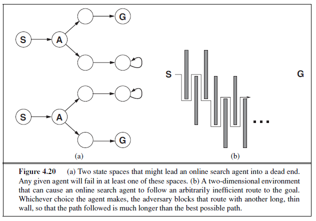
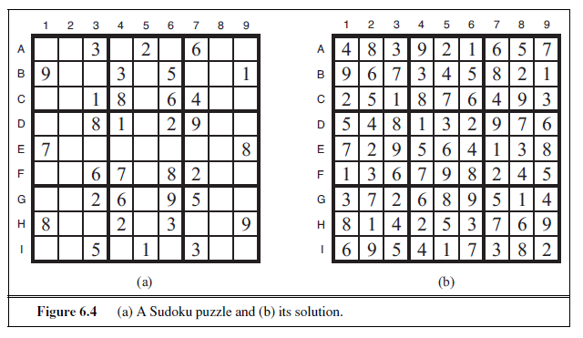

  

# SOLVING PROBLEMS BY SEARCHING

_In which we see how an agent can find a sequence of actions that achieves its goals when no single action will do._

The simplest agents discussed in Chapter 2 were the reflex agents, which base their actions on a direct mapping from states to actions. Such agents cannot operate well in environments for which this mapping would be too large to store and would take too long to learn. Goal-based agents, on the other hand, consider future actions and the desirability of their outcomes.

This chapter describes one kind of goal-based agent called a **problem-solving agent**. Problem-solving agents use **atomic** representations, as described in Section 2.4.7—that is, states of the world are considered as wholes, with no internal structure visible to the problemsolving algorithms. Goal-based agents that use more advanced **factored** or **structured** representations are usually called **planning agents** and are discussed in Chapters 7 and 10. 

Our discussion of problem solving begins with precise definitions of **problems** and their **solutions** and give several examples to illustrate these definitions. We then describe several general-purpose search algorithms that can be used to solve these problems. We will see several **uninformed** search algorithms—algorithms that are given no information about the problem other than its definition. Although some of these algorithms can solve any solvable problem, none of them can do so efficiently. **Informed** search algorithms, on the other hand, can do quite well given some guidance on where to look for solutions.

In this chapter, we limit ourselves to the simplest kind of task environment, for which the solution to a problem is always a _fixed sequence_ of actions. The more general case—where the agent’s future actions may vary depending on future percepts—is handled in Chapter 4.

This chapter uses the concepts of asymptotic complexity (that is, O() notation) and NP-completeness. Readers unfamiliar with these concepts should consult Appendix A.

## PROBLEM-SOLVING AGENTS

Intelligent agents are supposed to maximize their performance measure. As we mentioned in Chapter 2, achieving this is sometimes simplified if the agent can adopt a **goal** and aim at satisfying it. Let us first look at why and how an agent might do this. 

Imagine an agent in the city of Arad, Romania, enjoying a touring holiday. The agent’s performance measure contains many factors: it wants to improve its suntan, improve its Romanian, take in the sights, enjoy the nightlife (such as it is), avoid hangovers, and so on. The decision problem is a complex one involving many tradeoffs and careful reading of guidebooks. Now, suppose the agent has a nonrefundable ticket to fly out of Bucharest the following day. In that case, it makes sense for the agent to adopt the **goal** of getting to Bucharest. Courses of action that don’t reach Bucharest on time can be rejected without further consideration and the agent’s decision problem is greatly simplified. Goals help organize behavior by limiting the objectives that the agent is trying to achieve and hence the actions it needs to consider. **Goal formulation**, based on the current situation and the agent’s performance measure, is the first step in problem solving. 

We will consider a goal to be a set of world states—exactly those states in which the goal is satisfied. The agent’s task is to find out how to act, now and in the future, so that it reaches a goal state. Before it can do this, it needs to decide (or we need to decide on its behalf) what sorts of actions and states it should consider. If it were to consider actions at the level of “move the left foot forward an inch” or “turn the steering wheel one degree left,” the agent would probably never find its way out of the parking lot, let alone to Bucharest, because at that level of detail there is too much uncertainty in the world and there would be too many steps in a solution. **Problem formulation** is the process of deciding what actions and states to consider, given a goal. We discuss this process in more detail later. For now, let us assume that the agent will consider actions at the level of driving from one major town to another. Each state therefore corresponds to being in a particular town.

Our agent has now adopted the goal of driving to Bucharest and is considering where to go from Arad. Three roads lead out of Arad, one toward Sibiu, one to Timisoara, and one to Zerind. None of these achieves the goal, so unless the agent is familiar with the geography of Romania, it will not know which road to follow.1 In other words, the agent will not know which of its possible actions is best, because it does not yet know enough about the state that results from taking each action. If the agent has no additional information—i.e., if the environment is **unknown** in the sense defined in Section 2.3—then it is has no choice but to try one of the actions at random. This sad situation is discussed in Chapter 4.

But suppose the agent has a map of Romania. The point of a map is to provide the agent with information about the states it might get itself into and the actions it can take. The agent can use this information to consider _subsequent_ stages of a hypothetical journey via each of the three towns, trying to find a journey that eventually gets to Bucharest. Once it has found a path on the map from Arad to Bucharest, it can achieve its goal by carrying out the driving actions that correspond to the legs of the journey. In general, _an agent with several immediate options of unknown value can decide what to do by first examining_ future _actions that eventually lead to states of known value._

To be more specific about what we mean by “examining future actions,” we have to be more specific about properties of the environment, as defined in Section 2.3. For now, 
```
1 We are assuming that most readers are in the same position and can easily imagine themselves to be as clueless as our agent. We apologize to Romanian readers who are unable to take advantage of this pedagogical device.  
```
we assume that the environment is **observable**, so the agent always knows the current state. For the agent driving in Romania, it’s reasonable to suppose that each city on the map has a sign indicating its presence to arriving drivers. We also assume the environment is **discrete**, so at any given state there are only finitely many actions to choose from. This is true for navigating in Romania because each city is connected to a small number of other cities. We will assume the environment is **known**, so the agent knows which states are reached by each action. (Having an accurate map suffices to meet this condition for navigation problems.) Finally, we assume that the environment is **deterministic**, so each action has exactly one outcome. Under ideal conditions, this is true for the agent in Romania—it means that if it chooses to drive from Arad to Sibiu, it does end up in Sibiu. Of course, conditions are not always ideal, as we show in Chapter 4. 

_Under these assumptions, the solution to any problem is a fixed sequence of actions._ “Of course!” one might say, “What else could it be?” Well, in general it could be a branching strategy that recommends different actions in the future depending on what percepts arrive. For example, under less than ideal conditions, the agent might plan to drive from Arad to Sibiu and then to Rimnicu Vilcea but may also need to have a contingency plan in case it arrives by accident in Zerind instead of Sibiu. Fortunately, if the agent knows the initial state and the environment is known and deterministic, it knows exactly where it will be after the first action and what it will perceive. Since only one percept is possible after the first action, the solution can specify only one possible second action, and so on.

The process of looking for a sequence of actions that reaches the goal is called **search**. A search algorithm takes a problem as input and returns a **solution** in the form of an action sequence. Once a solution is found, the actions it recommends can be carried out. This is called the **execution** phase. Thus, we have a simple “formulate, search, execute” design for the agent, as shown in Figure 3.1. After formulating a goal and a problem to solve, the agent calls a search procedure to solve it. It then uses the solution to guide its actions, doing whatever the solution recommends as the next thing to do—typically, the first action of the sequence—and then removing that step from the sequence. Once the solution has been executed, the agent will formulate a new goal.

Notice that while the agent is executing the solution sequence it _ignores its percepts_ when choosing an action because it knows in advance what they will be. An agent that carries out its plans with its eyes closed, so to speak, must be quite certain of what is going on. Control theorists call this an **open-loop** system, because ignoring the percepts breaks the loop between agent and environment. We first describe the process of problem formulation, and then devote the bulk of the chapter to various algorithms for the SEARCH function. We do not discuss the workings of the UPDATE-STATE and FORMULATE-GOAL functions further in this chapter.

### Well-defined problems and solutions

A **problem** can be defined formally by five components:

- The **initial state** that the agent starts in. For example, the initial state for our agent in Romania might be described as In(Arad). 

**function** SIMPLE-PROBLEM-SOLVING-AGENT(percept ) **returns** an action 
**persistent**: seq , an action sequence, initially empty 
state, some description of the current world state 
goal , a goal, initially null 
problem , a problem formulation

state←UPDATE-STATE(state,percept ) 
**if** seq is empty **then**
goal← FORMULATE-GOAL(state) 
problem← FORMULATE-PROBLEM(state, goal ) 
seq← SEARCH(problem) 
**if** seq = failure **then return** a null action
action← FIRST(seq) 
seq←REST(seq) 
**return** action

**Figure 3.1** A simple problem-solving agent. It first formulates a goal and a problem, searches for a sequence of actions that would solve the problem, and then executes the actions one at a time. When this is complete, it formulates another goal and starts over.

- A description of the possible **actions** available to the agent. Given a particular state s,ACTIONS(s) returns the set of actions that can be executed in s. We say that each of these actions is **applicable** in s. For example, from the state In(Arad), the applicable actions are {Go(Sibiu),Go(Timisoara),Go(Zerind)}.

- A description of what each action does; the formal name for this is the **transition model**, specified by a function RESULT(s, a) that returns the state that results from doing action a in state s. We also use the term **successor** to refer to any state reachable from a given state by a single action.2 For example, we have

RESULT(In(Arad),Go(Zerind)) = In(Zerind) .

Together, the initial state, actions, and transition model implicitly define the **state space** of the problem—the set of all states reachable from the initial state by any sequence of actions. The state space forms a directed network or **graph** in which the nodes are states and the links between nodes are actions. (The map of Romania shown in Figure 3.2 can be interpreted as a state-space graph if we view each road as standing for two driving actions, one in each direction.) A **path** in the state space is a sequence of states connected by a sequence of actions.

- The **goal test**, which determines whether a given state is a goal state. Sometimes there is an explicit set of possible goal states, and the test simply checks whether the given state is one of them. The agent’s goal in Romania is the singleton set {In(Bucharest)}.
```
2 Many treatments of problem solving, including previous editions of this book, use a **successor function**, which returns the set of all successors, instead of separate ACTIONS and RESULT functions. The successor function makes it difficult to describe an agent that knows what actions it can try but not what they achieve. Also, note some author use RESULT(a, s) instead of RESULT(s, a), and some use DO instead of RESULT.  
```


Sometimes the goal is specified by an abstract property rather than an explicitly enumerated set of states. For example, in chess, the goal is to reach a state called “checkmate,” where the opponent’s king is under attack and can’t escape.

- A **path cost** function that assigns a numeric cost to each path. The problem-solving agent chooses a cost function that reflects its own performance measure. For the agent trying to get to Bucharest, time is of the essence, so the cost of a path might be its length in kilometers. In this chapter, we assume that the cost of a path can be described as the _sum_ of the costs of the individual actions along the path.3 The **step cost** of taking action a in state s to reach state s ′ is denoted by c(s, a, s′). The step costs for Romania are shown in Figure 3.2 as route distances. We assume that step costs are nonnegative.4

The preceding elements define a problem and can be gathered into a single data structure that is given as input to a problem-solving algorithm. A **solution** to a problem is an action sequence that leads from the initial state to a goal state. Solution quality is measured by the path cost function, and an **optimal solution** has the lowest path cost among all solutions.OPTIMAL SOLUTION

### Formulating problems

In the preceding section we proposed a formulation of the problem of getting to Bucharest in terms of the initial state, actions, transition model, goal test, and path cost. This formulation seems reasonable, but it is still a _model_—an abstract mathematical description—and not the 3 This assumption is algorithmically convenient but also theoretically justifiable—see page 649 in Chapter 17. 4 The implications of negative costs are explored in Exercise 3.8. real thing. Compare the simple state description we have chosen, _In(Arad)_, to an actual crosscountry trip, where the state of the world includes so many things: the traveling companions, the current radio program, the scenery out of the window, the proximity of law enforcement officers, the distance to the next rest stop, the condition of the road, the weather, and so on. All these considerations are left out of our state descriptions because they are irrelevant to the problem of finding a route to Bucharest. The process of removing detail from a representation is called **abstraction**.

In addition to abstracting the state description, we must abstract the actions themselves. A driving action has many effects. Besides changing the location of the vehicle and its occupants, it takes up time, consumes fuel, generates pollution, and changes the agent (as they say, travel is broadening). Our formulation takes into account only the change in location. Also, there are many actions that we omit altogether: turning on the radio, looking out of the window, slowing down for law enforcement officers, and so on. And of course, we don’t specify actions at the level of “turn steering wheel to the left by one degree.”

Can we be more precise about defining the appropriate level of abstraction? Think of the abstract states and actions we have chosen as corresponding to large sets of detailed world states and detailed action sequences. Now consider a solution to the abstract problem: for example, the path from Arad to Sibiu to Rimnicu Vilcea to Pitesti to Bucharest. This abstract solution corresponds to a large number of more detailed paths. For example, we could drive with the radio on between Sibiu and Rimnicu Vilcea, and then switch it off for the rest of the trip. The abstraction is _valid_ if we can expand any abstract solution into a solution in the more detailed world; a sufficient condition is that for every detailed state that is “in Arad,” there is a detailed path to some state that is “in Sibiu,” and so on.5 The abstraction is _useful_ if carrying out each of the actions in the solution is easier than the original problem; in this case they are easy enough that they can be carried out without further search or planning by an average driving agent. The choice of a good abstraction thus involves removing as much detail as possible while retaining validity and ensuring that the abstract actions are easy to carry out. Were it not for the ability to construct useful abstractions, intelligent agents would be completely swamped by the real world.

## EXAMPLE PROBLEMS

The problem-solving approach has been applied to a vast array of task environments. We list some of the best known here, distinguishing between _toy_ and _real-world_ problems. A **toy problem** is intended to illustrate or exercise various problem-solving methods. It can be given a concise, exact description and hence is usable by different researchers to compare the performance of algorithms. A **real-world problem** is one whose solutions people actually care about. Such problems tend not to have a single agreed-upon description, but we can give the general flavor of their formulations.
```
5 See Section 11.2 for a more complete set of definitions and algorithms.  
```


### Toy problems

The first example we examine is the **vacuum world** first introduced in Chapter 2. (See Figure 2.2.) This can be formulated as a problem as follows:

- **States**: The state is determined by both the agent location and the dirt locations. The agent is in one of two locations, each of which might or might not contain dirt. Thus, there are 2 × 2^2^ = 8 possible world states. A larger environment with n locations has n · 2^n^ states.

- **Initial state**: Any state can be designated as the initial state.

- **Actions**: In this simple environment, each state has just three actions: _Left_, _Right_, and _Suck_. Larger environments might also include _Up_ and _Down_.

- **Transition model**: The actions have their expected effects, except that moving _Left_ in the leftmost square, moving _Right_ in the rightmost square, and _Suck_ing in a clean square have no effect. The complete state space is shown in Figure 3.3.

- **Goal test**: This checks whether all the squares are clean.

- **Path cost**: Each step costs 1, so the path cost is the number of steps in the path.

Compared with the real world, this toy problem has discrete locations, discrete dirt, reliable cleaning, and it never gets any dirtier. Chapter 4 relaxes some of these assumptions.

The **8-puzzle**, an instance of which is shown in Figure 3.4, consists of a 3×3 board with eight numbered tiles and a blank space. A tile adjacent to the blank space can slide into the space. The object is to reach a specified goal state, such as the one shown on the right of the figure. The standard formulation is as follows:  


- **States**: A state description specifies the location of each of the eight tiles and the blank in one of the nine squares.

- **Initial state**: Any state can be designated as the initial state. Note that any given goal can be reached from exactly half of the possible initial states (Exercise 3.4).

- **Actions**: The simplest formulation defines the actions as movements of the blank space _Left_, _Right_, _Up_, or _Down_. Different subsets of these are possible depending on where the blank is.

- **Transition model**: Given a state and action, this returns the resulting state; for example, if we apply _Left_ to the start state in Figure 3.4, the resulting state has the 5 and the blank switched.

- **Goal test**: This checks whether the state matches the goal configuration shown in Figure 3.4. (Other goal configurations are possible.)

- **Path cost**: Each step costs 1, so the path cost is the number of steps in the path.

What abstractions have we included here? The actions are abstracted to their beginning and final states, ignoring the intermediate locations where the block is sliding. We have abstracted away actions such as shaking the board when pieces get stuck and ruled out extracting the pieces with a knife and putting them back again. We are left with a description of the rules of the puzzle, avoiding all the details of physical manipulations.

The 8-puzzle belongs to the family of **sliding-block puzzles**, which are often used as test problems for new search algorithms in AI. This family is known to be NP-complete, so one does not expect to find methods significantly better in the worst case than the search algorithms described in this chapter and the next. The 8-puzzle has 9!/2= 181, 440 reachable states and is easily solved. The 15-puzzle (on a 4×4 board) has around 1.3 trillion states, and random instances can be solved optimally in a few milliseconds by the best search algorithms. The 24-puzzle (on a 5 × 5 board) has around 1025 states, and random instances take several hours to solve optimally.

The goal of the **8-queens problem** is to place eight queens on a chessboard such that no queen attacks any other. (A queen attacks any piece in the same row, column or diagonal.) Figure 3.5 shows an attempted solution that fails: the queen in the rightmost column is attacked by the queen at the top left.  


Although efficient special-purpose algorithms exist for this problem and for the whole n-queens family, it remains a useful test problem for search algorithms. There are two main kinds of formulation. An **incremental formulation** involves operators that _augment_ the state description, starting with an empty state; for the 8-queens problem, this means that each action adds a queen to the state. A **complete-state formulation** starts with all 8 queens on the board and moves them around. In either case, the path cost is of no interest because only the final state counts. The first incremental formulation one might try is the following:

- **States**: Any arrangement of 0 to 8 queens on the board is a state.

- **Initial state**: No queens on the board.

- **Actions**: Add a queen to any empty square.

- **Transition model**: Returns the board with a queen added to the specified square.

- **Goal test**: 8 queens are on the board, none attacked.

In this formulation, we have 64 · 63 · · · 57 ≈ 1.8× 10^14^ possible sequences to investigate. A better formulation would prohibit placing a queen in any square that is already attacked:

- **States**: All possible arrangements of n queens (0 ≤ n ≤ 8), one per column in the leftmost n columns, with no queen attacking another.

- **Actions**: Add a queen to any square in the leftmost empty column such that it is not attacked by any other queen.

This formulation reduces the 8-queens state space from 1.8× 10^14^ to just 2,057, and solutions are easy to find. On the other hand, for 100 queens the reduction is from roughly 10^400^ states to about 10^52^ states (Exercise 3.5)—a big improvement, but not enough to make the problem tractable. Section 4.1 describes the complete-state formulation, and Chapter 6 gives a simple algorithm that solves even the million-queens problem with ease. Our final toy problem was devised by Donald Knuth (1964) and illustrates how infinite state spaces can arise. Knuth conjectured that, starting with the number 4, a sequence of factorial, square root, and floor operations will reach any desired positive integer. For example, we can reach 5 from 4 as follows:

⌊ √√√√√(4!)!⌋ = 5 .

The problem definition is very simple:

- **States**: Positive numbers.

- **Initial state**: 4.

- **Actions**: Apply factorial, square root, or floor operation (factorial for integers only).

- **Transition model**: As given by the mathematical definitions of the operations.

- **Goal test**: State is the desired positive integer.

To our knowledge there is no bound on how large a number might be constructed in the process of reaching a given target—for example, the number 620,448,401,733,239,439,360,000 is generated in the expression for 5—so the state space for this problem is infinite. Such state spaces arise frequently in tasks involving the generation of mathematical expressions, circuits, proofs, programs, and other recursively defined objects.

### Real-world problems

We have already seen how the **route-finding problem** is defined in terms of specified locations and transitions along links between them. Route-finding algorithms are used in a variety of applications. Some, such as Web sites and in-car systems that provide driving directions, are relatively straightforward extensions of the Romania example. Others, such as routing video streams in computer networks, military operations planning, and airline travel-planning systems, involve much more complex specifications. Consider the airline travel problems that must be solved by a travel-planning Web site:

- **States**: Each state obviously includes a location (e.g., an airport) and the current time. Furthermore, because the cost of an action (a flight segment) may depend on previous segments, their fare bases, and their status as domestic or international, the state must record extra information about these “historical” aspects.

- **Initial state**: This is specified by the user’s query.

- **Actions**: Take any flight from the current location, in any seat class, leaving after the current time, leaving enough time for within-airport transfer if needed.

- **Transition model**: The state resulting from taking a flight will have the flight’s destination as the current location and the flight’s arrival time as the current time.

- **Goal test**: Are we at the final destination specified by the user?

- **Path cost**: This depends on monetary cost, waiting time, flight time, customs and immigration procedures, seat quality, time of day, type of airplane, frequent-flyer mileage awards, and so on.  


Commercial travel advice systems use a problem formulation of this kind, with many additional complications to handle the byzantine fare structures that airlines impose. Any seasoned traveler knows, however, that not all air travel goes according to plan. A really good system should include contingency plans—such as backup reservations on alternate flights— to the extent that these are justified by the cost and likelihood of failure of the original plan.

**Touring problems** are closely related to route-finding problems, but with an important difference. Consider, for example, the problem “Visit every city in Figure 3.2 at least once, starting and ending in Bucharest.” As with route finding, the actions correspond to trips between adjacent cities. The state space, however, is quite different. Each state must include not just the current location but also the _set of cities the agent has visited_. So the initial state would be In(Bucharest),Visited({Bucharest}), a typical intermediate state would be In(Vaslui),Visited({Bucharest ,Urziceni ,Vaslui}), and the goal test would check whether the agent is in Bucharest and all 20 cities have been visited.

The **traveling salesperson problem** (TSP) is a touring problem in which each city must be visited exactly once. The aim is to find the _shortest_ tour. The problem is known to be NP-hard, but an enormous amount of effort has been expended to improve the capabilities of TSP algorithms. In addition to planning trips for traveling salespersons, these algorithms have been used for tasks such as planning movements of automatic circuit-board drills and of stocking machines on shop floors.

A **VLSI layout** problem requires positioning millions of components and connections on a chip to minimize area, minimize circuit delays, minimize stray capacitances, and maximize manufacturing yield. The layout problem comes after the logical design phase and is usually split into two parts: **cell layout** and **channel routing**. In cell layout, the primitive components of the circuit are grouped into cells, each of which performs some recognized function. Each cell has a fixed footprint (size and shape) and requires a certain number of connections to each of the other cells. The aim is to place the cells on the chip so that they do not overlap and so that there is room for the connecting wires to be placed between the cells. Channel routing finds a specific route for each wire through the gaps between the cells. These search problems are extremely complex, but definitely worth solving. Later in this chapter, we present some algorithms capable of solving them.

**Robot navigation** is a generalization of the route-finding problem described earlier.Rather than following a discrete set of routes, a robot can move in a continuous space with (in principle) an infinite set of possible actions and states. For a circular robot moving on a flat surface, the space is essentially two-dimensional. When the robot has arms and legs or wheels that must also be controlled, the search space becomes many-dimensional. Advanced techniques are required just to make the search space finite. We examine some of these methods in Chapter 25. In addition to the complexity of the problem, real robots must also deal with errors in their sensor readings and motor controls.

**Automatic assembly sequencing** of complex objects by a robot was first demonstrated by FREDDY (Michie, 1972). Progress since then has been slow but sure, to the point where the assembly of intricate objects such as electric motors is economically feasible. In assembly problems, the aim is to find an order in which to assemble the parts of some object. If the wrong order is chosen, there will be no way to add some part later in the sequence without undoing some of the work already done. Checking a step in the sequence for feasibility is a difficult geometrical search problem closely related to robot navigation. Thus, the generation of legal actions is the expensive part of assembly sequencing. Any practical algorithm must avoid exploring all but a tiny fraction of the state space. Another important assembly problem is **protein design**, in which the goal is to find a sequence of amino acids that will fold into a three-dimensional protein with the right properties to cure some disease.

## SEARCHING FOR SOLUTIONS

Having formulated some problems, we now need to solve them. A solution is an action sequence, so search algorithms work by considering various possible action sequences. The possible action sequences starting at the initial state form a **search tree** with the initial stateat the root; the branches are actions and the **nodes** correspond to states in the state space of the problem. Figure 3.6 shows the first few steps in growing the search tree for finding a route from Arad to Bucharest. The root node of the tree corresponds to the initial state, _In(Arad)_. The first step is to test whether this is a goal state. (Clearly it is not, but it is important to check so that we can solve trick problems like “starting in Arad, get to Arad.”) Then we need to consider taking various actions. We do this by **expanding** the current state; that is,applying each legal action to the current state, thereby **generating** a new set of states. In this case, we add three branches from the **parent node** _In(Arad)_ leading to three new **child****nodes**: _In(Sibiu), In(Timisoara),_ and _In(Zerind)_. Now we must choose which of these three possibilities to consider further. 

This is the essence of search—following up one option now and putting the others aside for later, in case the first choice does not lead to a solution. Suppose we choose Sibiu first. We check to see whether it is a goal state (it is not) and then expand it to get _In(Arad)_, _In(Fagaras)_, _In(Oradea)_, and _In(RimnicuVilcea)_. We can then choose any of these four or go back and choose Timisoara or Zerind. Each of these six nodes is a **leaf node**, that is, a node with no children in the tree. The set of all leaf nodes available for expansion at any given point is called the **frontier**. (Many authors call it the **open list**, which is both geographically OPEN LIST less evocative and less accurate, because other data structures are better suited than a list.) In Figure 3.6, the frontier of each tree consists of those nodes with bold outlines.

The process of expanding nodes on the frontier continues until either a solution is found or there are no more states to expand. The general TREE-SEARCH algorithm is shown informally in Figure 3.7. Search algorithms all share this basic structure; they vary primarily according to how they choose which state to expand next—the so-called **search strategy**.

The eagle-eyed reader will notice one peculiar thing about the search tree shown in Figure 3.6: it includes the path from Arad to Sibiu and back to Arad again! We say that _In(Arad)_ is a **repeated state** in the search tree, generated in this case by a **loopy path**. Considering such loopy paths means that the complete search tree for Romania is _infinite_ because there is no limit to how often one can traverse a loop. On the other hand, the state space—the map shown in Figure 3.2—has only 20 states. As we discuss in Section 3.4, loops can cause certain algorithms to fail, making otherwise solvable problems unsolvable. Fortunately, there is no need to consider loopy paths. We can rely on more than intuition for this: because path costs are additive and step costs are nonnegative, a loopy path to any given state is never better than the same path with the loop removed.

Loopy paths are a special case of the more general concept of **redundant paths**, which exist whenever there is more than one way to get from one state to another. Consider the paths Arad–Sibiu (140 km long) and Arad–Zerind–Oradea–Sibiu (297 km long). Obviously, the second path is redundant—it’s just a worse way to get to the same state. If you are concerned about reaching the goal, there’s never any reason to keep more than one path to any given state, because any goal state that is reachable by extending one path is also reachable by extending the other.

In some cases, it is possible to define the problem itself so as to eliminate redundant paths. For example, if we formulate the 8-queens problem (page 71) so that a queen can be placed in any column, then each state with n queens can be reached by n! different paths; but if we reformulate the problem so that each new queen is placed in the leftmost empty column, then each state can be reached only through one path.


In other cases, redundant paths are unavoidable. This includes all problems where the actions are reversible, such as route-finding problems and sliding-block puzzles. Routefinding on a **rectangular grid** (like the one used later for Figure 3.9) is a particularly important example in computer games. In such a grid, each state has four successors, so a search tree of depth d that includes repeated states has 4d leaves; but there are only about 2d2 distinct states within d steps of any given state. For d = 20, this means about a trillion nodes but only about 800 distinct states. Thus, following redundant paths can cause a tractable problem to become intractable. This is true even for algorithms that know how to avoid infinite loops.

As the saying goes, _algorithms that forget their history are doomed to repeat it._ The way to avoid exploring redundant paths is to remember where one has been. To do this, we augment the TREE-SEARCH algorithm with a data structure called the **explored set** (also known as the **closed list**), which remembers every expanded node. Newly generated nodes that match previously generated nodes—ones in the explored set or the frontier—can be discarded instead of being added to the frontier. The new algorithm, called GRAPH-SEARCH, is shown informally in Figure 3.7. The specific algorithms in this chapter draw on this general design.

Clearly, the search tree constructed by the GRAPH-SEARCH algorithm contains at most one copy of each state, so we can think of it as growing a tree directly on the state-space graph, as shown in Figure 3.8. The algorithm has another nice property: the frontier **separates** the state-space graph into the explored region and the unexplored region, so that every path from  


the initial state to an unexplored state has to pass through a state in the frontier. (If this seems completely obvious, try Exercise 3.13 now.) This property is illustrated in Figure 3.9. As every step moves a state from the frontier into the explored region while moving some states from the unexplored region into the frontier, we see that the algorithm is _systematically_ examining the states in the state space, one by one, until it finds a solution.

### Infrastructure for search algorithms

Search algorithms require a data structure to keep track of the search tree that is being constructed. For each node n of the tree, we have a structure that contains four components:

- n.STATE: the state in the state space to which the node corresponds;

- n.PARENT: the node in the search tree that generated this node;

- n.ACTION: the action that was applied to the parent to generate the node;

- n.PATH-COST: the cost, traditionally denoted by g(n), of the path from the initial state to the node, as indicated by the parent pointers.  


Given the components for a parent node, it is easy to see how to compute the necessary components for a child node. The function CHILD-NODE takes a parent node and an action and returns the resulting child node:

**function** CHILD-NODE(problem ,parent ,action) **returns** a node 
**return** a node with
  STATE = problem .RESULT(parent .STATE,action ), PARENT = parent , ACTION = action , 
  PATH-COST = parent .PATH-COST + problem .STEP-COST(parent .STATE,action )

The node data structure is depicted in Figure 3.10. Notice how the PARENT pointers string the nodes together into a tree structure. These pointers also allow the solution path to be extracted when a goal node is found; we use the SOLUTION function to return the sequence of actions obtained by following parent pointers back to the root.

Up to now, we have not been very careful to distinguish between nodes and states, but in writing detailed algorithms it’s important to make that distinction. A node is a bookkeeping data structure used to represent the search tree. A state corresponds to a configuration of the world. Thus, nodes are on particular paths, as defined by PARENT pointers, whereas states are not. Furthermore, two different nodes can contain the same world state if that state is generated via two different search paths.

Now that we have nodes, we need somewhere to put them. The frontier needs to be stored in such a way that the search algorithm can easily choose the next node to expand according to its preferred strategy. The appropriate data structure for this is a **queue**. TheQUEUE

operations on a queue are as follows:

- EMPTY?(queue) returns true only if there are no more elements in the queue.

- POP(queue) removes the first element of the queue and returns it.

- INSERT(element , queue) inserts an element and returns the resulting queue.  


Queues are characterized by the _order_ in which they store the inserted nodes. Three common variants are the first-in, first-out or **FIFO queue**, which pops the _oldest_ element of the queue; the last-in, first-out or **LIFO queue** (also known as a **stack**), which pops the _newest_ element of the queue; and the **priority queue**, which pops the element of the queue with the highest priority according to some ordering function. 

The explored set can be implemented with a hash table to allow efficient checking forepeated states. With a good implementation, insertion and lookup can be done in roughly constant time no matter how many states are stored. One must take care to implement the hash table with the right notion of equality between states. For example, in the traveling salesperson problem (page 74), the hash table needs to know that the set of visited cities {Bucharest,Urziceni,Vaslui} is the same as {Urziceni,Vaslui,Bucharest}. Sometimes this can be achieved most easily by insisting that the data structures for states be in some **canonical form**; that is, logically equivalent states should map to the same data structure. In the case of states described by sets, for example, a bit-vector representation or a sorted list without repetition would be canonical, whereas an unsorted list would not.

### Measuring problem-solving performance

Before we get into the design of specific search algorithms, we need to consider the criteria that might be used to choose among them. We can evaluate an algorithm’s performance in four ways:

- **Completeness**: Is the algorithm guaranteed to find a solution when there is one?

- **Optimality**: Does the strategy find the optimal solution, as defined on page 68?

- **Time complexity**: How long does it take to find a solution?

- **Space complexity**: How much memory is needed to perform the search?

Time and space complexity are always considered with respect to some measure of the problem difficulty. In theoretical computer science, the typical measure is the size of the state space graph, |V | + |E|, where V is the set of vertices (nodes) of the graph and E is the set of edges (links). This is appropriate when the graph is an explicit data structure that is input to the search program. (The map of Romania is an example of this.) In AI, the graph is often represented _implicitly_ by the initial state, actions, and transition model and is frequently infinite. For these reasons, complexity is expressed in terms of three quantities: b, the **branching factor** or maximum number of successors of any node; d, the **depth** of the shallowest goal node (i.e., the number of steps along the path from the root); and m, the maximum length of any path in the state space. Time is often measured in terms of the number of nodes generated during the search, and space in terms of the maximum number of nodes stored in memory. For the most part, we describe time and space complexity for search on a tree; for a graph, the answer depends on how “redundant” the paths in the state space are.

To assess the effectiveness of a search algorithm, we can consider just the **search cost**— which typically depends on the time complexity but can also include a term for memory usage—or we can use the **total cost**, which combines the search cost and the path cost of the solution found. For the problem of finding a route from Arad to Bucharest, the search cost is the amount of time taken by the search and the solution cost is the total length of the path in kilometers. Thus, to compute the total cost, we have to add milliseconds and kilometers. There is no “official exchange rate” between the two, but it might be reasonable in this case to convert kilometers into milliseconds by using an estimate of the car’s average speed (because time is what the agent cares about). This enables the agent to find an optimal tradeoff point at which further computation to find a shorter path becomes counterproductive. The more general problem of tradeoffs between different goods is taken up in Chapter 16.

## UNINFORMED SEARCH STRATEGIES

This section covers several search strategies that come under the heading of **uninformed search** (also called **blind search**). The term means that the strategies have no additional information about states beyond that provided in the problem definition. All they can do is generate successors and distinguish a goal state from a non-goal state. All search strategies are distinguished by the _order_ in which nodes are expanded. Strategies that know whether one non-goal state is “more promising” than another are called **informed search** or **heuristic** **search** strategies; they are covered in Section 3.5.

### Breadth-first search

**Breadth-first search** is a simple strategy in which the root node is expanded first, then all the
successors of the root node are expanded next, then _their_ successors, and so on. In general, all the nodes are expanded at a given depth in the search tree before any nodes at the next level are expanded.

Breadth-first search is an instance of the general graph-search algorithm (Figure 3.7) in which the _shallowest_ unexpanded node is chosen for expansion. This is achieved very simply by using a FIFO queue for the frontier. Thus, new nodes (which are always deeper than their parents) go to the back of the queue, and old nodes, which are shallower than the new nodes, get expanded first. There is one slight tweak on the general graph-search algorithm, which is that the goal test is applied to each node when it is _generated_ rather than when it is selected for expansion. This decision is explained below, where we discuss time complexity. Note also that the algorithm, following the general template for graph search, discards any new path to a state already in the frontier or explored set; it is easy to see that any such path must be at least as deep as the one already found. Thus, breadth-first search always has the shallowest path to every node on the frontier 

Pseudocode is given in Figure 3.11. Figure 3.12 shows the progress of the search on a simple binary tree.

How does breadth-first search rate according to the four criteria from the previous section? We can easily see that it is _complete_—if the shallowest goal node is at some finite depth d, breadth-first search will eventually find it after generating all shallower nodes (provided the branching factor b is finite). Note that as soon as a goal node is generated, we know it is the shallowest goal node because all shallower nodes must have been generated already and failed the goal test. Now, the _shallowest_ goal node is not necessarily the _optimal_ one;  


**function** BREADTH-FIRST-SEARCH(problem
**returns** a solution, or failure

node← a node with STATE = problem .INITIAL-STATE, PATH-COST = 0 
**if** problem .GOAL-TEST(node .STATE) **then return** SOLUTION(node) 
frontier← a FIFO queue with node as the only element 
explored← an empty set  
**loop do**
  **if** EMPTY?( frontier ) **then return** failure node← POP( frontier ) /* chooses the shallowest node in frontier */ 
  add node .STATE to explored
  **for each** action **in** problem .ACTIONS(node.STATE) **do** 
    child←CHILD-NODE(problem ,node ,action) 
    **if** child .STATE is not in explored or frontier **then**
      **if** problem .GOAL-TEST(child .STATE) **then return** SOLUTION(child ) 
    frontier← INSERT(child , frontier )

**Figure 3.11** Breadth-first search on a graph.

technically, breadth-first search is optimal if the path cost is a nondecreasing function of the depth of the node. The most common such scenario is that all actions have the same cost.

So far, the news about breadth-first search has been good. The news about time and space is not so good. Imagine searching a uniform tree where every state has b successors. The root of the search tree generates b nodes at the first level, each of which generates b more nodes, for a total of b

2 at the second level. Each of _these_ generates b more nodes, yielding b 3

nodes at the third level, and so on. Now suppose that the solution is at depth d. In the worst case, it is the last node generated at that level. Then the total number of nodes generated is

b + b^2^ + b^3^ + · · ·+ bd = O(bd ) .

(If the algorithm were to apply the goal test to nodes when selected for expansion, rather than when generated, the whole layer of nodes at depth d would be expanded before the goal was detected and the time complexity would be O(b^d+1^).)

As for space complexity: for any kind of graph search, which stores every expanded node in the explored set, the space complexity is always within a factor of b of the time complexity. For breadth-first graph search in particular, every node generated remains in memory. There will be O(b^d−1^) nodes in the explored set and O(bd) nodes in the frontier,


so the space complexity is O(bd), i.e., it is dominated by the size of the frontier. Switching to a tree search would not save much space, and in a state space with many redundant paths, switching could cost a great deal of time.

An exponential complexity bound such as O(bd) is scary. Figure 3.13 shows why. It lists, for various values of the solution depth d, the time and memory required for a breadthfirst search with branching factor b = 10. The table assumes that 1 million nodes can be generated per second and that a node requires 1000 bytes of storage. Many search problems fit roughly within these assumptions (give or take a factor of 100) when run on a modern personal computer.

| Depth | Nodes | Time |Memory|
|----|---|-----|----|
|2 |110 |.11 milliseconds |107 kilobytes |
|4 |11,110 |11 milliseconds |10.6 megabytes| 
|6 |10^6^ |1.1 seconds |1 gigabyte |
|8|10^8^ |2 minutes |103 gigabytes|
|10 |10^10^ |3 hours |10 terabytes |
|12| 10^12^ |13 days |1 petabyte |
|14 |10^14^ |3.5 years |99 petabytes |
|16 |10^16^ |350 years |10 exabytes|

**Figure 3.13** Time and memory requirements for breadth-first search. The numbers shown assume branching factor b = 10; 1 million nodes/second; 1000 bytes/node.

Two lessons can be learned from Figure 3.13. First, _the memory requirements are a bigger problem for breadth-first search than is the execution time._ One might wait 13 days for the solution to an important problem with search depth 12, but no personal computer has the petabyte of memory it would take. Fortunately, other strategies require less memory.

The second lesson is that time is still a major factor. If your problem has a solution at depth 16, then (given our assumptions) it will take about 350 years for breadth-first search (or indeed any uninformed search) to find it. In general, _exponential-complexity search problems cannot be solved by uninformed methods for any but the smallest instances._

### Uniform-cost search

When all step costs are equal, breadth-first search is optimal because it always expands the _shallowest_ unexpanded node. By a simple extension, we can find an algorithm that is optimal with any step-cost function. Instead of expanding the shallowest node, **uniform-cost search** expands the node n with the _lowest path cost_ g(n). This is done by storing the frontier as a priority queue ordered by g. The algorithm is shown in Figure 3.14.

In addition to the ordering of the queue by path cost, there are two other significant differences from breadth-first search. The first is that the goal test is applied to a node when it is _selected for expansion_ (as in the generic graph-search algorithm shown in Figure 3.7) rather than when it is first generated. The reason is that the first goal node that is _generated_  


**function** UNIFORM-COST-SEARCH(problem) **returns** a solution, or failure
node← a node with STATE = problem .INITIAL-STATE, PATH-COST = 0 
frontier← a priority queue ordered by PATH-COST, with node as the only element 
explored← an empty set 
**loop do**
**if** EMPTY?( frontier ) **then return** failure
node← POP( frontier ) /* chooses the lowest-cost node in frontier */ 
**if** problem .GOAL-TEST(node.STATE) **then return** SOLUTION(node) 
add node .STATE to explored
**for each** action **in** problem .ACTIONS(node.STATE) **do** 
child←CHILD-NODE(problem ,node ,action) 
**if** child .STATE is not in explored or frontier **then**
frontier← INSERT(child , frontier ) 
**else if** child .STATE is in frontier with higher PATH-COST **then**
replace that frontier node with child

**Figure 3.14** Uniform-cost search on a graph. The algorithm is identical to the general graph search algorithm in Figure 3.7, except for the use of a priority queue and the addition of an extra check in case a shorter path to a frontier state is discovered. The data structure for frontier needs to support efficient membership testing, so it should combine the capabilities of a priority queue and a hash table.


may be on a suboptimal path. The second difference is that a test is added in case a better path is found to a node currently on the frontier.

Both of these modifications come into play in the example shown in Figure 3.15, where the problem is to get from Sibiu to Bucharest. The successors of Sibiu are Rimnicu Vilcea and Fagaras, with costs 80 and 99, respectively. The least-cost node, Rimnicu Vilcea, is expanded next, adding Pitesti with cost 80 + 97= 177. The least-cost node is now Fagaras, so it is expanded, adding Bucharest with cost 99 + 211= 310. Now a goal node has been generated, but uniform-cost search keeps going, choosing Pitesti for expansion and adding a second path to Bucharest with cost 80+97+101= 278. Now the algorithm checks to see if this new path is better than the old one; it is, so the old one is discarded. Bucharest, now with g-cost 278, is selected for expansion and the solution is returned.

It is easy to see that uniform-cost search is optimal in general. First, we observe that whenever uniform-cost search selects a node n for expansion, the optimal path to that node has been found. (Were this not the case, there would have to be another frontier node n′ on the optimal path from the start node to n, by the graph separation property of Figure 3.9; by definition, n′ would have lower g-cost than n and would have been selected first.) Then, because step costs are nonnegative, paths never get shorter as nodes are added. These two facts together imply that _uniform-cost search expands nodes in order of their optimal path cost._ Hence, the first goal node selected for expansion must be the optimal solution.

Uniform-cost search does not care about the _number_ of steps a path has, but only about their total cost. Therefore, it will get stuck in an infinite loop if there is a path with an infinite sequence of zero-cost actions—for example, a sequence of NoOp actions.6 Completeness is guaranteed provided the cost of every step exceeds some small positive constant ε.

Uniform-cost search is guided by path costs rather than depths, so its complexity is not easily characterized in terms of b and d. Instead, let C∗ be the cost of the optimal solution,7and assume that every action costs at least ε. Then the algorithm’s worst-case time and space complexity is O(b^1+[C∗ε]^), which can be much greater than bd. This is because uniformcost search can explore large trees of small steps before exploring paths involving large and perhaps useful steps. When all step costs are equal, b^1+[C∗ε]^ is just b^d+1^. When all step costs are the same, uniform-cost search is similar to breadth-first search, except that the latter stops as soon as it generates a goal, whereas uniform-cost search examines all the nodes at the goal’s depth to see if one has a lower cost; thus uniform-cost search does strictly more work by expanding nodes at depth d unnecessarily.

### Depth-first search

**Depth-first search** always expands the _deepest_ node in the current frontier of the search tree.
The progress of the search is illustrated in Figure 3.16. The search proceeds immediately to the deepest level of the search tree, where the nodes have no successors. As those nodes are expanded, they are dropped from the frontier, so then the search “backs up” to the next deepest node that still has unexplored successors.

The depth-first search algorithm is an instance of the graph-search algorithm in Figure 3.7; whereas breadth-first-search uses a FIFO queue, depth-first search uses a LIFO queue. A LIFO queue means that the most recently generated node is chosen for expansion. This must be the deepest unexpanded node because it is one deeper than its parent—which, in turn, was the deepest unexpanded node when it was selected.

As an alternative to the GRAPH-SEARCH-style implementation, it is common to implement depth-first search with a recursive function that calls itself on each of its children in turn. (A recursive depth-first algorithm incorporating a depth limit is shown in Figure 3.17.)

6 NoOp, or “no operation,” is the name of an assembly language instruction that does nothing. 7 Here, and throughout the book, the “star” in C∗ means an optimal value for C.  


The properties of depth-first search depend strongly on whether the graph-search or tree-search version is used. The graph-search version, which avoids repeated states and redundant paths, is complete in finite state spaces because it will eventually expand every node. The tree-search version, on the other hand, is _not_ complete—for example, in Figure 3.6 the algorithm will follow the Arad–Sibiu–Arad–Sibiu loop forever. Depth-first tree search can be modified at no extra memory cost so that it checks new states against those on the path from the root to the current node; this avoids infinite loops in finite state spaces but does not avoid the proliferation of redundant paths. In infinite state spaces, both versions fail if an infinite non-goal path is encountered. For example, in Knuth’s 4 problem, depth-first search would keep applying the factorial operator forever.

For similar reasons, both versions are nonoptimal. For example, in Figure 3.16, depthfirst search will explore the entire left subtree even if node C is a goal node. If node J were also a goal node, then depth-first search would return it as a solution instead of C , which would be a better solution; hence, depth-first search is not optimal.  

The time complexity of depth-first graph search is bounded by the size of the state space (which may be infinite, of course). A depth-first tree search, on the other hand, may generate all of the O(bm) nodes in the search tree, where m is the maximum depth of any node; this can be much greater than the size of the state space. Note that m itself can be much larger than d (the depth of the shallowest solution) and is infinite if the tree is unbounded.

So far, depth-first search seems to have no clear advantage over breadth-first search, so why do we include it? The reason is the space complexity. For a graph search, there is no advantage, but a depth-first tree search needs to store only a single path from the root to a leaf node, along with the remaining unexpanded sibling nodes for each node on the path. Once a node has been expanded, it can be removed from memory as soon as all its descendants have been fully explored. (See Figure 3.16.) For a state space with branching factor b and maximum depth m, depth-first search requires storage of only O(bm) nodes. Using the same assumptions as for Figure 3.13 and assuming that nodes at the same depth as the goal node have no successors, we find that depth-first search would require 156 kilobytes instead of 10 exabytes at depth d = 16, a factor of 7 trillion times less space. This has led to the adoption of depth-first tree search as the basic workhorse of many areas of AI, including constraint satisfaction (Chapter 6), propositional satisfiability (Chapter 7), and logic programming (Chapter 9). For the remainder of this section, we focus primarily on the treesearch version of depth-first search.

A variant of depth-first search called **backtracking search** uses still less memory. (See Chapter 6 for more details.) In backtracking, only one successor is generated at a time rather than all successors; each partially expanded node remembers which successor to generate next. In this way, only O(m) memory is needed rather than O(bm). Backtracking search facilitates yet another memory-saving (and time-saving) trick: the idea of generating a successor by _modifying_ the current state description directly rather than copying it first. This reduces the memory requirements to just one state description and O(m) actions. For this to work, we must be able to undo each modification when we go back to generate the next successor. For problems with large state descriptions, such as robotic assembly, these techniques are critical to success.

### Depth-limited search

The embarrassing failure of depth-first search in infinite state spaces can be alleviated by supplying depth-first search with a predetermined depth limit λ. That is, nodes at depth λ are treated as if they have no successors. This approach is called **depth-limited search**. The depth limit solves the infinite-path problem. Unfortunately, it also introduces an additional source of incompleteness if we choose λ < d, that is, the shallowest goal is beyond the depth limit. (This is likely when d is unknown.) Depth-limited search will also be nonoptimal if we choose λ > d. Its time complexity is O(bλ) and its space complexity is O(bλ). Depth-first search can be viewed as a special case of depth-limited search with λ=∞.

Sometimes, depth limits can be based on knowledge of the problem. For example, on the map of Romania there are 20 cities. Therefore, we know that if there is a solution, it must be of length 19 at the longest, so λ = 19 is a possible choice. But in fact if we studied the  


**function** DEPTH-LIMITED-SEARCH(problem , limit ) **returns** a solution, or failure/cutoff **return** RECURSIVE-DLS(MAKE-NODE(problem .INITIAL-STATE),problem , limit )

**function** RECURSIVE-DLS(node,problem , limit ) **returns** a solution, or failure/cutoff 
**if** problem .GOAL-TEST(node .STATE) **then return** SOLUTION(node) 
**else if** limit = 0 **then return** cutoff

**else** 
cutoff occurred?← false 
**for each** action **in** problem .ACTIONS(node.STATE) **do**

child←CHILD-NODE(problem ,node ,action
result←RECURSIVE-DLS(child ,problem , limit − 1
**if** result = cutoff **then** cutoff occurred?← true 
**else if** result ≠ failure **then return** result

**if** cutoff occurred? **then return** cutoff **else return** failure

**Figure 3.17** A recursive implementation of depth-limited tree search.


map carefully, we would discover that any city can be reached from any other city in at most 9 steps. This number, known as the **diameter** of the state space, gives us a better depth limit,which leads to a more efficient depth-limited search. For most problems, however, we will not know a good depth limit until we have solved the problem.

Depth-limited search can be implemented as a simple modification to the general treeor graph-search algorithm. Alternatively, it can be implemented as a simple recursive algorithm as shown in Figure 3.17. Notice that depth-limited search can terminate with two kinds of failure: the standard failure value indicates no solution; the cutoff value indicates no solution within the depth limit.

### Iterative deepening depth-first search

**Iterative deepening search** (or iterative deepening depth-first search) is a general strategy often used in combination with depth-first tree search, that finds the best depth limit. It does this by gradually increasing the limit—first 0, then 1, then 2, and so on—until a goal is found. This will occur when the depth limit reaches d, the depth of the shallowest goal node. The algorithm is shown in Figure 3.18. Iterative deepening combines the benefits of depth-first and breadth-first search. Like depth-first search, its memory requirements are modest: O(bd) to be precise. Like breadth-first search, it is complete when the branching factor is finite and optimal when the path cost is a nondecreasing function of the depth of the node. Figure 3.19 shows four iterations of ITERATIVE-DEEPENING-SEARCH on a binary search tree, where the solution is found on the fourth iteration.

Iterative deepening search may seem wasteful because states are generated multiple times. It turns out this is not too costly. The reason is that in a search tree with the same (or nearly the same) branching factor at each level, most of the nodes are in the bottom level, so it does not matter much that the upper levels are generated multiple times. In an iterative deepening search, the nodes on the bottom level (depth d) are generated once, those on the  


**function** ITERATIVE-DEEPENING-SEARCH(problem) **returns** a solution, or failure 
**for** depth = 0 **to**∞ **do**
result←DEPTH-LIMITED-SEARCH(problem ,depth) 
**if** result ≠ cutoff **then return** result

**Figure 3.18** The iterative deepening search algorithm, which repeatedly applies depthlimited search with increasing limits. It terminates when a solution is found or if the depthlimited search returns failure , meaning that no solution exists.


next-to-bottom level are generated twice, and so on, up to the children of the root, which are generated d times. So the total number of nodes generated in the worst case is

N(IDS) = (d)b + (d− 1)b^2^ + · · ·+ (1)b^d^ ,

which gives a time complexity of O(bd)—asymptotically the same as breadth-first search. There is some extra cost for generating the upper levels multiple times, but it is not large. For example, if b = 10 and d = 5, the numbers are

N(IDS) = 50 + 400 + 3, 000 + 20, 000 + 100, 000 = 123, 450

N(BFS) = 10 + 100 + 1, 000 + 10, 000 + 100, 000 = 111, 110 .

If you are really concerned about repeating the repetition, you can use a hybrid approach that runs breadth-first search until almost all the available memory is consumed, and then runs iterative deepening from all the nodes in the frontier. _In general, iterative deepening is the preferred uninformed search method when the search space is large and the depth of the solution is not known._

Iterative deepening search is analogous to breadth-first search in that it explores a complete layer of new nodes at each iteration before going on to the next layer. It would seem worthwhile to develop an iterative analog to uniform-cost search, inheriting the latter algorithm’s optimality guarantees while avoiding its memory requirements. The idea is to use increasing path-cost limits instead of increasing depth limits. The resulting algorithm, called **iterative lengthening search**, is explored in Exercise 3.17. It turns out, unfortunately, that iterative lengthening incurs substantial overhead compared to uniform-cost search.

### Bidirectional search

The idea behind bidirectional search is to run two simultaneous searches—one forward from the initial state and the other backward from the goal—hoping that the two searches meet in the middle (Figure 3.20). The motivation is that b^d/2^+ b^d/2^is much less than b^d^, or in the figure, the area of the two small circles is less than the area of one big circle centered on the start and reaching to the goal.

Bidirectional search is implemented by replacing the goal test with a check to see whether the frontiers of the two searches intersect; if they do, a solution has been found. (It is important to realize that the first such solution found may not be optimal, even if the two searches are both breadth-first; some additional search is required to make sure there isn’t another short-cut across the gap.) The check can be done when each node is generated or selected for expansion and, with a hash table, will take constant time. For example, if a problem has solution depth d= 6, and each direction runs breadth-first search one node at a time, then in the worst case the two searches meet when they have generated all of the nodes at depth 3. For b= 10, this means a total of 2,220 node generations, compared with 1,111,110 for a standard breadth-first search. Thus, the time complexity of bidirectional search using breadth-first searches in both directions is O(bd/2). The space complexity is also O(bd/2). We can reduce this by roughly half if one of the two searches is done by iterative deepening, but at least one of the frontiers must be kept in memory so that the intersection check can be done. This space requirement is the most significant weakness of bidirectional search.  


The reduction in time complexity makes bidirectional search attractive, but how do we search backward? This is not as easy as it sounds. Let the **predecessors** of a state x be all those states that have x as a successor. Bidirectional search requires a method for computing predecessors. When all the actions in the state space are reversible, the predecessors of x are just its successors. Other cases may require substantial ingenuity.

Consider the question of what we mean by “the goal” in searching “backward from the goal.” For the 8-puzzle and for finding a route in Romania, there is just one goal state, so the backward search is very much like the forward search. If there are several _explicitly listed_ goal states—for example, the two dirt-free goal states in Figure 3.3—then we can construct a new dummy goal state whose immediate predecessors are all the actual goal states. But if the goal is an abstract description, such as the goal that “no queen attacks another queen” in the n-queens problem, then bidirectional search is difficult to use.

### Comparing uninformed search strategies

Figure 3.21 compares search strategies in terms of the four evaluation criteria set forth in Section 3.3.2. This comparison is for tree-search versions. For graph searches, the main differences are that depth-first search is complete for finite state spaces and that the space and time complexities are bounded by the size of the state space.


## INFORMED (HEURISTIC) SEARCH STRATEGIES

This section shows how an **informed search** strategy—one that uses problem-specific knowledge beyond the definition of the problem itself—can find solutions more efficiently than can an uninformed strategy.

The general approach we consider is called **best-first search**. Best-first search is an instance of the general TREE-SEARCH or GRAPH-SEARCH algorithm in which a node is selected for expansion based on an **evaluation function**, f(n). The evaluation function is construed as a cost estimate, so the node with the _lowest_ evaluation is expanded first. The implementation of best-first graph search is identical to that for uniform-cost search (Figure 3.14), except for the use of f instead of g to order the priority queue.

The choice of f determines the search strategy. (For example, as Exercise 3.21 shows, best-first tree search includes depth-first search as a special case.) Most best-first algorithms include as a component of f a **heuristic function**, denoted h(n):
h(n) = estimated cost of the cheapest path from the state at node _n_ to a goal state.(Notice that h(n) takes a _node_ as input, but, unlike g(n), it depends only on the _state_ at that node.) For example, in Romania, one might estimate the cost of the cheapest path from Arad to Bucharest via the straight-line distance from Arad to Bucharest.

Heuristic functions are the most common form in which additional knowledge of the problem is imparted to the search algorithm. We study heuristics in more depth in Section 3.6. For now, we consider them to be arbitrary, nonnegative, problem-specific functions, with one constraint: if n is a goal node, then h(n)= 0. The remainder of this section covers two ways to use heuristic information to guide search.

### Greedy best-first search

**Greedy best-first search**8 tries to expand the node that is closest to the goal, on the grounds that this is likely to lead to a solution quickly. Thus, it evaluates nodes by using just the heuristic function; that is, f(n) = h(n).

Let us see how this works for route-finding problems in Romania; we use the **straightline distance** heuristic, which we will call hSLD . If the goal is Bucharest, we need to know the straight-line distances to Bucharest, which are shown in Figure 3.22. For example, hSLD(In(Arad))= 366. Notice that the values of hSLD cannot be computed from the problem description itself. Moreover, it takes a certain amount of experience to know that hSLD is correlated with actual road distances and is, therefore, a useful heuristic.

Figure 3.23 shows the progress of a greedy best-first search using hSLD to find a path from Arad to Bucharest. The first node to be expanded from Arad will be Sibiu because it is closer to Bucharest than either Zerind or Timisoara. The next node to be expanded will be Fagaras because it is closest. Fagaras in turn generates Bucharest, which is the goal. For this particular problem, greedy best-first search using hSLD finds a solution without ever

8 Our first edition called this **greedy search**; other authors have called it **best-first search**. Our more general usage of the latter term follows Pearl (1984).  


expanding a node that is not on the solution path; hence, its search cost is minimal. It is not optimal, however: the path via Sibiu and Fagaras to Bucharest is 32 kilometers longer than the path through Rimnicu Vilcea and Pitesti. This shows why the algorithm is called “greedy”—at each step it tries to get as close to the goal as it can.

Greedy best-first tree search is also incomplete even in a finite state space, much like depth-first search. Consider the problem of getting from Iasi to Fagaras. The heuristic suggests that Neamt be expanded first because it is closest to Fagaras, but it is a dead end. The solution is to go first to Vaslui—a step that is actually farther from the goal according to the heuristic—and then to continue to Urziceni, Bucharest, and Fagaras. The algorithm will never find this solution, however, because expanding Neamt puts Iasi back into the frontier, Iasi is closer to Fagaras than Vaslui is, and so Iasi will be expanded again, leading to an infinite loop. (The graph search version _is_ complete in finite spaces, but not in infinite ones.) The worst-case time and space complexity for the tree version is O(bm), where m is the maximum depth of the search space. With a good heuristic function, however, the complexity can be reduced substantially. The amount of the reduction depends on the particular problem and on the quality of the heuristic.

### A* search: Minimizing the total estimated solution cost

The most widely known form of best-first search is called **A**∗ **search** (pronounced “A-starA search”). It evaluates nodes by combining g(n), the cost to reach the node, and h(n), the cost to get from the node to the goal:

f(n) = g(n) + h(n) .

Since g(n) gives the path cost from the start node to node n, and h(n) is the estimated cost of the cheapest path from n to the goal, we have

f(n) = estimated cost of the cheapest solution through n .

Thus, if we are trying to find the cheapest solution, a reasonable thing to try first is the node with the lowest value of g(n) + h(n). It turns out that this strategy is more than just reasonable: provided that the heuristic function h(n) satisfies certain conditions, A∗ search is both complete and optimal. The algorithm is identical to UNIFORM-COST-SEARCH except that A∗ uses g + h instead of g.  


**Conditions for optimality: Admissibility and consistency**

The first condition we require for optimality is that h(n) be an **admissible heuristic**. An admissible heuristic is one that _never overestimates_ the cost to reach the goal. Because g(n) is the actual cost to reach n along the current path, and f(n)= g(n) + h(n), we have as an immediate consequence that f(n) never overestimates the true cost of a solution along the current path through n.

Admissible heuristics are by nature optimistic because they think the cost of solving the problem is less than it actually is. An obvious example of an admissible heuristic is the straight-line distance hSLD that we used in getting to Bucharest. Straight-line distance is admissible because the shortest path between any two points is a straight line, so the straight line cannot be an overestimate. In Figure 3.24, we show the progress of an A∗ tree search for Bucharest. The values of g are computed from the step costs in Figure 3.2, and the values of hSLD are given in Figure 3.22. Notice in particular that Bucharest first appears on the frontier at step (e), but it is not selected for expansion because its f -cost (450) is higher than that of Pitesti (417). Another way to say this is that there _might_ be a solution through Pitesti whose cost is as low as 417, so the algorithm will not settle for a solution that costs 450.

A second, slightly stronger condition called **consistency** (or sometimes **monotonicity**)is required only for applications of A∗ to graph search.9 A heuristic h(n) is consistent if, for every node n and every successor n′ of n generated by any action a, the estimated cost of reaching the goal from n is no greater than the step cost of getting to n′ plus the estimated cost of reaching the goal from n′:

h(n) ≤ c(n, a, n ′) + h(n ′) .

This is a form of the general **triangle inequality**, which stipulates that each side of a triangle cannot be longer than the sum of the other two sides. Here, the triangle is formed by n, n ′,and the goal G~n~ closest to n. For an admissible heuristic, the inequality makes perfect sense: if there were a route from n toG~n~via n′ that was cheaper than h(n), that would violate the property that h(n) is a lower bound on the cost to reach G~n~.

It is fairly easy to show (Exercise 3.29) that every consistent heuristic is also admissible. Consistency is therefore a stricter requirement than admissibility, but one has to work quite hard to concoct heuristics that are admissible but not consistent. All the admissible heuristics we discuss in this chapter are also consistent. Consider, for example, hSLD . We know that the general triangle inequality is satisfied when each side is measured by the straight-line distance and that the straight-line distance between n and n′ is no greater than c(n, a, n ′).Hence, hSLD is a consistent heuristic.

**Optimality of A***

As we mentioned earlier, A∗ has the following properties: _the tree-search version of_ A ∗ _is_ _optimal if_ h(n) _is admissible, while the graph-search version is optimal if_ h(n) _is consistent._ 
We show the second of these two claims since it is more useful. The argument essentially mirrors the argument for the optimality of uniform-cost search, with g replaced by f—just as in the A∗ algorithm itself.

The first step is to establish the following: _if_ h(n) _is consistent, then the values of_ f(n) _along any path are nondecreasing._ The proof follows directly from the definition of consistency. Suppose n ′ is a successor of n; then g(n′)= g(n) + c(n, a, n ′) for some action a, and we have

f(n ′) = g(n ′) + h(n ′) = g(n) + c(n, a, n ′) + h(n ′) ≥ g(n) + h(n) = f(n) .

The next step is to prove that _whenever_ A ∗ _selects a node_ n _for expansion, the optimal path_ _to that node has been found._ Were this not the case, there would have to be another frontier node n′ on the optimal path from the start node to n, by the graph separation property of

9 With an admissible but inconsistent heuristic, A∗ requires some extra bookkeeping to ensure optimality.  


Figure 3.9; because f is nondecreasing along any path, n ′ would have lower f -cost than n and would have been selected first. 

From the two preceding observations, it follows that the sequence of nodes expanded by A∗ using GRAPH-SEARCH is in nondecreasing order of f(n). Hence, the first goal node selected for expansion must be an optimal solution because f is the true cost for goal nodes (which have h= 0) and all later goal nodes will be at least as expensive.

The fact that f -costs are nondecreasing along any path also means that we can draw **contours** in the state space, just like the contours in a topographic map. Figure 3.25 shows an example. Inside the contour labeled 400, all nodes have f(n) less than or equal to 400, and so on. Then, because A∗ expands the frontier node of lowest f -cost, we can see that an A∗ search fans out from the start node, adding nodes in concentric bands of increasing f -cost.

With uniform-cost search (A∗ search using h(n) = 0), the bands will be “circular” around the start state. With more accurate heuristics, the bands will stretch toward the goal state and become more narrowly focused around the optimal path. If C∗ is the cost of the optimal solution path, then we can say the following:

- A∗ expands all nodes with f(n) < C ∗.

- A∗ might then expand some of the nodes right on the “goal contour” (where f(n) = C ∗) before selecting a goal node.

Completeness requires that there be only finitely many nodes with cost less than or equal to C∗, a condition that is true if all step costs exceed some finite ε and if b is finite. 

Notice that A∗ expands no nodes with f(n) > C∗—for example, Timisoara is not expanded in Figure 3.24 even though it is a child of the root. We say that the subtree below Timisoara is **pruned**; because hSLD is admissible, the algorithm can safely ignore this subtree while still guaranteeing optimality. The concept of pruning—eliminating possibilities from consideration without having to examine them—is important for many areas of AI.

One final observation is that among optimal algorithms of this type—algorithms that extend search paths from the root and use the same heuristic information—A∗ is **optimally efficient** for any given consistent heuristic. That is, no other optimal algorithm is guaranteed to expand fewer nodes than A∗ (except possibly through tie-breaking among nodes with f(n)= C∗). This is because any algorithm that _does not_ expand all nodes with f(n) < C ∗runs the risk of missing the optimal solution. 

That A∗ search is complete, optimal, and optimally efficient among all such algorithmsis rather satisfying. Unfortunately, it does not mean that A∗ is the answer to all our searching needs. The catch is that, for most problems, the number of states within the goal contour search space is still exponential in the length of the solution. The details of the analysis are beyond the scope of this book, but the basic results are as follows. For problems with constant step costs, the growth in run time as a function of the optimal solution depth d is analyzed in terms of the the **absolute error** or the **relative error** of the heuristic. The absolute error is  defined as Δ ≡ h ∗ − h, where h^∗^ is the actual cost of getting from the root to the goal, and the relative error is defined as ε ≡ (h^∗^ − h)/h^∗^.

The complexity results depend very strongly on the assumptions made about the state space. The simplest model studied is a state space that has a single goal and is essentially a tree with reversible actions. (The 8-puzzle satisfies the first and third of these assumptions.) In this case, the time complexity of A∗ is exponential in the maximum absolute error, that is, O(b^Δ^). For constant step costs, we can write this as O(b^εd^), where d is the solution depth. For almost all heuristics in practical use, the absolute error is at least proportional to the path cost h^∗^, so ε is constant or growing and the time complexity is exponential in d. We can also see the effect of a more accurate heuristic: O(b^εd^)= O((b^ε^)^d^), so the effective branching factor (defined more formally in the next section) is b^ε^. 

When the state space has many goal states—particularly _near-optimal_ goal states—the search process can be led astray from the optimal path and there is an extra cost proportional to the number of goals whose cost is within a factor ε of the optimal cost. Finally, in the general case of a graph, the situation is even worse. There can be exponentially many states with f(n) < C∗ even if the absolute error is bounded by a constant. For example, consider a version of the vacuum world where the agent can clean up any square for unit cost without even having to visit it: in that case, squares can be cleaned in any order. With N initially dirty squares, there are 2N states where some subset has been cleaned and all of them are on an optimal solution path—and hence satisfy f(n) < C∗—even if the heuristic has an error of 1. The complexity of A∗ often makes it impractical to insist on finding an optimal solution.

One can use variants of A∗ that find suboptimal solutions quickly, or one can sometimes design heuristics that are more accurate but not strictly admissible. In any case, the use of a good heuristic still provides enormous savings compared to the use of an uninformed search. In Section 3.6, we look at the question of designing good heuristics.

Computation time is not, however, A∗’s main drawback. Because it keeps all generated nodes in memory (as do all GRAPH-SEARCH algorithms), A∗ usually runs out of space long  


before it runs out of time. For this reason, A∗ is not practical for many large-scale problems. There are, however, algorithms that overcome the space problem without sacrificing optimality or completeness, at a small cost in execution time. We discuss these next.

### Memory-bounded heuristic search

The simplest way to reduce memory requirements for A∗ is to adapt the idea of iterative deepening to the heuristic search context, resulting in the **iterative-deepening A**∗ (IDA∗) algorithm. The main difference between IDA∗ and standard iterative deepening is that the cutoff used is the f -cost (g +h) rather than the depth; at each iteration, the cutoff value is the smallest f -cost of any node that exceeded the cutoff on the previous iteration. IDA∗ is practical for many problems with unit step costs and avoids the substantial overhead associated with keeping a sorted queue of nodes. Unfortunately, it suffers from the same difficulties with realvalued costs as does the iterative version of uniform-cost search described in Exercise 3.17. This section briefly examines two other memory-bounded algorithms, called RBFS and MA∗.

**Recursive best-first search** (RBFS) is a simple recursive algorithm that attempts tomimic the operation of standard best-first search, but using only linear space. The algorithm is shown in Figure 3.26. Its structure is similar to that of a recursive depth-first search, but rather than continuing indefinitely down the current path, it uses the f limit variable to keep track of the f -value of the best _alternative_ path available from any ancestor of the current node. If the current node exceeds this limit, the recursion unwinds back to the alternative path. As the recursion unwinds, RBFS replaces the f -value of each node along the path with a **backed-up value**—the best f -value of its children. In this way, RBFS remembers the f -value of the best leaf in the forgotten subtree and can therefore decide whether it’s worth  


**Figure 3.27** Stages in an RBFS search for the shortest route to Bucharest. The f -limit value for each recursive call is shown on top of each current node, and every node is labeled with its f -cost. (a) The path via Rimnicu Vilcea is followed until the current best leaf (Pitesti) has a value that is worse than the best alternative path (Fagaras). (b) The recursion unwinds and the best leaf value of the forgotten subtree (417) is backed up to Rimnicu Vilcea; then Fagaras is expanded, revealing a best leaf value of 450. (c) The recursion unwinds and the best leaf value of the forgotten subtree (450) is backed up to Fagaras; then Rimnicu Vilcea is expanded. This time, because the best alternative path (through Timisoara) costs at least 447, the expansion continues to Bucharest.

reexpanding the subtree at some later time. Figure 3.27 shows how RBFS reaches Bucharest. RBFS is somewhat more efficient than IDA∗, but still suffers from excessive node regeneration. In the example in Figure 3.27, RBFS follows the path via Rimnicu Vilcea, then  “changes its mind” and tries Fagaras, and then changes its mind back again. These mind changes occur because every time the current best path is extended, its f -value is likely to increase—h is usually less optimistic for nodes closer to the goal. When this happens, the second-best path might become the best path, so the search has to backtrack to follow it. Each mind change corresponds to an iteration of IDA∗ and could require many reexpansions of forgotten nodes to recreate the best path and extend it one more node.

Like A∗ tree search, RBFS is an optimal algorithm if the heuristic function h(n) is admissible. Its space complexity is linear in the depth of the deepest optimal solution, but its time complexity is rather difficult to characterize: it depends both on the accuracy of the heuristic function and on how often the best path changes as nodes are expanded.

IDA∗ and RBFS suffer from using _too little_ memory. Between iterations, IDA∗ retains only a single number: the current f -cost limit. RBFS retains more information in memory, but it uses only linear space: even if more memory were available, RBFS has no way to make use of it. Because they forget most of what they have done, both algorithms may end up reexpanding the same states many times over. Furthermore, they suffer the potentially exponential increase in complexity associated with redundant paths in graphs (see Section 3.3).

It seems sensible, therefore, to use all available memory. Two algorithms that do this are **MA**∗ (memory-bounded A∗) and **SMA**∗ (simplified MA∗). SMA∗ is—well—simpler, soMA*

SMA* we will describe it. SMA∗ proceeds just like A∗, expanding the best leaf until memory is full. At this point, it cannot add a new node to the search tree without dropping an old one. SMA∗

always drops the _worst_ leaf node—the one with the highest f -value. Like RBFS, SMA∗ then backs up the value of the forgotten node to its parent. In this way, the ancestor of a forgotten subtree knows the quality of the best path in that subtree. With this information, SMA∗ regenerates the subtree only when all other paths have been shown to look worse than the path it has forgotten. Another way of saying this is that, if all the descendants of a node n are forgotten, then we will not know which way to go from n, but we will still have an idea of how worthwhile it is to go anywhere from n.

The complete algorithm is too complicated to reproduce here,10 but there is one subtlety worth mentioning. We said that SMA∗ expands the best leaf and deletes the worst leaf. What if _all_ the leaf nodes have the same f -value? To avoid selecting the same node for deletion and expansion, SMA∗ expands the _newest_ best leaf and deletes the _oldest_ worst leaf. These coincide when there is only one leaf, but in that case, the current search tree must be a single path from root to leaf that fills all of memory. If the leaf is not a goal node, then _even if it is on an optimal solution path_, that solution is not reachable with the available memory. Therefore, the node can be discarded exactly as if it had no successors.

SMA∗ is complete if there is any reachable solution—that is, if d, the depth of the shallowest goal node, is less than the memory size (expressed in nodes). It is optimal if any optimal solution is reachable; otherwise, it returns the best reachable solution. In practical terms, SMA∗ is a fairly robust choice for finding optimal solutions, particularly when the state space is a graph, step costs are not uniform, and node generation is expensive compared to the overhead of maintaining the frontier and the explored set.

10 A rough sketch appeared in the first edition of this book.  


On very hard problems, however, it will often be the case that SMA∗ is forced to switch back and forth continually among many candidate solution paths, only a small subset of which can fit in memory. (This resembles the problem of **thrashing** in disk paging systems.) Then the extra time required for repeated regeneration of the same nodes means that problems that would be practically solvable by A∗, given unlimited memory, become intractable for SMA∗. That is to say, _memory limitations can make a problem intractable from the point of view of computation time._ Although no current theory explains the tradeoff between time and memory, it seems that this is an inescapable problem. The only way out is to drop the optimality requirement.

### Learning to search better

We have presented several fixed strategies—breadth-first, greedy best-first, and so on—that have been designed by computer scientists. Could an agent _learn_ how to search better? The answer is yes, and the method rests on an important concept called the **metalevel state space**.

Each state in a metalevel state space captures the internal (computational) state of a program that is searching in an **object-level state space** such as Romania. For example, the internal state of the A∗ algorithm consists of the current search tree. Each action in the metalevel state space is a computation step that alters the internal state; for example, each computation step in A∗ expands a leaf node and adds its successors to the tree. Thus, Figure 3.24, which shows a sequence of larger and larger search trees, can be seen as depicting a path in the metalevel state space where each state on the path is an object-level search tree.

Now, the path in Figure 3.24 has five steps, including one step, the expansion of Fagaras, that is not especially helpful. For harder problems, there will be many such missteps, and a **metalevel learning** algorithm can learn from these experiences to avoid exploring unpromising subtrees. The techniques used for this kind of learning are described in Chapter 21. The goal of learning is to minimize the **total cost** of problem solving, trading off computational expense and path cost.

## HEURISTIC FUNCTIONS

In this section, we look at heuristics for the 8-puzzle, in order to shed light on the nature of heuristics in general.

The 8-puzzle was one of the earliest heuristic search problems. As mentioned in Section 3.2, the object of the puzzle is to slide the tiles horizontally or vertically into the empty space until the configuration matches the goal configuration (Figure 3.28).

The average solution cost for a randomly generated 8-puzzle instance is about 22 steps. The branching factor is about 3. (When the empty tile is in the middle, four moves are possible; when it is in a corner, two; and when it is along an edge, three.) This means that an exhaustive tree search to depth 22 would look at about 322 ≈ 3.1× 1010 states. A graph search would cut this down by a factor of about 170,000 because only 9!/2 =181, 440 distinct states are reachable. (See Exercise 3.4.) This is a manageable number, but  


the corresponding number for the 15-puzzle is roughly 1013, so the next order of business is to find a good heuristic function. If we want to find the shortest solutions by using A∗, we need a heuristic function that never overestimates the number of steps to the goal. There is a long history of such heuristics for the 15-puzzle; here are two commonly used candidates:

- h~1~ = the number of misplaced tiles. For Figure 3.28, all of the eight tiles are out of position, so the start state would have h~1~ = 8. h~1~ is an admissible heuristic because it is clear that any tile that is out of place must be moved at least once.

- h~2~ = the sum of the distances of the tiles from their goal positions. Because tiles cannot move along diagonals, the distance we will count is the sum of the horizontal and vertical distances. This is sometimes called the **city block distance** or **Manhattan distance**. h~2~ is also admissible because all any move can do is move one tile one step closer to the goal. Tiles 1 to 8 in the start state give a Manhattan distance of

h~2~ = 3 + 1 + 2 + 2 + 2 + 3 + 3 + 2 = 18 .

As expected, neither of these overestimates the true solution cost, which is 26.

### The effect of heuristic accuracy on performance

One way to characterize the quality of a heuristic is the **effective branching factor** b ∗. If the total number of nodes generated by A∗ for a particular problem is N and the solution depth is d, then b∗ is the branching factor that a uniform tree of depth d would have to have in order to contain N + 1 nodes. Thus,

N + 1 = 1 + b ∗+ (b ∗) 2 + · · ·+ (b∗) d .

For example, if A∗ finds a solution at depth 5 using 52 nodes, then the effective branching factor is 1.92. The effective branching factor can vary across problem instances, but usually it is fairly constant for sufficiently hard problems. (The existence of an effective branching factor follows from the result, mentioned earlier, that the number of nodes expanded by A∗ grows exponentially with solution depth.) Therefore, experimental measurements of b ∗ on a small set of problems can provide a good guide to the heuristic’s overall usefulness. A welldesigned heuristic would have a value of b ∗ close to 1, allowing fairly large problems to be solved at reasonable computational cost.  


To test the heuristic functions h~1~ and h~2~, we generated 1200 random problems with solution lengths from 2 to 24 (100 for each even number) and solved them with iterative deepening search and with A∗ tree search using both h~1~ and h~2~. Figure 3.29 gives the average number of nodes generated by each strategy and the effective branching factor. The results suggest that h~2~ is better than h~1~, and is far better than using iterative deepening search. Even for small problems with d= 12, A∗ with h~2~ is 50,000 times more efficient than uninformed iterative deepening search.


One might ask whether h~2~ is _always_ better than h~1~. The answer is “Essentially, yes.” It is easy to see from the definitions of the two heuristics that, for any node n, h~2~(n) ≥ h~1~(n). We thus say that h~2~ **dominates** h~1~. Domination translates directly into efficiency: A∗ using h~2~ will never expand more nodes than A∗ using h~1~ (except possibly for some nodes with f(n)= C∗). The argument is simple. Recall the observation on page 97 that every node with f(n) < C∗ will surely be expanded. This is the same as saying that every node with h(n) < C∗ − g(n) will surely be expanded. But because h~2~ is at least as big as h~1~ for all nodes, every node that is surely expanded by A∗ search with h~2~ will also surely be expanded with h~1~, and h~1~ might cause other nodes to be expanded as well. Hence, it is generally better to use a heuristic function with higher values, provided it is consistent and that the computation time for the heuristic is not too long.

### Generating admissible heuristics from relaxed problems

We have seen that both h~1~ (misplaced tiles) and h~2~ (Manhattan distance) are fairly good heuristics for the 8-puzzle and that h~2~ is better. How might one have come up with h~2~? Is it possible for a computer to invent such a heuristic mechanically?

h~1~ and h~2~ are estimates of the remaining path length for the 8-puzzle, but they are also perfectly accurate path lengths for _simplified_ versions of the puzzle. If the rules of the puzzle were changed so that a tile could move anywhere instead of just to the adjacent empty square, then h~1~ would give the exact number of steps in the shortest solution. Similarly, if a tile could move one square in any direction, even onto an occupied square, then h~2~ would give the exact number of steps in the shortest solution. A problem with fewer restrictions on the actions is called a **relaxed problem**. The state-space graph of the relaxed problem is a _supergraph_ of the original state space because the removal of restrictions creates added edges in the graph. 

Because the relaxed problem adds edges to the state space, any optimal solution in the original problem is, by definition, also a solution in the relaxed problem; but the relaxed problem may have _better_ solutions if the added edges provide short cuts. Hence, _the cost of an optimal solution to a relaxed problem is an admissible heuristic for the original problem._ Furthermore, because the derived heuristic is an exact cost for the relaxed problem, it must obey the triangle inequality and is therefore **consistent** (see page 95).

If a problem definition is written down in a formal language, it is possible to construct relaxed problems automatically.11 For example, if the 8-puzzle actions are described as

A tile can move from square A to square B if A is horizontally or vertically adjacent to B **and** B is blank,

we can generate three relaxed problems by removing one or both of the conditions:

(a) A tile can move from square A to square B if A is adjacent to B. (b) A tile can move from square A to square B if B is blank. (c) A tile can move from square A to square B.

From (a), we can derive h~2~ (Manhattan distance). The reasoning is that h~2~ would be the proper score if we moved each tile in turn to its destination. The heuristic derived from (b) is discussed in Exercise 3.31. From (c), we can derive h~1~ (misplaced tiles) because it would be the proper score if tiles could move to their intended destination in one step. Notice that it is crucial that the relaxed problems generated by this technique can be solved essentially _without search_, because the relaxed rules allow the problem to be decomposed into eight independent subproblems. If the relaxed problem is hard to solve, then the values of the corresponding heuristic will be expensive to obtain.12

A program called ABSOLVER can generate heuristics automatically from problem definitions, using the “relaxed problem” method and various other techniques (Prieditis, 1993). ABSOLVER generated a new heuristic for the 8-puzzle that was better than any preexisting heuristic and found the first useful heuristic for the famous Rubik’s Cube puzzle.

One problem with generating new heuristic functions is that one often fails to get a single “clearly best” heuristic. If a collection of admissible heuristics h~1~ . . . h~m~ is available for a problem and none of them dominates any of the others, which should we choose? As it turns out, we need not make a choice. We can have the best of all worlds, by defining

h(n) = max{h~1~(n), . . . , h~m~(n)} .

11 In Chapters 8 and 10, we describe formal languages suitable for this task; with formal descriptions that can be manipulated, the construction of relaxed problems can be automated. For now, we use English. 12 Note that a perfect heuristic can be obtained simply by allowing h to run a full breadth-first search “on the sly.” Thus, there is a tradeoff between accuracy and computation time for heuristic functions.  


This composite heuristic uses whichever function is most accurate on the node in question. Because the component heuristics are admissible, h is admissible; it is also easy to prove that h is consistent. Furthermore, h dominates all of its component heuristics.

### Generating admissible heuristics from subproblems: Pattern databases

Admissible heuristics can also be derived from the solution cost of a **subproblem** of a given problem. For example, Figure 3.30 shows a subproblem of the 8-puzzle instance in Figure 3.28. The subproblem involves getting tiles 1, 2, 3, 4 into their correct positions. Clearly, the cost of the optimal solution of this subproblem is a lower bound on the cost of the complete problem. It turns out to be more accurate than Manhattan distance in some cases.

The idea behind **pattern databases** is to store these exact solution costs for every possible subproblem instance—in our example, every possible configuration of the four tiles and the blank. (The locations of the other four tiles are irrelevant for the purposes of solving the subproblem, but moves of those tiles do count toward the cost.) Then we compute an admissible heuristic hDB for each complete state encountered during a search simply by looking up the corresponding subproblem configuration in the database. The database itself is constructed by searching back13 from the goal and recording the cost of each new pattern encountered; the expense of this search is amortized over many subsequent problem instances.

The choice of 1-2-3-4 is fairly arbitrary; we could also construct databases for 5-6-7-8, for 2-4-6-8, and so on. Each database yields an admissible heuristic, and these heuristics can be combined, as explained earlier, by taking the maximum value. A combined heuristic of this kind is much more accurate than the Manhattan distance; the number of nodes generated when solving random 15-puzzles can be reduced by a factor of 1000.

One might wonder whether the heuristics obtained from the 1-2-3-4 database and the 5-6-7-8 could be _added_, since the two subproblems seem not to overlap. Would this still give an admissible heuristic? The answer is no, because the solutions of the 1-2-3-4 subproblem and the 5-6-7-8 subproblem for a given state will almost certainly share some moves—it is 

13 By working backward from the goal, the exact solution cost of every instance encountered is immediately available. This is an example of **dynamic programming**, which we discuss further in Chapter 17.  

unlikely that 1-2-3-4 can be moved into place without touching 5-6-7-8, and vice versa. But what if we don’t count those moves? That is, we record not the total cost of solving the 1-23-4 subproblem, but just the number of moves involving 1-2-3-4. Then it is easy to see that the sum of the two costs is still a lower bound on the cost of solving the entire problem. This is the idea behind **disjoint pattern databases**. With such databases, it is possible to solve random 15-puzzles in a few milliseconds—the number of nodes generated is reduced by a factor of 10,000 compared with the use of Manhattan distance. For 24-puzzles, a speedup of roughly a factor of a million can be obtained.

Disjoint pattern databases work for sliding-tile puzzles because the problem can be divided up in such a way that each move affects only one subproblem—because only one tile is moved at a time. For a problem such as Rubik’s Cube, this kind of subdivision is difficult because each move affects 8 or 9 of the 26 cubies. More general ways of defining additive, admissible heuristics have been proposed that do apply to Rubik’s cube (Yang _et al._, 2008), but they have not yielded a heuristic better than the best nonadditive heuristic for the problem.

### Learning heuristics from experience

A heuristic function h(n) is supposed to estimate the cost of a solution beginning from the state at node n. How could an agent construct such a function? One solution was given in the preceding sections—namely, to devise relaxed problems for which an optimal solution can be found easily. Another solution is to learn from experience. “Experience” here means solving lots of 8-puzzles, for instance. Each optimal solution to an 8-puzzle problem provides examples from which h(n) can be learned. Each example consists of a state from the solution path and the actual cost of the solution from that point. From these examples, a learning algorithm can be used to construct a function h(n) that can (with luck) predict solution costs for other states that arise during search. Techniques for doing just this using neural nets, decision trees, and other methods are demonstrated in Chapter 18. (The reinforcement learning methods described in Chapter 21 are also applicable.)

Inductive learning methods work best when supplied with **features** of a state that are relevant to predicting the state’s value, rather than with just the raw state description. For example, the feature “number of misplaced tiles” might be helpful in predicting the actual distance of a state from the goal. Let’s call this feature x~1~(n). We could take 100 randomly generated 8-puzzle configurations and gather statistics on their actual solution costs. We might find that when x~1~(n) is 5, the average solution cost is around 14, and so on. Given these data, the value of x~1~ can be used to predict h(n). Of course, we can use several features. A second feature x~2~(n) might be “number of pairs of adjacent tiles that are not adjacent in the goal state.” How should x~1~(n) and x~2~(n) be combined to predict h(n)? A common approach is to use a linear combination:

h(n) = c~1~x~1~(n) + c~2~x~2~(n) .

The constants c~1~ and c~2~ are adjusted to give the best fit to the actual data on solution costs. One expects both c~1~ and c~2~ to be positive because misplaced tiles and incorrect adjacent pairs make the problem harder to solve. Notice that this heuristic does satisfy the condition that h(n)= 0 for goal states, but it is not necessarily admissible or consistent.  


## SUMMARY

This chapter has introduced methods that an agent can use to select actions in environments that are deterministic, observable, static, and completely known. In such cases, the agent can construct sequences of actions that achieve its goals; this process is called **search**.

- Before an agent can start searching for solutions, a **goal** must be identified and a welldefined **problem** must be formulated.

- A problem consists of five parts: the **initial state**, a set of **actions**, a **transition model** describing the results of those actions, a **goal test** function, and a **path cost** function. The environment of the problem is represented by a **state space**. A **path** through the state space from the initial state to a goal state is a **solution**.

- Search algorithms treat states and actions as **atomic**: they do not consider any internal structure they might possess.

- A general TREE-SEARCH algorithm considers all possible paths to find a solution, whereas a GRAPH-SEARCH algorithm avoids consideration of redundant paths.

- Search algorithms are judged on the basis of **completeness**, **optimality**, **time complexity**, and **space complexity**. Complexity depends on b, the branching factor in the state space, and d, the depth of the shallowest solution.

- **Uninformed search** methods have access only to the problem definition. The basic algorithms are as follows:

**– Breadth-first search** expands the shallowest nodes first; it is complete, optimal for unit step costs, but has exponential space complexity.

**– Uniform-cost search** expands the node with lowest path cost, g(n), and is optimal for general step costs.

**– Depth-first search** expands the deepest unexpanded node first. It is neither complete nor optimal, but has linear space complexity. **Depth-limited search** adds a depth bound.

**– Iterative deepening search** calls depth-first search with increasing depth limits until a goal is found. It is complete, optimal for unit step costs, has time complexity comparable to breadth-first search, and has linear space complexity.

**– Bidirectional search** can enormously reduce time complexity, but it is not always applicable and may require too much space.

- **Informed search** methods may have access to a **heuristic** function h(n) that estimates the cost of a solution from n.

**–** The generic **best-first search** algorithm selects a node for expansion according to an **evaluation function**.

**– Greedy best-first search** expands nodes with minimal h(n). It is not optimal but is often efficient.  

Bibliographical and Historical Notes 109

**– A**∗ **search** expands nodes with minimal f(n) = g(n) + h(n). A∗ is complete and optimal, provided that h(n) is admissible (for TREE-SEARCH) or consistent (for GRAPH-SEARCH). The space complexity of A∗ is still prohibitive.

**– RBFS** (recursive best-first search) and **SMA**∗ (simplified memory-bounded A∗) are robust, optimal search algorithms that use limited amounts of memory; given enough time, they can solve problems that A∗ cannot solve because it runs out of memory.

- The performance of heuristic search algorithms depends on the quality of the heuristic function. One can sometimes construct good heuristics by relaxing the problem definition, by storing precomputed solution costs for subproblems in a pattern database, or by learning from experience with the problem class.

**BIBLIOGRAPHICAL AND HISTORICAL NOTES**

The topic of state-space search originated in more or less its current form in the early years of AI. Newell and Simon’s work on the Logic Theorist (1957) and GPS (1961) led to the establishment of search algorithms as the primary weapons in the armory of 1960s AI researchers and to the establishment of problem solving as the canonical AI task. Work in operations research by Richard Bellman (1957) showed the importance of additive path costs in simplifying optimization algorithms. The text on _Automated Problem Solving_ by Nils Nilsson (1971) established the area on a solid theoretical footing.

Most of the state-space search problems analyzed in this chapter have a long history in the literature and are less trivial than they might seem. The missionaries and cannibals problem used in Exercise 3.9 was analyzed in detail by Amarel (1968). It had been considered earlier—in AI by Simon and Newell (1961) and in operations research by Bellman and Dreyfus (1962).

The 8-puzzle is a smaller cousin of the 15-puzzle, whose history is recounted at length by Slocum and Sonneveld (2006). It was widely believed to have been invented by the famous American game designer Sam Loyd, based on his claims to that effect from 1891 onward (Loyd, 1959). Actually it was invented by Noyes Chapman, a postmaster in Canastota, New York, in the mid-1870s. (Chapman was unable to patent his invention, as a generic patent covering sliding blocks with letters, numbers, or pictures was granted to Ernest Kinsey in 1878.) It quickly attracted the attention of the public and of mathematicians (Johnson and Story, 1879; Tait, 1880). The editors of the _American Journal of Mathematics_ stated, “The ‘15’ puzzle for the last few weeks has been prominently before the American public, and may safely be said to have engaged the attention of nine out of ten persons of both sexes and all ages and conditions of the community.” Ratner and Warmuth (1986) showed that the general n× n version of the 15-puzzle belongs to the class of NP-complete problems.

The 8-queens problem was first published anonymously in the German chess magazine _Schach_ in 1848; it was later attributed to one Max Bezzel. It was republished in 1850 and at that time drew the attention of the eminent mathematician Carl Friedrich Gauss, who  


attempted to enumerate all possible solutions; initially he found only 72, but eventually he found the correct answer of 92, although Nauck published all 92 solutions first, in 1850. Netto (1901) generalized the problem to n queens, and Abramson and Yung (1989) found an O(n) algorithm.

Each of the real-world search problems listed in the chapter has been the subject of a good deal of research effort. Methods for selecting optimal airline flights remain proprietary for the most part, but Carl de Marcken (personal communication) has shown that airline ticket pricing and restrictions have become so convoluted that the problem of selecting an optimal flight is formally _undecidable_. The traveling-salesperson problem is a standard combinatorial problem in theoretical computer science (Lawler _et al._, 1992). Karp (1972) proved the TSP to be NP-hard, but effective heuristic approximation methods were developed (Lin and Kernighan, 1973). Arora (1998) devised a fully polynomial approximation scheme for Euclidean TSPs. VLSI layout methods are surveyed by Shahookar and Mazumder (1991), and many layout optimization papers appear in VLSI journals. Robotic navigation and assembly problems are discussed in Chapter 25.

Uninformed search algorithms for problem solving are a central topic of classical computer science (Horowitz and Sahni, 1978) and operations research (Dreyfus, 1969). Breadthfirst search was formulated for solving mazes by Moore (1959). The method of **dynamic programming** (Bellman, 1957; Bellman and Dreyfus, 1962), which systematically records solutions for all subproblems of increasing lengths, can be seen as a form of breadth-first search on graphs. The two-point shortest-path algorithm of Dijkstra (1959) is the origin of uniform-cost search. These works also introduced the idea of explored and frontier sets (closed and open lists).

A version of iterative deepening designed to make efficient use of the chess clock was first used by Slate and Atkin (1977) in the CHESS 4.5 game-playing program. Martelli’s algorithm B (1977) includes an iterative deepening aspect and also dominates A∗’s worst-case performance with admissible but inconsistent heuristics. The iterative deepening technique came to the fore in work by Korf (1985a). Bidirectional search, which was introduced by Pohl (1971), can also be effective in some cases.

The use of heuristic information in problem solving appears in an early paper by Simon and Newell (1958), but the phrase “heuristic search” and the use of heuristic functions that estimate the distance to the goal came somewhat later (Newell and Ernst, 1965; Lin, 1965). Doran and Michie (1966) conducted extensive experimental studies of heuristic search. Although they analyzed path length and “penetrance” (the ratio of path length to the total number of nodes examined so far), they appear to have ignored the information provided by the path cost g(n). The A∗ algorithm, incorporating the current path cost into heuristic search, was developed by Hart, Nilsson, and Raphael (1968), with some later corrections (Hart _et al._, 1972). Dechter and Pearl (1985) demonstrated the optimal efficiency of A∗.

The original A∗ paper introduced the consistency condition on heuristic functions. The monotone condition was introduced by Pohl (1977) as a simpler replacement, but Pearl (1984) showed that the two were equivalent.

Pohl (1977) pioneered the study of the relationship between the error in heuristic functions and the time complexity of A∗. Basic results were obtained for tree search with unit step  

costs and a single goal node (Pohl, 1977; Gaschnig, 1979; Huyn _et al._, 1980; Pearl, 1984) and with multiple goal nodes (Dinh _et al._, 2007). The “effective branching factor” was proposed by Nilsson (1971) as an empirical measure of the efficiency; it is equivalent to assuming a time cost of O((b∗)d). For tree search applied to a graph, Korf _et al._ (2001) argue that the time cost is better modeled as O(bd−k), where k depends on the heuristic accuracy; this analysis has elicited some controversy, however. For graph search, Helmert and Röger (2008) noted that several well-known problems contained exponentially many nodes on optimal solution paths, implying exponential time complexity for A∗ even with constant absolute error in h.

There are many variations on the A∗ algorithm. Pohl (1973) proposed the use of _dynamic weighting_, which uses a weighted sum fw(n)= wgg(n) + whh(n) of the current path length and the heuristic function as an evaluation function, rather than the simple sum f(n)= g(n)+

h(n) used in A∗. The weights wg and wh are adjusted dynamically as the search progresses. Pohl’s algorithm can be shown to be ε-admissible—that is, guaranteed to find solutions within a factor 1 + ε of the optimal solution, where ε is a parameter supplied to the algorithm. The same property is exhibited by the A∗

ε algorithm (Pearl, 1984), which can select any node from the frontier provided its f -cost is within a factor 1+ ε of the lowest-f -cost frontier node. The selection can be done so as to minimize search cost.

Bidirectional versions of A∗ have been investigated; a combination of bidirectional A∗

and known landmarks was used to efficiently find driving routes for Microsoft’s online map service (Goldberg _et al._, 2006). After caching a set of paths between landmarks, the algorithm can find an optimal path between any pair of points in a 24 million point graph of the United States, searching less than 0.1% of the graph. Others approaches to bidirectional search include a breadth-first search backward from the goal up to a fixed depth, followed by a forward IDA∗ search (Dillenburg and Nelson, 1994; Manzini, 1995).

A∗ and other state-space search algorithms are closely related to the _branch-and-bound_ techniques that are widely used in operations research (Lawler and Wood, 1966). The relationships between state-space search and branch-and-bound have been investigated in depth (Kumar and Kanal, 1983; Nau _et al._, 1984; Kumar _et al._, 1988). Martelli and Montanari (1978) demonstrate a connection between dynamic programming (see Chapter 17) and certain types of state-space search. Kumar and Kanal (1988) attempt a “grand unification” of heuristic search, dynamic programming, and branch-and-bound techniques under the name of CDP—the “composite decision process.”

Because computers in the late 1950s and early 1960s had at most a few thousand words of main memory, memory-bounded heuristic search was an early research topic. The Graph Traverser (Doran and Michie, 1966), one of the earliest search programs, commits to an operator after searching best-first up to the memory limit. IDA∗ (Korf, 1985a, 1985b) was the first widely used optimal, memory-bounded heuristic search algorithm, and a large number of variants have been developed. An analysis of the efficiency of IDA∗ and of its difficulties with real-valued heuristics appears in Patrick _et al._ (1992).

RBFS (Korf, 1993) is actually somewhat more complicated than the algorithm shown in Figure 3.26, which is closer to an independently developed algorithm called **iterative expansion** (Russell, 1992). RBFS uses a lower bound as well as the upper bound; the two algorithms behave identically with admissible heuristics, but RBFS expands nodes in best-first order even with an inadmissible heuristic. The idea of keeping track of the best alternative path appeared earlier in Bratko’s (1986) elegant Prolog implementation of A∗ and in the DTA∗

algorithm (Russell and Wefald, 1991). The latter work also discusses metalevel state spaces and metalevel learning.

The MA∗ algorithm appeared in Chakrabarti _et al._ (1989). SMA∗, or Simplified MA∗, emerged from an attempt to implement MA∗ as a comparison algorithm for IE (Russell, 1992). Kaindl and Khorsand (1994) have applied SMA∗ to produce a bidirectional search algorithm that is substantially faster than previous algorithms. Korf and Zhang (2000) describe a divideand-conquer approach, and Zhou and Hansen (2002) introduce memory-bounded A∗ graph search and a strategy for switching to breadth-first search to increase memory-efficiency (Zhou and Hansen, 2006). Korf (1995) surveys memory-bounded search techniques.

The idea that admissible heuristics can be derived by problem relaxation appears in the seminal paper by Held and Karp (1970), who used the minimum-spanning-tree heuristic to solve the TSP. (See Exercise 3.30.)

The automation of the relaxation process was implemented successfully by Prieditis (1993), building on earlier work with Mostow (Mostow and Prieditis, 1989). Holte and Hernadvolgyi (2001) describe more recent steps towards automating the process. The use of pattern databases to derive admissible heuristics is due to Gasser (1995) and Culberson and Schaeffer (1996, 1998); disjoint pattern databases are described by Korf and Felner (2002); a similar method using symbolic patterns is due to Edelkamp (2009). Felner _et al._ (2007) show how to compress pattern databases to save space. The probabilistic interpretation of heuristics was investigated in depth by Pearl (1984) and Hansson and Mayer (1989).

By far the most comprehensive source on heuristics and heuristic search algorithms is Pearl’s (1984) _Heuristics_ text. This book provides especially good coverage of the wide variety of offshoots and variations of A∗, including rigorous proofs of their formal properties. Kanal and Kumar (1988) present an anthology of important articles on heuristic search, and Rayward-Smith _et al._ (1996) cover approaches from Operations Research. Papers about new search algorithms—which, remarkably, continue to be discovered—appear in journals such as _Artificial Intelligence_ and _Journal of the ACM_.

The topic of **parallel search** algorithms was not covered in the chapter, partly becausePARALLEL SEARCH

it requires a lengthy discussion of parallel computer architectures. Parallel search became a popular topic in the 1990s in both AI and theoretical computer science (Mahanti and Daniels, 1993; Grama and Kumar, 1995; Crauser _et al._, 1998) and is making a comeback in the era of new multicore and cluster architectures (Ralphs _et al._, 2004; Korf and Schultze, 2005). Also of increasing importance are search algorithms for very large graphs that require disk storage (Korf, 2008).

**EXERCISES**

**3.1** Explain why problem formulation must follow goal formulation.

**3.2** Your goal is to navigate a robot out of a maze. The robot starts in the center of the maze facing north. You can turn the robot to face north, east, south, or west. You can direct the robot to move forward a certain distance, although it will stop before hitting a wall.

**a**. Formulate this problem. How large is the state space?

**b**. In navigating a maze, the only place we need to turn is at the intersection of two or more corridors. Reformulate this problem using this observation. How large is the state space now?

**c**. From each point in the maze, we can move in any of the four directions until we reach a turning point, and this is the only action we need to do. Reformulate the problem using these actions. Do we need to keep track of the robot’s orientation now?

**d**. In our initial description of the problem we already abstracted from the real world, restricting actions and removing details. List three such simplifications we made.

**3.3** Suppose two friends live in different cities on a map, such as the Romania map shown in Figure 3.2. On every turn, we can simultaneously move each friend to a neighboring city on the map. The amount of time needed to move from city i to neighbor j is equal to the road distance d(i, j) between the cities, but on each turn the friend that arrives first must wait until the other one arrives (and calls the first on his/her cell phone) before the next turn can begin. We want the two friends to meet as quickly as possible.

**a**. Write a detailed formulation for this search problem. (You will find it helpful to define some formal notation here.)

**b**. Let D(i, j) be the straight-line distance between cities i and j. Which of the following heuristic functions are admissible? (i) D(i, j); (ii) 2 ·D(i, j); (iii) D(i, j)/2.

**c**. Are there completely connected maps for which no solution exists?

**d**. Are there maps in which all solutions require one friend to visit the same city twice?

**3.4** Show that the 8-puzzle states are divided into two disjoint sets, such that any state is reachable from any other state in the same set, while no state is reachable from any state in the other set. (_Hint:_ See Berlekamp _et al._ (1982).) Devise a procedure to decide which set a given state is in, and explain why this is useful for generating random states.

**3.5** Consider the n-queens problem using the “efficient” incremental formulation given on page 72. Explain why the state space has at least 3

√ n! states and estimate the largest n for

which exhaustive exploration is feasible. (_Hint_: Derive a lower bound on the branching factor by considering the maximum number of squares that a queen can attack in any column.)

**3.6** Give a complete problem formulation for each of the following. Choose a formulation that is precise enough to be implemented.

**a**. Using only four colors, you have to color a planar map in such a way that no two adjacent regions have the same color.

**b**. A 3-foot-tall monkey is in a room where some bananas are suspended from the 8-foot ceiling. He would like to get the bananas. The room contains two stackable, movable, climbable 3-foot-high crates.  


**c**. You have a program that outputs the message “illegal input record” when fed a certain file of input records. You know that processing of each record is independent of the other records. You want to discover what record is illegal.

**d**. You have three jugs, measuring 12 gallons, 8 gallons, and 3 gallons, and a water faucet. You can fill the jugs up or empty them out from one to another or onto the ground. You need to measure out exactly one gallon.

**3.7** Consider the problem of finding the shortest path between two points on a plane that has convex polygonal obstacles as shown in Figure 3.31. This is an idealization of the problem that a robot has to solve to navigate in a crowded environment.

**a**. Suppose the state space consists of all positions (x, y) in the plane. How many states are there? How many paths are there to the goal?

**b**. Explain briefly why the shortest path from one polygon vertex to any other in the scene must consist of straight-line segments joining some of the vertices of the polygons. Define a good state space now. How large is this state space?

**c**. Define the necessary functions to implement the search problem, including an ACTIONS

function that takes a vertex as input and returns a set of vectors, each of which maps the current vertex to one of the vertices that can be reached in a straight line. (Do not forget the neighbors on the same polygon.) Use the straight-line distance for the heuristic function.

**d**. Apply one or more of the algorithms in this chapter to solve a range of problems in the domain, and comment on their performance.

**3.8** On page 68, we said that we would not consider problems with negative path costs. In this exercise, we explore this decision in more depth.

**a**. Suppose that actions can have arbitrarily large negative costs; explain why this possibility would force any optimal algorithm to explore the entire state space.  

**b**. Does it help if we insist that step costs must be greater than or equal to some negative constant c? Consider both trees and graphs.

**c**. Suppose that a set of actions forms a loop in the state space such that executing the set in some order results in no net change to the state. If all of these actions have negative cost, what does this imply about the optimal behavior for an agent in such an environment?

**d**. One can easily imagine actions with high negative cost, even in domains such as route finding. For example, some stretches of road might have such beautiful scenery as to far outweigh the normal costs in terms of time and fuel. Explain, in precise terms, within the context of state-space search, why humans do not drive around scenic loops indefinitely, and explain how to define the state space and actions for route finding so that artificial agents can also avoid looping.

**e**. Can you think of a real domain in which step costs are such as to cause looping?

**3.9** The **missionaries and cannibals** problem is usually stated as follows. Three missionaries and three cannibals are on one side of a river, along with a boat that can hold one or two people. Find a way to get everyone to the other side without ever leaving a group of missionaries in one place outnumbered by the cannibals in that place. This problem is famous in AI because it was the subject of the first paper that approached problem formulation from an analytical viewpoint (Amarel, 1968).

**a**. Formulate the problem precisely, making only those distinctions necessary to ensure a valid solution. Draw a diagram of the complete state space.

**b**. Implement and solve the problem optimally using an appropriate search algorithm. Is it a good idea to check for repeated states?

**c**. Why do you think people have a hard time solving this puzzle, given that the state space is so simple?

**3.10** Define in your own words the following terms: state, state space, search tree, search node, goal, action, transition model, and branching factor.

**3.11** What’s the difference between a world state, a state description, and a search node? Why is this distinction useful?

**3.12** An action such as _Go(Sibiu)_ really consists of a long sequence of finer-grained actions: turn on the car, release the brake, accelerate forward, etc. Having composite actions of this kind reduces the number of steps in a solution sequence, thereby reducing the search time. Suppose we take this to the logical extreme, by making super-composite actions out of every possible sequence of _Go_ actions. Then every problem instance is solved by a single supercomposite action, such as _Go(Sibiu)Go(Rimnicu Vilcea)Go(Pitesti)Go(Bucharest)_. Explain how search would work in this formulation. Is this a practical approach for speeding up problem solving?

**3.13** Prove that GRAPH-SEARCH satisfies the graph separation property illustrated in Figure 3.9. (_Hint_: Begin by showing that the property holds at the start, then show that if it holds before an iteration of the algorithm, it holds afterwards.) Describe a search algorithm that violates the property.  


**3.14** Which of the following are true and which are false? Explain your answers.

**a**. Depth-first search always expands at least as many nodes as A∗ search with an admissible heuristic.

**b**. h(n) = 0 is an admissible heuristic for the 8-puzzle.

**c**. A∗ is of no use in robotics because percepts, states, and actions are continuous.

**d**. Breadth-first search is complete even if zero step costs are allowed.

**e**. Assume that a rook can move on a chessboard any number of squares in a straight line, vertically or horizontally, but cannot jump over other pieces. Manhattan distance is an admissible heuristic for the problem of moving the rook from square A to square B in the smallest number of moves.

**3.15** Consider a state space where the start state is number 1 and each state k has two successors: numbers 2k and 2k + 1.

**a**. Draw the portion of the state space for states 1 to 15.

**b**. Suppose the goal state is 11. List the order in which nodes will be visited for breadthfirst search, depth-limited search with limit 3, and iterative deepening search.

**c**. How well would bidirectional search work on this problem? What is the branching factor in each direction of the bidirectional search?

**d**. Does the answer to (c) suggest a reformulation of the problem that would allow you to solve the problem of getting from state 1 to a given goal state with almost no search?

**e**. Call the action going from k to 2k Left, and the action going to 2k + 1 Right. Can you find an algorithm that outputs the solution to this problem without any search at all?

**3.16** A basic wooden railway set contains the pieces shown in Figure 3.32. The task is to connect these pieces into a railway that has no overlapping tracks and no loose ends where a train could run off onto the floor.

**a**. Suppose that the pieces fit together _exactly_ with no slack. Give a precise formulation of the task as a search problem.

**b**. Identify a suitable uninformed search algorithm for this task and explain your choice.

**c**. Explain why removing any one of the “fork” pieces makes the problem unsolvable.  


**d**. Give an upper bound on the total size of the state space defined by your formulation. (_Hint_: think about the maximum branching factor for the construction process and the maximum depth, ignoring the problem of overlapping pieces and loose ends. Begin by pretending that every piece is unique.)

**3.17** On page 90, we mentioned **iterative lengthening search**, an iterative analog of uniform cost search. The idea is to use increasing limits on path cost. If a node is generated whose path cost exceeds the current limit, it is immediately discarded. For each new iteration, the limit is set to the lowest path cost of any node discarded in the previous iteration.

**a**. Show that this algorithm is optimal for general path costs.

**b**. Consider a uniform tree with branching factor b, solution depth d, and unit step costs. How many iterations will iterative lengthening require?

**c**. Now consider step costs drawn from the continuous range [ε, 1], where 0 < ε < 1. How many iterations are required in the worst case?

**d**. Implement the algorithm and apply it to instances of the 8-puzzle and traveling salesperson problems. Compare the algorithm’s performance to that of uniform-cost search, and comment on your results.

**3.18** Describe a state space in which iterative deepening search performs much worse than depth-first search (for example, O(n2) vs. O(n)).

**3.19** Write a program that will take as input two Web page URLs and find a path of links from one to the other. What is an appropriate search strategy? Is bidirectional search a good idea? Could a search engine be used to implement a predecessor function?

**3.20** Consider the vacuum-world problem defined in Figure 2.2.

**a**. Which of the algorithms defined in this chapter would be appropriate for this problem? Should the algorithm use tree search or graph search?

**b**. Apply your chosen algorithm to compute an optimal sequence of actions for a 3× 3

world whose initial state has dirt in the three top squares and the agent in the center.

**c**. Construct a search agent for the vacuum world, and evaluate its performance in a set of 3× 3 worlds with probability 0.2 of dirt in each square. Include the search cost as well as path cost in the performance measure, using a reasonable exchange rate.

**d**. Compare your best search agent with a simple randomized reflex agent that sucks if there is dirt and otherwise moves randomly.

**e**. Consider what would happen if the world were enlarged to n × n. How does the performance of the search agent and of the reflex agent vary with n?

**3.21** Prove each of the following statements, or give a counterexample:

**a**. Breadth-first search is a special case of uniform-cost search.

**b**. Depth-first search is a special case of best-first tree search.

**c**. Uniform-cost search is a special case of A∗ search.  


**3.22** Compare the performance of A∗ and RBFS on a set of randomly generated problems in the 8-puzzle (with Manhattan distance) and TSP (with MST—see Exercise 3.30) domains. Discuss your results. What happens to the performance of RBFS when a small random number is added to the heuristic values in the 8-puzzle domain?

**3.23** Trace the operation of A∗ search applied to the problem of getting to Bucharest from Lugoj using the straight-line distance heuristic. That is, show the sequence of nodes that the algorithm will consider and the f , g, and h score for each node.

**3.24** Devise a state space in which A∗ using GRAPH-SEARCH returns a suboptimal solution with an h(n) function that is admissible but inconsistent.

**3.25** The **heuristic path algorithm** (Pohl, 1977) is a best-first search in which the evaluation function is f(n) = (2 − w)g(n) + wh(n). For what values of w is this complete? For what values is it optimal, assuming that h is admissible? What kind of search does this perform for w = 0, w = 1, and w = 2?

**3.26** Consider the unbounded version of the regular 2D grid shown in Figure 3.9. The start state is at the origin, (0,0), and the goal state is at (x, y).

**a**. What is the branching factor b in this state space?

**b**. How many distinct states are there at depth k (for k > 0)?

**c**. What is the maximum number of nodes expanded by breadth-first tree search?

**d**. What is the maximum number of nodes expanded by breadth-first graph search?

**e**. Is h = |u− x|+ |v − y| an admissible heuristic for a state at (u, v)? Explain.

**f**. How many nodes are expanded by A∗ graph search using h?

**g**. Does h remain admissible if some links are removed?

**h**. Does h remain admissible if some links are added between nonadjacent states?

**3.27** n vehicles occupy squares (1, 1) through (n, 1) (i.e., the bottom row) of an n×n grid. The vehicles must be moved to the top row but in reverse order; so the vehicle i that starts in (i, 1) must end up in (n− i + 1, n). On each time step, every one of the n vehicles can move one square up, down, left, or right, or stay put; but if a vehicle stays put, one other adjacent vehicle (but not more than one) can hop over it. Two vehicles cannot occupy the same square.

**a**. Calculate the size of the state space as a function of n.

**b**. Calculate the branching factor as a function of n.

**c**. Suppose that vehicle i is at (X~i~, yi); write a nontrivial admissible heuristic hi for the number of moves it will require to get to its goal location (n − i + 1, n), assuming no other vehicles are on the grid.

**d**. Which of the following heuristics are admissible for the problem of moving all n vehicles to their destinations? Explain.

(i) ∑^n^~i=1~ h~i~.

(ii) max{h~1~, . . . , hn}. 
(iii) min{h~1~, . . . , h~n~}.  


**3.28** Invent a heuristic function for the 8-puzzle that sometimes overestimates, and show how it can lead to a suboptimal solution on a particular problem. (You can use a computer to help if you want.) Prove that if h never overestimates by more than c, A∗ using h returns a solution whose cost exceeds that of the optimal solution by no more than c.

**3.29** Prove that if a heuristic is consistent, it must be admissible. Construct an admissible heuristic that is not consistent.

**3.30** The traveling salesperson problem (TSP) can be solved with the minimum-spanningtree (MST) heuristic, which estimates the cost of completing a tour, given that a partial tour has already been constructed. The MST cost of a set of cities is the smallest sum of the link costs of any tree that connects all the cities.

**a**. Show how this heuristic can be derived from a relaxed version of the TSP.

**b**. Show that the MST heuristic dominates straight-line distance.

**c**. Write a problem generator for instances of the TSP where cities are represented by random points in the unit square.

**d**. Find an efficient algorithm in the literature for constructing the MST, and use it with A∗

graph search to solve instances of the TSP.

**3.31** On page 105, we defined the relaxation of the 8-puzzle in which a tile can move from square A to square B if B is blank. The exact solution of this problem defines **Gaschnig’s heuristic** (Gaschnig, 1979). Explain why Gaschnig’s heuristic is at least as accurate as h~1~

(misplaced tiles), and show cases where it is more accurate than both h~1~ and h~2~ (Manhattan distance). Explain how to calculate Gaschnig’s heuristic efficiently.

**3.32** We gave two simple heuristics for the 8-puzzle: Manhattan distance and misplaced tiles. Several heuristics in the literature purport to improve on this—see, for example, Nilsson (1971), Mostow and Prieditis (1989), and Hansson _et al._ (1992). Test these claims by implementing the heuristics and comparing the performance of the resulting algorithms.  


# BEYOND CLASSICAL SEARCH

_In which we relax the simplifying assumptions of the previous chapter, thereby getting closer to the real world._

Chapter 3 addressed a single category of problems: observable, deterministic, known environments where the solution is a sequence of actions. In this chapter, we look at what happens when these assumptions are relaxed. We begin with a fairly simple case: Sections 4.1 and 4.2 cover algorithms that perform purely **local search** in the state space, evaluating and modifying one or more current states rather than systematically exploring paths from an initial state. These algorithms are suitable for problems in which all that matters is the solution state, not the path cost to reach it. The family of local search algorithms includes methods inspired by statistical physics (**simulated annealing**) and evolutionary biology (**genetic algorithms**).

Then, in Sections 4.3–4.4, we examine what happens when we relax the assumptions of determinism and observability. The key idea is that if an agent cannot predict exactly what percept it will receive, then it will need to consider what to do under each **contingency** that its percepts may reveal. With partial observability, the agent will also need to keep track of the states it might be in.

Finally, Section 4.5 investigates **online search**, in which the agent is faced with a state space that is initially unknown and must be explored.

## LOCAL SEARCH ALGORITHMS AND OPTIMIZATION PROBLEMS

The search algorithms that we have seen so far are designed to explore search spaces systematically. This systematicity is achieved by keeping one or more paths in memory and by recording which alternatives have been explored at each point along the path. When a goal is found, the _path_ to that goal also constitutes a _solution_ to the problem. In many problems, however, the path to the goal is irrelevant. For example, in the 8-queens problem (see page 71), what matters is the final configuration of queens, not the order in which they are added. The same general property holds for many important applications such as integrated-circuit design, factory-floor layout, job-shop scheduling, automatic programming, telecommunications network optimization, vehicle routing, and portfolio management.


If the path to the goal does not matter, we might consider a different class of algorithms, ones that do not worry about paths at all. **Local search** algorithms operate using a single **current node** (rather than multiple paths) and generally move only to neighbors of that node. Typically, the paths followed by the search are not retained. Although local search algorithms are not systematic, they have two key advantages: (1) they use very little memory—usually a constant amount; and (2) they can often find reasonable solutions in large or infinite (continuous) state spaces for which systematic algorithms are unsuitable.

In addition to finding goals, local search algorithms are useful for solving pure **optimization problems**, in which the aim is to find the best state according to an **objective** **function**. Many optimization problems do not fit the “standard” search model introduced in Chapter 3. For example, nature provides an objective  function—reproductive fitness—that Darwinian evolution could be seen as attempting to optimize, but there is no “goal test” and no “path cost” for this problem.

To understand local search, we find it useful to consider the **state-space landscape** (as in Figure 4.1). A landscape has both “location” (defined by the state) and “elevation” (defined by the value of the heuristic cost function or objective function). If elevation corresponds to cost, then the aim is to find the lowest valley—a **global minimum**; if elevation corresponds to an objective function, then the aim is to find the highest peak—a **global maximum**. (You can convert from one to the other just by inserting a minus sign.) Local search algorithms explore this landscape. A **complete** local search algorithm always finds a goal if one exists; an **optimal** algorithm always finds a global minimum/maximum.


**function** HILL-CLIMBING(problem) **returns** a state that is a local maximum

current←MAKE-NODE(problem .INITIAL-STATE) 
**loop do**
neighbor ← a highest-valued successor of current
**if** neighbor.VALUE ≤ current.VALUE **then return** current .STATE
current←neighbor

**Figure 4.2** The hill-climbing search algorithm, which is the most basic local search technique. At each step the current node is replaced by the best neighbor; in this version, that means the neighbor with the highest VALUE, but if a heuristic cost estimate h is used, we would find the neighbor with the lowest h.

### Hill-climbing search

The **hill-climbing** search algorithm (**steepest-ascent** version) is shown in Figure 4.2. It is simply a loop that continually moves in the direction of increasing value—that is, uphill. It terminates when it reaches a “peak” where no neighbor has a higher value. The algorithm does not maintain a search tree, so the data structure for the current node need only record the state and the value of the objective function. Hill climbing does not look ahead beyond the immediate neighbors of the current state. This resembles trying to find the top of Mount Everest in a thick fog while suffering from amnesia.

To illustrate hill climbing, we will use the **8-queens problem** introduced on page 71. Local search algorithms typically use a **complete-state formulation**, where each state has 8 queens on the board, one per column. The successors of a state are all possible states generated by moving a single queen to another square in the same column (so each state has 8× 7= 56 successors). The heuristic cost function h is the number of pairs of queens that are attacking each other, either directly or indirectly. The global minimum of this function is zero, which occurs only at perfect solutions. Figure 4.3(a) shows a state with h= 17. The figure also shows the values of all its successors, with the best successors having h= 12. Hill-climbing algorithms typically choose randomly among the set of best successors if there is more than one.

Hill climbing is sometimes called **greedy local search** because it grabs a good neighbor state without thinking ahead about where to go next. Although greed is considered one of the seven deadly sins, it turns out that greedy algorithms often perform quite well. Hill climbing often makes rapid progress toward a solution because it is usually quite easy to improve a bad state. For example, from the state in Figure 4.3(a), it takes just five steps to reach the state in Figure 4.3(b), which has h= 1 and is very nearly a solution. Unfortunately, hill climbing often gets stuck for the following reasons:

- **Local maxima**: a local maximum is a peak that is higher than each of its neighboring states but lower than the global maximum. Hill-climbing algorithms that reach the vicinity of a local maximum will be drawn upward toward the peak but will then be stuck with nowhere else to go. Figure 4.1 illustrates the problem schematically. More  


concretely, the state in Figure 4.3(b) is a local maximum (i.e., a local minimum for the cost h); every move of a single queen makes the situation worse.

- **Ridges**: a ridge is shown in Figure 4.4. Ridges result in a sequence of local maxima that is very difficult for greedy algorithms to navigate.

- **Plateaux**: a plateau is a flat area of the state-space landscape. It can be a flat local maximum, from which no uphill exit exists, or a **shoulder**, from which progress is possible. (See Figure 4.1.) A hill-climbing search might get lost on the plateau.

In each case, the algorithm reaches a point at which no progress is being made. Starting from a randomly generated 8-queens state, steepest-ascent hill climbing gets stuck 86% of the time, solving only 14% of problem instances. It works quickly, taking just 4 steps on average when it succeeds and 3 when it gets stuck—not bad for a state space with 88 ≈ 17 million states.

The algorithm in Figure 4.2 halts if it reaches a plateau where the best successor has the same value as the current state. Might it not be a good idea to keep going—to allow a **sideways move** in the hope that the plateau is really a shoulder, as shown in Figure 4.1? The answer is usually yes, but we must take care. If we always allow sideways moves when there are no uphill moves, an infinite loop will occur whenever the algorithm reaches a flat local maximum that is not a shoulder. One common solution is to put a limit on the number of consecutive sideways moves allowed. For example, we could allow up to, say, 100 consecutive sideways moves in the 8-queens problem. This raises the percentage of problem instances solved by hill climbing from 14% to 94%. Success comes at a cost: the algorithm averages roughly 21 steps for each successful instance and 64 for each failure.  


Many variants of hill climbing have been invented. **Stochastic hill climbing** chooses at random from among the uphill moves; the probability of selection can vary with the steepness of the uphill move. This usually converges more slowly than steepest ascent, but in some state landscapes, it finds better solutions. **First-choice hill climbing** implements stochastic hill climbing by generating successors randomly until one is generated that is better than the current state. This is a good strategy when a state has many (e.g., thousands) of successors.

The hill-climbing algorithms described so far are incomplete—they often fail to find a goal when one exists because they can get stuck on local maxima. **Random-restart hill climbing** adopts the well-known adage, “If at first you don’t succeed, try, try again.” It conducts a series of hill-climbing searches from randomly generated initial states,1 until a goal is found. It is trivially complete with probability approaching 1, because it will eventually generate a goal state as the initial state. If each hill-climbing search has a probability p of success, then the expected number of restarts required is 1/p. For 8-queens instances with no sideways moves allowed, p ≈ 0.14, so we need roughly 7 iterations to find a goal (6 failures and 1 success). The expected number of steps is the cost of one successful iteration plus (1−p)/p times the cost of failure, or roughly 22 steps in all. When we allow sideways moves, 1/0.94 ≈ 1.06 iterations are needed on average and (1× 21)+ (0.06/0.94)× 64 ≈ 25 steps. For 8-queens, then, random-restart hill climbing is very effective indeed. Even for three million queens, the approach can find solutions in under a minute.2

1 Generating a _random_ state from an implicitly specified state space can be a hard problem in itself. 2 Luby _et al._ (1993) prove that it is best, in some cases, to restart a randomized search algorithm after a particular, fixed amount of time and that this can be _much_ more efficient than letting each search continue indefinitely. Disallowing or limiting the number of sideways moves is an example of this idea.  


The success of hill climbing depends very much on the shape of the state-space landscape: if there are few local maxima and plateaux, random-restart hill climbing will find a good solution very quickly. On the other hand, many real problems have a landscape that looks more like a widely scattered family of balding porcupines on a flat floor, with miniature porcupines living on the tip of each porcupine needle, _ad infinitum._ NP-hard problems typically have an exponential number of local maxima to get stuck on. Despite this, a reasonably good local maximum can often be found after a small number of restarts.

### Simulated annealing

A hill-climbing algorithm that _never_ makes “downhill” moves toward states with lower value (or higher cost) is guaranteed to be incomplete, because it can get stuck on a local maximum. In contrast, a purely random walk—that is, moving to a successor chosen uniformly at random from the set of successors—is complete but extremely inefficient. Therefore, it seems reasonable to try to combine hill climbing with a random walk in some way that yields both efficiency and completeness. **Simulated annealing** is such an algorithm. In metallurgy, **annealing** is the process used to temper or harden metals and glass by heating them to a high temperature and then gradually cooling them, thus allowing the material to reach a lowenergy crystalline state. To explain simulated annealing, we switch our point of view from hill climbing to **gradient descent** (i.e., minimizing cost) and imagine the task of getting a ping-pong ball into the deepest crevice in a bumpy surface. If we just let the ball roll, it will come to rest at a local minimum. If we shake the surface, we can bounce the ball out of the local minimum. The trick is to shake just hard enough to bounce the ball out of local minima but not hard enough to dislodge it from the global minimum. The simulated-annealing solution is to start by shaking hard (i.e., at a high temperature) and then gradually reduce the intensity of the shaking (i.e., lower the temperature).

The innermost loop of the simulated-annealing algorithm (Figure 4.5) is quite similar to hill climbing. Instead of picking the _best_ move, however, it picks a _random_ move. If the move improves the situation, it is always accepted. Otherwise, the algorithm accepts the move with some probability less than 1. The probability decreases exponentially with the “badness” of the move—the amount ΔE by which the evaluation is worsened. The probability also decreases as the “temperature” T goes down: “bad” moves are more likely to be allowed at the start when T is high, and they become more unlikely as T decreases. If the schedule lowers T slowly enough, the algorithm will find a global optimum with probability approaching 1.

Simulated annealing was first used extensively to solve VLSI layout problems in the early 1980s. It has been applied widely to factory scheduling and other large-scale optimization tasks. In Exercise 4.4, you are asked to compare its performance to that of random-restart hill climbing on the 8-queens puzzle.

### Local beam search

Keeping just one node in memory might seem to be an extreme reaction to the problem of memory limitations. The **local beam search** algorithm3 keeps track of k states rather than

3 Local beam search is an adaptation of **beam search**, which is a path-based algorithm.  


just one. It begins with k randomly generated states. At each step, all the successors of all k states are generated. If any one is a goal, the algorithm halts. Otherwise, it selects the k best successors from the complete list and repeats.

At first sight, a local beam search with k states might seem to be nothing more than running k random restarts in parallel instead of in sequence. In fact, the two algorithms are quite different. In a random-restart search, each search process runs independently of the others. _In a local beam search, useful information is passed among the parallel search threads._ In effect, the states that generate the best successors say to the others, “Come over here, the grass is greener!” The algorithm quickly abandons unfruitful searches and moves its resources to where the most progress is being made.

In its simplest form, local beam search can suffer from a lack of diversity among the k states—they can quickly become concentrated in a small region of the state space, making the search little more than an expensive version of hill climbing. A variant called **stochastic beam search**, analogous to stochastic hill climbing, helps alleviate this problem. Instead of choosing the best k from the the pool of candidate successors, stochastic beam search chooses k successors at random, with the probability of choosing a given successor being an increasing function of its value. Stochastic beam search bears some resemblance to the process of natural selection, whereby the “successors” (offspring) of a “state” (organism) populate the next generation according to its “value” (fitness).

### Genetic algorithms

A **genetic algorithm** (or **GA**) is a variant of stochastic beam search in which successor states are generated by combining _two_ parent states rather than by modifying a single state. The analogy to natural selection is the same as in stochastic beam search, except that now we are dealing with sexual rather than asexual reproduction.  


Like beam searches, GAs begin with a set of k randomly generated states, called the **population**. Each state, or **individual**, is represented as a string over a finite alphabet—most commonly, a string of 0s and 1s. For example, an 8-queens state must specify the positions of 8 queens, each in a column of 8 squares, and so requires 8× log2 8= 24 bits. Alternatively, the state could be represented as 8 digits, each in the range from 1 to 8. (We demonstrate later that the two encodings behave differently.) Figure 4.6(a) shows a population of four 8-digit strings representing 8-queens states.

The production of the next generation of states is shown in Figure 4.6(b)–(e). In (b), each state is rated by the objective function, or (in GA terminology) the **fitness function**. fitness function should return higher values for better states, so, for the 8-queens problem we use the number of _nonattacking_ pairs of queens, which has a value of 28 for a solution. The values of the four states are 24, 23, 20, and 11. In this particular variant of the genetic algorithm, the probability of being chosen for reproducing is directly proportional to the fitness score, and the percentages are shown next to the raw scores.

In (c), two pairs are selected at random for reproduction, in accordance with the prob abilities in (b). Notice that one individual is selected twice and one not at all.4 For each pair to be mated, a **crossover** point is chosen randomly from the positions in the string. In Figure 4.6, the crossover points are after the third digit in the first pair and after the fifth digit in the second pair.5

In (d), the offspring themselves are created by crossing over the parent strings at the crossover point. For example, the first child of the first pair gets the first three digits from the first parent and the remaining digits from the second parent, whereas the second child gets the first three digits from the second parent and the rest from the first parent. The 8-queens states involved in this reproduction step are shown in Figure 4.7. The example shows that when two parent states are quite different, the crossover operation can produce a state that is a long way from either parent state. It is often the case that the population is quite diverse early on in the process, so crossover (like simulated annealing) frequently takes large steps in the state space early in the search process and smaller steps later on when most individuals are quite similar.

Finally, in (e), each location is subject to random **mutation** with a small independent probability. One digit was mutated in the first, third, and fourth offspring. In the 8-queens problem, this corresponds to choosing a queen at random and moving it to a random square in its column. Figure 4.8 describes an algorithm that implements all these steps.

Like stochastic beam search, genetic algorithms combine an uphill tendency with random exploration and exchange of information among parallel search threads. The primary advantage, if any, of genetic algorithms comes from the crossover operation. Yet it can be shown mathematically that, if the positions of the genetic code are permuted initially in a random order, crossover conveys no advantage. Intuitively, the advantage comes from the ability of crossover to combine large blocks of letters that have evolved independently to perform useful functions, thus raising the level of granularity at which the search operates. For example, it could be that putting the first three queens in positions 2, 4, and 6 (where they do not attack each other) constitutes a useful block that can be combined with other blocks to construct a solution.

The theory of genetic algorithms explains how this works using the idea of a **schema**, which is a substring in which some of the positions can be left unspecified. For example, the schema 246***** describes all 8-queens states in which the first three queens are in positions 2, 4, and 6, respectively. Strings that match the schema (such as 24613578) are called **instances** of the schema. It can be shown that if the average fitness of the instances of a schema is above the mean, then the number of instances of the schema within the population will grow over time. Clearly, this effect is unlikely to be significant if adjacent bits are totally unrelated to each other, because then there will be few contiguous blocks that provide a consistent benefit. Genetic algorithms work best when schemata correspond to meaningful components of a solution. For example, if the string is a representation of an antenna, then the schemata may represent components of the antenna, such as reflectors and deflectors. A good

4 There are many variants of this selection rule. The method of **culling**, in which all individuals below a given threshold are discarded, can be shown to converge faster than the random version (Baum _et al._, 1995). 5 It is here that the encoding matters. If a 24-bit encoding is used instead of 8 digits, then the crossover point has a 2/3 chance of being in the middle of a digit, which results in an essentially arbitrary mutation of that digit.  

**function** GENETIC-ALGORITHM(population , FITNESS-FN) **returns** an individual 
**inputs**: population , a set of individuals

FITNESS-FN, a function that measures the fitness of an individual

**repeat** 
new population← empty set 
**for** i = 1 **to** SIZE(population) **do**

x←RANDOM-SELECTION(population , FITNESS-FN) 
y←RANDOM-SELECTION(population , FITNESS-FN) 
child←REPRODUCE(x , y) 
**if** (small random probability) **then** child←MUTATE(child ) 
add child to new population

population←new population

**until** some individual is fit enough, or enough time has elapsed 
**return** the best individual in population , according to FITNESS-FN


**function** REPRODUCE(x , y) **returns** an individual 
**inputs**: x , y , parent individuals

n← LENGTH(x ); c← random number from 1 to n
**return** APPEND(SUBSTRING(x , 1, c), SUBSTRING(y , c + 1,n))

**Figure 4.8** A genetic algorithm. The algorithm is the same as the one diagrammed in Figure 4.6, with one variation: in this more popular version, each mating of two parents produces only one offspring, not two.

component is likely to be good in a variety of different designs. This suggests that successful use of genetic algorithms requires careful engineering of the representation.

In practice, genetic algorithms have had a widespread impact on optimization problems, such as circuit layout and job-shop scheduling. At present, it is not clear whether the appeal of genetic algorithms arises from their performance or from their æsthetically pleasing origins in the theory of evolution. Much work remains to be done to identify the conditions under which genetic algorithms perform well.

## LOCAL SEARCH IN CONTINUOUS SPACES

In Chapter 2, we explained the distinction between discrete and continuous environments, pointing out that most real-world environments are continuous. Yet none of the algorithms we have described (except for first-choice hill climbing and simulated annealing) can handle continuous state and action spaces, because they have infinite branching factors. This section provides a _very brief_ introduction to some local search techniques for finding optimal solutions in continuous spaces. The literature on this topic is vast; many of the basic techniques  


EVOLUTION AND SEARCH

The theory of **evolution** was developed in Charles Darwin’s _On the Origin of Species by Means of Natural Selection_ (1859) and independently by Alfred Russel Wallace (1858). The central idea is simple: variations occur in reproduction and will be preserved in successive generations approximately in proportion to their effect on reproductive fitness.

Darwin’s theory was developed with no knowledge of how the traits of organisms can be inherited and modified. The probabilistic laws governing these processes were first identified by Gregor Mendel (1866), a monk who experimented with sweet peas. Much later, Watson and Crick (1953) identified the structure of the DNA molecule and its alphabet, AGTC (adenine, guanine, thymine, cytosine). In the standard model, variation occurs both by point mutations in the letter sequence and by “crossover” (in which the DNA of an offspring is generated by combining long sections of DNA from each parent).

The analogy to local search algorithms has already been described; the principal difference between stochastic beam search and evolution is the use of _sexual_ reproduction, wherein successors are generated from _multiple_ organisms rather than just one. The actual mechanisms of evolution are, however, far richer than most genetic algorithms allow. For example, mutations can involve reversals, duplications, and movement of large chunks of DNA; some viruses borrow DNA from one organism and insert it in another; and there are transposable genes that do nothing but copy themselves many thousands of times within the genome. There are even genes that poison cells from potential mates that do not carry the gene, thereby increasing their own chances of replication. Most important is the fact that the _genes themselves encode the mechanisms_ whereby the genome is reproduced and translated into an organism. In genetic algorithms, those mechanisms are a separate program that is not represented within the strings being manipulated.

Darwinian evolution may appear inefficient, having generated blindly some 1045 or so organisms without improving its search heuristics one iota. Fifty years before Darwin, however, the otherwise great French naturalist Jean Lamarck (1809) proposed a theory of evolution whereby traits _acquired by adaptation during an organism’s lifetime_ would be passed on to its offspring. Such a process would be effective but does not seem to occur in nature. Much later, James Baldwin (1896) proposed a superficially similar theory: that behavior learned during an organism’s lifetime could accelerate the rate of evolution. Unlike Lamarck’s, Baldwin’s theory is entirely consistent with Darwinian evolution because it relies on selection pressures operating on individuals that have found local optima among the set of possible behaviors allowed by their genetic makeup. Computer simulations confirm that the “Baldwin effect” is real, once “ordinary” evolution has created organisms whose internal performance measure correlates with actual fitness. originated in the 17th century, after the development of calculus by Newton and Leibniz.6 We find uses for these techniques at several places in the book, including the chapters on learning, vision, and robotics.

We begin with an example. Suppose we want to place three new airports anywhere in Romania, such that the sum of squared distances from each city on the map (Figure 3.2) to its nearest airport is minimized. The state space is then defined by the coordinates of the airports: (x~1~, y1), (x~2~, y2), and (X~3~, y3). This is a _six-dimensional_ space; we also say that states are defined by six **variables**. (In general, states are defined by an n-dimensional vector of variables, **x**.) Moving around in this space corresponds to moving one or more of the airports on the map. The objective function f(x~1~, y1, x~2~, y2, X~3~, y3) is relatively easy to compute for any particular state once we compute the closest cities. Let Ci be the set of cities whose closest airport (in the current state) is airport i. Then, _in the neighborhood of the current state_, where the Cis remain constant, we have


In some cases, we can find a maximum by solving the equation ∇f = 0. (This could be done, for example, if we were placing just one airport; the solution is the arithmetic mean of all the cities’ coordinates.) In many cases, however, this equation cannot be solved in closed form. For example, with three airports, the expression for the gradient depends on what cities are closest to each airport in the current state. This means we can compute the gradient _locally_ (but not _globally_); for example,


Given a locally correct expression for the gradient, we can perform steepest-ascent hill climb-

6 A basic knowledge of multivariate calculus and vector arithmetic is useful for reading this section.  


ing by updating the current state according to the formula

**x** ← **x** + α∇f(**x**) ,

where α is a small constant often called the **step size**. In other cases, the objective function might not be available in a differentiable form at all—for example, the value of a particular set of airport locations might be determined by running some large-scale economic simulation package. In those cases, we can calculate a so-called **empirical gradient** by evaluating the response to small increments and decrements in each coordinate. Empirical gradient search is the same as steepest-ascent hill climbing in a discretized version of the state space.

Hidden beneath the phrase “α is a small constant” lies a huge variety of methods for adjusting α. The basic problem is that, if α is too small, too many steps are needed; if α is too large, the search could overshoot the maximum. The technique of **line search** tries to overcome this dilemma by extending the current gradient direction—usually by repeatedly doubling α—until f starts to decrease again. The point at which this occurs becomes the new current state. There are several schools of thought about how the new direction should be chosen at this point.

For many problems, the most effective algorithm is the venerable **Newton–Raphson** method. This is a general technique for finding roots of functions—that is, solving equations of the form g(x)= 0. It works by computing a new estimate for the root x according to Newton’s formula

x← x− g(x)/g ′(x) .

To find a maximum or minimum of f , we need to find **x** such that the _gradient_ is zero (i.e., ∇f(**x**)= **0**). Thus, g(x) in Newton’s formula becomes ∇f(**x**), and the update equation can be written in matrix–vector form as

**x** ← **x**−**H**^−1^~f~ (**x**)∇f(**x**) ,

where **H**f (**x**) is the **Hessian** matrix of second derivatives, whose elements Hij are given by ∂ 2 f/∂xi∂X~j~ . For our airport example, we can see from Equation (4.2) that **H**f (**x**) is particularly simple: the off-diagonal elements are zero and the diagonal elements for airport i are just twice the number of cities in Ci. A moment’s calculation shows that one step of the update moves airport i directly to the centroid of Ci, which is the minimum of the local expression for f from Equation (4.1).7 For high-dimensional problems, however, computing the n

2 entries of the Hessian and inverting it may be expensive, so many approximate versions of the Newton–Raphson method have been developed.

Local search methods suffer from local maxima, ridges, and plateaux in continuous state spaces just as much as in discrete spaces. Random restarts and simulated annealing can be used and are often helpful. High-dimensional continuous spaces are, however, big places in which it is easy to get lost.

A final topic with which a passing acquaintance is useful is **constrained optimization**.

An optimization problem is constrained if solutions must satisfy some hard constraints on the values of the variables. For example, in our airport-siting problem, we might constrain sites

7 In general, the Newton–Raphson update can be seen as fitting a quadratic surface to f at **x** and then moving directly to the minimum of that surface—which is also the minimum of f if f is quadratic. 

to be inside Romania and on dry land (rather than in the middle of lakes). The difficulty of constrained optimization problems depends on the nature of the constraints and the objective function. The best-known category is that of **linear programming** problems, in which constraints must be linear inequalities forming a **convex set** 8 and the objective function is also linear. The time complexity of linear programming is polynomial in the number of variables. Linear programming is probably the most widely studied and broadly useful class of

optimization problems. It is a special case of the more general problem of **convex optimization**, which allows the constraint region to be any convex region and the objective to be any function that is convex within the constraint region. Under certain conditions, convex optimization problems are also polynomially solvable and may be feasible in practice with thousands of variables. Several important problems in machine learning and control theory can be formulated as convex optimization problems (see Chapter 20).

## SEARCHING WITH NONDETERMINISTIC ACTIONS

In Chapter 3, we assumed that the environment is fully observable and deterministic and that the agent knows what the effects of each action are. Therefore, the agent can calculate exactly which state results from any sequence of actions and always knows which state it is in. Its percepts provide no new information after each action, although of course they tell the agent the initial state.

When the environment is either partially observable or nondeterministic (or both), percepts become useful. In a partially observable environment, every percept helps narrow down the set of possible states the agent might be in, thus making it easier for the agent to achieve its goals. When the environment is nondeterministic, percepts tell the agent which of the possible outcomes of its actions has actually occurred. In both cases, the future percepts cannot be determined in advance and the agent’s future actions will depend on those future percepts. So the solution to a problem is not a sequence but a **contingency plan** (also known as a **strat-** **egy**) that specifies what to do depending on what percepts are received. In this section, we examine the case of nondeterminism, deferring partial observability to Section 4.4.

### The erratic vacuum world

As an example, we use the vacuum world, first introduced in Chapter 2 and defined as a search problem in Section 3.2.1. Recall that the state space has eight states, as shown in Figure 4.9. There are three actions—_Left_, _Right_, and _Suck_—and the goal is to clean up all the dirt (states 7 and 8). If the environment is observable, deterministic, and completely known, then the problem is trivially solvable by any of the algorithms in Chapter 3 and the solution is an action sequence. For example, if the initial state is 1, then the action sequence [_Suck_,_Right_,_Suck_] will reach a goal state, 8.

8 A set of points S is convex if the line joining any two points in S is also contained in S . A **convex function** is one for which the space “above” it forms a convex set; by definition, convex functions have no local (as opposed to global) minima.  


Now suppose that we introduce nondeterminism in the form of a powerful but erratic vacuum cleaner. In the **erratic vacuum world**, the _Suck_ action works as follows:

- When applied to a dirty square the action cleans the square and sometimes cleans up dirt in an adjacent square, too.

- When applied to a clean square the action sometimes deposits dirt on the carpet.9

To provide a precise formulation of this problem, we need to generalize the notion of a **transition model** from Chapter 3. Instead of defining the transition model by a RESULT function that returns a single state, we use a RESULTS function that returns a _set_ of possible outcome states. For example, in the erratic vacuum world, the _Suck_ action in state 1 leads to a state in the set {5, 7}—the dirt in the right-hand square may or may not be vacuumed up.

We also need to generalize the notion of a **solution** to the problem. For example, if we start in state 1, there is no single _sequence_ of actions that solves the problem. Instead, we need a contingency plan such as the following:

[_Suck_, **if** State = 5 **then** [_Right_, _Suck_] **else** [ ]] . (4.3)

Thus, solutions for nondeterministic problems can contain nested **if**–**then**–**else** statements; this means that they are _trees_ rather than sequences. This allows the selection of actions based on contingencies arising during execution. Many problems in the real, physical world are contingency problems because exact prediction is impossible. For this reason, many people keep their eyes open while walking around or driving.

9 We assume that most readers face similar problems and can sympathize with our agent. We apologize to owners of modern, efficient home appliances who cannot take advantage of this pedagogical device.  


### AND–OR search trees

The next question is how to find contingent solutions to nondeterministic problems. As in Chapter 3, we begin by constructing search trees, but here the trees have a different character. In a deterministic environment, the only branching is introduced by the agent’s own choices in each state. We call these nodes **OR nodes**. In the vacuum world, for example, at an node the agent chooses _Left or Right or Suck_. In a nondeterministic environment, branching is also introduced by the _environment’s_ choice of outcome for each action. We call these nodes **AND nodes**. For example, the _Suck_ action in state 1 leads to a state in the set {5, 7}, so the agent would need to find a plan for state 5 _and_ for state 7. These two kinds of nodes alternate, leading to an AND–OR **tree** as illustrated in Figure 4.10.

A solution for an AND–OR search problem is a subtree that (1) has a goal node at every leaf, (2) specifies one action at each of its OR nodes, and (3) includes every outcome branch at each of its AND nodes. The solution is shown in bold lines in the figure; it corresponds to the plan given in Equation (4.3). (The plan uses if–then–else notation to handle the branches, but when there are more than two branches at a node, it might be better to use a **case**


construct.) Modifying the basic problem-solving agent shown in Figure 3.1 to execute contingent solutions of this kind is straightforward. One may also consider a somewhat different agent design, in which the agent can act _before_ it has found a guaranteed plan and deals with some contingencies only as they arise during execution. This type of **interleaving** of search and execution is also useful for exploration problems (see Section 4.5) and for game playing (see Chapter 5).

Figure 4.11 gives a recursive, depth-first algorithm for AND–OR graph search. One key aspect of the algorithm is the way in which it deals with cycles, which often arise in nondeterministic problems (e.g., if an action sometimes has no effect or if an unintended effect can be corrected). If the current state is identical to a state on the path from the root, then it returns with failure. This doesn’t mean that there is _no_ solution from the current state; it simply means that if there _is_ a noncyclic solution, it must be reachable from the earlier incarnation of the current state, so the new incarnation can be discarded. With this check, we ensure that the algorithm terminates in every finite state space, because every path must reach a goal, a dead end, or a repeated state. Notice that the algorithm does not check whether the current state is a repetition of a state on some _other_ path from the root, which is important for efficiency. Exercise 4.5 investigates this issue.

AND–OR graphs can also be explored by breadth-first or best-first methods. The concept of a heuristic function must be modified to estimate the cost of a contingent solution rather than a sequence, but the notion of admissibility carries over and there is an analog of the A∗ algorithm for finding optimal solutions. Pointers are given in the bibliographical notes at the end of the chapter.  


### Try, try again

Consider the slippery vacuum world, which is identical to the ordinary (non-erratic) vacuum world except that movement actions sometimes fail, leaving the agent in the same location. For example, moving _Right_ in state 1 leads to the state set {1, 2}. Figure 4.12 shows part of the search graph; clearly, there are no longer any acyclic solutions from state 1, and AND-OR-GRAPH-SEARCH would return with failure. There is, however, a **cyclic solution**,

which is to keep trying Right until it works. We can express this solution by adding a **label** to denote some portion of the plan and using that label later instead of repeating the plan itself. Thus, our cyclic solution is

[_Suck_, L~1~ : Right , **if** State = 5 **then** L~1~ **else** Suck ] .

(A better syntax for the looping part of this plan would be “**while** State = 5 **do** Right .”) In general a cyclic plan may be considered a solution provided that every leaf is a goal state and that a leaf is reachable from every point in the plan. The modifications needed to AND-OR-GRAPH-SEARCH are covered in Exercise 4.6. The key realization is that a loop in the state space back to a state L translates to a loop in the plan back to the point where the subplan for state L is executed.

Given the definition of a cyclic solution, an agent executing such a solution will eventually reach the goal _provided that each outcome of a nondeterministic action eventually occurs_. Is this condition reasonable? It depends on the reason for the nondeterminism. If the action rolls a die, then it’s reasonable to suppose that eventually a six will be rolled. If the action is to insert a hotel card key into the door lock, but it doesn’t work the first time, then perhaps it will eventually work, or perhaps one has the wrong key (or the wrong room!). After seven or eight tries, most people will assume the problem is with the key and will go back to the front desk to get a new one. One way to understand this decision is to say that the initial problem formulation (observable, nondeterministic) is abandoned in favor of a different formulation (partially observable, deterministic) where the failure is attributed to an unobservable property of the key. We have more to say on this issue in Chapter 13.

## SEARCHING WITH PARTIAL OBSERVATIONS

We now turn to the problem of partial observability, where the agent’s percepts do not suffice to pin down the exact state. As noted at the beginning of the previous section, if the agent is in one of several possible states, then an action may lead to one of several possible outcomes—_even if the environment is deterministic_. The key concept required for solving partially observable problems is the **belief state**, representing the agent’s current belief about the possible physical states it might be in, given the sequence of actions and percepts up to that point. We begin with the simplest scenario for studying belief states, which is when the agent has no sensors at all; then we add in partial sensing as well as nondeterministic actions.

### Searching with no observation

When the agent’s percepts provide _no information at all_, we have what is called a **sensorless** problem or sometimes a **conformant** problem. At first, one might think the sensorless agent has no hope of solving a problem if it has no idea what state it’s in; in fact, sensorless problems are quite often solvable. Moreover, sensorless agents can be surprisingly useful, primarily because they _don’t_ rely on sensors working properly. In manufacturing systems, for example, many ingenious methods have been developed for orienting parts correctly from an unknown initial position by using a sequence of actions with no sensing at all. The high cost of sensing is another reason to avoid it: for example, doctors often prescribe a broadspectrum antibiotic rather than using the contingent plan of doing an expensive blood test, then waiting for the results to come back, and then prescribing a more specific antibiotic and perhaps hospitalization because the infection has progressed too far.

We can make a sensorless version of the vacuum world. Assume that the agent knows the geography of its world, but doesn’t know its location or the distribution of dirt. In that case, its initial state could be any element of the set {1, 2, 3, 4, 5, 6, 7, 8}. Now, consider what happens if it tries the action _Right_. This will cause it to be in one of the states {2, 4, 6, 8}—the agent now has more information! Furthermore, the action sequence [_Right_,_Suck_] will always end up in one of the states {4, 8}. Finally, the sequence [_Right_,_Suck_,_Left_,_Suck_] is guaranteed to reach the goal state 7 no matter what the start state. We say that the agent can **coerce** the world into state 7. To solve sensorless problems, we search in the space of belief states rather than physical states.10 Notice that in belief-state space, the problem is _fully observable_ because the agent

10 In a fully observable environment, each belief state contains one physical state. Thus, we can view the algorithms in Chapter 3 as searching in a belief-state space of singleton belief states.  

always knows its own belief state. Furthermore, the solution (if any) is always a sequence of actions. This is because, as in the ordinary problems of Chapter 3, the percepts received after each action are completely predictable—they’re always empty! So there are no contingencies to plan for. This is true _even if the environment is nondeterminstic_.

It is instructive to see how the belief-state search problem is constructed. Suppose the underlying physical problem P is defined by ACTIONSP , RESULTP , GOAL-TESTP , and STEP-COSTP . Then we can define the corresponding sensorless problem as follows:

- **Belief states**: The entire belief-state space contains every possible set of physical states. If P has N states, then the sensorless problem has up to 2N states, although many may be unreachable from the initial state.

- **Initial state**: Typically the set of all states in P , although in some cases the agent will have more knowledge than this.

- **Actions**: This is slightly tricky. Suppose the agent is in belief state b= {s1, s2}, but ACTIONSP (s1) ≠ ACTIONSP (s2); then the agent is unsure of which actions are legal. If we assume that illegal actions have no effect on the environment, then it is safe to take the _union_ of all the actions in any of the physical states in the current belief state b:

ACTIONS(b) = ⋃~s∈b~ ACTIONS~P~(s) .

On the other hand, if an illegal action might be the end of the world, it is safer to allow only the _intersection_, that is, the set of actions legal in _all_ the states. For the vacuum world, every state has the same legal actions, so both methods give the same result.

- **Transition model**: The agent doesn’t know which state in the belief state is the right one; so as far as it knows, it might get to any of the states resulting from applying the action to one of the physical states in the belief state. For deterministic actions, the set of states that might be reached is


which may be larger than b, as shown in Figure 4.13. The process of generating the new belief state after the action is called the **prediction** step; the notation b′ =PREDICT~P~(b, a) will come in handy. - **Goal test**: The agent wants a plan that is sure to work, which means that a belief state

satisfies the goal only if _all_ the physical states in it satisfy GOAL-TEST~P~ . The agent may _accidentally_ achieve the goal earlier, but it won’t _know_ that it has done so.

- **Path cost**: This is also tricky. If the same action can have different costs in different states, then the cost of taking an action in a given belief state could be one of several values. (This gives rise to a new class of problems, which we explore in Exercise 4.9.) For now we assume that the cost of an action is the same in all states and so can be transferred directly from the underlying physical problem.  


Figure 4.14 shows the reachable belief-state space for the deterministic, sensorless vacuum world. There are only 12 reachable belief states out of 28 = 256 possible belief states.

The preceding definitions enable the automatic construction of the belief-state problem formulation from the definition of the underlying physical problem. Once this is done, we can apply any of the search algorithms of Chapter 3. In fact, we can do a little bit more than that. In “ordinary” graph search, newly generated states are tested to see if they are identical to existing states. This works for belief states, too; for example, in Figure 4.14, the action sequence [_Suck_,_Left_,_Suck_] starting at the initial state reaches the same belief state as [_Right_,_Left_,_Suck_], namely, {5, 7}. Now, consider the belief state reached by [_Left_], namely, {1, 3, 5, 7}. Obviously, this is not identical to {5, 7}, but it is a _superset_. It is easy to prove (Exercise 4.8) that if an action sequence is a solution for a belief state b, it is also a solution for any subset of b. Hence, we can discard a path reaching {1, 3, 5, 7} if {5, 7} has already been generated. Conversely, if {1, 3, 5, 7} has already been generated and found to be solvable, then any _subset_, such as {5, 7}, is guaranteed to be solvable. This extra level of pruning may dramatically improve the efficiency of sensorless problem solving.

Even with this improvement, however, sensorless problem-solving as we have described it is seldom feasible in practice. The difficulty is not so much the vastness of the belief-state space—even though it is exponentially larger than the underlying physical state space; in most cases the branching factor and solution length in the belief-state space and physical state space are not so different. The real difficulty lies with the size of each belief state. For example, the initial belief state for the 10× 10 vacuum world contains 100× 2100 or around 1032 physical states—far too many if we use the atomic representation, which is an explicit list of states.

One solution is to represent the belief state by some more compact description. In English, we could say the agent knows “Nothing” in the initial state; after moving _Left_, we could say, “Not in the rightmost column,” and so on. Chapter 7 explains how to do this in a formal representation scheme. Another approach is to avoid the standard search algorithms, which treat belief states as black boxes just like any other problem state. Instead, we can look  


_inside_ the belief states and develop **incremental belief-state search** algorithms that build up the solution one physical state at a time. For example, in the sensorless vacuum world, the initial belief state is {1, 2, 3, 4, 5, 6, 7, 8}, and we have to find an action sequence that works in all 8 states. We can do this by first finding a solution that works for state 1; then we check if it works for state 2; if not, go back and find a different solution for state 1, and so on. Just as an AND–OR search has to find a solution for every branch at an AND node, this algorithm has to find a solution for every state in the belief state; the difference is that AND–OR search can find a different solution for each branch, whereas an incremental belief-state search has to find _one_ solution that works for _all_ the states.

The main advantage of the incremental approach is that it is typically able to detect failure quickly—when a belief state is unsolvable, it is usually the case that a small subset of the belief state, consisting of the first few states examined, is also unsolvable. In some cases, this leads to a speedup proportional to the size of the belief states, which may themselves be as large as the physical state space itself.

Even the most efficient solution algorithm is not of much use when no solutions exist. Many things just cannot be done without sensing. For example, the sensorless 8-puzzle is impossible. On the other hand, a little bit of sensing can go a long way. For example, every 8-puzzle instance is solvable if just one square is visible—the solution involves moving each tile in turn into the visible square and then keeping track of its location.

### Searching with observations

For a general partially observable problem, we have to specify how the environment generates percepts for the agent. For example, we might define the local-sensing vacuum world to be one in which the agent has a position sensor and a local dirt sensor but has no sensor capable of detecting dirt in other squares. The formal problem specification includes a PERCEPT(s) function that returns the percept received in a given state. (If sensing is nondeterministic, then we use a PERCEPTS function that returns a set of possible percepts.) For example, in the local-sensing vacuum world, the PERCEPT in state 1 is [A,Dirty ]. Fully observable problems are a special case in which PERCEPT(s)= s for every state s, while sensorless problems are a special case in which PERCEPT(s)=null .

When observations are partial, it will usually be the case that several states could have produced any given percept. For example, the percept [A,Dirty ] is produced by state 3 as well as by state 1. Hence, given this as the initial percept, the initial belief state for the local-sensing vacuum world will be {1, 3}. The ACTIONS, STEP-COST, and GOAL-TEST are constructed from the underlying physical problem just as for sensorless problems, but the transition model is a bit more complicated. We can think of transitions from one belief state to the next for a particular action as occurring in three stages, as shown in Figure 4.15:

- The **prediction** stage is the same as for sensorless problems: given the action a in belief state b, the predicted belief state is b̂= PREDICT(b, a).11

- The **observation prediction** stage determines the set of percepts o that could be observed in the predicted belief state:

POSSIBLE-PERCEPTS(b̂) = {o : o= PERCEPT(s) and s ∈ b̂} .

- The **update** stage determines, for each possible percept, the belief state that would result from the percept. The new belief state bo is just the set of states in b̂ that could have produced the percept:

b~o~ = UPDATE(b̂, o) = {s : o= PERCEPT(s) and s ∈ b̂} .

Notice that each updated belief state bo can be no larger than the predicted belief state b̂; observations can only help reduce uncertainty compared to the sensorless case. Moreover, for deterministic sensing, the belief states for the different possible percepts will be disjoint, forming a _partition_ of the original predicted belief state.

11 Here, and throughout the book, the “hat” in b̂ 
means an estimated or predicted value for b.  


Putting these three stages together, we obtain the possible belief states resulting from a given action and the subsequent possible percepts:

RESULTS(b, a) = {b~o~ : b~o~ = UPDATE(PREDICT(b, a), o) and

o ∈ POSSIBLE-PERCEPTS(PREDICT(b, a))} . (4.5)

Again, the nondeterminism in the partially observable problem comes from the inability to predict exactly which percept will be received after acting; underlying nondeterminism in the physical environment may _contribute_ to this inability by enlarging the belief state at the prediction stage, leading to more percepts at the observation stage.

### Solving partially observable problems

The preceding section showed how to derive the RESULTS function for a nondeterministic belief-state problem from an underlying physical problem and the PERCEPT function. Given  


such a formulation, the AND–OR search algorithm of Figure 4.11 can be applied directly to derive a solution. Figure 4.16 shows part of the search tree for the local-sensing vacuum world, assuming an initial percept [A,Dirty ]. The solution is the conditional plan

[_Suck_, _Right_, **if** Bstate = {6} **then** _Suck_ **else** [ ]] .

Notice that, because we supplied a belief-state problem to the AND–OR search algorithm, it returned a conditional plan that tests the belief state rather than the actual state. This is as it should be: in a partially observable environment the agent won’t be able to execute a solution that requires testing the actual state.

As in the case of standard search algorithms applied to sensorless problems, the AND– OR search algorithm treats belief states as black boxes, just like any other states. One can improve on this by checking for previously generated belief states that are subsets or supersets of the current state, just as for sensorless problems. One can also derive incremental search algorithms, analogous to those described for sensorless problems, that provide substantial speedups over the black-box approach.

### An agent for partially observable environments

The design of a problem-solving agent for partially observable environments is quite similar to the simple problem-solving agent in Figure 3.1: the agent formulates a problem, calls a search algorithm (such as AND-OR-GRAPH-SEARCH) to solve it, and executes the solution. There are two main differences. First, the solution to a problem will be a conditional plan rather than a sequence; if the first step is an if–then–else expression, the agent will need to test the condition in the if-part and execute the then-part or the else-part accordingly. Second, the agent will need to maintain its belief state as it performs actions and receives percepts. This process resembles the prediction–observation–update process in Equation (4.5) but is actually simpler because the percept is given by the environment rather than calculated by the  


agent. Given an initial belief state b, an action a, and a percept o, the new belief state is:

b′= UPDATE(PREDICT(b, a), o) . (4.6)

Figure 4.17 shows the belief state being maintained in the _kindergarten_ vacuum world with local sensing, wherein any square may become dirty at any time unless the agent is actively cleaning it at that moment.12

In partially observable environments—which include the vast majority of real-world environments—maintaining one’s belief state is a core function of any intelligent system. This function goes under various names, including **monitoring**, **filtering** and **state estima-**
FILTERING **tion**. Equation (4.6) is called a **recursive** state estimator because it computes the new belief state from the previous one rather than by examining the entire percept sequence. If the agent is not to “fall behind,” the computation has to happen as fast as percepts are coming in. As the environment becomes more complex, the exact update computation becomes infeasible and the agent will have to compute an approximate belief state, perhaps focusing on the implications of the percept for the aspects of the environment that are of current interest. Most work on this problem has been done for stochastic, continuous-state environments with the tools of probability theory, as explained in Chapter 15. Here we will show an example in a discrete environment with detrministic sensors and nondeterministic actions.

The example concerns a robot with the task of **localization**: working out where it is, given a map of the world and a sequence of percepts and actions. Our robot is placed in the maze-like environment of Figure 4.18. The robot is equipped with four sonar sensors that tell whether there is an obstacle—the outer wall or a black square in the figure—in each of the four compass directions. We assume that the sensors give perfectly correct data, and that the robot has a correct map of the enviornment. But unfortunately the robot’s navigational system is broken, so when it executes a Move action, it moves randomly to one of the adjacent squares. The robot’s task is to determine its current location.

Suppose the robot has just been switched on, so it does not know where it is. Thus its initial belief state b consists of the set of all locations. The the robot receives the percept

12 The usual apologies to those who are unfamiliar with the effect of small children on the environment.  


_NSW_, meaning there are obstacles to the north, west, and south, and does an update using the equation bo = UPDATE(b), yielding the 4 locations shown in Figure 4.18(a). You can inspect the maze to see that those are the only four locations that yield the percept NWS .

Next the robot executes a Move action, but the result is nondeterministic. The new belief state, ba = PREDICT(bo,Move), contains all the locations that are one step away from the locations in bo. When the second percept, NS , arrives, the robot does UPDATE(ba,NS ) and finds that the belief state has collapsed down to the single location shown in Figure 4.18(b). That’s the only location that could be the result of

UPDATE(PREDICT(UPDATE(b,NSW ),Move),NS ) .

With nondetermnistic actions the PREDICT step grows the belief state, but the UPDATE step shrinks it back down—as long as the percepts provide some useful identifying information. Sometimes the percepts don’t help much for localization: If there were one or more long east-west corridors, then a robot could receive a long sequence of NS percepts, but never know where in the corridor(s) it was.  

## ONLINE SEARCH AGENTS AND UNKNOWN ENVIRONMENTS

So far we have concentrated on agents that use **offline search** algorithms. They compute a complete solution before setting foot in the real world and then execute the solution. In contrast, an **online search**13 agent **interleaves** computation and action: first it takes an action then it observes the environment and computes the next action. Online search is a good idea in dynamic or semidynamic domains—domains where there is a penalty for sitting around and computing too long. Online search is also helpful in nondeterministic domains because it allows the agent to focus its computational efforts on the contingencies that actually arise rather than those that _might_ happen but probably won’t. Of course, there is a tradeoff: the more an agent plans ahead, the less often it will find itself up the creek without a paddle.

Online search is a _necessary_ idea for unknown environments, where the agent does not know what states exist or what its actions do. In this state of ignorance, the agent faces an **exploration problem** and must use its actions as experiments in order to learn enough to make deliberation worthwhile. The canonical example of online search is a robot that is placed in a new building and

must explore it to build a map that it can use for getting from A to B. Methods for escaping from labyrinths—required knowledge for aspiring heroes of antiquity—are also examples of online search algorithms. Spatial exploration is not the only form of exploration, however. Consider a newborn baby: it has many possible actions but knows the outcomes of none of them, and it has experienced only a few of the possible states that it can reach. The baby’s gradual discovery of how the world works is, in part, an online search process.

### Online search problems

An online search problem must be solved by an agent executing actions, rather than by pure computation. We assume a deterministic and fully observable environment (Chapter 17 relaxes these assumptions), but we stipulate that the agent knows only the following:

- ACTIONS(s), which returns a list of actions allowed in state s;

- The step-cost function c(s, a, s ′)—note that this cannot be used until the agent knows that s ′ is the outcome; and

- GOAL-TEST(s).

Note in particular that the agent _cannot_ determine RESULT(s, a) except by actually being in s and doing a. For example, in the maze problem shown in Figure 4.19, the agent does not know that going Up from (1,1) leads to (1,2); nor, having done that, does it know that going Down will take it back to (1,1). This degree of ignorance can be reduced in some applications—for example, a robot explorer might know how its movement actions work and be ignorant only of the locations of obstacles.

13 The term “online” is commonly used in computer science to refer to algorithms that must process input data as they are received rather than waiting for the entire input data set to become available.  




Finally, the agent might have access to an admissible heuristic function h(s) that estimates the distance from the current state to a goal state. For example, in Figure 4.19, the agent might know the location of the goal and be able to use the Manhattan-distance heuristic.

Typically, the agent’s objective is to reach a goal state while minimizing cost. (Another possible objective is simply to explore the entire environment.) The cost is the total path cost of the path that the agent actually travels. It is common to compare this cost with the path cost of the path the agent would follow _if it knew the search space in advance_—that is, the actual shortest path (or shortest complete exploration). In the language of online algorithms, this is called the **competitive ratio**; we would like it to be as small as possible.

Although this sounds like a reasonable request, it is easy to see that the best achievable competitive ratio is infinite in some cases. For example, if some actions are **irreversible**—i.e., they lead to a state from which no action leads back to the previous state—the online search might accidentally reach a **dead-end** state from which no goal state is reachable. Perhaps the term “accidentally” is unconvincing—after all, there might be an algorithm that happens not to take the dead-end path as it explores. Our claim, to be more precise, is that _no algorithm can avoid dead ends in all state spaces._ Consider the two dead-end state spaces in Figure 4.20(a). To an online search algorithm that has visited states S and A, the two state spaces look _identical_, so it must make the same decision in both. Therefore, it will fail in one of them. This is an example of an **adversary argument**—we can imagine an adversary constructing the state space while the agent explores it and putting the goals and dead ends wherever it chooses.

Dead ends are a real difficulty for robot exploration—staircases, ramps, cliffs, one-way streets, and all kinds of natural terrain present opportunities for irreversible actions. To make progress, we simply assume that the state space is **safely explorable**—that is, some goal state is reachable from every reachable state. State spaces with reversible actions, such as mazes and 8-puzzles, can be viewed as undirected graphs and are clearly safely explorable.

Even in safely explorable environments, no bounded competitive ratio can be guaranteed if there are paths of unbounded cost. This is easy to show in environments with irreversible actions, but in fact it remains true for the reversible case as well, as Figure 4.20(b) shows. For this reason, it is common to describe the performance of online search algorithms in terms of the size of the entire state space rather than just the depth of the shallowest goal.

### Online search agents

After each action, an online agent receives a percept telling it what state it has reached; from this information, it can augment its map of the environment. The current map is used to decide where to go next. This interleaving of planning and action means that online search algorithms are quite different from the offline search algorithms we have seen previously. For example, offline algorithms such as A∗ can expand a node in one part of the space and then immediately expand a node in another part of the space, because node expansion involves simulated rather than real actions. An online algorithm, on the other hand, can discover successors only for a node that it physically occupies. To avoid traveling all the way across the tree to expand the next node, it seems better to expand nodes in a _local_ order. Depth-first search has exactly this property because (except when backtracking) the next node expanded is a child of the previous node expanded.

An online depth-first search agent is shown in Figure 4.21. This agent stores its map in a table, RESULT[s, a], that records the state resulting from executing action a in state s. Whenever an action from the current state has not been explored, the agent tries that action. The difficulty comes when the agent has tried all the actions in a state. In offline depth-first search, the state is simply dropped from the queue; in an online search, the agent has to backtrack physically. In depth-first search, this means going back to the state from which the agent most recently entered the current state. To achieve that, the algorithm keeps a table that  


lists, for each state, the predecessor states to which the agent has not yet backtracked. If the agent has run out of states to which it can backtrack, then its search is complete.

We recommend that the reader trace through the progress of  when applied to the maze given in Figure 4.19. It is fairly easy to see that the agent will, in the worst case, end up traversing every link in the state space exactly twice. For exploration, this is optimal; for finding a goal, on the other hand, the agent’s competitive ratio could be arbitrarily bad if it goes off on a long excursion when there is a goal right next to the initial state. An online variant of iterative deepening solves this problem; for an environment that is a uniform tree, the competitive ratio of such an agent is a small constant.

Because of its method of backtracking, ONLINE-DFS-AGENT works only in state spaces where the actions are reversible. There are slightly more complex algorithms that work in general state spaces, but no such algorithm has a bounded competitive ratio.

### Online local search

Like depth-first search, **hill-climbing search** has the property of locality in its node expansions. In fact, because it keeps just one current state in memory, hill-climbing search is _already_ an online search algorithm! Unfortunately, it is not very useful in its simplest form because it leaves the agent sitting at local maxima with nowhere to go. Moreover, random restarts cannot be used, because the agent cannot transport itself to a new state.

Instead of random restarts, one might consider using a **random walk** to explore the environment. A random walk simply selects at random one of the available actions from the  


current state; preference can be given to actions that have not yet been tried. It is easy to prove that a random walk will _eventually_ find a goal or complete its exploration, provided that the space is finite.14 On the other hand, the process can be very slow. Figure 4.22 shows an environment in which a random walk will take exponentially many steps to find the goal because, at each step, backward progress is twice as likely as forward progress. The example is contrived, of course, but there are many real-world state spaces whose topology causes these kinds of “traps” for random walks.

Augmenting hill climbing with _memory_ rather than randomness turns out to be a more effective approach. The basic idea is to store a “current best estimate” H(s) of the cost to reach the goal from each state that has been visited. H(s) starts out being just the heuristic estimate h(s) and is updated as the agent gains experience in the state space. Figure 4.23 shows a simple example in a one-dimensional state space. In (a), the agent seems to be stuck in a flat local minimum at the shaded state. Rather than staying where it is, the agent should follow what seems to be the best path to the goal given the current cost estimates for its neighbors. The estimated cost to reach the goal through a neighbor s′ is the cost to get to s′ plus the estimated cost to get to a goal from there—that is, c(s, a, s ′) + H(s′). In the example, there are two actions, with estimated costs 1+9 and 1+2, so it seems best to move right. Now, it is clear that the cost estimate of 2 for the shaded state was overly optimistic. Since the best move cost 1 and led to a state that is at least 2 steps from a goal, the shaded state must be at least 3 steps from a goal, so its H should be updated accordingly, as shown in Figure 4.23(b). Continuing this process, the agent will move back and forth twice more, updating H each time and “flattening out” the local minimum until it escapes to the right.

An agent implementing this scheme, which is called learning real-time A∗ (**LRTA**∗), is shown in Figure 4.24. Like ONLINE-DFS-AGENT, it builds a map of the environment in the result table. It updates the cost estimate for the state it has just left and then chooses the “apparently best” move according to its current cost estimates. One important detail is that actions that have not yet been tried in a state s are always assumed to lead immediately to the goal with the least possible cost, namely h(s). This **optimism under uncertainty** encourages the agent to explore new, possibly promising paths. An LRTA∗ agent is guaranteed to find a goal in any finite, safely explorable environment.

Unlike A∗, however, it is not complete for infinite state spaces—there are cases where it can be led infinitely astray. It can explore an environment of n states in O(n2) steps in the worst case,

14 Random walks are complete on infinite one-dimensional and two-dimensional grids. On a three-dimensional grid, the probability that the walk ever returns to the starting point is only about 0.3405 (Hughes, 1995).  


but often does much better. The LRTA∗ agent is just one of a large family of online agents that one can define by specifying the action selection rule and the update rule in different ways. We discuss this family, developed originally for stochastic environments, in Chapter 21.

### Learning in online search

The initial ignorance of online search agents provides several opportunities for learning. First, the agents learn a “map” of the environment—more precisely, the outcome of each action in each state—simply by recording each of their experiences. (Notice that the assumption of deterministic environments means that one experience is enough for each action.) Second, the local search agents acquire more accurate estimates of the cost of each state by using local updating rules, as in LRTA∗. In Chapter 21, we show that these updates eventually converge to _exact_ values for every state, provided that the agent explores the state space in the right way. Once exact values are known, optimal decisions can be taken simply by moving to the lowest-cost successor—that is, pure hill climbing is then an optimal strategy.

If you followed our suggestion to trace the behavior of ONLINE-DFS-AGENT in the environment of Figure 4.19, you will have noticed that the agent is not very bright. For example, after it has seen that the Up action goes from (1,1) to (1,2), the agent still has no idea that the Down action goes back to (1,1) or that the Up action also goes from (2,1) to (2,2), from (2,2) to (2,3), and so on. In general, we would like the agent to learn that Up

increases the y-coordinate unless there is a wall in the way, that Down reduces it, and so on. For this to happen, we need two things. First, we need a formal and explicitly manipulable representation for these kinds of general rules; so far, we have hidden the information inside the black box called the RESULT function. Part III is devoted to this issue. Second, we need algorithms that can construct suitable general rules from the specific observations made by the agent. These are covered in Chapter 18.

## SUMMARY

This chapter has examined search algorithms for problems beyond the “classical” case of finding the shortest path to a goal in an observable, deterministic, discrete environment.

- _Local search_ methods such as **hill climbing** operate on complete-state formulations, keeping only a small number of nodes in memory. Several stochastic algorithms have been developed, including **simulated annealing**, which returns optimal solutions when given an appropriate cooling schedule.

- Many local search methods apply also to problems in continuous spaces. **Linear programming** and **convex optimization** problems obey certain restrictions on the shape of the state space and the nature of the objective function, and admit polynomial-time algorithms that are often extremely efficient in practice.

- A **genetic algorithm** is a stochastic hill-climbing search in which a large population of states is maintained. New states are generated by **mutation** and by **crossover**, which combines pairs of states from the population.  


- In **nondeterministic** environments, agents can apply AND–OR search to generate **contingent** plans that reach the goal regardless of which outcomes occur during execution.

- When the environment is partially observable, the **belief state** represents the set of possible states that the agent might be in.

- Standard search algorithms can be applied directly to belief-state space to solve **sensorless problems**, and belief-state AND–OR search can solve general partially observable problems. Incremental algorithms that construct solutions state-by-state within a belief state are often more efficient.

- **Exploration problems** arise when the agent has no idea about the states and actions of its environment. For safely explorable environments, **online search** agents can build a map and find a goal if one exists. Updating heuristic estimates from experience provides an effective method to escape from local minima.

BIBLIOGRAPHICAL AND HISTORICAL NOTES

Local search techniques have a long history in mathematics and computer science. Indeed, the Newton–Raphson method (Newton, 1671; Raphson, 1690) can be seen as a very efficient local search method for continuous spaces in which gradient information is available. Brent (1973) is a classic reference for optimization algorithms that do not require such information. Beam search, which we have presented as a local search algorithm, originated as a bounded-width variant of dynamic programming for speech recognition in the system (Lowerre, 1976). A related algorithm is analyzed in depth by Pearl (1984, Ch. 5). 

The topic of local search was reinvigorated in the early 1990s by surprisingly good results for large constraint-satisfaction problems such as n-queens (Minton _et al._, 1992) and logical reasoning (Selman _et al._, 1992) and by the incorporation of randomness, multiple simultaneous searches, and other improvements. This renaissance of what Christos Papadimitriou has called “New Age” algorithms also sparked increased interest among theoretical computer scientists (Koutsoupias and Papadimitriou, 1992; Aldous and Vazirani, 1994). In the field of operations research, a variant of hill climbing called **tabu search** has gained popularity (Glover and Laguna, 1997). This algorithm maintains a tabu list of k previously visited states that cannot be revisited; as well as improving efficiency when searching graphs, this list can allow the algorithm to escape from some local minima. Another useful improvement on hill climbing is the STAGE algorithm (Boyan and Moore, 1998). The idea is to use the local maxima found by random-restart hill climbing to get an idea of the overall shape of the landscape. The algorithm fits a smooth surface to the set of local maxima and then calculates the global maximum of that surface analytically. This becomes the new restart point. The algorithm has been shown to work in practice on hard problems. Gomes _et al._ (1998) showed that the run times of systematic backtracking algorithms often have a **heavy-tailed distribution**, which means that the probability of a very long run time is more than would be predicted if the run times were exponentially distributed. When the run time distribution is heavy-tailed, random restarts find a solution faster, on average, than a single run to completion.  


Simulated annealing was first described by Kirkpatrick _et al._ (1983), who borrowed directly from the **Metropolis algorithm** (which is used to simulate complex systems in physics (Metropolis _et al._, 1953) and was supposedly invented at a Los Alamos dinner party). Simulated annealing is now a field in itself, with hundreds of papers published every year.

Finding optimal solutions in continuous spaces is the subject matter of several fields, including **optimization theory**, **optimal control theory**, and the **calculus of variations**. The basic techniques are explained well by Bishop (1995); Press _et al._ (2007) cover a wide range of algorithms and provide working software.

As Andrew Moore points out, researchers have taken inspiration for search and optimization algorithms from a wide variety of fields of study: metallurgy (simulated annealing), biology (genetic algorithms), economics (market-based algorithms), entomology (ant colony optimization), neurology (neural networks), animal behavior (reinforcement learning), mountaineering (hill climbing), and others.

**Linear programming** (LP) was first studied systematically by the Russian mathematician Leonid Kantorovich (1939). It was one of the first applications of computers; the **simplex algorithm** (Dantzig, 1949) is still used despite worst-case exponential complexity. Karmarkar (1984) developed the far more efficient family of     **interior-point** methods, which was shown to have polynomial complexity for the more general class of convex optimization problems by Nesterov and Nemirovski (1994). Excellent introductions to convex optimization are provided by Ben-Tal and Nemirovski (2001) and Boyd and Vandenberghe (2004).

Work by Sewall Wright (1931) on the concept of a **fitness landscape** was an important precursor to the development of genetic algorithms. In the 1950s, several statisticians, including Box (1957) and Friedman (1959), used evolutionary techniques for optimization problems, but it wasn’t until Rechenberg (1965) introduced **evolution strategies** to timization problems for airfoils that the approach gained popularity. In the 1960s and 1970s, John Holland (1975) championed genetic algorithms, both as a useful tool and as a method to expand our understanding of adaptation, biological or otherwise (Holland, 1995). The **artificial life** movement (Langton, 1995) takes this idea one step further, viewing the products of genetic algorithms as _organisms_ rather than solutions to problems. Work in this field by Hinton and Nowlan (1987) and Ackley and Littman (1991) has done much to clarify the implications of the Baldwin effect. For general background on evolution, we recommend Smith and Szathmáry (1999), Ridley (2004), and Carroll (2007).

Most comparisons of genetic algorithms to other approaches (especially stochastic hill climbing) have found that the genetic algorithms are slower to converge (O’Reilly and Oppacher, 1994; Mitchell _et al._, 1996; Juels and Wattenberg, 1996; Baluja, 1997). Such findings are not universally popular within the GA community, but recent attempts within that community to understand population-based search as an approximate form of Bayesian learning (see Chapter 20) might help close the gap between the field and its critics (Pelikan _et al._, 1999). The theory of **quadratic dynamical systems** may also explain the performance of GAs (Rabani _et al._, 1998). See Lohn _et al._ (2001) for an example of GAs applied to antenna design, and Renner and Ekart (2003) for an application to computer-aided design.

The field of **genetic programming** is closely related to genetic algorithms. The principal difference is that the representations that are mutated and combined are programs rather than bit strings. The programs are represented in the form of expression trees; the expressions can be in a standard language such as Lisp or can be specially designed to represent circuits, robot controllers, and so on. Crossover involves splicing together subtrees rather than substrings. This form of mutation guarantees that the offspring are well-formed expressions, which would not be the case if programs were manipulated as strings.

Interest in genetic programming was spurred by John Koza’s work (Koza, 1992, 1994), but it goes back at least to early experiments with machine code by Friedberg (1958) and with finite-state automata by Fogel _et al._ (1966). As with genetic algorithms, there is debate about the effectiveness of the technique. Koza _et al._ (1999) describe experiments in the use of genetic programming to design circuit devices.

The journals _Evolutionary Computation_ and _IEEE Transactions on Evolutionary Computation_ cover genetic algorithms and genetic programming; articles are also found in _Complex Systems_, _Adaptive Behavior_, and _Artificial Life_. The main conference is the _Genetic and Evolutionary Computation Conference_ (GECCO). Good overview texts on genetic algorithms are given by Mitchell (1996), Fogel (2000), and Langdon and Poli (2002), and by the free online book by Poli _et al._ (2008).

The unpredictability and partial observability of real environments were recognized early on in robotics projects that used planning techniques, including Shakey (Fikes _et al._, 1972) and FREDDY (Michie, 1974). The problems received more attention after the publication of McDermott’s (1978a) influential article, _Planning and Acting_.

The first work to make explicit use of AND–OR trees seems to have been Slagle’s program for symbolic integration, mentioned in Chapter 1. Amarel (1967) applied the idea to propositional theorem proving, a topic discussed in Chapter 7, and introduced a search algorithm similar to AND-OR-GRAPH-SEARCH. The algorithm was further developed and formalized by Nilsson (1971), who also described AO∗—which, as its name suggests, finds optimal solutions given an admissible heuristic. AO∗ was analyzed and improved by Martelli and Montanari (1973). AO∗ is a top-down algorithm; a bottom-up generalization of A∗ is A∗LD, for A∗ Lightest Derivation (Felzenszwalb and McAllester, 2007). Interest in search has undergone a revival in recent years, with new algorithms for finding cyclic solutions (Jimenez and Torras, 2000; Hansen and Zilberstein, 2001) and new techniques inspired by dynamic programming (Bonet and Geffner, 2005).

The idea of transforming partially observable problems into belief-state problems originated with Astrom (1965) for the much more complex case of probabilistic uncertainty (see Chapter 17). Erdmann and Mason (1988) studied the problem of robotic manipulation without sensors, using a continuous form of belief-state search. They showed that it was possible to orient a part on a table from an arbitrary initial position by a well-designed sequence of tilting actions. More practical methods, based on a series of precisely oriented diagonal barriers across a conveyor belt, use the same algorithmic insights (Wiegley _et al._, 1996).

The belief-state approach was reinvented in the context of sensorless and partially observable search problems by Genesereth and Nourbakhsh (1993). Additional work was done on sensorless problems in the logic-based planning community (Goldman and Boddy, 1996; Smith and Weld, 1998). This work has emphasized concise representations for belief states, as explained in Chapter 11. Bonet and Geffner (2000) introduced the first effective heuristics for belief-state search; these were refined by Bryce _et al._ (2006). The incremental approach to belief-state search, in which solutions are constructed incrementally for subsets of states within each belief state, was studied in the planning literature by Kurien _et al._ (2002); several new incremental algorithms were introduced for nondeterministic, partially observable problems by Russell and Wolfe (2005). Additional references for planning in stochastic, partially observable environments appear in Chapter 17.

Algorithms for exploring unknown state spaces have been of interest for many centuries. Depth-first search in a maze can be implemented by keeping one’s left hand on the wall; loops can be avoided by marking each junction. Depth-first search fails with irreversible actions; the more general problem of exploring **Eulerian graphs** (i.e., graphs in which each node has equal numbers of incoming and outgoing edges) was solved by an algorithm due to Hierholzer (1873). The first thorough algorithmic study of the exploration problem for arbitrary graphs was carried out by Deng and Papadimitriou (1990), who developed a completely general algorithm but showed that no bounded competitive ratio is possible for exploring a general graph. Papadimitriou and Yannakakis (1991) examined the question of finding paths to a goal in geometric path-planning environments (where all actions are reversible). They showed that a small competitive ratio is achievable with square obstacles, but with general rectangular obstacles no bounded ratio can be achieved. (See Figure 4.20.)

The LRTA∗ algorithm was developed by Korf (1990) as part of an investigation into **real-time search** for environments in which the agent must act after searching for only a fixed amount of time (a common situation in two-player games). LRTA∗ is in fact a special case of reinforcement learning algorithms for stochastic environments (Barto _et al._, 1995). Its policy of optimism under uncertainty—always head for the closest unvisited state—can result in an exploration pattern that is less efficient in the uninformed case than simple depth-first search (Koenig, 2000). Dasgupta _et al._ (1994) show that online iterative deepening search is optimally efficient for finding a goal in a uniform tree with no heuristic information. Several informed variants on the LRTA∗ theme have been developed with different methods for searching and updating within the known portion of the graph (Pemberton and Korf, 1992). As yet, there is no good understanding of how to find goals with optimal efficiency when using heuristic information.

EXERCISES

**4.1** Give the name of the algorithm that results from each of the following special cases:

**a**. Local beam search with k = 1.

**b**. Local beam search with one initial state and no limit on the number of states retained.

**c**. Simulated annealing with T = 0 at all times (and omitting the termination test).

**d**. Simulated annealing with T = ∞ at all times.

**e**. Genetic algorithm with population size N = 1.  


**4.2** Exercise 3.16 considers the problem of building railway tracks under the assumption that pieces fit exactly with no slack. Now consider the real problem, in which pieces don’t fit exactly but allow for up to 10 degrees of rotation to either side of the “proper” alignment. Explain how to formulate the problem so it could be solved by simulated annealing.

**4.3** In this exercise, we explore the use of local search methods to solve TSPs of the type defined in Exercise 3.30.

**a**. Implement and test a hill-climbing method to solve TSPs. Compare the results with optimal solutions obtained from the A∗ algorithm with the MST heuristic (Exercise 3.30).

**b**. Repeat part (a) using a genetic algorithm instead of hill climbing. You may want to consult Larrañaga _et al._ (1999) for some suggestions for representations.

**4.4** Generate a large number of 8-puzzle and 8-queens instances and solve them (where possible) by hill climbing (steepest-ascent and first-choice variants), hill climbing with random restart, and simulated annealing. Measure the search cost and percentage of solved problems and graph these against the optimal solution cost. Comment on your results.

**4.5** The AND-OR-GRAPH-SEARCH algorithm in Figure 4.11 checks for repeated states only on the path from the root to the current state. Suppose that, in addition, the algorithm were to store _every_ visited state and check against that list. (See in Figure 3.11 for an example.) Determine the information that should be stored and how the algorithm should use that information when a repeated state is found. (_Hint_: You will need to distinguish at least between states for which a successful subplan was constructed previously and states for which no subplan could be found.) Explain how to use labels, as defined in Section 4.3.3, to avoid having multiple copies of subplans.

**4.6** Explain precisely how to modify the AND-OR-GRAPH-SEARCH algorithm to generate a cyclic plan if no acyclic plan exists. You will need to deal with three issues: labeling the plan steps so that a cyclic plan can point back to an earlier part of the plan, modifying OR-SEARCH so that it continues to look for acyclic plans after finding a cyclic plan, and augmenting the plan representation to indicate whether a plan is cyclic. Show how your algorithm works on (a) the slippery vacuum world, and (b) the slippery, erratic vacuum world. You might wish to use a computer implementation to check your results.

**4.7** In Section 4.4.1 we introduced belief states to solve sensorless search problems. A sequence of actions solves a sensorless problem if it maps every physical state in the initial belief state b to a goal state. Suppose the agent knows h∗(s), the true optimal cost of solving the physical state s in the fully observable problem, for every state s in b. Find an admissible heuristic h(b) for the sensorless problem in terms of these costs, and prove its admissibilty. Comment on the accuracy of this heuristic on the sensorless vacuum problem of Figure 4.14. How well does A∗ perform?

**4.8** This exercise explores subset–superset relations between belief states in sensorless or partially observable environments.

**a**. Prove that if an action sequence is a solution for a belief state b, it is also a solution for any subset of b. Can anything be said about supersets of b?  

**b**. Explain in detail how to modify graph search for sensorless problems to take advantage of your answers in (a).

**c**. Explain in detail how to modify AND–OR search for partially observable problems, beyond the modifications you describe in (b).

**4.9** On page 139 it was assumed that a given action would have the same cost when executed in any physical state within a given belief state. (This leads to a belief-state search problem with well-defined step costs.) Now consider what happens when the assumption does not hold. Does the notion of optimality still make sense in this context, or does it require modification? Consider also various possible definitions of the “cost” of executing an action in a belief state; for example, we could use the _minimum_ of the physical costs; or the _maximum_; or a cost _interval_ with the lower bound being the minimum cost and the upper bound being the maximum; or just keep the set of all possible costs for that action. For each of these, explore whether A∗ (with modifications if necessary) can return optimal solutions.

**4.10** Consider the sensorless version of the erratic vacuum world. Draw the belief-state space reachable from the initial belief state {1, 2, 3, 4, 5, 6, 7, 8}, and explain why the problem is unsolvable.

**4.11** We can turn the navigation problem in Exercise 3.7 into an environment as follows:

- The percept will be a list of the positions, _relative to the agent_, of the visible vertices. The percept does _not_ include the position of the robot! The robot must learn its own position from the map; for now, you can assume that each location has a different “view.”

- Each action will be a vector describing a straight-line path to follow. If the path is unobstructed, the action succeeds; otherwise, the robot stops at the point where its path first intersects an obstacle. If the agent returns a zero motion vector and is at the goal (which is fixed and known), then the environment teleports the agent to a _random location_ (not inside an obstacle).

- The performance measure charges the agent 1 point for each unit of distance traversed and awards 1000 points each time the goal is reached.

**a**. Implement this environment and a problem-solving agent for it. After each teleportation, the agent will need to formulate a new problem, which will involve discovering its current location.

**b**. Document your agent’s performance (by having the agent generate suitable commentary as it moves around) and report its performance over 100 episodes.

**c**. Modify the environment so that 30% of the time the agent ends up at an unintended destination (chosen randomly from the other visible vertices if any; otherwise, no move at all). This is a crude model of the motion errors of a real robot. Modify the agent so that when such an error is detected, it finds out where it is and then constructs a plan to get back to where it was and resume the old plan. Remember that sometimes getting back to where it was might also fail! Show an example of the agent successfully overcoming two successive motion errors and still reaching the goal.  


**d**. Now try two different recovery schemes after an error: (1) head for the closest vertex on the original route; and (2) replan a route to the goal from the new location. Compare the performance of the three recovery schemes. Would the inclusion of search costs affect the comparison?

**e**. Now suppose that there are locations from which the view is identical. (For example, suppose the world is a grid with square obstacles.) What kind of problem does the agent now face? What do solutions look like?

**4.12** Suppose that an agent is in a 3× 3 maze environment like the one shown in Figure 4.19. The agent knows that its initial location is (1,1), that the goal is at (3,3), and that the actions Up, Down , Left , Right have their usual effects unless blocked by a wall. The agent does _not_ know where the internal walls are. In any given state, the agent perceives the set of legal actions; it can also tell whether the state is one it has visited before.

**a**. Explain how this online search problem can be viewed as an offline search in belief-state space, where the initial belief state includes all possible environment configurations. How large is the initial belief state? How large is the space of belief states?

**b**. How many distinct percepts are possible in the initial state?

**c**. Describe the first few branches of a contingency plan for this problem. How large (roughly) is the complete plan?

Notice that this contingency plan is a solution for _every possible environment_ fitting the given description. Therefore, interleaving of search and execution is not strictly necessary even in unknown environments.

**4.13** In this exercise, we examine hill climbing in the context of robot navigation, using the environment in Figure 3.31 as an example.

**a**. Repeat Exercise 4.11 using hill climbing. Does your agent ever get stuck in a local minimum? Is it _possible_ for it to get stuck with convex obstacles?

**b**. Construct a nonconvex polygonal environment in which the agent gets stuck.

**c**. Modify the hill-climbing algorithm so that, instead of doing a depth-1 search to decide where to go next, it does a depth-k search. It should find the best k-step path and do one step along it, and then repeat the process.

**d**. Is there some k for which the new algorithm is guaranteed to escape from local minima?

**e**. Explain how LRTA∗ enables the agent to escape from local minima in this case.

**4.14** Like DFS, online DFS is incomplete for reversible state spaces with infinite paths. For example, suppose that states are points on the infinite two-dimensional grid and actions are unit vectors (1, 0), (0, 1), (−1, 0), (0,−1), tried in that order. Show that online DFS starting at (0, 0) will not reach (1,−1). Suppose the agent can observe, in addition to its current state, all successor states and the actions that would lead to them. Write an algorithm that is complete even for bidirected state spaces with infinite paths. What states does it visit in reaching (1,−1)?  

# ADVERSARIAL SEARCH

_In which we examine the problems that arise when we try to plan ahead in a world where other agents are planning against us._

## GAMES

Chapter 2 introduced **multiagent environments**, in which each agent needs to consider the actions of other agents and how they affect its own welfare. The unpredictability of these other agents can introduce **contingencies** into the agent’s problem-solving process, as discussed in Chapter 4. In this chapter we cover **competitive** environments, in which the agents’ goals are in conflict, giving rise to **adversarial search** problems—often known as **games**.

Mathematical **game theory**, a branch of economics, views any multiagent environment as a game, provided that the impact of each agent on the others is “significant,” regardless of whether the agents are cooperative or competitive.1 In AI, the most common games are of a rather specialized kind—what game theorists call deterministic, turn-taking, two-player, **zero-sum games** of **perfect information** (such as chess). In our terminology, this means deterministic, fully observable environments in which two agents act alternately and in which the utility values at the end of the game are always equal and opposite. For example, if one player wins a game of chess, the other player necessarily loses. It is this opposition between the agents’ utility functions that makes the situation adversarial.

Games have engaged the intellectual faculties of humans—sometimes to an alarming degree—for as long as civilization has existed. For AI researchers, the abstract nature of games makes them an appealing subject for study. The state of a game is easy to represent, and agents are usually restricted to a small number of actions whose outcomes are defined by precise rules. Physical games, such as croquet and ice hockey, have much more complicated descriptions, a much larger range of possible actions, and rather imprecise rules defining the legality of actions. With the exception of robot soccer, these physical games have not attracted much interest in the AI community.

1 Environments with very many agents are often viewed as **economies** rather than games.


Games, unlike most of the toy problems studied in Chapter 3, are interesting _because_ they are too hard to solve. For example, chess has an average branching factor of about 35, and games often go to 50 moves by each player, so the search tree has about 35~100~ or 10~154~ nodes (although the search graph has “only” about 10~40~ distinct nodes). Games, like the real world, therefore require the ability to make _some_ decision even when calculating the _optimal_ decision is infeasible. Games also penalize inefficiency severely. Whereas an implementation of A∗ search that is half as efficient will simply take twice as long to run to completion, a chess program that is half as efficient in using its available time probably will be beaten into the ground, other things being equal. Game-playing research has therefore spawned a number of interesting ideas on how to make the best possible use of time.

We begin with a definition of the optimal move and an algorithm for finding it. We then look at techniques for choosing a good move when time is limited. **Pruning** allows us to ignore portions of the search tree that make no difference to the final choice, and heuristic **evaluation functions** allow us to approximate the true utility of a state without doing a complete search. Section 5.5 discusses games such as backgammon that include an element of chance; we also discuss bridge, which includes elements of **imperfect information** because not all cards are visible to each player. Finally, we look at how state-of-the-art game-playing programs fare against human opposition and at directions for future developments.

We first consider games with two players, whom we call MAX and MIN for reasons that will soon become obvious. MAX moves first, and then they take turns moving until the game is over. At the end of the game, points are awarded to the winning player and penalties are given to the loser. A game can be formally defined as a kind of search problem with the following elements:

- S0: The **initial state**, which specifies how the game is set up at the start. 
- PLAYER(s): Defines which player has the move in a state. 
- ACTIONS(s): Returns the set of legal moves in a state. 
- RESULT(s, a): The **transition model**, which defines the result of a move. 
- TERMINAL-TEST(s): A **terminal test**, which is true when the game is over and false otherwise. States where the game has ended are called **terminal states**.

- UTILITY(s, p): A **utility function** (also called an objective function or payoff function), defines the final numeric value for a game that ends in terminal state s for a player p. In chess, the outcome is a win, loss, or draw, with values +1, 0, or 1/2 . Some games have a wider variety of possible outcomes; the payoffs in backgammon range from 0 to +192. A **zero-sum game** is (confusingly) defined as one where the total payoff to all players is the same for every instance of the game. Chess is zero-sum because every game has payoff of either 0 + 1, 1 + 0 or 1/2 +1/2 . “Constant-sum” would have been a better term, but zero-sum is traditional and makes sense if you imagine each player is charged an entry fee of 1/2 .

The initial state, ACTIONS function, and RESULT function define the **game tree** for the game—a tree where the nodes are game states and the edges are moves. Figure 5.1 shows part of the game tree for tic-tac-toe (noughts and crosses). From the initial state, MAX has nine possible moves. Play alternates between MAX’s placing an X and MIN’s placing an O until we reach leaf nodes corresponding to terminal states such that one player has three in a row or all the squares are filled. The number on each leaf node indicates the utility value of the terminal state from the point of view of MAX; high values are assumed to be good for MAX and bad for MIN (which is how the players get their names).

For tic-tac-toe the game tree is relatively small—fewer than 9! = 362, 880 terminal nodes. But for chess there are over 1040 nodes, so the game tree is best thought of as a theoretical construct that we cannot realize in the physical world. But regardless of the size of the game tree, it is MAX’s job to search for a good move. We use the term **search tree** for a tree that is superimposed on the full game tree, and examines enough nodes to allow a player to determine what move to make.


## OPTIMAL DECISIONS IN GAMES

In a normal search problem, the optimal solution would be a sequence of actions leading to a goal state—a terminal state that is a win. In adversarial search, MIN has something to say about it. MAX therefore must find a contingent **strategy**, which specifies MAX’s move in the initial state, then MAX’s moves in the states resulting from every possible response by  


MIN, then MAX’s moves in the states resulting from every possible response by MIN to _those_ moves, and so on. This is exactly analogous to the AND–OR search algorithm (Figure 4.11) with MAX playing the role of OR and MIN equivalent to AND. Roughly speaking, an optimal strategy leads to outcomes at least as good as any other strategy when one is playing an infallible opponent. We begin by showing how to find this optimal strategy.

Even a simple game like tic-tac-toe is too complex for us to draw the entire game tree on one page, so we will switch to the trivial game in Figure 5.2. The possible moves for MAX at the root node are labeled a1, a2, and a3. The possible replies to a1 for MIN are b1, b2, b3, and so on. This particular game ends after one move each by MAX and MIN. (In game parlance, we say that this tree is one move deep, consisting of two half-moves, each of which is called a **ply**.) The utilities of the terminal states in this game range from 2 to 14.

Given a game tree, the optimal strategy can be determined from the **minimax value** of each node, which we write as MINIMAX(n). The minimax value of a node is the utility (for MAX) of being in the corresponding state, _assuming that both players play optimally_ from there to the end of the game. Obviously, the minimax value of a terminal state is just its utility. Furthermore, given a choice, MAX prefers to move to a state of maximum value, whereas MIN prefers a state of minimum value. So we have the following:


Let us apply these definitions to the game tree in Figure 5.2. The terminal nodes on the bottom level get their utility values from the game’s UTILITY function. The first MIN node, labeled B, has three successor states with values 3, 12, and 8, so its minimax value is 3. Similarly, the other two MIN nodes have minimax value 2. The root node is a MAX node; its successor states have minimax values 3, 2, and 2; so it has a minimax value of 3. We can also identify the **minimax decision** at the root: action a1 is the optimal choice for MAX because it leads to the state with the highest minimax value. This definition of optimal play for MAX assumes that MIN also plays optimally—it maximizes the _worst-case_ outcome for MAX. What if MIN does not play optimally? Then it is easy to show (Exercise 5.7) that MAX will do even better. Other strategies against suboptimal opponents may do better than the minimax strategy, but these strategies necessarily do worse against optimal opponents.

### The minimax algorithm

The **minimax algorithm** (Figure 5.3) computes the minimax decision from the current state.

It uses a simple recursive computation of the minimax values of each successor state, directly implementing the defining equations. The recursion proceeds all the way down to the leaves of the tree, and then the minimax values are **backed up** through the tree as the recursion unwinds. For example, in Figure 5.2, the algorithm first recurses down to the three bottomleft nodes and uses the UTILITY function on them to discover that their values are 3, 12, and 8, respectively. Then it takes the minimum of these values, 3, and returns it as the backedup value of node B. A similar process gives the backed-up values of 2 for C and 2 for D. Finally, we take the maximum of 3, 2, and 2 to get the backed-up value of 3 for the root node.

The minimax algorithm performs a complete depth-first exploration of the game tree. If the maximum depth of the tree is m and there are b legal moves at each point, then the time complexity of the minimax algorithm is O(b^m^). The space complexity is O(b^m^) for an algorithm that generates all actions at once, or O(m) for an algorithm that generates actions one at a time (see page 87). For real games, of course, the time cost is totally impractical, but this algorithm serves as the basis for the mathematical analysis of games and for more practical algorithms.

### Optimal decisions in multiplayer games

Many popular games allow more than two players. Let us examine how to extend the minimax idea to multiplayer games. This is straightforward from the technical viewpoint, but raises some interesting new conceptual issues.

First, we need to replace the single value for each node with a _vector_ of values. For example, in a three-player game with players A, B, and C , a vector 〈v~A~, v~B~ , v~C~〉 is associated with each node. For terminal states, this vector gives the utility of the state from each player’s viewpoint. (In two-player, zero-sum games, the two-element vector can be reduced to a single   lue because the values are always opposite.) The simplest way to implement this is to have the UTILITY function return a vector of utilities.

Now we have to consider nonterminal states. Consider the node marked X in the game tree shown in Figure 5.4. In that state, player C chooses what to do. The two choices lead to terminal states with utility vectors 〈v~A~=1, v~B~=2, v~C~=6〉 and 〈v~A~=4, v~B~=2, v~C~=3〉. Since 6 is bigger than 3, C should choose the first move. This means that if state X is reached, subsequent play will lead to a terminal state with utilities 〈v~A~=1, v~B~=2, v~C~=6〉. Hence, the backed-up value of X is this vector. The backed-up value of a node n is always the utility  


vector of the successor state with the highest value for the player choosing at n. Anyone who plays multiplayer games, such as Diplomacy, quickly becomes aware that much more is going on than in two-player games. Multiplayer games usually involve **alliances**, whether formal or informal, among the players. Alliances are made and broken as the game proceeds. How are we to understand such behavior? Are alliances a natural consequence of optimal strategies for each player in a multiplayer game? It turns out that they can be. For example suppose A and B are in weak positions and C is in a stronger position. Then it is often optimal for both A and B to attack C rather than each other, lest C destroy each of them individually. In this way, collaboration emerges from purely selfish behavior. Of course, as soon as C weakens under the joint onslaught, the alliance loses its value, and either A or B could violate the agreement. In some cases, explicit alliances merely make concrete what would have happened anyway. In other cases, a social stigma attaches to breaking an alliance, so players must balance the immediate advantage of breaking an alliance against the long-term disadvantage of being perceived as untrustworthy. See Section 17.5 for more on these complications.

If the game is not zero-sum, then collaboration can also occur with just two players. Suppose, for example, that there is a terminal state with utilities 〈vA = 1000, v~B~ = 1000〉 and that 1000 is the highest possible utility for each player. Then the optimal strategy is for both players to do everything possible to reach this state—that is, the players will automatically cooperate to achieve a mutually desirable goal.

## ALPHA–BETA PRUNING

The problem with minimax search is that the number of game states it has to examine is exponential in the depth of the tree. Unfortunately, we can’t eliminate the exponent, but it turns out we can effectively cut it in half. The trick is that it is possible to compute the correct minimax decision without looking at every node in the game tree. That is, we can borrow the idea of **pruning** from Chapter 3 to eliminate large parts of the tree from consideration. The particular technique we examine is called **alpha–beta pruning**. When applied to a standard minimax tree, it returns the same move as minimax would, but prunes away branches that cannot possibly influence the final decision.

Consider again the two-ply game tree from Figure 5.2. Let’s go through the calculation of the optimal decision once more, this time paying careful attention to what we know at each point in the process. The steps are explained in Figure 5.5. The outcome is that we can identify the minimax decision without ever evaluating two of the leaf nodes.

Another way to look at this is as a simplification of the formula for MINIMAX. Let the two unevaluated successors of node C in Figure 5.5 have values x and y. Then the value of the root node is given by


In other words, the value of the root and hence the minimax decision are _independent_ of the values of the pruned leaves x and y.

Alpha–beta pruning can be applied to trees of any depth, and it is often possible to prune entire subtrees rather than just leaves. The general principle is this: consider a node n  


**Figure 5.5** Stages in the calculation of the optimal decision for the game tree in Figure 5.2. At each point, we show the range of possible values for each node. (a) The first leaf below B has the value 3. Hence, B, which is a MIN node, has a value of _at most_ 3. (b) The second leaf below B has a value of 12; MIN would avoid this move, so the value of B is still at most 3. (c) The third leaf below B has a value of 8; we have seen all B’s successor states, so the value of B is exactly 3. Now, we can infer that the value of the root is _at least_ 3, because MAX has a choice worth 3 at the root. (d) The first leaf below C has the value 2. Hence, C, which is a MIN node, has a value of _at most_ 2. But we know that B is worth 3, so MAX would never choose C. Therefore, there is no point in looking at the other successor states of C. This is an example of alpha–beta pruning. (e) The first leaf below D has the value 14, so D is worth _at most_ 14. This is still higher than MAX’s best alternative (i.e., 3), so we need to keep exploring D’s successor states. Notice also that we now have bounds on all of the successors of the root, so the root’s value is also at most 14. (f) The second successor of D is worth 5, so again we need to keep exploring. The third successor is worth 2, so now D is worth exactly 2. MAX’s decision at the root is to move to B, giving a value of 3.

somewhere in the tree (see Figure 5.6), such that Player has a choice of moving to that node. If Player has a better choice m either at the parent node of n or at any choice point further up, then n _will never be reached in actual play._ So once we have found out enough about n (by examining some of its descendants) to reach this conclusion, we can prune it.

Remember that minimax search is depth-first, so at any one time we just have to consider the nodes along a single path in the tree. Alpha–beta pruning gets its name from the following two parameters that describe bounds on the backed-up values that appear anywhere along the path:  


α = the value of the best (i.e., highest-value) choice we have found so far at any choice point along the path for MAX.

β = the value of the best (i.e., lowest-value) choice we have found so far at any choice point along the path for MIN.

Alpha–beta search updates the values of α and β as it goes along and prunes the remaining branches at a node (i.e., terminates the recursive call) as soon as the value of the current node is known to be worse than the current α or β value for MAX or MIN, respectively. The complete algorithm is given in Figure 5.7. We encourage you to trace its behavior when applied to the tree in Figure 5.5.

### Move ordering

The effectiveness of alpha–beta pruning is highly dependent on the order in which the states are examined. For example, in Figure 5.5(e) and (f), we could not prune any successors of D at all because the worst successors (from the point of view of MIN) were generated first. If the third successor of D had been generated first, we would have been able to prune the other two. This suggests that it might be worthwhile to try to examine first the successors that are likely to be best.

If this can be done^2^ then it turns out that alpha–beta needs to examine only O(b^m/2^) nodes to pick the best move, instead of O(b^m^) for minimax. This means that the effective branching factor becomes √ b instead of b—for chess, about 6 instead of 35. Put another way, alpha–beta can solve a tree roughly twice as deep as minimax in the same amount of time. If successors are examined in random order rather than best-first, the total number of nodes examined will be roughly O(b^3m/4^) for moderate b. For chess, a fairly simple ordering function (such as trying captures first, then threats, then forward moves, and then backward moves) gets you to within about a factor of 2 of the best-case O(b^m/2^) result.

2 Obviously, it cannot be done perfectly; otherwise, the ordering function could be used to play a perfect game!  


Adding dynamic move-ordering schemes, such as trying first the moves that were found to be best in the past, brings us quite close to the theoretical limit. The past could be the previous move—often the same threats remain—or it could come from previous exploration of the current move. One way to gain information from the current move is with iterative deepening search. First, search 1 ply deep and record the best path of moves. Then search 1 ply deeper, but use the recorded path to inform move ordering. As we saw in Chapter 3, iterative deepening on an exponential game tree adds only a constant fraction to the total search time, which can be more than made up from better move ordering. The best moves are often called **killer moves** and to try them first is called the killer move heuristic.

In Chapter 3, we noted that repeated states in the search tree can cause an exponential increase in search cost. In many games, repeated states occur frequently because of **transpositions**—different permutations of the move sequence that end up in the same position. For example, if White has one move, a1, that can be answered by Black with b1 and an unrelated move a2 on the other side of the board that can be answered by b2, then the sequences [a1, b1, a2, b2] and [a2, b2, a1, b1] both end up in the same position. It is worthwhile to store the evaluation of the resulting position in a hash table the first time it is encountered so that we don’t have to recompute it on subsequent occurrences. The hash table of previously seen positions is traditionally called a **transposition table**; it is essentially identical to the _explored_ list in GRAPH-SEARCH (Section 3.3). Using a transposition table can have a dramatic effect, sometimes as much as doubling the reachable search depth in chess. On the other hand, if we are evaluating a million nodes per second, at some point it is not practical to keep _all_ of them in the transposition table. Various strategies have been used to choose which nodes to keep and which to discard.

## IMPERFECT REAL-TIME DECISIONS

The minimax algorithm generates the entire game search space, whereas the alpha–beta algorithm allows us to prune large parts of it. However, alpha–beta still has to search all the way to terminal states for at least a portion of the search space. This depth is usually not practical, because moves must be made in a reasonable amount of time—typically a few minutes at most. Claude Shannon’s paper _Programming a Computer for Playing Chess_ (1950) proposed instead that programs should cut off the search earlier and apply a heuristic **evaluation function** to states in the search, effectively turning nonterminal nodes into terminal leaves. 

other words, the suggestion is to alter minimax or alpha–beta in two ways: replace the utility function by a heuristic evaluation function EVAL, which estimates the position’s utility, and replace the terminal test by a **cutoff test** that decides when to apply EVAL. That gives us the following for heuristic minimax for state s and maximum depth d:


### Evaluation functions

An evaluation function returns an _estimate_ of the expected utility of the game from a given position, just as the heuristic functions of Chapter 3 return an estimate of the distance to the goal. The idea of an estimator was not new when Shannon proposed it. For centuries, chess players (and aficionados of other games) have developed ways of judging the value of a position because humans are even more limited in the amount of search they can do than are computer programs. It should be clear that the performance of a game-playing program depends strongly on the quality of its evaluation function. An inaccurate evaluation function will guide an agent toward positions that turn out to be lost. How exactly do we design good evaluation functions?

First, the evaluation function should order the _terminal_ states in the same way as the true utility function: states that are wins must evaluate better than draws, which in turn must be better than losses. Otherwise, an agent using the evaluation function might err even if it can see ahead all the way to the end of the game. Second, the computation must not take too long! (The whole point is to search faster.) Third, for nonterminal states, the evaluation function should be strongly correlated with the actual chances of winning.  


One might well wonder about the phrase “chances of winning.” After all, chess is not a game of chance: we know the current state with certainty, and no dice are involved. But if the search must be cut off at nonterminal states, then the algorithm will necessarily be _uncertain_ about the final outcomes of those states. This type of uncertainty is induced by computational, rather than informational, limitations. Given the limited amount of computation that the evaluation function is allowed to do for a given state, the best it can do is make a guess about the final outcome.

Let us make this idea more concrete. Most evaluation functions work by calculating various **features** of the state—for example, in chess, we would have features for the number of white pawns, black pawns, white queens, black queens, and so on. The features, taken together, define various _categories_ or _equivalence classes_ of states: the states in each category have the same values for all the features. For example, one category contains all two-pawn vs. one-pawn endgames. Any given category, generally speaking, will contain some states that lead to wins, some that lead to draws, and some that lead to losses. The evaluation function cannot know which states are which, but it can return a single value that reflects the _proportion_ of states with each outcome. For example, suppose our experience suggests that 72% of the states encountered in the two-pawns vs. one-pawn category lead to a win (utility +1); 20% to a loss (0), and 8% to a draw (1/2). Then a reasonable evaluation for states in the category is the **expected value**: (0.72 × +1) + (0.20 × 0) + (0.08 × 1/2) = 0.76. In principle, the expected value can be determined for each category, resulting in an evaluation function that works for any state. As with terminal states, the evaluation function need not return actual expected values as long as the _ordering_ of the states is the same.

In practice, this kind of analysis requires too many categories and hence too much experience to estimate all the probabilities of winning. Instead, most evaluation functions compute separate numerical contributions from each feature and then _combine_ them to find the total value. For example, introductory chess books give an approximate **material value** for each piece: each pawn is worth 1, a knight or bishop is worth 3, a rook 5, and the queen 9. Other features such as “good pawn structure” and “king safety” might be worth half a pawn, say. These feature values are then simply added up to obtain the evaluation of the position.

A secure advantage equivalent to a pawn gives a substantial likelihood of winning, and a secure advantage equivalent to three pawns should give almost certain victory, as illustrated in Figure 5.8(a). Mathematically, this kind of evaluation function is called a **weighted linear function** because it can be expressed as


where each wi is a weight and each fi is a feature of the position. For chess, the fi could be the numbers of each kind of piece on the board, and the wi could be the values of the pieces (1 for pawn, 3 for bishop, etc.).

Adding up the values of features seems like a reasonable thing to do, but in fact it involves a strong assumption: that the contribution of each feature is _independent_ of the values of the other features. For example, assigning the value 3 to a bishop ignores the fact that bishops are more powerful in the endgame, when they have a lot of space to maneuver.  


For this reason, current programs for chess and other games also use _nonlinear_ combinations of features. For example, a pair of bishops might be worth slightly more than twice the value of a single bishop, and a bishop is worth more in the endgame (that is, when the _move number_ feature is high or the _number of remaining pieces_ feature is low).

The astute reader will have noticed that the features and weights are _not_ part of the rules of chess! They come from centuries of human chess-playing experience. In games where this kind of experience is not available, the weights of the evaluation function can be estimated by the machine learning techniques of Chapter 18. Reassuringly, applying these techniques to chess has confirmed that a bishop is indeed worth about three pawns.

### Cutting off search

The next step is to modify ALPHA-BETA-SEARCH so that it will call the heuristic  function when it is appropriate to cut off the search. We replace the two lines in Figure 5.7 that mention TERMINAL-TEST with the following line:

**if** CUTOFF-TEST(state , depth) **then return** EVAL(state)

We also must arrange for some bookkeeping so that the current depth is incremented on each recursive call. The most straightforward approach to controlling the amount of search is to set a fixed depth limit so that CUTOFF-TEST(state , depth) returns true for all depth greater than some fixed depth d. (It must also return true for all terminal states, just as TERMINAL-TEST did.) The depth d is chosen so that a move is selected within the allocated time. A more robust approach is to apply iterative deepening. (See Chapter 3.) When time runs out, the program returns the move selected by the deepest completed search. As a bonus, iterative deepening also helps with move ordering.  


These simple approaches can lead to errors due to the approximate nature of the evaluation function. Consider again the simple evaluation function for chess based on material advantage. Suppose the program searches to the depth limit, reaching the position in Figure 5.8(b), where Black is ahead by a knight and two pawns. It would report this as the heuristic value of the state, thereby declaring that the state is a probable win by Black. But White’s next move captures Black’s queen with no compensation. Hence, the position is really won for White, but this can be seen only by looking ahead one more ply.

Obviously, a more sophisticated cutoff test is needed. The evaluation function should be applied only to positions that are **quiescent**—that is, unlikely to exhibit wild swings in value in the near future. In chess, for example, positions in which favorable captures can be made are not quiescent for an evaluation function that just counts material. Nonquiescent positions can be expanded further until quiescent positions are reached. This extra search is called a **quiescence search**; sometimes it is restricted to consider only certain types of moves, such as capture moves, that will quickly resolve the uncertainties in the position. The **horizon effect** is more difficult to eliminate. It arises when the program is facing an opponent’s move that causes serious damage and is ultimately unavoidable, but can be temporarily avoided by delaying tactics. Consider the chess game in Figure 5.9. It is clear that there is no way for the black bishop to escape. For example, the white rook can capture it by moving to h~1~, then a1, then a2; a capture at depth 6 ply. But Black does have a sequence of moves that pushes the capture of the bishop “over the horizon.” Suppose Black searches to depth 8 ply. Most moves by Black will lead to the eventual capture of the bishop, and thus will be marked as “bad” moves. But Black will consider checking the white king with the pawn at e4. This will lead to the king capturing the pawn. Now Black will consider checking again, with the pawn at f5, leading to another pawn capture. That takes up 4 ply, and from there the remaining 4 ply is not enough to capture the bishop. Black thinks that the line of play has saved the bishop at the price of two pawns, when actually all it has done is push the inevitable capture of the bishop beyond the horizon that Black can see.

One strategy to mitigate the horizon effect is the **singular extension**, a move that is “clearly better” than all other moves in a given position. Once discovered anywhere in the tree in the course of a search, this singular move is remembered. When the search reaches the normal depth limit, the algorithm checks to see if the singular extension is a legal move; if it is, the algorithm allows the move to be considered. This makes the tree deeper, but because there will be few singular extensions, it does not add many total nodes to the tree.

### Forward pruning

So far, we have talked about cutting off search at a certain level and about doing alpha– beta pruning that provably has no effect on the result (at least with respect to the heuristic evaluation values). It is also possible to do **forward pruning**, meaning that some moves at a given node are pruned immediately without further consideration. Clearly, most humans playing chess consider only a few moves from each position (at least consciously). One approach to forward pruning is **beam search**: on each ply, consider only a “beam” of the n best moves (according to the evaluation function) rather than considering all possible moves.  


Unfortunately, this approach is rather dangerous because there is no guarantee that the best move will not be pruned away.

The PROBCUT, or probabilistic cut, algorithm (Buro, 1995) is a forward-pruning version of alpha–beta search that uses statistics gained from prior experience to lessen the chance that the best move will be pruned. Alpha–beta search prunes any node that is _provably_ outside the current (α, β) window. PROBCUT also prunes nodes that are _probably_ outside the window. It computes this probability by doing a shallow search to compute the backed-up value v of a node and then using past experience to estimate how likely it is that a score of v at depth d in the tree would be outside (α, β). Buro applied this technique to his Othello program, LOGISTELLO, and found that a version of his program with PROBCUT beat the regular version 64% of the time, even when the regular version was given twice as much time.

Combining all the techniques described here results in a program that can play creditable chess (or other games). Let us assume we have implemented an evaluation function for chess, a reasonable cutoff test with a quiescence search, and a large transposition table. Let us also assume that, after months of tedious bit-bashing, we can generate and evaluate around a million nodes per second on the latest PC, allowing us to search roughly 200 million nodes per move under standard time controls (three minutes per move). The branching factor for chess is about 35, on average, and 355 is about 50 million, so if we used minimax search, we could look ahead only about five plies. Though not incompetent, such a program can be fooled easily by an average human chess player, who can occasionally plan six or eight plies ahead. With alpha–beta search we get to about 10 plies, which results in an expert level of play.  plies. To reach grandmaster status we would need an extensively tuned evaluation function and a large database of optimal opening and endgame moves.  


### Search versus lookup

Somehow it seems like overkill for a chess program to start a game by considering a tree of a billion game states, only to conclude that it will move its pawn to e4. Books describing good play in the opening and endgame in chess have been available for about a century (Tattersall, 1911). It is not surprising, therefore, that many game-playing programs use _table lookup_ rather than search for the opening and ending of games.

For the openings, the computer is mostly relying on the expertise of humans. The best advice of human experts on how to play each opening is copied from books and entered into tables for the computer’s use. However, computers can also gather statistics from a database of previously played games to see which opening sequences most often lead to a win. In the early moves there are few choices, and thus much expert commentary and past games on which to draw. Usually after ten moves we end up in a rarely seen position, and the program must switch from table lookup to search.

Near the end of the game there are again fewer possible positions, and thus more chance to do lookup. But here it is the computer that has the expertise: computer analysis of endgames goes far beyond anything achieved by humans. A human can tell you the general strategy for playing a king-and-rook-versus-king (KRK) endgame: reduce the opposing king’s mobility by squeezing it toward one edge of the board, using your king to prevent the opponent from escaping the squeeze. Other endings, such as king, bishop, and knight versus king (KBNK), are difficult to master and have no succinct strategy description. A computer, on the other hand, can completely _solve_ the endgame by producing a **policy**, which is a map-POLICY

ping from every possible state to the best move in that state. Then we can just look up the best move rather than recompute it anew. How big will the KBNK lookup table be? It turns out there are 462 ways that two kings can be placed on the board without being adjacent. After the kings are placed, there are 62 empty squares for the bishop, 61 for the knight, and two possible players to move next, so there are just 462 × 62 × 61 × 2 = 3, 494, 568 possible positions. Some of these are checkmates; mark them as such in a table. Then do a **retrograde** minimax search: reverse the rules of chess to do unmoves rather than moves. Any move by White that, no matter what move Black responds with, ends up in a position marked as a win, must also be a win. Continue this search until all 3,494,568 positions are resolved as win, loss, or draw, and you have an infallible lookup table for all KBNK endgames.

Using this technique and a _tour de force_ of optimization tricks, Ken Thompson (1986, 1996) and Lewis Stiller (1992, 1996) solved all chess endgames with up to five pieces and some with six pieces, making them available on the Internet. Stiller discovered one case where a forced mate existed but required 262 moves; this caused some consternation because the rules of chess require a capture or pawn move to occur within 50 moves. Later work by Marc Bourzutschky and Yakov Konoval (Bourzutschky, 2006) solved all pawnless six-piece and some seven-piece endgames; there is a KQNKRBN endgame that with best play requires 517 moves until a capture, which then leads to a mate.

If we could extend the chess endgame tables from 6 pieces to 32, then White would know on the opening move whether it would be a win, loss, or draw. This has not happened so far for chess, but it has happened for checkers, as explained in the historical notes section.  

## STOCHASTIC GAMES

In real life, many unpredictable external events can put us into unforeseen situations. Many games mirror this unpredictability by including a random element, such as the throwing of dice. We call these **stochastic games**. Backgammon is a typical game that combines luck and skill. Dice are rolled at the beginning of a player’s turn to determine the legal moves. In the backgammon position of Figure 5.10, for example, White has rolled a 6–5 and has four possible moves.


Although White knows what his or her own legal moves are, White does not know what Black is going to roll and thus does not know what Black’s legal moves will be. That means White cannot construct a standard game tree of the sort we saw in chess and tic-tac-toe. A game tree in backgammon must include **chance nodes** in addition to MAX and MIN nodes.

Chance nodes are shown as circles in Figure 5.11. The branches leading from each chance node denote the possible dice rolls; each branch is labeled with the roll and its probability. There are 36 ways to roll two dice, each equally likely; but because a 6–5 is the same as a 5–6, there are only 21 distinct rolls. The six doubles (1–1 through 6–6) each have a probability of 1/36, so we say P (1–1) = 1/36. The other 15 distinct rolls each have a 1/18 probability.  


The next step is to understand how to make correct decisions. Obviously, we still want to pick the move that leads to the best position. However, positions do not have definite minimax values. Instead, we can only calculate the **expected value** of a position: the average over all possible outcomes of the chance nodes. This leads us to generalize the **minimax value** for deterministic games to an **expecti-** **minimax value** for games with chance nodes. Terminal nodes and MAX and MIN nodes (for which the dice roll is known) work exactly the same way as before. For chance nodes we compute the expected value, which is the sum of the value over all outcomes, weighted by the probability of each chance action:


where r represents a possible dice roll (or other chance event) and RESULT(s, r) is the same state as s, with the additional fact that the result of the dice roll is r.

### Evaluation functions for games of chance

As with minimax, the obvious approximation to make with expectiminimax is to cut the search off at some point and apply an evaluation function to each leaf. One might think that evaluation functions for games such as backgammon should be just like evaluation functions for chess—they just need to give higher scores to better positions. But in fact, the presence of chance nodes means that one has to be more careful about what the evaluation values mean. Figure 5.12 shows what happens: with an evaluation function that assigns the values [1, 2, 3, 4] to the leaves, move a1 is best; with values [1, 20, 30, 400], move a2 is best. Hence, the program behaves totally differently if we make a change in the scale of some evaluation values! It turns out that to avoid this sensitivity, the evaluation function must be a positive linear transformation of the probability of winning from a position (or, more generally, of the expected utility of the position). This is an important and general property of situations in which uncertainty is involved, and we discuss it further in Chapter 16.


If the program knew in advance all the dice rolls that would occur for the rest of the game, solving a game with dice would be just like solving a game without dice, which minimax does in O(b^m^) time, where b is the branching factor and m is the maximum depth of the game tree. Because expectiminimax is also considering all the possible dice-roll sequences, it will take O(b^m^ n^m^), where n is the number of distinct rolls.

Even if the search depth is limited to some small depth d, the extra cost compared with that of minimax makes it unrealistic to consider looking ahead very far in most games of chance. In backgammon n is 21 and b is usually around 20, but in some situations can be as high as 4000 for dice rolls that are doubles. Three plies is probably all we could manage.

Another way to think about the problem is this: the advantage of alpha–beta is that it ignores future developments that just are not going to happen, given best play. Thus, it concentrates on likely occurrences. In games with dice, there are _no_ likely sequences of moves, because for those moves to take place, the dice would first have to come out the right way to make them legal. This is a general problem whenever uncertainty enters the picture: the possibilities are multiplied enormously, and forming detailed plans of action becomes pointless because the world probably will not play along.

It may have occurred to you that something like alpha–beta pruning could be applied to game trees with chance nodes. It turns out that it can. The analysis for MIN and MAX

nodes is unchanged, but we can also prune chance nodes, using a bit of ingenuity. Consider the chance node C in Figure 5.11 and what happens to its value as we examine and evaluate its children. Is it possible to find an upper bound on the value of C before we have looked at all its children? (Recall that this is what alpha–beta needs in order to prune a node and its subtree.) At first sight, it might seem impossible because the value of C is the _average_ of its children’s values, and in order to compute the average of a set of numbers, we must look at all the numbers. But if we put bounds on the possible values of the utility function, then we can arrive at bounds for the average without looking at every number. For example, say that all utility values are between −2 and +2; then the value of leaf nodes is bounded, and in turn we _can_ place an upper bound on the value of a chance node without looking at all its children.

An alternative is to do **Monte Carlo simulation** to evaluate a position. Start with an alpha–beta (or other) search algorithm. From a start position, have the algorithm play thousands of games against itself, using random dice rolls. In the case of backgammon, the resulting win percentage has been shown to be a good approximation of the value of the position, even if the algorithm has an imperfect heuristic and is searching only a few plies (Tesauro, 1995). For games with dice, this type of simulation is called a **rollout**.

## PARTIALLY OBSERVABLE GAMES

Chess has often been described as war in miniature, but it lacks at least one major characteristic of real wars, namely, **partial observability**. In the “fog of war,” the existence and disposition of enemy units is often unknown until revealed by direct contact. As a result, warfare includes the use of scouts and spies to gather information and the use of concealment and bluff to confuse the enemy. Partially observable games share these characteristics and are thus qualitatively different from the games described in the preceding sections.

### Kriegspiel: Partially observable chess

In _deterministic_ partially observable games, uncertainty about the state of the board arises entirely from lack of access to the choices made by the opponent. This class includes children’s games such as Battleships (where each player’s ships are placed in locations hidden from the opponent but do not move) and Stratego (where piece locations are known but piece types are hidden). We will examine the game of **Kriegspiel**, a partially observable variant of chess in which pieces can move but are completely invisible to the opponent. The rules of Kriegspiel are as follows: White and Black each see a board containing

only their own pieces. A referee, who can see all the pieces, adjudicates the game and periodically makes announcements that are heard by both players. On his turn, White proposes to the referee any move that would be legal if there were no black pieces. If the move is in fact not legal (because of the black pieces), the referee announces “illegal.” In this case, White may keep proposing moves until a legal one is found—and learns more about the location of Black’s pieces in the process. Once a legal move is proposed, the referee announces one or more of the following: “Capture on square _X_” if there is a capture, and “Check by _D_” if the black king is in check, where _D_ is the direction of the check, and can be one of “Knight,” “Rank,” “File,” “Long diagonal,” or “Short diagonal.” (In case of discovered check, the referee may make two “Check” announcements.) If Black is checkmated or stalemated, the referee says so; otherwise, it is Black’s turn to move.

Kriegspiel may seem terrifyingly impossible, but humans manage it quite well and computer programs are beginning to catch up. It helps to recall the notion of a **belief state** as defined in Section 4.4 and illustrated in Figure 4.14—the set of all _logically possible_ board states given the complete history of percepts to date. Initially, White’s belief state is a singleton because Black’s pieces haven’t moved yet. After White makes a move and Black responds, White’s belief state contains 20 positions because Black has 20 replies to any White move. Keeping track of the belief state as the game progresses is exactly the problem of **state estimation**, for which the update step is given in Equation (4.6). We can map Kriegspiel state estimation directly onto the partially observable, nondeterministic framework of Section 4.4 if we consider the opponent as the source of nondeterminism; that is, the RESULTS of White’s move are composed from the (predictable) outcome of White’s own move and the unpredictable outcome given by Black’s reply.3

Given a current belief state, White may ask, “Can I win the game?” For a partially observable game, the notion of a **strategy** is altered; instead of specifying a move to make for each possible _move_ the opponent might make, we need a move for every possible _percept sequence_ that might be received. For Kriegspiel, a winning strategy, or **guaranteed checkmate**, is one that, for each possible percept sequence, leads to an actual checkmate for every possible board state in the current belief state, regardless of how the opponent moves. With this definition, the opponent’s belief state is irrelevant—the strategy has to work even if the opponent can see all the pieces. This greatly simplifies the computation. Figure 5.13 shows part of a guaranteed checkmate for the KRK (king and rook against king) endgame. In this case, Black has just one piece (the king), so a belief state for White can be shown in a single board by marking each possible position of the Black king.

The general AND-OR search algorithm can be applied to the belief-state space to find guaranteed checkmates, just as in Section 4.4. The incremental belief-state algorithm mentioned in that section often finds midgame checkmates up to depth 9—probably well beyond the abilities of human players.

In addition to guaranteed checkmates, Kriegspiel admits an entirely new concept that makes no sense in fully observable games: **probabilistic checkmate**. Such checkmates are still required to work in every board state in the belief state; they are probabilistic with respect to randomization of the winning player’s moves. To get the basic idea, consider the problem of finding a lone black king using just the white king. Simply by moving randomly, the white king will _eventually_ bump into the black king even if the latter tries to avoid this fate, since Black cannot keep guessing the right evasive moves indefinitely. In the terminology of probability theory, detection occurs _with probability_ 1. The KBNK endgame—king, bishop

3 Sometimes, the belief state will become too large to represent just as a list of board states, but we will ignore this issue for now; Chapters 7 and 8 suggest methods for compactly representing very large belief states.  


and knight against king—is won in this sense; White presents Black with an infinite random sequence of choices, for one of which Black will guess incorrectly and reveal his position, leading to checkmate. The KBBK endgame, on the other hand, is won with probability 1− ε. White can force a win only by leaving one of his bishops unprotected for one move. If Black happens to be in the right place and captures the bishop (a move that would lose if the bishops are protected), the game is drawn. White can choose to make the risky move at some randomly chosen point in the middle of a very long sequence, thus reducing ε to an arbitrarily small constant, but cannot reduce ε to zero.

It is quite rare that a guaranteed or probabilistic checkmate can be found within any reasonable depth, except in the endgame. Sometimes a checkmate strategy works for _some_ of the board states in the current belief state but not others. Trying such a strategy may succeed, leading to an **accidental checkmate**—accidental in the sense that White could not _know_ that it would be checkmate—if Black’s pieces happen to be in the right places. (Most checkmates in games between humans are of this accidental nature.) This idea leads naturally to the question of _how likely_ it is that a given strategy will win, which leads in turn to the question of _how likely_ it is that each board state in the current belief state is the true board state.  

One’s first inclination might be to propose that all board states in the current belief state are equally likely—but this can’t be right. Consider, for example, White’s belief state after Black’s first move of the game. By definition (assuming that Black plays optimally), Black must have played an optimal move, so all board states resulting from suboptimal moves ought to be assigned zero probability. This argument is not quite right either, because _each player’s goal is not just to move pieces to the right squares but also to minimize the information that the opponent has about their location._ Playing any _predictable_ “optimal” strategy provides the opponent with information. Hence, optimal play in partially observable games requires a willingness to play somewhat _randomly_. (This is why restaurant hygiene inspectors do _random_ inspection visits.) This means occasionally selecting moves that may seem “intrinsically” weak—but they gain strength from their very unpredictability, because the opponent is unlikely to have prepared any defense against them.

From these considerations, it seems that the probabilities associated with the board states in the current belief state can only be calculated given an optimal randomized strategy; in turn, computing that strategy seems to require knowing the probabilities of the various states the board might be in. This conundrum can be resolved by adopting the gametheoretic notion of an **equilibrium** solution, which we pursue further in Chapter 17. An equilibrium specifies an optimal randomized strategy for each player. Computing equilibria is prohibitively expensive, however, even for small games, and is out of the question for Kriegspiel. At present, the design of effective algorithms for general Kriegspiel play is an open research topic. Most systems perform bounded-depth lookahead in their own beliefstate space, ignoring the opponent’s belief state. Evaluation functions resemble those for the observable game but include a component for the size of the belief state—smaller is better!

### Card games

Card games provide many examples of _stochastic_ partial observability, where the missing information is generated randomly. For example, in many games, cards are dealt randomly at the beginning of the game, with each player receiving a hand that is not visible to the other players. Such games include bridge, whist, hearts, and some forms of poker.

At first sight, it might seem that these card games are just like dice games: the cards are dealt randomly and determine the moves available to each player, but all the “dice” are rolled at the beginning! Even though this analogy turns out to be incorrect, it suggests an effective algorithm: consider all possible deals of the invisible cards; solve each one as if it were a fully observable game; and then choose the move that has the best outcome averaged over all the deals. Suppose that each deal s occurs with probability P (s); then the move we want is


Here, we run exact MINIMAX if computationally feasible; otherwise, we run H-MINIMAX. Now, in most card games, the number of possible deals is rather large. For example,

in bridge play, each player sees just two of the four hands; there are two unseen hands of 13 cards each, so the number of deals is (26/13) = 10, 400, 600. Solving even one deal is quite difficult, so solving ten million is out of the question. Instead, we resort to a Monte Carlo approximation: instead of adding up _all_ the deals, we take a _random sample_ of N deals, where the probability of deal s appearing in the sample is proportional to P (s):


(Notice that P (s) does not appear explicitly in the summation, because the samples are already drawn according to P (s).) As N grows large, the sum over the random sample tends to the exact value, but even for fairly small N—say, 100 to 1,000—the method gives a good approximation. It can also be applied to deterministic games such as Kriegspiel, given some reasonable estimate of P (s).

For games like whist and hearts, where there is no bidding or betting phase before play commences, each deal will be equally likely and so the values of P (s) are all equal. For bridge, play is preceded by a bidding phase in which each team indicates how many tricks it expects to win. Since players bid based on the cards they hold, the other players learn more about the probability of each deal. Taking this into account in deciding how to play the hand is tricky, for the reasons mentioned in our description of Kriegspiel: players may bid in such a way as to minimize the information conveyed to their opponents. Even so, the approach is quite effective for bridge, as we show in Section 5.7.

The strategy described in Equations 5.1 and 5.2 is sometimes called _averaging over clairvoyance_ because it assumes that the game will become observable to both players immediately after the first move. Despite its intuitive appeal, the strategy can lead one astray. Consider the following story:

Day 1: Road _A_ leads to a heap of gold; Road _B_ leads to a fork. Take the left fork and you’ll find a bigger heap of gold, but take the right fork and you’ll be run over by a bus. Day 2: Road _A_ leads to a heap of gold; Road _B_ leads to a fork. Take the right fork and you’ll find a bigger heap of gold, but take the left fork and you’ll be run over by a bus. Day 3: Road _A_ leads to a heap of gold; Road _B_ leads to a fork. One branch of the fork leads to a bigger heap of gold, but take the wrong fork and you’ll be hit by a bus. Unfortunately you don’t know which fork is which.

Averaging over clairvoyance leads to the following reasoning: on Day 1, _B_ is the right choice; on Day 2, _B_ is the right choice; on Day 3, the situation is the same as either Day 1 or Day 2, so _B_ must still be the right choice.

Now we can see how averaging over clairvoyance fails: it does not consider the _belief state_ that the agent will be in after acting. A belief state of total ignorance is not desirable, especially when one possibility is certain death. Because it assumes that every future state will automatically be one of perfect knowledge, the approach never selects actions that _gather information_ (like the first move in Figure 5.13); nor will it choose actions that hide information from the opponent or provide information to a partner because it assumes that they already know the information; and it will never **bluff** in poker,4 because it assumes the opponent can see its cards. In Chapter 17, we show how to construct algorithms that do all these things by virtue of solving the true partially observable decision problem.

4 Bluffing—betting as if one’s hand is good, even when it’s not—is a core part of poker strategy.  


## STATE-OF-THE-ART GAME PROGRAMS

In 1965, the Russian mathematician Alexander Kronrod called chess “the _Drosophila_ of artificial intelligence.” John McCarthy disagrees: whereas geneticists use fruit flies to make discoveries that apply to biology more broadly, AI has used chess to do the equivalent of breeding very fast fruit flies. Perhaps a better analogy is that chess is to AI as Grand Prix motor racing is to the car industry: state-of-the-art game programs are blindingly fast, highly optimized machines that incorporate the latest engineering advances, but they aren’t much use for doing the shopping or driving off-road. Nonetheless, racing and game-playing generate excitement and a steady stream of innovations that have been adopted by the wider community. In this section we look at what it takes to come out on top in various games.

**Chess**: IBM’s DEEP BLUE chess program, now retired, is well known for defeating world champion Garry Kasparov in a widely publicized exhibition match. Deep Blue ran on a parallel computer with 30 IBM RS/6000 processors doing alpha–beta search. The unique part was a configuration of 480 custom VLSI chess processors that performed move generation and move ordering for the last few levels of the tree, and evaluated the leaf nodes. Deep Blue searched up to 30 billion positions per move, reaching depth 14 routinely. The key to its success seems to have been its ability to generate singular extensions beyond the depth limit for sufficiently interesting lines of forcing/forced moves. In some cases the search reached a depth of 40 plies. The evaluation function had over 8000 features, many of them describing highly specific patterns of pieces. An “opening book” of about 4000 positions was used, as well as a database of 700,000 grandmaster games from which consensus recommendations could be extracted. The system also used a large endgame database of solved positions containing all positions with five pieces and many with six pieces. This database had the effect of substantially extending the effective search depth, allowing Deep Blue to play perfectly in some cases even when it was many moves away from checkmate.

The success of DEEP BLUE reinforced the widely held belief that progress in computer game-playing has come primarily from ever-more-powerful hardware—a view encouraged by IBM. But algorithmic improvements have allowed programs running on standard PCs to win World Computer Chess Championships. A variety of pruning heuristics are used to reduce the effective branching factor to less than 3 (compared with the actual branching factor of about 35). The most important of these is the **null move** heuristic, which generates a good lower bound on the value of a position, using a shallow search in which the opponent gets to move twice at the beginning. This lower bound often allows alpha–beta pruning without the expense of a full-depth search. Also important is **futility pruning**, which helps decide in advance which moves will cause a beta cutoff in the successor nodes. HYDRA can be seen as the successor to DEEP BLUE. HYDRA runs on a 64-processor

cluster with 1 gigabyte per processor and with custom hardware in the form of FPGA (Field Programmable Gate Array) chips. HYDRA reaches 200 million evaluations per second, about the same as Deep Blue, but HYDRA reaches 18 plies deep rather than just 14 because of aggressive use of the null move heuristic and forward pruning.  


RYBKA, winner of the 2008 and 2009 World Computer Chess Championships, is considered the strongest current computer player. It uses an off-the-shelf 8-core 3.2 GHz Intel Xeon processor, but little is known about the design of the program. RYBKA’s main advantage appears to be its evaluation function, which has been tuned by its main developer, International Master Vasik Rajlich, and at least three other grandmasters.

The most recent matches suggest that the top computer chess programs have pulled ahead of all human contenders. (See the historical notes for details.)

**Checkers**: Jonathan Schaeffer and colleagues developed CHINOOK, which runs on regular PCs and uses alpha–beta search. Chinook defeated the long-running human champion in an abbreviated match in 1990, and since 2007 CHINOOK has been able to play perfectly by using alpha–beta search combined with a database of 39 trillion endgame positions.

**Othello**, also called Reversi, is probably more popular as a computer game than as a board game. It has a smaller search space than chess, usually 5 to 15 legal moves, but evaluation expertise had to be developed from scratch. In 1997, the LOGISTELLO program (Buro, 2002) defeated the human world champion, Takeshi Murakami, by six games to none. It is generally acknowledged that humans are no match for computers at Othello.

**Backgammon**: Section 5.5 explained why the inclusion of uncertainty from dice rolls makes deep search an expensive luxury. Most work on backgammon has gone into improving the evaluation function. Gerry Tesauro (1992) combined reinforcement learning with neural networks to develop a remarkably accurate evaluator that is used with a search to depth 2 or 3. After playing more than a million training games against itself, Tesauro’s program, TD-GAMMON, is competitive with top human players. The program’s opinions on the opening moves of the game have in some cases radically altered the received wisdom.

**Go** is the most popular board game in Asia. Because the board is 19 × 19 and moves are allowed into (almost) every empty square, the branching factor starts at 361, which is too daunting for regular alpha–beta search methods. In addition, it is difficult to write an evaluation function because control of territory is often very unpredictable until the endgame. Therefore the top programs, such as MOGO, avoid alpha–beta search and instead use Monte Carlo rollouts. The trick is to decide what moves to make in the course of the rollout. There is no aggressive pruning; all moves are possible. The UCT (upper confidence bounds on trees) method works by making random moves in the first few iterations, and over time guiding the sampling process to prefer moves that have led to wins in previous samples. Some tricks are added, including _knowledge-based rules_ that suggest particular moves whenever a given pattern is detected and _limited local search_ to decide tactical questions. Some programs also include special techniques from **combinatorial game theory** to analyze endgames. These techniques decompose a position into sub-positions that can be analyzed separately and then combined (Berlekamp and Wolfe, 1994; Müller, 2003). The optimal solutions obtained in this way have surprised many professional Go players, who thought they had been playing optimally all along. Current Go programs play at the master level on a reduced 9 × 9 board, but are still at advanced amateur level on a full board.

**Bridge** is a card game of imperfect information: a player’s cards are hidden from the other players. Bridge is also a _multiplayer_ game with four players instead of two, although the players are paired into two teams. As in Section 5.6, optimal play in partially observable games like bridge can include elements of information gathering, communication, and careful weighing of probabilities. Many of these techniques are used in the Bridge Baron program (Smith _et al._, 1998), which won the 1997 computer bridge championship. While it does not play optimally, Bridge Baron is one of the few successful game-playing systems to use complex, hierarchical plans (see Chapter 11) involving high-level ideas, such as **finessing** and **squeezing**, that are familiar to bridge players.

The GIB program (Ginsberg, 1999) won the 2000 computer bridge championship quite decisively using the Monte Carlo method. Since then, other winning programs have followed GIB’s lead. GIB’s major innovation is using **explanation-based generalization** to compute and cache general rules for optimal play in various standard classes of situations rather than evaluating each situation individually. For example, in a situation where one player has the cards A-K-Q-J-4-3-2 of one suit and another player has 10-9-8-7-6-5, there are 7 × 6 = 42 ways that the first player can lead from that suit and the second player can follow. But GIB treats these situations as just two: the first player can lead either a high card or a low card; the exact cards played don’t matter. With this optimization (and a few others), GIB can solve a 52-card, fully observable deal _exactly_ in about a second. GIB’s tactical accuracy makes up for its inability to reason about information. It finished 12th in a field of 35 in the par contest (involving just play of the hand, not bidding) at the 1998 human world championship, far exceeding the expectations of many human experts.

There are several reasons why GIB plays at expert level with Monte Carlo simulation, whereas Kriegspiel programs do not. First, GIB’s evaluation of the fully observable version of the game is exact, searching the full game tree, while Kriegspiel programs rely on inexact heuristics. But far more important is the fact that in bridge, most of the uncertainty in the partially observable information comes from the randomness of the deal, not from the adversarial play of the opponent. Monte Carlo simulation handles randomness well, but does not always handle strategy well, especially when the strategy involves the value of information.

**Scrabble**: Most people think the hard part about Scrabble is coming up with good words, but given the official dictionary, it turns out to be rather easy to program a move generator to find the highest-scoring move (Gordon, 1994). That doesn’t mean the game is solved, however: merely taking the top-scoring move each turn results in a good but not expert player. The problem is that Scrabble is both partially observable and stochastic: you don’t know what letters the other player has or what letters you will draw next. So playing Scrabble well combines the difficulties of backgammon and bridge. Nevertheless, in 2006, the QUACKLE program defeated the former world champion, David Boys, 3–2.

## ALTERNATIVE APPROACHES

Because calculating optimal decisions in games is intractable in most cases, all algorithms must make some assumptions and approximations. The standard approach, based on minimax, evaluation functions, and alpha–beta, is just one way to do this. Probably because it has  


been worked on for so long, the standard approach dominates other methods in tournament play. Some believe that this has caused game playing to become divorced from the mainstream of AI research: the standard approach no longer provides much room for new insight into general questions of decision making. In this section, we look at the alternatives.

First, let us consider heuristic minimax. It selects an optimal move in a given search tree _provided that the leaf node evaluations are exactly correct_. In reality, evaluations are usually crude estimates of the value of a position and can be considered to have large errors associated with them. Figure 5.14 shows a two-ply game tree for which minimax suggests taking the right-hand branch because 100 > 99. That is the correct move if the evaluations are all correct. But of course the evaluation function is only approximate. Suppose that the evaluation of each node has an error that is independent of other nodes and is randomly distributed with mean zero and standard deviation of σ. Then when σ = 5, the left-hand branch is actually better 71% of the time, and 58% of the time when σ = 2. The intuition behind this is that the right-hand branch has four nodes that are close to 99; if an error in the evaluation of any one of the four makes the right-hand branch slip below 99, then the left-hand branch is better.

In reality, circumstances are actually worse than this because the error in the evaluation function is _not_ independent. If we get one node wrong, the chances are high that nearby nodes in the tree will also be wrong. The fact that the node labeled 99 has siblings labeled 1000 suggests that in fact it might have a higher true value. We can use an evaluation function that returns a probability distribution over possible values, but it is difficult to combine these distributions properly, because we won’t have a good model of the very strong dependencies that exist between the values of sibling nodes

Next, we consider the search algorithm that generates the tree. The aim of an algorithm designer is to specify a computation that runs quickly and yields a good move. The alpha–beta algorithm is designed not just to select a good move but also to calculate bounds on the values of all the legal moves. To see why this extra information is unnecessary, consider a position in which there is only one legal move. Alpha–beta search still will generate and evaluate a large search tree, telling us that the only move is the best move and assigning it a value. But since we have to make the move anyway, knowing the move’s value is useless. Similarly, if there is one obviously good move and several moves that are legal but lead to a quick loss, we would not want alpha–beta to waste time determining a precise value for the lone good move. Better to just make the move quickly and save the time for later. This leads to the idea of the _utility of a node expansion_. A good search algorithm should select node expansions of high utility—that is, ones that are likely to lead to the discovery of a significantly better move. If there are no node expansions whose utility is higher than their cost (in terms of time), then the algorithm should stop searching and make a move. Notice that this works not only for clear-favorite situations but also for the case of _symmetrical_ moves, for which no amount of search will show that one move is better than another.

This kind of reasoning about what computations to do is called **metareasoning** (reasoning about reasoning). It applies not just to game playing but to any kind of reasoning at all. All computations are done in the service of trying to reach better decisions, all have costs, and all have some likelihood of resulting in a certain improvement in decision quality. Alpha–beta incorporates the simplest kind of metareasoning, namely, a theorem to the effect that certain branches of the tree can be ignored without loss. It is possible to do much better. In Chapter 16, we see how these ideas can be made precise and implementable.

Finally, let us reexamine the nature of search itself. Algorithms for heuristic search and for game playing generate sequences of concrete states, starting from the initial state and then applying an evaluation function. Clearly, this is not how humans play games. In chess, one often has a particular goal in mind—for example, trapping the opponent’s queen— and can use this goal to _selectively_ generate plausible plans for achieving it. This kind of goal-directed reasoning or planning sometimes eliminates combinatorial search altogether. David Wilkins’ (1980) PARADISE is the only program to have used goal-directed reasoning successfully in chess: it was capable of solving some chess problems requiring an 18-move combination. As yet there is no good understanding of how to _combine_ the two kinds of algorithms into a robust and efficient system, although Bridge Baron might be a step in the right direction. A fully integrated system would be a significant achievement not just for game-playing research but also for AI research in general, because it would be a good basis for a general intelligent agent.

## SUMMARY

We have looked at a variety of games to understand what optimal play means and to understand how to play well in practice. The most important ideas are as follows:

- A game can be defined by the **initial state** (how the board is set up), the legal **actions** in each state, the **result** of each action, a **terminal test** (which says when the game is over), and a **utility function** that applies to terminal states.

- In two-player zero-sum games with **perfect information**, the **minimax** algorithm can select optimal moves by a depth-first enumeration of the game tree.

- The **alpha–beta** search algorithm computes the same optimal move as minimax, but achieves much greater efficiency by eliminating subtrees that are provably irrelevant.

- Usually, it is not feasible to consider the whole game tree (even with alpha–beta), so we need to cut the search off at some point and apply a heuristic **evaluation function** that estimates the utility of a state.

- Many game programs precompute tables of best moves in the opening and endgame so that they can look up a move rather than search.

- Games of chance can be handled by an extension to the minimax algorithm that evaluates a **chance node** by taking the average utility of all its children, weighted by the probability of each child.

- Optimal play in games of **imperfect information**, such as Kriegspiel and bridge, requires reasoning about the current and future **belief states** of each player. A simple approximation can be obtained by averaging the value of an action over each possible configuration of missing information.

- Programs have bested even champion human players at games such as chess, checkers, and Othello. Humans retain the edge in several games of imperfect information, such as poker, bridge, and Kriegspiel, and in games with very large branching factors and little good heuristic knowledge, such as Go.

**BIBLIOGRAPHICAL AND HISTORICAL NOTES**

The early history of mechanical game playing was marred by numerous frauds. The most notorious of these was Baron Wolfgang von Kempelen’s (1734–1804) “The Turk,” a supposed chess-playing automaton that defeated Napoleon before being exposed as a magician’s trick cabinet housing a human chess expert (see Levitt, 2000). It played from 1769 to 1854. In 1846, Charles Babbage (who had been fascinated by the Turk) appears to have contributed the first serious discussion of the feasibility of computer chess and checkers (Morrison and Morrison, 1961). He did not understand the exponential complexity of search trees, claiming “the combinations involved in the Analytical Engine enormously surpassed any required, even by the game of chess.” Babbage also designed, but did not build, a special-purpose machine for playing tic-tac-toe. The first true game-playing machine was built around 1890 by the Spanish engineer Leonardo Torres y Quevedo. It specialized in the “KRK” (king and rook vs. king) chess endgame, guaranteeing a win with king and rook from any position.

The minimax algorithm is traced to a 1912 paper by Ernst Zermelo, the developer of modern set theory. The paper unfortunately contained several errors and did not describe minimax correctly. On the other hand, it did lay out the ideas of retrograde analysis and proposed (but did not prove) what became known as Zermelo’s theorem: that chess is determined— White can force a win or Black can or it is a draw; we just don’t know which. Zermelo says that should we eventually know, “Chess would of course lose the character of a game at all.” A solid foundation for game theory was developed in the seminal work _Theory of Games and Economic Behavior_ (von Neumann and Morgenstern, 1944), which included an analysis showing that some games _require_ strategies that are randomized (or otherwise unpredictable). See Chapter 17 for more information.  

John McCarthy conceived the idea of alpha–beta search in 1956, although he did not publish it. The NSS chess program (Newell _et al._, 1958) used a simplified version of alpha– beta; it was the first chess program to do so. Alpha–beta pruning was described by Hart and Edwards (1961) and Hart _et al._ (1972). Alpha–beta was used by the “Kotok–McCarthy” chess program written by a student of John McCarthy (Kotok, 1962). Knuth and Moore (1975) proved the correctness of alpha–beta and analysed its time complexity. Pearl (1982b) shows alpha–beta to be asymptotically optimal among all fixed-depth game-tree search algorithms.

Several attempts have been made to overcome the problems with the “standard approach” that were outlined in Section 5.8. The first nonexhaustive heuristic search algorithm with some theoretical grounding was probably B∗ (Berliner, 1979), which attempts to maintain interval bounds on the possible value of a node in the game tree rather than giving it a single point-valued estimate. Leaf nodes are selected for expansion in an attempt to refine the top-level bounds until one move is “clearly best.” Palay (1985) extends the B∗ idea using probability distributions on values in place of intervals. David McAllester’s (1988) conspiracy number search expands leaf nodes that, by changing their values, could cause the program to prefer a new move at the root. MGSS∗ (Russell and Wefald, 1989) uses the decision-theoretic techniques of Chapter 16 to estimate the value of expanding each leaf in terms of the expected improvement in decision quality at the root. It outplayed an alpha– beta algorithm at Othello despite searching an order of magnitude fewer nodes. The MGSS∗

approach is, in principle, applicable to the control of any form of deliberation. Alpha–beta search is in many ways the two-player analog of depth-first branch-and-bound, which is dominated by A∗ in the single-agent case. The SSS∗ algorithm (Stockman, 1979) can be viewed as a two-player A∗ and never expands more nodes than alpha–beta to reach the same decision. The memory requirements and computational overhead of the queue make SSS∗ in its original form impractical, but a linear-space version has been developed from the RBFS algorithm (Korf and Chickering, 1996). Plaat _et al._ (1996) developed a new view of SSS∗ as a combination of alpha–beta and transposition tables, showing how to overcome the drawbacks of the original algorithm and developing a new variant called MTD(_f_) that has been adopted by a number of top programs.

D. F. Beal (1980) and Dana Nau (1980, 1983) studied the weaknesses of minimax applied to approximate evaluations. They showed that under certain assumptions about the distribution of leaf values in the tree, minimaxing can yield values at the root that are actually _less_ reliable than the direct use of the evaluation function itself. Pearl’s book _Heuristics_ (1984) partially explains this apparent paradox and analyzes many game-playing algorithms. Baum and Smith (1997) propose a probability-based replacement for minimax, showing that it results in better choices in certain games. The expectiminimax algorithm was proposed by Donald Michie (1966). Bruce Ballard (1983) extended alpha–beta pruning to cover trees with chance nodes and Hauk (2004) reexamines this work and provides empirical results.

Koller and Pfeffer (1997) describe a system for completely solving partially observable games. The system is quite general, handling games whose optimal strategy requires randomized moves and games that are more complex than those handled by any previous system. Still, it can’t handle games as complex as poker, bridge, and Kriegspiel. Frank _et al._ (1998) describe several variants of Monte Carlo search, including one where MIN has complete information but MAX does not. Among deterministic, partially observable games, Kriegspiel has received the most attention. Ferguson demonstrated hand-derived randomized strategies for winning Kriegspiel with a bishop and knight (1992) or two bishops (1995) against a king. The first Kriegspiel programs concentrated on finding endgame checkmates and performed AND–OR search in belief-state space (Sakuta and Iida, 2002; Bolognesi and Ciancarini, 2003). Incremental belief-state algorithms enabled much more complex midgame checkmates to be found (Russell and Wolfe, 2005; Wolfe and Russell, 2007), but efficient state estimation remains the primary obstacle to effective general play (Parker _et al._, 2005).

**Chess** was one of the first tasks undertaken in AI, with early efforts by many of the pioneers of computing, including Konrad Zuse in 1945, Norbert Wiener in his book _Cybernetics_ (1948), and Alan Turing in 1950 (see Turing _et al._, 1953). But it was Claude Shannon’s article _Programming a Computer for Playing Chess_ (1950) that had the most complete set of ideas, describing a representation for board positions, an evaluation function, quiescence search, and some ideas for selective (nonexhaustive) game-tree search. Slater (1950) and the commentators on his article also explored the possibilities for computer chess play.

D. G. Prinz (1952) completed a program that solved chess endgame problems but did not play a full game. Stan Ulam and a group at the Los Alamos National Lab produced a program that played chess on a 6× 6 board with no bishops (Kister _et al._, 1957). It could search 4 plies deep in about 12 minutes. Alex Bernstein wrote the first documented program to play a full game of standard chess (Bernstein and Roberts, 1958).5

The first computer chess match featured the Kotok–McCarthy program from MIT (Kotok, 1962) and the ITEP program written in the mid-1960s at Moscow’s Institute of Theoretical and Experimental Physics (Adelson-Velsky _et al._, 1970). This intercontinental match was played by telegraph. It ended with a 3–1 victory for the ITEP program in 1967. The first chess program to compete successfully with humans was MIT’s MACHACK-6 (Greenblatt _et al._, 1967). Its Elo rating of approximately 1400 was well above the novice level of 1000.

The Fredkin Prize, established in 1980, offered awards for progressive milestones in chess play. The $5,000 prize for the first program to achieve a master rating went to BELLE

(Condon and Thompson, 1982), which achieved a rating of 2250. The $10,000 prize for the first program to achieve a USCF (United States Chess Federation) rating of 2500 (near the grandmaster level) was awarded to DEEP THOUGHT (Hsu _et al._, 1990) in 1989. The grand prize, $100,000, went to DEEP BLUE (Campbell _et al._, 2002; Hsu, 2004) for its landmark victory over world champion Garry Kasparov in a 1997 exhibition match. Kasparov wrote:

The decisive game of the match was Game 2, which left a scar in my memory . . . we saw something that went well beyond our wildest expectations of how well a computer would be able to foresee the long-term positional consequences of its decisions. The machine refused to move to a position that had a decisive short-term advantage—showing a very human sense of danger. (Kasparov, 1997)

Probably the most complete description of a modern chess program is provided by Ernst Heinz (2000), whose DARKTHOUGHT program was the highest-ranked noncommercial PC program at the 1999 world championships.

5 A Russian program, BESM may have predated Bernstein’s program.  


In recent years, chess programs are pulling ahead of even the world’s best humans. In 2004–2005 HYDRA defeated grand master Evgeny Vladimirov 3.5–0.5, world champion Ruslan Ponomariov 2–0, and seventh-ranked Michael Adams 5.5–0.5. In 2006, DEEP FRITZ beat world champion Vladimir Kramnik 4–2, and in 2007 RYBKA defeated several grand masters in games in which it gave odds (such as a pawn) to the human players. As of 2009, the highest Elo rating ever recorded was Kasparov’s 2851. HYDRA (Donninger and Lorenz, 2004) is rated somewhere between 2850 and 3000, based mostly on its trouncing of Michael Adams. The RYBKA program is rated between 2900 and 3100, but this is based on a small number of games and is not considered reliable. Ross (2004) shows how human players have learned to exploit some of the weaknesses of the computer programs.

**Checkers** was the first of the classic games fully played by a computer. Christopher Strachey (1952) wrote the first working program for checkers. Beginning in 1952, Arthur Samuel of IBM, working in his spare time, developed a checkers program that learned its own evaluation function by playing itself thousands of times (Samuel, 1959, 1967). We describe this idea in more detail in Chapter 21. Samuel’s program began as a novice but after only a few days’ self-play had improved itself beyond Samuel’s own level. In 1962 it defeated Robert Nealy, a champion at “blind checkers,” through an error on his part. When one considers that Samuel’s computing equipment (an IBM 704) had 10,000 words of main memory, magnetic tape for long-term storage, and a .000001 GHz processor, the win remains a great accomplishment.

The challenge started by Samuel was taken up by Jonathan Schaeffer of the University of Alberta. His CHINOOK program came in second in the 1990 U.S. Open and earned the right to challenge for the world championship. It then ran up against a problem, in the form of Marion Tinsley. Dr. Tinsley had been world champion for over 40 years, losing only three games in all that time. In the first match against CHINOOK, Tinsley suffered his fourth and fifth losses, but won the match 20.5–18.5. A rematch at the 1994 world championship ended prematurely when Tinsley had to withdraw for health reasons. CHINOOK became the official world champion. Schaeffer kept on building on his database of endgames, and in 2007 “solved” checkers (Schaeffer _et al._, 2007; Schaeffer, 2008). This had been predicted by Richard Bellman (1965). In the paper that introduced the dynamic programming approach to retrograde analysis, he wrote, “In checkers, the number of possible moves in any given situation is so small that we can confidently expect a complete digital computer solution to the problem of optimal play in this game.” Bellman did not, however, fully appreciate the size of the checkers game tree. There are about 500 quadrillion positions. After 18 years of computation on a cluster of 50 or more machines, Jonathan Schaeffer’s team completed an endgame table for all checkers positions with 10 or fewer pieces: over 39 trillion entries. From there, they were able to do forward alpha–beta search to derive a policy that proves that checkers is in fact a draw with best play by both sides. Note that this is an application of bidirectional search (Section 3.4.6). Building an endgame table for all of checkers would be impractical: it would require a billion gigabytes of storage. Searching without any table would also be impractical: the search tree has about 847 positions, and would take thousands of years to search with today’s technology. Only a combination of clever search, endgame data, and a drop in the price of processors and memory could solve checkers. Thus, checkers joins Qubic (Patashnik, 1980), Connect Four (Allis, 1988), and Nine-Men’s Morris (Gasser, 1998) as games that have been solved by computer analysis.

**Backgammon**, a game of chance, was analyzed mathematically by Gerolamo Cardano (1663), but only taken up for computer play in the late 1970s, first with the BKG program (Berliner, 1980b); it used a complex, manually constructed evaluation function and searched only to depth 1. It was the first program to defeat a human world champion at a major classic game (Berliner, 1980a). Berliner readily acknowledged that BKG was very lucky with the dice. Gerry Tesauro’s (1995) TD-GAMMON played consistently at world champion level. The BGBLITZ program was the winner of the 2008 Computer Olympiad.

**Go** is a deterministic game, but the large branching factor makes it challeging. The key issues and early literature in computer Go are summarized by Bouzy and Cazenave (2001) and Müller (2002). Up to 1997 there were no competent Go programs. Now the best programs play _most_ of their moves at the master level; the only problem is that over the course of a game they usually make at least one serious blunder that allows a strong opponent to win. Whereas alpha–beta search reigns in most games, many recent Go programs have adopted Monte Carlo methods based on the UCT (upper confidence bounds on trees) scheme (Kocsis and Szepesvari, 2006). The strongest Go program as of 2009 is Gelly and Silver’s MOGO (Wang and Gelly, 2007; Gelly and Silver, 2008). In August 2008, MOGO scored a surprising win against top professional Myungwan Kim, albeit with MOGO receiving a handicap of nine stones (about the equivalent of a queen handicap in chess). Kim estimated MOGO’s strength at 2–3 dan, the low end of advanced amateur. For this match, MOGO was run on an 800-processor 15 teraflop supercomputer (1000 times Deep Blue). A few weeks later, MOGO, with only a five-stone handicap, won against a 6-dan professional. In the 9× 9 form of Go, MOGO is at approximately the 1-dan professional level. Rapid advances are likely as experimentation continues with new forms of Monte Carlo search. The _Computer Go_  


_Newsletter_, published by the Computer Go Association, describes current developments. **Bridge**: Smith _et al._ (1998) report on how their planning-based program won the 1998

computer bridge championship, and (Ginsberg, 2001) describes how his GIB program, based on Monte Carlo simulation, won the following computer championship and did surprisingly well against human players and standard book problem sets. From 2001–2007, the computer bridge championship was won five times by JACK and twice by WBRIDGE5. Neither has had academic articles explaining their structure, but both are rumored to use the Monte Carlo technique, which was first proposed for bridge by Levy (1989).

**Scrabble**: A good description of a top program, MAVEN, is given by its creator, Brian Sheppard (2002). Generating the highest-scoring move is described by Gordon (1994), and modeling opponents is covered by Richards and Amir (2007).

**Soccer** (Kitano _et al._, 1997b; Visser _et al._, 2008) and **billiards** (Lam and Greenspan, 2008; Archibald _et al._, 2009) and other stochastic games with a continuous space of actions are beginning to attract attention in AI, both in simulation and with physical robot players.

Computer game competitions occur annually, and papers appear in a variety of venues. The rather misleadingly named conference proceedings _Heuristic Programming in Artificial Intelligence_ report on the Computer Olympiads, which include a wide variety of games. The General Game Competition (Love _et al._, 2006) tests programs that must learn to play an unknown game given only a logical description of the rules of the game. There are also several edited collections of important papers on game-playing research (Levy, 1988a, 1988b; Marsland and Schaeffer, 1990). The International Computer Chess Association (ICCA), founded in 1977, publishes the _ICGA Journal_ (formerly the _ICCA Journal_). Important papers have been published in the serial anthology _Advances in Computer Chess_, starting with Clarke (1977). Volume 134 of the journal _Artificial Intelligence_ (2002) contains descriptions of state-of-the-art programs for chess, Othello, Hex, shogi, Go, backgammon, poker, Scrabble, and other games. Since 1998, a biennial _Computers and Games_ conference has been held.

**EXERCISES**

**5.1** Suppose you have an oracle, OM(s), that correctly predicts the opponent’s move in any state. Using this, formulate the definition of a game as a (single-agent) search problem. Describe an algorithm for finding the optimal move.

**5.2** Consider the problem of solving two 8-puzzles.

**a**. Give a complete problem formulation in the style of Chapter 3.

**b**. How large is the reachable state space? Give an exact numerical expression.

**c**. Suppose we make the problem adversarial as follows: the two players take turns moving; a coin is flipped to determine the puzzle on which to make a move in that turn; and the winner is the first to solve one puzzle. Which algorithm can be used to choose a move in this setting?

**d**. Give an informal proof that someone will eventually win if both play perfectly.  


**5.3** Imagine that, in Exercise 3.3, one of the friends wants to avoid the other. The problem then becomes a two-player **pursuit–evasion** game. We assume now that the players take turns moving. The game ends only when the players are on the same node; the terminal payoff to the pursuer is minus the total time taken. (The evader “wins” by never losing.) An example is shown in Figure 5.16.

**a**. Copy the game tree and mark the values of the terminal nodes. **b**. Next to each internal node, write the strongest fact you can infer about its value (a number, one or more inequalities such as “≥ 14”, or a “?”). **c**. Beneath each question mark, write the name of the node reached by that branch. **d**. Explain how a bound on the value of the nodes in (c) can be derived from consideration of shortest-path lengths on the map, and derive such bounds for these nodes. Remember the cost to get to each leaf as well as the cost to solve it.

**e**. Now suppose that the tree as given, with the leaf bounds from (d), is evaluated from left to right. Circle those “?” nodes that would _not_ need to be expanded further, given the bounds from part (d), and cross out those that need not be considered at all.

**f**. Can you prove anything in general about who wins the game on a map that is a tree?  


**5.4** Describe and implement state descriptions, move generators, terminal tests, utility functions, and evaluation functions for one or more of the following stochastic games: Monopoly, Scrabble, bridge play with a given contract, or Texas hold’em poker.

**5.5** Describe and implement a _real-time_, _multiplayer_ game-playing environment, where time is part of the environment state and players are given fixed time allocations.

**5.6** Discuss how well the standard approach to game playing would apply to games such as tennis, pool, and croquet, which take place in a continuous physical state space.

**5.7** Prove the following assertion: For every game tree, the utility obtained by MAX using minimax decisions against a suboptimal MIN will be never be lower than the utility obtained playing against an optimal MIN. Can you come up with a game tree in which MAX can do still better using a _suboptimal_ strategy against a suboptimal MIN?


**5.8** Consider the two-player game described in Figure 5.17.

**a**. Draw the complete game tree, using the following conventions:

- Write each state as (sA, sB), where sA and sB denote the token locations. - Put each terminal state in a square box and write its game value in a circle. - Put _loop states_ (states that already appear on the path to the root) in double square boxes. Since their value is unclear, annotate each with a “?” in a circle.

**b**. Now mark each node with its backed-up minimax value (also in a circle). Explain how you handled the “?” values and why.

**c**. Explain why the standard minimax algorithm would fail on this game tree and briefly sketch how you might fix it, drawing on your answer to (b). Does your modified algorithm give optimal decisions for all games with loops?

**d**. This 4-square game can be generalized to n squares for any n > 2. Prove that A wins if n is even and loses if n is odd.

**5.9** This problem exercises the basic concepts of game playing, using tic-tac-toe (noughts and crosses) as an example. We define X~n~ as the number of rows, columns, or diagonals with exactly n X’s and no O’s. Similarly, On is the number of rows, columns, or diagonals with just n O’s. The utility function assigns +1 to any position with X~3~ = 1 and −1 to any position with O3 = 1. All other terminal positions have utility 0. For nonterminal positions, we use a linear evaluation function defined as Eval(s) = 3x~2~(s)+x~1~(s)−(3O2(s)+O1(s)).

**a**. Approximately how many possible games of tic-tac-toe are there?

**b**. Show the whole game tree starting from an empty board down to depth 2 (i.e., one X  and one O on the board), taking symmetry into account.

**c**. Mark on your tree the evaluations of all the positions at depth 2.

**d**. Using the minimax algorithm, mark on your tree the backed-up values for the positions at depths 1 and 0, and use those values to choose the best starting move.

**e**. Circle the nodes at depth 2 that would _not_ be evaluated if alpha–beta pruning were applied, assuming the nodes are generated in the optimal order for alpha–beta pruning.

**5.10** Consider the family of generalized tic-tac-toe games, defined as follows. Each particular game is specified by a set S of _squares_ and a collection W of _winning positions._ Each winning position is a subset of S . For example, in standard tic-tac-toe, S is a set of 9 squares andW is a collection of 8 subsets ofW: the three rows, the three columns, and the two diagonals. In other respects, the game is identical to standard tic-tac-toe. Starting from an empty board, players alternate placing their marks on an empty square. A player who marks every square in a winning position wins the game. It is a tie if all squares are marked and neither player has won.

**a**. Let N = |S|, the number of squares. Give an upper bound on the number of nodes in the complete game tree for generalized tic-tac-toe as a function of N .

**b**. Give a lower bound on the size of the game tree for the worst case, where W = { }.

**c**. Propose a plausible evaluation function that can be used for any instance of generalized tic-tac-toe. The function may depend on S and W .

**d**. Assume that it is possible to generate a new board and check whether it is a winning position in 100N machine instructions and assume a 2 gigahertz processor. Ignore memory limitations. Using your estimate in (a), roughly how large a game tree can be completely solved by alpha–beta in a second of CPU time? a minute? an hour?

**5.11** Develop a general game-playing program, capable of playing a variety of games.

**a**. Implement move generators and evaluation functions for one or more of the following games: Kalah, Othello, checkers, and chess.

**b**. Construct a general alpha–beta game-playing agent.

**c**. Compare the effect of increasing search depth, improving move ordering, and improving the evaluation function. How close does your effective branching factor come to the ideal case of perfect move ordering?

**d**. Implement a selective search algorithm, such as B* (Berliner, 1979), conspiracy number search (McAllester, 1988), or MGSS* (Russell and Wefald, 1989) and compare its performance to A*.  


**5.12** Describe how the minimax and alpha–beta algorithms change for two-player, nonzero-sum games in which each player has a distinct utility function and both utility functions are known to both players. If there are no constraints on the two terminal utilities, is it possible for any node to be pruned by alpha–beta? What if the player’s utility functions on any state differ by at most a constant k, making the game almost cooperative?

**5.13** Develop a formal proof of correctness for alpha–beta pruning. To do this, consider the situation shown in Figure 5.18. The question is whether to prune node nj , which is a maxnode and a descendant of node n1. The basic idea is to prune it if and only if the minimax value of n1 can be shown to be independent of the value of nj .

**a**. Mode n1 takes on the minimum value among its children: n1 = min(n2, n21, . . . , n2b2). Find a similar expression for n2 and hence an expression for n1 in terms of nj .

**b**. Let li be the minimum (or maximum) value of the nodes to the _left_ of node ni at depth i, whose minimax value is already known. Similarly, let ri be the minimum (or maximum) value of the unexplored nodes to the right of ni at depth i. Rewrite your expression for n1 in terms of the li and ri values.

**c**. Now reformulate the expression to show that in order to affect n1, nj must not exceed a certain bound derived from the li values.

**d**. Repeat the process for the case where nj is a min-node.

**5.14** Prove that alpha–beta pruning takes time O(2m/2) with optimal move ordering, where m is the maximum depth of the game tree.

**5.15** Suppose you have a chess program that can evaluate 10 million nodes per second. Decide on a compact representation of a game state for storage in a transposition table. About how many entries can you fit in a 2-gigabyte in-memory table? Will that be enough for the  


three minutes of search allocated for one move? How many table lookups can you do in the time it would take to do one evaluation? Now suppose the transposition table is stored on disk. About how many evaluations could you do in the time it takes to do one disk seek with standard disk hardware?

**5.16** This question considers pruning in games with chance nodes. Figure 5.19 shows the complete game tree for a trivial game. Assume that the leaf nodes are to be evaluated in leftto-right order, and that before a leaf node is evaluated, we know nothing about its value—the range of possible values is −∞ to ∞.

**a**. Copy the figure, mark the value of all the internal nodes, and indicate the best move at the root with an arrow.

**b**. Given the values of the first six leaves, do we need to evaluate the seventh and eighth leaves? Given the values of the first seven leaves, do we need to evaluate the eighth leaf? Explain your answers.

**c**. Suppose the leaf node values are known to lie between –2 and 2 inclusive. After the first two leaves are evaluated, what is the value range for the left-hand chance node?

**d**. Circle all the leaves that need not be evaluated under the assumption in (c).

**5.17** Implement the expectiminimax algorithm and the *-alpha–beta algorithm, which is described by Ballard (1983), for pruning game trees with chance nodes. Try them on a game such as backgammon and measure the pruning effectiveness of *-alpha–beta.

**5.18** Prove that with a positive linear transformation of leaf values (i.e., transforming a value x to ax + b where a > 0), the choice of move remains unchanged in a game tree, even when there are chance nodes.

**5.19** Consider the following procedure for choosing moves in games with chance nodes:

- Generate some dice-roll sequences (say, 50) down to a suitable depth (say, 8).

- With known dice rolls, the game tree becomes deterministic. For each dice-roll sequence, solve the resulting deterministic game tree using alpha–beta.  

- Use the results to estimate the value of each move and to choose the best.

Will this procedure work well? Why (or why not)?

**5.20** In the following, a “max” tree consists only of max nodes, whereas an “expectimax” tree consists of a max node at the root with alternating layers of chance and max nodes. At chance nodes, all outcome probabilities are nonzero. The goal is to _find the value of the root_ with a bounded-depth search. For each of (a)–(f), either give an example or explain why this is impossible.

**a**. Assuming that leaf values are finite but unbounded, is pruning (as in alpha–beta) ever possible in a max tree?

**b**. Is pruning ever possible in an expectimax tree under the same conditions? **c**. If leaf values are all nonnegative, is pruning ever possible in a max tree? Give an

example, or explain why not. **d**. If leaf values are all nonnegative, is pruning ever possible in an expectimax tree? Give

an example, or explain why not. **e**. If leaf values are all in the range [0, 1], is pruning ever possible in a max tree? Give an

example, or explain why not. **f**. If leaf values are all in the range [0, 1], is pruning ever possible in an expectimax tree? **g**. Consider the outcomes of a chance node in an expectimax tree. Which of the following

evaluation orders is most likely to yield pruning opportunities?

(i) Lowest probability first 

(ii) Highest probability first

(iii) Doesn’t make any difference

**5.21** Which of the following are true and which are false? Give brief explanations.

**a**. In a fully observable, turn-taking, zero-sum game between two perfectly rational players, it does not help the first player to know what strategy the second player is using— that is, what move the second player will make, given the first player’s move.

**b**. In a partially observable, turn-taking, zero-sum game between two perfectly rational players, it does not help the first player to know what move the second player will make, given the first player’s move.

**c**. A perfectly rational backgammon agent never loses.

**5.22** Consider carefully the interplay of chance events and partial information in each of the games in Exercise 5.4.

**a**. For which is the standard expectiminimax model appropriate? Implement the algorithm and run it in your game-playing agent, with appropriate modifications to the gameplaying environment.

**b**. For which would the scheme described in Exercise 5.19 be appropriate? **c**. Discuss how you might deal with the fact that in some of the games, the players do not have the same knowledge of the current state.  

# CONSTRAINT SATISFACTION PROBLEMS

_In which we see how treating states as more than just little black boxes leads to the invention of a range of powerful new search methods and a deeper understanding of problem structure and complexity._

Chapters 3 and 4 explored the idea that problems can be solved by searching in a space of **states**. These states can be evaluated by domain-specific heuristics and tested to see whether they are goal states. From the point of view of the search algorithm, however, each state is atomic, or indivisible—a black box with no internal structure.

This chapter describes a way to solve a wide variety of problems more efficiently. We use a **factored representation** for each state: a set of variables, each of which has a value. A problem is solved when each variable has a value that satisfies all the constraints on the variable. A problem described this way is called a **constraint satisfaction problem**, or CSP.

CSP search algorithms take advantage of the structure of states and use _general-purpose_ rather than _problem-specific_ heuristics to enable the solution of complex problems. The main idea is to eliminate large portions of the search space all at once by identifying variable/value combinations that violate the constraints.

## DEFINING CONSTRAINT SATISFACTION PROBLEMS

A constraint satisfaction problem consists of three components, X,D, and C: 
X is a set of variables, {x~1~, . . . ,X~n~}. 
D is a set of domains, {D~1~, . . . ,D~n~}, one for each variable. 
C is a set of constraints that specify allowable combinations of values.

Each domain Di consists of a set of allowable values, {v~1~, . . . , v~k~} for variable X~i~. Each constraint C~i~ consists of a pair 〈scope , rel 〉, where scope is a tuple of variables that participate in the constraint and rel is a relation that defines the values that those variables can take on. A relation can be represented as an explicit list of all tuples of values that satisfy the constraint, or as an abstract relation that supports two operations: testing if a tuple is a member of the relation and enumerating the members of the relation. For example, if x~1~ and x~2~ both have the domain {A,B}, then the constraint saying the two variables must have different values can be written as 〈(x~1~,x~2~), [(A,B), (B,A)]〉 or as 〈(x~1~,x~2~),x~1~ ≠ x~2~〉.

To solve a CSP, we need to define a state space and the notion of a solution. Each state in a CSP is defined by an **assignment** of values to some or all of the variables, {X~i~ =v~i~,X~j~
=v~j~, . . .}. An assignment that does not violate any constraints is called a **consistent** or legal assignment. A **complete assignment** is one in which every variable is assigned, and a **solution** to a CSP is a consistent, complete assignment. A **partial assignment** is one that assigns values to only some of the variables.

### Example problem: Map coloring

Suppose that, having tired of Romania, we are looking at a map of Australia showing each of its states and territories (Figure 6.1(a)). We are given the task of coloring each region either red, green, or blue in such a way that no neighboring regions have the same color. To formulate this as a CSP, we define the variables to be the regions

X = {WA,NT , Q,NSW , V,SA, T} .

The domain of each variable is the set Di = {red , green , blue}. The constraints require neighboring regions to have distinct colors. Since there are nine places where regions border, there are nine constraints:

C = {SA ≠ WA,SA ≠ NT ,SA ≠ Q,SA ≠ NSW ,SA ≠ V,

WA ≠ NT ,NT ≠ Q,Q ≠ NSW ,NSW ≠ V } .

Here we are using abbreviations; SA ≠ WA is a shortcut for 〈(SA,WA),SA ≠ WA〉, where SA ≠ WA can be fully enumerated in turn as

{(red , green), (red , blue), (green , red), (green , blue), (blue, red ), (blue, green)} .

There are many possible solutions to this problem, such as

{WA= red ,NT = green , Q= red ,NSW = green , V = red ,SA= blue, T = red }.

It can be helpful to visualize a CSP as a **constraint graph**, as shown in Figure 6.1(b). The nodes of the graph correspond to variables of the problem, and a link connects any two variables that participate in a constraint.

Why formulate a problem as a CSP? One reason is that the CSPs yield a natural representation for a wide variety of problems; if you already have a CSP-solving system, it is often easier to solve a problem using it than to design a custom solution using another search technique. In addition, CSP solvers can be faster than state-space searchers because the CSP solver can quickly eliminate large swatches of the search space. For example, once we have chosen {SA= blue} in the Australia problem, we can conclude that none of the five neighboring variables can take on the value blue . Without taking advantage of constraint propagation, a search procedure would have to consider 35 = 243 assignments for the five neighboring variables; with constraint propagation we never have to consider blue as a value, so we have only 25 = 32 assignments to look at, a reduction of 87%.

In regular state-space search we can only ask: is this specific state a goal? No? What about this one? With CSPs, once we find out that a partial assignment is not a solution, we can  


immediately discard further refinements of the partial assignment. Furthermore, we can see _why_ the assignment is not a solution—we see which variables violate a constraint—so we can focus attention on the variables that matter. As a result, many problems that are intractable for regular state-space search can be solved quickly when formulated as a CSP.

### Example problem: Job-shop scheduling

Factories have the problem of scheduling a day’s worth of jobs, subject to various constraints. In practice, many of these problems are solved with CSP techniques. Consider the problem of scheduling the assembly of a car. The whole job is composed of tasks, and we can model each task as a variable, where the value of each variable is the time that the task starts, expressed as an integer number of minutes. Constraints can assert that one task must occur before another—for example, a wheel must be installed before the hubcap is put on—and that only so many tasks can go on at once. Constraints can also specify that a task takes a certain amount of time to complete.

We consider a small part of the car assembly, consisting of 15 tasks: install axles (front and back), affix all four wheels (right and left, front and back), tighten nuts for each wheel, affix hubcaps, and inspect the final assembly. We can represent the tasks with 15 variables:

X = {Axle~F~ ,Axle~B~,Wheel~RF~ ,Wheel~LF~ ,Wheel~RB~ ,Wheel~LB~ ,Nuts~RF~ ,
Nuts~LF~ ,Nuts~RB~ ,Nuts~LB~ ,Cap~RF~ ,Cap~LF~ ,Cap~RB~ ,Cap~LB~ , Inspect} .

The value of each variable is the time that the task starts. Next we represent **precedence constraints** between individual tasks. Whenever a task T~1~ must occur before task T~2~, and task T~1~ takes duration D~1~ to complete, we add an arithmetic constraint of the form

T~1~ + D~1~ ≤ T~2~ .  

In our example, the axles have to be in place before the wheels are put on, and it takes 10 minutes to install an axle, so we write

Axle~F~ + 10 ≤Wheel~RF~ ; Axle~F~ + 10 ≤Wheel~LF~ ;

Axle~B~ + 10 ≤Wheel~RB~ ; Axle~B~ + 10 ≤Wheel~LB~ .

Next we say that, for each wheel, we must affix the wheel (which takes 1 minute), then tighten the nuts (2 minutes), and finally attach the hubcap (1 minute, but not represented yet):

Wheel~RF~ + 1 ≤ Nuts~RF~ ; Nuts~RF~ + 2 ≤ Cap~RF~ ;

Wheel~LF~ + 1 ≤ Nuts~LF~ ; Nuts~LF~ + 2 ≤ Cap~LF~ ;

Wheel~RB~ + 1 ≤ Nuts~RB~ ; Nuts~RB~ + 2 ≤ Cap~RB~ ;

Wheel~LB~ + 1 ≤ Nuts~LB~; Nuts~LB~ + 2 ≤ Cap~LB~ .

Suppose we have four workers to install wheels, but they have to share one tool that helps put the axle in place. We need a **disjunctive constraint** to say that Axle~F~ and Axle~B~ must not overlap in time; either one comes first or the other does:

(Axle~F~ + 10 ≤ Axle~B~) **or** (Axle~B~ + 10 ≤ Axle~F~ ) .

This looks like a more complicated constraint, combining arithmetic and logic. But it still reduces to a set of pairs of values that Axle~F~ and Axle~F~ can take on.

We also need to assert that the inspection comes last and takes 3 minutes. For every variable except Inspect we add a constraint of the form X + dX ≤ Inspect . Finally, suppose there is a requirement to get the whole assembly done in 30 minutes. We can achieve that by limiting the domain of all variables:

D~i~ = {1, 2, 3, . . . , 27} .

This particular problem is trivial to solve, but CSPs have been applied to job-shop scheduling problems like this with thousands of variables. In some cases, there are complicated constraints that are difficult to specify in the CSP formalism, and more advanced planning techniques are used, as discussed in Chapter 11.

### Variations on the CSP formalism

The simplest kind of CSP involves variables that have **discrete**, **finite domains**. Map-coloring problems and scheduling with time limits are both of this kind. The 8-queens problem described in Chapter 3 can also be viewed as a finite-domain CSP, where the variables Q~1~, . . . , Q~8~ are the positions of each queen in columns 1, . . . , 8 and each variable has the domain D~i~ = {1, 2, 3, 4, 5, 6, 7, 8}.

A discrete domain can be **infinite,** such as the set of integers or strings. (If we didn’t put a deadline on the job-scheduling problem, there would be an infinite number of start times for each variable.) With infinite domains, it is no longer possible to describe constraints by enumerating all allowed combinations of values. Instead, a **constraint language** must be used that understands constraints such as T~1~ + D~1~ ≤ T~2~ directly, without enumerating the set of pairs of allowable values for (T~1~, T~2~). Special solution algorithms (which we do not discuss here) exist for **linear constraints** on integer variables—that is, constraints, such as the one just given, in which each variable appears only in linear form. It can be shown that no algorithm exists for solving general **nonlinear constraints** on integer variables.


Constraint satisfaction problems with **continuous domains** are common in the real world and are widely studied in the field of operations research. For example, the scheduling of experiments on the Hubble Space Telescope requires very precise timing of observations; the start and finish of each observation and maneuver are continuous-valued variables that must obey a variety of astronomical, precedence, and power constraints. The best-known category of continuous-domain CSPs is that of **linear programming** problems, where constraints must be linear equalities or inequalities. Linear programming problems can be solved in time polynomial in the number of variables. Problems with different types of constraints and objective functions have also been studied—quadratic programming, second-order conic programming, and so on.

In addition to examining the types of variables that can appear in CSPs, it is useful to look at the types of constraints. The simplest type is the **unary constraint**, which restricts the value of a single variable. For example, in the map-coloring problem it could be the case that South Australians won’t tolerate the color green; we can express that with the unary constraint 〈(SA),SA ≠ green〉

A **binary constraint** relates two variables. For example, SA ≠ NSW is a binary constraint. A binary CSP is one with only binary constraints; it can be represented as a constraint graph, as in Figure 6.1(b).

We can also describe higher-order constraints, such as asserting that the value of Y is between X and Z , with the ternary constraint Between(X,Y,Z).

A constraint involving an arbitrary number of variables is called a **global constraint**. (The name is traditional but confusing because it need not involve _all_ the variables in a problem). One of the most common global constraints is Alldiff , which says that all of the variables involved in the constraint must have different values. In Sudoku problems (see Section 6.2.6), all variables in a row or column must satisfy an Alldiff constraint. Another example is provided by **cryptarithmetic** puzzles. (See Figure 6.2(a).) Each letter in a cryptarithmetic puzzle represents a different digit. For the case in Figure 6.2(a), this would be represented as the global constraint Alldiff (F, T,U,W,R,O). The addition constraints on the four columns of the puzzle can be written as the following n-ary constraints:

O + O = R + 10 · c~10~

c~10~ + W + W = U + 10 · c~100~

c~100~ + T + T = O + 10 · c~1000~

c~1000~ = F ,

where c~10~, c~100~, and c~1000~ are auxiliary variables representing the digit carried over into the tens, hundreds, or thousands column. These constraints can be represented in a **constraint hypergraph**, such as the one shown in Figure 6.2(b). A hypergraph consists of ordinary nodes (the circles in the figure) and hypernodes (the squares), which represent n-ary constraints. Alternatively, as Exercise 6.6 asks you to prove, every finite-domain constraint can be reduced to a set of binary constraints if enough auxiliary variables are introduced, so we could transform any CSP into one with only binary constraints; this makes the algorithms simpler. Another way to convert an n-ary CSP to a binary one is the **dual graph** transformation: create a new graph in which there will be one variable for each constraint in the original graph, and  


one binary constraint for each pair of constraints in the original graph that share variables. For example, if the original graph has variables {X,Y,Z} and constraints 〈(X,Y,Z), c~1~〉 and 〈(X,Y ), c~2~〉 then the dual graph would have variables {c~1~, c~2~} with the binary constraint 〈(X,Y ), R1〉, where (X,Y ) are the shared variables and R1 is a new relation that defines the constraint between the shared variables, as specified by the original c~1~ and c~2~.

There are however two reasons why we might prefer a global constraint such as Alldiff rather than a set of binary constraints. First, it is easier and less error-prone to write the problem description using Alldiff . Second, it is possible to design special-purpose inference algorithms for global constraints that are not available for a set of more primitive constraints. We describe these inference algorithms in Section 6.2.5.

The constraints we have described so far have all been absolute constraints, violation of which rules out a potential solution. Many real-world CSPs include **preference constraints** indicating which solutions are preferred. For example, in a university class-scheduling problem there are absolute constraints that no professor can teach two classes at the same time. But we also may allow preference constraints: Prof. R might prefer teaching in the morning, whereas Prof. N prefers teaching in the afternoon. A schedule that has Prof. R teaching at 2 p.m. would still be an allowable solution (unless Prof. R happens to be the department chair) but would not be an optimal one. Preference constraints can often be encoded as costs on individual variable assignments—for example, assigning an afternoon slot for Prof. R costs 2 points against the overall objective function, whereas a morning slot costs 1. With this formulation, CSPs with preferences can be solved with optimization search methods, either path-based or local. We call such a problem a **constraint optimization problem**, or COP.Linear programming problems do this kind of optimization.  


## CONSTRAINT PROPAGATION: INFERENCE IN CSPS

In regular state-space search, an algorithm can do only one thing: search. In CSPs there is a choice: an algorithm can search (choose a new variable assignment from several possibilities) or do a specific type of **inference** called **constraint propagation**: using the constraints to reduce the number of legal values for a variable, which in turn can reduce the legal values for another variable, and so on. Constraint propagation may be intertwined with search, or it may be done as a preprocessing step, before search starts. Sometimes this preprocessing can solve the whole problem, so no search is required at all.

The key idea is **local consistency**. If we treat each variable as a node in a graph (see Figure 6.1(b)) and each binary constraint as an arc, then the process of enforcing local consistency in each part of the graph causes inconsistent values to be eliminated throughout the graph. There are different types of local consistency, which we now cover in turn.

### Node consistency

A single variable (corresponding to a node in the CSP network) is **node-consistent** if all the values in the variable’s domain satisfy the variable’s unary constraints. For example, in the variant of the Australia map-coloring problem (Figure 6.1) where South Australians dislike green, the variable SA starts with domain {red , green , blue}, and we can make it node consistent by eliminating green , leaving SA with the reduced domain {red , blue}. We say that a network is node-consistent if every variable in the network is node-consistent.

It is always possible to eliminate all the unary constraints in a CSP by running node consistency. It is also possible to transform all n-ary constraints into binary ones (see Exercise 6.6). Because of this, it is common to define CSP solvers that work with only binary constraints; we make that assumption for the rest of this chapter, except where noted.

### Arc consistency

A variable in a CSP is **arc-consistent** if every value in its domain satisfies the variable’s binary constraints. More formally, X~i~ is arc-consistent with respect to another variable X~j~ if for every value in the current domain Di there is some value in the domain Dj that satisfies the binary constraint on the arc (X~i~,X~j~). A network is arc-consistent if every variable is arc consistent with every other variable. For example, consider the constraint Y = X

2 where the domain of both X and Y is the set of digits. We can write this constraint explicitly as

〈(X,Y ), {(0, 0), (1, 1), (2, 4), (3, 9))}〉 .

To make X arc-consistent with respect to Y , we reduce X’s domain to {0, 1, 2, 3}. If we also make Y arc-consistent with respect to X, then Y ’s domain becomes {0, 1, 4, 9} and the whole CSP is arc-consistent.

On the other hand, arc consistency can do nothing for the Australia map-coloring problem. Consider the following inequality constraint on (SA,WA):

{(red , green), (red , blue), (green , red), (green , blue), (blue, red ), (blue, green)} .  


No matter what value you choose for SA (or for WA), there is a valid value for the other variable. So applying arc consistency has no effect on the domains of either variable.

The most popular algorithm for arc consistency is called AC-3 (see Figure 6.3). To make every variable arc-consistent, the AC-3 algorithm maintains a queue of arcs to consider. (Actually, the order of consideration is not important, so the data structure is really a set, but tradition calls it a queue.) Initially, the queue contains all the arcs in the CSP. AC-3 then pops off an arbitrary arc (X~i~,X~j~) from the queue and makes X~i~ arc-consistent with respect to X~j~ . If this leaves Di unchanged, the algorithm just moves on to the next arc. But if this revises Di (makes the domain smaller), then we add to the queue all arcs (X~k~,X~i~) where X~k~ is a neighbor of X~i~. We need to do that because the change in Di might enable further reductions in the domains of Dk, even if we have previously considered X~k~. If Di is revised down to nothing, then we know the whole CSP has no consistent solution, and AC-3 can immediately return failure. Otherwise, we keep checking, trying to remove values from the domains of variables until no more arcs are in the queue. At that point, we are left with a CSP that is equivalent to the original CSP—they both have the same solutions—but the arc-consistent CSP will in most cases be faster to search because its variables have smaller domains.

The complexity of AC-3 can be analyzed as follows. Assume a CSP with n variables, each with domain size at most d, and with c binary constraints (arcs). Each arc (X~k~,X~i~) can be inserted in the queue only d times because X~i~ has at most d values to delete. Checking consistency of an arc can be done in O(d^2^) time, so we get O(cd^3^) total worst-case time.1

It is possible to extend the notion of arc consistency to handle n-ary rather than just binary constraints; this is called generalized arc consistency or sometimes hyperarc consistency, depending on the author. A variable X~i~ is **generalized arc consistent** with respect to an n-ary constraint if for every value v in the domain of X~i~ there exists a tuple of values that is a member of the constraint, has all its values taken from the domains of the corresponding variables, and has its X~i~ component equal to v. For example, if all variables have the domain {0, 1, 2, 3}, then to make the variable X consistent with the constraint X < Y < Z , we would have to eliminate 2 and 3 from the domain of X because the constraint cannot be satisfied when X is 2 or 3.

### Path consistency

Arc consistency can go a long way toward reducing the domains of variables, sometimes finding a solution (by reducing every domain to size 1) and sometimes finding that the CSP cannot be solved (by reducing some domain to size 0). But for other networks, arc consistency fails to make enough inferences. Consider the map-coloring problem on Australia, but with only two colors allowed, red and blue. Arc consistency can do nothing because every variable is already arc consistent: each can be red with blue at the other end of the arc (or vice versa). But clearly there is no solution to the problem: because Western Australia, Northern Territory and South Australia all touch each other, we need at least three colors for them alone.

Arc consistency tightens down the domains (unary constraints) using the arcs (binary constraints). To make progress on problems like map coloring, we need a stronger notion of consistency. **Path consistency** tightens the binary constraints by using implicit constraints that are inferred by looking at triples of variables. A two-variable set {X~i~,X~j~} is path-consistent with respect to a third variable X~m~ if, for every assignment {X~i~ = a,X~j~ = b} consistent with the constraints on {X~i~,X~j~}, there is an assignment to X~m~ that satisfies the constraints on {X~i~,X~m~} and {X~m~,X~j~}. This is called path consistency because one can think of it as looking at a path from X~i~ to X~j~ with X~m~ in the middle.

Let’s see how path consistency fares in coloring the Australia map with two colors. We will make the set {WA,SA} path consistent with respect to NT . We start by enumerating the consistent assignments to the set. In this case, there are only two: {WA = red ,SA = blue}

and {WA = blue,SA = red}. We can see that with both of these assignments NT can be neither red nor blue (because it would conflict with either WA or SA). Because there is no valid choice for NT , we eliminate both assignments, and we end up with no valid assignments for {WA,SA}. Therefore, we know that there can be no solution to this problem. The PC-2 algorithm (Mackworth, 1977) achieves path consistency in much the same way that AC-3 achieves arc consistency. Because it is so similar, we do not show it here.

1 The AC-4 algorithm (Mohr and Henderson, 1986) runs in O(cd 2 ) worst-case time but can be slower than AC-3 on average cases. See Exercise 6.13.  

### _K_**-consistency**

Stronger forms of propagation can be defined with the notion of k**-consistency**. A CSP isK- k-consistent if, for any set of k − 1 variables and for any consistent assignment to those variables, a consistent value can always be assigned to any kth variable. 1-consistency says that, given the empty set, we can make any set of one variable consistent: this is what we called node consistency. 2-consistency is the same as arc consistency. For binary constraint networks, 3-consistency is the same as path consistency.

A CSP is **strongly** k**-consistent** if it is k-consistent and is also (k − 1)-consistent,STRONGLY K- (k − 2)-consistent, . . . all the way down to 1-consistent. Now suppose we have a CSP with n nodes and make it strongly n-consistent (i.e., strongly k-consistent for k = n). We can then solve the problem as follows: First, we choose a consistent value for x~1~. We are then guaranteed to be able to choose a value for x~2~ because the graph is 2-consistent, for X~3~ because it is 3-consistent, and so on. For each variable X~i~, we need only search through the d values in the domain to find a value consistent with x~1~, . . . ,X~i~−1. We are guaranteed to find a solution in time O(n^2^d). Of course, there is no free lunch: any algorithm for establishing n-consistency must take time exponential in n in the worst case. Worse, n-consistency also requires space that is exponential in n. The memory issue is even more severe than the time. In practice, determining the appropriate level of consistency checking is mostly an empirical science. It can be said practitioners commonly compute 2-consistency and less commonly 3-consistency.

### Global constraints

Remember that a **global constraint** is one involving an arbitrary number of variables (but not necessarily all variables). Global constraints occur frequently in real problems and can be handled by special-purpose algorithms that are more efficient than the general-purpose methods described so far. For example, the Alldiff constraint says that all the variables involved must have distinct values (as in the cryptarithmetic problem above and Sudoku puzzles below). One simple form of inconsistency detection for Alldiff constraints works as follows: if m variables are involved in the constraint, and if they have n possible distinct values altogether, and m > n, then the constraint cannot be satisfied.

This leads to the following simple algorithm: First, remove any variable in the constraint that has a singleton domain, and delete that variable’s value from the domains of the remaining variables. Repeat as long as there are singleton variables. If at any point an empty domain is produced or there are more variables than domain values left, then an inconsistency has been detected.

This method can detect the inconsistency in the assignment {WA= red , NSW = red}

for Figure 6.1. Notice that the variables SA, NT , and Q are effectively connected by an Alldiff constraint because each pair must have two different colors. After applying AC-3 with the partial assignment, the domain of each variable is reduced to {green , blue}. That is, we have three variables and only two colors, so the Alldiff constraint is violated. Thus, a simple consistency procedure for a higher-order constraint is sometimes more effective than applying arc consistency to an equivalent set of binary constraints. There are more complex inference algorithms for Alldiff (see van Hoeve and Katriel, 2006) that propagate more constraints but are more computationally expensive to run.

Another important higher-order constraint is the **resource constraint**, sometimes called the atmost constraint. For example, in a scheduling problem, let P~1~, . . . , P~4~ denote the numbers of personnel assigned to each of four tasks. The constraint that no more than 10 personnel are assigned in total is written as Atmost(10, P~1~, P~2~, P~3~, P~4~). We can detect an inconsistency simply by checking the sum of the minimum values of the current domains; for example, if each variable has the domain {3, 4, 5, 6}, the Atmost constraint cannot be satisfied. We can also enforce consistency by deleting the maximum value of any domain if it is not consistent with the minimum values of the other domains. Thus, if each variable in our example has the domain {2, 3, 4, 5, 6}, the values 5 and 6 can be deleted from each domain.

For large resource-limited problems with integer values—such as logistical problems involving moving thousands of people in hundreds of vehicles—it is usually not possible to represent the domain of each variable as a large set of integers and gradually reduce that set by consistency-checking methods. Instead, domains are represented by upper and lower bounds and are managed by **bounds propagation**. For example, in an airline-scheduling problem, let’s suppose there are two flights, F1 and F2, for which the planes have capacities 165 and 385, respectively. The initial domains for the numbers of passengers on each flight are then

D~1~ = [0, 165] and D~2~ = [0, 385] .

Now suppose we have the additional constraint that the two flights together must carry 420 people: F1 + F2 = 420. Propagating bounds constraints, we reduce the domains to

D~1~ = [35, 165] and D~2~ = [255, 385] .

We say that a CSP is **bounds consistent** if for every variable X, and for both the lower-bound and upper-bound values of X, there exists some value of Y that satisfies the constraint between X and Y for every variable Y . This kind of bounds propagation is widely used in practical constraint problems.

### Sudoku example

The popular **Sudoku** puzzle has introduced millions of people to constraint satisfaction problems, although they may not recognize it. A Sudoku board consists of 81 squares, some of which are initially filled with digits from 1 to 9. The puzzle is to fill in all the remaining squares such that no digit appears twice in any row, column, or 3× 3 box (see Figure 6.4). A row, column, or box is called a **unit**.

The Sudoku puzzles that are printed in newspapers and puzzle books have the property that there is exactly one solution. Although some can be tricky to solve by hand, taking tens of minutes, even the hardest Sudoku problems yield to a CSP solver in less than 0.1 second.

A Sudoku puzzle can be considered a CSP with 81 variables, one for each square. We use the variable names A1 through A9 for the top row (left to right), down to I1 through I9 for the bottom row. The empty squares have the domain {1, 2, 3, 4, 5, 6, 7, 8, 9} and the prefilled squares have a domain consisting of a single value. In addition, there are 27 different  



Alldiff constraints: one for each row, column, and box of 9 squares.

Alldiff (A1, A2, A3, A4, A5, A6, A7, A8, A9)

Alldiff (B1, B2, B3, B4, B5, B6, B7, B8, B9)

· · ·

Alldiff (A1, B1, c1,D1, E1, F1, G1,h1, I1)

Alldiff (A2, B2, c2,D2, E2, F2, G2,h2, I2)

· · ·

Alldiff (A1, A2, A3, B1, B2, B3, c1, c2, C3)

Alldiff (A4, A5, A6, B4, B5, B6, C4, C5, C6)

· · ·

Let us see how far arc consistency can take us. Assume that the Alldiff constraints have been expanded into binary constraints (such as A1 ≠ A2 ) so that we can apply the AC-3 algorithm directly. Consider variable E6 from Figure 6.4(a)—the empty square between the 2 and the 8 in the middle box. From the constraints in the box, we can remove not only 2 and 8 but also 1 and 7 from E6 ’s domain. From the constraints in its column, we can eliminate 5, 6, 2, 8, 9, and 3. That leaves E6 with a domain of {4}; in other words, we know the answer for E6 . Now consider variable I6—the square in the bottom middle box surrounded by 1, 3, and 3. Applying arc consistency in its column, we eliminate 5, 6, 2, 4 (since we now know E6 must be 4), 8, 9, and 3. We eliminate 1 by arc consistency with I5 , and we are left with only the value 7 in the domain of I6 . Now there are 8 known values in column 6, so arc consistency can infer that A6 must be 1. Inference continues along these lines, and eventually, AC-3 can solve the entire puzzle—all the variables have their domains reduced to a single value, as shown in Figure 6.4(b). Of course, Sudoku would soon lose its appeal if every puzzle could be solved by a mechanical application of AC-3, and indeed AC-3 works only for the easiest Sudoku puzzles. Slightly harder ones can be solved by PC-2, but at a greater computational cost: there are 255,960 different path constraints to consider in a Sudoku puzzle. To solve the hardest puzzles and to make efficient progress, we will have to be more clever.

Indeed, the appeal of Sudoku puzzles for the human solver is the need to be resourceful in applying more complex inference strategies. Aficionados give them colorful names, such as “naked triples.” That strategy works as follows: in any unit (row, column or box), find three squares that each have a domain that contains the same three numbers or a subset of those numbers. For example, the three domains might be {1, 8}, {3, 8}, and {1, 3, 8}. From that we don’t know which square contains 1, 3, or 8, but we do know that the three numbers must be distributed among the three squares. Therefore we can remove 1, 3, and 8 from the domains of every _other_ square in the unit.

It is interesting to note how far we can go without saying much that is specific to Sudoku. We do of course have to say that there are 81 variables, that their domains are the digits 1 to 9, and that there are 27 Alldiff constraints. But beyond that, all the strategies—arc consistency, path consistency, etc.—apply generally to all CSPs, not just to Sudoku problems. Even naked triples is really a strategy for enforcing consistency of Alldiff constraints and has nothing to do with Sudoku _per se_. This is the power of the CSP formalism: for each new problem area, we only need to define the problem in terms of constraints; then the general constraint-solving mechanisms can take over.

## BACKTRACKING SEARCH FOR CSPS

Sudoku problems are designed to be solved by inference over constraints. But many other CSPs cannot be solved by inference alone; there comes a time when we must search for a solution. In this section we look at backtracking search algorithms that work on partial assignments; in the next section we look at local search algorithms over complete assignments.

We could apply a standard depth-limited search (from Chapter 3). A state would be a partial assignment, and an action would be adding var = value to the assignment. But for a CSP with n variables of domain size d, we quickly notice something terrible: the branching factor at the top level is nd because any of d values can be assigned to any of n variables. At the next level, the branching factor is (n − 1)d, and so on for n levels. We generate a tree with n! · dn leaves, even though there are only d n possible complete assignments! Our seemingly reasonable but naive formulation ignores crucial property common to

all CSPs: **commutativity**. A problem is commutative if the order of application of any given set of actions has no effect on the outcome. CSPs are commutative because when assigning values to variables, we reach the same partial assignment regardless of order. Therefore, we need only consider a _single_ variable at each node in the search tree. For example, at the root node of a search tree for coloring the map of Australia, we might make a choice between SA= red , SA= green , and SA= blue , but we would never choose between SA= red and WA= blue . With this restriction, the number of leaves is dn, as we would hope.  


The term **backtracking search** is used for a depth-first search that chooses values for one variable at a time and backtracks when a variable has no legal values left to assign. The algorithm is shown in Figure 6.5. It repeatedly chooses an unassigned variable, and then tries all values in the domain of that variable in turn, trying to find a solution. If an inconsistency is detected, then BACKTRACK returns failure, causing the previous call to try another value. Part of the search tree for the Australia problem is shown in Figure 6.6, where we have assigned variables in the order WA,NT , Q, . . .. Because the representation of CSPs is standardized, there is no need to supply BACKTRACKING-SEARCH with a domain-specific initial state, action function, transition model, or goal test.

Notice that BACKTRACKING-SEARCH keeps only a single representation of a state and alters that representation rather than creating new ones, as described on page 87.

In Chapter 3 we improved the poor performance of uninformed search algorithms by supplying them with domain-specific heuristic functions derived from our knowledge of the problem. It turns out that we can solve CSPs efficiently _without_ such domain-specific knowledge. Instead, we can add some sophistication to the unspecified functions in Figure 6.5, using them to address the following questions:

1. Which variable should be assigned next (SELECT-UNASSIGNED-VARIABLE), and in what order should its values be tried (ORDER-DOMAIN-VALUES)?  


2. What inferences should be performed at each step in the search (INFERENCE)?

3. When the search arrives at an assignment that violates a constraint, can the search avoid repeating this failure?

The subsections that follow answer each of these questions in turn.

### Variable and value ordering

The backtracking algorithm contains the line

var← SELECT-UNASSIGNED-VARIABLE(csp) .

The simplest strategy for SELECT-UNASSIGNED-VARIABLE is to choose the next unassigned variable in order, {x~1~,x~2~, . . .}. This static variable ordering seldom results in the most efficient search. For example, after the assignments for WA= red and NT = green in Figure 6.6, there is only one possible value for SA, so it makes sense to assign SA= blue next rather than assigning Q. In fact, after SA is assigned, the choices for Q, NSW , and V are all forced. This intuitive idea—choosing the variable with the fewest “legal” values—is called the **minimumremaining-values** (MRV) heuristic. It also has been called the “most constrained variable” or “fail-first” heuristic, the latter because it picks a variable that is most likely to cause a failure soon, thereby pruning the search tree. If some variable X has no legal values left, the MRV heuristic will select X and failure will be detected immediately—avoiding pointless searches through other variables. The MRV heuristic usually performs better than a random or static ordering, sometimes by a factor of 1,000 or more, although the results vary widely depending on the problem.

The MRV heuristic doesn’t help at all in choosing the first region to color in Australia, because initially every region has three legal colors. In this case, the **degree heuristic** comes in handy. It attempts to reduce the branching factor on future choices by selecting the variable that is involved in the largest number of constraints on other unassigned variables. In Figure 6.1, SA is the variable with highest degree, 5; the other variables have degree 2 or 3, except for T , which has degree 0. In fact, once SA is chosen, applying the degree heuristic solves the problem without any false steps—you can choose _any_ consistent color at each choice point and still arrive at a solution with no backtracking. The minimum-remaining  values heuristic is usually a more powerful guide, but the degree heuristic can be useful as a tie-breaker.

Once a variable has been selected, the algorithm must decide on the order in which to examine its values. For this, the **least-constraining-value** heuristic can be effective in some cases. It prefers the value that rules out the fewest choices for the neighboring variables in the constraint graph. For example, suppose that in Figure 6.1 we have generated the partial assignment with WA= red and NT = green and that our next choice is for Q. Blue would be a bad choice because it eliminates the last legal value left for Q’s neighbor, SA. The least-constraining-value heuristic therefore prefers red to blue. In general, the heuristic is trying to leave the maximum flexibility for subsequent variable assignments. Of course, if we are trying to find all the solutions to a problem, not just the first one, then the ordering does not matter because we have to consider every value anyway. The same holds if there are no solutions to the problem.

Why should variable selection be fail-first, but value selection be fail-last? It turns out that, for a wide variety of problems, a variable ordering that chooses a variable with the minimum number of remaining values helps minimize the number of nodes in the search tree by pruning larger parts of the tree earlier. For value ordering, the trick is that we only need one solution; therefore it makes sense to look for the most likely values first. If we wanted to enumerate all solutions rather than just find one, then value ordering would be irrelevant.

### Interleaving search and inference

So far we have seen how AC-3 and other algorithms can infer reductions in the domain of variables _before_ we begin the search. But inference can be even more powerful in the course of a search: every time we make a choice of a value for a variable, we have a brand-new opportunity to infer new domain reductions on the neighboring variables.

One of the simplest forms of inference is called **forward checking**. Whenever a variable X is assigned, the forward-checking process establishes arc consistency for it: for each unassigned variable Y that is connected to X by a constraint, delete from Y ’s domain any value that is inconsistent with the value chosen for X. Because forward checking only does arc consistency inferences, there is no reason to do forward checking if we have already done arc consistency as a preprocessing step.

Figure 6.7 shows the progress of backtracking search on the Australia CSP with forward checking. There are two important points to notice about this example. First, notice that after WA= red and Q= green are assigned, the domains of NT and SA are reduced to a single value; we have eliminated branching on these variables altogether by propagating information from WA and Q. A second point to notice is that after V = blue , the domain of SA is empty. Hence, forward checking has detected that the partial assignment {WA= red , Q= green, V = blue} is inconsistent with the constraints of the problem, and the algorithm will therefore backtrack immediately.

For many problems the search will be more effective if we combine the MRV heuristic with forward checking. Consider Figure 6.7 after assigning {WA= red}. Intuitively, it seems that that assignment constrains its neighbors, NT and SA, so we should handle those  


variables next, and then all the other variables will fall into place. That’s exactly what happens with MRV: NT and SA have two values, so one of them is chosen first, then the other, then Q, NSW , and V in order. Finally T still has three values, and any one of them works. We can view forward checking as an efficient way to incrementally compute the information that the MRV heuristic needs to do its job.

Although forward checking detects many inconsistencies, it does not detect all of them. The problem is that it makes the current variable arc-consistent, but doesn’t look ahead and make all the other variables arc-consistent. For example, consider the third row of Figure 6.7. It shows that when WA is red and Q is green , both NT and SA are forced to be blue. Forward checking does not look far enough ahead to notice that this is an inconsistency: NT and SA are adjacent and so cannot have the same value. The algorithm called MAC (for **Maintaining Arc Consistency (MAC)**) detects this inconsistency. After a variable X~i~ is assigned a value, the INFERENCE procedure calls AC-3, but instead of a queue of all arcs in the CSP, we start with only the arcs (X~j~ ,X~i~) for all X~j~ that are unassigned variables that are neighbors of X~i~. From there, AC-3 does constraint propagation in the usual way, and if any variable has its domain reduced to the empty set, the call to AC-3 fails and we know to backtrack immediately. We can see that MAC is strictly more powerful than forward checking because forward checking does the same thing as MAC on the initial arcs in MAC’s queue; but unlike MAC, forward checking does not recursively propagate constraints when changes are made to the domains of variables.

### Intelligent backtracking: Looking backward

The BACKTRACKING-SEARCH algorithm in Figure 6.5 has a very simple policy for what to do when a branch of the search fails: back up to the preceding variable and try a different value for it. This is called **chronological backtracking** because the _most recent_ decision point is revisited. In this subsection, we consider better possibilities. Consider what happens when we apply simple backtracking in Figure 6.1 with a fixed variable ordering Q, NSW , V , T , SA, WA, NT . Suppose we have generated the partial assignment {Q= red ,NSW = green, V = blue, T = red}. When we try the next variable, SA, we see that every value violates a constraint. We back up to T and try a new color for Tasmania! Obviously this is silly—recoloring Tasmania cannot possibly resolve the problem with South Australia.

A more intelligent approach to backtracking is to backtrack to a variable that might fix the problem—a variable that was responsible for making one of the possible values of SA impossible. To do this, we will keep track of a set of assignments that are in conflict with some value for SA. The set (in this case {Q= red ,NSW = green , V = blue, }), is called the **conflict set** for SA. The **backjumping** method backtracks to the _most recent_ assignment in the conflict set; in this case, backjumping would jump over Tasmania and try a new value for V . This method is easily implemented by a modification to BACKTRACK such that it accumulates the conflict set while checking for a legal value to assign. If no legal value is found, the algorithm should return the most recent element of the conflict set along with the failure indicator.

The sharp-eyed reader will have noticed that forward checking can supply the conflict set with no extra work: whenever forward checking based on an assignment X = x deletes a value from Y ’s domain, it should add X = x to Y ’s conflict set. If the last value is deleted from Y ’s domain, then the assignments in the conflict set of Y are added to the conflict set of X. Then, when we get to Y , we know immediately where to backtrack if needed.

The eagle-eyed reader will have noticed something odd: backjumping occurs when every value in a domain is in conflict with the current assignment; but forward checking detects this event and prevents the search from ever reaching such a node! In fact, it can be shown that _every_ branch pruned by backjumping is also pruned by forward checking. Hence, simple backjumping is redundant in a forward-checking search or, indeed, in a search that uses stronger consistency checking, such as MAC.

Despite the observations of the preceding paragraph, the idea behind backjumping remains a good one: to backtrack based on the reasons for failure. Backjumping notices failure when a variable’s domain becomes empty, but in many cases a branch is doomed long before this occurs. Consider again the partial assignment {WA= red ,NSW = red} (which, from our earlier discussion, is inconsistent). Suppose we try T = red next and then assign NT , Q, V , SA. We know that no assignment can work for these last four variables, so eventually we run out of values to try at NT . Now, the question is, where to backtrack? Backjumping cannot work, because NT _does_ have values consistent with the preceding assigned variables—NT

doesn’t have a complete conflict set of preceding variables that caused it to fail. We know, however, that the four variables NT , Q, V , and SA, _taken together_, failed because of a set of preceding variables, which must be those variables that directly conflict with the four. This leads to a deeper notion of the conflict set for a variable such as NT : it is that set of preceding variables that caused NT , _together with any subsequent variables_, to have no consistent solution. In this case, the set is WA and NSW , so the algorithm should backtrack to NSW and skip over Tasmania. A backjumping algorithm that uses conflict sets defined in this way is called **conflict-directed backjumping**.

We must now explain how these new conflict sets are computed. The method is in fact quite simple. The “terminal” failure of a branch of the search always occurs because a variable’s domain becomes empty; that variable has a standard conflict set. In our example, SA fails, and its conflict set is (say) {WA,NT , Q}. We backjump to Q, and Q _absorbs_   the conflict set from SA (minus Q itself, of course) into its own direct conflict set, which is {NT ,NSW }; the new conflict set is {WA,NT ,NSW }. That is, there is no solution from Q onward, given the preceding assignment to {WA,NT ,NSW }. Therefore, we backtrack to NT , the most recent of these. NT absorbs {WA,NT ,NSW } − {NT} into its own direct conflict set {WA}, giving {WA,NSW } (as stated in the previous paragraph). Now the algorithm backjumps to NSW , as we would hope. To summarize: let X~j~ be the current variable, and let conf (X~j~) be its conflict set. If every possible value for X~j~ fails, backjump to the most recent variable X~i~ in conf (X~j~), and set

conf (X~i~) ← conf (X~i~) ∪ conf (X~j~)− {X~i~} .

When we reach a contradiction, backjumping can tell us how far to back up, so we don’t waste time changing variables that won’t fix the problem. But we would also like to avoid running into the same problem again. When the search arrives at a contradiction, we know that some subset of the conflict set is responsible for the problem. **Constraint learning** is the idea of finding a minimum set of variables from the conflict set that causes the problem. This set of variables, along with their corresponding values, is called a **no-good**. We then record the no-good, either by adding a new constraint to the CSP or by keeping a separate cache of no-goods.

For example, consider the state {WA = red ,NT = green , Q = blue} in the bottom row of Figure 6.6. Forward checking can tell us this state is a no-good because there is no valid assignment to SA. In this particular case, recording the no-good would not help, because once we prune this branch from the search tree, we will never encounter this combination again. But suppose that the search tree in Figure 6.6 were actually part of a larger search tree that started by first assigning values for V and T . Then it would be worthwhile to record {WA = red ,NT = green, Q = blue} as a no-good because we are going to run into the same problem again for each possible set of assignments to V and T .

No-goods can be effectively used by forward checking or by backjumping. Constraint learning is one of the most important techniques used by modern CSP solvers to achieve efficiency on complex problems.

## LOCAL SEARCH FOR CSPS

Local search algorithms (see Section 4.1) turn out to be effective in solving many CSPs. They use a complete-state formulation: the initial state assigns a value to every variable, and the search changes the value of one variable at a time. For example, in the 8-queens problem (see Figure 4.3), the initial state might be a random configuration of 8 queens in 8 columns, and each step moves a single queen to a new position in its column. Typically, the initial guess violates several constraints. The point of local search is to eliminate the violated constraints.2

In choosing a new value for a variable, the most obvious heuristic is to select the value that results in the minimum number of conflicts with other variables—the **min-conflictsMIN-CONFLICTS**

2 Local search can easily be extended to constraint optimization problems (COPs). In that case, all the techniques for hill climbing and simulated annealing can be applied to optimize the objective function.  


heuristic. The algorithm is shown in Figure 6.8 and its application to an 8-queens problem is diagrammed in Figure 6.9.

Min-conflicts is surprisingly effective for many CSPs. Amazingly, on the n-queens problem, if you don’t count the initial placement of queens, the run time of min-conflicts is roughly _independent of problem size_. It solves even the _million_-queens problem in an average of 50 steps (after the initial assignment). This remarkable observation was the stimulus leading to a great deal of research in the 1990s on local search and the distinction between easy and hard problems, which we take up in Chapter 7. Roughly speaking, n-queens is easy for local search because solutions are densely distributed throughout the state space. Min-conflicts also works well for hard problems. For example, it has been used to schedule observations for the Hubble Space Telescope, reducing the time taken to schedule a week of observations from three weeks (!) to around 10 minutes.  


All the local search techniques from Section 4.1 are candidates for application to CSPs, and some of those have proved especially effective. The landscape of a CSP under the minconflicts heuristic usually has a series of plateaux. There may be millions of variable assignments that are only one conflict away from a solution. Plateau search—allowing sideways moves to another state with the same score—can help local search find its way off this plateau. This wandering on the plateau can be directed with **tabu search**: keeping a small list of recently visited states and forbidding the algorithm to return to those states. Simulated annealing can also be used to escape from plateaux.

Another technique, called **constraint weighting**, can help concentrate the search on the important constraints. Each constraint is given a numeric weight, Wi, initially all 1. At each step of the search, the algorithm chooses a variable/value pair to change that will result in the lowest total weight of all violated constraints. The weights are then adjusted by incrementing the weight of each constraint that is violated by the current assignment. This has two benefits: it adds topography to plateaux, making sure that it is possible to improve from the current state, and it also, over time, adds weight to the constraints that are proving difficult to solve.

Another advantage of local search is that it can be used in an online setting when the problem changes. This is particularly important in scheduling problems. A week’s airline schedule may involve thousands of flights and tens of thousands of personnel assignments, but bad weather at one airport can render the schedule infeasible. We would like to repair the schedule with a minimum number of changes. This can be easily done with a local search algorithm starting from the current schedule. A backtracking search with the new set of constraints usually requires much more time and might find a solution with many changes from the current schedule.

## THE STRUCTURE OF PROBLEMS

In this section, we examine ways in which the _structure_ of the problem, as represented by the constraint graph, can be used to find solutions quickly. Most of the approaches here also apply to other problems besides CSPs, such as probabilistic reasoning. After all, the only way we can possibly hope to deal with the real world is to decompose it into many subproblems. Looking again at the constraint graph for Australia (Figure 6.1(b), repeated as Figure 6.12(a)), one fact stands out: Tasmania is not connected to the mainland.3 Intuitively, it is obvious that coloring Tasmania and coloring the mainland are **independent subproblems**—any solution for the mainland combined with any solution for Tasmania yields a solution for the whole map. Independence can be ascertained simply by finding **connected components** of the constraint graph. Each component corresponds to a subproblem CSP~i~. If assignment S~i~ is a solution of CSP~i~, then⋃~i~ S~i~ is a solution of⋃~i~ CSP~i~. Why is this important? Consider the following: suppose each CSP~i~ has c variables from the total of n variables, where c is a constant. Then there are n/c subproblems, each of which takes at most d~c~ work to solve,

3 A careful cartographer or patriotic Tasmanian might object that Tasmania should not be colored the same as its nearest mainland neighbor, to avoid the impression that it _might_ be part of that state.  


where d is the size of the domain. Hence, the total work is O(dc n/c), which is _linear_ in n;

without the decomposition, the total work is O(dn), which is exponential in n. Let’s make this more concrete: dividing a Boolean CSP with 80 variables into four subproblems reduces the worst-case solution time from the lifetime of the universe down to less than a second.

Completely independent subproblems are delicious, then, but rare. Fortunately, some other graph structures are also easy to solve. For example, a constraint graph is a **tree** when any two variables are connected by only one path. We show that _any tree-structured CSP can be solved in time linear in the number of variables._4 The key is a new notion of consistency, called **directed arc consistency** or DAC. A CSP is defined to be directed arc-consistent under an ordering of variables x~1~,x~2~, . . . ,X~n~ if and only if every X~i~ is arc-consistent with each X~j~ for j > i.

To solve a tree-structured CSP, first pick any variable to be the root of the tree, and choose an ordering of the variables such that each variable appears after its parent in the tree. Such an ordering is called a **topological sort**. Figure 6.10(a) shows a sample tree and (b)shows one possible ordering. Any tree with n nodes has n−1 arcs, so we can make this graph directed arc-consistent in O(n) steps, each of which must compare up to d possible domain values for two variables, for a total time of O(nd^2^). Once we have a directed arc-consistent graph, we can just march down the list of variables and choose any remaining value. Since each link from a parent to its child is arc consistent, we know that for any value we choose for the parent, there will be a valid value left to choose for the child. That means we won’t have to backtrack; we can move linearly through the variables. The complete algorithm is shown in Figure 6.11.


Now that we have an efficient algorithm for trees, we can consider whether more general constraint graphs can be _reduced_ to trees somehow. There are two primary ways to do this, one based on removing nodes and one based on collapsing nodes together.

The first approach involves assigning values to some variables so that the remaining variables form a tree. Consider the constraint graph for Australia, shown again in Figure 6.12(a). If we could delete South Australia, the graph would become a tree, as in (b). Fortunately, we can do this (in the graph, not the continent) by fixing a value for SA and

4 Sadly, very few regions of the world have tree-structured maps, although Sulawesi comes close.  


deleting from the domains of the other variables any values that are inconsistent with the value chosen for SA.

Now, any solution for the CSP after SA and its constraints are removed will be consistent with the value chosen for SA. (This works for binary CSP~s~; the situation is more complicated with higher-order constraints.) Therefore, we can solve the remaining tree with the algorithm given above and thus solve the whole problem. Of course, in the general case (as opposed to map coloring), the value chosen for SA could be the wrong one, so we would need to try each possible value. The general algorithm is as follows:  

1. Choose a subset S of the CSP’s variables such that the constraint graph becomes a tree after removal of S. S is called a **cycle cutset**.

2. For each possible assignment to the variables in S that satisfies all constraints on S,

(a) remove from the domains of the remaining variables any values that are inconsistent with the assignment for S, and

(b) If the remaining CSP has a solution, return it together with the assignment for S.

If the cycle cutset has size c, then the total run time is O(d~c~ · (n− c)D^2^): we have to try each of the d~c~ combinations of values for the variables in S, and for each combination we must solve a tree problem of size n− c. If the graph is “nearly a tree,” then c will be small and the savings over straight backtracking will be huge. In the worst case, however, c can be as large as (n − 2). Finding the _smallest_ cycle cutset is NP-hard, but several efficient approximation algorithms are known. The overall algorithmic approach is called **cutset conditioning**; it comes up again in Chapter 14, where it is used for reasoning about probabilities. The second approach is based on constructing a **tree decomposition** of the constraint graph into a set of connected subproblems. Each subproblem is solved independently, and the resulting solutions are then combined. Like most divide-and-conquer algorithms, this works well if no subproblem is too large. Figure 6.13 shows a tree decomposition of the mapcoloring problem into five subproblems. A tree decomposition must satisfy the following three requirements:

- Every variable in the original problem appears in at least one of the subproblems. - If two variables are connected by a constraint in the original problem, they must appear together (along with the constraint) in at least one of the subproblems. - If a variable appears in two subproblems in the tree, it must appear in every subproblem along the path connecting those subproblems.

The first two conditions ensure that all the variables and constraints are represented in the decomposition. The third condition seems rather technical, but simply reflects the constraint that any given variable must have the same value in every subproblem in which it appears; the links joining subproblems in the tree enforce this constraint. For example, SA appears in all four of the connected subproblems in Figure 6.13. You can verify from Figure 6.12 that this decomposition makes sense.

We solve each subproblem independently; if any one has no solution, we know the entire problem has no solution. If we can solve all the subproblems, then we attempt to construct a global solution as follows. First, we view each subproblem as a “mega-variable” whose domain is the set of all solutions for the subproblem. For example, the leftmost subproblem in Figure 6.13 is a map-coloring problem with three variables and hence has six solutions—one is {WA = red ,SA = blue,NT = green}. Then, we solve the constraints connecting the subproblems, using the efficient algorithm for trees given earlier. The constraints between subproblems simply insist that the subproblem solutions agree on their shared variables. For example, given the solution {WA = red ,SA = blue,NT = green} for the first subproblem, the only consistent solution for the next subproblem is {SA = blue,NT = green , Q = red}.

A given constraint graph admits many tree decompositions; in choosing a decomposition, the aim is to make the subproblems as small as possible. The **tree width** of a treeTREE WIDTH  


decomposition of a graph is one less than the size of the largest subproblem; the tree width of the graph itself is defined to be the minimum tree width among all its tree decompositions. If a graph has tree width w and we are given the corresponding tree decomposition, then the problem can be solved in O(nd^w+1^) time. Hence, _CSP~s~ with constraint graphs of bounded tree width are solvable in polynomial time._ Unfortunately, finding the decomposition with minimal tree width is NP-hard, but there are heuristic methods that work well in practice.

So far, we have looked at the structure of the constraint graph. There can be important structure in the _values_ of variables as well. Consider the map-coloring problem with n colors. For every consistent solution, there is actually a set of n! solutions formed by permuting the color names. For example, on the Australia map we know that WA,NT , and SA must all have different colors, but there are 3! = 6 ways to assign the three colors to these three regions. This is called **value symmetry**. We would like to reduce the search space by a factor of n! by breaking the symmetry. We do this by introducing a **symmetry-breaking constraint**.  For our example, we might impose an arbitrary ordering constraint, NT < SA < WA, that requires the three values to be in alphabetical order. This constraint ensures that only one of the n! solutions is possible: {NT = blue,SA = green ,WA = red}.

For map coloring, it was easy to find a constraint that eliminates the symmetry, and in general it is possible to find constraints that eliminate all but one symmetric solution in polynomial time, but it is NP-hard to eliminate all symmetry among intermediate sets of values during search. In practice, breaking value symmetry has proved to be important and effective on a wide range of problems.  

## SUMMARY

- **Constraint satisfaction problems** (CSPs) represent a state with a set of variable/value pairs and represent the conditions for a solution by a set of constraints on the variables. Many important real-world problems can be described as CSPs.

- A number of inference techniques use the constraints to infer which variable/value pairs are consistent and which are not. These include node, arc, path, and k-consistency.

- **Backtracking search**, a form of depth-first search, is commonly used for solving CSPs. Inference can be interwoven with search.

- The **minimum-remaining-values** and **degree** heuristics are domain-independent methods for deciding which variable to choose next in a backtracking search. The **leastconstraining-value** heuristic helps in deciding which value to try first for a given variable. Backtracking occurs when no legal assignment can be found for a variable. **Conflict-directed backjumping** backtracks directly to the source of the problem.

- Local search using the **min-conflicts** heuristic has also been applied to constraint satisfaction problems with great success.

- The complexity of solving a CSP is strongly related to the structure of its constraint graph. Tree-structured problems can be solved in linear time. **Cutset conditioning** can reduce a general CSP to a tree-structured one and is quite efficient if a small cutset can be found. **Tree decomposition** techniques transform the CSP into a tree of subproblems and are efficient if the **tree width** of the constraint graph is small.

**BIBLIOGRAPHICAL AND HISTORICAL NOTES**

The earliest work related to constraint satisfaction dealt largely with numerical constraints. Equational constraints with integer domains were studied by the Indian mathematician Brahmagupta in the seventh century; they are often called **Diophantine equations**, after the Greek mathematician Diophantus (c. 200–284), who actually considered the domain of positive rationals. Systematic methods for solving linear equations by variable elimination were studied by Gauss (1829); the solution of linear inequality constraints goes back to Fourier (1827).

Finite-domain constraint satisfaction problems also have a long history. For example, **graph coloring** (of which map coloring is a special case) is an old problem in mathematics The four-color conjecture (that every planar graph can be colored with four or fewer colors) was first made by Francis Guthrie, a student of De Morgan, in 1852. It resisted solution— despite several published claims to the contrary—until a proof was devised by Appel and Haken (1977) (see the book _Four Colors Suffice_ (Wilson, 2004)). Purists were disappointed that part of the proof relied on a computer, so Georges Gonthier (2008), using the COQ theorem prover, derived a formal proof that Appel and Haken’s proof was correct. Specific classes of constraint satisfaction problems occur throughout the history of computer science. One of the most influential early examples was the SKETCHPAD system (Sutherland, 1963), which solved geometric constraints in diagrams and was the forerunner of modern drawing programs and CAD tools. The identification of CSPs as a _general_ class is due to Ugo Montanari (1974). The reduction of higher-order CSPs to purely binary CSPs with auxiliary variables (see Exercise 6.6) is due originally to the 19th-century logician Charles Sanders Peirce. It was introduced into the CSP literature by Dechter (1990b) and was elaborated by Bacchus and van Beek (1998). CSPs with preferences among solutions are studied widely in the optimization literature; see Bistarelli _et al._ (1997) for a generalization of the CSP framework to allow for preferences. The bucket-elimination algorithm (Dechter, 1999) can also be applied to optimization problems.

Constraint propagation methods were popularized by Waltz’s (1975) success on polyhedral line-labeling problems for computer vision. Waltz showed that, in many problems, propagation completely eliminates the need for backtracking. Montanari (1974) introduced the notion of constraint networks and propagation by path consistency. Alan Mackworth (1977) proposed the AC-3 algorithm for enforcing arc consistency as well as the general idea of combining backtracking with some degree of consistency enforcement. AC-4, a more efficient arc-consistency algorithm, was developed by Mohr and Henderson (1986). Soon after Mackworth’s paper appeared, researchers began experimenting with the tradeoff between the cost of consistency enforcement and the benefits in terms of search reduction. Haralick and Elliot (1980) favored the minimal forward-checking algorithm described by McGregor (1979), whereas Gaschnig (1979) suggested full arc-consistency checking after each variable assignment—an algorithm later called MAC by Sabin and Freuder (1994). The latter paper provides somewhat convincing evidence that, on harder CSPs, full arc-consistency checking pays off. Freuder (1978, 1982) investigated the notion of k-consistency and its relationship to the complexity of solving CSPs. Apt (1999) describes a generic algorithmic framework within which consistency propagation algorithms can be analyzed, and Bessière (2006) presents a current survey.

Special methods for handling higher-order or global constraints were developed first within the context of **constraint logic programming**. Marriott and Stuckey (1998) provide excellent coverage of research in this area. The Alldiff constraint was studied by Regin (1994), Stergiou and Walsh (1999), and van Hoeve (2001). Bounds constraints were incorporated into constraint logic programming by Van Hentenryck _et al._ (1998). A survey of global constraints is provided by van Hoeve and Katriel (2006).

Sudoku has become the most widely known CSP and was described as such by Simonis (2005). Agerbeck and Hansen (2008) describe some of the strategies and show that Sudoku on an n

2 × n 2 board is in the class of _NP_-hard problems. Reeson _et al._ (2007) show an

interactive solver based on CSP techniques. The idea of backtracking search goes back to Golomb and Baumert (1965), and its

application to constraint satisfaction is due to Bitner and Reingold (1975), although they trace the basic algorithm back to the 19th century. Bitner and Reingold also introduced the MRV heuristic, which they called the _most-constrained-variable_ heuristic. Brelaz (1979) used the degree heuristic as a tiebreaker after applying the MRV heuristic. The resulting algorithm, despite its simplicity, is still the best method for k-coloring arbitrary graphs. Haralick and Elliot (1980) proposed the least-constraining-value heuristic.  


The basic backjumping method is due to John Gaschnig (1977, 1979). Kondrak and van Beek (1997) showed that this algorithm is essentially subsumed by forward checking. Conflict-directed backjumping was devised by Prosser (1993). The most general and powerful form of intelligent backtracking was actually developed very early on by Stallman and Sussman (1977). Their technique of **dependency-directed backtracking** led to the development of **truth maintenance systems** (Doyle, 1979), which we discuss in Section 12.6.2. The connection between the two areas is analyzed by de Kleer (1989).

The work of Stallman and Sussman also introduced the idea of **constraint learning**, in which partial results obtained by search can be saved and reused later in the search. The idea was formalized Dechter (1990a). **Backmarking** (Gaschnig, 1979) is a particularly simple method in which consistent and inconsistent pairwise assignments are saved and used to avoid rechecking constraints. Backmarking can be combined with conflict-directed backjumping; Kondrak and van Beek (1997) present a hybrid algorithm that provably subsumes either method taken separately. The method of **dynamic backtracking** (Ginsberg, 1993) retains successful partial assignments from later subsets of variables when backtracking over an earlier choice that does not invalidate the later success.

Empirical studies of several randomized backtracking methods were done by Gomes _et al._ (2000) and Gomes and Selman (2001). Van Beek (2006) surveys backtracking.

Local search in constraint satisfaction problems was popularized by the work of Kirkpatrick _et al._ (1983) on simulated annealing (see Chapter 4), which is widely used for scheduling problems. The min-conflicts heuristic was first proposed by Gu (1989) and was developed independently by Minton _et al._ (1992). Sosic and Gu (1994) showed how it could be applied to solve the 3,000,000 queens problem in less than a minute. The astounding success of local search using min-conflicts on the n-queens problem led to a reappraisal of the nature and prevalence of “easy” and “hard” problems. Peter Cheeseman _et al._ (1991) explored the difficulty of randomly generated CSPs and discovered that almost all such problems either are trivially easy or have no solutions. Only if the parameters of the problem generator are set in a certain narrow range, within which roughly half of the problems are solvable, do we find “hard” problem instances. We discuss this phenomenon further in Chapter 7. Konolige (1994) showed that local search is inferior to backtracking search on problems with a certain degree of local structure; this led to work that combined local search and inference, such as that by Pinkas and Dechter (1995). Hoos and Tsang (2006) survey local search techniques.

Work relating the structure and complexity of CSPs originates with Freuder (1985), who showed that search on arc consistent trees works without any backtracking. A similar result, with extensions to acyclic hypergraphs, was developed in the database community (Beeri _et al._, 1983). Bayardo and Miranker (1994) present an algorithm for tree-structured CSPs that runs in linear time without any preprocessing.

Since those papers were published, there has been a great deal of progress in developing more general results relating the complexity of solving a CSP to the structure of its constraint graph. The notion of tree width was introduced by the graph theorists Robertson and Seymour (1986). Dechter and Pearl (1987, 1989), building on the work of Freuder, applied a related notion (which they called **induced width**) to constraint satisfaction problems and developed the tree decomposition approach sketched in Section 6.5. Drawing on this work and on results from database theory, Gottlob _et al._ (1999a, 1999b) developed a notion, **hypertree width**, that is based on the characterization of the CSP as a hypergraph. In addition to showing that any CSP with hypertree width w can be solved in time O(nw+1 log n), they also showed that hypertree width subsumes all previously defined measures of “width” in the sense that there are cases where the hypertree width is bounded and the other measures are unbounded.

Interest in look-back approaches to backtracking was rekindled by the work of Bayardo and Schrag (1997), whose RELSAT algorithm combined constraint learning and backjumping and was shown to outperform many other algorithms of the time. This led to AND/OR search algorithms applicable to both CSPs and probabilistic reasoning (Dechter and Mateescu, 2007). Brown _et al._ (1988) introduce the idea of symmetry breaking in CSPs, and Gent _et al._ (2006) give a recent survey.

The field of **distributed constraint satisfaction** looks at solving CSPs when there is a collection of agents, each of which controls a subset of the constraint variables. There have been annual workshops on this problem since 2000, and good coverage elsewhere (Collin _et al._, 1999; Pearce _et al._, 2008; Shoham and Leyton-Brown, 2009).

Comparing CSP algorithms is mostly an empirical science: few theoretical results show that one algorithm dominates another on all problems; instead, we need to run experiments to see which algorithms perform better on typical instances of problems. As Hooker (1995) points out, we need to be careful to distinguish between competitive testing—as occurs in competitions among algorithms based on run time—and scientific testing, whose goal is to identify the properties of an algorithm that determine its efficacy on a class of problems.

The recent textbooks by Apt (2003) and Dechter (2003), and the collection by Rossi _et al._ (2006) are excellent resources on constraint processing. There are several good earlier surveys, including those by Kumar (1992), Dechter and Frost (2002), and Bartak (2001); and the encyclopedia articles by Dechter (1992) and Mackworth (1992). Pearson and Jeavons (1997) survey tractable classes of CSPs, covering both structural decomposition methods and methods that rely on properties of the domains or constraints themselves. Kondrak and van Beek (1997) give an analytical survey of backtracking search algorithms, and Bacchus and van Run (1995) give a more empirical survey. Constraint programming is covered in the books by Apt (2003) and Fruhwirth and Abdennadher (2003). Several interesting applications are described in the collection edited by Freuder and Mackworth (1994). Papers on constraint satisfaction appear regularly in _Artificial Intelligence_ and in the specialist journal _Constraints_. The primary conference venue is the International Conference on Principles and Practice of Constraint Programming, often called _CP_.

**EXERCISES**

**6.1** How many solutions are there for the map-coloring problem in Figure 6.1? How many solutions if four colors are allowed? Two colors?

**6.2** Consider the problem of placing k knights on an n×n chessboard such that no two knights are attacking each other, where k is given and k ≤ n

2.  

**a**. Choose a CSP formulation. In your formulation, what are the variables?

**b**. What are the possible values of each variable?

**c**. What sets of variables are constrained, and how?

**d**. Now consider the problem of putting _as many knights as possible_ on the board without any attacks. Explain how to solve this with local search by defining appropriate ACTIONS and RESULT functions and a sensible objective function.

**6.3** Consider the problem of constructing (not solving) crossword puzzles:5 fitting words into a rectangular grid. The grid, which is given as part of the problem, specifies which squares are blank and which are shaded. Assume that a list of words (i.e., a dictionary) is provided and that the task is to fill in the blank squares by using any subset of the list. Formulate this problem precisely in two ways:

**a**. As a general search problem. Choose an appropriate search algorithm and specify a heuristic function. Is it better to fill in blanks one letter at a time or one word at a time?

**b**. As a constraint satisfaction problem. Should the variables be words or letters?

Which formulation do you think will be better? Why?

**6.4** Give precise formulations for each of the following as constraint satisfaction problems:

**a**. Rectilinear floor-planning: find non-overlapping places in a large rectangle for a number of smaller rectangles.

**b**. Class scheduling: There is a fixed number of professors and classrooms, a list of classes to be offered, and a list of possible time slots for classes. Each professor has a set of classes that he or she can teach.

**c**. Hamiltonian tour: given a network of cities connected by roads, choose an order to visit all cities in a country without repeating any.

**6.5** Solve the cryptarithmetic problem in Figure 6.2 by hand, using the strategy of backtracking with forward checking and the MRV and least-constraining-value heuristics.

**6.6** Show how a single ternary constraint such as “A + B = C” can be turned into three binary constraints by using an auxiliary variable. You may assume finite domains. (_Hint:_ Consider a new variable that takes on values that are pairs of other values, and consider constraints such as “X is the first element of the pair Y .”) Next, show how constraints with more than three variables can be treated similarly. Finally, show how unary constraints can be eliminated by altering the domains of variables. This completes the demonstration that any CSP can be transformed into a CSP with only binary constraints.

**6.7** Consider the following logic puzzle: In five houses, each with a different color, live five persons of different nationalities, each of whom prefers a different brand of candy, a different drink, and a different pet. Given the following facts, the questions to answer are “Where does the zebra live, and in which house do they drink water?”

5 Ginsberg _et al._ (1990) discuss several methods for constructing crossword puzzles. Littman _et al._ (1999) tackle the harder problem of solving them.  


The Englishman lives in the red house. The Spaniard owns the dog. The Norwegian lives in the first house on the left. The green house is immediately to the right of the ivory house. The man who eats Hershey bars lives in the house next to the man with the fox. Kit Kats are eaten in the yellow house. The Norwegian lives next to the blue house. The Smarties eater owns snails. The Snickers eater drinks orange juice. The Ukrainian drinks tea. The Japanese eats Milky Ways. Kit Kats are eaten in a house next to the house where the horse is kept. Coffee is drunk in the green house. Milk is drunk in the middle house.

Discuss different representations of this problem as a CSP. Why would one prefer one representation over another?

**6.8** Consider the graph with 8 nodes A1, A2, A3, A4, H , T , F1, F2. Ai is connected to Ai+1 for all i, each Ai is connected to H , H is connected to T , and T is connected to each Fi. Find a 3-coloring of this graph by hand using the following strategy: backtracking with conflict-directed backjumping, the variable order A1, H , A4, F1, A2, F2, A3, T , and the value order R, G, B.

**6.9** Explain why it is a good heuristic to choose the variable that is _most_ constrained but the value that is _least_ constraining in a CSP search.

**6.10** Generate random instances of map-coloring problems as follows: scatter n points on the unit square; select a point X at random, connect X by a straight line to the nearest point Y such that X is not already connected to Y and the line crosses no other line; repeat the previous step until no more connections are possible. The points represent regions on the map and the lines connect neighbors. Now try to find k-colorings of each map, for both k = 3 and k =4, using min-conflicts, backtracking, backtracking with forward checking, and backtracking with MAC. Construct a table of average run times for each algorithm for values of n up to the largest you can manage. Comment on your results.

**6.11** Use the AC-3 algorithm to show that arc consistency can detect the inconsistency of the partial assignment {WA= green, V = red} for the problem shown in Figure 6.1.

**6.12** What is the worst-case complexity of running AC-3 on a tree-structured CSP?

**6.13** AC-3 puts back on the queue _every_ arc (X~k~,X~i~) whenever _any_ value is deleted from the domain of X~i~, even if each value of X~k~ is consistent with several remaining values of X~i~. Suppose that, for every arc (X~k~,X~i~), we keep track of the number of remaining values of X~i~

that are consistent with each value of X~k~. Explain how to update these numbers efficiently and hence show that arc consistency can be enforced in total time O(n^2^d 2).  


**6.14** The TREE-CSP-SOLVER (Figure 6.10) makes arcs consistent starting at the leaves and working backwards towards the root. Why does it do that? What would happen if it went in the opposite direction?

**6.15** We introduced Sudoku as a CSP to be solved by search over partial assignments because that is the way people generally undertake solving Sudoku problems. It is also possible, of course, to attack these problems with local search over complete assignments. How well would a local solver using the min-conflicts heuristic do on Sudoku problems?

**6.16** Define in your own words the terms constraint, backtracking search, arc consistency, backjumping, min-conflicts, and cycle cutset.

**6.17** Suppose that a graph is known to have a cycle cutset of no more than k nodes. Describe a simple algorithm for finding a minimal cycle cutset whose run time is not much more than O(nk) for a CSP with n variables. Search the literature for methods for finding approximately minimal cycle cutsets in time that is polynomial in the size of the cutset. Does the existence of such algorithms make the cycle cutset method practical?