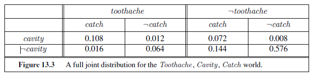
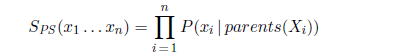
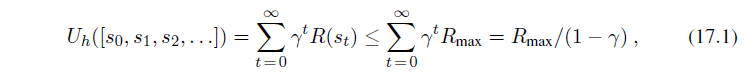

# QUANTIFYING UNCERTAINTY

_In which we see how an agent can tame uncertainty with degrees of belief._

## ACTING UNDER UNCERTAINTY

Agents may need to handle **uncertainty**, whether due to partial observability, nondetermin-UNCERTAINTY

ism, or a combination of the two. An agent may never know for certain what state it’s in or where it will end up after a sequence of actions.

We have seen problem-solving agents (Chapter 4) and logical agents (Chapters 7 and 11) designed to handle uncertainty by keeping track of a **belief state**—a representation of the set of all possible world states that it might be in—and generating a contingency plan that handles every possible eventuality that its sensors may report during execution. Despite its many virtues, however, this approach has significant drawbacks when taken literally as a recipe for creating agent programs:

- When interpreting partial sensor information, a logical agent must consider _every logically possible_ explanation for the observations, no matter how unlikely. This leads to impossible large and complex belief-state representations.

- A correct contingent plan that handles every eventuality can grow arbitrarily large and must consider arbitrarily unlikely contingencies.

- Sometimes there is no plan that is guaranteed to achieve the goal—yet the agent must act. It must have some way to compare the merits of plans that are not guaranteed.

Suppose, for example, that an automated taxi!automated has the goal of delivering a passenger to the airport on time. The agent forms a plan, A90, that involves leaving home 90 minutes before the flight departs and driving at a reasonable speed. Even though the airport is only about 5 miles away, a logical taxi agent will not be able to conclude with certainty that “Plan A90 will get us to the airport in time.” Instead, it reaches the weaker conclusion “Plan A90 will get us to the airport in time, as long as the car doesn’t break down or run out of gas, and I don’t get into an accident, and there are no accidents on the bridge, and the plane doesn’t leave early, and no meteorite hits the car, and . . . .” None of these conditions can be deduced for sure, so the plan’s success cannot be inferred. This is the **qualification problem** (page 268), for which we so far have seen no real solution.

Nonetheless, in some sense A90 _is_ in fact the right thing to do. What do we mean by this? As we discussed in Chapter 2, we mean that out of all the plans that could be executed, A90 is expected to maximize the agent’s performance measure (where the expectation is relative to the agent’s knowledge about the environment). The performance measure includes getting to the airport in time for the flight, avoiding a long, unproductive wait at the airport, and avoiding speeding tickets along the way. The agent’s knowledge cannot guarantee any of these outcomes for A90, but it can provide some degree of belief that they will be achieved. Other plans, such as a~1~80, might increase the agent’s belief that it will get to the airport on time, but also increase the likelihood of a long wait. _The right thing to do—the **rational decision**—therefore depends on both the relative importance of various goals and the likelihood that, and degree to which, they will be achieved._ The remainder of this section hones these ideas, in preparation for the development of the general theories of uncertain reasoning and rational decisions that we present in this and subsequent chapters.

### Summarizing uncertainty

Let’s consider an example of uncertain reasoning: diagnosing a dental patient’s toothache. Diagnosis—whether for medicine, automobile repair, or whatever—almost always involves uncertainty. Let us try to write rules for dental diagnosis using propositional logic, so that we can see how the logical approach breaks down. Consider the following simple rule:

Toothache ⇒ Cavity .

The problem is that this rule is wrong. Not all patients with toothaches have cavities; some of them have gum disease, an abscess, or one of several other problems:

Toothache ⇒ Cavity ∨GumProblem ∨ Abscess

Unfortunately, in order to make the rule true, we have to add an almost unlimited list of possible problems. We could try turning the rule into a causal rule:

Cavity ⇒ Toothache .

But this rule is not right either; not all cavities cause pain. The only way to fix the rule is to make it logically exhaustive: to augment the left-hand side with all the qualifications required for a cavity to cause a toothache. Trying to use logic to cope with a domain like medical diagnosis thus fails for three main reasons:

- **Laziness**: It is too much work to list the complete set of antecedents or consequents needed to ensure an exceptionless rule and too hard to use such rules.

- **Theoretical ignorance**: Medical science has no complete theory for the domain. 

- **Practical ignorance**: Even if we know all the rules, we might be uncertain about  a particular patient because not all the necessary tests have been or can be run.

The connection between toothaches and cavities is just not a logical consequence in either direction. This is typical of the medical domain, as well as most other judgmental domains: law, business, design, automobile repair, gardening, dating, and so on. The agent’s knowledge can at best provide only a **degree of belief** in the relevant sentences. Our main tool for dealing with degrees of belief is **probability theory**. In the terminology of Section 8.1, the **ontological commitments** of logic and probability theory are the same—that the world is composed of facts that do or do not hold in any particular case—but the **epistemological commitments** are different: a logical agent believes each sentence to be true or false or has no opinion, whereas a probabilistic agent may have a numerical degree of belief between 0 (for sentences that are certainly false) and 1 (certainly true).

_Probability provides a way of_ **summarizing** _the uncertainty that comes from our laziness and ignorance,_ thereby solving the qualification problem. We might not know for sure what afflicts a particular patient, but we believe that there is, say, an 80% chance—that is, a probability of 0.8—that the patient who has a toothache has a cavity. That is, we expect that out of all the situations that are indistinguishable from the current situation as far as our knowledge goes, the patient will have a cavity in 80% of them. This belief could be derived from statistical data—80% of the toothache patients seen so far have had cavities—or from some general dental knowledge, or from a combination of evidence sources.

One confusing point is that at the time of our diagnosis, there is no uncertainty in the actual world: the patient either has a cavity or doesn’t. So what does it mean to say the probability of a cavity is 0.8? Shouldn’t it be either 0 or 1? The answer is that probability statements are made with respect to a knowledge state, not with respect to the real world. We say “The probability that the patient has a cavity, _given that she has a toothache_, is 0.8.” If we later learn that the patient has a history of gum disease, we can make a different statement: “The probability that the patient has a cavity, given that she has a toothache and a history of gum disease, is 0.4.” If we gather further conclusive evidence against a cavity, we can say “The probability that the patient has a cavity, given all we now know, is almost 0.” Note that these statements do not contradict each other; each is a separate assertion about a different knowledge state.

### Uncertainty and rational decisions

Consider again the A90 plan for getting to the airport. Suppose it gives us a 97% chance of catching our flight. Does this mean it is a rational choice? Not necessarily: there might be other plans, such as A180, with higher probabilities. If it is vital not to miss the flight, then it is worth risking the longer wait at the airport. What about A1440, a plan that involves leaving home 24 hours in advance? In most circumstances, this is not a good choice, because although it almost guarantees getting there on time, it involves an intolerable wait—not to mention a possibly unpleasant diet of airport food.

To make such choices, an agent must first have **preferences** between the different possible **outcomes** of the various plans. An outcome is a completely specified state, including such factors as whether the agent arrives on time and the length of the wait at the airport. We use **utility theory** to represent and reason with preferences. (The term **utility** is used here in the sense of “the quality of being useful,” not in the sense of the electric company or water works.) Utility theory says that every state has a degree of usefulness, or utility, to an agent and that the agent will prefer states with higher utility.  

The utility of a state is relative to an agent. For example, the utility of a state in which White has checkmated Black in a game of chess is obviously high for the agent playing White, but low for the agent playing Black. But we can’t go strictly by the scores of 1, 1/2, and 0 that are dictated by the rules of tournament chess—some players (including the authors) might be thrilled with a draw against the world champion, whereas other players (including the former world champion) might not. There is no accounting for taste or preferences: you might think that an agent who prefers jalapeño bubble-gum ice cream to chocolate chocolate chip is odd or even misguided, but you could not say the agent is irrational. A utility function can account for any set of preferences—quirky or typical, noble or perverse. Note that utilities can account for altruism, simply by including the welfare of others as one of the factors.

Preferences, as expressed by utilities, are combined with probabilities in the general theory of rational decisions called **decision theory**:

_Decision theory_ = _probability theory_ + _utility theory_ .

The fundamental idea of decision theory is that _an agent is rational if and only if it chooses the action that yields the highest expected utility, averaged over all the possible outcomes of the action._ This is called the principle of **maximum expected utility** (MEU). Note that “expected” might seem like a vague, hypothetical term, but as it is used here it has a precise meaning: it means the “average,” or “statistical mean” of the outcomes, weighted by the probability of the outcome. We saw this principle in action in Chapter 5 when we touched briefly on optimal decisions in backgammon; it is in fact a completely general principle.

## BASIC PROBABILITY NOTATION

For our agent to represent and use probabilistic information, we need a formal language. The language of probability theory has traditionally been informal, written by human mathematicians to other human mathematicians. Appendix A includes a standard introduction to elementary probability theory; here, we take an approach more suited to the needs of AI and more consistent with the concepts of formal logic.  

**function** DT-AGENT(percept ) **returns** an action

**persistent**: belief state, probabilistic beliefs about the current state of the world 
action , the agent’s action

update belief state based on action and percept

calculate outcome probabilities for actions, 

given action descriptions and current belief state

select action with highest expected utility 

given probabilities of outcomes and utility information

**return** action

**Figure 13.1** A decision-theoretic agent that selects rational actions.

### What probabilities are about

Like logical assertions, probabilistic assertions are about possible worlds. Whereas logical assertions say which possible worlds are strictly ruled out (all those in which the assertion is false), probabilistic assertions talk about how probable the various worlds are. In probability theory, the set of all possible worlds is called the **sample space**. The possible worlds are _mutually exclusive_ and _exhaustive_—two possible worlds cannot both be the case, and one possible world must be the case. For example, if we are about to roll two (distinguishable) dice, there are 36 possible worlds to consider: (1,1), (1,2), . . ., (6,6). The Greek letter Ω (uppercase omega) is used to refer to the sample space, and ω (lowercase omega) refers to elements of the space, that is, particular possible worlds.

A fully specified **probability model** associates a numerical probability P (ω) with each possible world.1 The basic axioms of probability theory say that every possible world has a probability between 0 and 1 and that the total probability of the set of possible worlds is 1:

For example, if we assume that each die is fair and the rolls don’t interfere with each other, then each of the possible worlds (1,1), (1,2), . . ., (6,6) has probability 1/36. On the other hand, if the dice conspire to produce the same number, then the worlds (1,1), (2,2), (3,3), etc., might have higher probabilities, leaving the others with lower probabilities.

Probabilistic assertions and queries are not usually about particular possible worlds, but about sets of them. For example, we might be interested in the cases where the two dice add up to 11, the cases where doubles are rolled, and so on. In probability theory, these sets are called **events**—a term already used extensively in Chapter 12 for a different concept. In AI, the sets are always described by **propositions** in a formal language. (One such language is described in Section 13.2.2.) For each proposition, the corresponding set contains just those possible worlds in which the proposition holds. The probability associated with a proposition

---

1 For now, we assume a discrete, countable set of worlds. The proper treatment of the continuous case brings in certain complications that are less relevant for most purposes in AI.  

---

is defined to be the sum of the probabilities of the worlds in which it holds:

For example, when rolling fair dice, we have P (Total =11) = P ((5, 6)) + P ((6, 5)) = 1/36 + 1/36 = 1/18. Note that probability theory does not require complete knowledge of the probabilities of each possible world. For example, if we believe the dice conspire to produce the same number, we might _assert_ that P (doubles) = 1/4 without knowing whether the dice prefer double 6 to double 2. Just as with logical assertions, this assertion _constrains_ the underlying probability model without fully determining it.

Probabilities such as P (Total = 11) and P (doubles) are called **unconditional** or **priorprobabilities** (and sometimes just “priors” for short); they refer to degrees of belief in propositions _in the absence of any other information_. Most of the time, however, we have _some_ information, usually called **evidence**, that has already been revealed. For example, the first die may already be showing a 5 and we are waiting with bated breath for the other one to stop spinning. In that case, we are interested not in the unconditional probability of rolling doubles, but the **conditional** or **posterior** probability (or just “posterior” for short) of rolling doubles _given that the first die is a 5_. This probability is written P (doubles |Die1 = 5), where the “ | ” is pronounced “given.” Similarly, if I am going to the dentist for a regular checkup, the probability P (cavity)= 0.2 might be of interest; but if I go to the dentist because I have a toothache, it’s P (cavity | toothache)= 0.6 that matters. Note that the precedence of “ | ” is such that any expression of the form P (. . . | . . .) always means P ((. . .)|(. . .)).

It is important to understand that P (cavity)= 0.2 is still _valid_ after toothache is observed; it just isn’t especially useful. When making decisions, an agent needs to condition on _all_ the evidence it has observed. It is also important to understand the difference between conditioning and logical implication. The assertion that P (cavity | toothache)= 0.6 does not mean “Whenever toothache is true, conclude that cavity is true with probability 0.6” rather it means “Whenever toothache is true _and we have no further information_, conclude that cavity is true with probability 0.6.” The extra condition is important; for example, if we had the further information that the dentist found no cavities, we definitely would not want to conclude that cavity is true with probability 0.6; instead we need to use P (cavity |toothache ∧ ¬cavity)= 0.

Mathematically speaking, conditional probabilities are defined in terms of unconditional probabilities as follows: for any propositions a and b, we have

The definition makes sense if you remember that observing b rules out all those possible worlds where b is false, leaving a set whose total probability is just P (b). Within that set, the a-worlds satisfy a ∧ b and constitute a fraction P (a ∧ b)/P (b).  

The definition of conditional probability, Equation (13.3), can be written in a different form called the **product rule**:PRODUCT RULE

P (a ∧ b) = P (a | b)P (b) ,

The product rule is perhaps easier to remember: it comes from the fact that, for a and b to be true, we need b to be true, and we also need a to be true given b.

### The language of propositions in probability assertions

In this chapter and the next, propositions describing sets of possible worlds are written in a notation that combines elements of propositional logic and constraint satisfaction notation. In the terminology of Section 2.4.7, it is a **factored representation**, in which a possible world is represented by a set of variable/value pairs.

Variables in probability theory are called **random variables** and their names begin with an uppercase letter. Thus, in the dice example, Total and Die1 are random variables. Every random variable has a **domain**—the set of possible values it can take on. The domain of Total for two dice is the set {2, . . . , 12} and the domain of Die1 is {1, . . . , 6}. A Boolean random variable has the domain {true , false} (notice that values are always lowercase); for example, the proposition that doubles are rolled can be written as Doubles = true . By convention, propositions of the form A= true are abbreviated simply as a, while A= false is abbreviated as ¬a. (The uses of doubles , cavity , and toothache in the preceding section are abbreviations of this kind.) As in CSPs, domains can be sets of arbitrary tokens; we might choose the domain of Age to be {juvenile, teen , adult} and the domain of Weather might be {sunny , rain , cloudy , snow}. When no ambiguity is possible, it is common to use a value by itself to stand for the proposition that a particular variable has that value; thus, sunny can stand for Weather = sunny .

The preceding examples all have finite domains. Variables can have infinite domains, too—either discrete (like the integers) or continuous (like the reals). For any variable with an ordered domain, inequalities are also allowed, such as NumberOfAtomsInUniverse ≥ 1070.

Finally, we can combine these sorts of elementary propositions (including the abbreviated forms for Boolean variables) by using the connectives of propositional logic. For example, we can express “The probability that the patient has a cavity, given that she is a teenager with no toothache, is 0.1” as follows:

P(cavity | ¬toothache ∧ teen) = 0.1 .

Sometimes we will want to talk about the probabilities of _all_ the possible values of a random variable. We could write:

P(Weather = sunny) = 0.6

P(Weather = rain) = 0.1

P(Weather = cloudy) = 0.29

P(Weather = snow ) = 0.01 ,

but as an abbreviation we will allow

**P**(Weather )= 〈0.6, 0.1, 0.29, 0.01〉 ,  

where the bold **P** indicates that the result is a vector of numbers, and where we assume a predefined ordering 〈sunny , rain , cloudy , snow 〉 on the domain of Weather . We say that the **P** statement defines a **probability distribution** for the random variable Weather . The **P** notation is also used for conditional distributions: **P**(X |Y ) gives the values of P (X = x~i~ |Y = y~j~) for each possible i, j pair. For continuous variables, it is not possible to write out the entire distribution as a vector, because there are infinitely many values. Instead, we can define the probability that a random variable takes on some value x as a parameterized function of x. For example, the sentence

P (NoonTemp = x) = Uniform~[18C,26C]~(x)

expresses the belief that the temperature at noon is distributed uniformly between 18 and 26 degrees Celsius. We call this a **probability density function**. 

Probability density functions (sometimes called **pdfs**) differ in meaning from discrete distributions. Saying that the probability density is uniform from 18C to 26C means that there is a 100% chance that the temperature will fall somewhere in that 8C-wide region and a 50% chance that it will fall in any 4C-wide region, and so on. We write the probability density for a continuous random variable X at value x as P (X = x) or just P (x); the intuitive definition of P (x) is the probability that X falls within an arbitrarily small region beginning at x, divided by the width of the region:

where C stands for centigrade (not for a constant). In P (NoonTemp =20.18C)= 1/8C , note that 1/8C is not a probability, it is a probability density. The probability that NoonTemp is _exactly_ 20.18C is zero, because 20.18C is a region of width 0. Some authors use different symbols for discrete distributions and density functions; we use P in both cases, since confusion seldom arises and the equations are usually identical. Note that probabilities are unitless numbers, whereas density functions are measured with a unit, in this case reciprocal degrees.

In addition to distributions on single variables, we need notation for distributions on multiple variables. Commas are used for this. For example, **P**(Weather ,Cavity) denotes the probabilities of all combinations of the values of Weather and Cavity . This is a 4 × 2 table of probabilities called the **joint probability distribution** of Weather and Cavity . We can also mix variables with and without values; **P**(sunny ,Cavity) would be a two-element vector giving the probabilities of a sunny day with a cavity and a sunny day with no cavity. The **P** notation makes certain expressions much more concise than they might otherwise be. For example, the product rules for all possible values of Weather and Cavity can be written as a single equation:

**P**(Weather ,Cavity) = **P**(Weather | Cavity)**P**(Cavity) ,  

instead of as these 4× 2= 8 equations (using abbreviations W and C):

P (W = sunny ∧ C = true) = P (W = sunny|C = true)P (C = true)

P (W = rain ∧ C = true) = P (W = rain |C = true)P (C = true)

P (W = cloudy ∧ C = true) = P (W = cloudy |C = true)P (C = true)

P (W = snow ∧ C = true) = P (W = snow |C = true)P (C = true)

P (W = sunny ∧ C = false) = P (W = sunny|C = false)P (C = false)

P (W = rain ∧ C = false) = P (W = rain |C = false)P (C = false)

P (W = cloudy ∧ C = false) = P (W = cloudy |C = false)P (C = false)

P (W = snow ∧ C = false) = P (W = snow |C = false)P (C = false) .

As a degenerate case, **P**(sunny , cavity) has no variables and thus is a one-element vector that is the probability of a sunny day with a cavity, which could also be written as P (sunny , cavity) or P (sunny ∧ cavity). We will sometimes use **P** notation to derive results about individual P values, and when we say “**P**(sunny)= 0.6” it is really an abbreviation for “**P**(sunny) is the one-element vector 〈0.6〉, which means that P (sunny)= 0.6.”

Now we have defined a syntax for propositions and probability assertions and we have given part of the semantics: Equation (13.2) defines the probability of a proposition as the sum of the probabilities of worlds in which it holds. To complete the semantics, we need to say what the worlds are and how to determine whether a proposition holds in a world. We borrow this part directly from the semantics of propositional logic, as follows. _A possible world is defined to be an assignment of values to all of the random variables under consideration._ It is easy to see that this definition satisfies the basic requirement that possible worlds be mutually exclusive and exhaustive (Exercise 13.5). For example, if the random variables are Cavity , Toothache , and Weather , then there are 2× 2× 4= 16 possible worlds. Furthermore, the truth of any given proposition, no matter how complex, can be determined easily in such worlds using the same recursive definition of truth as for formulas in propositional logic.

From the preceding definition of possible worlds, it follows that a probability model is completely determined by the joint distribution for all of the random variables—the so-called **full joint probability distribution**. For example, if the variables are Cavity , Toothache , and Weather , then the full joint distribution is given by **P**(Cavity ,Toothache ,Weather ). This joint distribution can be represented as a 2× 2× 4 table with 16 entries. Because every proposition’s probability is a sum over possible worlds, a full joint distribution suffices, in principle, for calculating the probability of any proposition.

### Probability axioms and their reasonableness

The basic axioms of probability (Equations (13.1) and (13.2)) imply certain relationships among the degrees of belief that can be accorded to logically related propositions. For example, we can derive the familiar relationship between the probability of a proposition and the probability of its negation:

We can also derive the well-known formula for the probability of a disjunction, sometimes called the **inclusion–exclusion principle**:

P (a ∨ b) = P (a) + P (b)− P (a ∧ b) . (13.4)

This rule is easily remembered by noting that the cases where a holds, together with the cases where b holds, certainly cover all the cases where a ∨ b holds; but summing the two sets of cases counts their intersection twice, so we need to subtract P (a ∧ b). The proof is left as an exercise (Exercise 13.6).

Equations (13.1) and (13.4) are often called **Kolmogorov’s axioms** in honor of the Rus-KOLMOGOROV’S AXIOMS

sian mathematician Andrei Kolmogorov, who showed how to build up the rest of probability theory from this simple foundation and how to handle the difficulties caused by continuous variables.2 While Equation (13.2) has a definitional flavor, Equation (13.4) reveals that the axioms really do constrain the degrees of belief an agent can have concerning logically related propositions. This is analogous to the fact that a logical agent cannot simultaneously believe A, B, and ¬(A ∧ B), because there is no possible world in which all three are true. With probabilities, however, statements refer not to the world directly, but to the agent’s own state of knowledge. Why, then, can an agent not hold the following set of beliefs (even though they violate Kolmogorov’s axioms)?

P (a) = 0.4  P(a ∧ b) = 0.0

P (b) = 0.3  P(a ∨ b) = 0.8 .     (13.5)

This kind of question has been the subject of decades of intense debate between those who advocate the use of probabilities as the only legitimate form for degrees of belief and those who advocate alternative approaches.

One argument for the axioms of probability, first stated in 1931 by Bruno de Finetti (and translated into English in de Finetti (1993)), is as follows: If an agent has some degree of belief in a proposition a, then the agent should be able to state odds at which it is indifferent to a bet for or against a.3 Think of it as a game between two agents: Agent 1 states, “my degree of belief in event a is 0.4.” Agent 2 is then free to choose whether to wager for or against a at stakes that are consistent with the stated degree of belief. That is, Agent 2 could choose to accept Agent 1’s bet that a will occur, offering $6 against Agent 1’s $4. Or Agent 2 could accept Agent 1’s bet that ¬a will occur, offering $4 against Agent 1’s $6. Then we observe the outcome of a, and whoever is right collects the money. If an agent’s degrees of belief do not accurately reflect the world, then you would expect that it would tend to lose money over the long run to an opposing agent whose beliefs more accurately reflect the state of the world.

But de Finetti proved something much stronger: _If Agent 1 expresses a set of degrees of belief that violate the axioms of probability theory then there is a combination of bets by Agent 2 that guarantees that Agent 1 will lose money every time._ For example, suppose that Agent 1 has the set of degrees of belief from Equation (13.5). Figure 13.2 shows that if Agent

2 The difficulties include the **Vitali set**, a well-defined subset of the interval [0, 1] with no well-defined size. 3 One might argue that the agent’s preferences for different bank balances are such that the possibility of losing $1 is not counterbalanced by an equal possibility of winning $1. One possible response is to make the bet amounts small enough to avoid this problem. Savage’s analysis (1954) circumvents the issue altogether.  

2 chooses to bet $4 on a, $3 on b, and $2 on ¬(a ∨ b), then Agent 1 always loses money, regardless of the outcomes for a and b. De Finetti’s theorem implies that no rational agent can have beliefs that violate the axioms of probability.

One common objection to de Finetti’s theorem is that this betting game is rather contrived. For example, what if one refuses to bet? Does that end the argument? The answer is that the betting game is an abstract model for the decision-making situation in which every agent is _unavoidably_ involved at every moment. Every action (including inaction) is a kind of bet, and every outcome can be seen as a payoff of the bet. Refusing to bet is like refusing to allow time to pass.

Other strong philosophical arguments have been put forward for the use of probabilities, most notably those of Cox (1946), Carnap (1950), and Jaynes (2003). They each construct a set of axioms for reasoning with degrees of beliefs: no contradictions, correspondence with ordinary logic (for example, if belief in A goes up, then belief in ¬A must go down), and so on. The only controversial axiom is that degrees of belief must be numbers, or at least act like numbers in that they must be transitive (if belief in A is greater than belief in B, which is greater than belief in C , then belief in A must be greater than C) and comparable (the belief in A must be one of equal to, greater than, or less than belief in B). It can then be proved that probability is the only approach that satisfies these axioms.

The world being the way it is, however, practical demonstrations sometimes speak louder than proofs. The success of reasoning systems based on probability theory has been much more effective in making converts. We now look at how the axioms can be deployed to make inferences.

## INFERENCE USING FULL JOINT DISTRIBUTIONS

In this section we describe a simple method for **probabilistic inference**—that is, the computation of posterior probabilities for query propositions given observed evidence. We use the full joint distribution as the “knowledge base” from which answers to all questions may be derived. Along the way we also introduce several useful techniques for manipulating equations involving probabilities.  

WHERE DO PROBABILITIES COME FROM?

There has been endless debate over the source and status of probability numbers. The **frequentist** position is that the numbers can come only from _experiments_: if we test 100 people and find that 10 of them have a cavity, then we can say that the probability of a cavity is approximately 0.1. In this view, the assertion “the probability of a cavity is 0.1” means that 0.1 is the fraction that would be observed in the limit of infinitely many samples. From any finite sample, we can estimate the true fraction and also calculate how accurate our estimate is likely to be.

The **objectivist** view is that probabilities are real aspects of the universe— propensities of objects to behave in certain ways—rather than being just descriptions of an observer’s degree of belief. For example, the fact that a fair coin comes up heads with probability 0.5 is a propensity of the coin itself. In this view, frequentist measurements are attempts to observe these propensities. Most physicists agree that quantum phenomena are objectively probabilistic, but uncertainty at the macroscopic scale—e.g., in coin tossing—usually arises from ignorance of initial conditions and does not seem consistent with the propensity view.

The **subjectivist** view describes probabilities as a way of characterizing an agent’s beliefs, rather than as having any external physical significance. The subjective **Bayesian** view allows any self-consistent ascription of prior probabilities to propositions, but then insists on proper Bayesian updating as evidence arrives.

In the end, even a strict frequentist position involves subjective analysis because of the **reference class** problem: in trying to determine the outcome probability of a _particular_ experiment, the frequentist has to place it in a reference class of “similar” experiments with known outcome frequencies. I. J. Good (1983, p. 27) wrote, “every event in life is unique, and every real-life probability that we estimate in practice is that of an event that has never occurred before.” For example, given a particular patient, a frequentist who wants to estimate the probability of a cavity will consider a reference class of other patients who are similar in important ways—age, symptoms, diet—and see what proportion of them had a cavity. If the dentist considers everything that is known about the patient—weight to the nearest gram, hair color, mother’s maiden name—then the reference class becomes empty. This has been a vexing problem in the philosophy of science.

The **principle of indifference** attributed to Laplace (1816) states that propositions that are syntactically “symmetric” with respect to the evidence should be accorded equal probability. Various refinements have been proposed, culminating in the attempt by Carnap and others to develop a rigorous **inductive logic**, capable of computing the correct probability for any proposition from any collection of observations. Currently, it is believed that no unique inductive logic exists; rather, any such logic rests on a subjective prior probability distribution whose effect is diminished as more observations are collected.  

We begin with a simple example: a domain consisting of just the three Boolean variables Toothache , Cavity , and Catch (the dentist’s nasty steel probe catches in my tooth). The full joint distribution is a 2× 2× 2 table as shown in Figure 13.3.

Notice that the probabilities in the joint distribution sum to 1, as required by the axioms of probability. Notice also that Equation (13.2) gives us a direct way to calculate the probability of any proposition, simple or complex: simply identify those possible worlds in which the proposition is true and add up their probabilities. For example, there are six possible worlds in which cavity ∨ toothache holds:

P (cavity ∨ toothache) = 0.108 + 0.012 + 0.072 + 0.008 + 0.016 + 0.064 = 0.28 .

One particularly common task is to extract the distribution over some subset of variables or a single variable. For example, adding the entries in the first row gives the unconditional or **marginal probability**4 of cavity :

P (cavity) = 0.108 + 0.012 + 0.072 + 0.008 = 0.2 .

This process is called **marginalization**, or **summing out**—because we sum up the probabilities for each possible value of the other variables, thereby taking them out of the equation. We can write the following general marginalization rule for any sets of variables **Y** and **Z**:

This rule is called **conditioning**. Marginalization and conditioning turn out to be useful rules for all kinds of derivations involving probability expressions. In most cases, we are interested in computing _conditional_ probabilities of some variables, given evidence about others. Conditional probabilities can be found by first using

---

4 So called because of a common practice among actuaries of writing the sums of observed frequencies in the margins of insurance tables.  

---

Equation (13.3) to obtain an expression in terms of unconditional probabilities and then evaluating the expression from the full joint distribution. For example, we can compute the probability of a cavity, given evidence of a toothache, as follows:

The two values sum to 1.0, as they should. Notice that in these two calculations the term 1/P (toothache ) remains constant, no matter which value of Cavity we calculate. In fact, it can be viewed as a **normalization** constant for the distribution **P**(Cavity | toothache), ensuring that it adds up to 1. Throughout the chapters dealing with probability, we use α to denote such constants. With this notation, we can write the two preceding equations in one:

**P**(Cavity | toothache) = α **P**(Cavity , toothache)
= α [**P**(Cavity , toothache , catch) + **P**(Cavity , toothache ,¬catch)]
= α [〈0.108, 0.016〉+ 〈0.012, 0.064〉] = α 〈0.12, 0.08〉 = 〈0.6, 0.4〉 .

In other words, we can calculate **P**(Cavity | toothache) even if we don’t know the value of P (toothache)! We temporarily forget about the factor 1/P (toothache ) and add up the values for cavity and ¬cavity , getting 0.12 and 0.08. Those are the correct relative proportions, but they don’t sum to 1, so we normalize them by dividing each one by 0.12 + 0.08, getting the true probabilities of 0.6 and 0.4. Normalization turns out to be a useful shortcut in many probability calculations, both to make the computation easier and to allow us to proceed when some probability assessment (such as P (toothache)) is not available.

From the example, we can extract a general inference procedure. We begin with the case in which the query involves a single variable, X (Cavity in the example). Let **E** be the list of evidence variables (just Toothache in the example), let **e** be the list of observed values for them, and let **Y** be the remaining unobserved variables (just Catch in the example). The query is **P**(X | **e**) and can be evaluated as

where the summation is over all possible **y**s (i.e., all possible combinations of values of the unobserved variables **Y**). Notice that together the variables X, **E**, and **Y** constitute the complete set of variables for the domain, so **P**(X, **e**, **y**) is simply a subset of probabilities from the full joint distribution.

Given the full joint distribution to work with, Equation (13.9) can answer probabilistic queries for discrete variables. It does not scale well, however: for a domain described by n Boolean variables, it requires an input table of size O(2^n^) and takes O(2^n^) time to process the table. In a realistic problem we could easily have n > 100, making O(2^n^) impractical. The full joint distribution in tabular form is just not a practical tool for building reasoning systems. Instead, it should be viewed as the theoretical foundation on which more effective approaches may be built, just as truth tables formed a theoretical foundation for more practical algorithms like DPLL. The remainder of this chapter introduces some of the basic ideas required in preparation for the development of realistic systems in Chapter 14.

## INDEPENDENCE

Let us expand the full joint distribution in Figure 13.3 by adding a fourth variable, Weather . The full joint distribution then becomes **P**(Toothache ,Catch,Cavity ,Weather ), which has 2 × 2 × 2 × 4 = 32 entries. It contains four “editions” of the table shown in Figure 13.3, one for each kind of weather. What relationship do these editions have to each other and to the original three-variable table? For example, how are P (toothache , catch , cavity , cloudy)

and P(toothache , catch , cavity) related? We can use the product rule:

P (toothache , catch , cavity , cloudy)

= P (cloudy | toothache , catch , cavity) P(toothache , catch , cavity) .

Now, unless one is in the deity business, one should not imagine that one’s dental problems influence the weather. And for indoor dentistry, at least, it seems safe to say that the weather does not influence the dental variables. Therefore, the following assertion seems reasonable:

P (cloudy | toothache , catch , cavity) = P (cloudy) . (13.10)

From this, we can deduce

P (toothache , catch , cavity , cloudy) = P (cloudy)P (toothache , catch , cavity) .

A similar equation exists for _every entry_ in **P**(Toothache ,Catch ,Cavity ,Weather ). In fact, we can write the general equation

**P**(Toothache ,Catch ,Cavity ,Weather ) = **P**(Toothache ,Catch,Cavity)**P**(Weather ) .

Thus, the 32-element table for four variables can be constructed from one 8-element table and one 4-element table. This decomposition is illustrated schematically in Figure 13.4(a).

The property we used in Equation (13.10) is called **independence** (also **marginal in-**INDEPENDENCE

**dependence** and **absolute independence**). In particular, the weather is independent of one’s dental problems. Independence between propositions a and b can be written as

P (a | b)= P (a) or P (b | a)= P (b) or P (a ∧ b)= P (a) P(b) . (13.11)

All these forms are equivalent (Exercise 13.12). Independence between variables X and Y

can be written as follows (again, these are all equivalent):

**P**(X |Y )= **P**(X) or **P**(Y |X)= **P**(Y ) or **P**(X,Y )= **P**(X)**P**(Y ) .

Independence assertions are usually based on knowledge of the domain. As the toothache– weather example illustrates, they can dramatically reduce the amount of information necessary to specify the full joint distribution. If the complete set of variables can be divided  

into independent subsets, then the full joint distribution can be _factored_ into separate joint distributions on those subsets. For example, the full joint distribution on the outcome of n independent coin flips, **P**(C~1~, . . . , C~n~), has 2^n^ entries, but it can be represented as the product of n single-variable distributions **P**(Ci). In a more practical vein, the independence of dentistry and meteorology is a good thing, because otherwise the practice of dentistry might require intimate knowledge of meteorology, and vice versa.

When they are available, then, independence assertions can help in reducing the size of the domain representation and the complexity of the inference problem. Unfortunately, clean separation of entire sets of variables by independence is quite rare. Whenever a connection, however indirect, exists between two variables, independence will fail to hold. Moreover, even independent subsets can be quite large—for example, dentistry might involve dozens of diseases and hundreds of symptoms, all of which are interrelated. To handle such problems, we need more subtle methods than the straightforward concept of independence.

## BAYES’ RULE AND ITS USE

On page 486, we defined the **product rule**. It can actually be written in two forms:

This equation is known as **Bayes’ rule** (also Bayes’ law or Bayes’ theorem). This simple equation underlies most modern AI systems for probabilistic inference.  

The more general case of Bayes’ rule for multivalued variables can be written in the **P** notation as follows:

### Applying Bayes’ rule: The simple case

On the surface, Bayes’ rule does not seem very useful. It allows us to compute the single term P (b | a) in terms of three terms: P (a | b), P (b), and P (a). That seems like two steps backwards, but Bayes’ rule is useful in practice because there are many cases where we do have good probability estimates for these three numbers and need to compute the fourth. Often, we perceive as evidence the _effect_ of some unknown _cause_ and we would like to determine that cause. In that case, Bayes’ rule becomes

The conditional probability P (_effect_ | cause) quantifies the relationship in the **causal** direction, whereas P (cause | _effect_) describes the **diagnostic** direction. In a task such as medical diagnosis, we often have conditional probabilities on causal relationships (that is, the doctor knows P (symptoms | disease)) and want to derive a diagnosis, P (disease | symptoms). For example, a doctor knows that the disease meningitis causes the patient to have a stiff neck, say, 70% of the time. The doctor also knows some unconditional facts: the prior probability that a patient has meningitis is 1/50,000, and the prior probability that any patient has a stiff neck is 1%. Letting s be the proposition that the patient has a stiff neck and m be the proposition that the patient has meningitis, we have

That is, we expect less than 1 in 700 patients with a stiff neck to have meningitis. Notice that even though a stiff neck is quite strongly indicated by meningitis (with probability 0.7), the probability of meningitis in the patient remains small. This is because the prior probability of stiff necks is much higher than that of meningitis.

Section 13.3 illustrated a process by which one can avoid assessing the prior probability of the evidence (here, P (s)) by instead computing a posterior probability for each value of the query variable (here, m and ¬m) and then normalizing the results. The same process can be applied when using Bayes’ rule. We have

**P**(M | s) = α 〈P (s | m) P (m), P (s | ¬m) P (¬m)〉 .

Thus, to use this approach we need to estimate P (s | ¬m) instead of P (s). There is no free lunch—sometimes this is easier, sometimes it is harder. The general form of Bayes’ rule with normalization is

**P**(Y | X) = α **P**(X |Y )**P**(Y ) , (13.15)

where α is the normalization constant needed to make the entries in **P**(Y |X) sum to 1. One obvious question to ask about Bayes’ rule is why one might have available the conditional probability in one direction, but not the other. In the meningitis domain, perhaps the doctor knows that a stiff neck implies meningitis in 1 out of 5000 cases; that is, the doctor has quantitative information in the **diagnostic** direction from symptoms to causes. Such a doctor has no need to use Bayes’ rule. Unfortunately, _diagnostic knowledge is often more fragile than causal knowledge._ If there is a sudden epidemic of meningitis, the unconditional probability of meningitis, P (m), will go up. The doctor who derived the diagnostic probability P (m | s) directly from statistical observation of patients before the epidemic will have no idea how to update the value, but the doctor who computes P (m | s) from the other three values will see that P (m | s) should go up proportionately with P (m). Most important, the causal information P (s |m) is _unaffected_ by the epidemic, because it simply reflects the way meningitis works. The use of this kind of direct causal or model-based knowledge provides the crucial robustness needed to make probabilistic systems feasible in the real world.

### Using Bayes’ rule: Combining evidence

We have seen that Bayes’ rule can be useful for answering probabilistic queries conditioned on one piece of evidence—for example, the stiff neck. In particular, we have argued that probabilistic information is often available in the form P (_effect_ | cause). What happens when we have two or more pieces of evidence? For example, what can a dentist conclude if her nasty steel probe catches in the aching tooth of a patient? If we know the full joint distribution (Figure 13.3), we can read off the answer:

**P**(Cavity | toothache ∧ catch) = α 〈0.108, 0.016〉 ≈ 〈0.871, 0.129〉 .

We know, however, that such an approach does not scale up to larger numbers of variables. We can try using Bayes’ rule to reformulate the problem:

**P**(Cavity | toothache ∧ catch)

= α **P**(toothache ∧ catch |Cavity) **P**(Cavity) .        (13.16)

For this reformulation to work, we need to know the conditional probabilities of the conjunction toothache ∧catch for each value of Cavity . That might be feasible for just two evidence variables, but again it does not scale up. If there are n possible evidence variables (X rays, diet, oral hygiene, etc.), then there are 2^n^ possible combinations of observed values for which we would need to know conditional probabilities. We might as well go back to using the full joint distribution. This is what first led researchers away from probability theory toward approximate methods for evidence combination that, while giving incorrect answers, require fewer numbers to give any answer at all.

Rather than taking this route, we need to find some additional assertions about the domain that will enable us to simplify the expressions. The notion of **independence** in Section 13.4 provides a clue, but needs refining. It would be nice if Toothache and Catch were independent, but they are not: if the probe catches in the tooth, then it is likely that the tooth has a cavity and that the cavity causes a toothache. These variables _are_ independent, however, _given the presence or the absence of a cavity_. Each is directly caused by the cavity, but neither has a direct effect on the other: toothache depends on the state of the nerves in the tooth, whereas the probe’s accuracy depends on the dentist’s skill, to which the toothache is irrelevant.5 Mathematically, this property is written as

**P**(toothache ∧ catch | Cavity) = **P**(toothache | Cavity)**P**(catch | Cavity) . (13.17)

This equation expresses the **conditional independence** of toothache and catch given Cavity .

We can plug it into Equation (13.16) to obtain the probability of a cavity:

**P**(Cavity | toothache ∧ catch)
= α **P**(toothache | Cavity) **P**(catch | Cavity) **P**(Cavity) . (13.18)

Now the information requirements are the same as for inference, using each piece of evidence separately: the prior probability **P**(Cavity) for the query variable and the conditional probability of each effect, given its cause.

The general definition of **conditional independence** of two variables X and Y , given a third variable Z , is

**P**(X,Y | Z) = **P**(X | Z)**P**(Y | Z) .

In the dentist domain, for example, it seems reasonable to assert conditional independence of the variables Toothache and Catch , given Cavity :

**P**(Toothache ,Catch | Cavity) = **P**(Toothache | Cavity)**P**(Catch | Cavity) . (13.19)

Notice that this assertion is somewhat stronger than Equation (13.17), which asserts independence only for specific values of Toothache and Catch . As with absolute independence in Equation (13.11), the equivalent forms

**P**(X | Y,Z)= **P**(X | Z) and **P**(Y | X,Z)= **P**(Y | Z)

can also be used (see Exercise 13.17). Section 13.4 showed that absolute independence assertions allow a decomposition of the full joint distribution into much smaller pieces. It turns out that the same is true for conditional independence assertions. For example, given the assertion in Equation (13.19), we can derive a decomposition as follows:

**P**(Toothache ,Catch,Cavity)

= **P**(Toothache ,Catch | Cavity)**P**(Cavity) (product rule)

= **P**(Toothache | Cavity)**P**(Catch | Cavity)**P**(Cavity) (using 13.19).

(The reader can easily check that this equation does in fact hold in Figure 13.3.) In this way, the original large table is decomposed into three smaller tables. The original table has seven

---

5 We assume that the patient and dentist are distinct individuals.  

---

independent numbers (23 = 8 entries in the table, but they must sum to 1, so 7 are independent). The smaller tables contain five independent numbers (for a conditional probability distributions such as **P**(T |C there are two rows of two numbers, and each row sums to 1, so that’s two independent numbers; for a prior distribution like **P**(C) there is only one independent number). Going from seven to five might not seem like a major triumph, but the point is that, for n symptoms that are all conditionally independent given Cavity , the size of the representation grows as O(n) instead of O(2^n^). That means that _conditional independence assertions can allow probabilistic systems to scale up; moreover, they are much more commonly available than absolute independence assertions._ Conceptually, Cavity **separates** Toothache and Catch because it is a direct cause of both of them. The decomposition of large probabilistic domains into weakly connected subsets through conditional independence is one of the most important developments in the recent history of AI.

The dentistry example illustrates a commonly occurring pattern in which a single cause directly influences a number of effects, all of which are conditionally independent, given the cause. The full joint distribution can be written as

Such a probability distribution is called a **naive Bayes** model—“naive” because it is often used (as a simplifying assumption) in cases where the “effect” variables are _not_ actually conditionally independent given the cause variable. (The naive Bayes model is sometimes called a **Bayesian classifier,** a somewhat careless usage that has prompted true Bayesians to call it the **idiot Bayes** model.) In practice, naive Bayes systems can work surprisingly well, even when the conditional independence assumption is not true. Chapter 20 describes methods for learning naive Bayes distributions from observations.

## THE WUMPUS WORLD REVISITED

We can combine of the ideas in this chapter to solve probabilistic reasoning problems in the wumpus world. (See Chapter 7 for a complete description of the wumpus world.) Uncertainty arises in the wumpus world because the agent’s sensors give only partial information about the world. For example, Figure 13.5 shows a situation in which each of the three reachable squares—[1,3], [2,2], and [3,1]—might contain a pit. Pure logical inference can conclude nothing about which square is most likely to be safe, so a logical agent might have to choose randomly. We will see that a probabilistic agent can do much better than the logical agent.

Our aim is to calculate the probability that each of the three squares contains a pit. (For this example we ignore the wumpus and the gold.) The relevant properties of the wumpus world are that (1) a pit causes breezes in all neighboring squares, and (2) each square other than [1,1] contains a pit with probability 0.2. The first step is to identify the set of random variables we need:

- As in the propositional logic case, we want one Boolean variable Pij for each square, which is true iff square [i, j] actually contains a pit.  

- We also have Boolean variables Bij that are true iff square [i, j] is breezy; we include these variables only for the observed squares—in this case, [1,1], [1,2], and [2,1].

The next step is to specify the full joint distribution, **P**(P~1,1~, . . . , P~4,4~, B~1,1~, B~1,2~, B~2,1~). Applying the product rule, we have

**P**(P~1,1~, . . . , P~4,4~, B~1,1~, B~1,2~, B~2,1~) =
**P**(B~1,1~, B~1,2~, B~2,1~ | P~1,1~, . . . , P~4,4~)**P**(P~1,1~, . . . , P~4,4~) .

This decomposition makes it easy to see what the joint probability values should be. The first term is the conditional probability distribution of a breeze configuration, given a pit configuration; its values are 1 if the breezes are adjacent to the pits and 0 otherwise. The second term is the prior probability of a pit configuration. Each square contains a pit with probability 0.2, independently of the other squares; hence,

For a particular configuration with exactly n pits, P (P~1,1~, . . . , P~4,4~)= 0.2^n^× 0.816−n. In the situation in Figure 13.5(a), the evidence consists of the observed breeze (or its

absence) in each square that is visited, combined with the fact that each such square contains no pit. We abbreviate these facts as b=¬b~1,1~∧b~1,2~∧b~2,1~ and known =¬P~1,1~∧¬p~1~,2∧¬p~2~,1. We are interested in answering queries such as **P**(P~1,3~ | known , b): how likely is it that [1,3] contains a pit, given the observations so far?

To answer this query, we can follow the standard approach of Equation (13.9), namely, summing over entries from the full joint distribution. Let Unknown be the set of P~i,j~ variables for squares other than the Known squares and the query square [1,3]. Then, by Equation (13.9), we have

The full joint probabilities have already been specified, so we are done—that is, unless we care about computation. There are 12 unknown squares; hence the summation contains 212 = 4096 terms. In general, the summation grows exponentially with the number of squares.

Surely, one might ask, aren’t the other squares irrelevant? How could [4,4] affect whether [1,3] has a pit? Indeed, this intuition is correct. Let Frontier be the pit variables (other than the query variable) that are adjacent to visited squares, in this case just [2,2] and [3,1]. Also, let Other be the pit variables for the other unknown squares; in this case, there are 10 other squares, as shown in Figure 13.5(b). The key insight is that the observed breezes are _conditionally independent_ of the other variables, given the known, frontier, and query variables. To use the insight, we manipulate the query formula into a form in which the breezes are conditioned on all the other variables, and then we apply conditional independence:

where the last step folds P (known) into the normalizing constant and uses the fact that ∑ other P (other ) equals 1. Now, there are just four terms in the summation over the frontier variables P~2,2~ and P~3,1~. The use of independence and conditional independence has completely eliminated the other squares from consideration.

Notice that the expression **P**(b | known , P~1,3~, frontier) is 1 when the frontier is consistent with the breeze observations, and 0 otherwise. Thus, for each value of P~1,3~, we sum over the _logical models_ for the frontier variables that are consistent with the known facts. (Compare with the enumeration over models in Figure 7.5 on page 241.) The models and their associated prior probabilities—P (frontier )—are shown in Figure 13.6. We have

**P**(P~1,3~ | known , b) = α′ 〈0.2(0.04 + 0.16 + 0.16), 0.8(0.04 + 0.16)〉 ≈ 〈0.31, 0.69〉 .

That is, [1,3] (and [3,1] by symmetry) contains a pit with roughly 31% probability. A similar calculation, which the reader might wish to perform, shows that [2,2] contains a pit with roughly 86% probability. The wumpus agent should definitely avoid [2,2]! Note that our logical agent from Chapter 7 did not know that [2,2] was worse than the other squares. Logic can tell us that it is unknown whether there is a pit in [2, 2], but we need probability to tell us how likely it is.

What this section has shown is that even seemingly complicated problems can be formulated precisely in probability theory and solved with simple algorithms. To get _efficient_ solutions, independence and conditional independence relationships can be used to simplify the summations required. These relationships often correspond to our natural understanding of how the problem should be decomposed. In the next chapter, we develop formal representations for such relationships as well as algorithms that operate on those representations to perform probabilistic inference efficiently.  

## SUMMARY

This chapter has suggested probability theory as a suitable foundation for uncertain reasoning and provided a gentle introduction to its use.

- Uncertainty arises because of both laziness and ignorance. It is inescapable in complex, nondeterministic, or partially observable environments.

- Probabilities express the agent’s inability to reach a definite decision regarding the truth of a sentence. Probabilities summarize the agent’s beliefs relative to the evidence.

- Decision theory combines the agent’s beliefs and desires, defining the best action as the one that maximizes expected utility.

- Basic probability statements include **prior probabilities** and **conditional probabilities** over simple and complex propositions.

- The axioms of probability constrain the possible assignments of probabilities to propositions. An agent that violates the axioms must behave irrationally in some cases.

- The **full joint probability distribution** specifies the probability of each complete assignment of values to random variables. It is usually too large to create or use in its explicit form, but when it is available it can be used to answer queries simply by adding up entries for the possible worlds corresponding to the query propositions.

- **Absolute independence** between subsets of random variables allows the full joint distribution to be factored into smaller joint distributions, greatly reducing its complexity. Absolute independence seldom occurs in practice.

- **Bayes’ rule** allows unknown probabilities to be computed from known conditional probabilities, usually in the causal direction. Applying Bayes’ rule with many pieces of evidence runs into the same scaling problems as does the full joint distribution.

- **Conditional independence** brought about by direct causal relationships in the domain might allow the full joint distribution to be factored into smaller, conditional distributions. The **naive Bayes** model assumes the conditional independence of all effect variables, given a single cause variable, and grows linearly with the number of effects.

- A wumpus-world agent can calculate probabilities for unobserved aspects of the world, thereby improving on the decisions of a purely logical agent. Conditional independence makes these calculations tractable.

**BIBLIOGRAPHICAL AND HISTORICAL NOTES**

Probability theory was invented as a way of analyzing games of chance. In about 850 A.D. the Indian mathematician Mahaviracarya described how to arrange a set of bets that can’t lose (what we now call a Dutch book). In Europe, the first significant systematic analyses were produced by Girolamo Cardano around 1565, although publication was posthumous (1663). By that time, probability had been established as a mathematical discipline due to a series of results established in a famous correspondence between Blaise Pascal and Pierre de Fermat in 1654. As with probability itself, the results were initially motivated by gambling problems (see Exercise 13.9). The first published textbook on probability was _De Ratiociniis in Ludo Aleae_ (Huygens, 1657). The “laziness and ignorance” view of uncertainty was described by John Arbuthnot in the preface of his translation of Huygens (Arbuthnot, 1692): “It is impossible for a Die, with such determin’d force and direction, not to fall on such determin’d side, only I don’t know the force and direction which makes it fall on such determin’d side, and therefore I call it Chance, which is nothing but the want of art...”

Laplace (1816) gave an exceptionally accurate and modern overview of probability; he was the first to use the example “take two urns, A and B, the first containing four white and two black balls, . . . ” The Rev. Thomas Bayes (1702–1761) introduced the rule for reasoning about conditional probabilities that was named after him (Bayes, 1763). Bayes only considered the case of uniform priors; it was Laplace who independently developed the general case. Kolmogorov (1950, first published in German in 1933) presented probability theory in a rigorously axiomatic framework for the first time. Rényi (1970) later gave an axiomatic presentation that took conditional probability, rather than absolute probability, as primitive.

Pascal used probability in ways that required both the objective interpretation, as a property of the world based on symmetry or relative frequency, and the subjective interpretation, based on degree of belief—the former in his analyses of probabilities in games of chance, the latter in the famous “Pascal’s wager” argument about the possible existence of God. However, Pascal did not clearly realize the distinction between these two interpretations. The distinction was first drawn clearly by James Bernoulli (1654–1705).

Leibniz introduced the “classical” notion of probability as a proportion of enumerated, equally probable cases, which was also used by Bernoulli, although it was brought to prominence by Laplace (1749–1827). This notion is ambiguous between the frequency interpretation and the subjective interpretation. The cases can be thought to be equally probable either because of a natural, physical symmetry between them, or simply because we do not have any knowledge that would lead us to consider one more probable than another. The use of this latter, subjective consideration to justify assigning equal probabilities is known as the **principle of indifference**. The principle is often attributed to Laplace, but he never isolated the principle explicitly. George Boole and John Venn both referred to it as the **principle of insufficient reason**; the modern name is due to Keynes (1921).

The debate between objectivists and subjectivists became sharper in the 20th century. Kolmogorov (1963), R. A. Fisher (1922), and Richard von Mises (1928) were advocates of the relative frequency interpretation. Karl Popper’s (1959, first published in German in 1934) “propensity” interpretation traces relative frequencies to an underlying physical symmetry. Frank Ramsey (1931), Bruno de Finetti (1937), R. T. Cox (1946), Leonard Savage (1954), Richard Jeffrey (1983), and E. T. Jaynes (2003) interpreted probabilities as the degrees of belief of specific individuals. Their analyses of degree of belief were closely tied to utilities and to behavior—specifically, to the willingness to place bets. Rudolf Carnap, following Leibniz and Laplace, offered a different kind of subjective interpretation of probability— not as any actual individual’s degree of belief, but as the degree of belief that an idealized individual _should_ have in a particular proposition a, given a particular body of evidence **e**.  

Carnap attempted to go further than Leibniz or Laplace by making this notion of degree of **confirmation** mathematically precise, as a logical relation between a and **e**. The study of this relation was intended to constitute a mathematical discipline called **inductive logic**, analogous to ordinary deductive logic (Carnap, 1948, 1950). Carnap was not able to extend his inductive logic much beyond the propositional case, and Putnam (1963) showed by adversarial arguments that some fundamental difficulties would prevent a strict extension to languages capable of expressing arithmetic.

Cox’s theorem (1946) shows that any system for uncertain reasoning that meets his set of assumptions is equivalent to probability theory. This gave renewed confidence to those who already favored probability, but others were not convinced, pointing to the assumptions (primarily that belief must be represented by a single number, and thus the belief in ¬p must be a function of the belief in p). Halpern (1999) describes the assumptions and shows some gaps in Cox’s original formulation. Horn (2003) shows how to patch up the difficulties. Jaynes (2003) has a similar argument that is easier to read.

The question of reference classes is closely tied to the attempt to find an inductive logic. The approach of choosing the “most specific” reference class of sufficient size was formally proposed by Reichenbach (1949). Various attempts have been made, notably by Henry Kyburg (1977, 1983), to formulate more sophisticated policies in order to avoid some obvious fallacies that arise with Reichenbach’s rule, but such approaches remain somewhat _ad hoc_. More recent work by Bacchus, Grove, Halpern, and Koller (1992) extends Carnap’s methods to first-order theories, thereby avoiding many of the difficulties associated with the straightforward reference-class method. Kyburg and Teng (2006) contrast probabilistic inference with nonmonotonic logic.

Bayesian probabilistic reasoning has been used in AI since the 1960s, especially in medical diagnosis. It was used not only to make a diagnosis from available evidence, but also to select further questions and tests by using the theory of information value (Section 16.6) when available evidence was inconclusive (Gorry, 1968; Gorry _et al._, 1973). One system outperformed human experts in the diagnosis of acute abdominal illnesses (de Dombal _et al._, 1974). Lucas _et al._ (2004) gives an overview. These early Bayesian systems suffered from a number of problems, however. Because they lacked any theoretical model of the conditions they were diagnosing, they were vulnerable to unrepresentative data occurring in situations for which only a small sample was available (de Dombal _et al._, 1981). Even more fundamentally, because they lacked a concise formalism (such as the one to be described in Chapter 14) for representing and using conditional independence information, they depended on the acquisition, storage, and processing of enormous tables of probabilistic data. Because of these difficulties, probabilistic methods for coping with uncertainty fell out of favor in AI from the 1970s to the mid-1980s. Developments since the late 1980s are described in the next chapter.

The naive Bayes model for joint distributions has been studied extensively in the pattern recognition literature since the 1950s (Duda and Hart, 1973). It has also been used, often unwittingly, in information retrieval, beginning with the work of Maron (1961). The probabilistic foundations of this technique, described further in Exercise 13.22, were elucidated by Robertson and Sparck Jones (1976). Domingos and Pazzani (1997) provide an explanation for the surprising success of naive Bayesian reasoning even in domains where the independence assumptions are clearly violated.

There are many good introductory textbooks on probability theory, including those by Bertsekas and Tsitsiklis (2008) and Grinstead and Snell (1997). DeGroot and Schervish (2001) offer a combined introduction to probability and statistics from a Bayesian standpoint. Richard Hamming’s (1991) textbook gives a mathematically sophisticated introduction to probability theory from the standpoint of a propensity interpretation based on physical symmetry. Hacking (1975) and Hald (1990) cover the early history of the concept of probability. Bernstein (1996) gives an entertaining popular account of the story of risk.

EXERCISES

**13.1** Show from first principles that P (a | b ∧ a) = 1.

**13.2** Using the axioms of probability, prove that any probability distribution on a discrete random variable must sum to 1.

**13.3** For each of the following statements, either prove it is true or give a counterexample.

**a**. If P (a | b, c) = P (b | a, c), then P (a | c) = P (b | c)

**b**. If P (a | b, c) = P (a), then P (b | c) = P (b)

**c**. If P (a | b) = P (a), then P (a | b, c) = P (a | c)

**13.4** Would it be rational for an agent to hold the three beliefs P (A)= 0.4, P (B)= 0.3, and P (A∨B)=0.5? If so, what range of probabilities would be rational for the agent to hold for A∧B? Make up a table like the one in Figure 13.2, and show how it supports your argument about rationality. Then draw another version of the table where P (A ∨ B)= 0.7. Explain why it is rational to have this probability, even though the table shows one case that is a loss and three that just break even. (_Hint:_ what is Agent 1 committed to about the probability of each of the four cases, especially the case that is a loss?)

**13.5** This question deals with the properties of possible worlds, defined on page 488 as assignments to all random variables. We will work with propositions that correspond to exactly one possible world because they pin down the assignments of all the variables. In probability theory, such propositions are called **atomic events**. For example, with BooleanATOMIC EVENT

variables X~1~, X~2~, X~3~, the proposition x~1~ ∧ ¬x~2~ ∧ ¬x~3~ fixes the assignment of the variables; in the language of propositional logic, we would say it has exactly one model.

**a**. Prove, for the case of n Boolean variables, that any two distinct atomic events are mutually exclusive; that is, their conjunction is equivalent to false .

**b**. Prove that the disjunction of all possible atomic events is logically equivalent to true .

**c**. Prove that any proposition is logically equivalent to the disjunction of the atomic events that entail its truth.  

**13.6** Prove Equation (13.4) from Equations (13.1) and (13.2).

**13.7** Consider the set of all possible five-card poker hands dealt fairly from a standard deck of fifty-two cards.

**a**. How many atomic events are there in the joint probability distribution (i.e., how many five-card hands are there)?

**b**. What is the probability of each atomic event?

**c**. What is the probability of being dealt a royal straight flush? Four of a kind?

**13.8** Given the full joint distribution shown in Figure 13.3, calculate the following:

**a**. **P**(toothache) .

**b**. **P**(Cavity) .

**c**. **P**(Toothache | cavity) .

**d**. **P**(Cavity | toothache ∨ catch) .

**13.9** In his letter of August 24, 1654, Pascal was trying to show how a pot of money should be allocated when a gambling game must end prematurely. Imagine a game where each turn consists of the roll of a die, player _E_ gets a point when the die is even, and player _O_ gets a point when the die is odd. The first player to get 7 points wins the pot. Suppose the game is interrupted with _E_ leading 4–2. How should the money be fairly split in this case? What is the general formula? (Fermat and Pascal made several errors before solving the problem, but you should be able to get it right the first time.)

**13.10** Deciding to put probability theory to good use, we encounter a slot machine with three independent wheels, each producing one of the four symbols BAR, BELL, LEMON, or CHERRY with equal probability. The slot machine has the following payout scheme for a bet of 1 coin (where “?” denotes that we don’t care what comes up for that wheel):

BAR/BAR/BAR pays 20 coins 
BELL/BELL/BELL pays 15 coins 
LEMON/LEMON/LEMON pays 5 coins 
CHERRY/CHERRY/CHERRY pays 3 coins 
CHERRY/CHERRY/? pays 2 coins 
CHERRY/?/? pays 1 coin

**a**. Compute the expected “payback” percentage of the machine. In other words, for each coin played, what is the expected coin return?

**b**. Compute the probability that playing the slot machine once will result in a win.

**c**. Estimate the mean and median number of plays you can expect to make until you go broke, if you start with 10 coins. You can run a simulation to estimate this, rather than trying to compute an exact answer.

**13.11** We wish to transmit an n-bit message to a receiving agent. The bits in the message are independently corrupted (flipped) during transmission with ε probability each. With an extra parity bit sent along with the original information, a message can be corrected by the receiver if at most one bit in the entire message (including the parity bit) has been corrupted. Suppose we want to ensure that the correct message is received with probability at least 1− δ. What is the maximum feasible value of n? Calculate this value for the case ε= 0.001, δ = 0.01.

**13.12** Show that the three forms of independence in Equation (13.11) are equivalent.

**13.13** Consider two medical tests, A and B, for a virus. Test A is 95% effective at recognizing the virus when it is present, but has a 10% false positive rate (indicating that the virus is present, when it is not). Test B is 90% effective at recognizing the virus, but has a 5% false positive rate. The two tests use independent methods of identifying the virus. The virus is carried by 1% of all people. Say that a person is tested for the virus using only one of the tests, and that test comes back positive for carrying the virus. Which test returning positive is more indicative of someone really carrying the virus? Justify your answer mathematically.

**13.14** Suppose you are given a coin that lands heads with probability x and tails with probability 1 − x. Are the outcomes of successive flips of the coin independent of each other given that you know the value of x? Are the outcomes of successive flips of the coin independent of each other if you do _not_ know the value of x? Justify your answer.

**13.15** After your yearly checkup, the doctor has bad news and good news. The bad news is that you tested positive for a serious disease and that the test is 99% accurate (i.e., the probability of testing positive when you do have the disease is 0.99, as is the probability of testing negative when you don’t have the disease). The good news is that this is a rare disease, striking only 1 in 10,000 people of your age. Why is it good news that the disease is rare? What are the chances that you actually have the disease?

**13.16** It is quite often useful to consider the effect of some specific propositions in the context of some general background evidence that remains fixed, rather than in the complete absence of information. The following questions ask you to prove more general versions of the product rule and Bayes’ rule, with respect to some background evidence **e**:

**a**. Prove the conditionalized version of the general product rule:

**P**(X,Y | **e**) = **P**(X | Y, **e**)**P**(Y | **e**) .

**b**. Prove the conditionalized version of Bayes’ rule in Equation (13.13).

**13.17** Show that the statement of conditional independence

**P**(X,Y | Z) = **P**(X | Z)**P**(Y | Z)

is equivalent to each of the statements

**P**(X | Y,Z) = **P**(X | Z) and **P**(B | X,Z) = **P**(Y | Z) .

**13.18** Suppose you are given a bag containing n unbiased coins. You are told that n− 1 of these coins are normal, with heads on one side and tails on the other, whereas one coin is a fake, with heads on both sides.

**a**. Suppose you reach into the bag, pick out a coin at random, flip it, and get a head. What is the (conditional) probability that the coin you chose is the fake coin?  

**b**. Suppose you continue flipping the coin for a total of k times after picking it and see k heads. Now what is the conditional probability that you picked the fake coin? **c**. Suppose you wanted to decide whether the chosen coin was fake by flipping it k times.

The decision procedure returns fake if all k flips come up heads; otherwise it returns normal . What is the (unconditional) probability that this procedure makes an error?

**13.19** In this exercise, you will complete the normalization calculation for the meningitis example. First, make up a suitable value for P (s | ¬m), and use it to calculate unnormalized values for P (m | s) and P (¬m | s) (i.e., ignoring the P (s) term in the Bayes’ rule expression, Equation (13.14)). Now normalize these values so that they add to 1.

**13.20** Let X, Y , Z be Boolean random variables. Label the eight entries in the joint distribution **P**(X,Y,Z) as a through h. Express the statement that X and Y are conditionally independent given Z , as a set of equations relating a through h. How many _nonredundant_ equations are there?

**13.21** (Adapted from Pearl (1988).) Suppose you are a witness to a nighttime hit-and-run accident involving a taxi in Athens. All taxis in Athens are blue or green. You swear, under oath, that the taxi was blue. Extensive testing shows that, under the dim lighting conditions, discrimination between blue and green is 75% reliable.

**a**. Is it possible to calculate the most likely color for the taxi? (_Hint:_ distinguish carefully between the proposition that the taxi _is_ blue and the proposition that it _appears_ blue.)

**b**. What if you know that 9 out of 10 Athenian taxis are green?

**13.22** Text categorization is the task of assigning a given document to one of a fixed set of categories on the basis of the text it contains. Naive Bayes models are often used for this task. In these models, the query variable is the document category, and the “effect” variables are the presence or absence of each word in the language; the assumption is that words occur independently in documents, with frequencies determined by the document category.

**a**. Explain precisely how such a model can be constructed, given as “training data” a set of documents that have been assigned to categories.

**b**. Explain precisely how to categorize a new document. **c**. Is the conditional independence assumption reasonable? Discuss.

**13.23** In our analysis of the wumpus world, we used the fact that each square contains a pit with probability 0.2, independently of the contents of the other squares. Suppose instead that exactly N/5 pits are scattered at random among the N squares other than [1,1]. Are the variables P~i,j~ and Pk,l still independent? What is the joint distribution **P**(P~1,1~, . . . , P~4,4~)

now? Redo the calculation for the probabilities of pits in [1,3] and [2,2].

**13.24** Redo the probability calculation for pits in [1,3] and [2,2], assuming that each square contains a pit with probability 0.01, independent of the other squares. What can you say about the relative performance of a logical versus a probabilistic agent in this case?

**13.25** Implement a hybrid probabilistic agent for the wumpus world, based on the hybrid agent in Figure 7.20 and the probabilistic inference procedure outlined in this chapter.  

# PROBABILISTIC REASONING

_In which we explain how to build network models to reason under uncertainty according to the laws of probability theory._

Chapter 13 introduced the basic elements of probability theory and noted the importance of independence and conditional independence relationships in simplifying probabilistic representations of the world. This chapter introduces a systematic way to represent such relationships explicitly in the form of **Bayesian networks**. We define the syntax and semantics of these networks and show how they can be used to capture uncertain knowledge in a natural and efficient way. We then show how probabilistic inference, although computationally intractable in the worst case, can be done efficiently in many practical situations. We also describe a variety of approximate inference algorithms that are often applicable when exact inference is infeasible. We explore ways in which probability theory can be applied to worlds with objects and relations—that is, to _first-order,_ as opposed to _propositional_, representations. Finally, we survey alternative approaches to uncertain reasoning.

## REPRESENTING KNOWLEDGE IN AN UNCERTAIN DOMAIN

In Chapter 13, we saw that the full joint probability distribution can answer any question about the domain, but can become intractably large as the number of variables grows. Furthermore, specifying probabilities for possible worlds one by one is unnatural and tedious.

We also saw that independence and conditional independence relationships among variables can greatly reduce the number of probabilities that need to be specified in order to define the full joint distribution. This section introduces a data structure called a **Bayesian network**^1^ to represent the dependencies among variables. Bayesian networks can represent essentially _any_ full joint probability distribution and in many cases can do so very concisely.

---

1 This is the most common name, but there are many synonyms, including **belief network**, **probabilistic network**, **causal network**, and **knowledge map**. In statistics, the term **graphical model** refers to a somewhat broader class that includes Bayesian networks. An extension of Bayesian networks called a **decision network** or **influence diagram** is covered in Chapter 16.

---

A Bayesian network is a directed graph in which each node is annotated with quantitative probability information. The full specification is as follows:

1. Each node corresponds to a random variable, which may be discrete or continuous.

2. A set of directed links or arrows connects pairs of nodes. If there is an arrow from node X to node Y , X is said to be a _parent_ of Y. The graph has no directed cycles (and hence is a directed acyclic graph, or DAG.

3. Each node X~i~ has a conditional probability distribution **P**(X~i~ |Parents(X~i~)) that quantifies the effect of the parents on the node.

The topology of the network—the set of nodes and links—specifies the conditional independence relationships that hold in the domain, in a way that will be made precise shortly. The _intuitive_ meaning of an arrow is typically that X has a _direct influence_ on Y, which suggests that causes should be parents of effects. It is usually easy for a domain expert to decide what direct influences exist in the domain—much easier, in fact, than actually specifying the probabilities themselves. Once the topology of the Bayesian network is laid out, we need only specify a conditional probability distribution for each variable, given its parents. We will see that the combination of the topology and the conditional distributions suffices to specify (implicitly) the full joint distribution for all the variables.

Recall the simple world described in Chapter 13, consisting of the variables Toothache , Cavity , Catch , and Weather . We argued that Weather is independent of the other variables; furthermore, we argued that Toothache and Catch are conditionally independent, given Cavity . These relationships are represented by the Bayesian network structure shown in Figure 14.1. Formally, the conditional independence of Toothache and Catch , given Cavity , is indicated by the _absence_ of a link between Toothache and Catch . Intuitively, the network represents the fact that Cavity is a direct cause of Toothache and Catch , whereas no direct causal relationship exists between Toothache and Catch .

Now consider the following example, which is just a little more complex. You have a new burglar alarm installed at home. It is fairly reliable at detecting a burglary, but also responds on occasion to minor earthquakes. (This example is due to Judea Pearl, a resident of Los Angeles—hence the acute interest in earthquakes.) You also have two neighbors, John and Mary, who have promised to call you at work when they hear the alarm. John nearly always calls when he hears the alarm, but sometimes confuses the telephone ringing with

the alarm and calls then, too. Mary, on the other hand, likes rather loud music and often misses the alarm altogether. Given the evidence of who has or has not called, we would like to estimate the probability of a burglary.

A Bayesian network for this domain appears in Figure 14.2. The network structure shows that burglary and earthquakes directly affect the probability of the alarm’s going off, but whether John and Mary call depends only on the alarm. The network thus represents our assumptions that they do not perceive burglaries directly, they do not notice minor earthquakes, and they do not confer before calling.

The conditional distributions in Figure 14.2 are shown as a **conditional probability table**, or CPT. (This form of table can be used for discrete variables; other representations, including those suitable for continuous variables, are described in Section 14.2.) Each row in a CPT contains the conditional probability of each node value for a **conditioning case**.

A conditioning case is just a possible combination of values for the parent nodes—a miniature possible world, if you like. Each row must sum to 1, because the entries represent an exhaustive set of cases for the variable. For Boolean variables, once you know that the probability of a true value is p, the probability of false must be 1 – p, so we often omit the second number, as in Figure 14.2. In general, a table for a Boolean variable with k Boolean parents contains 2^k^ independently specifiable probabilities. A node with no parents has only one row, representing the prior probabilities of each possible value of the variable.

Notice that the network does not have nodes corresponding to Mary’s currently listening to loud music or to the telephone ringing and confusing John. These factors are summarized in the uncertainty associated with the links from Alarm to JohnCalls and MaryCalls . This shows both laziness and ignorance in operation: it would be a lot of work to find out why those factors would be more or less likely in any particular case, and we have no reasonable way to obtain the relevant information anyway. The probabilities actually summarize a _potentiallyinfinite_ set of circumstances in which the alarm might fail to go off (high humidity, power failure, dead battery, cut wires, a dead mouse stuck inside the bell, etc.) or John or Mary might fail to call and report it (out to lunch, on vacation, temporarily deaf, passing helicopter, etc.). In this way, a small agent can cope with a very large world, at least approximately. The degree of approximation can be improved if we introduce additional relevant information.

## THE SEMANTICS OF BAYESIAN NETWORKS

The previous section described what a network is, but not what it means. There are two ways in which one can understand the semantics of Bayesian networks. The first is to see the network as a representation of the joint probability distribution. The second is to view it as an encoding of a collection of conditional independence statements. The two views are equivalent, but the first turns out to be helpful in understanding how to _construct_ networks, whereas the second is helpful in designing inference procedures.

### Representing the full joint distribution

Viewed as a piece of “syntax,” a Bayesian network is a directed acyclic graph with some numeric parameters attached to each node. One way to define what the network means—its semantics—is to define the way in which it represents a specific joint distribution over all the variables. To do this, we first need to retract (temporarily) what we said earlier about the parameters associated with each node. We said that those parameters correspond to conditional probabilities **P**(X~i~ |Parents(X~i~)); this is a true statement, but until we assign semantics to the network as a whole, we should think of them just as numbers θ(X~i~ |Parents(X~i~)).

A generic entry in the joint distribution is the probability of a conjunction of particular assignments to each variable, such as P (X~1~ = x~1~ ∧ . . . ∧ X~n~ = x~n~). We use the notation P (x~1~, . . . , x~n~) as an abbreviation for this. The value of this entry is given by the formula

where parents(Xi) denotes the values of Parents(Xi) that appear in x~1~, . . . , x~n~. Thus, each entry in the joint distribution is represented by the product of the appropriate elements of the conditional probability tables (CPTs) in the Bayesian network.

From this definition, it is easy to prove that the parameters θ(Xi |Parents(Xi)) are exactly the conditional probabilities **P**(Xi |Parents(Xi)) implied by the joint distribution (see Exercise 14.2). Hence, we can rewrite Equation (14.1) as

In other words, the tables we have been calling conditional probability tables really _are_ conditional probability tables according to the semantics defined in Equation (14.1).

To illustrate this, we can calculate the probability that the alarm has sounded, but neither a burglary nor an earthquake has occurred, and both John and Mary call. We multiply entries from the joint distribution (using single-letter names for the variables):

P (j,m, a,¬b,¬e) = P (j | a) P (m | a) P (a | ¬b ∧ ¬e) P (¬b) P (¬e)
= 0.90 × 0.70× 0.001 × 0.999 × 0.998 = 0.000628 .

Section 13.3 explained that the full joint distribution can be used to answer any query about the domain. If a Bayesian network is a representation of the joint distribution, then it too can be used to answer any query, by summing all the relevant joint entries. Section 14.4 explains how to do this, but also describes methods that are much more efficient.

**A method for constructing Bayesian networks**

Equation (14.2) defines what a given Bayesian network means. The next step is to explain how to _construct_ a Bayesian network in such a way that the resulting joint distribution is a good representation of a given domain. We will now show that Equation (14.2) implies certain conditional independence relationships that can be used to guide the knowledge engineer in constructing the topology of the network. First, we rewrite the entries in the joint distribution in terms of conditional probability, using the product rule (see page 486):

P (x~1~, . . . , x~n~) = P (x~n~ |x~n−1~, . . . , x~1~)P (x~n−1~, . . . , x~1~) .

Then we repeat the process, reducing each conjunctive probability to a conditional probability and a smaller conjunction. We end up with one big product:

This identity is called the **chain rule**. It holds for any set of random variables. Comparing itCHAIN RULE

with Equation (14.2), we see that the specification of the joint distribution is equivalent to the general assertion that, for every variable X~i~ in the network,

**P**(X~i~ |X~i−1~, . . . ,x~1~) = **P**(X~i~ |Parents(X~i~)) , (14.3)

provided that Parents(X~i~) ⊆ {X~i−1~, . . . ,X~1~}. This last condition is satisfied by numbering the nodes in a way that is consistent with the partial order implicit in the graph structure.

What Equation (14.3) says is that the Bayesian network is a correct representation of the domain only if each node is conditionally independent of its other predecessors in the node ordering, given its parents. We can satisfy this condition with this methodology:

1. _Nodes:_ First determine the set of variables that are required to model the domain. Now order them, {X~1~, . . . ,X~n~}. Any order will work, but the resulting network will be more compact if the variables are ordered such that causes precede effects.

2. _Links:_ For i = 1 to n do:

- Choose, from X~1~, . . . ,X~i−1~, a minimal set of parents for X~i~, such that Equation (14.3) is satisfied.

- For each parent insert a link from the parent to X~i~. - CPTs: Write down the conditional probability table, **P**(X~i~|Parents(X~i~)).  

Intuitively, the parents of node X~i~ should contain all those nodes in X~1~, . . . , X~i−1~ that _directly influence_ X~i~. For example, suppose we have completed the network in Figure 14.2 except for the choice of parents for MaryCalls . MaryCalls is certainly influenced by whether there is a Burglary or an Earthquake , but not _directly_ influenced. Intuitively, our knowledge of the domain tells us that these events influence Mary’s calling behavior only through their effect on the alarm. Also, given the state of the alarm, whether John calls has no influence on Mary’s calling. Formally speaking, we believe that the following conditional independence statement holds:

**P**(MaryCalls |JohnCalls ,Alarm,Earthquake ,Burglary) = **P**(MaryCalls |Alarm) .

Thus, Alarm will be the only parent node for MaryCalls . Because each node is connected only to earlier nodes, this construction method guaran-

tees that the network is acyclic. Another important property of Bayesian networks is that they contain no redundant probability values. If there is no redundancy, then there is no chance for inconsistency: _it is impossible for the knowledge engineer or domain expert to create a Bayesian network that violates the axioms of probability._

**Compactness and node ordering**

As well as being a complete and nonredundant representation of the domain, a Bayesian network can often be far more _compact_ than the full joint distribution. This property is what makes it feasible to handle domains with many variables. The compactness of Bayesian networks is an example of a general property of **locally structured** (also called **sparse**) systems. SPARSE In a locally structured system, each subcomponent interacts directly with only a bounded number of other components, regardless of the total number of components. Local structure is usually associated with linear rather than exponential growth in complexity. In the case of Bayesian networks, it is reasonable to suppose that in most domains each random variable is directly influenced by at most k others, for some constant k. If we assume n Boolean variables for simplicity, then the amount of information needed to specify each conditional probability table will be at most 2^k^ numbers, and the complete network can be specified by n2^k^ numbers. In contrast, the joint distribution contains 2^n^ numbers. To make this concrete, suppose we have n = 30 nodes, each with five parents (k = 5). Then the Bayesian network requires 960 numbers, but the full joint distribution requires over a billion.

There are domains in which each variable can be influenced directly by all the others, so that the network is fully connected. Then specifying the conditional probability tables requires the same amount of information as specifying the joint distribution. In some domains, there will be slight dependencies that should strictly be included by adding a new link. But if these dependencies are tenuous, then it may not be worth the additional complexity in the network for the small gain in accuracy. For example, one might object to our burglary network on the grounds that if there is an earthquake, then John and Mary would not call even if they heard the alarm, because they assume that the earthquake is the cause. Whether to add the link from Earthquake to JohnCalls and MaryCalls (and thus enlarge the tables) depends on comparing the importance of getting more accurate probabilities with the cost of specifying the extra information.  

Even in a locally structured domain, we will get a compact Bayesian network only if we choose the node ordering well. What happens if we happen to choose the wrong order? Consider the burglary example again. Suppose we decide to add the nodes in the order MaryCalls , JohnCalls , Alarm, Burglary , Earthquake . We then get the somewhat more complicated network shown in Figure 14.3(a). The process goes as follows:

- Adding MaryCalls : No parents.

- Adding JohnCalls : If Mary calls, that probably means the alarm has gone off, which of course would make it more likely that John calls. Therefore, JohnCalls needs MaryCalls as a parent.

- Adding Alarm: Clearly, if both call, it is more likely that the alarm has gone off than if just one or neither calls, so we need both MaryCalls and JohnCalls as parents.

- Adding Burglary : If we know the alarm state, then the call from John or Mary might give us information about our phone ringing or Mary’s music, but not about burglary:

**P**(Burglary | Alarm, JohnCalls ,MaryCalls) = **P**(Burglary | Alarm) .

Hence we need just Alarm as parent.

- Adding Earthquake : If the alarm is on, it is more likely that there has been an earthquake. (The alarm is an earthquake detector of sorts.) But if we know that there has been a burglary, then that explains the alarm, and the probability of an earthquake would be only slightly above normal. Hence, we need both Alarm and Burglary as parents.

The resulting network has two more links than the original network in Figure 14.2 and requires three more probabilities to be specified. What’s worse, some of the links represent tenuous relationships that require difficult and unnatural probability judgments, such as as sessing the probability of Earthquake , given Burglary and Alarm. This phenomenon is quite general and is related to the distinction between **causal** and **diagnostic** models introduced in Section 13.5.1 (see also Exercise 8.13). If we try to build a diagnostic model with links from symptoms to causes (as from MaryCalls to Alarm or Alarm to Burglary), we end up having to specify additional dependencies between otherwise independent causes (and often between separately occurring symptoms as well). _If we stick to a causal model, we end up having to specify fewer numbers, and the numbers will often be easier to come up with._ In the domain of medicine, for example, it has been shown by Tversky and Kahneman (1982) that expert physicians prefer to give probability judgments for causal rules rather than for diagnostic ones.

Figure 14.3(b) shows a very bad node ordering: MaryCalls , JohnCalls , Earthquake , Burglary , Alarm . This network requires 31 distinct probabilities to be specified—exactly the same number as the full joint distribution. It is important to realize, however, that any of the three networks can represent _exactly the same joint distribution_. The last two versions simply fail to represent all the conditional independence relationships and hence end up specifying a lot of unnecessary numbers instead.

### Conditional independence relations in Bayesian networks

We have provided a “numerical” semantics for Bayesian networks in terms of the representation of the full joint distribution, as in Equation (14.2). Using this semantics to derive a method for constructing Bayesian networks, we were led to the consequence that a node is conditionally independent of its other predecessors, given its parents. It turns out that we can also go in the other direction. We can start from a “topological” semantics that specifies the conditional independence relationships encoded by the graph structure, and from this we can derive the “numerical” semantics. The topological semantics~2~ specifies that each variable is conditionally independent of its non-**descendants**, given its parents. For example, in Figure 14.2, JohnCalls is independent of Burglary , Earthquake , and MaryCalls given the value of Alarm . The definition is illustrated in Figure 14.4(a). From these conditional independence assertions and the interpretation of the network parameters θ(X~i~ |Parents(X~i~))

as specifications of conditional probabilities **P**(X~i~ |Parents(X~i~)), the full joint distribution given in Equation (14.2) can be reconstructed. In this sense, the “numerical” semantics and the “topological” semantics are equivalent.

Another important independence property is implied by the topological semantics: a node is conditionally independent of all other nodes in the network, given its parents, children, and children’s parents—that is, given its **Markov blanket**. (Exercise 14.7 asks you to prove this.) For example, Burglary is independent of JohnCalls and MaryCalls , given Alarm and Earthquake . This property is illustrated in Figure 14.4(b).

2 There is also a general topological criterion called **d-separation** for deciding whether a set of nodes **X** is conditionally independent of another set **Y**, given a third set **Z**. The criterion is rather complicated and is not needed for deriving the algorithms in this chapter, so we omit it. Details may be found in Pearl (1988) or Darwiche (2009). Shachter (1998) gives a more intuitive method of ascertaining d-separation.  

## EFFICIENT REPRESENTATION OF CONDITIONAL DISTRIBUTIONS

Even if the maximum number of parents k is smallish, filling in the CPT for a node requires up to O(2^k^) numbers and perhaps a great deal of experience with all the possible conditioning cases. In fact, this is a worst-case scenario in which the relationship between the parents and the child is completely arbitrary. Usually, such relationships are describable by a **canonical distribution** that fits some standard pattern. In such cases, the complete table can be specified by naming the pattern and perhaps supplying a few parameters—much easier than supplying an exponential number of parameters.

The simplest example is provided by **deterministic nodes**. A deterministic node has its value specified exactly by the values of its parents, with no uncertainty. The relationship can be a logical one: for example, the relationship between the parent nodes Canadian , US , Mexican and the child node NorthAmerican is simply that the child is the disjunction of the parents. The relationship can also be numerical: for example, if the parent nodes are the prices of a particular model of car at several dealers and the child node is the price that a bargain hunter ends up paying, then the child node is the minimum of the parent values; or if the parent nodes are a lake’s inflows (rivers, runoff, precipitation) and outflows (rivers, evaporation, seepage) and the child is the change in the water level of the lake, then the value of the child is the sum of the inflow parents minus the sum of the outflow parents.

Uncertain relationships can often be characterized by so-called **noisy** logical relationships. The standard example is the **noisy-OR** relation, which is a generalization of the logical OR. In propositional logic, we might say that Fever is true if and only if Cold , Flu , or Malaria is true. The noisy-OR model allows for uncertainty about the ability of each parent to cause the child to be true—the causal relationship between parent and child may be _inhibited_, and so a patient could have a cold, but not exhibit a fever. The model makes two assumptions. First, it assumes that all the possible causes are listed. (If some are missing, we can always add a so-called **leak node** that covers “miscellaneous causes.”) Second, itLEAK assumes that inhibition of each parent is independent of inhibition of any other parents: for example, whatever inhibits Malaria from causing a fever is independent of whatever inhibits Flu from causing a fever. Given these assumptions, Fever is _false_ if and only if all its _true_ parents are inhibited, and the probability of this is the product of the inhibition probabilities q for each parent. Let us suppose these individual inhibition probabilities are as follows:

qcold = P (¬fever | cold ,¬flu ,¬malaria) = 0.6 ,
qflu = P (¬fever | ¬cold ,flu ,¬malaria) = 0.2 ,
qmalaria = P (¬fever | ¬cold ,¬flu,malaria) = 0.1 .

Then, from this information and the noisy-OR assumptions, the entire CPT can be built. The general rule is that

where the product is taken over the parents that are set to true for that row of the CPT. The following table illustrates this calculation:

|Cold |Flu| Malaria |P (Fever) |P (¬Fever)|
| --- | --- | --- | --- | --- | 
|F |F| F| 0.0 |1.0|
|F |F |T |0.9| **0.1**| 
|F| T| F| 0.8| **0.2**|
| F |T |T |0.98| 0.02 = 0.2 × 0.1|
|T| F| F| 0.4 |**0.6** |
|T| F |T |0.94 |0.06 = 0.6 × 0.1|
|T| T| F| 0.88| 0.12 = 0.6 × 0.2|
|T |T |T |0.988 |0.012 = 0.6× 0.2× 0.1|

In general, noisy logical relationships in which a variable depends on k parents can be described using O(k) parameters instead of O(2^k^) for the full conditional probability table. This makes assessment and learning much easier. For example, the CPCS network (Pradhan _et al._, 1994) uses noisy-OR and noisy-MAX distributions to model relationships among diseases and symptoms in internal medicine. With 448 nodes and 906 links, it requires only 8,254 values instead of 133,931,430 for a network with full CPTs.

**Bayesian nets with continuous variables**

Many real-world problems involve continuous quantities, such as height, mass, temperature, and money; in fact, much of statistics deals with random variables whose domains are continuous. By definition, continuous variables have an infinite number of possible values, so it is impossible to specify conditional probabilities explicitly for each value. One possible way to handle continuous variables is to avoid them by using **discretization**—that is, dividing up the

possible values into a fixed set of intervals. For example, temperatures could be divided into (<0^o^C), (0^o^C−100^o^C), and (>100^o^C). Discretization is sometimes an adequate solution, but often results in a considerable loss of accuracy and very large CPTs. The most common solution is to define standard families of probability density functions (see Appendix A) that are specified by a finite number of **parameters**. For example, a Gaussian (or normal)PARAMETER distribution N(μ, σ^2^)(x) has the mean μ and the variance σ^2^ as parameters. Yet another solution—sometimes called a **nonparametric** representation—is to define the conditional distribution implicitly with a collection of instances, each containing specific values of the parent and child variables. We explore this approach further in Chapter 18.

A network with both discrete and continuous variables is called a **hybrid Bayesian network**. To specify a hybrid network, we have to specify two new kinds of distributions: the conditional distribution for a continuous variable given discrete or continuous parents; and the conditional distribution for a discrete variable given continuous parents. Consider the simple example in Figure 14.5, in which a customer buys some fruit depending on its cost, which depends in turn on the size of the harvest and whether the government’s subsidy scheme is operating. The variable Cost is continuous and has continuous and discrete parents; the variable Buys is discrete and has a continuous parent.

For the Cost variable, we need to specify **P**(Cost |Harvest ,Subsidy). The discrete parent is handled by enumeration—that is, by specifying both P (Cost |Harvest , subsidy)

and P (Cost |Harvest ,¬subsidy). To handle Harvest , we specify how the distribution over the cost c depends on the continuous value h of Harvest . In other words, we specify the _parameters_ of the cost distribution as a function of h. The most common choice is the **linear Gaussian** distribution, in which the child has a Gaussian distribution whose mean μ varies linearly with the value of the parent and whose standard deviation σ is fixed. We need two distributions, one for subsidy and one for ¬subsidy , with different parameters:

For this example, then, the conditional distribution for Cost is specified by naming the linear Gaussian distribution and providing the parameters a~t~, b~t~, σ~t~, a~f~ , b~f~ , and σf . Figures 14.6(a)  

and (b) show these two relationships. Notice that in each case the slope is negative, because cost decreases as supply increases. (Of course, the assumption of linearity implies that the cost becomes negative at some point; the linear model is reasonable only if the harvest size is limited to a narrow range.) Figure 14.6(c) shows the distribution P (c | h), averaging over the two possible values of Subsidy and assuming that each has prior probability 0.5. This shows that even with very simple models, quite interesting distributions can be represented.

The linear Gaussian conditional distribution has some special properties. A network containing only continuous variables with linear Gaussian distributions has a joint distribution that is a multivariate Gaussian distribution (see Appendix A) over all the variables (Exercise 14.9). Furthermore, the posterior distribution given any evidence also has this property.^3^

When discrete variables are added as parents (not as children) of continuous variables, the network defines a **conditional Gaussian**, or CG, distribution: given any assignment to the discrete variables, the distribution over the continuous variables is a multivariate Gaussian. Now we turn to the distributions for discrete variables with continuous parents. Consider, for example, the Buys node in Figure 14.5. It seems reasonable to assume that the customer will buy if the cost is low and will not buy if it is high and that the probability of buying varies smoothly in some intermediate region. In other words, the conditional distribution is like a “soft” threshold function. One way to make soft thresholds is to use the _integral_ of the standard normal distribution:

Φ(x) =∫^x^~−∞~ N(0, 1)(x)dx .

Then the probability of Buys given Cost might be

P (buys |Cost = c) = Φ((−c + μ)/σ) ,

which means that the cost threshold occurs around μ, the width of the threshold region is proportional to σ, and the probability of buying decreases as cost increases. This **probit distri-**

---

3 It follows that inference in linear Gaussian networks takes only O(n 3 ) time in the worst case, regardless of the network topology. In Section 14.4, we see that inference for networks of discrete variables is NP-hard.  

---

**bution** (pronounced “pro-bit” and short for “probability unit”) is illustrated in Figure 14.7(a).PROBIT DISTRIBUTION

The form can be justified by proposing that the underlying decision process has a hard threshold, but that the precise location of the threshold is subject to random Gaussian noise.

An alternative to the probit model is the **logit distribution** (pronounced “low-jit”). It uses the **logistic function** 1/(1 + e^−x^) to produce a soft threshold:

This is illustrated in Figure 14.7(b). The two distributions look similar, but the logit actually has much longer “tails.” The probit is often a better fit to real situations, but the logit is sometimes easier to deal with mathematically. It is used widely in neural networks (Chapter 20). Both probit and logit can be generalized to handle multiple continuous parents by taking a linear combination of the parent values.

## EXACT INFERENCE IN BAYESIAN NETWORKS

The basic task for any probabilistic inference system is to compute the posterior probability distribution for a set of **query variables**, given some observed **event**—that is, some assignment of values to a set of **evidence variables**. To simplify the presentation, we will consider only one query variable at a time; the algorithms can easily be extended to queries with multiple variables. We will use the notation from Chapter 13: X denotes the query variable; **E** denotes the set of evidence variables E~1~, . . . , E~m~, and **e** is a particular observed event; **Y** will denotes the nonevidence, nonquery variables Y~1~, . . . , Y~l~ (called the **hidden variables**). Thus, the complete set of variables is **X** = {X}∪**E**∪**Y**. A typical query asks for the posterior probability distribution **P**(X | **e**).  

In the burglary network, we might observe the event in which JohnCalls = true and MaryCalls = true . We could then ask for, say, the probability that a burglary has occurred:

**P**(Burglary | JohnCalls = true,MaryCalls = true) = 〈0.284, 0.716〉 .

In this section we discuss exact algorithms for computing posterior probabilities and will consider the complexity of this task. It turns out that the general case is intractable, so Section 14.5 covers methods for approximate inference.

### Inference by enumeration

Chapter 13 explained that any conditional probability can be computed by summing terms from the full joint distribution. More specifically, a query **P**(X | **e**) can be answered using Equation (13.9), which we repeat here for convenience:

Now, a Bayesian network gives a complete representation of the full joint distribution. More specifically, Equation (14.2) on page 513 shows that the terms P (x, **e**, **y**) in the joint distribution can be written as products of conditional probabilities from the network. Therefore, _a query can be answered using a Bayesian network by computing sums of products of conditional probabilities from the network._

Consider the query **P**(Burglary | JohnCalls = true,MaryCalls = true). The hidden variables for this query are Earthquake and Alarm . From Equation (13.9), using initial letters for the variables to shorten the expressions, we have4

The semantics of Bayesian networks (Equation (14.2)) then gives us an expression in terms of CPT entries. For simplicity, we do this just for Burglary = true:

To compute this expression, we have to add four terms, each computed by multiplying five numbers. In the worst case, where we have to sum out almost all the variables, the complexity of the algorithm for a network with n Boolean variables is O(n2^n^).

An improvement can be obtained from the following simple observations: the P (b) term is a constant and can be moved outside the summations over a and e, and the P (e) term can be moved outside the summation over a. Hence, we have

This expression can be evaluated by looping through the variables in order, multiplying CPT entries as we go. For each summation, we also need to loop over the variable’s possible

---

4 An expression such as Pe P (a, e) means to sum P (A = a, E = e) for all possible values of e. When E is Boolean, there is an ambiguity in that P (e) is used to mean both P (E = true) and P (E = e), but it should be clear from context which is intended; in particular, in the context of a sum the latter is intended. 

---

values. The structure of this computation is shown in Figure 14.8. Using the numbers from Figure 14.2, we obtain P (b | j,m) = α× 0.00059224. The corresponding computation for ¬b yields α× 0.0014919; hence,

**P**(B | j,m) = α 〈0.00059224, 0.0014919〉 ≈ 〈0.284, 0.716〉 .

That is, the chance of a burglary, given calls from both neighbors, is about 28%. The evaluation process for the expression in Equation (14.4) is shown as an expression

tree in Figure 14.8. The ENUMERATION-ASK algorithm in Figure 14.9 evaluates such trees using depth-first recursion. The algorithm is very similar in structure to the backtracking algorithm for solving CSPs (Figure 6.5) and the DPLL algorithm for satisfiability (Figure 7.17).

The space complexity of ENUMERATION-ASK is only linear in the number of variables: the algorithm sums over the full joint distribution without ever constructing it explicitly. Unfortunately, its time complexity for a network with n Boolean variables is always O(2^n^)— better than the O(n 2^n^) for the simple approach described earlier, but still rather grim.

Note that the tree in Figure 14.8 makes explicit the _repeated subexpressions_ evaluated by the algorithm. The products P (j | a)P (m | a) and P (j | ¬a)P (m | ¬a) are computed twice, once for each value of e. The next section describes a general method that avoids such wasted computations.

### The variable elimination algorithm

The enumeration algorithm can be improved substantially by eliminating repeated calculations of the kind illustrated in Figure 14.8. The idea is simple: do the calculation once and save the results for later use. This is a form of dynamic programming. There are several versions of this approach; we present the **variable elimination** algorithm, which is the simplest.

Variable elimination works by evaluating expressions such as Equation (14.4) in _right-to-left_ order (that is, _bottom up_ in Figure 14.8). Intermediate results are stored, and summations over each variable are done only for those portions of the expression that depend on the variable.

Let us illustrate this process for the burglary network. We evaluate the expression

Notice that we have annotated each part of the expression with the name of the corresponding **factor**; each factor is a matrix indexed by the values of its argument variables. For example,FACTOR

the factors **f**~4~(A) and **f**~5~(A) corresponding to P (j | a) and P (m | a) depend just on A because J and M are fixed by the query. They are therefore two-element vectors:

**f**~3~(A,B,E) will be a 2× 2× 2 matrix, which is hard to show on the printed page. (The “first” element is given by P (a | b, e)= 0.95 and the “last” by P (¬a | ¬b,¬e)= 0.999.) In terms of factors, the query expression is written as

**function** ENUMERATION-ASK(X , **e**, bn) **returns** a distribution over X

**inputs**: X , the query variable 
**e**, observed values for variables 
**E** bn , a Bayes net with variables {X} ∪ **E** ∪ **Y** /* **Y** _= hidden variables_ */

**Q**(X )← a distribution over X , initially empty 
**for each** value x~i~ of X **do**

**Q**(x~i~)← ENUMERATE-ALL(bn .VARS, **e**x~i~ )
where **e**x~i~ is **e** extended with X = x~i~
**return** NORMALIZE(**Q**(X))

**function** ENUMERATE-ALL(vars , **e**) **returns** a real number 
**if** EMPTY?(vars) **then return** 1.0 
Y ← FIRST(vars) 
**if** Y has value y in **e**

**then return** P (y | parents(Y )) × ENUMERATE-ALL(REST(vars), **e**) 
**else return**∑~y~ P (y | parents(Y )) × ENUMERATE-ALL(REST(vars), **e**~y~)
where **e**y is **e** extended with Y = y

**Figure 14.9** The enumeration algorithm for answering queries on Bayesian networks.  

where the “×” operator is not ordinary matrix multiplication but instead the **pointwise product** operation, to be described shortly.

The process of evaluation is a process of summing out variables (right to left) from pointwise products of factors to produce new factors, eventually yielding a factor that is the solution, i.e., the posterior distribution over the query variable. The steps are as follows:

- First, we sum out A from the product of **f**~3~, **f**~4~, and **f**~5~. This gives us a new 2× 2 factor **f**~6~(B,E) whose indices range over just B and E:

which can be evaluated by taking the pointwise product and normalizing the result.

Examining this sequence, we see that two basic computational operations are required: pointwise product of a pair of factors, and summing out a variable from a product of factors. The next section describes each of these operations.

**Operations on factors**

The pointwise product of two factors **f**1 and **f**2 yields a new factor **f** whose variables are the _union_ of the variables in **f**1 and **f**2 and whose elements are given by the product of the corresponding elements in the two factors. Suppose the two factors have variables Y~1~, . . . , Y~k~ in common. Then we have

**f**(X~1~ . . . X~j~ , Y~1~ . . . Y~k~, Z~1~ . . . Z~l~) = **f**1(X~1~ . . . XX~j~j , Y~1~ . . . Y~k~) **f**2(Y~1~ . . . Y~k~, Z, . . . Z~l~).

If all the variables are binary, then **f**1 and **f**2 have 2j+k and 2^k^+l entries, respectively, and the pointwise product has 2j+k+l entries. For example, given two factors **f**~1~(A,B) and **f**~2~(B,C), the pointwise product **f**~1~× **f**~2~ = **f**~3~(A,B,C) has 2^1+1+1^ = 8 entries, as illustrated in Figure 14.10. Notice that the factor resulting from a pointwise product can contain more variables than any of the factors being multiplied and that the size of a factor is exponential in the number of variables. This is where both space and time complexity arise in the variable elimination algorithm.  

|A| B| **f**~1~(A,B) |B| C| **f**~2~(B,C)| A| B|C| **f**~3~(A,B,C)|
| --- | --- | --- | --- | --- | --- | --- | --- | --- | --- |
|T| T| .3| T| T| .2 |T |T| T | .3× .2= .06|
|T| F| .7| T| F| .8| T| T| F| .3× .8= .24|
|F| T| .9| F| T| .6| T| F| T| .7× .6= .42|
|F| F| .1| F| F| .4| T| F| F| .7× .4= .28|
| | | | | | |F| T| T| .9× .2= .18|
| | | | | | |F| T| F| .9× .8= .72|
| | | | | | |F| F| T| .1× .6= .06|
| | | | | | |F| F| F| .1× .4= .04|

**Figure 14.10** Illustrating pointwise multiplication: **f**~1~(A, B)× **f**~2~(B, C) = **f**~3~(A, B, C).

Summing out a variable from a product of factors is done by adding up the submatrices formed by fixing the variable to each of its values in turn. For example, to sum out A from **f**~3~(A,B,C), we write

The only trick is to notice that any factor that does _not_ depend on the variable to be summed out can be moved outside the summation. For example, if we were to sum out E first in the burglary network, the relevant part of the expression would be

Now the pointwise product inside the summation is computed, and the variable is summed out of the resulting matrix.

Notice that matrices are _not_ multiplied until we need to sum out a variable from the accumulated product. At that point, we multiply just those matrices that include the variable to be summed out. Given functions for pointwise product and summing out, the variable elimination algorithm itself can be written quite simply, as shown in Figure 14.11.

**Variable ordering and variable relevance**

The algorithm in Figure 14.11 includes an unspecified ORDER function to choose an ordering for the variables. Every choice of ordering yields a valid algorithm, but different orderings cause different intermediate factors to be generated during the calculation. For example, in the calculation shown previously, we eliminated A before E; if we do it the other way, the calculation becomes

during which a new factor **f**~6~(A,B) will be generated. In general, the time and space requirements of variable elimination are dominated by the size of the largest factor constructed during the operation of the algorithm. This in turn  

**function** ELIMINATION-ASK(X , **e**, bn) **returns** a distribution over X

**inputs**: X , the query variable 
**e**, observed values for variables **E** 
bn , a Bayesian network specifying joint distribution **P**(X~1~, . . . , X~n~)

factors← [ ]
**for each** var **in** ORDER(bn .VARS) **do** 
factors← [MAKE-FACTOR(var , **e**)|factors ]
**if** var is a hidden variable **then** factors← SUM-OUT(var , factors ) 
**return** NORMALIZE(POINTWISE-PRODUCT(factors))

**Figure 14.11** The variable elimination algorithm for inference in Bayesian networks.

is determined by the order of elimination of variables and by the structure of the network. It turns out to be intractable to determine the optimal ordering, but several good heuristics are available. One fairly effective method is a greedy one: eliminate whichever variable minimizes the size of the next factor to be constructed.

Let us consider one more query: **P**(JohnCalls |Burglary = true). As usual, the first step is to write out the nested summation:

is equal to 1 by definition! Hence, there was no need to include it in the first place; the variable M is _irrelevant_ to this query. Another way of saying this is that the result of the query P (JohnCalls |Burglary = true) is unchanged if we remove MaryCalls from the network altogether. In general, we can remove any leaf node that is not a query variable or an evidence variable. After its removal, there may be some more leaf nodes, and these too may be irrelevant. Continuing this process, we eventually find that _every variable that is not an ancestor of a query variable or evidence variable is irrelevant to the query._ A variable elimination algorithm can therefore remove all these variables before evaluating the query.

### The complexity of exact inference

The complexity of exact inference in Bayesian networks depends strongly on the structure of the network. The burglary network of Figure 14.2 belongs to the family of networks in which there is at most one undirected path between any two nodes in the network. These are called **singly connected** networks or **polytrees**, and they have a particularly nice property: _The time and space complexity of exact inference in polytrees is linear in the size of the network._ Here, the size is defined as the number of CPT entries; if the number of parents of each node is bounded by a constant, then the complexity will also be linear in the number of nodes.

For **multiply connected** networks, such as that of Figure 14.12(a), variable elimination can have exponential time and space complexity in the worst case, even when the number of parents per node is bounded. This is not surprising when one considers that _because it_  

_includes inference in propositional logic as a special case, inference in Bayesian networks is NP-hard._ In fact, it can be shown (Exercise 14.16) that the problem is as hard as that of computing the _number_ of satisfying assignments for a propositional logic formula. This means that it is #P-hard (“number-P hard”)—that is, strictly harder than NP-complete problems.

There is a close connection between the complexity of Bayesian network inference and the complexity of constraint satisfaction problems (CSPs). As we discussed in Chapter 6, the difficulty of solving a discrete CSP is related to how “treelike” its constraint graph is. Measures such as **tree width**, which bound the complexity of solving a CSP, can also be applied directly to Bayesian networks. Moreover, the variable elimination algorithm can be generalized to solve CSPs as well as Bayesian networks.

### Clustering algorithms

The variable elimination algorithm is simple and efficient for answering individual queries. If we want to compute posterior probabilities for all the variables in a network, however, it can be less efficient. For example, in a polytree network, one would need to issue O(n) queries costing O(n) each, for a total of O(n2) time. Using **clustering** algorithms (also known as **join tree** algorithms), the time can be reduced to O(n). For this reason, these algorithms are widely used in commercial Bayesian network tools. The basic idea of clustering is to join individual nodes of the network to form cluster nodes in such a way that the resulting network is a polytree. For example, the multiply connected network shown in Figure 14.12(a) can be converted into a polytree by combining the Sprinkler and Rain node into a cluster node called Sprinkler+Rain , as shown in Figure 14.12(b). The two Boolean nodes are replaced by a “meganode” that takes on four possible values: tt, tf , ft, and ff . The meganode has only one parent, the Boolean variable Cloudy , so there are two conditioning cases. Although this example doesn’t show it, the process of clustering often produces meganodes that share some variables.  

Once the network is in polytree form, a special-purpose inference algorithm is required, because ordinary inference methods cannot handle meganodes that share variables with each other. Essentially, the algorithm is a form of constraint propagation (see Chapter 6) where the constraints ensure that neighboring meganodes agree on the posterior probability of any variables that they have in common. With careful bookkeeping, this algorithm is able to compute posterior probabilities for all the nonevidence nodes in the network in time _linear_ in the size of the clustered network. However, the NP-hardness of the problem has not disappeared: if a network requires exponential time and space with variable elimination, then the CPTs in the clustered network will necessarily be exponentially large.

## APPROXIMATE INFERENCE IN BAYESIAN NETWORKS

Given the intractability of exact inference in large, multiply connected networks, it is essential to consider approximate inference methods. This section describes randomized sampling algorithms, also called **Monte Carlo** algorithms, that provide approximate answers whose accuracy depends on the number of samples generated. Monte Carlo algorithms, of which simulated annealing (page 126) is an example, are used in many branches of science to estimate quantities that are difficult to calculate exactly. In this section, we are interested in sampling applied to the computation of posterior probabilities. We describe two families of algorithms: direct sampling and Markov chain sampling. Two other approaches—variational methods and loopy propagation—are mentioned in the notes at the end of the chapter.

### Direct sampling methods

The primitive element in any sampling algorithm is the generation of samples from a known probability distribution. For example, an unbiased coin can be thought of as a random variable Coin with values 〈heads , tails〉 and a prior distribution **P**(Coin) = 〈0.5, 0.5〉. Sampling from this distribution is exactly like flipping the coin: with probability 0.5 it will return heads , and with probability 0.5 it will return tails . Given a source of random numbers uniformly distributed in the range [0, 1], it is a simple matter to sample any distribution on a single variable, whether discrete or continuous. (See Exercise 14.17.)

The simplest kind of random sampling process for Bayesian networks generates events from a network that has no evidence associated with it. The idea is to sample each variable in turn, in topological order. The probability distribution from which the value is sampled is conditioned on the values already assigned to the variable’s parents. This algorithm is shown in Figure 14.13. We can illustrate its operation on the network in Figure 14.12(a), assuming an ordering [Cloudy ,Sprinkler ,Rain ,WetGrass ]:

1. Sample from **P**(Cloudy) = 〈0.5, 0.5〉, value is true .
2. Sample from **P**(Sprinkler |Cloudy = true) = 〈0.1, 0.9〉, value is false .
3. Sample from **P**(Rain |Cloudy = true) = 〈0.8, 0.2〉, value is true .
4. Sample from **P**(WetGrass |Sprinkler = false,Rain = true) = 〈0.9, 0.1〉, value is true .
In this case, PRIOR-SAMPLE returns the event [true, false , true, true ].  

**function** PRIOR-SAMPLE(bn) **returns** an event sampled from the prior specified by bn
**inputs**: bn , a Bayesian network specifying joint distribution **P**(X~1~, . . . , X~n~)

**x**← an event with n elements 
**foreach** variable X~i~ **in** X~1~, . . . , X~n~ **do**
**x**[i]← a random sample from **P**(X~i~ | parents(X~i~))
**return x**

**Figure 14.13** A sampling algorithm that generates events from a Bayesian network. Each variable is sampled according to the conditional distribution given the values already sampled for the variable’s parents.

It is easy to see that PRIOR-SAMPLE generates samples from the prior joint distribution specified by the network. First, let SPS (x~1~, . . . , x~n~) be the probability that a specific event is generated by the PRIOR-SAMPLE algorithm. _Just looking at the sampling process_, we have

because each sampling step depends only on the parent values. This expression should look familiar, because it is also the probability of the event according to the Bayesian net’s representation of the joint distribution, as stated in Equation (14.2). That is, we have

SPS (x~1~ . . . x~n~) = P (x~1~ . . . x~n~) .

This simple fact makes it easy to answer questions by using samples. In any sampling algorithm, the answers are computed by counting the actual samples generated. Suppose there are N total samples, and let NPS (x~1~, . . . , x~n~) be the number of times the specific event x~1~, . . . , x~n~ occurs in the set of samples. We expect this number, as a fraction of the total, to converge in the limit to its expected value according to the sampling probability:

For example, consider the event produced earlier: [true, false , true, true]. The sampling probability for this event is

SPS (true , false, true , true) = 0.5× 0.9× 0.8× 0.9 = 0.324 .

Hence, in the limit of large N , we expect 32.4% of the samples to be of this event. Whenever we use an approximate equality (“≈”) in what follows, we mean it in exactly this sense—that the estimated probability becomes exact in the large-sample limit. Such an estimate is called **consistent**. For example, one can produce a consistent estimate of the probability of any partially specified event x~1~, . . . , xm, where m ≤ n, as follows:

P (x~1~, . . . , xm) ≈ NPS (x~1~, . . . , xm)/N . (14.6)

That is, the probability of the event can be estimated as the fraction of all complete events generated by the sampling process that match the partially specified event. For example, if we generate 1000 samples from the sprinkler network, and 511 of them have Rain = true , then the estimated probability of rain, written as P̂ (Rain = true), is 0.511.

**Rejection sampling in Bayesian networks**

**Rejection sampling** is a general method for producing samples from a hard-to-sample distri-REJECTION SAMPLING

bution given an easy-to-sample distribution. In its simplest form, it can be used to compute conditional probabilities—that is, to determine P (X | **e**). The REJECTION-SAMPLING algorithm is shown in Figure 14.14. First, it generates samples from the prior distribution specified by the network. Then, it rejects all those that do not match the evidence. Finally, the estimate P̂ (X = x | **e**) is obtained by counting how often X =x occurs in the remaining samples.

Let **P̂(X** | **e**) be the estimated distribution that the algorithm returns. From the definition of the algorithm, we have

That is, rejection sampling produces a consistent estimate of the true probability. Continuing with our example from Figure 14.12(a), let us assume that we wish to estimate **P**(Rain |Sprinkler = true), using 100 samples. Of the 100 that we generate, suppose that 73 have Sprinkler = false and are rejected, while 27 have Sprinkler = true; of the 27, 8 have Rain = true and 19 have Rain = false . Hence,

**P**(Rain | Sprinkler = true) ≈ NORMALIZE(〈8, 19〉) = 〈0.296, 0.704〉 .

The true answer is 〈0.3, 0.7〉. As more samples are collected, the estimate will converge to the true answer. The standard deviation of the error in each probability will be proportional to 1/√ n, where n is the number of samples used in the estimate.

The biggest problem with rejection sampling is that it rejects so many samples! The fraction of samples consistent with the evidence **e** drops exponentially as the number of evidence variables grows, so the procedure is simply unusable for complex problems.

Notice that rejection sampling is very similar to the estimation of conditional probabilities directly from the real world. For example, to estimate **P**(Rain |RedSkyAtNight = true), one can simply count how often it rains after a red sky is observed the previous evening— ignoring those evenings when the sky is not red. (Here, the world itself plays the role of the sample-generation algorithm.) Obviously, this could take a long time if the sky is very seldom red, and that is the weakness of rejection sampling.

**Likelihood weighting**

**Likelihood weighting** avoids the inefficiency of rejection sampling by generating only events that are consistent with the evidence **e**. It is a particular instance of the general statistical technique of **importance sampling**, tailored for inference in Bayesian networks. We begin by

**function** REJECTION-SAMPLING(X , **e**, bn ,N ) **returns** an estimate of **P**(X |**e**) 
**inputs**: X , the query variable
**e**, observed values for variables **E** 
bn , a Bayesian network 
N , the total number of samples to be generated
**local variables**: **N**, a vector of counts for each value of X , initially zero

**for** j = 1 to N **do 
x**← PRIOR-SAMPLE(bn) 
**if x** is consistent with **e then**
**N**[x ]←**N**[x ]+1 where x is the value of X in **x**

**return** NORMALIZE(**N**)

**Figure 14.14** The rejection-sampling algorithm for answering queries given evidence in a Bayesian network.

describing how the algorithm works; then we show that it works correctly—that is, generates consistent probability estimates.

LIKELIHOOD-WEIGHTING (see Figure 14.15) fixes the values for the evidence variables **E** and samples only the nonevidence variables. This guarantees that each event generated is consistent with the evidence. Not all events are equal, however. Before tallying the counts in the distribution for the query variable, each event is weighted by the _likelihood_ that the event accords to the evidence, as measured by the product of the conditional probabilities for each evidence variable, given its parents. Intuitively, events in which the actual evidence appears unlikely should be given less weight.

Let us apply the algorithm to the network shown in Figure 14.12(a), with the query **P**(Rain |Cloudy = true,WetGrass = true) and the ordering _Cloudy_, _Sprinkler_, _Rain_, _WetGrass_. (Any topological ordering will do.) The process goes as follows: First, the weight w

is set to 1.0. Then an event is generated:

1. Cloudy is an evidence variable with value true . Therefore, we set
w ← w×P (Cloudy = true) = 0.5 .

2. Sprinkler is not an evidence variable, so sample from **P**(Sprinkler |Cloudy = true) =
〈0.1, 0.9〉; suppose this returns false .

3. Similarly, sample from **P**(Rain |Cloudy = true) = 〈0.8, 0.2〉; suppose this returns true .

4. WetGrass is an evidence variable with value true . Therefore, we set
w ← w×P (WetGrass = true |Sprinkler = false ,Rain = true) = 0.45 .

Here WEIGHTED-SAMPLE returns the event [true, false , true, true] with weight 0.45, and this is tallied under Rain = true .

To understand why likelihood weighting works, we start by examining the sampling probability SWS for WEIGHTED-SAMPLE. Remember that the evidence variables **E** are fixed  

**function** LIKELIHOOD-WEIGHTING(X , **e**, bn ,N ) **returns** an estimate of **P**(X |**e**) 
**inputs**: X , the query variable

**e**, observed values for variables **E** 
bn , a Bayesian network specifying joint distribution **P**(X~1~, . . . , X~n~)
N , the total number of samples to be generated 

**local variables**: **W**, a vector of weighted counts for each value of X , initially zero

**for** j = 1 to N **do**
**x**,w←WEIGHTED-SAMPLE(bn , **e**) 
**W**[x ]←**W**[x ] + w where x is the value of X in **x**

**return** NORMALIZE(**W**)

**function** WEIGHTED-SAMPLE(bn, **e**) **returns** an event and a weight

w← 1; **x**← an event with n elements initialized from **e**
**foreach** variable X~i~ **in** X~1~, . . . , X~n~ **do**

**if** X~i~ is an evidence variable with value X~i~ in **e**
**then** w←w × P (X~i~ = X~i~ | parents(X~i~))
**else x**[i]← a random sample from **P**(X~i~ | parents(X~i~))

**return x**, w

**Figure 14.15** The likelihood-weighting algorithm for inference in Bayesian networks. In WEIGHTED-SAMPLE, each nonevidence variable is sampled according to the conditional distribution given the values already sampled for the variable’s parents, while a weight is accumulated based on the likelihood for each evidence variable.

with values **e**. We call the nonevidence variables **Z** (including the query variable X). The algorithm samples each variable in **Z** given its parent values:

Notice that Parents(Zi) can include both nonevidence variables and evidence variables. Unlike the prior distribution P (**z**), the distribution SWS pays some attention to the evidence: the sampled values for each Zi will be influenced by evidence among Zi’s ancestors. For example, when sampling Sprinkler the algorithm pays attention to the evidence Cloudy = true in its parent variable. On the other hand, SWS pays less attention to the evidence than does the true posterior distribution P (**z** | **e**), because the sampled values for each Zi _ignore_ evidence among Zi’s non-ancestors.^5^ For example, when sampling Sprinkler and Rain the algorithm ignores the evidence in the child variable WetGrass = true; this means it will generate many samples with Sprinkler = false and Rain = false despite the fact that the evidence actually rules out this case. 5 Ideally, we would like to use a sampling distribution equal to the true posterior P (**z** | **e**), to take all the evidence into account. This cannot be done efficiently, however. If it could, then we could approximate the desired probability to arbitrary accuracy with a polynomial number of samples. It can be shown that no such polynomialtime approximation scheme can exist.  

The likelihood weight w makes up for the difference between the actual and desired sampling distributions. The weight for a given sample **x**, composed from **z** and **e**, is the product of the likelihoods for each evidence variable given its parents (some or all of which may be among the Zis):

Hence, likelihood weighting returns consistent estimates. Because likelihood weighting uses all the samples generated, it can be much more efficient than rejection sampling. It will, however, suffer a degradation in performance as the number of evidence variables increases. This is because most samples will have very low weights and hence the weighted estimate will be dominated by the tiny fraction of samples that accord more than an infinitesimal likelihood to the evidence. The problem is exacerbated if the evidence variables occur late in the variable ordering, because then the nonevidence variables will have no evidence in their parents and ancestors to guide the generation of samples. This means the samples will be simulations that bear little resemblance to the reality suggested by the evidence.

### Inference by Markov chain simulation

**Markov chain Monte Carlo** (MCMC) algorithms work quite differently from rejection sampling and likelihood weighting. Instead of generating each sample from scratch, MCMC algorithms generate each sample by making a random change to the preceding sample. It is therefore helpful to think of an MCMC algorithm as being in a particular _current state_ specifying a value for every variable and generating a _next state_ by making random changes to the current state. (If this reminds you of simulated annealing from Chapter 4 or WALKSAT from Chapter 7, that is because both are members of the MCMC family.) Here we describe a particular form of MCMC called **Gibbs sampling**, which is especially well suited for Bayesian networks. (Other forms, some of them significantly more powerful, are discussed in the notes at the end of the chapter.) We will first describe what the algorithm does, then we will explain why it works.

**Gibbs sampling in Bayesian networks**

The Gibbs sampling algorithm for Bayesian networks starts with an arbitrary state (with the evidence variables fixed at their observed values) and generates a next state by randomly sampling a value for one of the nonevidence variables Xi. The sampling for Xi is done _conditioned on the current values of the variables in the Markov blanket of_ Xi. (Recall from page 517 that the Markov blanket of a variable consists of its parents, children, and children’s parents.) The algorithm therefore wanders randomly around the state space—the space of possible complete assignments—flipping one variable at a time, but keeping the evidence variables fixed.

Consider the query **P**(Rain | Sprinkler = true,WetGrass = true) applied to the network in Figure 14.12(a). The evidence variables Sprinkler and WetGrass are fixed to their observed values and the nonevidence variables Cloudy and Rain are initialized randomly— let us say to true and false respectively. Thus, the initial state is [true, true , false , true]. Now the nonevidence variables are sampled repeatedly in an arbitrary order. For example:

1. Cloudy is sampled, given the current values of its Markov blanket variables: in this case, we sample from **P**(Cloudy | Sprinkler = true,Rain = false). (Shortly, we will show how to calculate this distribution.) Suppose the result is Cloudy = false . Then the new current state is [false , true, false , true].

2. Rain is sampled, given the current values of its Markov blanket variables: in this case, we sample from **P**(Rain |Cloudy = false ,Sprinkler = true,WetGrass = true). Suppose this yields Rain = true . The new current state is [false, true , true, true ].

Each state visited during this process is a sample that contributes to the estimate for the query variable Rain . If the process visits 20 states where Rain is true and 60 states where Rain is false, then the answer to the query is NORMALIZE(〈20, 60〉) = 〈0.25, 0.75〉. The complete algorithm is shown in Figure 14.16.

**Why Gibbs sampling works**

We will now show that Gibbs sampling returns consistent estimates for posterior probabilities. The material in this section is quite technical, but the basic claim is straightforward: _the sampling process settles into a “dynamic equilibrium” in which the long-run fraction of time spent in each state is exactly proportional to its posterior probability._ This remarkable property follows from the specific **transition probability** with which the process moves from one state to another, as defined by the conditional distribution given the Markov blanket of the variable being sampled.  

**function** GIBBS-ASK(X , **e**, bn ,N ) **returns** an estimate of **P**(X |**e**) 
**local variables**: **N**, a vector of counts for each value of X , initially zero
**Z**, the nonevidence variables in bn
**x**, the current state of the network, initially copied from **e**

initialize **x** with random values for the variables in **Z**
**for** j = 1 to N **do**

**for each** Z~i~ in **Z do** 
set the value of Z~i~ in **x** by sampling from **P**(Z~i~|mb(Z~i~))
**N**[x ]←**N**[x ] + 1 where x is the value of X in **x**

**return** NORMALIZE(**N**)

**Figure 14.16** The Gibbs sampling algorithm for approximate inference in Bayesian networks; this version cycles through the variables, but choosing variables at random also works.

Let q(**x** → **x**′) be the probability that the process makes a transition from state **x** to state **x**′. This transition probability defines what is called a **Markov chain** on the state space.(Markov chains also figure prominently in Chapters 15 and 17.) Now suppose that we run the Markov chain for t steps, and let πt(**x**) be the probability that the system is in state **x** at time t. Similarly, let π~t+1~(**x**′) be the probability of being in state **x**′ at time t + 1. Given πt(**x**), we can calculate π~t+1~(**x**′) by summing, for all states the system could be in at time t, the probability of being in that state times the probability of making the transition to **x**′:

Provided the transition probability distribution q is **ergodic**—that is, every state is reachable from every other and there are no strictly periodic cycles—there is exactly one distribution π satisfying this equation for any given q. Equation (14.10) can be read as saying that the expected “outflow” from each state (i.e., its current “population”) is equal to the expected “inflow” from all the states. One obvious way to satisfy this relationship is if the expected flow between any pair of states is the same in both directions; that is,

where the last step follows because a transition from **x**′ is guaranteed to occur. The transition probability q(**x** → **x**′) defined by the sampling step in GIBBS-ASK is actually a special case of the more general definition of Gibbs sampling, according to which each variable is sampled conditionally on the current values of _all_ the other variables. We start by showing that this general definition of Gibbs sampling satisfies the detailed balance equation with a stationary distribution equal to P (**x** | **e**), (the true posterior distribution on the nonevidence variables). Then, we simply observe that, for Bayesian networks, sampling conditionally on all variables is equivalent to sampling conditionally on the variable’s Markov blanket (see page 517).

To analyze the general Gibbs sampler, which samples each Xi in turn with a transition probability qi that conditions on all the other variables, we define **X**~i~ to be these other variables (except the evidence variables); their values in the current state are **x**~i~. If we sample a new value x′

We can think of the loop “**for each** Z~i~ in **Z do**” in Figure 14.16 as defining one large transition probability q that is the sequential composition q1 ◦ q2 ◦ · · · ◦ qn of the transition probabilities for the individual variables. It is easy to show (Exercise 14.19) that if each of qi and qj has π as its stationary distribution, then the sequential composition qi ◦ qj does too; hence the transition probability q for the whole loop has P (**x** | **e**) as its stationary distribution. Finally, unless the CPTs contain probabilities of 0 or 1—which can cause the state space to become disconnected—it is easy to see that q is ergodic. Hence, the samples generated by Gibbs sampling will eventually be drawn from the true posterior distribution.

The final step is to show how to perform the general Gibbs sampling step—sampling Xi from **P**(Xi | **X**~i~, **e**)—in a Bayesian network. Recall from page 517 that a variable is independent of all other variables given its Markov blanket; hence,

Hence, to flip each variable Xi conditioned on its Markov blanket, the number of multiplications required is equal to the number of Xi’s children.  

## RELATIONAL AND FIRST-ORDER PROBABILITY MODELS

In Chapter 8, we explained the representational advantages possessed by first-order logic in comparison to propositional logic. First-order logic commits to the existence of objects and relations among them and can express facts about _some_ or _all_ of the objects in a domain. This often results in representations that are vastly more concise than the equivalent propositional descriptions. Now, Bayesian networks are essentially propositional: the set of random variables is fixed and finite, and each has a fixed domain of possible values. This fact limits the applicability of Bayesian networks. _If we can find a way to combine probability theory with the expressive power of first-order representations, we expect to be able to increase dramatically the range of problems that can be handled.

For example, suppose that an online book retailer would like to provide overall evaluations of products based on recommendations received from its customers. The evaluation will take the form of a posterior distribution over the quality of the book, given the available evidence. The simplest solution to base the evaluation on the average recommendation, perhaps with a variance determined by the number of recommendations, but this fails to take into account the fact that some customers are kinder than others and some are less honest than others. Kind customers tend to give high recommendations even to fairly mediocre books, while dishonest customers give very high or very low recommendations for reasons other than quality—for example, they might work for a publisher.^6^

For a single customer C~1~, recommending a single book B~1~, the Bayes net might look like the one shown in Figure 14.17(a). (Just as in Section 9.1, expressions with parentheses such as Honest(C~1~) are just fancy symbols—in this case, fancy names for random variables.)

---

6 A game theorist would advise a dishonest customer to avoid detection by occasionally recommending a good book from a competitor. See Chapter 17.  

---

With two customers and two books, the Bayes net looks like the one in Figure 14.17(b). For larger numbers of books and customers, it becomes completely impractical to specify the network by hand.

Fortunately, the network has a lot of repeated structure. Each Recommendation(c, b)

variable has as its parents the variables Honest(c), Kindness(c), and Quality(b). Moreover, the CPTs for all the Recommendation (c, b) variables are identical, as are those for all the Honest(c) variables, and so on. The situation seems tailor-made for a first-order language. We would like to say something like

Recommendation (c, b) ∼ RecCPT (Honest(c),Kindness(c),Quality(b))

with the intended meaning that a customer’s recommendation for a book depends on the customer’s honesty and kindness and the book’s quality according to some fixed CPT. This section develops a language that lets us say exactly this, and a lot more besides.

### Possible worlds

Recall from Chapter 13 that a probability model defines a set Ω of possible worlds with a probability P (ω) for each world ω. For Bayesian networks, the possible worlds are assignments of values to variables; for the Boolean case in particular, the possible worlds are identical to those of propositional logic. For a first-order probability model, then, it seems we need the possible worlds to be those of first-order logic—that is, a set of objects with relations among them and an interpretation that maps constant symbols to objects, predicate symbols to relations, and function symbols to functions on those objects. (See Section 8.2.) The model also needs to define a probability for each such possible world, just as a Bayesian network defines a probability for each assignment of values to variables.

Let us suppose, for a moment, that we have figured out how to do this. Then, as usual (see page 485), we can obtain the probability of any first-order logical sentence φ as a sum over the possible worlds where it is true:

Conditional probabilities P (φ | **e**) can be obtained similarly, so we can, in principle, ask any question we want of our model—e.g., “Which books are most likely to be recommended highly by dishonest customers?”—and get an answer. So far, so good.

There is, however, a problem: the set of first-order models is infinite. We saw this explicitly in Figure 8.4 on page 293, which we show again in Figure 14.18 (top). This means that (1) the summation in Equation (14.13) could be infeasible, and (2) specifying a complete, consistent distribution over an infinite set of worlds could be very difficult.

Section 14.6.2 explores one approach to dealing with this problem. The idea is to borrow not from the standard semantics of first-order logic but from the **database semantics** defined in Section 8.2.8 (page 299). The database semantics makes the **unique names assumption**—here, we adopt it for the constant symbols. It also assumes **domain closure**— there are no more objects than those that are named. We can then guarantee a finite set of possible worlds by making the set of objects in each world be exactly the set of constant  

symbols that are used; as shown in Figure 14.18 (bottom), there is no uncertainty about the mapping from symbols to objects or about the objects that exist. We will call models defined in this way **relational probability models**, or RPMs.7 The most significant difference between the semantics of RPMs and the database semantics introduced in Section 8.2.8 is that RPMs do not make the closed-world assumption—obviously, assuming that every unknown fact is false doesn’t make sense in a probabilistic reasoning system!

When the underlying assumptions of database semantics fail to hold, RPMs won’t work well. For example, a book retailer might use an ISBN (International Standard Book Number) as a constant symbol to name each book, even though a given “logical” book (e.g., “Gone With the Wind”) may have several ISBNs. It would make sense to aggregate recommendations across multiple ISBNs, but the retailer may not know for sure which ISBNs are really the same book. (Note that we are not reifying the _individual copies_ of the book, which might be necessary for used-book sales, car sales, and so on.) Worse still, each customer is identified by a login ID, but a dishonest customer may have thousands of IDs! In the computer security field, these multiple IDs are called **sibyls** and their use to confound a reputation system is called a **sibyl attack**. Thus, even a simple application in a relatively well-defined online domain involves both **existence uncertainty** (what are the real books and customers underlying the observed data) and **identity uncertainty** (which symbol really refer to the same object). We need to bite the bullet and define probability models based on the standard semantics of first-order logic, for which the possible worlds vary in the objects they contain and in the mappings from symbols to objects. Section 14.6.3 shows how to do this.

---

7 The name _relational probability model_ was given by Pfeffer (2000) to a slightly different representation, but the underlying ideas are the same.  

---

### Relational probability models

Like first-order logic, RPMs have constant, function, and predicate symbols. (It turns out to be easier to view predicates as functions that return true or false .) We will also assume a **type signature** for each function, that is, a specification of the type of each argument and the function’s value. If the type of each object is known, many spurious possible worlds are eliminated by this mechanism. For the book-recommendation domain, the types are Customer

and Book , and the type signatures for the functions and predicates are as follows:

Honest : Customer → {true , false}Kindness : Customer → {1, 2, 3, 4, 5}
Quality : Book → {1, 2, 3, 4, 5}
Recommendation : Customer ×Book → {1, 2, 3, 4, 5}

The constant symbols will be whatever customer and book names appear in the retailer’s data set. In the example given earlier (Figure 14.17(b)), these were C~1~, C~2~ and B~1~, B~2~.

Given the constants and their types, together with the functions and their type signatures, the random variables of the RPM are obtained by instantiating each function with each possible combination of objects: Honest(C~1~), Quality(B~2~), Recommendation(C~1~, B~2~), and so on. These are exactly the variables appearing in Figure 14.17(b). Because each type has only finitely many instances, the number of basic random variables is also finite.

To complete the RPM, we have to write the dependencies that govern these random variables. There is one dependency statement for each function, where each argument of the function is a logical variable (i.e., a variable that ranges over objects, as in first-order logic):

Honest(c) ∼ 〈0.99, 0.01〉
Kindness(c) ∼ 〈0.1, 0.1, 0.2, 0.3, 0.3〉
Quality(b) ∼ 〈0.05, 0.2, 0.4, 0.2, 0.15〉

Recommendation (c, b) ∼ RecCPT (Honest(c),Kindness(c),Quality(b))

where RecCPT is a separately defined conditional distribution with 2× 5× 5= 50 rows, each with 5 entries. The semantics of the RPM can be obtained by instantiating these dependencies for all known constants, giving a Bayesian network (as in Figure 14.17(b)) that defines a joint distribution over the RPM’s random variables.8

We can refine the model by introducing a **context-specific independence** to reflect the fact that dishonest customers ignore quality when giving a recommendation; moreover, kindness plays no role in their decisions. A context-specific independence allows a variable to be independent of some of its parents given certain values of others; thus, Recommendation(c, b) is independent of Kindness(c) and Quality(b) when Honest(c)= false :

Recommendation (c, b) ∼ **if** Honest(c) **then**

HonestRecCPT (Kindness(c),Quality(b))

**else** 〈0.4, 0.1, 0.0, 0.1, 0.4〉 .

---

8 Some technical conditions must be observed to guarantee that the RPM defines a proper distribution. First, the dependencies must be _acyclic_, otherwise the resulting Bayesian network will have cycles and will not define a proper distribution. Second, the dependencies must be _well-founded_, that is, there can be no infinite ancestor chains, such as might arise from recursive dependencies. Under some circumstances (see Exercise 14.6), a fixedpoint calculation yields a well-defined probability model for a recursive RPM.  

---

This kind of dependency may look like an ordinary if–then–else statement on a programming language, but there is a key difference: the inference engine _doesn’t necessarily know the value of the conditional test_!

We can elaborate this model in endless ways to make it more realistic. For example, suppose that an honest customer who is a fan of a book’s author always gives the book a 5, regardless of quality:

Recommendation (c, b) ∼ **if** Honest(c) **then**

**if** Fan(c,Author (b)) **then** Exactly(5)

**else** HonestRecCPT (Kindness(c),Quality(b))

**else** 〈0.4, 0.1, 0.0, 0.1, 0.4〉

Again, the conditional test Fan(c,Author (b)) is unknown, but if a customer gives only 5s to a particular author’s books and is not otherwise especially kind, then the posterior probability that the customer is a fan of that author will be high. Furthermore, the posterior distribution will tend to discount the customer’s 5s in evaluating the quality of that author’s books.

In the preceding example, we implicitly assumed that the value of Author(b) is known for every b, but this may not be the case. How can the system reason about whether, say, C~1~ is a fan of Author (B~2~) when Author(B~2~) is unknown? The answer is that the system may have to reason about _all possible authors_. Suppose (to keep things simple) that there are just two authors, A~1~ and A~2~. Then Author(B~2~) is a random variable with two possible values, A~1~ and A~2~, and it is a parent of Recommendation(C~1~, B~2~). The variables Fan(C~1~, A~1~) and Fan(C~1~, A~2~) are parents too. The conditional distribution for Recommendation(C~1~, B~2~) is then essentially a **multiplexer** in which the Author(B~2~) parent acts as a selector to choose which of Fan(C~1~, A~1~) and Fan(C~1~, A~2~) actually gets to influence the recommendation. A fragment of the equivalent Bayes net is shown in Figure 14.19. Uncertainty in the value of Author(B~2~), which affects the dependency structure of the network, is an instance of **relational uncertainty**.

In case you are wondering how the system can possibly work out who the author of B~2~ is: consider the possibility that three other customers are fans of A~1~ (and have no other favorite authors in common) and all three have given B~2~ a 5, even though most other customers find it quite dismal. In that case, it is extremely likely that A~1~ is the author of B~2~.  

The emergence of sophisticated reasoning like this from an RPM model of just a few lines is an intriguing example of how probabilistic influences spread through the web of interconnections among objects in the model. As more dependencies and more objects are added, the picture conveyed by the posterior distribution often becomes clearer and clearer.

The next question is how to do inference in RPMs. One approach is to collect the evidence and query and the constant symbols therein, construct the equivalent Bayes net, and apply any of the inference methods discussed in this chapter. This technique is called **unrolling**. The obvious drawback is that the resulting Bayes net may be very large. Further more, if there are many candidate objects for an unknown relation or function—for example, the unknown author of B~2~—then some variables in the network may have many parents.

Fortunately, much can be done to improve on generic inference algorithms. First, the presence of repeated substructure in the unrolled Bayes net means that many of the factors constructed during variable elimination (and similar kinds of tables constructed by clustering algorithms) will be identical; effective caching schemes have yielded speedups of three orders of magnitude for large networks. Second, inference methods developed to take advantage of context-specific independence in Bayes nets find many applications in RPMs. Third, MCMC inference algorithms have some interesting properties when applied to RPMs with relational uncertainty. MCMC works by sampling complete possible worlds, so in each state the relational structure is completely known. In the example given earlier, each MCMC state would specify the value of Author(B~2~), and so the other potential authors are no longer parents of the recommendation nodes for B~2~. For MCMC, then, relational uncertainty causes no increase in network complexity; instead, the MCMC process includes transitions that change the relational structure, and hence the dependency structure, of the unrolled network.

All of the methods just described assume that the RPM has to be partially or completely unrolled into a Bayesian network. This is exactly analogous to the method of **propositionalization** for first-order logical inference. (See page 322.) Resolution theorem-provers and logic programming systems avoid propositionalizing by instantiating the logical variables only as needed to make the inference go through; that is, they _lift_ the inference process above the level of ground propositional sentences and make each lifted step do the work of many ground steps. The same idea applied in probabilistic inference. For example, in the variable elimination algorithm, a lifted factor can represent an entire set of ground factors that assign probabilities to random variables in the RPM, where those random variables differ only in the constant symbols used to construct them. The details of this method are beyond the scope of this book, but references are given at the end of the chapter.

### Open-universe probability models

We argued earlier that database semantics was appropriate for situations in which we know exactly the set of relevant objects that exist and can identify them unambiguously. (In particular, all observations about an object are correctly associated with the constant symbol that names it.) In many real-world settings, however, these assumptions are simply untenable. We gave the examples of multiple ISBNs and sibyl attacks in the book-recommendation domain (to which we will return in a moment), but the phenomenon is far more pervasive:  

- A vision system doesn’t know what exists, if anything, around the next corner, and may not know if the object it sees now is the same one it saw a few minutes ago.

- A text-understanding system does not know in advance the entities that will be featured in a text, and must reason about whether phrases such as “Mary,” “Dr. Smith,” “she,” “his cardiologist,” “his mother,” and so on refer to the same object.

- An intelligence analyst hunting for spies never knows how many spies there really are and can only guess whether various pseudonyms, phone numbers, and sightings belong to the same individual.

In fact, a major part of human cognition seems to require learning what objects exist and being able to connect observations—which almost never come with unique IDs attached—to hypothesized objects in the world.

For these reasons, we need to be able to write so-called **open-universe**  models or OUPMs based on the standard semantics of first-order logic, as illustrated at the top of Figure 14.18. A language for OUPMs provides a way of writing such models easily while guaranteeing a unique, consistent probability distribution over the infinite space of possible worlds.

The basic idea is to understand how ordinary Bayesian networks and RPMs manage to define a unique probability model and to transfer that insight to the first-order setting. In essence, a Bayes net _generates_ each possible world, event by event, in the topological order defined by the network structure, where each event is an assignment of a value to a variable. An RPM extends this to entire sets of events, defined by the possible instantiations of the logical variables in a given predicate or function. OUPMs go further by allowing generative steps that _add objects_ to the possible world under construction, where the number and type of objects may depend on the objects that are already in that world. That is, the event being generated is not the assignment of a value to a variable, but the very _existence_ of objects.

One way to do this in OUPMs is to add statements that define conditional distributions over the numbers of objects of various kinds. For example, in the book-recommendation domain, we might want to distinguish between _customers_ (real people) and their _login IDs_. Suppose we expect somewhere between 100 and 10,000 distinct customers (whom we cannot observe directly). We can express this as a prior log-normal distribution9 as follows:

#Customer ∼ LogNormal [6.9, 2.3^2^ ]() .

We expect honest customers to have just one ID, whereas dishonest customers might have anywhere between 10 and 1000 IDs:

#LoginID(Owner = c) ∼ **if** Honest(c) **then** Exactly(1)

**else** LogNormal [6.9, 2.3^2^ ]() .

This statement defines the number of login IDs for a given owner, who is a customer. The Owner function is called an **origin function** because it says where each generated objectORIGIN FUNCTION

came from. In the formal semantics of BLOG (as distinct from first-order logic), the domain elements in each possible world are actually generation histories (e.g., “the fourth login ID of the seventh customer”) rather than simple tokens.

---

9 A distribution LogNormal [μ, σ ^2^ ](x) is equivalent to a distribution N [μ, σ^2^ ](x) over log e (x). 

---

 

Subject to technical conditions of acyclicity and well-foundedness similar to those for RPMs, open-universe models of this kind define a unique distribution over possible worlds. Furthermore, there exist inference algorithms such that, for every such well-defined model and every first-order query, the answer returned approaches the true posterior arbitrarily closely in the limit. There are some tricky issues involved in designing these algorithms. For example, an MCMC algorithm cannot sample directly in the space of possible worlds when the size of those worlds is unbounded; instead, it samples finite, partial worlds, relying on the fact that only finitely many objects can be relevant to the query in distinct ways. Moreover, transitions must allow for merging two objects into one or splitting one into two. (Details are given in the references at the end of the chapter.) Despite these complications, the basic principle established in Equation (14.13) still holds: the probability of any sentence is well defined and can be calculated.

Research in this area is still at an early stage, but already it is becoming clear that firstorder probabilistic reasoning yields a tremendous increase in the effectiveness of AI systems at handling uncertain information. Potential applications include those mentioned above— computer vision, text understanding, and intelligence analysis—as well as many other kinds of sensor interpretation.

## OTHER APPROACHES TO UNCERTAIN REASONING

Other sciences (e.g., physics, genetics, and economics) have long favored probability as a model for uncertainty. In 1819, Pierre Laplace said, “Probability theory is nothing but common sense reduced to calculation.” In 1850, James Maxwell said, “The true logic for this world is the calculus of Probabilities, which takes account of the magnitude of the probability which is, or ought to be, in a reasonable man’s mind.”

Given this long tradition, it is perhaps surprising that AI has considered many alternatives to probability. The earliest expert systems of the 1970s ignored uncertainty and used strict logical reasoning, but it soon became clear that this was impractical for most real-world domains. The next generation of expert systems (especially in medical domains) used probabilistic techniques. Initial results were promising, but they did not scale up because of the exponential number of probabilities required in the full joint distribution. (Efficient Bayesian network algorithms were unknown then.) As a result, probabilistic approaches fell out of favor from roughly 1975 to 1988, and a variety of alternatives to probability were tried for a variety of reasons:

- One common view is that probability theory is essentially numerical, whereas human judgmental reasoning is more “qualitative.” Certainly, we are not consciously aware of doing numerical calculations of degrees of belief. (Neither are we aware of doing unification, yet we seem to be capable of some kind of logical reasoning.) It might be that we have some kind of numerical degrees of belief encoded directly in strengths of connections and activations in our neurons. In that case, the difficulty of conscious access to those strengths is not surprising. One should also note that qualitative reasoning mechanisms can be built directly on top of probability theory, so the “no numbers” argument against probability has little force. Nonetheless, some qualitative schemes have a good deal of appeal in their own right. One of the best studied is **default reasoning**, which treats conclusions not as “believed to a certain degree,” but as “believed until a better reason is found to believe something else.” Default reasoning is covered in Chapter 12.

- **Rule-based** approaches to uncertainty have also been tried. Such approaches hope to build on the success of logical rule-based systems, but add a sort of “fudge factor” to each rule to accommodate uncertainty. These methods were developed in the mid-1970s and formed the basis for a large number of expert systems in medicine and other areas.

- One area that we have not addressed so far is the question of **ignorance**, as opposed to uncertainty. Consider the flipping of a coin. If we know that the coin is fair, then a probability of 0.5 for heads is reasonable. If we know that the coin is biased, but we do not know which way, then 0.5 for heads is again reasonable. Obviously, the two cases are different, yet the outcome probability seems not to distinguish them. The **Dempster–Shafer theory** uses **interval-valued** degrees of belief to represent an agent’s knowledge of the probability of a proposition.

- Probability makes the same ontological commitment as logic: that propositions are true or false in the world, even if the agent is uncertain as to which is the case. Researchers in **fuzzy logic** have proposed an ontology that allows **vagueness**: that a proposition can be “sort of” true. Vagueness and uncertainty are in fact orthogonal issues.

The next three subsections treat some of these approaches in slightly more depth. We will not provide detailed technical material, but we cite references for further study.

### Rule-based methods for uncertain reasoning

Rule-based systems emerged from early work on practical and intuitive systems for logical inference. Logical systems in general, and logical rule-based systems in particular, have three desirable properties:

- **Locality**: In logical systems, whenever we have a rule of the form A ⇒ B, we can conclude B, given evidence A, _without worrying about any other rules._ In probabilistic systems, we need to consider _all_ the evidence.

- **Detachment**: Once a logical proof is found for a proposition B, the proposition can be used regardless of how it was derived. That is, it can be **detached** from its justification. In dealing with probabilities, on the other hand, the source of the evidence for a belief is important for subsequent reasoning.

- **Truth-functionality**: In logic, the truth of complex sentences can be computed from the truth of the components. Probability combination does not work this way, except under strong global independence assumptions.

There have been several attempts to devise uncertain reasoning schemes that retain these advantages. The idea is to attach degrees of belief to propositions and rules and to devise purely local schemes for combining and propagating those degrees of belief. The schemes are also truth-functional; for example, the degree of belief in A∨B is a function of the belief in A and the belief in B.

The bad news for rule-based systems is that the properties of _locality, detachment, and truth-functionality are simply not appropriate for uncertain reasoning._ Let us look at truthfunctionality first. Let H~1~ be the event that a fair coin flip comes up heads, let T~1~ be the event that the coin comes up tails on that same flip, and let H~2~ be the event that the coin comes up heads on a second flip. Clearly, all three events have the same probability, 0.5, and so a truth-functional system must assign the same belief to the disjunction of any two of them. But we can see that the probability of the disjunction depends on the events themselves and not just on their probabilities:

|P (A)    |P (B) |P (A ∨ B)|
| ---- | ---- | ---- |
|P (H~1~) = 0.5 | P (H~1~) = 0.5,  P (T~1~) = 0.5, P (H~2~) = 0.5 | P (H~1~ ∨ H~1~) = 0.50,  P (H~1~ ∨ T~1~) = 1.00, P (H~1~ ∨ H~2~) = 0.75|

It gets worse when we chain evidence together. Truth-functional systems have **rules** of the form A %→ B that allow us to compute the belief in B as a function of the belief in the rule and the belief in A. Both forwardand backward-chaining systems can be devised. The belief in the rule is assumed to be constant and is usually specified by the knowledge engineer—for example, as A %→0.9 B.

Consider the wet-grass situation from Figure 14.12(a) (page 529). If we wanted to be able to do both causal and diagnostic reasoning, we would need the two rules

Rain → WetGrass and WetGrass → Rain .

These two rules form a feedback loop: evidence for Rain increases the belief in WetGrass , which in turn increases the belief in Rain even more. Clearly, uncertain reasoning systems need to keep track of the paths along which evidence is propagated.

Intercausal reasoning (or explaining away) is also tricky. Consider what happens when we have the two rules

Sprinkler → WetGrass and WetGrass → Rain .

Suppose we see that the sprinkler is on. Chaining forward through our rules, this increases the belief that the grass will be wet, which in turn increases the belief that it is raining. But this is ridiculous: the fact that the sprinkler is on explains away the wet grass and should _reduce_ the belief in rain. A truth-functional system acts as if it also believes Sprinkler → Rain .

Given these difficulties, how can truth-functional systems be made useful in practice? The answer lies in restricting the task and in carefully engineering the rule base so that undesirable interactions do not occur. The most famous example of a truth-functional system for uncertain reasoning is the **certainty factors** model, which was developed for the medical diagnosis program and was widely used in expert systems of the late 1970s and 1980s. Almost all uses of certainty factors involved rule sets that were either purely diagnostic (as in MYCIN) or purely causal. Furthermore, evidence was entered only at the “roots” of the rule set, and most rule sets were singly connected. Heckerman (1986) has shown that, under these circumstances, a minor variation on certainty-factor inference was exactly equivalent to Bayesian inference on polytrees. In other circumstances, certainty factors could yield disastrously incorrect degrees of belief through overcounting of evidence. As rule sets became larger, undesirable interactions between rules became more common, and practitioners found that the certainty factors of many other rules had to be “tweaked” when new rules were added. For these reasons, Bayesian networks have largely supplanted rule-based methods for uncertain reasoning.

### Representing ignorance: Dempster–Shafer theory

The **Dempster–Shafer theory** is designed to deal with the distinction between **uncertainty**and **ignorance**. Rather than computing the probability of a proposition, it computes the probability that the evidence supports the proposition. This measure of belief is called a **belief function**, written Bel(X).

We return to coin flipping for an example of belief functions. Suppose you pick a coin from a magician’s pocket. Given that the coin might or might not be fair, what belief should you ascribe to the event that it comes up heads? Dempster–Shafer theory says that because you have no evidence either way, you have to say that the belief Bel(Heads) = 0 and also that Bel(¬Heads) = 0. This makes Dempster–Shafer reasoning systems skeptical in a way that has some intuitive appeal. Now suppose you have an expert at your disposal who testifies with 90% certainty that the coin is fair (i.e., he is 90% sure that P (Heads) = 0.5). Then Dempster–Shafer theory gives Bel(Heads) = 0.9 × 0.5 = 0.45 and likewise Bel(¬Heads) = 0.45. There is still a 10 percentage point “gap” that is not accounted for by the evidence.

The mathematical underpinnings of Dempster–Shafer theory have a similar flavor to those of probability theory; the main difference is that, instead of assigning probabilities to possible worlds, the theory assigns **masses** to _sets_ of possible world, that is, to events.

The masses still must add to 1 over all possible events. Bel(A) is defined to be the sum of masses for all events that are subsets of (i.e., that entail) A, including A itself. With this definition, Bel(A) and Bel(¬A) sum to _at most_ 1, and the gap—the interval between Bel(A) and 1− Bel(¬A)—is often interpreted as bounding the probability of A. As with default reasoning, there is a problem in connecting beliefs to actions. Whenever there is a gap in the beliefs, then a decision problem can be defined such that a Dempster– Shafer system is unable to make a decision. In fact, the notion of utility in the Dempster– Shafer model is not yet well understood because the meanings of masses and beliefs themselves have yet to be understood. Pearl (1988) has argued that Bel(A) should be interpreted not as a degree of belief in A but as the probability assigned to all the possible worlds (now interpreted as logical theories) in which A is _provable_. While there are cases in which this quantity might be of interest, it is not the same as the probability that A is true.

A Bayesian analysis of the coin-flipping example would suggest that no new formalism is necessary to handle such cases. The model would have two variables: the Bias of the coin (a number between 0 and 1, where 0 is a coin that always shows tails and 1 a coin that always shows heads) and the outcome of the next Flip. The prior probability distribution for Bias would reflect our beliefs based on the source of the coin (the magician’s pocket): some small probability that it is fair and some probability that it is heavily biased toward heads or tails. The conditional distribution **P**(Flip |Bias) simply defines how the bias operates. If **P**(Bias) is symmetric about 0.5, then our prior probability for the flip is

P (Flip = heads) =∫^1^~0~ P(Bias = x) P(Flip = heads |Bias = x) dx = 0.5 .

This is the same prediction as if we believe strongly that the coin is fair, but that does _not_ mean that probability theory treats the two situations identically. The difference arises _after_ the flips in computing the posterior distribution for Bias . If the coin came from a bank, then seeing it come up heads three times running would have almost no effect on our strong prior belief in its fairness; but if the coin comes from the magician’s pocket, the same evidence will lead to a stronger posterior belief that the coin is biased toward heads. Thus, a Bayesian approach expresses our “ignorance” in terms of how our beliefs would change in the face of future information gathering.

### Representing vagueness: Fuzzy sets and fuzzy logic

**Fuzzy set theory** is a means of specifying how well an object satisfies a vague description.

For example, consider the proposition “Nate is tall.” Is this true if Nate is 5′ 10′′? Most people would hesitate to answer “true” or “false,” preferring to say, “sort of.” Note that this is not a question of uncertainty about the external world—we are sure of Nate’s height. The issue is that the linguistic term “tall” does not refer to a sharp demarcation of objects into two classes—there are _degrees_ of tallness. For this reason, _fuzzy set theory is not a method for uncertain reasoning at all._ Rather, fuzzy set theory treats Tall as a fuzzy predicate and says that the truth value of Tall(Nate) is a number between 0 and 1, rather than being just true or false . The name “fuzzy set” derives from the interpretation of the predicate as implicitly defining a set of its members—a set that does not have sharp boundaries.

**Fuzzy logic** is a method for reasoning with logical expressions describing membership in fuzzy sets. For example, the complex sentence Tall(Nate) ∧ Heavy(Nate) has a fuzzy truth value that is a function of the truth values of its components. The standard rules for evaluating the fuzzy truth, T , of a complex sentence are

T (A ∧ B) = min(T (A), T (B))
T (A ∨ B) = max(T (A), T (B))
T (¬A) = 1− T (A) .

Fuzzy logic is therefore a truth-functional system—a fact that causes serious difficulties. For example, suppose that T (Tall(Nate))= 0.6 and T (Heavy(Nate))= 0.4. Then we have T (Tall(Nate) ∧ Heavy(Nate))= 0.4, which seems reasonable, but we also get the result T (Tall(Nate) ∧ ¬Tall(Nate))= 0.4, which does not. Clearly, the problem arises from the inability of a truth-functional approach to take into account the correlations or anticorrelations among the component propositions.

**Fuzzy control** is a methodology for constructing control systems in which the mapping between real-valued input and output parameters is represented by fuzzy rules. Fuzzy control has been very successful in commercial products such as automatic transmissions, video cameras, and electric shavers. Critics (see, e.g., Elkan, 1993) argue that these applications are successful because they have small rule bases, no chaining of inferences, and tunable parameters that can be adjusted to improve the system’s performance. The fact that they are implemented with fuzzy operators might be incidental to their success; the key is simply to provide a concise and intuitive way to specify a smoothly interpolated, real-valued function.

There have been attempts to provide an explanation of fuzzy logic in terms of probability theory. One idea is to view assertions such as “Nate is Tall” as discrete observations made concerning a continuous hidden variable, Nate’s actual Height . The probability model specifies P (Observer says Nate is tall | Height), perhaps using a **probit distribution** as described on page 522. A posterior distribution over Nate’s height can then be calculated in the usual way, for example, if the model is part of a hybrid Bayesian network. Such an approach is not truth-functional, of course. For example, the conditional distribution

P (Observer says Nate is tall and heavy | Height ,Weight)

allows for interactions between height and weight in the causing of the observation. Thus, someone who is eight feet tall and weighs 190 pounds is very unlikely to be called “tall and heavy,” even though “eight feet” counts as “tall” and “190 pounds” counts as “heavy.”

Fuzzy predicates can also be given a probabilistic interpretation in terms of **random sets**—that is, random variables whose possible values are sets of objects. For example, Tall is a random set whose possible values are sets of people. The probability P (Tall = S~1~), where S~1~ is some particular set of people, is the probability that exactly that set would be identified as “tall” by an observer. Then the probability that “Nate is tall” is the sum of the probabilities of all the sets of which Nate is a member.

Both the hybrid Bayesian network approach and the random sets approach appear to capture aspects of fuzziness without introducing degrees of truth. Nonetheless, there remain many open issues concerning the proper representation of linguistic observations and continuous quantities—issues that have been neglected by most outside the fuzzy community.

## SUMMARY

This chapter has described **Bayesian networks**, a well-developed representation for uncertain knowledge. Bayesian networks play a role roughly analogous to that of propositional logic for definite knowledge.

- A Bayesian network is a directed acyclic graph whose nodes correspond to random variables; each node has a conditional distribution for the node, given its parents.

- Bayesian networks provide a concise way to represent **conditional independence** relationships in the domain.

- A Bayesian network specifies a full joint distribution; each joint entry is defined as the product of the corresponding entries in the local conditional distributions. A Bayesian network is often exponentially smaller than an explicitly enumerated joint distribution.

- Many conditional distributions can be represented compactly by canonical families of distributions. **Hybrid Bayesian networks**, which include both discrete and continuous variables, use a variety of canonical distributions.

- Inference in Bayesian networks means computing the probability distribution of a set of query variables, given a set of evidence variables. Exact inference algorithms, such as **variable elimination**, evaluate sums of products of conditional probabilities as efficiently as possible.

- In **polytrees** (singly connected networks), exact inference takes time linear in the size of the network. In the general case, the problem is intractable.

- Stochastic approximation techniques such as **likelihood weighting** and **Markov chain Monte Carlo** can give reasonable estimates of the true posterior probabilities in a network and can cope with much larger networks than can exact algorithms.

- Probability theory can be combined with representational ideas from first-order logic to produce very powerful systems for reasoning under uncertainty. **Relational probability models** (RPMs) include representational restrictions that guarantee a well-defined probability distribution that can be expressed as an equivalent Bayesian network. **Openuniverse probability models** handle **existence** and **identity uncertainty**, defining probabilty distributions over the infinite space of first-order possible worlds.

- Various alternative systems for reasoning under uncertainty have been suggested. Generally speaking, **truth-functional** systems are not well suited for such reasoning.

**BIBLIOGRAPHICAL AND HISTORICAL NOTES**

The use of networks to represent probabilistic information began early in the 20th century, with the work of Sewall Wright on the probabilistic analysis of genetic inheritance and animal growth factors (Wright, 1921, 1934). I. J. Good (1961), in collaboration with Alan Turing, developed probabilistic representations and Bayesian inference methods that could be regarded as a forerunner of modern Bayesian networks—although the paper is not often cited in this context.10 The same paper is the original source for the noisy-OR model.

The **influence diagram** representation for decision problems, which incorporated a DAG representation for random variables, was used in decision analysis in the late 1970s (see Chapter 16), but only enumeration was used for evaluation. Judea Pearl developed the message-passing method for carrying out inference in tree networks (Pearl, 1982a) and polytree networks (Kim and Pearl, 1983) and explained the importance of causal rather than diagnostic probability models, in contrast to the certainty-factor systems then in vogue.

The first expert system using Bayesian networks was CONVINCE (Kim, 1983). Early applications in medicine included the MUNIN system for diagnosing neuromuscular disorders (Andersen _et al._, 1989) and the PATHFINDER system for pathology (Heckerman, 1991). The CPCS system (Pradhan _et al._, 1994) is a Bayesian network for internal medicine consisting 10 I. J. Good was chief statistician for Turing’s code-breaking team in World War II. In _2001: A Space Odyssey_ (Clarke, 1968a), Good and Minsky are credited with making the breakthrough that led to the development of the HAL 9000 computer.  of 448 nodes, 906 links and 8,254 conditional probability values. (The front cover shows a portion of the network.)

Applications in engineering include the Electric Power Research Institute’s work on monitoring power generators (Morjaria _et al._, 1995), NASA’s work on displaying timecritical information at Mission Control in Houston (Horvitz and Barry, 1995), and the general field of **network tomography**, which aims to infer unobserved local properties of nodes and links in the Internet from observations of end-to-end message performance (Castro _et al._, 2004). Perhaps the most widely used Bayesian network systems have been the diagnosisand-repair modules (e.g., the Printer Wizard) in Microsoft Windows (Breese and Heckerman, 1996) and the Office Assistant in Microsoft Office (Horvitz _et al._, 1998). Another important application area is biology: Bayesian networks have been used for identifying human genes by reference to mouse genes (Zhang _et al._, 2003), inferring cellular networks Friedman (2004), and many other tasks in bioinformatics. We could go on, but instead we’ll refer you to Pourret _et al._ (2008), a 400-page guide to applications of Bayesian networks.

Ross Shachter (1986), working in the influence diagram community, developed the first complete algorithm for general Bayesian networks. His method was based on goal-directed reduction of the network using posterior-preserving transformations. Pearl (1986) developed a clustering algorithm for exact inference in general Bayesian networks, utilizing a conversion to a directed polytree of clusters in which message passing was used to achieve consistency over variables shared between clusters. A similar approach, developed by the statisticians David Spiegelhalter and Steffen Lauritzen (Lauritzen and Spiegelhalter, 1988), is based on conversion to an undirected form of graphical model called a **Markov network**. This approach is implemented in the HUGIN system, an efficient and widely used tool for uncertain reasoning (Andersen _et al._, 1989). Boutilier _et al._ (1996) show how to exploit context-specific independence in clustering algorithms.

The basic idea of variable elimination—that repeated computations within the overall sum-of-products expression can be avoided by caching—appeared in the symbolic probabilistic inference (SPI) algorithm (Shachter _et al._, 1990). The elimination algorithm we describe is closest to that developed by Zhang and Poole (1994). Criteria for pruning irrelevant variables were developed by Geiger _et al._ (1990) and by Lauritzen _et al._ (1990); the criterion we give is a simple special case of these. Dechter (1999) shows how the variable elimination idea is essentially identical to **nonserial dynamic programming** (Bertele and Brioschi, 1972), an algorithmic approach that can be applied to solve a range of inference problems in Bayesian networks—for example, finding the **most likely explanation** for a set of observations. This connects Bayesian network algorithms to related methods for solving CSPs and gives a direct measure of the complexity of exact inference in terms of the tree width of the network. Wexler and Meek (2009) describe a method of preventing exponential growth in the size of factors computed in variable elimination; their algorithm breaks down large factors into products of smaller factors and simultaneously computes an error bound for the resulting approximation.

The inclusion of continuous random variables in Bayesian networks was considered by Pearl (1988) and Shachter and Kenley (1989); these papers discussed networks containing only continuous variables with linear Gaussian distributions. The inclusion of discrete variables has been investigated by Lauritzen and Wermuth (1989) and implemented in the   cHUGIN system (Olesen, 1993). Further analysis of linear Gaussian models, with connections to many other models used in statistics, appears in Roweis and Ghahramani (1999) The probit distribution is usually attributed to Gaddum (1933) and Bliss (1934), although it had been discovered several times in the 19th century. Bliss’s work was expanded considerably by Finney (1947). The probit has been used widely for modeling discrete choice phenomena and can be extended to handle more than two choices (Daganzo, 1979). The logit model was introduced by Berkson (1944); initially much derided, it eventually became more popular than the probit model. Bishop (1995) gives a simple justification for its use.

Cooper (1990) showed that the general problem of inference in unconstrained Bayesian networks is NP-hard, and Paul Dagum and Mike Luby (1993) showed the corresponding approximation problem to be NP-hard. Space complexity is also a serious problem in both clustering and variable elimination methods. The method of **cutset conditioning**, which was developed for CSPs in Chapter 6, avoids the construction of exponentially large tables. In a Bayesian network, a cutset is a set of nodes that, when instantiated, reduces the remaining nodes to a polytree that can be solved in linear time and space. The query is answered by summing over all the instantiations of the cutset, so the overall space requirement is still linear (Pearl, 1988). Darwiche (2001) describes a recursive conditioning algorithm that allows a complete range of space/time tradeoffs.

The development of fast approximation algorithms for Bayesian network inference is a very active area, with contributions from statistics, computer science, and physics. The rejection sampling method is a general technique that is long known to statisticians; it was first applied to Bayesian networks by Max Henrion (1988), who called it **logic sampling**. Likelihood weighting, which was developed by Fung and Chang (1989) and Shachter and Peot (1989), is an example of the well-known statistical method of **importance sampling**. Cheng and Druzdzel (2000) describe an adaptive version of likelihood weighting that works well even when the evidence has very low prior likelihood.

Markov chain Monte Carlo (MCMC) algorithms began with the Metropolis algorithm, due to Metropolis _et al._ (1953), which was also the source of the simulated annealing algorithm described in Chapter 4. The Gibbs sampler was devised by Geman and Geman (1984) for inference in undirected Markov networks. The application of MCMC to Bayesian networks is due to Pearl (1987). The papers collected by Gilks _et al._ (1996) cover a wide variety of applications of MCMC, several of which were developed in the well-known BUGS package (Gilks _et al._, 1994).

There are two very important families of approximation methods that we did not cover in the chapter. The first is the family of **variational approximation** methods, which can be used to simplify complex calculations of all kinds. The basic idea is to propose a reduced version of the original problem that is simple to work with, but that resembles the original problem as closely as possible. The reduced problem is described by some **variational parameters λ** that are adjusted to minimize a distance function D between the original and the reduced problem, often by solving the system of equations ∂D/∂**λ** = 0. In many cases, strict upper and lower bounds can be obtained. Variational methods have long been used in statistics (Rustagi, 1976). In statistical physics, the **mean-field** method is a particular variational approximation in which the individual variables making up the model are assumed  to be completely independent. This idea was applied to solve large undirected Markov networks (Peterson and Anderson, 1987; Parisi, 1988). Saul _et al._ (1996) developed the mathematical foundations for applying variational methods to Bayesian networks and obtained accurate lower-bound approximations for sigmoid networks with the use of mean-field methods. Jaakkola and Jordan (1996) extended the methodology to obtain both lower and upper bounds. Since these early papers, variational methods have been applied to many specific families of models. The remarkable paper by Wainwright and Jordan (2008) provides a unifying theoretical analysis of the literature on variational methods.

A second important family of approximation algorithms is based on Pearl’s polytree message-passing algorithm (1982a). This algorithm can be applied to general networks, as suggested by Pearl (1988). The results might be incorrect, or the algorithm might fail to terminate, but in many cases, the values obtained are close to the true values. Little attention was paid to this so-called **belief propagation** (or BP) approach until McEliece _et al._ (1998) observed that message passing in a multiply connected Bayesian network was exactly the computation performed by the **turbo decoding** algorithm (Berrou _et al._, 1993), which provided a major breakthrough in the design of efficient error-correcting codes. The implication is that BP is both fast and accurate on the very large and very highly connected networks used for decoding and might therefore be useful more generally. Murphy _et al._ (1999) presented a promising empirical study of BP’s performance, and Weiss and Freeman (2001) established strong convergence results for BP on linear Gaussian networks. Weiss (2000b) shows how an approximation called loopy belief propagation works, and when the approximation is correct. Yedidia _et al._ (2005) made further connections between loopy propagation and ideas from statistical physics.

The connection between probability and first-order languages was first studied by Carnap (1950). Gaifman (1964) and Scott and Krauss (1966) defined a language in which probabilities could be associated with first-order sentences and for which models were probability measures on possible worlds. Within AI, this idea was developed for propositional logic by Nilsson (1986) and for first-order logic by Halpern (1990). The first extensive investigation of knowledge representation issues in such languages was carried out by Bacchus (1990). The basic idea is that each sentence in the knowledge base expressed a _constraint_ on the distribution over possible worlds; one sentence entails another if it expresses a stronger constraint. For example, the sentence ∀x P (Hungry(x)) > 0.2 rules out distributions in which any object is hungry with probability less than 0.2; thus, it entails the sentence ∀x P (Hungry(x)) > 0.1. It turns out that writing a _consistent_ set of sentences in these languages is quite difficult and constructing a unique probability model nearly impossible unless one adopts the representation approach of Bayesian networks by writing suitable sentences about conditional probabilities.

Beginning in the early 1990s, researchers working on complex applications noticed the expressive limitations of Bayesian networks and developed various languages for writing “templates” with logical variables, from which large networks could be constructed automatically for each problem instance (Breese, 1992; Wellman _et al._, 1992). The most important such language was BUGS (Bayesian inference Using Gibbs Sampling) (Gilks _et al._, 1994), which combined Bayesian networks with the **indexed random variable** notation common in statistics. (In BUGS, an indexed random variable looks like X[i], where i has a defined integer range.) These languages inherited the key property of Bayesian networks: every well-formed knowledge base defines a unique, consistent probability model. Languages with well-defined semantics based on unique names and domain closure drew on the representational capabilities of logic programming (Poole, 1993; Sato and Kameya, 1997; Kersting _et al._, 2000) and semantic networks (Koller and Pfeffer, 1998; Pfeffer, 2000). Pfeffer (2007) went on to develop IBAL, which represents first-order probability models as probabilistic programs in a programming language extended with a randomization primitive. Another important thread was the combination of relational and first-order notations with (undirected) Markov networks (Taskar _et al._, 2002; Domingos and Richardson, 2004), where the emphasis has been less on knowledge representation and more on learning from large data sets.

Initially, inference in these models was performed by generating an equivalent Bayesian network. Pfeffer _et al._ (1999) introduced a variable elimination algorithm that cached each computed factor for reuse by later computations involving the same relations but different objects, thereby realizing some of the computational gains of lifting. The first truly lifted inference algorithm was a lifted form of variable elimination described by Poole (2003) and subsequently improved by de Salvo Braz _et al._ (2007). Further advances, including cases where certain aggregate probabilities can be computed in closed form, are described by Milch _et al._ (2008) and Kisynski and Poole (2009). Pasula and Russell (2001) studied the application of MCMC to avoid building the complete equivalent Bayes net in cases of relational and identity uncertainty. Getoor and Taskar (2007) collect many important papers on first-order probability models and their use in machine learning.

Probabilistic reasoning about identity uncertainty has two distinct origins. In statistics, the problem of **record linkage** arises when data records do not contain standard unique identifiers—for example, various citations of this book might name its first author “Stuart Russell” or “S. J. Russell” or even “Stewart Russle,” and other authors may use the some of the same names. Literally hundreds of companies exist solely to solve record linkage problems in financial, medical, census, and other data. Probabilistic analysis goes back to work by Dunn (1946); the Fellegi–Sunter model (1969), which is essentially naive Bayes applied to matching, still dominates current practice. The second origin for work on identity uncertainty is multitarget tracking (Sittler, 1964), which we cover in Chapter 15. For most of its history, work in symbolic AI assumed erroneously that sensors could supply sentences with unique identifiers for objects. The issue was studied in the context of language understanding by Charniak and Goldman (1992) and in the context of surveillance by (Huang and Russell, 1998) and Pasula _et al._ (1999). Pasula _et al._ (2003) developed a complex generative model for authors, papers, and citation strings, involving both relational and identity uncertainty, and demonstrated high accuracy for citation information extraction. The first formally defined language for open-universe probability models was BLOG (Milch _et al._, 2005), which came with a complete (albeit slow) MCMC inference algorithm for all well-defined mdoels. (The program code faintly visible on the front cover of this book is part of a BLOG model for detecting nuclear explosions from seismic signals as part of the UN Comprehensive Test Ban Treaty verification regime.) Laskey (2008) describes another open-universe modeling language called **multi-entity Bayesian networks**.  

As explained in Chapter 13, early probabilistic systems fell out of favor in the early 1970s, leaving a partial vacuum to be filled by alternative methods. Certainty factors were invented for use in the medical expert system MYCIN (Shortliffe, 1976), which was intended both as an engineering solution and as a model of human judgment under uncertainty. The collection _Rule-Based Expert Systems_ (Buchanan and Shortliffe, 1984) provides a complete overview of MYCIN and its descendants (see also Stefik, 1995). David Heckerman (1986) showed that a slightly modified version of certainty factor calculations gives correct probabilistic results in some cases, but results in serious overcounting of evidence in other cases. The PROSPECTOR expert system (Duda _et al._, 1979) used a rule-based approach in which the rules were justified by a (seldom tenable) global independence assumption.

Dempster–Shafer theory originates with a paper by Arthur Dempster (1968) proposing a generalization of probability to interval values and a combination rule for using them. Later work by Glenn Shafer (1976) led to the Dempster-Shafer theory’s being viewed as a competing approach to probability. Pearl (1988) and Ruspini _et al._ (1992) analyze the relationship between the Dempster–Shafer theory and standard probability theory.

Fuzzy sets were developed by Lotfi Zadeh (1965) in response to the perceived difficulty of providing exact inputs to intelligent systems. The text by Zimmermann (2001) provides a thorough introduction to fuzzy set theory; papers on fuzzy applications are collected in Zimmermann (1999). As we mentioned in the text, fuzzy logic has often been perceived incorrectly as a direct competitor to probability theory, whereas in fact it addresses a different set of issues. **Possibility theory** (Zadeh, 1978) was introduced to handle uncertainty in fuzzy systems and has much in common with probability. Dubois and Prade (1994) survey the connections between possibility theory and probability theory.

The resurgence of probability depended mainly on Pearl’s development of Bayesian networks as a method for representing and using conditional independence information. This resurgence did not come without a fight; Peter Cheeseman’s (1985) pugnacious “In Defense of Probability” and his later article “An Inquiry into Computer Understanding” (Cheeseman, 1988, with commentaries) give something of the flavor of the debate. Eugene Charniak helped present the ideas to AI researchers with a popular article, “Bayesian networks without tears”11 (1991), and book (1993). The book by Dean and Wellman (1991) also helped introduce Bayesian networks to AI researchers. One of the principal philosophical objections of the logicists was that the numerical calculations that probability theory was thought to require were not apparent to introspection and presumed an unrealistic level of precision in our uncertain knowledge. The development of **qualitative probabilistic networks** (Wellman, 1990a) provided a purely qualitative abstraction of Bayesian networks, using the notion of positive and negative influences between variables. Wellman shows that in many cases such information is sufficient for optimal decision making without the need for the precise specification of probability values. Goldszmidt and Pearl (1996) take a similar approach. Work by Adnan Darwiche and Matt Ginsberg (1992) extracts the basic properties of conditioning and evidence combination from probability theory and shows that they can also be applied in logical and default reasoning. Often, programs speak louder than words, and the ready avail-

---

11 The title of the original version of the article was “Pearl for swine.”  

---

ability of high-quality software such as the Bayes Net toolkit (Murphy, 2001) accelerated the adoption of the technology.

The most important single publication in the growth of Bayesian networks was undoubtedly the text _Probabilistic Reasoning in Intelligent Systems_ (Pearl, 1988). Several excellent texts (Lauritzen, 1996; Jensen, 2001; Korb and Nicholson, 2003; Jensen, 2007; Darwiche, 2009; Koller and Friedman, 2009) provide thorough treatments of the topics we have covered in this chapter. New research on probabilistic reasoning appears both in mainstream AI journals, such as _Artificial Intelligence_ and the _Journal of AI Research_, and in more specialized journals, such as the _International Journal of Approximate Reasoning_. Many papers on graphical models, which include Bayesian networks, appear in statistical journals. The proceedings of the conferences on Uncertainty in Artificial Intelligence (UAI), Neural Information Processing Systems (NIPS), and Artificial Intelligence and Statistics (AISTATS) are excellent sources for current research.

**EXERCISES**

**14.1** We have a bag of three biased coins a, b, and c with probabilities of coming up heads of 20%, 60%, and 80%, respectively. One coin is drawn randomly from the bag (with equal likelihood of drawing each of the three coins), and then the coin is flipped three times to generate the outcomes X~1~, X2, and X~3~.

**a**. Draw the Bayesian network corresponding to this setup and define the necessary CPTs.

**b**. Calculate which coin was most likely to have been drawn from the bag if the observed flips come out heads twice and tails once.

**14.2** Equation (14.1) on page 513 defines the joint distribution represented by a Bayesian network in terms of the parameters θ(X~i~ |Parents(X~i~)). This exercise asks you to derive the equivalence between the parameters and the conditional probabilities **P**(X~i~ |Parents(X~i~)) from this definition.

**a**. Consider a simple network X → Y → Z with three Boolean variables. Use Equations (13.3) and (13.6) (pages 485 and 492) to express the conditional probability P (z | y) as the ratio of two sums, each over entries in the joint distribution **P**(X,Y,Z).

**b**. Now use Equation (14.1) to write this expression in terms of the network parameters θ(X), θ(Y | X), and θ(Z |Y ).

**c**. Next, expand out the summations in your expression from part (b), writing out explicitly the terms for the true and false values of each summed variable. Assuming that all network parameters satisfy the constraint

∑~x~i~~ θ(x~i~ | parents(X~i~))= 1, show that the resulting expression reduces to θ(x | y).

**d**. Generalize this derivation to show that θ(~X~|Parents(X~i~)) = **P**(X~i~ |Parents(X~i~)) for any Bayesian network.  

**14.3** The operation of **arc reversal** in a Bayesian network allows us to change the direction of an arc X → Y while preserving the joint probability distribution that the network represents (Shachter, 1986). Arc reversal may require introducing new arcs: all the parents of X also become parents of Y , and all parents of Y also become parents of X.

**a**. Assume that X and Y start with m and n parents, respectively, and that all variables have k values. By calculating the change in size for the CPTs of X and Y , show that the total number of parameters in the network cannot decrease during arc reversal. (_Hint_: the parents of X and Y need not be disjoint.)

**b**. Under what circumstances can the total number remain constant? **c**. Let the parents of X be **U** ∪ **V** and the parents of Y be **V** ∪ **W**, where **U** and **W** are

disjoint. The formulas for the new CPTs after arc reversal are as follows:

**P**(Y |**U**, **V**, **W**) = ∑~x~ **P**(Y |**V**, **W**, x)**P**(x |**U**, **V**)

**P**(X | **U**, **V**, **W**, Y ) = **P**(Y | X, **V**, **W**)**P**(X | **U**, **V**)/**P**(Y | **U**, **V**, **W**) .

Prove that the new network expresses the same joint distribution over all variables as the original network.

**14.4** Consider the Bayesian network in Figure 14.2.

**a**. If no evidence is observed, are Burglary and Earthquake independent? Prove this from the numerical semantics and from the topological semantics.

**b**. If we observe Alarm = true , are Burglary and Earthquake independent? Justify your answer by calculating whether the probabilities involved satisfy the definition of conditional independence.

**14.5** Suppose that in a Bayesian network containing an unobserved variable Y , all the variables in the Markov blanket MB(Y ) have been observed.

**a**. Prove that removing the node Y from the network will not affect the posterior distribution for any other unobserved variable in the network.

**b**. Discuss whether we can remove Y if we are planning to use (i) rejection sampling and (ii) likelihood weighting.

**14.6** Let Hx be a random variable denoting the handedness of an individual x, with possible values l or r. A common hypothesis is that leftor right-handedness is inherited by a simple mechanism; that is, perhaps there is a gene Gx, also with values l or r, and perhaps actual handedness turns out mostly the same (with some probability s) as the gene an individual possesses. Furthermore, perhaps the gene itself is equally likely to be inherited from either of an individual’s parents, with a small nonzero probability m of a random mutation flipping the handedness.

**a**. Which of the three networks in Figure 14.20 claim that **P**(Gfather , Gmother , Gchild ) =

**P**(Gfather )**P**(Gmother )**P**(Gchild )? **b**. Which of the three networks make independence claims that are consistent with the

hypothesis about the inheritance of handedness?  

**c**. Which of the three networks is the best description of the hypothesis?

**d**. Write down the CPT for the Gchild node in network (a), in terms of s and m.

**e**. Suppose that P (Gfather = l) = P (Gmother = l) = q. In network (a), derive an expression for P (Gchild = l) in terms of m and q only, by conditioning on its parent nodes.

**f**. Under conditions of genetic equilibrium, we expect the distribution of genes to be the same across generations. Use this to calculate the value of q, and, given what you know about handedness in humans, explain why the hypothesis described at the beginning of this question must be wrong.

**14.7** The **Markov blanket** of a variable is defined on page 517. Prove that a variable is independent of all other variables in the network, given its Markov blanket and derive Equation (14.12) (page 538).

**14.8** Consider the network for car diagnosis shown in Figure 14.21.

**a**. Extend the network with the Boolean variables IcyWeather and StarterMotor .

**b**. Give reasonable conditional probability tables for all the nodes.

**c**. How many independent values are contained in the joint probability distribution for eight Boolean nodes, assuming that no conditional independence relations are known to hold among them?

**d**. How many independent probability values do your network tables contain?

**e**. The conditional distribution for Starts could be described as a **noisy-AND** distribution. Define this family in general and relate it to the noisy-OR distribution.

**14.9** Consider the family of linear Gaussian networks, as defined on page 520.

**a**. In a two-variable network, let X~1~ be the parent of X2, let X~1~ have a Gaussian prior, and let **P**(X2 |X~1~) be a linear Gaussian distribution. Show that the joint distribution P (X~1~,X2) is a multivariate Gaussian, and calculate its covariance matrix.

**b**. Prove by induction that the joint distribution for a general linear Gaussian network on X~1~, . . . ,X~n~ is also a multivariate Gaussian.

**14.10** The probit distribution defined on page 522 describes the probability distribution for a Boolean child, given a single continuous parent.

**a**. How might the definition be extended to cover multiple continuous parents?

**b**. How might it be extended to handle a _multivalued_ child variable? Consider both cases where the child’s values are ordered (as in selecting a gear while driving, depending on speed, slope, desired acceleration, etc.) and cases where they are unordered (as in selecting bus, train, or car to get to work). (_Hint_: Consider ways to divide the possible values into two sets, to mimic a Boolean variable.)

**14.11** In your local nuclear power station, there is an alarm that senses when a temperature gauge exceeds a given threshold. The gauge measures the temperature of the core. Consider the Boolean variables A (alarm sounds), FA (alarm is faulty), and FG (gauge is faulty) and the multivalued nodes G (gauge reading) and T (actual core temperature).

**a**. Draw a Bayesian network for this domain, given that the gauge is more likely to fail when the core temperature gets too high.

**b**. Is your network a polytree? Why or why not?

**c**. Suppose there are just two possible actual and measured temperatures, normal and high; the probability that the gauge gives the correct temperature is x when it is working, but y when it is faulty. Give the conditional probability table associated with G.

**d**. Suppose the alarm works correctly unless it is faulty, in which case it never sounds. Give the conditional probability table associated with A.

**e**. Suppose the alarm and gauge are working and the alarm sounds. Calculate an expression for the probability that the temperature of the core is too high, in terms of the various conditional probabilities in the network.  

**14.12** Two astronomers in different parts of the world make measurements M1 and M2 of the number of stars N in some small region of the sky, using their telescopes. Normally, there is a small possibility e of error by up to one star in each direction. Each telescope can also (with a much smaller probability f ) be badly out of focus (events F1 and F2), in which case the scientist will undercount by three or more stars (or if N is less than 3, fail to detect any stars at all). Consider the three networks shown in Figure 14.22.

**a**. Which of these Bayesian networks are correct (but not necessarily efficient) representations of the preceding information?

**b**. Which is the best network? Explain.

**c**. Write out a conditional distribution for **P**(M1 |N), for the case where N ∈{1, 2, 3} and M1 ∈{0, 1, 2, 3, 4}. Each entry in the conditional distribution should be expressed as a function of the parameters e and/or f .

**d**. Suppose M1 = 1 and M2 = 3. What are the _possible_ numbers of stars if you assume no prior constraint on the values of N?

**e**. What is the _most likely_ number of stars, given these observations? Explain how to compute this, or if it is not possible to compute, explain what additional information is needed and how it would affect the result.

**14.13** Consider the network shown in Figure 14.22(ii), and assume that the two telescopes work identically. N ∈{1, 2, 3} and M1,M2 ∈{0, 1, 2, 3, 4}, with the symbolic CPTs as described in Exercise 14.12. Using the enumeration algorithm (Figure 14.9 on page 525), calculate the probability distribution **P**(N |M1 = 2,M2 = 2).

**14.14** Consider the Bayes net shown in Figure 14.23.

**a**. Which of the following are asserted by the network _structure_?

(i) **P**(B, I,M) = **P**(B)**P**(I)**P**(M). (ii) **P**(J |G) = **P**(J |G, I).

(iii) **P**(M |G,B, I) = **P**(M |G,B, I, J).  

**b**. Calculate the value of P (b, i,¬m, g, j).

**c**. Calculate the probability that someone goes to jail given that they broke the law, have been indicted, and face a politically motivated prosecutor.

**d**. A **context-specific independence** (see page 542) allows a variable to be independent of some of its parents given certain values of others. In addition to the usual conditional independences given by the graph structure, what context-specific independences exist in the Bayes net in Figure 14.23?

**e**. Suppose we want to add the variable P =PresidentialPardon to the network; draw the new network and briefly explain any links you add.

**14.15** Consider the variable elimination algorithm in Figure 14.11 (page 528).

**a**. Section 14.4 applies variable elimination to the query

**P**(Burglary | JohnCalls = true,MaryCalls = true) .

Perform the calculations indicated and check that the answer is correct.

**b**. Count the number of arithmetic operations performed, and compare it with the number performed by the enumeration algorithm.

**c**. Suppose a network has the form of a _chain_: a sequence of Boolean variables X~1~, . . . ,X~n~

where Parents(Xi)= {X~i−1~} for i= 2, . . . , n. What is the complexity of computing **P**(X~1~ |X~n~ = true) using enumeration? Using variable elimination?

**d**. Prove that the complexity of running variable elimination on a polytree network is linear in the size of the tree for any variable ordering consistent with the network structure.

**14.16** Investigate the complexity of exact inference in general Bayesian networks:

**a**. Prove that any 3-SAT problem can be reduced to exact inference in a Bayesian network constructed to represent the particular problem and hence that exact inference is NP hard. (_Hint_: Consider a network with one variable for each proposition symbol, one for each clause, and one for the conjunction of clauses.)

**b**. The problem of counting the number of satisfying assignments for a 3-SAT problem is #P-complete. Show that exact inference is at least as hard as this.

**14.17** Consider the problem of generating a random sample from a specified distribution on a single variable. Assume you have a random number generator that returns a random number uniformly distributed between 0 and 1.

**a**. Let X be a discrete variable with P (X = x~i~)= pi for i∈ {1, . . . , k}. The **cumulative distribution** of X gives the probability that X ∈{X~1~, . . . , x~j~} for each possible j. (See also Appendix A.) Explain how to calculate the cumulative distribution in O(k) time and how to generate a single sample of X from it. Can the latter be done in less than O(k) time?

**b**. Now suppose we want to generate N samples of X, where N & k. Explain how to do this with an expected run time per sample that is _constant_ (i.e., independent of k).

**c**. Now consider a continuous-valued variable with a parameterized distribution (e.g., Gaussian). How can samples be generated from such a distribution?

**d**. Suppose you want to query a continuous-valued variable and you are using a sampling algorithm such as LIKELIHOODWEIGHTING to do the inference. How would you have to modify the query-answering process?

**14.18** Consider the query **P**(Rain |Sprinkler = true,WetGrass = true) in Figure 14.12(a) (page 529) and how Gibbs sampling can answer it.

**a**. How many states does the Markov chain have?

**b**. Calculate the **transition matrix Q** containing q(**y** → **y**′) for all **y**, **y**′. **c**. What does **Q**2, the square of the transition matrix, represent?

**d**. What about **Q**n as n →∞?

**e**. Explain how to do probabilistic inference in Bayesian networks, assuming that **Q**n is available. Is this a practical way to do inference?

**14.19** This exercise explores the stationary distribution for Gibbs sampling methods.

**a**. The convex composition [α, q1; 1 − α, q2] of q1 and q2 is a transition probability distribution that first chooses one of q1 and q2 with probabilities α and 1 − α, respectively, and then applies whichever is chosen. Prove that if q1 and q2 are in detailed balance with π, then their convex composition is also in detailed balance with π. (_Note_: this result justifies a variant of GIBBS-ASK in which variables are chosen at random rather than sampled in a fixed sequence.)

**b**. Prove that if each of q1 and q2 has π as its stationary distribution, then the sequential composition q = q1 ◦ q2 also has π as its stationary distribution.

**14.20** The **Metropolis–Hastings** algorithm is a member of the MCMC family; as such, it isMETROPOLIS– HASTINGS

designed to generate samples **x** (eventually) according to target probabilities π(**x**). (Typically  

Exercises 565

we are interested in sampling from π(**x**)= P (**x** | **e**).) Like simulated annealing, Metropolis– Hastings operates in two stages. First, it samples a new state **x**′ from a **proposal distribution** q(**x**′ | **x**), given the current state **x**. Then, it probabilistically accepts or rejects **x**′ according to the **acceptance probability** 

α(**x**′ | **x**) = min ( 1,  π(**x**′)q(**x** | **x**′) / π(**x**)q(**x**′ | **x**) ) .

If the proposal is rejected, the state remains at **x**.

**a**. Consider an ordinary Gibbs sampling step for a specific variable Xi. Show that this step, considered as a proposal, is guaranteed to be accepted by Metropolis–Hastings. (Hence, Gibbs sampling is a special case of Metropolis–Hastings.)

**b**. Show that the two-step process above, viewed as a transition probability distribution, is in detailed balance with π.

**14.21** Three soccer teams A, B, and C , play each other once. Each match is between two teams, and can be won, drawn, or lost. Each team has a fixed, unknown degree of quality— an integer ranging from 0 to 3—and the outcome of a match depends probabilistically on the difference in quality between the two teams.

**a**. Construct a relational probability model to describe this domain, and suggest numerical values for all the necessary probability distributions.

**b**. Construct the equivalent Bayesian network for the three matches.

**c**. Suppose that in the first two matches A beats B and draws with C . Using an exact inference algorithm of your choice, compute the posterior distribution for the outcome of the third match.

**d**. Suppose there are n teams in the league and we have the results for all but the last match. How does the complexity of predicting the last game vary with n?

**e**. Investigate the application of MCMC to this problem. How quickly does it converge in practice and how well does it scale?  

# PROBABILISTIC REASONING OVER TIME

_In which we try to interpret the present, understand the past, and perhaps predict the future, even when very little is crystal clear._

Agents in partially observable environments must be able to keep track of the current state, to the extent that their sensors allow. In Section 4.4 we showed a methodology for doing that: an agent maintains a **belief state** that represents which states of the world are currently possible. From the belief state and a **transition model**, the agent can predict how the world might evolve in the next time step. From the percepts observed and a **sensor model**, the agent can update the belief state. This is a pervasive idea: in Chapter 4 belief states were represented by explicitly enumerated sets of states, whereas in Chapters 7 and 11 they were represented by logical formulas. Those approaches defined belief states in terms of which world states were _possible_, but could say nothing about which states were _likely_ or _unlikely_. In this chapter, we use probability theory to quantify the degree of belief in elements of the belief state.

As we show in Section 15.1, time itself is handled in the same way as in Chapter 7: a changing world is modeled using a variable for each aspect of the world state _at each point in time_. The transition and sensor models may be uncertain: the transition model describes the probability distribution of the variables at time t, given the state of the world at past times, while the sensor model describes the probability of each percept at time t, given the current state of the world. Section 15.2 defines the basic inference tasks and describes the general structure of inference algorithms for temporal models. Then we describe three specific kinds of models: **hidden Markov models**, **Kalman filters,** and **dynamic Bayesian networks** (which include hidden Markov models and Kalman filters as special cases). Finally, Section 15.6 examines the problems faced when keeping track of more than one thing.

## TIME AND UNCERTAINTY

We have developed our techniques for probabilistic reasoning in the context of _static_ worlds, in which each random variable has a single fixed value. For example, when repairing a car, we assume that whatever is broken remains broken during the process of diagnosis; our job is to infer the state of the car from observed evidence, which also remains fixed.

Now consider a slightly different problem: treating a diabetic patient. As in the case of car repair, we have evidence such as recent insulin doses, food intake, blood sugar measurements, and other physical signs. The task is to assess the current state of the patient, including the actual blood sugar level and insulin level. Given this information, we can make a decision about the patient’s food intake and insulin dose. Unlike the case of car repair, here the _dynamic_ aspects of the problem are essential. Blood sugar levels and measurements thereof can change rapidly over time, depending on recent food intake and insulin doses, metabolic activity, the time of day, and so on. To assess the current state from the history of evidence and to predict the outcomes of treatment actions, we must model these changes.

The same considerations arise in many other contexts, such as tracking the location of a robot, tracking the economic activity of a nation, and making sense of a spoken or written sequence of words. How can dynamic situations like these be modeled?

### States and observations

We view the world as a series of snapshots, or **time slices**, each of which contains a set of random variables, some observable and some not.1 For simplicity, we will assume that the same subset of variables is observable in each time slice (although this is not strictly necessary in anything that follows). We will use **X**~t~ to denote the set of state variables at time t, which are assumed to be unobservable, and **E**t to denote the set of observable evidence variables. The observation at time t is **E**~t~ = **e**~t~ for some set of values **e**~t~.

Consider the following example: You are the security guard stationed at a secret underground installation. You want to know whether it’s raining today, but your only access to the outside world occurs each morning when you see the director coming in with, or without, an umbrella. For each day t, the set **E**~t~ thus contains a single evidence variable Umbrellat or U~t~ for short (whether the umbrella appears), and the set **X**~t~ contains a single state variable Rain t or Rt for short (whether it is raining). Other problems can involve larger sets of variables. In the diabetes example, we might have evidence variables, such as MeasuredBloodSugar t and PulseRate t, and state variables, such as BloodSugar t and StomachContents t. (Notice that BloodSugar t and MeasuredBloodSugar t are not the same variable; this is how we deal with noisy measurements of actual quantities.)

The interval between time slices also depends on the problem. For diabetes monitoring, a suitable interval might be an hour rather than a day. In this chapter we assume the interval between slices is fixed, so we can label times by integers. We will assume that the state sequence starts at t =0; for various uninteresting reasons, we will assume that evidence starts arriving at t = 1 rather than t = 0. Hence, our umbrella world is represented by state variables r~0~, R~1~, R~2~, . . . and evidence variables U~1~, U~2~, . . .. We will use the notation a:b to denote the sequence of integers from a to b (inclusive), and the notation **X**a:b to denote the set of variables from **X**a to **X**b. For example, U~1~:3 corresponds to the variables U~1~, U~2~, U~3~.

---

1 Uncertainty over _continuous_ time can be modeled by **stochastic differential equations** (SDEs). The models studied in this chapter can be viewed as discrete-time approximations to SDEs.  

---

### Transition and sensor models

With the set of state and evidence variables for a given problem decided on, the next step is to specify how the world evolves (the transition model) and how the evidence variables get their values (the sensor model).

The transition model specifies the probability distribution over the latest state variables, given the previous values, that is, **P**(**X**~t~ |**X**~0:t−1~). Now we face a problem: the set **X**~0:t−1~ is unbounded in size as t increases. We solve the problem by making a **Markov assumption** that the current state depends on only a _finite fixed number_ of previous states. Processes satisfying this assumption were first studied in depth by the Russian statistician Andrei Markov (1856–1922) and are called **Markov processes** or **Markov chains**. They come in various flavors; the simplest is the **first-order Markov process**, in which the current state depends only on the previous state and not on any earlier states. In other words, a state provides enough information to make the future conditionally independent of the past, and we have

**P**(**X**~t~ |**X**~0:t−1~) = **P**(**X**~t~ |**X**~t−1~) . (15.1)

Hence, in a first-order Markov process, the transition model is the conditional distribution **P**(**X**~t~ |**X**~t−1~). The transition model for a second-order Markov process is the conditional distribution **P**(**X**~t~ |**X**~t−2~, **X**~t−1~). Figure 15.1 shows the Bayesian network structures corresponding to first-order and second-order Markov processes.

Even with the Markov assumption there is still a problem: there are infinitely many possible values of t. Do we need to specify a different distribution for each time step? We avoid this problem by assuming that changes in the world state are caused by a **stationary process**—that is, a process of change that is governed by laws that do not themselves change over time. (Don’t confuse _stationary_ with _static_: in a _static_ process, the state itself does not change.) In the umbrella world, then, the conditional probability of rain, **P**(Rt |Rt−1), is the same for all t, and we only have to specify one conditional probability table.

Now for the sensor model. The evidence variables **E**~t~ _could_ depend on previous variables as well as the current state variables, but any state that’s worth its salt should suffice to generate the current sensor values. Thus, we make a **sensor Markov assumption** as follows:

**P**(**E**~t~ |**X**~0:t~, **E**~0:t−1~) = **P**(**E**~t~ |**X**~t~) . (15.2)

Thus, **P**(**E**~t~ |**X**~t~) is our sensor model (sometimes called the **observation model**). Figure 15.2 shows both the transition model and the sensor model for the umbrella example. Notice the  

direction of the dependence between state and sensors: the arrows go from the actual state of the world to sensor values because the state of the world _causes_ the sensors to take on particular values: the rain _causes_ the umbrella to appear. (The inference process, of course, goes in the other direction; the distinction between the direction of modeled dependencies and the direction of inference is one of the principal advantages of Bayesian networks.)

In addition to specifying the transition and sensor models, we need to say how everything gets started—the prior probability distribution at time 0, **P**(**X**~0~). With that, we have a specification of the complete joint distribution over all the variables, using Equation (14.2). For any t,

The three terms on the right-hand side are the initial state model **P**(**X**~0~), the transition model **P**(**X**~i~ |**X**~i−1~), and the sensor model **P**(**E**~i~ |**X**~i~).

The structure in Figure 15.2 is a first-order Markov process—the probability of rain is assumed to depend only on whether it rained the previous day. Whether such an assumption is reasonable depends on the domain itself. The first-order Markov assumption says that the state variables contain _all_ the information needed to characterize the probability distribution for the next time slice. Sometimes the assumption is exactly true—for example, if a particle is executing a random walk along the x-axis, changing its position by ±1 at each time step, then using the x-coordinate as the state gives a first-order Markov process. Sometimes the assumption is only approximate, as in the case of predicting rain only on the basis of whether it rained the previous day. There are two ways to improve the accuracy of the approximation:

1. Increasing the order of the Markov process model. For example, we could make a second-order model by adding Rain t−2 as a parent of Rain t, which might give slightly more accurate predictions. For example, in Palo Alto, California, it very rarely rains more than two days in a row.

2. Increasing the set of state variables. For example, we could add Season~t~ to allow   us to incorporate historical records of rainy seasons, or we could add Temperature~t~, Humidity~t~ and Pressure~t~ (perhaps at a range of locations) to allow us to use a physical model of rainy conditions.

Exercise 15.1 asks you to show that the first solution—increasing the order—can always be reformulated as an increase in the set of state variables, keeping the order fixed. Notice that adding state variables might improve the system’s predictive power but also increases the prediction _requirements_: we now have to predict the new variables as well. Thus, we are looking for a “self-sufficient” set of variables, which really means that we have to understand the “physics” of the process being modeled. The requirement for accurate modeling of the process is obviously lessened if we can add new sensors (e.g., measurements of temperature and pressure) that provide information directly about the new state variables.

Consider, for example, the problem of tracking a robot wandering randomly on the X–Y plane. One might propose that the position and velocity are a sufficient set of state variables: one can simply use Newton’s laws to calculate the new position, and the velocity may change unpredictably. If the robot is battery-powered, however, then battery exhaustion would tend to have a systematic effect on the change in velocity. Because this in turn depends on how much power was used by all previous maneuvers, the Markov property is violated. We can restore the Markov property by including the charge level Battery~t~ as one of the state variables that make up **X**~t~. This helps in predicting the motion of the robot, but in turn requires a model for predicting Battery~t~ from Battery~t~−1 and the velocity. In some cases, that can be done reliably, but more often we find that error accumulates over time. In that case, accuracy can be improved by _adding a new sensor_ for the battery level.

## INFERENCE IN TEMPORAL MODELS

Having set up the structure of a generic temporal model, we can formulate the basic inference tasks that must be solved:

- **Filtering**: This is the task of computing the **belief state**—the posterior distribution over the most recent state—given all evidence to date. Filtering2 is also called **state estimation**. In our example, we wish to compute **P**(**X**~t~ | **e**~1:t~). In the umbrella example, this would mean computing the probability of rain today, given all the observations of the umbrella carrier made so far. Filtering is what a rational agent does to keep track of the current state so that rational decisions can be made. It turns out that an almost identical calculation provides the likelihood of the evidence sequence, P (**e**~1:t~).

- **Prediction**: This is the task of computing the posterior distribution over the _future_ state, given all evidence to date. That is, we wish to compute **P**(**X**~t+k~ | **e**~1:t~) for some k > 0. In the umbrella example, this might mean computing the probability of rain three days from now, given all the observations to date. Prediction is useful for evaluating possible courses of action based on their expected outcomes.

---

2 The term “filtering” refers to the roots of this problem in early work on signal processing, where the problem is to filter out the noise in a signal by estimating its underlying properties.  

---

- **Smoothing**: This is the task of computing the posterior distribution over a _past_ state, given all evidence up to the present. That is, we wish to compute **P**(**X**~k~ | **e**~1:t~) for some k such that 0 ≤ k < t. In the umbrella example, it might mean computing the probability that it rained last Wednesday, given all the observations of the umbrella carrier made up to today. Smoothing provides a better estimate of the state than was available at the time, because it incorporates more evidence.^3^

- **Most likely explanation**: Given a sequence of observations, we might wish to find the sequence of states that is most likely to have generated those observations. That is, we wish to compute argmax**x**~1:t~ P(**x**~1:t~ | **e**~1:t~). For example, if the umbrella appears on each of the first three days and is absent on the fourth, then the most likely explanation is that it rained on the first three days and did not rain on the fourth. Algorithms for this task are useful in many applications, including speech recognition—where the aim is to find the most likely sequence of words, given a series of sounds—and the reconstruction of bit strings transmitted over a noisy channel.

In addition to these inference tasks, we also have

- **Learning**: The transition and sensor models, if not yet known, can be learned from observations. Just as with static Bayesian networks, dynamic Bayes net learning can be done as a by-product of inference. Inference provides an estimate of what transitions actually occurred and of what states generated the sensor readings, and these estimates can be used to update the models. The updated models provide new estimates, and the process iterates to convergence. The overall process is an instance of the expectationmaximization or **EM algorithm**. (See Section 20.3.)

Note that learning requires smoothing, rather than filtering, because smoothing provides better estimates of the states of the process. Learning with filtering can fail to converge correctly; consider, for example, the problem of learning to solve murders: unless you are an eyewitness, smoothing is _always_ required to infer what happened at the murder scene from the observable variables.

The remainder of this section describes generic algorithms for the four inference tasks, independent of the particular kind of model employed. Improvements specific to each model are described in subsequent sections.

### Filtering and prediction

As we pointed out in Section 7.7.3, a useful filtering algorithm needs to maintain a current state estimate and update it, rather than going back over the entire history of percepts for each update. (Otherwise, the cost of each update increases as time goes by.) In other words, given the result of filtering up to time t, the agent needs to compute the result for t + 1 from the new evidence **e**~t+1~,

**P**(**X**~t+1~ | **e**~1:t+1~) = f(**e**~t+1~, **P**(**X**~t~ | **e**~1:t~)) ,

for some function f . This process is called **recursive estimation**. We can view the calculation

---

3 In particular, when tracking a moving object with inaccurate position observations, smoothing gives a smoother estimated trajectory than filtering—hence the name.  

---

as being composed of two parts: first, the current state distribution is projected forward from t to t+1; then it is updated using the new evidence **e**~t+1~. This two-part process emerges quite simply when the formula is rearranged:

**P**(**X**~t+1~ | **e**~1:t+1~) = **P**(**X**~t+1~ | **e**~1:t~, **e**~t+1~) (dividing up the evidence)

= α **P**(**e**~t+1~ |**X**~t+1~, **e**~1:t~) **P**(**X**~t+1~ | **e**~1:t~) (using Bayes’ rule)

= α **P**(**e**~t+1~ |**X**~t+1~) **P**(**X**~t+1~ | **e**~1:t~) (by the sensor Markov assumption). (15.4)

Here and throughout this chapter, α is a normalizing constant used to make probabilities sum up to 1. The second term, **P**(**X**~t+1~ | **e**~1:t~) represents a one-step prediction of the next state, and the first term updates this with the new evidence; notice that **P**(**e**~t+1~ |**X**~t+1~) is obtainable directly from the sensor model. Now we obtain the one-step prediction for the next state by conditioning on the current state **X**~t~:

Within the summation, the first factor comes from the transition model and the second comes from the current state distribution. Hence, we have the desired recursive formulation. We can think of the filtered estimate **P**(**x**~t~ | **e**~1:t~) as a “message” **f**~1:t~ that is propagated forward along the sequence, modified by each transition and updated by each new observation. The process is given by

**f**~1:t+1~ = α FORWARD(**f**~1:t~, **e**~t+1~) ,

where FORWARD implements the update described in Equation (15.5) and the process begins with **f**1:0 = **P**(**X**~0~). When all the state variables are discrete, the time for each update is constant (i.e., independent of t), and the space required is also constant. (The constants depend, of course, on the size of the state space and the specific type of the temporal model in question.) _The time and space requirements for updating must be constant if an agent with limited memory is to keep track of the current state distribution over an unbounded sequence of observations._

Let us illustrate the filtering process for two steps in the basic umbrella example (Figure 15.2.) That is, we will compute **P**(R~2~ |u~1:2~) as follows:

- On day 0, we have no observations, only the security guard’s prior beliefs; let’s assume that consists of **P**(R~0~) = 〈0.5, 0.5〉.

- On day 1, the umbrella appears, so U~1~ = true . The prediction from t = 0 to t = 1 is

**P**(R~1~) = ∑~r~0~~**P**(R~1~ | r~0~)P (r~0~)
= 〈0.7, 0.3〉× 0.5 + 〈0.3, 0.7〉× 0.5 = 〈0.5, 0.5〉 .

Then the update step simply multiplies by the probability of the evidence for t = 1 and normalizes, as shown in Equation (15.4):

**P**(R~1~ | U~1~) = α **P**(u~1~ |R~1~)**P**(R~1~) = α 〈0.9, 0.2〉〈0.5, 0.5〉

= α 〈0.45, 0.1〉 ≈ 〈0.818, 0.182〉 .  

Section 15.2. Inference in Temporal Models 573

- On day 2, the umbrella appears, so U~2~ = true . The prediction from t = 1 to t = 2 is

**P**(R~2~ | u~1~) =

∑

r~1~

**P**(R~2~ | r~1~)P (r~1~ |u~1~)
= 〈0.7, 0.3〉× 0.818 + 〈0.3, 0.7〉× 0.182 ≈ 〈0.627, 0.373〉 ,

and updating it with the evidence for t = 2 gives

**P**(R~2~ | u~1~, u~2~) = α **P**(u~2~ |R~2~)**P**(R~2~ |u~1~) = α 〈0.9, 0.2〉〈0.627, 0.373〉
= α 〈0.565, 0.075〉 ≈ 〈0.883, 0.117〉 .

Intuitively, the probability of rain increases from day 1 to day 2 because rain persists. Exercise 15.2(a) asks you to investigate this tendency further.

The task of **prediction** can be seen simply as filtering without the addition of new evidence. In fact, the filtering process already incorporates a one-step prediction, and it is easy to derive the following recursive computation for predicting the state at t + k + 1 from a prediction for t + k:

Naturally, this computation involves only the transition model and not the sensor model. It is interesting to consider what happens as we try to predict further and further into the future. As Exercise 15.2(b) shows, the predicted distribution for rain converges to a fixed point 〈0.5, 0.5〉, after which it remains constant for all time. This is the **stationary distribution** of the Markov process defined by the transition model. (See also page 537.) A great deal is known about the properties of such distributions and about the **mixing time**—roughly, the time taken to reach the fixed point. In practical terms, this dooms to failure any attempt to predict the _actual_ state for a number of steps that is more than a small fraction of the mixing time, unless the stationary distribution itself is strongly peaked in a small area of the state space. The more uncertainty there is in the transition model, the shorter will be the mixing time and the more the future is obscured.

In addition to filtering and prediction, we can use a forward recursion to compute the **likelihood** of the evidence sequence, P (**e**~1:t~). This is a useful quantity if we want to compare different temporal models that might have produced the same evidence sequence (e.g., two different models for the persistence of rain). For this recursion, we use a likelihood message 1:t(**X**~t~)= **P**(**X**~t~, **e**~1:t~). It is a simple exercise to show that the message calculation is identical to that for filtering:

Notice that the likelihood message represents the probabilities of longer and longer evidence sequences as time goes by and so becomes numerically smaller and smaller, leading to underflow problems with floating-point arithmetic. This is an important problem in practice, but we shall not go into solutions here.  

### Smoothing

As we said earlier, smoothing is the process of computing the distribution over past states given evidence up to the present; that is, **P**(**X**~k~ | **e**~1:t~) for 0 ≤ k < t. (See Figure 15.3.) In anticipation of another recursive message-passing approach, we can split the computation into two parts—the evidence up to k and the evidence from k + 1 to t,

**P**(**X**~k~ | **e**~1:t~) = **P**(**X**~k~ | **e**~1:k~, **e**~k+1:t~)
= α **P**(**X**~k~ | **e**~1:k~)**P**(**e**~k+1:t~ |**X**~k~, **e**~1:k~) (using Bayes’ rule)
= α **P**(**X**~k~ | **e**~1:k~)**P**(**e**~k+1:t~ |**X**~k~) (using conditional independence)
= α **f**~1:k~× **b**~k+1:t~ . (15.8)

where “×” represents pointwise multiplication of vectors. Here we have defined a “backward” message **b**~k+1:t~ = **P**(**e**~k+1:t~ |**X**~k~), analogous to the forward message **f**~1:k~. The forward message **f**~1:k~ can be computed by filtering forward from 1 to k, as given by Equation (15.5). It turns out that the backward message **b**~k+1:t~ can be computed by a recursive process that runs _backward_ from t:

where the last step follows by the conditional independence of **e**~k+1~ and **e**~k+2:t~, given **x**~k+1~. Of the three factors in this summation, the first and third are obtained directly from the model, and the second is the “recursive call.” Using the message notation, we have

**b**~k+1:t~ = BACKWARD(**b**~k+2:t~, **e**~k+1~) ,

where BACKWARD implements the update described in Equation (15.9). As with the forward recursion, the time and space needed for each update are constant and thus independent of t.

We can now see that the two terms in Equation (15.8) can both be computed by recursions through time, one running forward from 1 to k and using the filtering equation (15.5)  and the other running backward from t to k + 1 and using Equation (15.9). Note that the backward phase is initialized with **b**~t+1:t~ = **P**(**e**~t+1~:t |**X**~t~)= **P**( |**X**~t~)**1**, where **1** is a vector of 1s. (Because **e**~t+1~:t is an empty sequence, the probability of observing it is 1.)

Let us now apply this algorithm to the umbrella example, computing the smoothed estimate for the probability of rain at time k = 1, given the umbrella observations on days 1 and 2. From Equation (15.8), this is given by

**P**(R~1~ |u~1~, u~2~) = α **P**(R~1~ | u~1~) **P**(u~2~ |R~1~) . (15.10)

The first term we already know to be 〈.818, .182〉, from the forward filtering process described earlier. The second term can be computed by applying the backward recursion in Equation (15.9):

Plugging this into Equation (15.10), we find that the smoothed estimate for rain on day 1 is

**P**(R~1~ | u~1~, u~2~) = α 〈0.818, 0.182〉× 〈0.69, 0.41〉 ≈ 〈0.883, 0.117〉 .

Thus, the smoothed estimate for rain on day 1 is _higher_ than the filtered estimate (0.818) in this case. This is because the umbrella on day 2 makes it more likely to have rained on day 2; in turn, because rain tends to persist, that makes it more likely to have rained on day 1.

Both the forward and backward recursions take a constant amount of time per step; hence, the time complexity of smoothing with respect to evidence **e**~1:t~ is O(t). This is the complexity for smoothing at a particular time step k. If we want to smooth the whole sequence, one obvious method is simply to run the whole smoothing process once for each time step to be smoothed. This results in a time complexity of O(t2). A better approach uses a simple application of dynamic programming to reduce the complexity to O(t). A clue appears in the preceding analysis of the umbrella example, where we were able to reuse the results of the forward-filtering phase. The key to the linear-time algorithm is to _record the results_ of forward filtering over the whole sequence. Then we run the backward recursion from t down to 1, computing the smoothed estimate at each step k from the computed backward message **b**~k+1:t~ and the stored forward message **f**~1:k~. The algorithm, aptly called the **forward–backward algorithm**, is shown in Figure 15.4.

The alert reader will have spotted that the Bayesian network structure shown in Figure 15.3 is a _polytree_ as defined on page 528. This means that a straightforward application of the clustering algorithm also yields a linear-time algorithm that computes smoothed estimates for the entire sequence. It is now understood that the forward–backward algorithm is in fact a special case of the polytree propagation algorithm used with clustering methods (although the two were developed independently).

The forward–backward algorithm forms the computational backbone for many applications that deal with sequences of noisy observations. As described so far, it has two practical drawbacks. The first is that its space complexity can be too high when the state space is large and the sequences are long. It uses O(|**f**|t) space where |**f**| is the size of the representation of the forward message. The space requirement can be reduced to O(|**f**| log t) with a concomitant increase in the time complexity by a factor of log t, as shown in Exercise 15.3. In some cases (see Section 15.3), a constant-space algorithm can be used.

The second drawback of the basic algorithm is that it needs to be modified to work in an _online_ setting where smoothed estimates must be computed for earlier time slices as new observations are continuously added to the end of the sequence. The most common requirement is for **fixed-lag smoothing**, which requires computing the smoothed estimate **P**(**X**~t−d~ | **e**~1:t~) for fixed d. That is, smoothing is done for the time slice d steps behind the current time t; as t increases, the smoothing has to keep up. Obviously, we can run the forward–backward algorithm over the d-step “window” as each new observation is added, but this seems inefficient. In Section 15.3, we will see that fixed-lag smoothing can, in some cases, be done in constant time per update, independent of the lag d.

### Finding the most likely sequence

Suppose that [true, true, false , true , true] is the umbrella sequence for the security guard’s first five days on the job. What is the weather sequence most likely to explain this? Does the absence of the umbrella on day 3 mean that it wasn’t raining, or did the director forget to bring it? If it didn’t rain on day 3, perhaps (because weather tends to persist) it didn’t rain on day 4 either, but the director brought the umbrella just in case. In all, there are 25 possible weather sequences we could pick. Is there a way to find the most likely one, short of enumerating all of them?

We could try this linear-time procedure: use smoothing to find the posterior distribution for the weather at each time step; then construct the sequence, using at each step the weather that is most likely according to the posterior. Such an approach should set off alarm bells in the reader’s head, because the posterior distributions computed by smoothing are distri-

**function** FORWARD-BACKWARD(**ev**,prior ) **returns** a vector of probability distributions 
**inputs**: **ev**, a vector of evidence values for steps 1, . . . , t

prior , the prior distribution on the initial state, **P**(**X**~0~)

**local variables**: **fv**, a vector of forward messages for steps 0, . . . , t

**b**, a representation of the backward message, initially all 1s 
**sv**, a vector of smoothed estimates for steps 1, . . . , t

**fv**[0]← prior

**for** i = 1 **to** t **do**
**fv**[i]← FORWARD(**fv**[i− 1], **ev**[i])
**for** i = t **downto** 1 **do**
**sv**[i]←NORMALIZE(**fv**[i]×**b**)
**b**←BACKWARD(**b**, **ev**[i])

**return sv**

**Figure 15.4** The forward–backward algorithm for smoothing: computing posterior probabilities of a sequence of states given a sequence of observations. The FORWARD and BACKWARD operators are defined by Equations (15.5) and (15.9), respectively.  

butions over _single_ time steps, whereas to find the most likely _sequence_ we must consider _joint_ probabilities over all the time steps. The results can in fact be quite different. (See Exercise 15.4.)

There _is_ a linear-time algorithm for finding the most likely sequence, but it requires a little more thought. It relies on the same Markov property that yielded efficient algorithms for filtering and smoothing. The easiest way to think about the problem is to view each sequence as a _path_ through a graph whose nodes are the possible _states_ at each time step. Such a graph is shown for the umbrella world in Figure 15.5(a). Now consider the task of finding the most likely path through this graph, where the likelihood of any path is the product of the transition probabilities along the path and the probabilities of the given observations at each state. Let’s focus in particular on paths that reach the state Rain5 = true . Because of the Markov property, it follows that the most likely path to the state Rain5 = true consists of the most likely path to _some_ state at time 4 followed by a transition to Rain5 = true; and the state at time 4 that will become part of the path to Rain5 = true is whichever maximizes the likelihood of that path. In other words, _there is a recursive relationship between most likely paths to each state_ **X**~t+1~ _and most likely paths to each state_ **x**~t~_._ We can write this relationship as an equation connecting the probabilities of the paths:

<!--  -->

Equation (15.11) is _identical_ to the filtering equation (15.5) except that  

1. The forward message **f**~1:t~ = **P**(**X**~t~ | **e**~1:t~) is replaced by the message

that is, the probabilities of the most likely path to each state **x**~t~; and

2. the summation over **X**~t~ in Equation (15.5) is replaced by the maximization over **X**~t~ in Equation (15.11).

Thus, the algorithm for computing the most likely sequence is similar to filtering: it runs forward along the sequence, computing the **m** message at each time step, using Equation (15.11). The progress of this computation is shown in Figure 15.5(b). At the end, it will have the probability for the most likely sequence reaching _each_ of the final states. One can thus easily select the most likely sequence overall (the states outlined in bold). In order to identify the actual sequence, as opposed to just computing its probability, the algorithm will also need to record, for each state, the best state that leads to it; these are indicated by the bold arrows in Figure 15.5(b). The optimal sequence is identified by following these bold arrows backwards from the best final state.

The algorithm we have just described is called the **Viterbi algorithm**, after its inventor. Like the filtering algorithm, its time complexity is linear in t, the length of the sequence. Unlike filtering, which uses constant space, its space requirement is also linear in t. This is because the Viterbi algorithm needs to keep the pointers that identify the best sequence leading to each state.

## HIDDEN MARKOV MODELS

The preceding section developed algorithms for temporal probabilistic reasoning using a general framework that was independent of the specific form of the transition and sensor models. In this and the next two sections, we discuss more concrete models and applications that illustrate the power of the basic algorithms and in some cases allow further improvements.

We begin with the **hidden Markov model**, or **HMM**. An HMM is a temporal probabilistic model in which the state of the process is described by a _single discrete_ random variable. The possible values of the variable are the possible states of the world. The umbrella example described in the preceding section is therefore an HMM, since it has just one state variable: Rain t. What happens if you have a model with two or more state variables? You can still fit it into the HMM framework by combining the variables into a single “megavariable” whose values are all possible tuples of values of the individual state variables. We will see that the restricted structure of HMMs allows for a simple and elegant matrix implementation of all the basic algorithms.^4^

---

4 The reader unfamiliar with basic operations on vectors and matrices might wish to consult Appendix A before proceeding with this section.  

---

### Simplified matrix algorithms

With a single, discrete state variable X~t~, we can give concrete form to the representations of the transition model, the sensor model, and the forward and backward messages. Let the state variable X~t~ have values denoted by integers 1, . . . , S, where S is the number of possible states. The transition model **P**(X~t~ |X~t−1~) becomes an S×S matrix **T**, where

**T**ij = P (X~t~ = j |X~t−1~ = i) .

That is, **T**ij is the probability of a transition from state i to state j. For example, the transition matrix for the umbrella world is

Now, if we use column vectors to represent the forward and backward messages, all the computations become simple matrix–vector operations. The forward equation (15.5) becomes

**f**~1:t+1~ = α **O**~t+1~**T**^T^**f**~1:t~ (15.12)

and the backward equation (15.9) becomes

**b**~k+1:t~ = **TO**~k+1~**b**~k+2:t~ . (15.13)

From these equations, we can see that the time complexity of the forward–backward algorithm (Figure 15.4) applied to a sequence of length t is O(S^2^t), because each step requires multiplying an S-element vector by an S ×S matrix. The space requirement is O(St), because the forward pass stores t vectors of size S.

Besides providing an elegant description of the filtering and smoothing algorithms for HMMs, the matrix formulation reveals opportunities for improved algorithms. The first is a simple variation on the forward–backward algorithm that allows smoothing to be carried out in _constant_ space, independently of the length of the sequence. The idea is that smoothing for any particular time slice k requires the simultaneous presence of both the forward and backward messages, **f**~1:k~ and **b**~k+1:t~, according to Equation (15.8). The forward–backward algorithm achieves this by storing the **f**s computed on the forward pass so that they are available during the backward pass. Another way to achieve this is with a single pass that propagates both **f** and **b** in the same direction. For example, the “forward” message **f** can be propagated backward if we manipulate Equation (15.12) to work in the other direction:

**f**~1:t~ = α′(**T**^T^)^−1^**O**^−1^~t+1~ **f**~1:t+1~ .

The modified smoothing algorithm works by first running the standard forward pass to compute **f**t:t (forgetting all the intermediate results) and then running the backward pass for both  

**function** FIXED-LAG-SMOOTHING(e~t~,hmm ,d ) **returns** a distribution over **X**~t−d~

**inputs**: e~t~, the current evidence for time step t
hmm , a hidden Markov model with S× S transition matrix **T** 
d , the length of the lag for smoothing

**persistent**: t , the current time, initially 1 
**f**, the forward message **P**(X~t~|e1:t), initially hmm.PRIOR
**B**, the d-step backward transformation matrix, initially the identity matrix 
e~t−d:t~, double-ended list of evidence from t− d to t, initially empty

**local variables**: **O**~t−d~, **O**~t~, diagonal matrices containing the sensor model information
add e~t~ to the end of e~t−d:t~
**O**~t~← diagonal matrix containing **P**(e~t~|X~t~)
**if** t > d **then f**← FORWARD(**f**, e~t~)
remove e~t−d−1~ from the beginning of e~t−d:t~
**O**~t−d~← diagonal matrix containing **P**(e~t−d~|X~t−d~)
**B**←**O**^−1^~t−d~**T**^−1^**BTO**~t~

**else B**←**BTO**~t~
t← t + 1
**if** t > d **then return** NORMALIZE(**f** × **B1**) **else return** null

**Figure 15.6** An algorithm for smoothing with a fixed time lag of d steps, implemented as an online algorithm that outputs the new smoothed estimate given the observation for a new time step. Notice that the final output NORMALIZE(**f**×**B1** is just α **f**×**b**, by Equation (15.14).

**b** and **f** together, using them to compute the smoothed estimate at each step. Since only one copy of each message is needed, the storage requirements are constant (i.e., independent of t, the length of the sequence). There are two significant restrictions on this algorithm: it requires that the transition matrix be invertible and that the sensor model have no zeroes—that is, that every observation be possible in every state.

A second area in which the matrix formulation reveals an improvement is in _online_ smoothing with a fixed lag. The fact that smoothing can be done in constant space suggests that there should exist an efficient recursive algorithm for online smoothing—that is, an algorithm whose time complexity is independent of the length of the lag. Let us suppose that the lag is d; that is, we are smoothing at time slice t− d, where the current time is t. By Equation (15.8), we need to compute

α **f**~1:t−d~ × **b**~t−d+1:t~

for slice t − d. Then, when a new observation arrives, we need to compute

α **f**~1:t−d+1~ × **b**~t−d+2:t+1~

for slice t− d+1. How can this be done incrementally? First, we can compute **f**~1:t−d+1~ from **f**~1:t−d~, using the standard filtering process, Equation (15.5).  

Computing the backward message incrementally is trickier, because there is no simple relationship between the old backward message **b**~t−d+1:t~ and the new backward message **b**~t−d+2:t+1~. Instead, we will examine the relationship between the old backward message **b**~t−d+1:t~ and the backward message at the front of the sequence, **b**~t+1:t~. To do this, we apply Equation (15.13) d times to get

where the matrix **b**~t−d+1:t~ is the product of the sequence of **T** and **O** matrices. **B** can be thought of as a “transformation operator” that transforms a later backward message into an earlier one. A similar equation holds for the new backward messages _after_ the next observation arrives:

Examining the product expressions in Equations (15.14) and (15.15), we see that they have a simple relationship: to get the second product, “divide” the first product by the first element **TO**t−d+1, and multiply by the new last element **TO**t+1. In matrix language, then, there is a simple relationship between the old and new **B** matrices:

**b**~t−d+2:t+1~ = **O**^−1^~t−d+1~ **T**^−1^**B**~t−d+1:t~**TO**~t+1~ . (15.16)

This equation provides an incremental update for the **B** matrix, which in turn (through Equation (15.15)) allows us to compute the new backward message **b**~t−d+2:t+1~. The complete algorithm, which requires storing and updating **f** and **B**, is shown in Figure 15.6.

### Hidden Markov model example: Localization

On page 145, we introduced a simple form of the **localization** problem for the vacuum world. In that version, the robot had a single nondeterministic _Move_ action and its sensors reported perfectly whether or not obstacles lay immediately to the north, south, east, and west; the robot’s belief state was the set of possible locations it could be in.

Here we make the problem slightly more realistic by including a simple probability model for the robot’s motion and by allowing for noise in the sensors. The state variable X~t~

represents the location of the robot on the discrete grid; the domain of this variable is the set of empty squares {s~1~, . . . , s~n~}. Let NEIGHBORS(s) be the set of empty squares that are adjacent to s and let N(s) be the size of that set. Then the transition model for _Move_ action says that the robot is equally likely to end up at any neighboring square:

P (X~t+1~ = j |X~t~ = i) = **T**ij = (1/N(i) if j ∈ NEIGHBORS(i) else 0) .

We don’t know where the robot starts, so we will assume a uniform distribution over all the squares; that is, P (X~0~ = i)= 1/n. For the particular environment we consider (Figure 15.7), n = 42 and the transition matrix **T** has 42× 42= 1764 entries.

The sensor variable Et has 16 possible values, each a four-bit sequence giving the presence or absence of an obstacle in a particular compass direction. We will use the notation  

NS, for example, to mean that the north and south sensors report an obstacle and the east and west do not. Suppose that each sensor’s error rate is ε and that errors occur independently for the four sensor directions. In that case, the probability of getting all four bits right is (1− ε)4 and the probability of getting them all wrong is ε 4. Furthermore, if dit is the discrepancy—the number of bits that are different—between the true values for square i and the actual reading e~t~, then the probability that a robot in square i would receive a sensor reading et is

P (E~t~ = e~t~ |X~t~ = i) = **O**~tii~ = (1− ε)^4−dit^ε^dit^ .

For example, the probability that a square with obstacles to the north and south would produce a sensor reading NSE is (1− ε)^3^ε^1^.

Given the matrices **T** and **O**~t~, the robot can use Equation (15.12) to compute the posterior distribution over locations—that is, to work out where it is. Figure 15.7 shows the distributions **P**(X~1~ |E~1~ = NSW ) and **P**(X~2~ |E~1~ =NSW,E~2~ = NS). This is the same maze we saw before in Figure 4.18 (page 146), but there we used logical filtering to find the locations that were _possible_, assuming perfect sensing. Those same locations are still the most _likely_ with noisy sensing, but now _every_ location has some nonzero probability.

In addition to filtering to estimate its current location, the robot can use smoothing (Equation (15.13)) to work out where it was at any given past time—for example, where it began at time 0—and it can use the Viterbi algorithm to work out the most likely path it has  

taken to get where it is now. Figure 15.8 shows the localization error and Viterbi path accuracy for various values of the per-bit sensor error rate ε. Even when ε is 20%—which means that the overall sensor reading is wrong 59% of the time—the robot is usually able to work out its location within two squares after 25 observations. This is because of the algorithm’s ability to integrate evidence over time and to take into account the probabilistic constraints imposed on the location sequence by the transition model. When ε is 10%, the performance after a half-dozen observations is hard to distinguish from the performance with perfect sensing. Exercise 15.7 asks you to explore how robust the HMM localization algorithm is to errors in the prior distribution **P**(X~0~) and in the transition model itself. Broadly speaking, high levels of localization and path accuracy are maintained even in the face of substantial errors in the models used.

The state variable for the example we have considered in this section is a physical location in the world. Other problems can, of course, include other aspects of the world. Exercise 15.8 asks you to consider a version of the vacuum robot that has the policy of going straight for as long as it can; only when it encounters an obstacle does it change to a new (randomly selected) heading. To model this robot, each state in the model consists of a _(location, heading)_ pair. For the environment in Figure 15.7, which has 42 empty squares, this leads to 168 states and a transition matrix with 1682 = 28, 224 entries—still a manageable number. If we add the possibility of dirt in the squares, the number of states is multiplied by 242 and the transition matrix ends up with more than 1029 entries—no longer a manageable number; Section 15.5 shows how to use dynamic Bayesian networks to model domains with many state variables. If we allow the robot to move continuously rather than in a discrete grid, the number of states becomes infinite; the next section shows how to handle this case.  

## KALMAN FILTERS

Imagine watching a small bird flying through dense jungle foliage at dusk: you glimpse brief, intermittent flashes of motion; you try hard to guess where the bird is and where it will appear next so that you don’t lose it. Or imagine that you are a World War II radar operator peering at a faint, wandering blip that appears once every 10 seconds on the screen. Or, going back further still, imagine you are Kepler trying to reconstruct the motions of the planets from a collection of highly inaccurate angular observations taken at irregular and imprecisely measured intervals. In all these cases, you are doing filtering: estimating state variables (here, position and velocity) from noisy observations over time. If the variables were discrete, we could model the system with a hidden Markov model. This section examines methods for handling continuous variables, using an algorithm called **Kalman filtering,** after one of its inventors, Rudolf E. Kalman. The bird’s flight might be specified by six continuous variables at each time point; three for position (X~t~, Y~t~, Z~t~) and three for velocity (Ẋ~t~, Ẏ~t~, Ż~t~). We will need suitable conditional densities to represent the transition and sensor models; as in Chapter 14, we will use **linear Gaussian** distributions. This means that the next state **X**~t+1~ must be a linear function of the current state **X**~t~, plus some Gaussian noise, a condition that turns out to be quite reasonable in practice. Consider, for example, the X-coordinate of the bird, ignoring the other coordinates for now. Let the time interval between observations be Δ, and assume constant velocity during the interval; then the position update is given by X~t+Δ~ = X~t~+Ẋ Δ. Adding Gaussian noise (to account for wind variation, etc.), we obtain a linear Gaussian transition model:

P (X~t+Δ~ = x~t+Δ~ |X~t~ = x~t~, Ẋ~t~ = ẋ~t~) = N(x~t~ + ẋ~t~ Δ, σ ^2^ )(x~t+Δ~) .

The Bayesian network structure for a system with position vector **X**~t~ and velocity **Ẋ**~t~ is shown in Figure 15.9. Note that this is a very specific form of linear Gaussian model; the general form will be described later in this section and covers a vast array of applications beyond the simple motion examples of the first paragraph. The reader might wish to consult Appendix A for some of the mathematical properties of Gaussian distributions; for our immediate purposes, the most important is that a **multivariate Gaussian** distribution for d variables is specified by a d-element mean **μ** and a d× d covariance matrix **Σ**.

### Updating Gaussian distributions

In Chapter 14 on page 521, we alluded to a key property of the linear Gaussian family of distributions: it remains closed under the standard Bayesian network operations. Here, we make this claim precise in the context of filtering in a temporal probability model. The required properties correspond to the two-step filtering calculation in Equation (15.5):

1. If the current distribution **P**(**X**~t~ | **e**~1:t~) is Gaussian and the transition model **P**(**X**~t+1~ | **x**~t~) is linear Gaussian, then the one-step predicted distribution given by

**P**(**X**~t+1~ | **e**~1:t~) = ∫~**x**t~ **P**(**X**~t+1~ | **x**~t~)P (**x**~t~ | **e**~1:t~) d**x**~t~ (15.17)

is also a Gaussian distribution.  

2. If the prediction **P**(**X**~t+1~ | **e**~1:t~) is Gaussian and the sensor model **P**(**e**~t+1~ |**X**~t+1~) is linear Gaussian, then, after conditioning on the new evidence, the updated distribution

**P**(**X**~t+1~ | **e**~1:t+1~) = α **P**(**e**~t+1~ |**X**~t+1~)**P**(**X**~t+1~ | **e**~1:t~) (15.18)

is also a Gaussian distribution.

Thus, the FORWARD operator for Kalman filtering takes a Gaussian forward message **f**~1:t~, specified by a mean **μ**t and covariance matrix **Σ**~t~, and produces a new multivariate Gaussian forward message **f**~1:t+1~, specified by a mean **μ**~t+1~ and covariance matrix **Σ**~t+1~. So, if we start with a Gaussian prior **f**1:0 = **P**(**X**~0~)= N(**μ**~0~,**Σ**~0~), filtering with a linear Gaussian model produces a Gaussian state distribution for all time.

This seems to be a nice, elegant result, but why is it so important? The reason is that, except for a few special cases such as this, _filtering with continuous or hybrid (discrete and continuous) networks generates state distributions whose representation grows without bound over time._ This statement is not easy to prove in general, but Exercise 15.10 shows what happens for a simple example.

### A simple one-dimensional example

We have said that the FORWARD operator for the Kalman filter maps a Gaussian into a new Gaussian. This translates into computing a new mean and covariance matrix from the previous mean and covariance matrix. Deriving the update rule in the general (multivariate) case requires rather a lot of linear algebra, so we will stick to a very simple univariate case for now; and later give the results for the general case. Even for the univariate case, the calculations are somewhat tedious, but we feel that they are worth seeing because the usefulness of the Kalman filter is tied so intimately to the mathematical properties of Gaussian distributions.

The temporal model we consider describes a **random walk** of a single continuous state variable Xt with a noisy observation Z~t~. An example might be the “consumer confidence” index, which can be modeled as undergoing a random Gaussian-distributed change each month and is measured by a random consumer survey that also introduces Gaussian sampling noise.  

The prior distribution is assumed to be Gaussian with variance σ^2^~0~ :

Thus, after one update cycle, we have a new Gaussian distribution for the state variable. 

From the Gaussian formula in Equation (15.19), we see that the new mean and standard deviation can be calculated from the old mean and standard deviation as follows:

Figure 15.10 shows one update cycle for particular values of the transition and sensor models. Equation (15.20) plays exactly the same role as the general filtering equation (15.5) or the HMM filtering equation (15.12). Because of the special nature of Gaussian distributions, however, the equations have some interesting additional properties. First, we can interpret the calculation for the new mean μ~t+1~ as simply a _weighted mean_ of the new observation Z~t+1~ and the old mean μ~t~. If the observation is unreliable, then σ^2~z~ is large and we pay more attention to the old mean; if the old mean is unreliable (σ2 t is large) or the process is highly unpredictable (σ2 x is large), then we pay more attention to the observation. Second, notice that the update for the variance σ^2^~t+1~ is _independent of the observation_. We can therefore compute in advance what the sequence of variance values will be. Third, the sequence of variance values converges quickly to a fixed value that depends only on σ^2^~x~ and σ^2^~z~ , thereby substantially simplifying the subsequent calculations. (See Exercise 15.12.)

### The general case

The preceding derivation illustrates the key property of Gaussian distributions that allows Kalman filtering to work: the fact that the exponent is a quadratic form. This is true not just for the univariate case; the full multivariate Gaussian distribution has the form

N(**μ**,**Σ**)(**x**) = αe^−1/2(**x**−**μ**)^T^**Σ**^−1^(**x**−**μ**)^ .  

Multiplying out the terms in the exponent makes it clear that the exponent is also a quadratic function of the values xi in **x**. As in the univariate case, the filtering update preserves the Gaussian nature of the state distribution.

Let us first define the general temporal model used with Kalman filtering. Both the transition model and the sensor model allow for a _linear_ transformation with additive Gaussian noise. Thus, we have

P (**X**~t+1~ | **x**~t~) = N(**Fx**~t~,**Σ**~x~)(**X**~t+1~)

P (**z**~t~ | **x**~t~) = N(**Hx**~t~,**Σ**~z~)(**z**~t~) ,  (15.21)

where **F** and **Σ**x are matrices describing the linear transition model and transition noise covariance, and **H** and **Σ**z are the corresponding matrices for the sensor model. Now the update equations for the mean and covariance, in their full, hairy horribleness, are

**μ**~t+1~ = **Fμ**~t~ + **K**~t+1~(**z**~t+1~ −**HFμ**~t~)

**Σ**~t+1~ = (**I**−**K**~t+1~**H**)(**FΣ**~t~**F**^T^+ **Σ**~x~) , (15.22)

where **K**~t+1~ =(**FΣ**~t~**F** + **Σ**~x~)**H**^T^ (**H**(**FΣ**~t~**F** + **Σ**~x~)**H**^T^ + **Σ**z)^−1^ is called the **Kalman gain matrix**. Believe it or not, these equations make some intuitive sense. For example, consider the update for the mean state estimate **μ**. The term **Fμ**~t~ is the _predicted_ state at t + 1, so **HFμ**t is the _predicted_ observation. Therefore, the term **z**~t+1~ − **HFμ**~t~ represents the error in the predicted observation. This is multiplied by **K**~t+1~ to correct the predicted state; hence, **K**~t+1~ is a measure of _how seriously to take the new observation_ relative to the prediction. As in Equation (15.20), we also have the property that the variance update is independent of the observations. The sequence of values for **Σ**~t~ and **K**~t~ can therefore be computed offline, and the actual calculations required during online tracking are quite modest.

To illustrate these equations at work, we have applied them to the problem of tracking an object moving on the X–Y plane. The state variables are **X** = (X,Y, Ẋ, Ẏ ) , so **F**, **Σ**~x~, **H**, and **Σ**~z~ are 4 × 4 matrices. Figure 15.11(a) shows the true trajectory, a series of noisy observations, and the trajectory estimated by Kalman filtering, along with the covariances indicated by the one-standard-deviation contours. The filtering process does a good job of tracking the actual motion, and, as expected, the variance quickly reaches a fixed point.

We can also derive equations for _smoothing_ as well as filtering with linear Gaussian models. The smoothing results are shown in Figure 15.11(b). Notice how the variance in the position estimate is sharply reduced, except at the ends of the trajectory (why?), and that the estimated trajectory is much smoother.

### Applicability of Kalman filtering

The Kalman filter and its elaborations are used in a vast array of applications. The “classical” application is in radar tracking of aircraft and missiles. Related applications include acoustic tracking of submarines and ground vehicles and visual tracking of vehicles and people. In a slightly more esoteric vein, Kalman filters are used to reconstruct particle trajectories from bubble-chamber photographs and ocean currents from satellite surface measurements. The range of application is much larger than just the tracking of motion: any system characterized by continuous state variables and noisy measurements will do. Such systems include pulp mills, chemical plants, nuclear reactors, plant ecosystems, and national economies.  

The fact that Kalman filtering can be applied to a system does not mean that the results will be valid or useful. The assumptions made—a linear Gaussian transition and sensor models—are very strong. The **extended Kalman filter (EKF)** attempts to overcome nonlinearities in the system being modeled. A system is **nonlinear** if the transition model cannot be described as a matrix multiplication of the state vector, as in Equation (15.21). The EKF works by modeling the system as _locally_ linear in **X**~t~ in the region of **X**~t~ = **μ**t, the mean of the current state distribution. This works well for smooth, well-behaved systems and allows the tracker to maintain and update a Gaussian state distribution that is a reasonable approximation to the true posterior. A detailed example is given in Chapter 25.

What does it mean for a system to be “unsmooth” or “poorly behaved”? Technically, it means that there is significant nonlinearity in system response within the region that is “close” (according to the covariance **Σ**t) to the current mean **μ**t. To understand this idea in nontechnical terms, consider the example of trying to track a bird as it flies through the jungle. The bird appears to be heading at high speed straight for a tree trunk. The Kalman filter, whether regular or extended, can make only a Gaussian prediction of the location of the bird, and the mean of this Gaussian will be centered on the trunk, as shown in Figure 15.12(a). A reasonable model of the bird, on the other hand, would predict evasive action to one side or the other, as shown in Figure 15.12(b). Such a model is highly nonlinear, because the bird’s decision varies sharply depending on its precise location relative to the trunk.

To handle examples like these, we clearly need a more expressive language for representing the behavior of the system being modeled. Within the control theory community, for which problems such as evasive maneuvering by aircraft raise the same kinds of difficulties, the standard solution is the **switching Kalman filter.** In this approach, multiple Kalman fil-

ters run in parallel, each using a different model of the system—for example, one for straight flight, one for sharp left turns, and one for sharp right turns. A weighted sum of predictions is used, where the weight depends on how well each filter fits the current data. We will see in the next section that this is simply a special case of the general dynamic Bayesian network model, obtained by adding a discrete “maneuver” state variable to the network shown in Figure 15.9. Switching Kalman filters are discussed further in Exercise 15.10.

## DYNAMIC BAYESIAN NETWORKS

A **dynamic Bayesian network**, or **DBN**, is a Bayesian network that represents a temporal probability model of the kind described in Section 15.1. We have already seen examples of DBNs: the umbrella network in Figure 15.2 and the Kalman filter network in Figure 15.9. In general, each slice of a DBN can have any number of state variables **X**~t~ and evidence variables **e**~t~. For simplicity, we assume that the variables and their links are exactly replicated from slice to slice and that the DBN represents a first-order Markov process, so that each variable can have parents only in its own slice or the immediately preceding slice.

It should be clear that every hidden Markov model can be represented as a DBN with a single state variable and a single evidence variable. It is also the case that every discretevariable DBN can be represented as an HMM; as explained in Section 15.3, we can combine all the state variables in the DBN into a single state variable whose values are all possible tuples of values of the individual state variables. Now, if every HMM is a DBN and every DBN can be translated into an HMM, what’s the difference? The difference is that, _by decomposing the state of a complex system into its constituent variables, the can take advantage of_ sparseness _in the temporal probability model._ Suppose, for example, that a DBN has 20 Boolean state variables, each of which has three parents in the preceding slice. Then the DBN transition model has 20× 23 = 160 probabilities, whereas the corresponding HMM has 220 states and therefore 240, or roughly a trillion, probabilities in the transition matrix. This is bad for at least three reasons: first, the HMM itself requires much more space; second, the huge transition matrix makes HMM inference much more expensive; and third, the problem of learning such a huge number of parameters makes the pure HMM model unsuitable for large problems. The relationship between DBNs and HMMs is roughly analogous to the relationship between ordinary Bayesian networks and full tabulated joint distributions.

We have already explained that every Kalman filter model can be represented in a DBN with continuous variables and linear Gaussian conditional distributions (Figure 15.9). It should be clear from the discussion at the end of the preceding section that _not_ every DBN can be represented by a Kalman filter model. In a Kalman filter, the current state distribution is always a single multivariate Gaussian distribution—that is, a single “bump” in a particular location. DBNs, on the other hand, can model arbitrary distributions. For many real-world applications, this flexibility is essential. Consider, for example, the current location of my keys. They might be in my pocket, on the bedside table, on the kitchen counter, dangling from the front door, or locked in the car. A single Gaussian bump that included all these places would have to allocate significant probability to the keys being in mid-air in the front hall. Aspects of the real world such as purposive agents, obstacles, and pockets introduce “nonlinearities” that require combinations of discrete and continuous variables in order to get reasonable models.

### Constructing DBNs

To construct a DBN, one must specify three kinds of information: the prior distribution over the state variables, **P**(**X**~0~); the transition model **P**(**X**~t+1~ |**X**~t~); and the sensor model **P**(**E**~t~ |**X**~t~). To specify the transition and sensor models, one must also specify the topology of the connections between successive slices and between the state and evidence variables. Because the transition and sensor models are assumed to be stationary—the same for all t—it is most convenient simply to specify them for the first slice. For example, the complete DBN specification for the umbrella world is given by the three-node network shown in Figure 15.13(a). From this specification, the complete DBN with an unbounded number of time slices can be constructed as needed by copying the first slice.

Let us now consider a more interesting example: monitoring a battery-powered robot moving in the X–Y plane, as introduced at the end of Section 15.1. First, we need state variables, which will include both **X**~t~ = (Xt, Y~t~) for position and **Ẋt** =(Ẋt, Ẏt) for velocity. We assume some method of measuring position—perhaps a fixed camera or onboard GPS (Global Positioning System)—yielding measurements **Z**t. The position at the next time step depends on the current position and velocity, as in the standard Kalman filter model. The velocity at the next step depends on the current velocity and the state of the battery. We add Battery~t~ to represent the actual battery charge level, which has as parents the previous  

battery level and the velocity, and we add BMeter~t``, which measures the battery charge level. This gives us the basic model shown in Figure 15.13(b).

It is worth looking in more depth at the nature of the sensor model for BMeter~t~. Let us suppose, for simplicity, that both Battery~t~ and BMeter~t~ can take on discrete values 0 through 5. If the meter is always accurate, then the CPT **P**(BMeter~t~ | Battery~t~) should have probabilities of 1.0 “along the diagonal” and probabilities of 0.0 elsewhere. In reality, noise always creeps into measurements. For continuous measurements, a Gaussian distribution with a small variance might be used.5 For our discrete variables, we can approximate a Gaussian using a distribution in which the probability of error drops off in the appropriate way, so that the probability of a large error is very small. We use the term **Gaussian error model** to cover both the continuous and discrete versions.

Anyone with hands-on experience of robotics, computerized process control, or other forms of automatic sensing will readily testify to the fact that small amounts of measurement noise are often the least of one’s problems. Real sensors _fail_. When a sensor fails, it does not necessarily send a signal saying, “Oh, by the way, the data I’m about to send you is a load of nonsense.” Instead, it simply sends the nonsense. The simplest kind of failure is called a **transient failure**, where the sensor occasionally decides to send some nonsense. For example, the battery level sensor might have a habit of sending a zero when someone bumps the robot, even if the battery is fully charged.

Let’s see what happens when a transient failure occurs with a Gaussian error model that doesn’t accommodate such failures. Suppose, for example, that the robot is sitting quietly and observes 20 consecutive battery readings of 5. Then the battery meter has a temporary seizure

---

5 Strictly speaking, a Gaussian distribution is problematic because it assigns nonzero probability to large negative charge levels. The **beta distribution** is sometimes a better choice for a variable whose range is restricted.  

---

and the next reading is BMeter~21~ = 0. What will the simple Gaussian error model lead us to believe about Battery~21~? According to Bayes’ rule, the answer depends on both the sensor model **P**(BMeter~21~ =0 |Battery~21~) and the prediction **P**(Battery~21~ |BMeter~1:20~). If the probability of a large sensor error is significantly less likely than the probability of a transition to Battery~21~ = 0, even if the latter is very unlikely, then the posterior distribution will assign a high probability to the battery’s being empty. A second reading of 0 at t = 22 will make this conclusion almost certain. If the transient failure then disappears and the reading returns to 5 from t = 23 onwards, the estimate for the battery level will quickly return to 5, as if by magic. This course of events is illustrated in the upper curve of Figure 15.14(a), which shows the expected value of Battery~t~ over time, using a discrete Gaussian error model.

Despite the recovery, there is a time (t = 22) when the robot is convinced that its battery is empty; presumably, then, it should send out a mayday signal and shut down. Alas, its oversimplified sensor model has led it astray. How can this be fixed? Consider a familiar example from everyday human driving: on sharp curves or steep hills, one’s “fuel tank empty” warning light sometimes turns on. Rather than looking for the emergency phone, one simply recalls that the fuel gauge sometimes gives a very large error when the fuel is sloshing around in the tank. The moral of the story is the following: _for the system to handle sensor failure properly, the sensor model must include the possibility of failure._

The simplest kind of failure model for a sensor allows a certain probability that the sensor will return some completely incorrect value, regardless of the true state of the world. For example, if the battery meter fails by returning 0, we might say that

P (BMeter~t~ = 0 |Battery~t~ = 5)= 0.03 ,

which is presumably much larger than the probability assigned by the simple Gaussian error model. Let’s call this the **transient failure model**. How does it help when we are faced with a reading of 0? Provided that the _predicted_ probability of an empty battery, according to the readings so far, is much less than 0.03, then the best explanation of the observation BMeter~21~ = 0 is that the sensor has temporarily failed. Intuitively, we can think of the belief about the battery level as having a certain amount of “inertia” that helps to overcome temporary blips in the meter reading. The upper curve in Figure 15.14(b) shows that the transient failure model can handle transient failures without a catastrophic change in beliefs.

So much for temporary blips. What about a persistent sensor failure? Sadly, failures of this kind are all too common. If the sensor returns 20 readings of 5 followed by 20 readings of 0, then the transient sensor failure model described in the preceding paragraph will result in the robot gradually coming to believe that its battery is empty when in fact it may be that the meter has failed. The lower curve in Figure 15.14(b) shows the belief “trajectory” for this case. By t = 25—five readings of 0—the robot is convinced that its battery is empty. Obviously, we would prefer the robot to believe that its battery meter is broken—if indeed this is the more likely event.

Unsurprisingly, to handle persistent failure, we need a **persistent failure model** that describes how the sensor behaves under normal conditions and after failure. To do this, we need to augment the state of the system with an additional variable, say, BMBroken , that describes the status of the battery meter. The persistence of failure must be modeled by an  

arc linking BMBroken0 to BMBroken1. This **persistence arc** has a CPT that gives a small probability of failure in any given time step, say, 0.001, but specifies that the sensor stays broken once it breaks. When the sensor is OK, the sensor model for BMeter is identical to the transient failure model; when the sensor is broken, it says BMeter is always 0, regardless of the actual battery charge.  

The persistent failure model for the battery sensor is shown in Figure 15.15(a). Its performance on the two data sequences (temporary blip and persistent failure) is shown in Figure 15.15(b). There are several things to notice about these curves. First, in the case of the temporary blip, the probability that the sensor is broken rises significantly after the second 0 reading, but immediately drops back to zero once a 5 is observed. Second, in the case of persistent failure, the probability that the sensor is broken rises quickly to almost 1 and stays there. Finally, once the sensor is known to be broken, the robot can only assume that its battery discharges at the “normal” rate, as shown by the gradually descending level of E(Battery~t~ | . . . ).

So far, we have merely scratched the surface of the problem of representing complex processes. The variety of transition models is huge, encompassing topics as disparate as modeling the human endocrine system and modeling multiple vehicles driving on a freeway. Sensor modeling is also a vast subfield in itself, but even subtle phenomena, such as sensor drift, sudden decalibration, and the effects of exogenous conditions (such as weather) on sensor readings, can be handled by explicit representation within dynamic Bayesian networks.

### Exact inference in DBNs

Having sketched some ideas for representing complex processes as DBNs, we now turn to the question of inference. In a sense, this question has already been answered: dynamic Bayesian networks _are_ Bayesian networks, and we already have algorithms for inference in Bayesian networks. Given a sequence of observations, one can construct the full Bayesian network representation of a DBN by replicating slices until the network is large enough to accommodate the observations, as in Figure 15.16. This technique, mentioned in Chapter 14 in the context of relational probability models, is called **unrolling**. (Technically, the DBN is equivalent to the semi-infinite network obtained by unrolling forever. Slices added beyond the last observation have no effect on inferences within the observation period and can be omitted.) Once the DBN is unrolled, one can use any of the inference algorithms—variable elimination, clustering methods, and so on—described in Chapter 14.

Unfortunately, a naive application of unrolling would not be particularly efficient. If we want to perform filtering or smoothing with a long sequence of observations **e**~1:t~, the unrolled network would require O(t) space and would thus grow without bound as more observations were added. Moreover, if we simply run the inference algorithm anew each time an observation is added, the inference time per update will also increase as O(t).

Looking back to Section 15.2.1, we see that constant time and space per filtering update can be achieved if the computation can be done recursively. Essentially, the filtering update in Equation (15.5) works by _summing out_ the state variables of the previous time step to get the distribution for the new time step. Summing out variables is exactly what the **variable elimination** (Figure 14.11) algorithm does, and it turns out that running variable elimination with the variables in temporal order exactly mimics the operation of the recursive filtering update in Equation (15.5). The modified algorithm keeps at most two slices in memory at any one time: starting with slice 0, we add slice 1, then sum out slice 0, then add slice 2, then sum out slice 1, and so on. In this way, we can achieve constant space and time per filtering update. (The same performance can be achieved by suitable modifications to the clustering algorithm.) Exercise 15.17 asks you to verify this fact for the umbrella network.

So much for the good news; now for the bad news: It turns out that the “constant” for the per-update time and space complexity is, in almost all cases, exponential in the number of state variables. What happens is that, as the variable elimination proceeds, the factors grow to include all the state variables (or, more precisely, all those state variables that have parents in the previous time slice). The maximum factor size is O(d^n+k^) and the total update cost per step is O(nd^n+k^), where d is the domain size of the variables and k is the maximum number of parents of any state variable.

Of course, this is much less than the cost of HMM updating, which is O(d2^n^), but it is still infeasible for large numbers of variables. This grim fact is somewhat hard to accept. What it means is that _even though we can use DBNs to_ represent _very complex temporal processes with many sparsely connected variables, we cannot_ reason _efficiently and exactly about those processes._ The DBN model itself, which represents the prior joint distribution over all the variables, is factorable into its constituent CPTs, but the posterior joint distribution conditioned on an observation sequence—that is, the forward message—is generally _not_ factorable. So far, no one has found a way around this problem, despite the fact that many important areas of science and engineering would benefit enormously from its solution. Thus, we must fall back on approximate methods.

### Approximate inference in DBNs

Section 14.5 described two approximation algorithms: likelihood weighting (Figure 14.15) and Markov chain Monte Carlo (MCMC, Figure 14.16). Of the two, the former is most easily adapted to the DBN context. (An MCMC filtering algorithm is described briefly in the notes at the end of the chapter.) We will see, however, that several improvements are required over the standard likelihood weighting algorithm before a practical method emerges.

Recall that likelihood weighting works by sampling the nonevidence nodes of the network in topological order, weighting each sample by the likelihood it accords to the observed evidence variables. As with the exact algorithms, we could apply likelihood weighting directly to an unrolled DBN, but this would suffer from the same problems of increasing time and space requirements per update as the observation sequence grows. The problem is that the standard algorithm runs each sample in turn, all the way through the network. Instead, we can simply run all N samples together through the DBN, one slice at a time. The modified algorithm fits the general pattern of filtering algorithms, with the set of N samples as the forward message. The first key innovation, then, is to _use the samples themselves as an approximate representation of the current state distribution._ This meets the requirement of a “constant” time per update, although the constant depends on the number of samples required to maintain an accurate approximation. There is also no need to unroll the DBN, because we need to have in memory only the current slice and the next slice.

In our discussion of likelihood weighting in Chapter 14, we pointed out that the algorithm’s accuracy suffers if the evidence variables are “downstream” from the variables being sampled, because in that case the samples are generated without any influence from the evidence. Looking at the typical structure of a DBN—say, the umbrella DBN in Figure 15.16—we see that indeed the early state variables will be sampled without the benefit of the later evidence. In fact, looking more carefully, we see that _none_ of the state variables has _any_ evidence variables among its ancestors! Hence, although the weight of each sample will depend on the evidence, the actual set of samples generated will be _completely independent_ of the evidence. For example, even if the boss brings in the umbrella every day, the sampling process could still hallucinate endless days of sunshine. What this means in practice is that the fraction of samples that remain reasonably close to the actual series of events (and therefore have nonnegligible weights) drops exponentially with t, the length of the observation sequence. In other words, to maintain a given level of accuracy, we need to increase the number of samples exponentially with t. Given that a filtering algorithm that works in real time can use only a fixed number of samples, what happens in practice is that the error blows up after a very small number of update steps.

Clearly, we need a better solution. The second key innovation is to _focus the set of samples on the high-probability regions of the state space._ This can be done by throwing away samples that have very low weight, according to the observations, while replicating those that have high weight. In that way, the population of samples will stay reasonably close to reality. If we think of samples as a resource for modeling the posterior distribution, then it makes sense to use more samples in regions of the state space where the posterior is higher.

A family of algorithms called **particle filtering** is designed to do just that. Particle filtering works as follows: First, a population of N initial-state samples is created by sampling from the prior distribution **P**(**X**~0~). Then the update cycle is repeated for each time step:

1. Each sample is propagated forward by sampling the next state value **X**~t+1~ given the current value **X**~t~ for the sample, based on the transition model **P**(**X**~t+1~ | **X**~t~).

2. Each sample is weighted by the likelihood it assigns to the new evidence, P (**e**~t+1~ | **X**~t+1~).

3. The population is _resampled_ to generate a new population of N samples. Each new sample is selected from the current population; the probability that a particular sample is selected is proportional to its weight. The new samples are unweighted.

The algorithm is shown in detail in Figure 15.17, and its operation for the umbrella DBN is illustrated in Figure 15.18.  

**function** PARTICLE-FILTERING(**e**,N ,dbn) **returns** a set of samples for the next time step 
**inputs**: **e**, the new incoming evidence
N , the number of samples to be maintained 
dbn , a DBN with prior **P**(**X**~0~), transition model **P**(**X**1|**X**~0~), sensor model **P**(**E**1|**X**1)

**persistent**: S , a vector of samples of size N , initially generated from **P**(**X**~0~)
**local variables**: W , a vector of weights of size N

**for** i = 1 to N **do** 
S [i]← sample from **P**(**X**~1~ | **X**~0~ = S [i ]) /* 
step 1 */ W [i]←**P**(**e** | **X**1 = S[i]) /* step 2 */

S ←WEIGHTED-SAMPLE-WITH-REPLACEMENT(N ,S ,W ) /* step 3 */ **return** S

**Figure 15.17** The particle filtering algorithm implemented as a recursive update operation with state (the set of samples). Each of the sampling operations involves sampling the relevant slice variables in topological order, much as in PRIOR-SAMPLE. The WEIGHTED-SAMPLE-WITH-REPLACEMENT operation can be implemented to run in O(N) expected time. The step numbers refer to the description in the text.

We can show that this algorithm is consistent—gives the correct probabilities as N tends to infinity—by considering what happens during one update cycle. We assume that the sample population starts with a correct representation of the forward message **f**~1:t~ = **P**(**X**~t~ | **e**~1:t~) at time t. Writing N(**x**~t~ | **e**~1:t~) for the number of samples occupying state **X**~t~ after observations **e**~1:t~ have been processed, we therefore have

N(**x**~t~ | **e**~1:t~)/N = P (**x**~t~ | **e**~1:t~) (15.23)

for large N . Now we propagate each sample forward by sampling the state variables at t + 1, given the values for the sample at t. The number of samples reaching state **X**~t+1~ from each 

Therefore the sample population after one update cycle correctly represents the forward message at time t + 1 Particle filtering is _consistent_, therefore, but is it _efficient?_ In practice, it seems that the answer is yes: particle filtering seems to maintain a good approximation to the true posterior using a constant number of samples. Under certain assumptions—in particular, that the probabilities in the transition and sensor models are strictly greater than 0 and less than 1—it is possible to prove that the approximation maintains bounded error with high probability. On the practical side, the range of applications has grown to include many fields of science and engineering; some references are given at the end of the chapter.

## KEEPING TRACK OF MANY OBJECTS

The preceding sections have considered—without mentioning it—state estimation problems involving a single object. In this section, we see what happens when two or more objects generate the observations. What makes this case different from plain old state estimation is that there is now the possibility of _uncertainty_ about which object generated which observation. This is the **identity uncertainty** problem of Section 14.6.3 (page 544), now viewed in a temporal context. In the control theory literature, this is the **data association** problem—that is, the problem of associating observation data with the objects that generated them.  

The data association problem was studied originally in the context of radar tracking, where reflected pulses are detected at fixed time intervals by a rotating radar antenna. At each time step, multiple blips may appear on the screen, but there is no direct observation of which blips at time t belong to which blips at time t − 1. Figure 15.19(a) shows a simple example with two blips per time step for five steps. Let the two blip locations at time t be e^1^~t~ and e^2^~t~ .

(The labeling of blips within a time step as “1” and “2” is completely arbitrary and carries no information.) Let us assume, for the time being, that exactly two aircraft, A and B, generated the blips; their true positions are X^A^~t~ and X^b^~t~ . Just to keep things simple, we’ll also assume that the each aircraft moves independently according to a known transition model—e.g., a linear Gaussian model as used in the Kalman filter (Section 15.4).

Suppose we try to write down the overall probability model for this scenario, just as we did for general temporal processes in Equation (15.3) on page 569. As usual, the joint distribution factors into contributions for each time step as follows:

We would like to factor the observation term P (e^1^~i~ , e^2^~i~ | x^A^~i~ , x^B^~i~ ) into a product of two terms, one for each object, but this would require knowing which observation was generated by which object. Instead, we have to sum over all possible ways of associating the observations with the objects. Some of those ways are shown in Figure 15.19(b–c); in general, for n objects and T time steps, there are (n!)T ways of doing it—an awfully large number. 

Mathematically speaking, the “way of associating the observations with the objects” is a collection of unobserved random variable that identify the source of each observation. We’ll write ωt to denote the one-to-one mapping from objects to observations at time t, with ωt(A) and ωt(B) denoting the specific observations (1 or 2) that ωt assigns to A and B. (For n objects, ωt will have n! possible values; here, n! = 2.) Because the labels “1” ad “2” on the observations are assigned arbitrarily, the prior on ωt is uniform and ωt is independent of the states of the objects, x^A^~t~ and x^B^~t~ ). So we can condition the observation termP (e^1^~i~ , e^2^~i~ | x^A^~i~ , x^B^~i~ ) on ωt and then simplify:

Plugging this into Equation (15.24), we get an expression that is only in terms of transition and sensor models for individual objects and observations.

As for all probability models, inference means summing out the variables other than the query and the evidence. For filtering in HMMs and DBNs, we were able to sum out the state variables from 1 to t−1 by a simple dynamic programming trick; for Kalman filters, we took advantage of special properties of Gaussians. For data association, we are less fortunate. There is no (known) efficient exact algorithm, for the same reason that there is none for the switching Kalman filter (page 589): the filtering distribution P (x^A^~t~ | e^1^~1:t~, e^2^~1:t~) for object A ends up as a mixture of exponentially many distributions, one for each way of picking a sequence of observations to assign to A.

As a result of the complexity of exact inference, many different approximate methods have been used. The simplest approach is to choose a single “best” assignment at each time step, given the predicted positions of the objects at the current time step. This assignment associates observations with objects and enables the track of each object to be updated and a prediction made for the next time step. For choosing the “best” assignment, it is common to use the so-called **nearest-neighbor filter,** which repeatedly chooses the closest pairing of predicted position and observation and adds that pairing to the assignment. The nearestneighbor filter works well when the objects are well separated in state space and the prediction uncertainty and observation error are small—in other words, when there is no possibility of confusion. When there is more uncertainty as to the correct assignment, a better approach is to choose the assignment that maximizes the joint probability of the current observations given the predicted positions. This can be done very efficiently using the **Hungarian algorithm** (Kuhn, 1955), even though there are n! assignments to choose from.

Any method that commits to a single best assignment at each time step fails miserably under more difficult conditions. In particular, if the algorithm commits to an incorrect assignment, the prediction at the next time step may be significantly wrong, leading to more  

incorrect assignments, and so on. Two modern approaches turn out to be much more effective. A **particle filtering** algorithm (see page 598) for data association works by maintaining a large collection of possible current assignments. An **MCMC** algorithm explores the space of assignment histories—for example, Figure 15.19(b–c) might be states in the MCMC state space—and can change its mind about previous assignment decisions. Current MCMC data association methods can handle many hundreds of objects in real time while giving a good approximation to the true posterior distributions.

The scenario described so far involved n known objects generating n observations at each time step. Real application of data association are typically much more complicated. Often, the reported observations include **false alarms** (also known as **clutter**), which are not caused by real objects. **Detection failures** can occur, meaning that no observation is reported DETECTION FAILURE for a real object. Finally, new objects arrive and old ones disappear. These phenomena, which create even more possible worlds to worry about, are illustrated in Figure 15.19(d). Figure 15.20 shows two images from widely separated cameras on a California freeway.

In this application, we are interested in two goals: estimating the time it takes, under current traffic conditions, to go from one place to another in the freeway system; and measuring _demand_, i.e., how many vehicles travel between any two points in the system at particular times of the day and on particular days of the week. Both goals require solving the data association problem over a wide area with many cameras and tens of thousands of vehicles per hour. With visual surveillance, false alarms are caused by moving shadows, articulated vehicles, reflections in puddles, etc.; detection failures are caused by occlusion, fog, darkness, and lack of visual contrast; and vehicles are constantly entering and leaving the freeway system. Furthermore, the appearance of any given vehicle can change dramatically between cameras depending on lighting conditions and vehicle pose in the image, and the transition model changes as traffic jams come and go. Despite these problems, modern data association algorithms have been successful in estimating traffic parameters in real-world settings.  

Data association is an essential foundation for keeping track of a complex world, because without it there is no way to combine multiple observations of any given object. When objects in the world interact with each other in complex activities, understanding the world requires combining data association with the relational and open-universe probability models of Section 14.6.3. This is currently an active area of research.

## SUMMARY

This chapter has addressed the general problem of representing and reasoning about probabilistic temporal processes. The main points are as follows:

- The changing state of the world is handled by using a set of random variables to represent the state at each point in time.

- Representations can be designed to satisfy the **Markov property**, so that the future is independent of the past given the present. Combined with the assumption that the process is **stationary**—that is, the dynamics do not change over time—this greatly simplifies the representation.

- A temporal probability model can be thought of as containing a **transition model** describing the state evolution and a **sensor model** describing the observation process.

- The principal inference tasks in temporal models are **filtering, prediction**, **smoothing**, and computing the **most likely explanation**. Each of these can be achieved using simple, recursive algorithms whose run time is linear in the length of the sequence.

- Three families of temporal models were studied in more depth: **hidden Markov models**, **Kalman filters,** and **dynamic Bayesian networks** (which include the other two as special cases).

- Unless special assumptions are made, as in Kalman filters, exact inference with many state variables is intractable. In practice, the **particle filtering** algorithm seems to be an effective approximation algorithm.

- When trying to keep track of many objects, uncertainty arises as to which observations belong to which objects—the **data association** problem. The number of association hypotheses is typically intractably large, but MCMC and particle filtering algorithms for data association work well in practice.

**BIBLIOGRAPHICAL AND HISTORICAL NOTES**

Many of the basic ideas for estimating the state of dynamical systems came from the mathematician C. F. Gauss (1809), who formulated a deterministic least-squares algorithm for the problem of estimating orbits from astronomical observations. A. A. Markov (1913) developed what was later called the **Markov assumption** in his analysis of stochastic processes; he estimated a first-order Markov chain on letters from the text of _Eugene Onegin_. The general theory of Markov chains and their mixing times is covered by Levin _et al._ (2008).

Significant classified work on filtering was done during World War II by Wiener (1942) for continuous-time processes and by Kolmogorov (1941) for discrete-time processes. Although this work led to important technological developments over the next 20 years, its use of a frequency-domain representation made many calculations quite cumbersome. Direct state-space modeling of the stochastic process turned out to be simpler, as shown by Peter Swerling (1959) and Rudolf Kalman (1960). The latter paper described what is now known as the Kalman filter for forward inference in linear systems with Gaussian noise; Kalman’s results had, however, been obtained previously by the Danish statistician Thorvold Thiele (1880) and by the Russian mathematician Ruslan Stratonovich (1959), whom Kalman met in Moscow in 1960. After a visit to NASA Ames Research Center in 1960, Kalman saw the applicability of the method to the tracking of rocket trajectories, and the filter was later implemented for the Apollo missions. Important results on smoothing were derived by Rauch _et al._ (1965), and the impressively named Rauch–Tung–Striebel smoother is still a standard technique today. Many early results are gathered in Gelb (1974). Bar-Shalom and Fortmann (1988) give a more modern treatment with a Bayesian flavor, as well as many references to the vast literature on the subject. Chatfield (1989) and Box _et al._ (1994) cover the control theory approach to time series analysis.

The hidden Markov model and associated algorithms for inference and learning, including the forward–backward algorithm, were developed by Baum and Petrie (1966). The Viterbi algorithm first appeared in (Viterbi, 1967). Similar ideas also appeared independently in the Kalman filtering community (Rauch _et al._, 1965). The forward–backward algorithm was one of the main precursors of the general formulation of the EM algorithm (Dempster _et al._, 1977); see also Chapter 20. Constant-space smoothing appears in Binder _et al._ (1997b), as does the divide-and-conquer algorithm developed in Exercise 15.3. Constant-time fixedlag smoothing for HMMs first appeared in Russell and Norvig (2003). HMMs have found many applications in language processing (Charniak, 1993), speech recognition (Rabiner and Juang, 1993), machine translation (Och and Ney, 2003), computational biology (Krogh _et al._, 1994; Baldi _et al._, 1994), financial economics Bhar and Hamori (2004) and other fields. There have been several extensions to the basic HMM model, for example the Hierarchical HMM (Fine _et al._, 1998) and Layered HMM (Oliver _et al._, 2004) introduce structure back into the model, replacing the single state variable of HMMs.

Dynamic Bayesian networks (DBNs) can be viewed as a sparse encoding of a Markov process and were first used in AI by Dean and Kanazawa (1989b), Nicholson and Brady (1992), and Kjaerulff (1992). The last work extends the HUGIN Bayes net system to accommodate dynamic Bayesian networks. The book by Dean and Wellman (1991) helped popularize DBNs and the probabilistic approach to planning and control within AI. Murphy (2002) provides a thorough analysis of DBNs.

Dynamic Bayesian networks have become popular for modeling a variety of complex motion processes in computer vision (Huang _et al._, 1994; Intille and Bobick, 1999). Like HMMs, they have found applications in speech recognition (Zweig and Russell, 1998; Richardson _et al._, 2000; Stephenson _et al._, 2000; Nefian _et al._, 2002; Livescu _et al._, 2003), genomics (Murphy and Mian, 1999; Perrin _et al._, 2003; Husmeier, 2003) and robot localization (Theocharous _et al._, 2004). The link between HMMs and DBNs, and between the forward– backward algorithm and Bayesian network propagation, was made explicitly by Smyth _et al._ (1997). A further unification with Kalman filters (and other statistical models) appears in Roweis and Ghahramani (1999). Procedures exist for learning the parameters (Binder _et al._, 1997a; Ghahramani, 1998) and structures (Friedman _et al._, 1998) of DBNs.

The particle filtering algorithm described in Section 15.5 has a particularly interesting history. The first sampling algorithms for particle filtering (also called sequential Monte Carlo methods) were developed in the control theory community by Handschin and Mayne (1969), and the resampling idea that is the core of particle filtering appeared in a Russian control journal (Zaritskii _et al._, 1975). It was later reinvented in statistics as **sequential importancesampling resampling**, or **SIR** (Rubin, 1988; Liu and Chen, 1998), in control theory as particle filtering (Gordon _et al._, 1993; Gordon, 1994), in AI as **survival of the fittest** (Kanazawa _et al._, 1995), and in computer vision as **condensation** (Isard and Blake, 1996). The paper by Kanazawa _et al._ (1995) includes an improvement called **evidence reversal** whereby the state at time t + 1 is sampled conditional on both the state at time t _and the evidence at time_ t + 1. This allows the evidence to influence sample generation directly and was proved by Doucet (1997) and Liu and Chen (1998) to reduce the approximation error. Particle filtering has been applied in many areas, including tracking complex motion patterns in video (Isard and Blake, 1996), predicting the stock market (de Freitas _et al._, 2000), and diagnosing faults on planetary rovers (Verma _et al._, 2004). A variant called the **Rao-Blackwellized particle filter** or RBPF (Doucet _et al._, 2000; Murphy and Russell, 2001) applies particle filtering to a subset of state variables and, for each particle, performs exact inference on the remaining variables conditioned on the value sequence in the particle. In some cases RBPF works well with thousands of state variables. An application of RBPF to localization and mapping in robotics is described in Chapter 25. The book by Doucet _et al._ (2001) collects many important papers on **sequential Monte Carlo** (SMC) algorithms, of which particle filtering is the most important instance. Pierre Del Moral and colleagues have performed extensive theoretical analyses of SMC algorithms (Del Moral, 2004; Del Moral _et al._, 2006).

MCMC methods (see Section 14.5.2) can be applied to the filtering problem; for example, Gibbs sampling can be applied directly to an unrolled DBN. To avoid the problem of increasing update times as the unrolled network grows, the **decayed MCMC** filter (Marthi _et al._, 2002) prefers to sample more recent state variables, with a probability that decays as 1/k~2~ for a variable k steps into the past. Decayed MCMC is a provably nondivergent filter. Nondivergence theorems can also be obtained for certain types of **assumed-density filter.**

An assumed-density filter assumes that the posterior distribution over states at time t belongs to a particular finitely parameterized family; if the projection and update steps take it outside this family, the distribution is projected back to give the best approximation within the family. For DBNs, the Boyen–Koller algorithm (Boyen _et al._, 1999) and the **factored frontier** algorithm (Murphy and Weiss, 2001) assume that the posterior distribution can be approximated well by a product of small factors. Variational techniques (see Chapter 14) have also been developed for temporal models. Ghahramani and Jordan (1997) discuss an approximation algorithm for the **factorial HMM**, a DBN in which two or more independently evolving Markov chains are linked by a shared observation stream. Jordan _et al._ (1998) cover a number of other applications.

Data association for multitarget tracking was first described in a probabilistic setting by Sittler (1964). The first practical algorithm for large-scale problems was the “multiple hypothesis tracker” or MHT algorithm (Reid, 1979). Many important papers are collected by Bar-Shalom and Fortmann (1988) and Bar-Shalom (1992). The development of an MCMC algorithm for data association is due to Pasula _et al._ (1999), who applied it to traffic surveillance problems. Oh _et al._ (2009) provide a formal analysis and extensive experimental comparisons to other methods. Schulz _et al._ (2003) describe a data association method based on particle filtering. Ingemar Cox analyzed the complexity of data association (Cox, 1993; Cox and Hingorani, 1994) and brought the topic to the attention of the vision community. He also noted the applicability of the polynomial-time Hungarian algorithm to the problem of finding most-likely assignments, which had long been considered an intractable problem in the tracking community. The algorithm itself was published by Kuhn (1955), based on translations of papers published in 1931 by two Hungarian mathematicians, Dénes König and Jenö Egerváry. The basic theorem had been derived previously, however, in an unpublished Latin manuscript by the famous Prussian mathematician Carl Gustav Jacobi (1804–1851).

**EXERCISES**

**15.1** Show that any second-order Markov process can be rewritten as a first-order Markov process with an augmented set of state variables. Can this always be done _parsimoniously_, i.e., without increasing the number of parameters needed to specify the transition model?

**15.2** In this exercise, we examine what happens to the probabilities in the umbrella world in the limit of long time sequences.

**a**. Suppose we observe an unending sequence of days on which the umbrella appears. Show that, as the days go by, the probability of rain on the current day increases monotonically toward a fixed point. Calculate this fixed point.

**b**. Now consider _forecasting_ further and further into the future, given just the first two umbrella observations. First, compute the probability P (r2+k|U~1~, u~2~) for k = 1 . . . 20

and plot the results. You should see that the probability converges towards a fixed point. Prove that the exact value of this fixed point is 0.5.

**15.3** This exercise develops a space-efficient variant of the forward–backward algorithm described in Figure 15.4 (page 576). We wish to compute **P**(**X**~k~|**e**~1:t~) for k =1, . . . , t. This will be done with a divide-and-conquer approach.

**a**. Suppose, for simplicity, that t is odd, and let the halfway point be h= (t + 1)/2. Show that **P**(**X**~k~|**e**~1:t~) can be computed for k = 1, . . . , h given just the initial forward message **f**1:0, the backward message **b**h+1:t, and the evidence **e**1:h.

**b**. Show a similar result for the second half of the sequence.  

**c**. Given the results of (a) and (b), a recursive divide-and-conquer algorithm can be constructed by first running forward along the sequence and then backward from the end, storing just the required messages at the middle and the ends. Then the algorithm is called on each half. Write out the algorithm in detail.

**d**. Compute the time and space complexity of the algorithm as a function of t, the length of the sequence. How does this change if we divide the input into more than two pieces?

**15.4** On page 577, we outlined a flawed procedure for finding the most likely state sequence, given an observation sequence. The procedure involves finding the most likely state at each time step, using smoothing, and returning the sequence composed of these states. Show that, for some temporal probability models and observation sequences, this procedure returns an impossible state sequence (i.e., the posterior probability of the sequence is zero).

**15.5** Equation (15.12) describes the filtering process for the matrix formulation of HMMs. Give a similar equation for the calculation of likelihoods, which was described generically in Equation (15.7).

**15.6** Consider the vacuum worlds of Figure 4.18 (perfect sensing) and Figure 15.7 (noisy sensing). Suppose that the robot receives an observation sequence such that, with perfect sensing, there is exactly one possible location it could be in. Is this location necessarily the most probable location under noisy sensing for sufficiently small noise probability ε? Prove your claim or find a counterexample.

**15.7** In Section 15.3.2, the prior distribution over locations is uniform and the transition model assumes an equal probability of moving to any neighboring square. What if those assumptions are wrong? Suppose that the initial location is actually chosen uniformly from the northwest quadrant of the room and the _Move_ action actually tends to move southeast. Keeping the HMM model fixed, explore the effect on localization and path accuracy as the southeasterly tendency increases, for different values of ε.

**15.8** Consider a version of the vacuum robot (page 582) that has the policy of going straight for as long as it can; only when it encounters an obstacle does it change to a new (randomly selected) heading. To model this robot, each state in the model consists of a _(location, heading)_ pair. Implement this model and see how well the Viterbi algorithm can track a robot with this model. The robot’s policy is more constrained than the random-walk robot; does that mean that predictions of the most likely path are more accurate?

**15.9** This exercise is concerned with filtering in an environment with no landmarks. Consider a vacuum robot in an empty room, represented by an n×m rectangular grid. The robot’s location is hidden; the only evidence available to the observer is a noisy location sensor that gives an approximation to the robot’s location. If the robot is at location (x, y) then with probability .1 the sensor gives the correct location, with probability .05 each it reports one of the 8 locations immediately surrounding (x, y), with probability .025 each it reports one of the 16 locations that surround those 8, and with the remaining probability of .1 it reports “no reading.” The robot’s policy is to pick a direction and follow it with probability .8 on each step; the robot switches to a randomly selected new heading with probability .2 (or with  

probability 1 if it encounters a wall). Implement this as an HMM and do filtering to track the robot. How accurately can we track the robot’s path?

**15.10** Often, we wish to monitor a continuous-state system whose behavior switches unpredictably among a set of k distinct “modes.” For example, an aircraft trying to evade a missile can execute a series of distinct maneuvers that the missile may attempt to track. A Bayesian network representation of such a **switching Kalman filter** model is shown in Figure 15.21.

**a**. Suppose that the discrete state St has k possible values and that the prior continuous state estimate **P**(**X**~0~) is a multivariate Gaussian distribution. Show that the prediction **P**(**X**1) is a **mixture of Gaussians**—that is, a weighted sum of Gaussians such that the weights sum to 1.

**b**. Show that if the current continuous state estimate **P**(**X**~t~|**e**~1:t~) is a mixture of m Gaussians, then in the general case the updated state estimate **P**(**X**~t+1~|**e**~1:t+1~) will be a mixture of km Gaussians.

**c**. What aspect of the temporal process do the weights in the Gaussian mixture represent?

The results in (a) and (b) show that the representation of the posterior grows without limit even for switching Kalman filters, which are among the simplest hybrid dynamic models.

**15.11** Complete the missing step in the derivation of Equation (15.19) on page 586, the first update step for the one-dimensional Kalman filter.

**15.12** Let us examine the behavior of the variance update in Equation (15.20) (page 587).

**a**. Plot the value of σ^2^ t as a function of t, given various values for σ^2^~x~ and σ^2^~z~ .

**b**. Show that the update has a fixed point σ^2^ such that σ^2^~t~ → σ^2^ as t → ∞, and calculate the value of σ~2~.

**c**. Give a qualitative explanation for what happens as σ^2^~x~ → 0 and as σ^2^~z~ → 0.  

**15.13** A professor wants to know if students are getting enough sleep. Each day, the professor observes whether the students sleep in class, and whether they have red eyes. The professor has the following domain theory:

- The prior probability of getting enough sleep, with no observations, is 0.7.

- The probability of getting enough sleep on night t is 0.8 given that the student got enough sleep the previous night, and 0.3 if not.

- The probability of having red eyes is 0.2 if the student got enough sleep, and 0.7 if not.

- The probability of sleeping in class is 0.1 if the student got enough sleep, and 0.3 if not.

Formulate this information as a dynamic Bayesian network that the professor could use to filter or predict from a sequence of observations. Then reformulate it as a hidden Markov model that has only a single observation variable. Give the complete probability tables for the model.

**15.14** For the DBN specified in Exercise 15.13 and for the evidence values

**e**1 = not red eyes, not sleeping in class **e**2 = red eyes, not sleeping in class **e**3 = red eyes, sleeping in class perform the following computations:

**a**. State estimation: Compute P (EnoughSleept|**e**~1:t~) for each of t = 1, 2, 3.

**b**. Smoothing: Compute P (EnoughSleept|**e**1:3) for each of t = 1, 2, 3.

**c**. Compare the filtered and smoothed probabilities for t = 1 and t = 2.

**15.15** Suppose that a particular student shows up with red eyes and sleeps in class every day. Given the model described in Exercise 15.13, explain why the probability that the student had enough sleep the previous night converges to a fixed point rather than continuing to go down as we gather more days of evidence. What is the fixed point? Answer this both numerically (by computation) and analytically.

**15.16** This exercise analyzes in more detail the persistent-failure model for the battery sensor in Figure 15.15(a) (page 594).

**a**. Figure 15.15(b) stops at t = 32. Describe qualitatively what should happen as t → ∞

if the sensor continues to read 0.

**b**. Suppose that the external temperature affects the battery sensor in such a way that transient failures become more likely as temperature increases. Show how to augment the DBN structure in Figure 15.15(a), and explain any required changes to the CPTs.

**c**. Given the new network structure, can battery readings be used by the robot to infer the current temperature?

**15.17** Consider applying the variable elimination algorithm to the umbrella DBN unrolled for three slices, where the query is **P**(R~3~|u~1~, u~2~, u~3~). Show that the space complexity of the algorithm—the size of the largest factor—is the same, regardless of whether the rain variables are eliminated in forward or backward order.  

# MAKING SIMPLE DECISIONS

_In which we see how an agent should make decisions so that it gets what it wants— on average, at least._

In this chapter, we fill in the details of how utility theory combines with probability theory to yield a decision-theoretic agent—an agent that can make rational decisions based on what it believes and what it wants. Such an agent can make decisions in contexts in which uncertainty and conflicting goals leave a logical agent with no way to decide: a goal-based agent has a binary distinction between good (goal) and bad (non-goal) states, while a decision-theoretic agent has a continuous measure of outcome quality.

Section 16.1 introduces the basic principle of decision theory: the maximization of expected utility. Section 16.2 shows that the behavior of any rational agent can be captured by supposing a utility function that is being maximized. Section 16.3 discusses the nature of utility functions in more detail, and in particular their relation to individual quantities such as money. Section 16.4 shows how to handle utility functions that depend on several quantities. In Section 16.5, we describe the implementation of decision-making systems. In particular, we introduce a formalism called a **decision network** (also known as an **influence diagram**) that extends Bayesian networks by incorporating actions and utilities. The remainder of the chapter discusses issues that arise in applications of decision theory to expert systems.

## COMBINING BELIEFS AND DESIRES UNDER UNCERTAINTY

Decision theory, in its simplest form, deals with choosing among actions based on the desirability of their _immediate_ outcomes; that is, the environment is assumed to be episodic in the sense defined on page 43. (This assumption is relaxed in Chapter 17.) In Chapter 3 we used the notation RESULT(S~0~, a) for the state that is the deterministic outcome of taking action a in state s~0~. In this chapter we deal with nondeterministic partially observable environments. Since the agent may not know the current state, we omit it and define RESULT(a) as a _random variable_ whose values are the possible outcome states. The probability of outcome s′, given evidence observations **e**, is written 
P (RESULT(a)= s′ | a, **e**) ,

where the a on the right-hand side of the conditioning bar stands for the event that action a is executed.^1^

The agent’s preferences are captured by a **utility function**, U(s), which assigns a singl number to express the desirability of a state. The **expected utility** of an action given the evidence, EU (a|**e**), is just the average utility value of the outcomes, weighted by the probability that the outcome occurs:

The principle of **maximum expected utility** (MEU) says that a rational agent should chooseMAXIMUM EXPECTED UTILITY

the action that maximizes the agent’s expected utility:

In a sense, the MEU principle could be seen as defining all of AI. All an intelligent agent has to do is calculate the various quantities, maximize utility over its actions, and away it goes. But this does not mean that the AI problem is _solved_ by the definition!

The MEU principle _formalizes_ the general notion that the agent should “do the right thing,” but goes only a small distance toward a full _operationalization_ of that advice. Estimating the state of the world requires perception, learning, knowledge representation, and inference. Computing P (RESULT(a) | a, **e**) requires a complete causal model of the world and, as we saw in Chapter 14, NP-hard inference in (very large) Bayesian networks. Computing the outcome utilities U(s′) often requires searching or planning, because an agent may not know how good a state is until it knows where it can get to from that state. So, decision theory is not a panacea that solves the AI problem—but it does provide a useful framework.

The MEU principle has a clear relation to the idea of performance measures introduced in Chapter 2. The basic idea is simple. Consider the environments that could lead to an agent having a given percept history, and consider the different agents that we could design. _If an agent acts so as to maximize a utility function that correctly reflects the performance measure, then the agent will achieve the highest possible performance score (averaged over all the possible environments)._ This is the central justification for the MEU principle itself. While the claim may seem tautological, it does in fact embody a very important transition from a global, external criterion of rationality—the performance measure over environment histories—to a local, internal criterion involving the maximization of a utility function applied to the next state.

## THE BASIS OF UTILITY THEORY

Intuitively, the principle of Maximum Expected Utility (MEU) seems like a reasonable way to make decisions, but it is by no means obvious that it is the _only_ rational way. After all, why should maximizing the _average_ utility be so special? What’s wrong with an agent that maximizes the weighted sum of the cubes of the possible utilities, or tries to minimize the worst possible loss? Could an agent act rationally just by expressing preferences between states, without giving them numeric values? Finally, why should a utility function with the required properties exist at all? We shall see.

### Constraints on rational preferences

These questions can be answered by writing down some constraints on the preferences that a rational agent should have and then showing that the MEU principle can be derived from the constraints. We use the following notation to describe an agent’s preferences:    

A ≻ B the agent prefers A over B.
A ∼ B the agent is indifferent between A and B.
A ≿ B the agent prefers A over B or is indifferent between them.

Now the obvious question is, what sorts of things are A and B? They could be states of the world, but more often than not there is uncertainty about what is really being offered. For example, an airline passenger who is offered “the pasta dish or the chicken” does not know what lurks beneath the tinfoil cover.2 The pasta could be delicious or congealed, the chicken juicy or overcooked beyond recognition. We can think of the set of outcomes for each action as a **lottery**—think of each action as a ticket. A lottery L with possible outcomes S~1~, . . . , S~n~ that occur with probabilities p~1~, . . . , p~n~ is written

L = [p~1~, S~1~; p~2~, S~2~; . . . p~n~, S~n~] .

In general, each outcome Si of a lottery can be either an atomic state or another lottery. The primary issue for utility theory is to understand how preferences between complex lotteries are related to preferences between the underlying states in those lotteries. To address this issue we list six constraints that we require any reasonable preference relation to obey:

- **Orderability**: Given any two lotteries, a rational agent must either prefer one to the other or else rate the two as equally preferable. That is, the agent cannot avoid deciding. As we said on page 490, refusing to bet is like refusing to allow time to pass.

Exactly one of (A ≻ B), (B ≻ A), or (A ∼ B) holds.

- **Transitivity**: Given any three lotteries, if an agent prefers A to B and prefers B to C , then the agent must prefer A to C .

(A ≻ B) ∧ (B ≻ C) ⇒ (A ≻ C) .

- **Continuity**: If some lottery B is between A and C in preference, then there is some probability p for which the rational agent will be indifferent between getting B for sure and the lottery that yields A with probability p and C with probability 1− p.

A ≻ B ≻ C ⇒ ∃ p [p,A; 1− p,C] ∼ B .

- **Substitutability**: If an agent is indifferent between two lotteries A and B, then the agent is indifferent between two more complex lotteries that are the same except that B

---

2 We apologize to readers whose local airlines no longer offer food on long flights.  

---

is substituted for A in one of them. This holds regardless of the probabilities and the other outcome(s) in the lotteries.

A ∼ B ⇒ [p,A; 1− p,C] ∼ [p,B; 1− p,C] .

This also holds if we substitute ≻ for ∼ in this axiom.

- **Monotonicity**: Suppose two lotteries have the same two possible outcomes, A and B. If an agent prefers A to B, then the agent must prefer the lottery that has a higher probability for A (and vice versa).

A ≻ B ⇒ (p > q ⇔ [p,A; 1− p,B] ≻ [q,A; 1− q,B]) .

- **Decomposability**: Compound lotteries can be reduced to simpler ones using the laws of probability. This has been called the “no fun in gambling” rule because it says that two consecutive lotteries can be compressed into a single equivalent lottery, as shown in Figure 16.1(b).3

[p,A; 1− p, [q,B; 1− q, C]] ∼ [p,A; (1− p)q,B; (1− p)(1− q), C] .

These constraints are known as the axioms of utility theory. Each axiom can be motivated by showing that an agent that violates it will exhibit patently irrational behavior in some situations. For example, we can motivate transitivity by making an agent with nontransitive preferences give us all its money. Suppose that the agent has the nontransitive preferences A ≻ B ≻ C ≻ A, where A, B, and C are goods that can be freely exchanged. If the agent currently has A, then we could offer to trade C for A plus one cent. The agent prefers C , and so would be willing to make this trade. We could then offer to trade B for C , extracting another cent, and finally trade A for B. This brings us back where we started from, except that the agent has given us three cents (Figure 16.1(a)). We can keep going around the cycle until the agent has no money at all. Clearly, the agent has acted irrationally in this case.

### Preferences lead to utility

Notice that the axioms of utility theory are really axioms about preferences—they say nothing about a utility function. But in fact from the axioms of utility we can derive the following consequences (for the proof, see von Neumann and Morgenstern, 1944):

- **Existence of Utility Function**: If an agent’s preferences obey the axioms of utility, then there exists a function U such that U(A) > U(B) if and only if A is preferred to B, and U(A) = U(B) if and only if the agent is indifferent between A and B.

U(A) > U(B) ⇔ A ≻ B

U(A) = U(B) ⇔ A ∼ B

- **Expected Utility of a Lottery**: The utility of a lottery is the sum of the probability of each outcome times the utility of that outcome.

U([p~1~, S~1~; . . . ; pn, S~n~]) = ∑~i~ p~i~ U (S~i~) .

---

3 We can account for the enjoyment of gambling by encoding gambling events into the state description; for example, “Have $10 and gambled” could be preferred to “Have $10 and didn’t gamble.”  

---

In other words, once the probabilities and utilities of the possible outcome states are specified, the utility of a compound lottery involving those states is completely determined. Because the outcome of a nondeterministic action is a lottery, it follows that an agent can act rationally— that is, consistently with its preferences—only by choosing an action that maximizes expected utility according to Equation (16.1).

The preceding theorems establish that a utility function _exists_ for any rational agent, but they do not establish that it is _unique_. It is easy to see, in fact, that an agent’s behavior would not change if its utility function U(S) were transformed according to

U′(S) = aU(S) + b , (16.2)

where a and b are constants and a > 0; an affine transformation.^4^ This fact was noted in Chapter 5 for two-player games of chance; here, we see that it is completely general.

As in game-playing, in a deterministic environment an agent just needs a preference ranking on states—the numbers don’t matter. This is called a **value function** or **ordinal**
**utility function**.

It is important to remember that the existence of a utility function that describes an agent’s preference behavior does not necessarily mean that the agent is _explicitly_ maximizing that utility function in its own deliberations. As we showed in Chapter 2, rational behavior can be generated in any number of ways. By observing a rational agent’s preferences, however, an observer can construct the utility function that represents what the agent is actually trying to achieve (even if the agent doesn’t know it).

---

4 In this sense, utilities resemble temperatures: a temperature in Fahrenheit is 1.8 times the Celsius temperature plus 32. You get the same results in either measurement system.  

---

## UTILITY FUNCTIONS

Utility is a function that maps from lotteries to real numbers. We know there are some axioms on utilities that all rational agents must obey. Is that all we can say about utility functions? Strictly speaking, that is it: an agent can have any preferences it likes. For example, an agent might prefer to have a prime number of dollars in its bank account; in which case, if it had $16 it would give away $3. This might be unusual, but we can’t call it irrational. An agent might prefer a dented 1973 Ford Pinto to a shiny new Mercedes. Preferences can also interact: for example, the agent might prefer prime numbers of dollars only when it owns the Pinto, but when it owns the Mercedes, it might prefer more dollars to fewer. Fortunately, the preferences of real agents are usually more systematic, and thus easier to deal with.

### Utility assessment and utility scales

If we want to build a decision-theoretic system that helps the agent make decisions or acts on his or her behalf, we must first work out what the agent’s utility function is. This process, often called **preference elicitation**, involves presenting choices to the agent and using the observed preferences to pin down the underlying utility function. Equation (16.2) says that there is no absolute scale for utilities, but it is helpful, nonetheless, to establish _some_ scale on which utilities can be recorded and compared for any particular problem. A scale can be established by fixing the utilities of any two particular outcomes, just as we fix a temperature scale by fixing the freezing point and boiling point of water. Typically, we fix the utility of a “best possible prize” at U(S) = u and a “worst possible catastrophe” at U(S) = u ⊥ . **Normalized utilities** use a scale with u ⊥ = 0 and u= 1. Given a utility scale between u and u ⊥, we can assess the utility of any particular prize S by asking the agent to choose between S and a **standard lottery** [p, u ; (1−p), u⊥ ].

The probability p is adjusted until the agent is indifferent between S and the standard lottery. Assuming normalized utilities, the utility of S is given by p. Once this is done for each prize, the utilities for all lotteries involving those prizes are determined.

In medical, transportation, and environmental decision problems, among others, people’s lives are at stake. In such cases, u⊥ is the value assigned to immediate death (or perhaps many deaths). _Although nobody feels comfortable with putting a value on human life, it is a fact that tradeoffs are made all the time._ Aircraft are given a complete overhaul at intervals determined by trips and miles flown, rather than after every trip. Cars are manufactured in a way that trades off costs against accident survival rates. Paradoxically, a refusal to “put a monetary value on life” means that life is often _undervalued_. Ross Shachter relates an experience with a government agency that commissioned a study on removing asbestos from schools. The decision analysts performing the study assumed a particular dollar value for the life of a school-age child, and argued that the rational choice under that assumption was to remove the asbestos. The agency, morally outraged at the idea of setting the value of a life, rejected the report out of hand. It then decided against asbestos removal—implicitly asserting a lower value for the life of a child than that assigned by the analysts.  

Some attempts have been made to find out the value that people place on their own lives. One common “currency” used in medical and safety analysis is the **micromort**, a one in a million chance of death. If you ask people how much they would pay to avoid a risk—for example, to avoid playing Russian roulette with a million-barreled revolver—they will respond with very large numbers, perhaps tens of thousands of dollars, but their actual behavior reflects a much lower monetary value for a micromort. For example, driving in a car for 230 miles incurs a risk of one micromort; over the life of your car—say, 92,000 miles— that’s 400 micromorts. People appear to be willing to pay about $10,000 (at 2009 prices) more for a safer car that halves the risk of death, or about $50 per micromort. A number of studies have confirmed a figure in this range across many individuals and risk types. Of course, this argument holds only for small risks. Most people won’t agree to kill themselves for $50 million.

Another measure is the **QALY**, or quality-adjusted life year. Patients with a disability are willing to accept a shorter life expectancy to be restored to full health. For example, kidney patients on average are indifferent between living two years on a dialysis machine and one year at full health.

### The utility of money

Utility theory has its roots in economics, and economics provides one obvious candidate for a utility measure: money (or more specifically, an agent’s total net assets). The almost universal exchangeability of money for all kinds of goods and services suggests that money plays a significant role in human utility functions.

It will usually be the case that an agent prefers more money to less, all other things being equal. We say that the agent exhibits a **monotonic preference** for more money. This does not mean that money behaves as a utility function, because it says nothing about preferences between _lotteries_ involving money.

Suppose you have triumphed over the other competitors in a television game show. The host now offers you a choice: either you can take the $1,000,000 prize or you can gamble it on the flip of a coin. If the coin comes up heads, you end up with nothing, but if it comes up tails, you get $2,500,000. If you’re like most people, you would decline the gamble and pocket the million. Are you being irrational?

Assuming the coin is fair, the **expected monetary value** (EMV) of the gamble is 1/2 ($0)+ 1/2 ($2,500,000) = $1,250,000, which is more than the original $1,000,000. But that does not necessarily mean that accepting the gamble is a better decision. Suppose we use Sn to denote the state of possessing total wealth $n, and that your current wealth is $k. Then the expected utilities of the two actions of accepting and declining the gamble are

EU (Accept) = 1/2 U(S~k~) + 1/2 U(S~k+2~,500,000) ,

EU (Decline) = U(S~k~+1,000,000) .

To determine what to do, we need to assign utilities to the outcome states. Utility is not directly proportional to monetary value, because the utility for your first million is very high (or so they say), whereas the utility for an additional million is smaller. Suppose you assign a utility of 5 to your current financial status (S~k~), a 9 to the state S~k+2~,500,000, and an 8 to the  

state S~k+1,000,000~. Then the rational action would be to decline, because the expected utility of accepting is only 7 (less than the 8 for declining). On the other hand, a billionaire would most likely have a utility function that is locally linear over the range of a few million more, and thus would accept the gamble.

In a pioneering study of actual utility functions, Grayson (1960) found that the utility of money was almost exactly proportional to the _logarithm_ of the amount. (This idea was first suggested by Bernoulli (1738); see Exercise 16.3.) One particular utility curve, for a certain Mr. Beard, is shown in Figure 16.2(a). The data obtained for Mr. Beard’s preferences are consistent with a utility function

U(S~k+n~) = −263.31 + 22.09 log(n + 150, 000)

for the range between n = −$150, 000 and n = $800, 000. We should not assume that this is the definitive utility function for monetary value, but it is likely that most people have a utility function that is concave for positive wealth. Going into debt is bad, but preferences between different levels of debt can display a reversal of the concavity associated with positive wealth. For example, someone already $10,000,000 in debt might well accept a gamble on a fair coin with a gain of $10,000,000 for heads and a loss of $20,000,000 for tails.5 This yields the S-shaped curve shown in Figure 16.2(b).

If we restrict our attention to the positive part of the curves, where the slope is decreasing, then for any lottery L, the utility of being faced with that lottery is less than the utility of being handed the expected monetary value of the lottery as a sure thing:

U(L) < U(S~EMV (L)~) .

That is, agents with curves of this shape are **risk-averse**: they prefer a sure thing with a payoff that is less than the expected monetary value of a gamble. On the other hand, in the “desperate” region at large negative wealth in Figure 16.2(b), the behavior is **risk-seeking**.

---

5 Such behavior might be called desperate, but it is rational if one is already in a desperate situation.  

---

The value an agent will accept in lieu of a lottery is called the **certainty equivalent** of the lottery. Studies have shown that most people will accept about $400 in lieu of a gamble that gives $1000 half the time and $0 the other half—that is, the certainty equivalent of the lottery is $400, while the EMV is $500. The difference between the EMV of a lottery and its certainty equivalent is called the **insurance premium**. Risk aversion is the basis for the insurance industry, because it means that insurance premiums are positive. People would rather pay a small insurance premium than gamble the price of their house against the chance of a fire. From the insurance company’s point of view, the price of the house is very small compared with the firm’s total reserves. This means that the insurer’s utility curve is approximately linear over such a small region, and the gamble costs the company almost nothing.

Notice that for _small_ changes in wealth relative to the current wealth, almost any curve will be approximately linear. An agent that has a linear curve is said to be **risk-neutral**. For gambles with small sums, therefore, we expect risk neutrality. In a sense, this justifies the simplified procedure that proposed small gambles to assess probabilities and to justify the axioms of probability in Section 13.2.3.

### Expected utility and post-decision disappointment

The rational way to choose the best action, a ∗, is to maximize expected utility:

a∗ = argmax~a~ E U (a|**e**) .

If we have calculated the expected utility correctly according to our probability model, and if the probability model correctly reflects the underlying stochastic processes that generate the outcomes, then, on average, we will get the utility we expect if the whole process is repeated many times.

In reality, however, our model usually oversimplifies the real situation, either because we don’t know enough (e.g., when making a complex investment decision) or because the computation of the true expected utility is too difficult (e.g., when estimating the utility of successor states of the root node in backgammon). In that case, we are really working with _estimates_ ÊU (a|**e**) of the true expected utility. We will assume, kindly perhaps, that the estimates are **unbiased**, that is, the expected value of the error, E(ÊU (a|**e**)− EU (a|**e**))), is zero. In that case, it still seems reasonable to choose the action with the highest estimated utility and to expect to receive that utility, on average, when the action is executed.

Unfortunately, the real outcome will usually be significantly _worse_ than we estimated, even though the estimate was unbiased! To see why, consider a decision problem in which there are k choices, each of which has true estimated utility of 0. Suppose that the error in each utility estimate has zero mean and standard deviation of 1, shown as the bold curve in Figure 16.3. Now, as we actually start to generate the estimates, some of the errors will be negative (pessimistic) and some will be positive (optimistic). Because we select the action with the _highest_ utility estimate, we are obviously favoring the overly optimistic estimates, and that is the source of the bias. It is a straightforward matter to calculate the distribution of the maximum of the k estimates (see Exercise 16.11) and hence quantify the extent of our disappointment. The curve in Figure 16.3 for k = 3 has a mean around 0.85, so the average disappointment will be about 85% of the standard deviation in the utility estimates.  

With more choices, extremely optimistic estimates are more likely to arise: for k = 30, the disappointment will be around twice the standard deviation in the estimates.

This tendency for the estimated expected utility of the best choice to be too high is called the **optimizer’s curse** (Smith and Winkler, 2006). It afflicts even the most seasoned decision analysts and statisticians. Serious manifestations include believing that an exciting new drug that has cured 80% patients in a trial will cure 80% of patients (it’s been chosen from k = thousands of candidate drugs) or that a mutual fund advertised as having aboveaverage returns will continue to have them (it’s been chosen to appear in the advertisement out of k = dozens of funds in the company’s overall portfolio). It can even be the case that what appears to be the best choice may not be, if the variance in the utility estimate is high: a drug, selected from thousands tried, that has cured 9 of 10 patients is probably _worse_ than one that has cured 800 of 1000.

The optimizer’s curse crops up everywhere because of the ubiquity of utility-maximizing selection processes, so taking the utility estimates at face value is a bad idea. We can avoid the curse by using an explicit probability model **P(ÊU** |EU ) of the error in the utility estimates. Given this model and a prior **P**(EU ) on what we might reasonably expect the utilities to be, we treat the utility estimate, once obtained, as evidence and compute the posterior distribution for the true utility using Bayes’ rule.

### Human judgment and irrationality

Decision theory is a **normative theory**: it describes how a rational agent _should_ act. **descriptive theory**, on the other hand, describes how actual agents—for example, humans— really do act. The application of economic theory would be greatly enhanced if the two coincided, but there appears to be some experimental evidence to the contrary. The evidence suggests that humans are “predictably irrational” (Ariely, 2009).  

The best-known problem is the Allais paradox (Allais, 1953). People are given a choice between lotteries A and B and then between C and D, which have the following prizes:

---

A : 80% chance of $4000       C : 20% chance of $4000 
B : 100% chance of $3000      D : 25% chance of $3000

---

Most people consistently prefer B over A (taking the sure thing), and C over D (taking the higher EMV). The normative analysis disagrees! We can see this most easily if we use the freedom implied by Equation (16.2) to set U($0) = 0. In that case, then B ≻ A implies that U($3000) > 0.8 U($4000), whereas C ' D implies exactly the reverse. In other words, there is no utility function that is consistent with these choices. One explanation for the apparently irrational preferences is the **certainty effect** (Kahneman and Tversky, 1979): people are strongly attracted to gains that are certain. There are several reasons why this may be so. First, people may prefer to reduce their computational burden; by choosing certain outcomes, they don’t have to compute with probabilities. But the effect persists even when the computations involved are very easy ones. Second, people may distrust the legitimacy of the stated probabilities. I trust that a coin flip is roughly 50/50 if I have control over the coin and the flip, but I may distrust the result if the flip is done by someone with a vested interest in the outcome.6 In the presence of distrust, it might be better to go for the sure thing.7 Third, people may be accounting for their emotional state as well as their financial state. People know they would experience **regret** if they gave up a certain reward (B) for an 80% chance at a higher reward and then lost. In other words, if A is chosen, there is a 20% chance of getting no money _and feeling like a complete idiot_, which is worse than just getting no money. So perhaps people who choose B over A and C over D are not being irrational; they are just saying that they are willing to give up $200 of EMV to avoid a 20% chance of feeling like an idiot.

A related problem is the Ellsberg paradox. Here the prizes are fixed, but the probabilities are underconstrained. Your payoff will depend on the color of a ball chosen from an urn. You are told that the urn contains 1/3 red balls, and 2/3 either black or yellow balls, but you don’t know how many black and how many yellow. Again, you are asked whether you prefer lottery A or B; and then C or D:

---

A : $100 for a red ball       C : $100 for a red or yellow ball 
B : $100 for a black ball     D : $100 for a black or yellow ball .

---

It should be clear that if you think there are more red than black balls then you should prefer A over B and C over D; if you think there are fewer red than black you should prefer the opposite. But it turns out that most people prefer A over B and also prefer D over C , even though there is no state of the world for which this is rational. It seems that people have **ambiguity aversion**: A gives you a 1/3 chance of winning, while B could be anywhere  between 0 and 2/3. Similarly, D gives you a 2/3 chance, while C could be anywhere between 1/3 and 3/3. Most people elect the known probability rather than the unknown unknowns.

---

6 For example, the mathematician/magician Persi Diaconis can make a coin flip come out the way he wants every time (Landhuis, 2004). 
7 Even the sure thing may not be certain. Despite cast-iron promises, we have not yet received that $27,000,000 from the Nigerian bank account of a previously unknown deceased relative.  

---

Yet another problem is that the exact wording of a decision problem can have a big impact on the agent’s choices; this is called the **framing effect**. Experiments show that people like a medical procedure that it is described as having a “90% survival rate” about twice as much as one described as having a “10% death rate,” even though these two statements mean exactly the same thing. This discrepancy in judgment has been found in multiple experiments and is about the same whether the subjects were patients in a clinic, statistically sophisticated business school students, or experienced doctors.

People feel more comfortable making _relative_ utility judgments rather than absolute ones. I may have little idea how much I might enjoy the various wines offered by a restaurant. The restaurant takes advantage of this by offering a $200 bottle that it knows nobody will buy, but which serves to skew upward the customer’s estimate of the value of all wines and make the $55 bottle seem like a bargain. This is called the **anchoring effect**.

If human informants insist on contradictory preference judgments, there is nothing that automated agents can do to be consistent with them. Fortunately, preference judgments made by humans are often open to revision in the light of further consideration. Paradoxes like the Allais paradox are greatly reduced (but not eliminated) if the choices are explained better. In work at the Harvard Business School on assessing the utility of money, Keeney and Raiffa (1976, p. 210) found the following:

Subjects tend to be too risk-averse in the small and therefore . . . the fitted utility functions exhibit unacceptably large risk premiums for lotteries with a large spread. . . . Most of the subjects, however, can reconcile their inconsistencies and feel that they have learned an important lesson about how they want to behave. As a consequence, some subjects cancel their automobile collision insurance and take out more term insurance on their lives.

The evidence for human irrationality is also questioned by researchers in the field of **evolutionary psychology**, who point to the fact that our brain’s decision-making mechanisms did not evolve to solve word problems with probabilities and prizes stated as decimal numbers. Let us grant, for the sake of argument, that the brain has built-in neural mechanism for computing with probabilities and utilities, or something functionally equivalent; if so, the required inputs would be obtained through accumulated experience of outcomes and rewards rather than through linguistic presentations of numerical values. It is far from obvious that we can directly access the brain’s built-in neural mechanisms by presenting decision problems in linguistic/numerical form. The very fact that different wordings of the _same decision problem_ elicit different choices suggests that the decision problem itself is not getting through. Spurred by this observation, psychologists have tried presenting problems in uncertain reasoning and decision making in “evolutionarily appropriate” forms; for example, instead of saying “90% survival rate,” the experimenter might show 100 stick-figure animations of the operation, where the patient dies in 10 of them and survives in 90. (Boredom is a complicating factor in these experiments!) With decision problems posed in this way, people seem to be much closer to rational behavior than previously suspected.  

## MULTIATTRIBUTE UTILITY FUNCTIONS

Decision making in the field of public policy involves high stakes, in both money and lives. For example, in deciding what levels of harmful emissions to allow from a power plant, policy makers must weigh the prevention of death and disability against the benefit of the power and the economic burden of mitigating the emissions. Siting a new airport requires consideration of the disruption caused by construction; the cost of land; the distance from centers of population; the noise of flight operations; safety issues arising from local topography and weather conditions; and so on. Problems like these, in which outcomes are characterized by two or more attributes, are handled by **multiattribute utility theory**.

We will call the attributes **X** = X~1~, . . . ,X~n~; a complete vector of assignments will be **x** = 〈x~1~, . . . , x~n~〉, where each xi is either a numeric value or a discrete value with an assumed ordering on values. We will assume that higher values of an attribute correspond to higher utilities, all other things being equal. For example, if we choose AbsenceOfNoise as an attribute in the airport problem, then the greater its value, the better the solution.8 We begin by examining cases in which decisions can be made _without_ combining the attribute values into a single utility value. Then we look at cases in which the utilities of attribute combinations can be specified very concisely.

### Dominance

Suppose that airport site S~1~ costs less, generates less noise pollution, and is safer than site S~2~. One would not hesitate to reject S~2~. We then say that there is **strict dominance** of S~1~ over S~2~. In general, if an option is of lower value on all attributes than some other option, it need not be considered further. Strict dominance is often very useful in narrowing down the field of choices to the real contenders, although it seldom yields a unique choice. Figure 16.4(a) shows a schematic diagram for the two-attribute case.

That is fine for the deterministic case, in which the attribute values are known for sure. What about the general case, where the outcomes are uncertain? A direct analog of strict dominance can be constructed, where, despite the uncertainty, all possible concrete outcomes for S~1~ strictly dominate all possible outcomes for S~2~. (See Figure 16.4(b).) Of course, this will probably occur even less often than in the deterministic case.

Fortunately, there is a more useful generalization called **stochastic dominance**, which occurs very frequently in real problems. Stochastic dominance is easiest to understand in the context of a single attribute. Suppose we believe that the cost of siting the airport at S~1~ is uniformly distributed between $2.8 billion and $4.8 billion and that the cost at S~2~ is uniformly distributed between $3 billion and $5.2 billion. Figure 16.5(a) shows these distributions, with cost plotted as a negative value. Then, given only the information that utility decreases with

---

8 In some cases, it may be necessary to subdivide the range of values so that utility varies monotonically within each range. For example, if the RoomTemperature attribute has a utility peak at 70◦F, we would split it into two attributes measuring the difference from the ideal, one colder and one hotter. Utility would then be monotonically increasing in each attribute.  

---

cost, we can say that S~1~ stochastically dominates S~2~ (i.e., S~2~ can be discarded). It is important to note that this does _not_ follow from comparing the expected costs. For example, if we knew the cost of S~1~ to be _exactly_ $3.8 billion, then we would be _unable_ to make a decision without additional information on the utility of money. (It might seem odd that _more_ information on the cost of S~1~ could make the agent _less_ able to decide. The paradox is resolved by noting that in the absence of exact cost information, the decision is easier to make but is more likely to be wrong.)

The exact relationship between the attribute distributions needed to establish stochastic dominance is best seen by examining the **cumulative distributions**, shown in Figure 16.5(b). (See also Appendix A.) The cumulative distribution measures the probability that the cost is less than or equal to any given amount—that is, it integrates the original distribution. If the cumulative distribution for S~1~ is always to the right of the cumulative distribution for S~2~, then, stochastically speaking, S~1~ is cheaper than S~2~. Formally, if two actions A~1~ and A~2~ lead to probability distributions p~1~(x) and p~2~(x) on attribute X, then A~1~ stochastically dominates A~2~ on X if

∀x ∫^x^~−∞~ p~1~(x′) dx′ ≤ ∫^x^~−∞~ p~2~(x′) dx′.

The relevance of this definition to the selection of optimal decisions comes from the following property: _if_ A~1~ _stochastically dominates_ A~2~_, then for any monotonically nondecreasing utility function_ U(x)_, the expected utility of_ A~1~ _is at least as high as the expected utility of_ A~2~_._ Hence, if an action is stochastically dominated by another action on all attributes, then it can be discarded.

The stochastic dominance condition might seem rather technical and perhaps not so easy to evaluate without extensive probability calculations. In fact, it can be decided very easily in many cases. Suppose, for example, that the construction transportation cost depends on the distance to the supplier. The cost itself is uncertain, but the greater the distance, the greater the cost. If S~1~ is closer than S~2~, then S~1~ will dominate S~2~ on cost. Although we will not present them here, there exist algorithms for propagating this kind of qualitative information among uncertain variables in **qualitative probabilistic networks**, enabling a system to make rational decisions based on stochastic dominance, without using any numeric values.

### Preference structure and multiattribute utility

Suppose we have n attributes, each of which has d distinct possible values. To specify the complete utility function U(x~1~, . . . , x~n~), we need d^n^ values in the worst case. Now, the worst case corresponds to a situation in which the agent’s preferences have no regularity at all. Multiattribute utility theory is based on the supposition that the preferences of typical agents have much more structure than that. The basic approach is to identify regularities in the preference behavior we would expect to see and to use what are called **representation theorems** to show
that an agent with a certain kind of preference structure has a utility function

U(x~1~, . . . , x~n~) = F [f~1~(x~1~), . . . , f~n~(x~n~)] ,

where F is, we hope, a simple function such as addition. Notice the similarity to the use of Bayesian networks to decompose the joint probability of several random variables.

**Preferences without uncertainty**

Let us begin with the deterministic case. Remember that for deterministic environments the agent has a value function V (x~1~, . . . , x~n~); the aim is to represent this function concisely. The basic regularity that arises in deterministic preference structures is called **preference independence**. Two attributes x~1~ and X2 are preferentially independent of a third attribute X~3~ if the preference between outcomes 〈x~1~, x2, x~3~〉 and 〈x′1 , x′2 , x~3~〉 does not depend on the particular value x~3~ for attribute X~3~. Going back to the airport example, where we have (among other attributes) Noise ,Cost , and Deaths to consider, one may propose that Noise and Cost are preferentially inde pendent of Deaths . For example, if we prefer a state with 20,000 people residing in the flight path and a construction cost of $4 billion over a state with 70,000 people residing in the flight path and a cost of $3.7 billion when the safety level is 0.06 deaths per million passenger miles in both cases, then we would have the same preference when the safety level is 0.12 or 0.03; and the same independence would hold for preferences between any other pair of values for Noise and Cost . It is also apparent that Cost and Deaths are preferentially independent of Noise and that Noise and Deaths are preferentially independent of Cost . We say that the set of attributes {Noise,Cost ,Deaths} exhibits **mutual preferential independence** (MPI).

MPI says that, whereas each attribute may be important, it does not affect the way in which one trades off the other attributes against each other.

Mutual preferential independence is something of a mouthful, but thanks to a remarkable theorem due to the economist Gérard Debreu (1960), we can derive from it a very simple form for the agent’s value function: _If attributes_ x~1~, . . . , x~n~ _are mutually preferentially independent, then the agent’s preference behavior can be described as maximizing the function_

_where each_ Vi _is a value function referring only to the attribute_ Xi_._ For example, it might well be the case that the airport decision can be made using a value function

V (noise, cost , deaths) = −noise × 10^4^ − cost − deaths × 10^12^ .

A value function of this type is called an **additive value function**. Additive functions are an extremely natural way to describe an agent’s preferences and are valid in many real-world situations. For n attributes, assessing an additive value function requires assessing n separate one-dimensional value functions rather than one n-dimensional function; typically, this represents an exponential reduction in the number of preference experiments that are needed. Even when MPI does not strictly hold, as might be the case at extreme values of the attributes, an additive value function might still provide a good approximation to the agent’s preferences. This is especially true when the violations of MPI occur in portions of the attribute ranges that are unlikely to occur in practice.

To understand MPI better, it helps to look at cases where it _doesn’t_ hold. Suppose you are at a medieval market, considering the purchase of some hunting dogs, some chickens, and some wicker cages for the chickens. The hunting dogs are very valuable, but if you don’t have enough cages for the chickens, the dogs will eat the chickens; hence, the tradeoff between dogs and chickens depends strongly on the number of cages, and MPI is violated. The existence of these kinds of interactions among various attributes makes it much harder to assess the overall value function.

**Preferences with uncertainty**

When uncertainty is present in the domain, we also need to consider the structure of preferences between lotteries and to understand the resulting properties of utility functions, rather than just value functions. The mathematics of this problem can become quite complicated, so we present just one of the main results to give a flavor of what can be done. The reader is referred to Keeney and Raiffa (1976) for a thorough survey of the field.  

The basic notion of **utility independence** extends preference independence to cover lotteries: a set of attributes **X** is utility independent of a set of attributes **Y** if preferences between lotteries on the attributes in **X** are independent of the particular values of the attributes in **Y**. A set of attributes is **mutually utility independent** (MUI) if each of its subsets is utility-independent of the remaining attributes. Again, it seems reasonable to propose that the airport attributes are MUI.

MUI implies that the agent’s behavior can be described using a **multiplicative utility function** (Keeney, 1974). The general form of a multiplicative utility function is best seen by looking at the case for three attributes. For conciseness, we use U~i~ to mean U~i~(x~i~):

U = k~1~U~1~ + k~2~U~2~ + k~3~U~3~ + k~1~k~2~U~1~U~2~ + k~2~k~3~U~2~U~3~ + k~3~k~1~U~3~U~1~ + k~1~k~2~k~3~U~1~U~2~U~3~ .

Although this does not look very simple, it contains just three single-attribute utility functions and three constants. In general, an n-attribute problem exhibiting MUI can be modeled using n single-attribute utilities and n constants. Each of the single-attribute utility functions can be developed independently of the other attributes, and this combination will be guaranteed to generate the correct overall preferences. Additional assumptions are required to obtain a purely additive utility function.

## DECISION NETWORKS

In this section, we look at a general mechanism for making rational decisions. The notation is often called an **influence diagram** (Howard and Matheson, 1984), but we will use the more descriptive term **decision network**. Decision networks combine Bayesian networks with additional node types for actions and utilities. We use airport siting as an example.

### Representing a decision problem with a decision network

In its most general form, a decision network represents information about the agent’s current state, its possible actions, the state that will result from the agent’s action, and the utility of that state. It therefore provides a substrate for implementing utility-based agents of the type first introduced in Section 2.4.5. Figure 16.6 shows a decision network for the airport siting problem. It illustrates the three types of nodes used:

- **Chance nodes** (ovals) represent random variables, just as they do in Bayesian networks. 

The agent could be uncertain about the construction cost, the level of air traffic and the potential for litigation, and the Deaths , Noise , and total Cost variables, each of which also depends on the site chosen. Each chance node has associated with it a conditional distribution that is indexed by the state of the parent nodes. In decision networks, the parent nodes can include decision nodes as well as chance nodes. Note that each of the current-state chance nodes could be part of a large Bayesian network for assessing construction costs, air traffic levels, or litigation potentials.

- **Decision nodes** (rectangles) represent points where the decision maker has a choice of

actions. In this case, the AirportSite action can take on a different value for each site under consideration. The choice influences the cost, safety, and noise that will result. In this chapter, we assume that we are dealing with a single decision node. Chapter 17 deals with cases in which more than one decision must be made.

- **Utility nodes** (diamonds) represent the agent’s utility function.9 The utility node has as parents all variables describing the outcome that directly affect utility. Associated with the utility node is a description of the agent’s utility as a function of the parent attributes. The description could be just a tabulation of the function, or it might be a parameterized additive or linear function of the attribute values.

A simplified form is also used in many cases. The notation remains identical, but the chance nodes describing the outcome state are omitted. Instead, the utility node is connected directly to the current-state nodes and the decision node. In this case, rather than representing a utility function on outcome states, the utility node represents the _expected_ utility associated with each action, as defined in Equation (16.1) on page 611; that is, the node is associated with an **action-utility function** (also known as a **Q-function** in reinforcement learning, as described in Chapter 21). Figure 16.7 shows the action-utility representation of the airport siting problem.

Notice that, because the Noise , Deaths , and Cost chance nodes in Figure 16.6 refer to future states, they can never have their values set as evidence variables. Thus, the simplified version that omits these nodes can be used whenever the more general form can be used. Although the simplified form contains fewer nodes, the omission of an explicit description of the outcome of the siting decision means that it is less flexible with respect to changes in circumstances. For example, in Figure 16.6, a change in aircraft noise levels can be reflected by a change in the conditional probability table associated with the Noise node, whereas a change in the weight accorded to noise pollution in the utility function can be reflected by

---

9 These nodes are also called **value nodes** in the literature.  

---

a change in the utility table. In the action-utility diagram, Figure 16.7, on the other hand, all such changes have to be reflected by changes to the action-utility table. Essentially, the action-utility formulation is a _compiled_ version of the original formulation.

### Evaluating decision networks

Actions are selected by evaluating the decision network for each possible setting of the decision node. Once the decision node is set, it behaves exactly like a chance node that has been set as an evidence variable. The algorithm for evaluating decision networks is the following:

1. Set the evidence variables for the current state.

2. For each possible value of the decision node:

(a) Set the decision node to that value. 
(b) Calculate the posterior probabilities for the parent nodes of the utility node, using a standard probabilistic inference algorithm. 
(c) Calculate the resulting utility for the action.

3. Return the action with the highest utility.

This is a straightforward extension of the Bayesian network algorithm and can be incorporated directly into the agent design given in Figure 13.1 on page 484. We will see in Chapter 17 that the possibility of executing several actions in sequence makes the problem much more interesting.

## THE VALUE OF INFORMATION

In the preceding analysis, we have assumed that all relevant information, or at least all available information, is provided to the agent before it makes its decision. In practice, this is hardly ever the case. _One of the most important parts of decision making is knowing what questions to ask._ For example, a doctor cannot expect to be provided with the results of _all possible_ diagnostic tests and questions at the time a patient first enters the consulting room.^10^

Tests are often expensive and sometimes hazardous (both directly and because of associated delays). Their importance depends on two factors: whether the test results would lead to a significantly better treatment plan, and how likely the various test results are.

This section describes **information value theory**, which enables an agent to choose what information to acquire. We assume that, prior to selecting a “real” action represented by the decision node, the agent can acquire the value of any of the potentially observable chance variables in the model. Thus, information value theory involves a simplified form of sequential decision making—simplified because the observation actions affect only the agent’s **belief state**, not the external physical state. The value of any particular observation must derive from the potential to affect the agent’s eventual physical action; and this potential can be estimated directly from the decision model itself.

### A simple example

Suppose an oil company is hoping to buy one of n indistinguishable blocks of ocean-drilling rights. Let us assume further that exactly one of the blocks contains oil worth C dollars, while the others are worthless. The asking price of each block is C/n dollars. If the company is risk-neutral, then it will be indifferent between buying a block and not buying one.

Now suppose that a seismologist offers the company the results of a survey of block number 3, which indicates definitively whether the block contains oil. How much should the company be willing to pay for the information? The way to answer this question is to examine what the company would do if it had the information:

- With probability 1/n, the survey will indicate oil in block 3. In this case, the company will buy block 3 for C/n dollars and make a profit of C −C/n = (n− 1)C/n dollars.

- With probability (n−1)/n, the survey will show that the block contains no oil, in which case the company will buy a different block. Now the probability of finding oil in one of the other blocks changes from 1/n to 1/(n− 1), so the company makes an expected profit of C/(n− 1)− C/n = C/n(n− 1) dollars.

Now we can calculate the expected profit, given the survey information:

1/n × (n− 1)C/n + n− 1/n × C/n(n− 1) = C/n .

Therefore, the company should be willing to pay the seismologist up to C/n dollars for the information: the information is worth as much as the block itself.

The value of information derives from the fact that _with_ the information, one’s course of action can be changed to suit the _actual_ situation. One can discriminate according to the situation, whereas without the information, one has to do what’s best on average over the possible situations. In general, the value of a given piece of information is defined to be the difference in expected value between best actions before and after information is obtained.

---

10 In the United States, the only question that is always asked beforehand is whether the patient has insurance.  

---

### A general formula for perfect information

It is simple to derive a general mathematical formula for the value of information. We assume that exact evidence can be obtained about the value of some random variable E~j~ (that is, we learn E~j~ = e~j~), so the phrase **value of perfect information** (VPI) is used.^11^

Let the agent’s initial evidence be **e**. Then the value of the current best action α is defined by

To get some intuition for this formula, consider the simple case where there are only two actions, a~1~ and a~2~, from which to choose. Their current expected utilities are ~1~ and U~2~. The information E~j~ = e~jk~ will yield some new expected utilities U′~1~ and U′~2~ for the actions, but before we obtain E~j~ , we will have some probability distributions over the possible values of U′~1~ and U′~2~ (which we assume are independent).

Suppose that a~1~ and a~2~ represent two different routes through a mountain range in winter. a~1~ is a nice, straight highway through a low pass, and a~2~ is a winding dirt road over the top. Just given this information, a~1~ is clearly preferable, because it is quite possible that a~2~ is blocked by avalanches, whereas it is unlikely that anything blocks a~1~. U~1~ is therefore clearly higher than U~2~. It is possible to obtain satellite reports E~j~ on the actual state of each road that would give new expectations, U′~1~ and U′~2~ , for the two crossings. The distributions for these expectations are shown in Figure 16.8(a). Obviously, in this case, it is not worth the expense of obtaining satellite reports, because it is unlikely that the information derived from them will change the plan. With no change, information has no value.

Now suppose that we are choosing between two different winding dirt roads of slightly different lengths and we are carrying a seriously injured passenger. Then, even when U~1~ and U~2~ are quite close, the distributions of U′~1~ and U′~2~ are very broad. There is a significantpossibility that the second route will turn out to be clear while the first is blocked, and in this

---

11 There is no loss of expressiveness in requiring perfect information. Suppose we wanted to model the case in which we become somewhat more certain about a variable. We can do that by introducing _another_ variable about which we learn perfect information. For example, suppose we initially have broad uncertainty about the variable Temperature . Then we gain the perfect knowledge Thermometer = 37; this gives us imperfect information about the true Temperature , and the uncertainty due to measurement error is encoded in the sensor model **P**(Thermometer |Temperature). See Exercise 16.17 for another example.  

---

case the difference in utilities will be very high. The VPI formula indicates that it might be worthwhile getting the satellite reports. Such a situation is shown in Figure 16.8(b).

Finally, suppose that we are choosing between the two dirt roads in summertime, when blockage by avalanches is unlikely. In this case, satellite reports might show one route to be more scenic than the other because of flowering alpine meadows, or perhaps wetter because of errant streams. It is therefore quite likely that we would change our plan if we had the information. In this case, however, the difference in value between the two routes is still likely to be very small, so we will not bother to obtain the reports. This situation is shown in Figure 16.8(c).

In sum, _information has value to the extent that it is likely to cause a change of plan and to the extent that the new plan will be significantly better than the old plan._

### Properties of the value of information

One might ask whether it is possible for information to be deleterious: can it actually have negative expected value? Intuitively, one should expect this to be impossible. After all, one could in the worst case just ignore the information and pretend that one has never received it. This is confirmed by the following theorem, which applies to any decision-theoretic agent:

_The expected value of information is nonnegative:_

∀ **e**, E~j~ VPI ~**e**~(E~j~) ≥ 0 .

The theorem follows directly from the definition of VPI, and we leave the proof as an exercise (Exercise 16.18). It is, of course, a theorem about _expected_ value, not _actual_ value. Additional information can easily lead to a plan that _turns out to_ be worse than the original plan if the information happens to be misleading. For example, a medical test that gives a false positive result may lead to unnecessary surgery; but that does not mean that the test shouldn’t be done.  

It is important to remember that VPI depends on the current state of information, which is why it is subscripted. It can change as more information is acquired. For any given piece of evidence E~j~ , the value of acquiring it can go down (e.g., if another variable strongly constrains the posterior for E~j~) or up (e.g., if another variable provides a clue on which E~j~ builds, enabling a new and better plan to be devised). Thus, VPI is not additive. That is,

VPI~**e**~(E~j~ , E~k~) ≠ VPI~**e**~(E~j~) + VPI~**e**~(E~k~) (in general) .

VPI is, however, order independent. That is,

VPI~**e**~(E~j~ , E~k~) = VPI~**e**~(E~j~) + VPI~**e**~,E~j~ (E~k~) = VPI~**e**~(E~k~) + VPI~**e**~,e~k~(E~j~) .

Order independence distinguishes sensing actions from ordinary actions and simplifies the problem of calculating the value of a sequence of sensing actions.

### Implementation of an information-gathering agent

A sensible agent should ask questions in a reasonable order, should avoid asking questions that are irrelevant, should take into account the importance of each piece of information in relation to its cost, and should stop asking questions when that is appropriate. All of these capabilities can be achieved by using the value of information as a guide.

Figure 16.9 shows the overall design of an agent that can gather information intelligently before acting. For now, we assume that with each observable evidence variable E~j~ , there is an associated cost, Cost(E~j~), which reflects the cost of obtaining the evidence through tests, consultants, questions, or whatever. The agent requests what appears to be the most efficient observation in terms of utility gain per unit cost. We assume that the result of the action Request(E~j~) is that the next percept provides the value of E~j~ . If no observation is worth its cost, the agent selects a “real” action.

The agent algorithm we have described implements a form of information gathering that is called **myopic**. This is because it uses the VPI formula shortsightedly, calculating the value of information as if only a single evidence variable will be acquired. Myopic control is based on the same heuristic idea as greedy search and often works well in practice. (For example, it has been shown to outperform expert physicians in selecting diagnostic tests.)

**function** INFORMATION-GATHERING-AGENT(percept ) **returns** an action
**persistent**: D , a decision network
integrate percept into D

j ← the value that maximizes VPI (E~j~) / Cost(E~j~)
**if** VPI (E~j~) > Cost(E~j~)
**return** REQUEST(E~j~) 
**else return** the best action from D

**Figure 16.9** Design of a simple information-gathering agent. The agent works by repeatedly selecting the observation with the highest information value, until the cost of the next observation is greater than its expected benefit.  

However, if there is no single evidence variable that will help a lot, a myopic agent might hastily take an action when it would have been better to request two or more variables first and then take action. A better approach in this situation would be to construct a _conditional plan_ (as described in Section 11.3.2) that asks for variable values and takes different next steps depending on the answer.    

One final consideration is the effect a series of questions will have on a human respondent. People may respond better to a series of questions if they “make sense,” so some expert systems are built to take this into account, asking questions in an order that maximizes the total utility of the system and human rather than an order that maximizes value of information.

## DECISION-THEORETIC EXPERT SYSTEMS

The field of **decision analysis**, which evolved in the 1950s and 1960s, studies the application of decision theory to actual decision problems. It is used to help make rational decisions in important domains where the stakes are high, such as business, government, law, military strategy, medical diagnosis and public health, engineering design, and resource management. The process involves a careful study of the possible actions and outcomes, as well as the preferences placed on each outcome. It is traditional in decision analysis to talk about two roles: the **decision maker** states preferences between outcomes, and the **decision analyst** enumerates the possible actions and outcomes and elicits preferences from the decision maker to determine the best course of action. Until the early 1980s, the main purpose of decision analysis was to help humans make decisions that actually reflect their own preferences. As more and more decision processes become automated, decision analysis is increasingly used to ensure that the automated processes are behaving as desired.

Early expert system research concentrated on answering questions, rather than on making decisions. Those systems that did recommend actions rather than providing opinions on matters of fact generally did so using condition-action rules, rather than with explicit representations of outcomes and preferences. The emergence of Bayesian networks in the late 1980s made it possible to build large-scale systems that generated sound probabilistic inferences from evidence. The addition of decision networks means that expert systems can be developed that recommend optimal decisions, reflecting the preferences of the agent as well as the available evidence.

A system that incorporates utilities can avoid one of the most common pitfalls associated with the consultation process: confusing likelihood and importance. A common strategy in early medical expert systems, for example, was to rank possible diagnoses in order of likelihood and report the most likely. Unfortunately, this can be disastrous! For the majority of patients in general practice, the two most _likely_ diagnoses are usually “There’s nothing wrong with you” and “You have a bad cold,” but if the third most likely diagnosis for a given patient is lung cancer, that’s a serious matter. Obviously, a testing or treatment plan should depend both on probabilities and utilities. Current medical expert systems can take into account the value of information to recommend tests, and then describe a differential diagnosis.  

We now describe the knowledge engineering process for decision-theoretic expert systems. As an example we consider the problem of selecting a medical treatment for a kind of congenital heart disease in children (see Lucas, 1996).

About 0.8% of children are born with a heart anomaly, the most common being **aortic coarctation** (a constriction of the aorta). It can be treated with surgery, angioplasty (expanding the aorta with a balloon placed inside the artery), or medication. The problem is to decide what treatment to use and when to do it: the younger the infant, the greater the risks of certain treatments, but one mustn’t wait too long. A decision-theoretic expert system for this problem can be created by a team consisting of at least one domain expert (a pediatric cardiologist) and one knowledge engineer. The process can be broken down into the following steps:

**Create a causal model**. Determine the possible symptoms, disorders, treatments, and outcomes. Then draw arcs between them, indicating what disorders cause what symptoms, and what treatments alleviate what disorders. Some of this will be well known to the domain expert, and some will come from the literature. Often the model will match well with the informal graphical descriptions given in medical textbooks.

**Simplify to a qualitative decision model**. Since we are using the model to make treatment decisions and not for other purposes (such as determining the joint probability of certain symptom/disorder combinations), we can often simplify by removing variables that are not involved in treatment decisions. Sometimes variables will have to be split or joined to match the expert’s intuitions. For example, the original aortic coarctation model had a _Treatment_ variable with values _surgery_, _angioplasty_, and _medication_, and a separate variable for _Timing_ of the treatment. But the expert had a hard time thinking of these separately, so they were combined, with _Treatment_ taking on values such as _surgery in 1 month_. This gives us the model of Figure 16.10.

**Assign probabilities**. Probabilities can come from patient databases, literature studies, or the expert’s subjective assessments. Note that a diagnostic system will reason from symptoms and other observations to the disease or other cause of the problems. Thus, in the early years of building these systems, experts were asked for the probability of a cause given an effect. In general they found this difficult to do, and were better able to assess the probability of an effect given a cause. So modern systems usually assess causal knowledge and encode it directly in the Bayesian network structure of the model, leaving the diagnostic reasoning to the Bayesian network inference algorithms (Shachter and Heckerman, 1987).

**Assign utilities**. When there are a small number of possible outcomes, they can be enumerated and evaluated individually using the methods of Section 16.3.1. We would create a scale from best to worst outcome and give each a numeric value, for example 0 for death and 1 for complete recovery. We would then place the other outcomes on this scale. This can be done by the expert, but it is better if the patient (or in the case of infants, the patient’s parents) can be involved, because different people have different preferences. If there are exponentially many outcomes, we need some way to combine them using multiattribute utility functions. For example, we may say that the costs of various complications are additive.

**Verify and refine the model**. To evaluate the system we need a set of correct (input, output) pairs; a so-called **gold standard** to compare against. For medical expert systems this usually means assembling the best available doctors, presenting them with a few cases,  

and asking them for their diagnosis and recommended treatment plan. We then see how well the system matches their recommendations. If it does poorly, we try to isolate the parts that are going wrong and fix them. It can be useful to run the system “backward.” Instead of presenting the system with symptoms and asking for a diagnosis, we can present it with a diagnosis such as “heart failure,” examine the predicted probability of symptoms such as tachycardia, and compare with the medical literature.

**Perform sensitivity analysis**. This important step checks whether the best decision is sensitive to small changes in the assigned probabilities and utilities by systematically varying those parameters and running the evaluation again. If small changes lead to significantly different decisions, then it could be worthwhile to spend more resources to collect better data. If all variations lead to the same decision, then the agent will have more confidence that it is the right decision. Sensitivity analysis is particularly important, because one of the main criticisms of probabilistic approaches to expert systems is that it is too difficult to assess the numerical probabilities required. Sensitivity analysis often reveals that many of the numbers need be specified only very approximately. For example, we might be uncertain about the conditional probability P (tachycardia | dyspnea), but if the optimal decision is reasonably robust to small variations in the probability, then our ignorance is less of a concern.

## SUMMARY

This chapter shows how to combine utility theory with probability to enable an agent to select actions that will maximize its expected performance.

- **Probability theory** describes what an agent should believe on the basis of evidence, **utility theory** describes what an agent wants, and **decision theory** puts the two together to describe what an agent should do.

- We can use decision theory to build a system that makes decisions by considering all possible actions and choosing the one that leads to the best expected outcome. Such a system is known as a **rational agent**.

- Utility theory shows that an agent whose preferences between lotteries are consistent with a set of simple axioms can be described as possessing a utility function; furthermore, the agent selects actions as if maximizing its expected utility.

- **Multiattribute utility theory** deals with utilities that depend on several distinct attributes of states. **Stochastic dominance** is a particularly useful technique for making unambiguous decisions, even without precise utility values for attributes.

- **Decision networks** provide a simple formalism for expressing and solving decision problems. They are a natural extension of Bayesian networks, containing decision and utility nodes in addition to chance nodes.

- Sometimes, solving a problem involves finding more information before making a decision. The **value of information** is defined as the expected improvement in utility compared with making a decision without the information.

- **Expert systems** that incorporate utility information have additional capabilities compared with pure inference systems. In addition to being able to make decisions, they can use the value of information to decide which questions to ask, if any; they can recommend contingency plans; and they can calculate the sensitivity of their decisions to small changes in probability and utility assessments.

**BIBLIOGRAPHICAL AND HISTORICAL NOTES**

The book _L’art de Penser_, also known as the _Port-Royal Logic_ (Arnauld, 1662) states:

To judge what one must do to obtain a good or avoid an evil, it is necessary to consider not only the good and the evil in itself, but also the probability that it happens or does not happen; and to view geometrically the proportion that all these things have together.  

Modern texts talk of _utility_ rather than good and evil, but this statement correctly notes that one should multiply utility by probability (“view geometrically”) to give expected utility, and maximize that over all outcomes (“all these things”) to “judge what one must do.” It is remarkable how much this got right, 350 years ago, and only 8 years after Pascal and Fermat showed how to use probability correctly. The Port-Royal Logic also marked the first publication of Pascal’s wager.

Daniel Bernoulli (1738), investigating the St. Petersburg paradox (see Exercise 16.3), was the first to realize the importance of preference measurement for lotteries, writing “the _value_ of an item must not be based on its _price_, but rather on the _utility_ that it yields” (italics his). Utilitarian philosopher Jeremy Bentham (1823) proposed the **hedonic calculus** for weighing “pleasures” and “pains,” arguing that all decisions (not just monetary ones) could be reduced to utility comparisons.

The derivation of numerical utilities from preferences was first carried out by Ramsey (1931); the axioms for preference in the present text are closer in form to those rediscovered in _Theory of Games and Economic Behavior_ (von Neumann and Morgenstern, 1944). A good presentation of these axioms, in the course of a discussion on risk preference, is given by Howard (1977). Ramsey had derived subjective probabilities (not just utilities) from an agent’s preferences; Savage (1954) and Jeffrey (1983) carry out more recent constructions of this kind. Von Winterfeldt and Edwards (1986) provide a modern perspective on decision analysis and its relationship to human preference structures. The micromort utility measure is discussed by Howard (1989). A 1994 survey by the _Economist_ set the value of a life at between $750,000 and $2.6 million. However, Richard Thaler (1992) found irrational framing effects on the price one is willing to pay to avoid a risk of death versus the price one is willing to be paid to accept a risk. For a 1/1000 chance, a respondent wouldn’t pay more than $200 to remove the risk, but wouldn’t accept $50,000 to take on the risk. How much are people willing to pay for a QALY? When it comes down to a specific case of saving oneself or a family member, the number is approximately “whatever I’ve got.” But we can ask at a societal level: suppose there is a vaccine that would yield X QALYs but costs Y dollars; is it worth it? In this case people report a wide range of values from around $10,000 to $150,000 per QALY (Prades _et al._, 2008). QALYs are much more widely used in medical and social policy decision making than are micromorts; see (Russell, 1990) for a typical example of an argument for a major change in public health policy on grounds of increased expected utility measured in QALYs.

The **optimizer’s curse** was brought to the attention of decision analysts in a forceful way by Smith and Winkler (2006), who pointed out that the financial benefits to the client projected by analysts for their proposed course of action almost never materialized. They trace this directly to the bias introduced by selecting an optimal action and show that a more complete Bayesian analysis eliminates the problem. The same underlying concept has been called **post-decision disappointment** by Harrison and March (1984) and was noted in the context of analyzing capital investment projects by Brown (1974). The optimizer’s curse is also closely related to the **winner’s curse** (Capen _et al._, 1971; Thaler, 1992), which applies to competitive bidding in auctions: whoever wins the auction is very likely to have overestimated the value of the object in question. Capen _et al_. quote a petroleum engineer on the topic of bidding for oil-drilling rights: “If one wins a tract against two or three others he may feel fine about his good fortune. But how should he feel if he won against 50 others? Ill.” Finally, behind both curses is the general phenomenon of **regression to the mean**, whereby individuals selected on the basis of exceptional characteristics previously exhibited will, with high probability, become less exceptional in future.

The Allais paradox, due to Nobel Prize-winning economist Maurice Allais (1953) was tested experimentally (Tversky and Kahneman, 1982; Conlisk, 1989) to show that people are consistently inconsistent in their judgments. The Ellsberg paradox on ambiguity aversion was introduced in the Ph.D. thesis of Daniel Ellsberg (Ellsberg, 1962), who went on to become a military analyst at the RAND Corporation and to leak documents known as The Pentagon Papers, which contributed to the end of the Vietnam war and the resignation of President Nixon. Fox and Tversky (1995) describe a further study of ambiguity aversion. Mark Machina (2005) gives an overview of choice under uncertainty and how it can vary from expected utility theory.

There has been a recent outpouring of more-or-less popular books on human irrationality. The best known is _Predictably Irrational_ (Ariely, 2009); others include _Sway_ (Brafman and Brafman, 2009), _Nudge_ (Thaler and Sunstein, 2009), _Kluge_ (Marcus, 2009), _How We Decide_ (Lehrer, 2009) and _On Being Certain_ (Burton, 2009). They complement the classic (Kahneman _et al._, 1982) and the article that started it all (Kahneman and Tversky, 1979). The field of evolutionary psychology (Buss, 2005), on the other hand, has run counter to this literature, arguing that humans are quite rational in evolutionarily appropriate contexts. Its adherents point out that irrationality is penalized by definition in an evolutionary context and show that in some cases it is an artifact of the experimental setup (Cummins and Allen, 1998). There has been a recent resurgence of interest in Bayesian models of cognition, overturning decades of pessimism (Oaksford and Chater, 1998; Elio, 2002; Chater and Oaksford, 2008).

Keeney and Raiffa (1976) give a thorough introduction to multiattribute utility theory. They describe early computer implementations of methods for eliciting the necessary parameters for a multiattribute utility function and include extensive accounts of real applications of the theory. In AI, the principal reference for MAUT is Wellman’s (1985) paper, which includes a system called URP (Utility Reasoning Package) that can use a collection of statements about preference independence and conditional independence to analyze the structure of decision problems. The use of stochastic dominance together with qualitative probability models was investigated extensively by Wellman (1988, 1990a). Wellman and Doyle (1992) provide a preliminary sketch of how a complex set of utility-independence relationships might be used to provide a structured model of a utility function, in much the same way that Bayesian networks provide a structured model of joint probability distributions. Bacchus and Grove (1995, 1996) and La Mura and Shoham (1999) give further results along these lines.

Decision theory has been a standard tool in economics, finance, and management science since the 1950s. Until the 1980s, decision trees were the main tool used for representing simple decision problems. Smith (1988) gives an overview of the methodology of decision analysis. Influence diagrams were introduced by Howard and Matheson (1984), based on earlier work at SRI (Miller _et al._, 1976). Howard and Matheson’s method involved the derivation of a decision tree from a decision network, but in general the tree is of exponential size. Shachter (1986) developed a method for making decisions based directly on a decision network, without the creation of an intermediate decision tree. This algorithm was also one of the first to provide complete inference for multiply connected Bayesian networks. Zhang _et al._ (1994) showed how to take advantage of conditional independence of information to reduce the size of trees in practice; they use the term _decision network_ for networks that use this approach (although others use it as a synonym for influence diagram). Nilsson and Lauritzen (2000) link algorithms for decision networks to ongoing developments in clustering algorithms for Bayesian networks. Koller and Milch (2003) show how influence diagrams can be used to solve games that involve gathering information by opposing players, and Detwarasiti and Shachter (2005) show how influence diagrams can be used as an aid to decision making for a team that shares goals but is unable to share all information perfectly. The collection by Oliver and Smith (1990) has a number of useful articles on decision networks, as does the 1990 special issue of the journal _Networks_. Papers on decision networks and utility modeling also appear regularly in the journals _Management Science_ and _Decision Analysis_.

The theory of information value was explored first in the context of statistical experiments, where a quasi-utility (entropy reduction) was used (Lindley, 1956). The Russian control theorist Ruslan Stratonovich (1965) developed the more general theory presented here, in which information has value by virtue of its ability to affect decisions. Stratonovich’s work was not known in the West, where Ron Howard (1966) pioneered the same idea. His paper ends with the remark “If information value theory and associated decision theoretic structures do not in the future occupy a large part of the education of engineers, then the engineering profession will find that its traditional role of managing scientific and economic resources for the benefit of man has been forfeited to another profession.” To date, the implied revolution in managerial methods has not occurred.

Recent work by Krause and Guestrin (2009) shows that computing the exact nonmyopic value of information is intractable even in polytree networks. There are other cases— more restricted than general value of information—in which the myopic algorithm does provide a provably good approximation to the optimal sequence of observations (Krause _et al._, 2008). In some cases—for example, looking for treasure buried in one of n places—ranking experiments in order of success probability divided by cost gives an optimal solution (Kadane and Simon, 1977).

Surprisingly few early AI researchers adopted decision-theoretic tools after the early applications in medical decision making described in Chapter 13. One of the few exceptions was Jerry Feldman, who applied decision theory to problems in vision (Feldman and Yakimovsky, 1974) and planning (Feldman and Sproull, 1977). After the resurgence of interest in probabilistic methods in AI in the 1980s, decision-theoretic expert systems gained widespread acceptance (Horvitz _et al._, 1988; Cowell _et al._, 2002). In fact, from 1991 onward, the cover design of the journal _Artificial Intelligence_ has depicted a decision network, although some artistic license appears to have been taken with the direction of the arrows.  

**EXERCISES**

**16.1** (Adapted from David Heckerman.) This exercise concerns the **Almanac Game**, which is used by decision analysts to calibrate numeric estimation. For each of the questions that follow, give your best guess of the answer, that is, a number that you think is as likely to be too high as it is to be too low. Also give your guess at a 25th percentile estimate, that is, a number that you think has a 25% chance of being too high, and a 75% chance of being too low. Do the same for the 75th percentile. (Thus, you should give three estimates in all—low, median, and high—for each question.)

**a**. Number of passengers who flew between New York and Los Angeles in 1989.

**b**. Population of Warsaw in 1992.

**c**. Year in which Coronado discovered the Mississippi River.

**d**. Number of votes received by Jimmy Carter in the 1976 presidential election.

**e**. Age of the oldest living tree, as of 2002.

**f**. Height of the Hoover Dam in feet.

**g**. Number of eggs produced in Oregon in 1985.

**h**. Number of Buddhists in the world in 1992.

**i**. Number of deaths due to AIDS in the United States in 1981.

**j**. Number of U.S. patents granted in 1901.

The correct answers appear after the last exercise of this chapter. From the point of view of decision analysis, the interesting thing is not how close your median guesses came to the real answers, but rather how often the real answer came within your 25% and 75% bounds. If it was about half the time, then your bounds are accurate. But if you’re like most people, you will be more sure of yourself than you should be, and fewer than half the answers will fall within the bounds. With practice, you can calibrate yourself to give realistic bounds, and thus be more useful in supplying information for decision making. Try this second set of questions and see if there is any improvement:

**a**. Year of birth of Zsa Zsa Gabor.

**b**. Maximum distance from Mars to the sun in miles.

**c**. Value in dollars of exports of wheat from the United States in 1992.

**d**. Tons handled by the port of Honolulu in 1991.

**e**. Annual salary in dollars of the governor of California in 1993.

**f**. Population of San Diego in 1990.

**g**. Year in which Roger Williams founded Providence, Rhode Island.

**h**. Height of Mt. Kilimanjaro in feet.

**i**. Length of the Brooklyn Bridge in feet.

**j**. Number of deaths due to automobile accidents in the United States in 1992.  

**16.2** Chris considers four used cars before buying the one with maximum expected utility. Pat considers ten cars and does the same. All other things being equal, which one is more likely to have the better car? Which is more likely to be disappointed with their car’s quality? By how much (in terms of standard deviations of expected quality)?

**16.3** In 1713, Nicolas Bernoulli stated a puzzle, now called the St. Petersburg paradox, which works as follows. You have the opportunity to play a game in which a fair coin is tossed repeatedly until it comes up heads. If the first heads appears on the nth toss, you win 2^n^ dollars.

**a**. Show that the expected monetary value of this game is infinite.

**b**. How much would you, personally, pay to play the game?

**c**. Nicolas’s cousin Daniel Bernoulli resolved the apparent paradox in 1738 by suggesting that the utility of money is measured on a logarithmic scale (i.e., U(Sn) = a log2 n+ b, where Sn is the state of having $n). What is the expected utility of the game under this assumption?

**d**. What is the maximum amount that it would be rational to pay to play the game, assuming that one’s initial wealth is $k ?

**16.4** Write a computer program to automate the process in Exercise 16.9. Try your program out on several people of different net worth and political outlook. Comment on the consistency of your results, both for an individual and across individuals.

**16.5** The Surprise Candy Company makes candy in two flavors: 70% are strawberry flavor and 30% are anchovy flavor. Each new piece of candy starts out with a round shape; as it moves along the production line, a machine randomly selects a certain percentage to be trimmed into a square; then, each piece is wrapped in a wrapper whose color is chosen randomly to be red or brown. 80% of the strawberry candies are round and 80% have a red wrapper, while 90% of the anchovy candies are square and 90% have a brown wrapper. All candies are sold individually in sealed, identical, black boxes.

Now you, the customer, have just bought a Surprise candy at the store but have not yet opened the box. Consider the three Bayes nets in Figure 16.11.

**a**. Which network(s) can correctly represent **P**(Flavor,Wrapper, Shape)?

**b**. Which network is the best representation for this problem?  

**c**. Does network (i) assert that **P**(Wrapper|Shape)= **P**(Wrapper)?

**d**. What is the probability that your candy has a red wrapper?

**e**. In the box is a round candy with a red wrapper. What is the probability that its flavor is strawberry?

**f**. A unwrapped strawberry candy is worth s on the open market and an unwrapped anchovy candy is worth a. Write an expression for the value of an unopened candy box.

**g**. A new law prohibits trading of unwrapped candies, but it is still legal to trade wrapped candies (out of the box). Is an unopened candy box now worth more than less than, or the same as before?

**16.6** Prove that the judgments B ≻ A and C ≻ D in the Allais paradox (page 620) violate the axiom of substitutability.

**16.7** Consider the Allais paradox described on page 620: an agent who prefers B over A (taking the sure thing), and C over D (taking the higher EMV) is not acting rationally, according to utility theory. Do you think this indicates a problem for the agent, a problem for the theory, or no problem at all? Explain.

**16.8** Tickets to a lottery cost $1. There are two possible prizes: a $10 payoff with probability 1/50, and a $1,000,000 payoff with probability 1/2,000,000. What is the expected monetary value of a lottery ticket? When (if ever) is it rational to buy a ticket? Be precise—show an equation involving utilities. You may assume current wealth of $k and that U(Sk) = 0. You may also assume that U(S~k+10~) = 10 × U(S~k+1~), but you may not make any assumptions about U(S~k+1,000,000~). Sociological studies show that people with lower income buy a disproportionate number of lottery tickets. Do you think this is because they are worse decision makers or because they have a different utility function? Consider the value of contemplating the possibility of winning the lottery versus the value of contemplating becoming an action hero while watching an adventure movie.

**16.9** Assess your own utility for different incremental amounts of money by running a series of preference tests between some definite amount M1 and a lottery [p,M2; (1−p), 0]. Choose different values of M1 and M2, and vary p until you are indifferent between the two choices. Plot the resulting utility function.

**16.10** How much is a micromort worth to you? Devise a protocol to determine this. Ask questions based both on paying to avoid risk and being paid to accept risk.

**16.11** Let continuous variables X~1~, . . . ,X~k~ be independently distributed according to the same probability density function f(x). Prove that the density function for max{X~1~, . . . ,X~k~} is given by kf(x)(F (x))k−1, where F is the cumulative distribution for f .

**16.12** Economists often make use of an exponential utility function for money: U(x) = −e x/R, where R is a positive constant representing an individual’s risk tolerance. Risk tolerance reflects how likely an individual is to accept a lottery with a particular expected monetary value (EMV) versus some certain payoff. As R (which is measured in the same units as x) becomes larger, the individual becomes less risk-averse.  

**a**. Assume Mary has an exponential utility function with R = $500. Mary is given the choice between receiving $500 with certainty (probability 1) or participating in a lottery which has a 60% probability of winning $5000 and a 40% probability of winning nothing. Assuming Marry acts rationally, which option would she choose? Show how you derived your answer.

**b**. Consider the choice between receiving $100 with certainty (probability 1) or participating in a lottery which has a 50% probability of winning $500 and a 50% probability of winning nothing. Approximate the value of R (to 3 significant digits) in an exponential utility function that would cause an individual to be indifferent to these two alternatives. (You might find it helpful to write a short program to help you solve this problem.)

**16.13** Repeat Exercise 16.16, using the action-utility representation shown in Figure 16.7.

**16.14** For either of the airport-siting diagrams from Exercises 16.16 and 16.13, to which conditional probability table entry is the utility most sensitive, given the available evidence?

**16.15** Consider a student who has the choice to buy or not buy a textbook for a course. We’ll model this as a decision problem with one Boolean decision node, B, indicating whether the agent chooses to buy the book, and two Boolean chance nodes, M , indicating whether the student has mastered the material in the book, and P , indicating whether the student passes the course. Of course, there is also a utility node, U . A certain student, Sam, has an additive utility function: 0 for not buying the book and -$100 for buying it; and $2000 for passing the course and 0 for not passing. Sam’s conditional probability estimates are as follows:

P (p|b,m) = 0.9    P (m|b) = 0.9

P (p|b,¬m) = 0.5   P (m|¬b) = 0.7

P (p|¬b,m) = 0.8

P (p|¬b,¬m) = 0.3

You might think that P would be independent of B given M , But this course has an openbook final—so having the book helps.

**a**. Draw the decision network for this problem.

**b**. Compute the expected utility of buying the book and of not buying it.

**c**. What should Sam do?

**16.16** This exercise completes the analysis of the airport-siting problem in Figure 16.6.

**a**. Provide reasonable variable domains, probabilities, and utilities for the network, assuming that there are three possible sites.

**b**. Solve the decision problem.

**c**. What happens if changes in technology mean that each aircraft generates half the noise?

**d**. What if noise avoidance becomes three times more important?

**e**. Calculate the VPI for AirTraffic, Litigation , and Construction in your model.  

**16.17** (Adapted from Pearl (1988).) A used-car buyer can decide to carry out various tests with various costs (e.g., kick the tires, take the car to a qualified mechanic) and then, depending on the outcome of the tests, decide which car to buy. We will assume that the buyer is deciding whether to buy car C~1~, that there is time to carry out at most one test, and that T~1~ is the test of C~1~ and costs $50. A car can be in good shape (quality q +) or bad shape (quality q −), and the tests might help indicate what shape the car is in. Car C~1~ costs $1,500, and its market value is $2,000 if it is in good shape; if not, $700 in repairs will be needed to make it in good shape. The buyer’s estimate is that C~1~ has a 70% chance of being in good shape.

**a**. Draw the decision network that represents this problem.

**b**. Calculate the expected net gain from buying C~1~, given no test.

**c**. Tests can be described by the probability that the car will pass or fail the test given that the car is in good or bad shape. We have the following information: P (pass(C~1~, T~1~)|q+(C~1~)) = 0.8  P (pass(C~1~, T~1~)|q −(C~1~)) = 0.35

Use Bayes’ theorem to calculate the probability that the car will pass (or fail) its test and hence the probability that it is in good (or bad) shape given each possible test outcome.

**d**. Calculate the optimal decisions given either a pass or a fail, and their expected utilities.

**e**. Calculate the value of information of the test, and derive an optimal conditional plan for the buyer.

**16.18** Recall the definition of _value of information_ in Section 16.6.

**a**. Prove that the value of information is nonnegative and order independent.

**b**. Explain why it is that some people would prefer not to get some information—for example, not wanting to know the sex of their baby when an ultrasound is done.

**c**. A function f on sets is **submodular** if, for any element x and any sets A and B suchSUBMODULARITY

that A ⊆ B, adding x to A gives a greater increase in f than adding x to B:

A ⊆ B ⇒ (f(A∪{x})− f(A)) ≥ (f(B ∪{x}) − f(B)) .

Submodularity captures the intuitive notion of _diminishing returns_. Is the value of information, viewed as a function f on sets of possible observations, submodular? Prove this or find a counterexample.

The answers to Exercise 16.1 (where M stands for million): First set: 3M, 1.6M, 1541, 41M, 4768, 221, 649M, 295M, 132, 25,546. Second set: 1917, 155M, 4,500M, 11M, 120,000, 1.1M, 1636, 19,340, 1,595, 41,710.  

# MAKING COMPLEX DECISIONS

_In which we examine methods for deciding what to do today, given that we may decide again tomorrow._

In this chapter, we address the computational issues involved in making decisions in a stochastic environment. Whereas Chapter 16 was concerned with one-shot or episodic decision problems, in which the utility of each action’s outcome was well known, we are concerned here with **sequential decision problems**, in which the agent’s utility depends on a sequence of decisions. Sequential decision problems incorporate utilities, uncertainty, and sensing, and include search and planning problems as special cases. Section 17.1 explains how sequential decision problems are defined, and Sections 17.2 and 17.3 explain how they can be solved to produce optimal behavior that balances the risks and rewards of acting in an uncertain environment. Section 17.4 extends these ideas to the case of partially observable environments, and Section 17.4.3 develops a complete design for decision-theoretic agents in partially observable environments, combining dynamic Bayesian networks from Chapter 15 with decision networks from Chapter 16.

The second part of the chapter covers environments with multiple agents. In such environments, the notion of optimal behavior is complicated by the interactions among the agents. Section 17.5 introduces the main ideas of **game theory**, including the idea that rational agents might need to behave randomly. Section 17.6 looks at how multiagent systems can be designed so that multiple agents can achieve a common goal.

## SEQUENTIAL DECISION PROBLEMS

Suppose that an agent is situated in the 4× 3 environment shown in Figure 17.1(a). Beginning in the start state, it must choose an action at each time step. The interaction with the environment terminates when the agent reaches one of the goal states, marked +1 or –1. Just as for search problems, the actions available to the agent in each state are given by ACTIONS(s), sometimes abbreviated to A(s); in the 4× 3 environment, the actions in every state are _Up_, _Down_, _Left_, and _Right_. We assume for now that the environment is **fully observable**, so that the agent always knows where it is.

If the environment were deterministic, a solution would be easy: [_Up, Up, Right, Right, Right_]. Unfortunately, the environment won’t always go along with this solution, because the actions are unreliable. The particular model of stochastic motion that we adopt is illustrated in Figure 17.1(b). Each action achieves the intended effect with probability 0.8, but the rest of the time, the action moves the agent at right angles to the intended direction. Furthermore, if the agent bumps into a wall, it stays in the same square. For example, from the start square (1,1), the action _Up_ moves the agent to (1,2) with probability 0.8, but with probability 0.1, it moves right to (2,1), and with probability 0.1, it moves left, bumps into the wall, and stays in (1,1). In such an environment, the sequence [Up,Up,Right ,Right ,Right ] goes up around the barrier and reaches the goal state at (4,3) with probability 0.85 = 0.32768. There is also a small chance of accidentally reaching the goal by going the other way around with probability 0.14 × 0.8, for a grand total of 0.32776. (See also Exercise 17.1.)

As in Chapter 3, the **transition model** (or just “model,” whenever no confusion can arise) describes the outcome of each action in each state. Here, the outcome is stochastic, so we write P (s′ | s, a) to denote the probability of reaching state s′ if action a is done in state s. We will assume that transitions are **Markovian** in the sense of Chapter 15, that is, the probability of reaching s′ from s depends only on s and not on the history of earlier states. For now, you can think of P (s′ | s, a) as a big three-dimensional table containing probabilities. Later, in Section 17.4.3, we will see that the transition model can be represented as a **dynamic Bayesian network**, just as in Chapter 15.

To complete the definition of the task environment, we must specify the utility function for the agent. Because the decision problem is sequential, the utility function will depend on a sequence of states—an **environment history**—rather than on a single state. Later in this section, we investigate how such utility functions can be specified in general; for now, we simply stipulate that in each state s, the agent receives a **reward** R(s), which may be positive or negative, but must be bounded. For our particular example, the reward is −0.04 in all states except the terminal states (which have rewards +1 and –1). The utility of an environment history is just (for now) the _sum_ of the rewards received. For example, if the agent reaches the +1 state after 10 steps, its total utility will be 0.6. The negative reward of –0.04 gives the agent an incentive to reach (4,3) quickly, so our environment is a stochastic generalization of the search problems of Chapter 3. Another way of saying this is that the agent does not enjoy living in this environment and so wants to leave as soon as possible.

To sum up: a sequential decision problem for a fully observable, stochastic environment with a Markovian transition model and additive rewards is called a **Markov decision process**, or **MDP**, and consists of a set of states (with an initial state s~0~); a set ACTIONS(s) of actions in each state; a transition model P (s′ | s, a); and a reward function R(s).1

The next question is, what does a solution to the problem look like? We have seen that any fixed action sequence won’t solve the problem, because the agent might end up in a state other than the goal. Therefore, a solution must specify what the agent should do for _any_ state that the agent might reach. A solution of this kind is called a **policy**. It is traditional to denote a policy by π, and π(s) is the action recommended by the policy π for state s. If the agent has a complete policy, then no matter what the outcome of any action, the agent will always know what to do next.

Each time a given policy is executed starting from the initial state, the stochastic nature of the environment may lead to a different environment history. The quality of a policy is therefore measured by the _expected_ utility of the possible environment histories generated by that policy. An **optimal policy** is a policy that yields the highest expected utility. We use π∗ to denote an optimal policy. Given π∗, the agent decides what to do by consulting its current percept, which tells it the current state s, and then executing the action π∗(s). A policy represents the agent function explicitly and is therefore a description of a simple reflex agent, computed from the information used for a utility-based agent.

An optimal policy for the world of Figure 17.1 is shown in Figure 17.2(a). Notice that, because the cost of taking a step is fairly small compared with the penalty for ending up in (4,2) by accident, the optimal policy for the state (3,1) is conservative. The policy recommends taking the long way round, rather than taking the shortcut and thereby risking entering (4,2).

The balance of risk and reward changes depending on the value of R(s) for the nonterminal states. Figure 17.2(b) shows optimal policies for four different ranges of R(s). When R(s) ≤ −1.6284, life is so painful that the agent heads straight for the nearest exit, even if the exit is worth –1. When −0.4278 ≤ R(s) ≤ −0.0850, life is quite unpleasant; the agent takes the shortest route to the +1 state and is willing to risk falling into the –1 state by accident. In particular, the agent takes the shortcut from (3,1). When life is only slightly dreary (−0.0221 < R(s) < 0), the optimal policy takes _no risks at all_. In (4,1) and (3,2), the agent heads directly away from the –1 state so that it cannot fall in by accident, even though this means banging its head against the wall quite a few times. Finally, if R(s) > 0, then life is positively enjoyable and the agent avoids _both_ exits. As long as the actions in (4,1), (3,2),

---

1 Some definitions of MDPs allow the reward to depend on the action and outcome too, so the reward function is R(s, a, s′). This simplifies the description of some environments but does not change the problem in any fundamental way, as shown in Exercise 17.4.  

---

and (3,3) are as shown, every policy is optimal, and the agent obtains infinite total reward because it never enters a terminal state. Surprisingly, it turns out that there are six other optimal policies for various ranges of R(s); Exercise 17.5 asks you to find them.

The careful balancing of risk and reward is a characteristic of MDPs that does not arise in deterministic search problems; moreover, it is a characteristic of many real-world decision problems. For this reason, MDPs have been studied in several fields, including AI, operations research, economics, and control theory. Dozens of algorithms have been proposed for calculating optimal policies. In sections 17.2 and 17.3 we describe two of the most important algorithm families. First, however, we must complete our investigation of utilities and policies for sequential decision problems.

### Utilities over time

In the MDP example in Figure 17.1, the performance of the agent was measured by a sum of rewards for the states visited. This choice of performance measure is not arbitrary, but it is not the only possibility for the utility function on environment histories, which we write as U~h~([s~0~, s~1~, . . . , s~n~]). Our analysis draws on **multiattribute utility theory** (Section 16.4) and is somewhat technical; the impatient reader may wish to skip to the next section.

The first question to answer is whether there is a **finite horizon** or an **infinite horizon** for decision making. A finite horizon means that there is a _fixed_ time N after which nothing matters—the game is over, so to speak. Thus, U~h~([s~0~, s~1~, . . . , s~N+k~])= U~h~([s~0~, s~1~, . . . , s~N~ ]) for all k > 0. For example, suppose an agent starts at (3,1) in the 4× 3 world of Figure 17.1, and suppose that N = 3. Then, to have any chance of reaching the +1 state, the agent must head directly for it, and the optimal action is to go _Up_. On the other hand, if N = 100, then there is plenty of time to take the safe route by going _Left_. _So, with a finite horizon,the optimal action in a given state could change over time._ We say that the optimal policy for a finite horizon is **nonstationary**. With no fixed time limit, on the other hand, there is no reason to behave differently in the same state at different times. Hence, the optimal action depends only on the current state, and the optimal policy is **stationary**. Policies for the infinite-horizon case are therefore simpler than those for the finite-horizon case, and we deal mainly with the infinite-horizon case in this chapter. (We will see later that for partially observable environments, the infinite-horizon case is not so simple.) Note that “infinite horizon” does not necessarily mean that all state sequences are infinite; it just means that there is no fixed deadline. In particular, there can be finite state sequences in an infinite-horizon MDP containing a terminal state.

The next question we must decide is how to calculate the utility of state sequences. In the terminology of multiattribute utility theory, each state si can be viewed as an **attribute** of the state sequence [s~0~, s~1~, S~2~ . . .]. To obtain a simple expression in terms of the attributes, we will need to make some sort of preference-independence assumption. The most natural assumption is that the agent’s preferences between state sequences are **stationary**. Stationarity for preferences means the following: if two state sequences [s~0~, s~1~, s~2~, . . .] and [s′0 , s′~1~ , s′~2~ , . . .] begin with the same state (i.e., s~0~ = s′~0~ ), then the two sequences should be preference-ordered the same way as the sequences [s~1~, s~2~, . . .] and [s′~1~ , s′~2~ , . . .]. In English, this means that if you prefer one future to another starting tomorrow, then you should still prefer that future if it were to start today instead. Stationarity is a fairly innocuous-looking assumption with very strong consequences: it turns out that under stationarity there are just two coherent ways to assign utilities to sequences:

1. **Additive rewards**: The utility of a state sequence is

U~h~([s~0~, s~1~, s~2~, . . .]) = R(s~0~) + R(s~1~) + R(s~2~) + · · · .

The 4× 3 world in Figure 17.1 uses additive rewards. Notice that additivity was used implicitly in our use of path cost functions in heuristic search algorithms (Chapter 3).

2. **Discounted rewards**: The utility of a state sequence is

U~h~([s~0~, s~1~, s~2~, . . .]) = R(s~0~) + γR(s~1~) + γ 2 R(s~2~) + · · · ,

where the **discount factor** γ is a number between 0 and 1. The discount factor describes the preference of an agent for current rewards over future rewards. When γ is close to 0, rewards in the distant future are viewed as insignificant. When γ is 1, discounted rewards are exactly equivalent to additive rewards, so additive rewards are a special case of discounted rewards. Discounting appears to be a good model of both animal and human preferences over time. A discount factor of γ is equivalent to an interest rate of (1/γ) − 1.

For reasons that will shortly become clear, we assume discounted rewards in the remainder of the chapter, although sometimes we allow γ =1.

Lurking beneath our choice of infinite horizons is a problem: if the environment does not contain a terminal state, or if the agent never reaches one, then all environment histories will be infinitely long, and utilities with additive, undiscounted rewards will generally be  infinite. While we can agree that+∞ is better than −∞, comparing two state sequences with +∞ utility is more difficult. There are three solutions, two of which we have seen already:

1. With discounted rewards, the utility of an infinite sequence is _finite._ In fact, if γ < 1 and rewards are bounded by ±Rmax, we have

using the standard formula for the sum of an infinite geometric series.

2. If the environment contains terminal states _and if the agent is guaranteed to get to one eventually_, then we will never need to compare infinite sequences. A policy that is guaranteed to reach a terminal state is called a **proper policy**. With proper policies, we can use γ = 1 (i.e., additive rewards). The first three policies shown in Figure 17.2(b) are proper, but the fourth is improper. It gains infinite total reward by staying away from the terminal states when the reward for the nonterminal states is positive. The existence of improper policies can cause the standard algorithms for solving MDPs to fail with additive rewards, and so provides a good reason for using discounted rewards.

3. Infinite sequences can be compared in terms of the **average reward** obtained per time step. Suppose that square (1,1) in the 4× 3 world has a reward of 0.1 while the other nonterminal states have a reward of 0.01. Then a policy that does its best to stay in (1,1) will have higher average reward than one that stays elsewhere. Average reward is a useful criterion for some problems, but the analysis of average-reward algorithms is beyond the scope of this book.

In sum, discounted rewards present the fewest difficulties in evaluating state sequences.

### Optimal policies and the utilities of states

Having decided that the utility of a given state sequence is the sum of discounted rewards obtained during the sequence, we can compare policies by comparing the _expected_ utilities obtained when executing them. We assume the agent is in some initial state s and define S~t~ (a random variable) to be the state the agent reaches at time t when executing a particular policy π. (Obviously, s~0~ = s, the state the agent is in now.) The probability distribution over state sequences S~1~, S~2~, . . . , is determined by the initial state s, the policy π, and the transition model for the environment.

The expected utility obtained by executing π starting in s is given by

where the expectation is with respect to the probability distribution over state sequences determined by s and π. Now, out of all the policies the agent could choose to execute starting in s, one (or more) will have higher expected utilities than all the others. We’ll use π

Remember that π∗ s is a policy, so it recommends an action for every state; its connection with s in particular is that it’s an optimal policy when s is the starting state. A remarkable consequence of using discounted utilities with infinite horizons is that the optimal policy is _independent_ of the starting state. (Of course, the _action sequence_ won’t be independent; remember that a policy is a function specifying an action for each state.) This fact seems intuitively obvious: if policy π∗ a is optimal starting in a and policy π∗ b is optimal starting in b, then, when they reach a third state c, there’s no good reason for them to disagree with each other, or with π∗ c , about what to do next.2 So we can simply write π ∗ for an optimal policy.

Given this definition, the true utility of a state is just U π∗ (s)—that is, the expected sum of discounted rewards if the agent executes an optimal policy. We write this as U(s), matching the notation used in Chapter 16 for the utility of an outcome. Notice that U(s) and R(s) are quite different quantities; R(s) is the “short term” reward for being in s, whereas U(s) is the “long term” total reward from s onward. Figure 17.3 shows the utilities for the 4× 3 world. Notice that the utilities are higher for states closer to the +1 exit, because fewer steps are required to reach the exit.

The utility function U(s) allows the agent to select actions by using the principle of maximum expected utility from Chapter 16—that is, choose the action that maximizes the expected utility of the subsequent state:

The next two sections describe algorithms for finding optimal policies.

---

2 Although this seems obvious, it does not hold for finite-horizon policies or for other ways of combining rewards over time. The proof follows directly from the uniqueness of the utility function on states, as shown in Section 17.2.  

---

## VALUE ITERATION

In this section, we present an algorithm, called **value iteration**, for calculating an optimal policy. The basic idea is to calculate the utility of each state and then use the state utilities to select an optimal action in each state.

### The Bellman equation for utilities

Section 17.1.2 defined the utility of being in a state as the expected sum of discounted rewards from that point onwards. From this, it follows that there is a direct relationship between the utility of a state and the utility of its neighbors: _the utility of a state is the immediate reward for that state plus the expected discounted utility of the next state, assuming that the agent chooses the optimal action._ That is, the utility of a state is given by

This is called the **Bellman equation**, after Richard Bellman (1957). The utilities of theBELLMAN EQUATION

states—defined by Equation (17.2) as the expected utility of subsequent state sequences—are solutions of the set of Bellman equations. In fact, they are the _unique_ solutions, as we show in Section 17.2.3.

Let us look at one of the Bellman equations for the 4× 3 world. The equation for the state (1,1) is

---

U(1, 1) = −0.04 + γ max[ 0.8U(1, 2) + 0.1U(2, 1) + 0.1U(1, 1), (Up)

                         0.9U(1, 1) + 0.1U(1, 2), (Left)

                         0.9U(1, 1) + 0.1U(2, 1), (Down)

                         0.8U(2, 1) + 0.1U(1, 2) + 0.1U(1, 1) ]. (Right)

---

When we plug in the numbers from Figure 17.3, we find that _Up_ is the best action.

### The value iteration algorithm

The Bellman equation is the basis of the value iteration algorithm for solving MDPs. If there are n possible states, then there are n Bellman equations, one for each state. The n equations contain n unknowns—the utilities of the states. So we would like to solve these simultaneous equations to find the utilities. There is one problem: the equations are _nonlinear_, because the “max” operator is not a linear operator. Whereas systems of linear equations can be solved quickly using linear algebra techniques, systems of nonlinear equations are more problematic. One thing to try is an _iterative_ approach. We start with arbitrary initial values for the utilities, calculate the right-hand side of the equation, and plug it into the left-hand side—thereby updating the utility of each state from the utilities of its neighbors. We repeat this until we reach an equilibrium. Let Ui(s) be the utility value for state s at the ith iteration. The iteration step, called a **Bellman update**, looks like this:BELLMAN UPDATE

where the update is assumed to be applied simultaneously to all the states at each iteration. If we apply the Bellman update infinitely often, we are guaranteed to reach an equilibrium (see Section 17.2.3), in which case the final utility values must be solutions to the Bellman equations. In fact, they are also the _unique_ solutions, and the corresponding policy (obtained using Equation (17.4)) is optimal. The algorithm, called VALUE-ITERATION, is shown in Figure 17.4.

We can apply value iteration to the 4× 3 world in Figure 17.1(a). Starting with initial values of zero, the utilities evolve as shown in Figure 17.5(a). Notice how the states at different distances from (4,3) accumulate negative reward until a path is found to (4,3), whereupon the utilities start to increase. We can think of the value iteration algorithm as _propagating information_ through the state space by means of local updates.

### Convergence of value iteration

We said that value iteration eventually converges to a unique set of solutions of the Bellman equations. In this section, we explain why this happens. We introduce some useful mathematical ideas along the way, and we obtain some methods for assessing the error in the utility function returned when the algorithm is terminated early; this is useful because it means that we don’t have to run forever. This section is quite technical.

The basic concept used in showing that value iteration converges is the notion of a **contraction**. Roughly speaking, a contraction is a function of one argument that, when applied to two different inputs in turn, produces two output values that are “closer together,” by at least some constant factor, than the original inputs. For example, the function “divide by two” is a contraction, because, after we divide any two numbers by two, their difference is halved. Notice that the “divide by two” function has a fixed point, namely zero, that is unchanged by the application of the function. From this example, we can discern two important properties of contractions:

- A contraction has only one fixed point; if there were two fixed points they would not get closer together when the function was applied, so it would not be a contraction.

- When the function is applied to any argument, the value must get closer to the fixed point (because the fixed point does not move), so repeated application of a contraction always reaches the fixed point in the limit.

Now, suppose we view the Bellman update (Equation (17.6)) as an operator B that is applied simultaneously to update the utility of every state. Let Ui denote the vector of utilities for all the states at the ith iteration. Then the Bellman update equation can be written as U~i+1~ ← B U~i~ .

Next, we need a way to measure distances between utility vectors. We will use the **max norm**, which measures the “length” of a vector by the absolute value of its biggest component:

||U || = max~s~ |U(s)| .

With this definition, the “distance” between two vectors, ||U − U ′||, is the maximum difference between any two corresponding elements. The main result of this section is the following: _Let_ U~i~ _and_ U′~i~ _be any two utility vectors. Then we have_

||B U~i~ −B U′~i~ || ≤ γ ||U~i~ − U′~i~ || . (17.7)

_That is, the Bellman update is a contraction by a factor of_ γ _on the space of utility vectors._ (Exercise 17.6 provides some guidance on proving this claim.) Hence, from the properties of contractions in general, it follows that value iteration always converges to a unique solution of the Bellman equations whenever γ < 1.  

We can also use the contraction property to analyze the _rate_ of convergence to a solution. In particular, we can replace U′~i~ in Equation (17.7) with the _true_ utilities U , for which B U = U . Then we obtain the inequality

||B U~i~ − U || ≤ γ ||U~i~ − U || .

So, if we view ||U~i~ − U || as the _error_ in the estimate Ui, we see that the error is reduced by a factor of at least γ on each iteration. This means that value iteration converges exponentially fast. We can calculate the number of iterations required to reach a specified error bound ε as follows: First, recall from Equation (17.1) that the utilities of all states are bounded by ±Rmax/(1 − γ). This means that the maximum initial error ||U~0~ − U || ≤ 2Rmax/(1 − γ). Suppose we run for N iterations to reach an error of at most ε. Then, because the error is reduced by at least γ each time, we require γ

N · 2R~max~/(1− γ) ≤ ε. Taking logs, we find

N = (log(2R~max~/ε(1 − γ))/ log(1/γ))

iterations suffice. Figure 17.5(b) shows how N varies with γ, for different values of the ratio ε/Rmax. The good news is that, because of the exponentially fast convergence, N does not depend much on the ratio ε/Rmax. The bad news is that N grows rapidly as γ becomes close to 1. We can get fast convergence if we make γ small, but this effectively gives the agent a short horizon and could miss the long-term effects of the agent’s actions.

The error bound in the preceding paragraph gives some idea of the factors influencing the run time of the algorithm, but is sometimes overly conservative as a method of deciding when to stop the iteration. For the latter purpose, we can use a bound relating the error to the size of the Bellman update on any given iteration. From the contraction property (Equation (17.7)), it can be shown that if the update is small (i.e., no state’s utility changes by much), then the error, compared with the true utility function, also is small. More precisely,

if ||U~i+1~ − U~i~|| < ε(1− γ)/γ then ||U~i+1~ − U || < ε . (17.8)

This is the termination condition used in the VALUE-ITERATION algorithm of Figure 17.4. So far, we have analyzed the error in the utility function returned by the value iteration algorithm. _What the agent really cares about, however, is how well it will do if it makes its decisions on the basis of this utility function._ Suppose that after i iterations of value iteration, the agent has an estimate Ui of the true utility U and obtains the MEU policy πi based on one-step look-ahead using Ui (as in Equation (17.4)). Will the resulting behavior be nearly as good as the optimal behavior? This is a crucial question for any real agent, and it turns out that the answer is yes. U^π^~i~(s) is the utility obtained if πi is executed starting in s, and the **policy loss** ||U^π^~i~ − U || is the most the agent can lose by executing πi instead of the optimal policy π ∗. The policy loss of πi is connected to the error in Ui by the following inequality:

if ||U~i~ − U || < ε then ||U^π^~i~ − U || < 2εγ/(1 − γ) . (17.9)

In practice, it often occurs that πi becomes optimal long before Ui has converged. Figure 17.6 shows how the maximum error in Ui and the policy loss approach zero as the value iteration process proceeds for the 4× 3 environment with γ = 0.9. The policy πi is optimal when i= 4, even though the maximum error in Ui is still 0.46.

Now we have everything we need to use value iteration in practice. We know that it converges to the correct utilities, we can bound the error in the utility estimates if we stop after a finite number of iterations, and we can bound the policy loss that results from executing the corresponding MEU policy. As a final note, all of the results in this section depend on discounting with γ < 1. If γ = 1 and the environment contains terminal states, then a similar set of convergence results and error bounds can be derived whenever certain technical conditions are satisfied.

## POLICY ITERATION

In the previous section, we observed that it is possible to get an optimal policy even when the utility function estimate is inaccurate. If one action is clearly better than all others, then the exact magnitude of the utilities on the states involved need not be precise. This insight suggests an alternative way to find optimal policies. The **policy iteration** algorithm alternates the following two steps, beginning from some initial policy π0:

- **Policy evaluation**: given a policy πi, calculate Ui = U πi , the utility of each state if π~i~ were to be executed.

- **Policy improvement**: Calculate a new MEU policy πi+1, using one-step look-ahead based on Ui (as in Equation (17.4)).

The algorithm terminates when the policy improvement step yields no change in the utilities. At this point, we know that the utility function Ui is a fixed point of the Bellman update, so it is a solution to the Bellman equations, and πi must be an optimal policy. Because there are only finitely many policies for a finite state space, and each iteration can be shown to yield a better policy, policy iteration must terminate. The algorithm is shown in Figure 17.7.

The policy improvement step is obviously straightforward, but how do we implement the POLICY-EVALUATION routine? It turns out that doing so is much simpler than solving the standard Bellman equations (which is what value iteration does), because the action in each state is fixed by the policy. At the ith iteration, the policy πi specifies the action π~i~(s) in

state s. This means that we have a simplified version of the Bellman equation (17.5) relating the utility of s (under πi) to the utilities of its neighbors:

The important point is that these equations are _linear_, because the “max” operator has been removed. For n states, we have n linear equations with n unknowns, which can be solved exactly in time O(n3) by standard linear algebra methods.

For small state spaces, policy evaluation using exact solution methods is often the most efficient approach. For large state spaces, O(n3) time might be prohibitive. Fortunately, it is not necessary to do _exact_ policy evaluation. Instead, we can perform some number of simplified value iteration steps (simplified because the policy is fixed) to give a reasonably good approximation of the utilities. The simplified Bellman update for this process is

and this is repeated k times to produce the next utility estimate. The resulting algorithm is called **modified policy iteration**. It is often much more efficient than standard policy iteration or value iteration.

The algorithms we have described so far require updating the utility or policy for all states at once. It turns out that this is not strictly necessary. In fact, on each iteration, we can pick _any subset_ of states and apply _either_ kind of updating (policy improvement or simplified value iteration) to that subset. This very general algorithm is called **asynchronous policy iteration**. Given certain conditions on the initial policy and initial utility function, asynchronous policy iteration is guaranteed to converge to an optimal policy. The freedom to choose any states to work on means that we can design much more efficient heuristic algorithms—for example, algorithms that concentrate on updating the values of states that are likely to be reached by a good policy. This makes a lot of sense in real life: if one has no intention of throwing oneself off a cliff, one should not spend time worrying about the exact value of the resulting states.

## PARTIALLY OBSERVABLE MDPS

The description of Markov decision processes in Section 17.1 assumed that the environment was **fully observable**. With this assumption, the agent always knows which state it is in. This, combined with the Markov assumption for the transition model, means that the optimal policy depends only on the current state. When the environment is only **partially observable**, the situation is, one might say, much less clear. The agent does not necessarily know which state it is in, so it cannot execute the action π(s) recommended for that state. Furthermore, the utility of a state s and the optimal action in s depend not just on s, but also on _how much the agent knows_ when it is in s. For these reasons, **partially observable MDPs** (or pronounced “pom-dee-pees”) are usually viewed as much more difficult than ordinary MDPs. We cannot avoid POMDPs, however, because the real world is one.

### Definition of POMDPs

To get a handle on POMDPs, we must first define them properly. A POMDP has the same elements as an MDP—the transition model P (s′ | s, a), actions A(s), and reward function R(s)—but, like the partially observable search problems of Section 4.4, it also has a **sensor model** P (e | s). Here, as in Chapter 15, the sensor model specifies the probability of perceiving evidence e in state s.3 For example, we can convert the 4× 3 world of Figure 17.1 into a POMDP by adding a noisy or partial sensor instead of assuming that the agent knows its location exactly. Such a sensor might measure the _number of adjacent walls_, which happens to be 2 in all the nonterminal squares except for those in the third column, where the value is 1; a noisy version might give the wrong value with probability 0.1.

In Chapters 4 and 11, we studied nondeterministic and partially observable planning problems and identified the **belief state**—the set of actual states the agent might be in—as a key concept for describing and calculating solutions. In POMDPs, the belief state b becomes a _probability distribution_ over all possible states, just as in Chapter 15. For example, the initial

---

3 As with the reward function for MDPs, the sensor model can also depend on the action and outcome state, but again this change is not fundamental.  

---

belief state for the 4× 3 POMDP could be the uniform distribution over the nine nonterminal states, i.e., 〈1/9 ,1/9 ,1/9 ,1/9 ,1/9 ,1/9 ,1/9 ,1/9 ,1/9 , 0, 0〉. We write b(s) for the probability assigned to the actual state s by belief state b. The agent can calculate its current belief state as the conditional probability distribution over the actual states given the sequence of percepts and actions so far. This is essentially the **filtering** task described in Chapter 15. The basic recursive filtering equation (15.5 on page 572) shows how to calculate the new belief state from the previous belief state and the new evidence. For POMDPs, we also have an action to consider, but the result is essentially the same. If b(s) was the previous belief state, and the agent does action a and then perceives evidence e, then the new belief state is given by

where α is a normalizing constant that makes the belief state sum to 1. By analogy with the update operator for filtering (page 572), we can write this as

b′ = FORWARD(b, a, e) . (17.11)

In the 4× 3 POMDP, suppose the agent moves _Left_ and its sensor reports 1 adjacent wall; then it’s quite likely (although not guaranteed, because both the motion and the sensor are noisy) that the agent is now in (3,1). Exercise 17.13 asks you to calculate the exact probability values for the new belief state.

The fundamental insight required to understand POMDPs is this: _the optimal action depends only on the agent’s current belief state._ That is, the optimal policy can be described by a mapping π∗(b) from belief states to actions. It does _not_ depend on the _actual_ state the agent is in. This is a good thing, because the agent does not know its actual state; all it knows is the belief state. Hence, the decision cycle of a POMDP agent can be broken down into the following three steps:

1. Given the current belief state b, execute the action a= π ∗(b).

2. Receive percept e.

3. Set the current belief state to FORWARD(b, a, e) and repeat.

Now we can think of POMDPs as requiring a search in belief-state space, just like the methods for sensorless and contingency problems in Chapter 4. The main difference is that the POMDP belief-state space is _continuous_, because a POMDP belief state is a probability distribution. For example, a belief state for the 4× 3 world is a point in an 11-dimensional continuous space. An action changes the belief state, not just the physical state. Hence, the action is evaluated at least in part according to the information the agent acquires as a result. POMDPs therefore include the value of information (Section 16.6) as one component of the decision problem.

Let’s look more carefully at the outcome of actions. In particular, let’s calculate the probability that an agent in belief state b reaches belief state b′ after executing action a. Now, if we knew the action _and the subsequent percept_, then Equation (17.11) would provide a _deterministic_ update to the belief state: b′ = FORWARD(b, a, e). Of course, the subsequent percept is not yet known, so the agent might arrive in one of several possible belief states b′, depending on the percept that is received. The probability of perceiving e, given that a was performed starting in belief state b, is given by summing over all the actual states s ′ that the agent might reach:

Together, P (b′ | b, a) and ρ(b) define an _observable_ MDP on the space of belief states. Furthermore, it can be shown that an optimal policy for this MDP, π∗(b), is also an optimal policy for the original POMDP. In other words, _solving a POMDP on a physical state space can be reduced to solving an MDP on the corresponding belief-state space._ This fact is perhaps less surprising if we remember that the belief state is always observable to the agent, by definition.

Notice that, although we have reduced POMDPs to MDPs, the MDP we obtain has a continuous (and usually high-dimensional) state space. None of the MDP algorithms described in Sections 17.2 and 17.3 applies directly to such MDPs. The next two subsections describe a value iteration algorithm designed specifically for POMDPs and an online decision-making algorithm, similar to those developed for games in Chapter 5.

### Value iteration for POMDPs

Section 17.2 described a value iteration algorithm that computed one utility value for each state. With infinitely many belief states, we need to be more creative. Consider an optimal policy π∗ and its application in a specific belief state b: the policy generates an action, then, for each subsequent percept, the belief state is updated and a new action is generated, and so on. For this specific b, therefore, the policy is exactly equivalent to a **conditional plan**, as defined in Chapter 4 for nondeterministic and partially observable problems. Instead of thinking about policies, let us think about conditional plans and how the expected utility of executing a fixed conditional plan varies with the initial belief state. We make two observations:  

1. Let the utility of executing a _fixed_ conditional plan p starting in physical state s be αp(s). Then the expected utility of executing p in belief state b is just∑~s~ b(s)αp(s), or b · αp if we think of them both as vectors. Hence, the expected utility of a fixed conditional plan varies _linearly_ with b; that is, it corresponds to a hyperplane in belief space.

2. At any given belief state b, the optimal policy will choose to execute the conditional plan with highest expected utility; and the expected utility of b under the optimal policy is just the utility of that conditional plan:

U(b) = U π∗(b) = max~p~ b · αp .

If the optimal policy π ∗ chooses to execute p starting at b, then it is reasonable to expect that it might choose to execute p in belief states that are very close to b; in fact, if we bound the depth of the conditional plans, then there are only finitely many such plans and the continuous space of belief states will generally be divided into _regions_, each corresponding to a particular conditional plan that is optimal in that region.

From these two observations, we see that the utility function U(b) on belief states, being the maximum of a collection of hyperplanes, will be _piecewise linear_ and _convex_.

To illustrate this, we use a simple two-state world. The states are labeled 0 and 1, with R(0)= 0 and R(1)= 1. There are two actions: _Stay_ stays put with probability 0.9 and _Go_ switches to the other state with probability 0.9. For now we will assume the discount factor γ = 1. The sensor reports the correct state with probability 0.6. Obviously, the agent should _Stay_ when it thinks it’s in state 1 and _Go_ when it thinks it’s in state 0.

The advantage of a two-state world is that the belief space can be viewed as onedimensional, because the two probabilities must sum to 1. In Figure 17.8(a), the x-axis represents the belief state, defined by b(1), the probability of being in state 1. Now let us consider the one-step plans [Stay ] and [Go], each of which receives the reward for the current state followed by the (discounted) reward for the state reached after the action:

α[Stay](0) = R(0) + γ(0.9R(0) + 0.1R(1)) = 0.1

α[Stay](1) = R(1) + γ(0.9R(1) + 0.1R(0)) = 1.9

α[Go](0) = R(0) + γ(0.9R(1) + 0.1R(0)) = 0.9

α[Go](1) = R(1) + γ(0.9R(0) + 0.1R(1)) = 1.1

The hyperplanes (lines, in this case) for b ·α[Stay] and b ·α[Go] are shown in Figure 17.8(a) and their maximum is shown in bold. The bold line therefore represents the utility function for the finite-horizon problem that allows just one action, and in each “piece” of the piecewise linear utility function the optimal action is the first action of the corresponding conditional plan. In this case, the optimal one-step policy is to _Stay_ when b(1) > 0.5 and _Go_ otherwise.

Once we have utilities αp(s) for all the conditional plans p of depth 1 in each physical state s, we can compute the utilities for conditional plans of depth 2 by considering each possible first action, each possible subsequent percept, and then each way of choosing a depth-1 plan to execute for each percept:

[Stay ; **if** Percept = 0 **then** Stay **else** Stay ]

[Stay ; **if** Percept = 0 **then** Stay **else** Go] . . .  

for the two-state world, with the corresponding utility function shown in bold. (b) Utilities for 8 distinct two-step plans. (c) Utilities for four undominated two-step plans. (d) Utility function for optimal eight-step plans.

There are eight distinct depth-2 plans in all, and their utilities are shown in Figure 17.8(b). Notice that four of the plans, shown as dashed lines, are suboptimal across the entire belief space—we say these plans are **dominated**, and they need not be considered further. There are four undominated plans, each of which is optimal in a specific region, as shown in Figure 17.8(c). The regions partition the belief-state space.

We repeat the process for depth 3, and so on. In general, let p be a depth-d conditional plan whose initial action is a and whose depth-d − 1 subplan for percept e is p.e; then

This recursion naturally gives us a value iteration algorithm, which is sketched in Figure 17.9. The structure of the algorithm and its error analysis are similar to those of the basic value iteration algorithm in Figure 17.4 on page 653; the main difference is that instead of computing one utility number for each state, POMDP-VALUE-ITERATION maintains a collection of  

undominated plans with their utility hyperplanes. The algorithm’s complexity depends primarily on how many plans get generated. Given |A| actions and |E| possible observations, it is easy to show that there are |A|O(|E| d−1) distinct depth-d plans. Even for the lowly two-state world with d= 8, the exact number is 2255. The elimination of dominated plans is essential for reducing this doubly exponential growth: the number of undominated plans with d= 8 is just 144. The utility function for these 144 plans is shown in Figure 17.8(d).

Notice that even though state 0 has lower utility than state 1, the intermediate belief states have even lower utility because the agent lacks the information needed to choose a good action. This is why information has value in the sense defined in Section 16.6 and optimal policies in POMDPs often include information-gathering actions.

Given such a utility function, an executable policy can be extracted by looking at which hyperplane is optimal at any given belief state b and executing the first action of the corresponding plan. In Figure 17.8(d), the corresponding optimal policy is still the same as for depth-1 plans: _Stay_ when b(1) > 0.5 and _Go_ otherwise.

In practice, the value iteration algorithm in Figure 17.9 is hopelessly inefficient for larger problems—even the 4× 3 POMDP is too hard. The main reason is that, given n conditional plans at level d, the algorithm constructs |A| · n|E| conditional plans at level d + 1 before eliminating the dominated ones. Since the 1970s, when this algorithm was developed, there have been several advances including more efficient forms of value iteration and various kinds of policy iteration algorithms. Some of these are discussed in the notes at the end of the chapter. For general POMDPs, however, finding optimal policies is very difficult (PSPACEhard, in fact—i.e., very hard indeed). Problems with a few dozen states are often infeasible. The next section describes a different, approximate method for solving POMDPs, one based on look-ahead search.  

### Online agents for POMDPs

In this section, we outline a simple approach to agent design for partially observable, stochastic environments. The basic elements of the design are already familiar:

- The transition and sensor models are represented by a **dynamic Bayesian network** (DBN), as described in Chapter 15.

- The dynamic Bayesian network is extended with decision and utility nodes, as used in **decision networks** in Chapter 16. The resulting model is called a **dynamic decision network**, or 

- A filtering algorithm is used to incorporate each new percept and action and to update the belief state representation.

- Decisions are made by projecting forward possible action sequences and choosing the best one.

DBNs are **factored representations** in the terminology of Chapter 2; they typically have an exponential complexity advantage over atomic representations and can model quite substantial real-world problems. The agent design is therefore a practical implementation of the **utility-based agent** sketched in Chapter 2.

In the DBN, the single state St becomes a set of state variables **X**~t~, and there may be multiple evidence variables **E**~t~. We will use At to refer to the action at time t, so the transition model becomes **P**(**X**~t+1~|**X**~t~, At) and the sensor model becomes **P**(**E**~t~|**X**~t~). We will use Rt to refer to the reward received at time t and Ut to refer to the utility of the state at time t. (Both of these are random variables.) With this notation, a dynamic decision network looks like the one shown in Figure 17.10.

Dynamic decision networks can be used as inputs for any POMDP algorithm, including those for value and policy iteration methods. In this section, we focus on look-ahead methods that project action sequences forward from the current belief state in much the same way as do the game-playing algorithms of Chapter 5. The network in Figure 17.10 has been projected three steps into the future; the current and future decisions A and the future observations  

**E** and rewards R are all unknown. Notice that the network includes nodes for the _rewards_ for **X**~t+1~ and **X**~t~+2, but the _utility_ for **X**~t+3~. This is because the agent must maximize the (discounted) sum of all future rewards, and U(**X**~t+3~) represents the reward for **X**~t+3~ and all subsequent rewards. As in Chapter 5, we assume that U is available only in some approximate form: if exact utility values were available, look-ahead beyond depth 1 would be unnecessary.

Figure 17.11 shows part of the search tree corresponding to the three-step look-ahead DDN in Figure 17.10. Each of the triangular nodes is a belief state in which the agent makes a decision At+i for i= 0, 1, 2, . . .. The round (chance) nodes correspond to choices by the environment, namely, what evidence **E**~t+i~ arrives. Notice that there are no chance nodes corresponding to the action outcomes; this is because the belief-state update for an action is deterministic regardless of the actual outcome.

The belief state at each triangular node can be computed by applying a filtering algorithm to the sequence of percepts and actions leading to it. In this way, the algorithm takes into account the fact that, for decision At+i, the agent _will_ have available percepts **E**~t+1~, . . . , **E**~t+i~, even though at time t it does not know what those percepts will be. In this way, a decision-theoretic agent automatically takes into account the value of information and will execute information-gathering actions where appropriate.

A decision can be extracted from the search tree by backing up the utility values from the leaves, taking an average at the chance nodes and taking the maximum at the decision nodes. This is similar to the EXPECTIMINIMAX algorithm for game trees with chance nodes, except that (1) there can also be rewards at non-leaf states and (2) the decision nodes correspond to belief states rather than actual states. The time complexity of an exhaustive search to depth d is O(|A|d · |**E**|d), where |A| is the number of available actions and |**E**| is the number of possible percepts. (Notice that this is far less than the number of depth-d conditional plans generated by value iteration.) For problems in which the discount factor γ is not too close to 1, a shallow search is often good enough to give near-optimal decisions. It is also possible to approximate the averaging step at the chance nodes, by sampling from the set of possible percepts instead of summing over all possible percepts. There are various other ways of finding good approximate solutions quickly, but we defer them to Chapter 21.

Decision-theoretic agents based on dynamic decision networks have a number of advantages compared with other, simpler agent designs presented in earlier chapters. In particular, they handle partially observable, uncertain environments and can easily revise their “plans” to handle unexpected evidence. With appropriate sensor models, they can handle sensor failure and can plan to gather information. They exhibit “graceful degradation” under time pressure and in complex environments, using various approximation techniques. So what is missing? One defect of our DDN-based algorithm is its reliance on forward search through state space, rather than using the hierarchical and other advanced planning techniques described in Chapter 11. There have been attempts to extend these techniques into the probabilistic domain, but so far they have proved to be inefficient. A second, related problem is the basically propositional nature of the DDN language. We would like to be able to extend some of the ideas for first-order probabilistic languages to the problem of decision making. Current research has shown that this extension is possible and has significant benefits, as discussed in the notes at the end of the chapter.

## DECISIONS WITH MULTIPLE AGENTS: GAME THEORY

This chapter has concentrated on making decisions in uncertain environments. But what if the uncertainty is due to other agents and the decisions they make? And what if the decisions of those agents are in turn influenced by our decisions? We addressed this question once before, when we studied games in Chapter 5. There, however, we were primarily concerned with turn-taking games in fully observable environments, for which minimax search can be used to find optimal moves. In this section we study the aspects of **game theory** that analyze games with simultaneous moves and other sources of partial observability. (Game theorists use the terms **perfect information** and **imperfect information** rather than fully and partially observable.) Game theory can be used in at least two ways:

1. **Agent design**: Game theory can analyze the agent’s decisions and compute the expected utility for each decision (under the assumption that other agents are acting optimally according to game theory). For example, in the game **two-finger Morra**, two players, O and E, simultaneously display one or two fingers. Let the total number of fingers be f . If f is odd, O collects f dollars from E; and if f is even, E collects f dollars from O. Game theory can determine the best strategy against a rational player and the expected return for each player.4

---

4 Morra is a recreational version of an **inspection game**. In such games, an inspector chooses a day to inspect a facility (such as a restaurant or a biological weapons plant), and the facility operator chooses a day to hide all the nasty stuff. The inspector wins if the days are different, and the facility operator wins if they are the same.  

---

2. **Mechanism design**: When an environment is inhabited by many agents, it might be possible to define the rules of the environment (i.e., the game that the agents must play) so that the collective good of all agents is maximized when each agent adopts the game-theoretic solution that maximizes its own utility. For example, game theory can help design the protocols for a collection of Internet traffic routers so that each router has an incentive to act in such a way that global throughput is maximized. Mechanism design can also be used to construct intelligent **multiagent systems** that solve complex problems in a distributed fashion.

### Single-move games

We start by considering a restricted set of games: ones where all players take action simultaneously and the result of the game is based on this single set of actions. (Actually, it is not crucial that the actions take place at exactly the same time; what matters is that no player has knowledge of the other players’ choices.) The restriction to a single move (and the very use of the word “game”) might make this seem trivial, but in fact, game theory is serious business. It is used in decision-making situations including the auctioning of oil drilling rights and wireless frequency spectrum rights, bankruptcy proceedings, product development and pricing decisions, and national defense—situations involving billions of dollars and hundreds of thousands of lives. A single-move game is defined by three components:

- **Players** or agents who will be making decisions. Two-player games have received the most attention, although n-player games for n > 2 are also common. We give players capitalized names, like _Alice_ and _Bob_ or O and E.

- **Actions** that the players can choose. We will give actions lowercase names, like one or testify . The players may or may not have the same set of actions available.

- A **payoff function** that gives the utility to each player for each combination of actions by all the players. For single-move games the payoff function can be represented by a matrix, a representation known as the **strategic form** (also called **normal form**). The payoff matrix for two-finger Morra is as follows:

|  |O: one |O: two |
| ---- | ----- | ---- |
|E: one |E = +2, O = −2 |E = −3, O = +3|
|E: two |E = −3, O = +3 |E = +4, O = −4|

For example, the lower-right corner shows that when player O chooses action _two_ and E also chooses _two_, the payoff is +4 for E and −4 for O.

Each player in a game must adopt and then execute a **strategy** (which is the name used in game theory for a _policy_). A **pure strategy** is a deterministic policy; for a single-move game, a pure strategy is just a single action. For many games an agent can do better with a **mixed strategy**, which is a randomized policy that selects actions according to a probability distribution. The mixed strategy that chooses action a with probability p and action b otherwise is written [p: a; (1 − p): b]. For example, a mixed strategy for two-finger Morra might be [0.5: one ; 0.5: two]. A **strategy profile** is an assignment of a strategy to each player; given the strategy profile, the game’s **outcome** is a numeric value for each player.  

A **solution** to a game is a strategy profile in which each player adopts a rational strategy. We will see that the most important issue in game theory is to define what “rational” means when each agent chooses only part of the strategy profile that determines the outcome. It is important to realize that outcomes are actual results of playing a game, while solutions are theoretical constructs used to analyze a game. We will see that some games have a solution only in mixed strategies. But that does not mean that a player must literally be adopting a mixed strategy to be rational.

Consider the following story: Two alleged burglars, Alice and Bob, are caught redhanded near the scene of a burglary and are interrogated separately. A prosecutor offers each a deal: if you testify against your partner as the leader of a burglary ring, you’ll go free for being the cooperative one, while your partner will serve 10 years in prison. However, if you both testify against each other, you’ll both get 5 years. Alice and Bob also know that if both refuse to testify they will serve only 1 year each for the lesser charge of possessing stolen property. Now Alice and Bob face the so-called **prisoner’s dilemma**: should they testify or refuse? Being rational agents, Alice and Bob each want to maximize their own expected utility. Let’s assume that Alice is callously unconcerned about her partner’s fate, so her utility decreases in proportion to the number of years she will spend in prison, regardless of what happens to Bob. Bob feels exactly the same way. To help reach a rational decision, they both construct the following payoff matrix:

|  |Alice:testify| Alice:refuse|
| ---- | ---- |---- |
|Bob:testify |A = −5, B = −5 |A = −10, B = 0|
|Bob:refuse |A = 0, B = −10 |A = −1, B = −1|

Alice analyzes the payoff matrix as follows: “Suppose Bob testifies. Then I get 5 years if I testify and 10 years if I don’t, so in that case testifying is better. On the other hand, if Bob refuses, then I get 0 years if I testify and 1 year if I refuse, so in that case as well testifying is better. So in either case, it’s better for me to testify, so that’s what I must do.”

Alice has discovered that testify is a **dominant strategy** for the game. We say that a strategy s for player p **strongly dominates** strategy s ′ if the outcome for s is better for p than the outcome for s ′, for every choice of strategies by the other player(s). Strategy s **weakly****dominates** s ′ if s is better than s′ on at least one strategy profile and no worse on any other.

A dominant strategy is a strategy that dominates all others. It is irrational to play a dominated strategy, and irrational not to play a dominant strategy if one exists. Being rational, Alice chooses the dominant strategy. We need just a bit more terminology: we say that an outcome is **Pareto optimal**5 if there is no other outcome that all players would prefer. An outcome is **Pareto dominated** by another outcome if all players would prefer the other outcome.

If Alice is clever as well as rational, she will continue to reason as follows: Bob’s dominant strategy is also to testify. Therefore, he will testify and we will both get five years. When each player has a dominant strategy, the combination of those strategies is called a **dominant strategy equilibrium**. In general, a strategy profile forms an **equilibrium** if no player can benefit by switching strategies, given that every other player sticks with the same

---

5 Pareto optimality is named after the economist Vilfredo Pareto (1848–1923).  

---

strategy. An equilibrium is essentially a **local optimum** in the space of policies; it is the top of a peak that slopes downward along every dimension, where a dimension corresponds to a player’s strategy choices.

The mathematician John Nash (1928–) proved that _every game has at least one equilibrium._ The general concept of equilibrium is now called **Nash equilibrium** in his honor. Clearly, a dominant strategy equilibrium is a Nash equilibrium (Exercise 17.16), but some games have Nash equilibria but no dominant strategies. The _dilemma_ in the prisoner’s dilemma is that the equilibrium outcome is worse for both players than the outcome they would get if they both refused to testify. In other words, (testify , testify) is Pareto dominated by the (-1, -1) outcome of (refuse, refuse). Is there any way for Alice and Bob to arrive at the (-1, -1) outcome? It is certainly an _allowable_ option for both of them to refuse to testify, but is is hard to see how rational agents can get there, given the definition of the game. Either player contemplating playing refuse will realize that he or she would do better by playing testify . That is the attractive power of an equilibrium point. Game theorists agree that being a Nash equilibrium is a necessary condition for being a solution—although they disagree whether it is a sufficient condition.

It is easy enough to get to the (refuse, refuse) solution if we modify the game. For example, we could change to a **repeated game** in which the players know that they will meet again. Or the agents might have moral beliefs that encourage cooperation and fairness. That means they have a different utility function, necessitating a different payoff matrix, making it a different game. We will see later that agents with limited computational powers, rather than the ability to reason absolutely rationally, can reach non-equilibrium outcomes, as can an agent that knows that the other agent has limited rationality. In each case, we are considering a different game than the one described by the payoff matrix above.

Now let’s look at a game that has no dominant strategy. Acme, a video game console manufacturer, has to decide whether its next game machine will use Blu-ray discs or DVDs. Meanwhile, the video game software producer Best needs to decide whether to produce its next game on Blu-ray or DVD. The profits for both will be positive if they agree and negative if they disagree, as shown in the following payoff matrix:

|  |Acme:bluray |Acme:dvd| 
| ---- | ---- | ---- |
|Best :bluray |A = +9, B = +9| A = −4, B = −1|
|Best :dvd |A = −3, B = −1 |A = +5, B = +5|

There is no dominant strategy equilibrium for this game, but there are _two_ Nash equilibria: (_bluray, bluray_) and (_dvd, dvd_). We know these are Nash equilibria because if either player unilaterally moves to a different strategy, that player will be worse off. Now the agents have a problem: _there are multiple acceptable solutions, but if each agent aims for a different solution, then both agents will suffer._ How can they agree on a solution? One answer is that both should choose the Pareto-optimal solution (_bluray, bluray_); that is, we can restrict the definition of “solution” to the unique Pareto-optimal Nash equilibrium _provided that one exists_. Every game has at least one Pareto-optimal solution, but a game might have several, or they might not be equilibrium points. For example, if (_bluray, bluray_) had payoff (5, 5), then there would be two equal Pareto-optimal equilibrium points. To choose between them the agents can either guess or _communicate_, which can be done either by establishing a convention that orders the solutions before the game begins or by negotiating to reach a mutually beneficial solution during the game (which would mean including communicative actions as part of a sequential game). Communication thus arises in game theory for exactly the same reasons that it arose in multiagent planning in Section 11.4. Games in which players need to communicate like this are called **coordination games**.

A game can have more than one Nash equilibrium; how do we know that every game must have at least one? Some games have no _pure-strategy_ Nash equilibria. Consider, for example, any pure-strategy profile for two-finger Morra (page 666). If the total number of fingers is even, then O will want to switch; on the other hand (so to speak), if the total is odd, then E will want to switch. Therefore, no pure strategy profile can be an equilibrium and we must look to mixed strategies instead.

But _which_ mixed strategy? In 1928, von Neumann developed a method for finding the _optimal_ mixed strategy for two-player, **zero-sum games**—games in which the sum of the payoffs is always zero.6 Clearly, Morra is such a game. For two-player, zero-sum games, we know that the payoffs are equal and opposite, so we need consider the payoffs of only one player, who will be the maximizer (just as in Chapter 5). For Morra, we pick the even player E to be the maximizer, so we can define the payoff matrix by the values UE(e, o)—the payoff to E if E does e and O does o. (For convenience we call player E “her” and O “him.”) Von Neumann’s method is called the the **maximin** technique, and it works as follows:

- Suppose we change the rules as follows: first E picks her strategy and reveals it to O. Then O picks his strategy, with knowledge of E’s strategy. Finally, we evaluate the expected payoff of the game based on the chosen strategies. This gives us a turntaking game to which we can apply the standard **minimax** algorithm from Chapter 5. Let’s suppose this gives an outcome UE,O. Clearly, this game favors O, so the true utility U of the original game (from E’s point of view) is _at least_ UE,O. For example, if we just look at pure strategies, the minimax game tree has a root value of −3 (see Figure 17.12(a)), so we know that U ≥ −3.

- Now suppose we change the rules to force O to reveal his strategy first, followed by E. Then the minimax value of this game is UO,E , and because this game favors E we know that U is _at most_ UO,E . With pure strategies, the value is +2 (see Figure 17.12(b)), so we know U ≤ +2.

Combining these two arguments, we see that the true utility U of the solution to the original game must satisfy UE,O ≤ U ≤ UO,E or in this case, − 3 ≤ U ≤ 2 .

To pinpoint the value of U , we need to turn our analysis to mixed strategies. First, observe the following: _once the first player has revealed his or her strategy, the second player might as well choose a pure strategy._ The reason is simple: if the second player plays a mixed strategy, [p: one ; (1− p): two ], its expected utility is a linear combination (p ·uone +(1− p) ·utwo) of

---

6 or a constant—see page 162.  

---

**Figure 17.12** (a) and (b): Minimax game trees for two-finger Morra if the players take turns playing pure strategies. (c) and (d): Parameterized game trees where the first player plays a mixed strategy. The payoffs depend on the probability parameter (p or q) in the mixed strategy. (e) and (f): For any particular value of the probability parameter, the second player will choose the “better” of the two actions, so the value of the first player’s mixed strategy is given by the heavy lines. The first player will choose the probability parameter for the mixed strategy at the intersection point.

the utilities of the pure strategies, uone and utwo . This linear combination can never be better than the better of uone and utwo , so the second player can just choose the better one.

With this observation in mind, the minimax trees can be thought of as having infinitely many branches at the root, corresponding to the infinitely many mixed strategies the first player can choose. Each of these leads to a node with two branches corresponding to the pure strategies for the second player. We can depict these infinite trees finitely by having one “parameterized” choice at the root:

- If E chooses first, the situation is as shown in Figure 17.12(c). E chooses the strategy [p: one; (1−p): two ] at the root, and then O chooses a pure strategy (and hence a move) given the value of p. If O chooses one , the expected payoff (to E) is 2p−3(1−p)= 5p−3; if O chooses two, the expected payoff is −3p + 4(1 − p)= 4 − 7p. We can draw these two payoffs as straight lines on a graph, where p ranges from 0 to 1 on the x-axis, as shown in Figure 17.12(e). O, the minimizer, will always choose the lower of the two lines, as shown by the heavy lines in the figure. Therefore, the best that E can do at the root is to choose p to be at the intersection point, which is where 

5p− 3 = 4− 7p ⇒ p = 7/12 .

 The utility for E at this point is UE,O = − 1/12.

- If O moves first, the situation is as shown in Figure 17.12(d). O chooses the strategy [q: one; (1 − q): two] at the root, and then E chooses a move given the value of q. The payoffs are 2q−3(1−q)= 5q−3 and−3q+4(1−q)= 4−7q.7 Again, Figure 17.12(f) shows that the best O can do at the root is to choose the intersection point:

5q − 3 = 4− 7q ⇒ q = 7/12 .

The utility for E at this point is UO,E = − 1/12.

Now we know that the true utility of the original game lies between −1/12 and −1/12, that is, it is exactly −1/12! (The moral is that it is better to be O than E if you are playing this game.) Furthermore, the true utility is attained by the mixed strategy [7/12: one ; 5/12: two], which should be played by both players. This strategy is called the **maximin equilibrium** of the game, and is a Nash equilibrium. Note that each component strategy in an equilibrium mixed strategy has the same expected utility. In this case, both one and two have the same expected utility, −1/12, as the mixed strategy itself.

Our result for two-finger Morra is an example of the general result by von Neumann: _every two-player zero-sum game has a maximin equilibrium when you allow mixed strategies._ Furthermore, every Nash equilibrium in a zero-sum game is a maximin for both players. A player who adopts the maximin strategy has two guarantees: First, no other strategy can do better against an opponent who plays well (although some other strategies might be better at exploiting an opponent who makes irrational mistakes). Second, the player continues to do just as well even if the strategy is revealed to the opponent.

The general algorithm for finding maximin equilibria in zero-sum games is somewhat more involved than Figures 17.12(e) and (f) might suggest. When there are n possible actions, a mixed strategy is a point in n-dimensional space and the lines become hyperplanes. It’s also possible for some pure strategies for the second player to be dominated by others, so that they are not optimal against _any_ strategy for the first player. After removing all such strategies (which might have to be done repeatedly), the optimal choice at the root is the

---

7 It is a coincidence that these equations are the same as those for p; the coincidence arises because UE(one, two) = UE(two, one) = − 3. This also explains why the optimal strategy is the same for both players.  

---

highest (or lowest) intersection point of the remaining hyperplanes. Finding this choice is an example of a **linear programming** problem: maximizing an objective function subject to linear constraints. Such problems can be solved by standard techniques in time polynomial in the number of actions (and in the number of bits used to specify the reward function, if you want to get technical).

The question remains, what should a rational agent actually _do_ in playing a single game of Morra? The rational agent will have derived the fact that [7/12: one; 5/12: two] is the maximin equilibrium strategy, and will assume that this is mutual knowledge with a rational opponent. The agent could use a 12-sided die or a random number generator to pick randomly according to this mixed strategy, in which case the expected payoff would be -1/12 for E. Or the agent could just decide to play one , or two. In either case, the expected payoff remains -1/12 for E. Curiously, unilaterally choosing a particular action does not harm one’s expected payoff, but allowing the other agent to know that one has made such a unilateral decision _does_ affect the expected payoff, because then the opponent can adjust his strategy accordingly.

Finding equilibria in non-zero-sum games is somewhat more complicated. The general approach has two steps: (1) Enumerate all possible subsets of actions that might form mixed strategies. For example, first try all strategy profiles where each player uses a single action, then those where each player uses either one or two actions, and so on. This is exponential in the number of actions, and so only applies to relatively small games. (2) For each strategy profile enumerated in (1), check to see if it is an equilibrium. This is done by solving a set of equations and inequalities that are similar to the ones used in the zero-sum case. For two players these equations are linear and can be solved with basic linear programming techniques, but for three or more players they are nonlinear and may be very difficult to solve.

### Repeated games

So far we have looked only at games that last a single move. The simplest kind of multiplemove game is the **repeated game**, in which players face the same choice repeatedly, but each time with knowledge of the history of all players’ previous choices. A strategy profile for a repeated game specifies an action choice for each player at each time step for every possible history of previous choices. As with MDPs, payoffs are additive over time.

Let’s consider the repeated version of the prisoner’s dilemma. Will Alice and Bob work together and refuse to testify, knowing they will meet again? The answer depends on the details of the engagement. For example, suppose Alice and Bob know that they must play exactly 100 rounds of prisoner’s dilemma. Then they both know that the 100th round will not be a repeated game—that is, its outcome can have no effect on future rounds—and therefore they will both choose the dominant strategy, testify , in that round. But once the 100th round is determined, the 99th round can have no effect on subsequent rounds, so it too will have a dominant strategy equilibrium at (testify, testify). By induction, both players will choose testify on every round, earning a total jail sentence of 500 years each.

We can get different solutions by changing the rules of the interaction. For example, suppose that after each round there is a 99% chance that the players will meet again. Then the expected number of rounds is still 100, but neither player knows for sure which round  

will be the last. Under these conditions, more cooperative behavior is possible. For example, one equilibrium strategy is for each player to refuse unless the other player has ever played testify . This strategy could be called **perpetual punishment**. Suppose both players have adopted this strategy, and this is mutual knowledge. Then as long as neither player has played testify , then at any point in time the expected future total payoff for each player is

Therefore, at every step, there is no incentive to deviate from (refuse, refuse). Perpetual punishment is the “mutually assured destruction” strategy of the prisoner’s dilemma: once either player decides to testify , it ensures that both players suffer a great deal. But it works as a deterrent only if the other player believes you have adopted this strategy—or at least that you might have adopted it.

Other strategies are more forgiving. The most famous, called **tit-for-tat**, calls for starting with refuse and then echoing the other player’s previous move on all subsequent moves. So Alice would refuse as long as Bob refuses and would testify the move after Bob testified, but would go back to refusing if Bob did. Although very simple, this strategy has proven to be highly robust and effective against a wide variety of strategies.

We can also get different solutions by changing the agents, rather than changing the rules of engagement. Suppose the agents are finite-state machines with n states and they are playing a game with m > n total steps. The agents are thus incapable of representing the number of remaining steps, and must treat it as an unknown. Therefore, they cannot do the induction, and are free to arrive at the more favorable (_refuse, refuse_) equilibrium. In this case, ignorance _is_ bliss—or rather, having your opponent believe that you are ignorant is bliss. Your success in these repeated games depends on the other player’s _perception_ of you as a bully or a simpleton, and not on your actual characteristics.

### Sequential games

In the general case, a game consists of a sequence of turns that need not be all the same. Such games are best represented by a game tree, which game theorists call the **extensive form**. The tree includes all the same information we saw in Section 5.1: an initial state S~0~, a function PLAYER(s) that tells which player has the move, a function ACTIONS(s) enumerating the possible actions, a function RESULT(s, a) that defines the transition to a new state, and a partial function UTILITY(s, p), which is defined only on terminal states, to give the payoff for each player.

To represent stochastic games, such as backgammon, we add a distinguished player, _chance_, that can take random actions. _Chance_’s “strategy” is part of the definition of the  game, specified as a probability distribution over actions (the other players get to choose their own strategy). To represent games with nondeterministic actions, such as billiards, we break the action into two pieces: the player’s action itself has a deterministic result, and then _chance_ has a turn to react to the action in its own capricious way. To represent simultaneous moves, as in the prisoner’s dilemma or two-finger Morra, we impose an arbitrary order on the players, but we have the option of asserting that the earlier player’s actions are not observable to the subsequent players: e.g., Alice must choose _refuse_ or _testify_ first, then Bob chooses, but Bob does not know what choice Alice made at that time (we can also represent the fact that the move is revealed later). However, we assume the players always remember all their _own_ previous actions; this assumption is called **perfect recall**.

The key idea of extensive form that sets it apart from the game trees of Chapter 5 is the representation of partial observability. We saw in Section 5.6 that a player in a partially observable game such as Kriegspiel can create a game tree over the space of **belief states**. With that tree, we saw that in some cases a player can find a sequence of moves (a strategy) that leads to a forced checkmate regardless of what actual state we started in, and regardless of what strategy the opponent uses. However, the techniques of Chapter 5 could not tell a player what to do when there is no guaranteed checkmate. If the player’s best strategy depends on the opponent’s strategy and vice versa, then minimax (or alpha–beta) by itself cannot find a solution. The extensive form _does_ allow us to find solutions because it represents the belief states (game theorists call them **information sets**) of _all_ players at once. From that representation we can find equilibrium solutions, just as we did with normal-form games. As a simple example of a sequential game, place two agents in the 4× 3 world of Figure 17.1 and have them move simultaneously until one agent reaches an exit square, and gets the payoff for that square. If we specify that no movement occurs when the two agents try to move into the same square simultaneously (a common problem at many traffic intersections), then certain pure strategies can get stuck forever. Thus, agents need a mixed strategy to perform well in this game: randomly choose between moving ahead and staying put. This is exactly what is done to resolve packet collisions in Ethernet networks.

Next we’ll consider a very simple variant of poker. The deck has only four cards, two aces and two kings. One card is dealt to each player. The first player then has the option to _raise_ the stakes of the game from 1 point to 2, or to _check_. If player 1 checks, the game is over. If he raises, then player 2 has the option to _call_, accepting that the game is worth 2 points, or _fold_, conceding the 1 point. If the game does not end with a fold, then the payoff depends on the cards: it is zero for both players if they have the same card; otherwise the player with the king pays the stakes to the player with the ace.

The extensive-form tree for this game is shown in Figure 17.13. Nonterminal states are shown as circles, with the player to move inside the circle; player 0 is _chance_. Each action is depicted as an arrow with a label, corresponding to a _raise, check, call,_ or _fold_, or, for _chance_, the four possible deals (“AK” means that player 1 gets an ace and player 2 a king). Terminal states are rectangles labeled by their payoff to player 1 and player 2. Information sets are shown as labeled dashed boxes; for example, I1,1 is the information set where it is player 1’s turn, and he knows he has an ace (but does not know what player 2 has). In information set I2,1, it is player 2’s turn and she knows that she has an ace and that player 1 has raised,  

but does not know what card player 1 has. (Due to the limits of two-dimensional paper, this information set is shown as two boxes rather than one.)

One way to solve an extensive game is to convert it to a normal-form game. Recall that the normal form is a matrix, each row of which is labeled with a pure strategy for player 1, and each column by a pure strategy for player 2. In an extensive game a pure strategy for player _i_ corresponds to an action for each information set involving that player. So in Figure 17.13, one pure strategy for player 1 is “raise when in I1,1 (that is, when I have an ace), and check when in I1,2 (when I have a king).” In the payoff matrix below, this strategy is called _rk_. Similarly, strategy _cf_ for player 2 means “call when I have an ace and fold when I have a king.” Since this is a zero-sum game, the matrix below gives only the payoff for player 1; player 2 always has the opposite payoff:

|2:_cc_ |2:_cf_| 2:_ff_| 2:_fc_| 
| ---- | ---- | ---- | ---- |
|1:_rr_ |0 |-1/6 |1 |7/6 |
|1:_kr_ |-1/3 |-1/6 |5/6 |2/3| 
|1:_rk_ |1/3 |**0**| 1/6| 1/2| 
|1:_kk_ |0 |**0** |0 |0|

This game is so simple that it has two pure-strategy equilibria, shown in bold: _cf_ for player 2 and _rk_ or _kk_ for player 1. But in general we can solve extensive games by converting to normal form and then finding a solution (usually a mixed strategy) using standard linear programming methods. That works in theory. But if a player has I information sets and a actions per set, then that player will have a I pure strategies. In other words, the size of the normal-form matrix is exponential in the number of information sets, so in practice the approach works only for very small game trees, on the order of a dozen states. A game like Texas hold’em poker has about 1018 states, making this approach completely infeasible.

What are the alternatives? In Chapter 5 we saw how alpha–beta search could handle games of perfect information with huge game trees by generating the tree incrementally, by pruning some branches, and by heuristically evaluating nonterminal nodes. But that approach does not work well for games with imperfect information, for two reasons: first, it is harder to prune, because we need to consider mixed strategies that combine multiple branches, not a pure strategy that always chooses the best branch. Second, it is harder to heuristically evaluate a nonterminal node, because we are dealing with information sets, not individual states.

Koller _et al._ (1996) come to the rescue with an alternative representation of extensive games, called the **sequence form**, that is only linear in the size of the tree, rather than exponential. Rather than represent strategies, it represents paths through the tree; the number of paths is equal to the number of terminal nodes. Standard linear programming methods can again be applied to this representation. The resulting system can solve poker variants with 25,000 states in a minute or two. This is an exponential speedup over the normal-form approach, but still falls far short of handling full poker, with 1018 states.

If we can’t handle 1018 states, perhaps we can simplify the problem by changing the game to a simpler form. For example, if I hold an ace and am considering the possibility that the next card will give me a pair of aces, then I don’t care about the suit of the next card; any suit will do equally well. This suggests forming an **abstraction** of the game, one in which suits are ignored. The resulting game tree will be smaller by a factor of 4!= 24. Suppose I can solve this smaller game; how will the solution to that game relate to the original game? If no player is going for a flush (or bluffing so), then the suits don’t matter to any player, and the solution for the abstraction will also be a solution for the original game. However, if any player is contemplating a flush, then the abstraction will be only an approximate solution (but it is possible to compute bounds on the error).

There are many opportunities for abstraction. For example, at the point in a game where each player has two cards, if I hold a pair of queens, then the other players’ hands could be abstracted into three classes: _better_ (only a pair of kings or a pair of aces), _same_ (pair of queens) or _worse_ (everything else). However, this abstraction might be too coarse. A better abstraction would divide _worse_ into, say, _medium pair_ (nines through jacks), _low pair_, and _no pair_. These examples are abstractions of states; it is also possible to abstract actions. For example, instead of having a bet action for each integer from 1 to 1000, we could restrict the bets to 100, 101, 102 and 103. Or we could cut out one of the rounds of betting altogether. We can also abstract over chance nodes, by considering only a subset of the possible deals. This is equivalent to the rollout technique used in Go programs. Putting all these abstractions together, we can reduce the 1018 states of poker to 107 states, a size that can be solved with current techniques.

Poker programs based on this approach can easily defeat novice and some experienced human players, but are not yet at the level of master players. Part of the problem is that the solution these programs approximate—the equilibrium solution—is optimal only against an opponent who also plays the equilibrium strategy. Against fallible human players it is important to be able to exploit an opponent’s deviation from the equilibrium strategy. As Gautam Rao (aka “The Count”), the world’s leading online poker player, said (Billings _et al._, 2003), “You have a very strong program. Once you add opponent modeling to it, it will kill everyone.” However, good models of human fallability remain elusive.

In a sense, extensive game form is the one of the most complete representations we have seen so far: it can handle partially observable, multiagent, stochastic, sequential, dynamic environments—most of the hard cases from the list of environment properties on page 42. However, there are two limitations of game theory. First, it does not deal well with continuous states and actions (although there have been some extensions to the continuous case; for example, the theory of **Cournot competition** uses game theory to solve problems where two companies choose prices for their products from a continuous space). Second, game theory assumes the game is _known_. Parts of the game may be specified as unobservable to some of the players, but it must be known what parts are unobservable. In cases in which the players learn the unknown structure of the game over time, the model begins to break down. Let’s examine each source of uncertainty, and whether each can be represented in game theory.

_Actions:_ There is no easy way to represent a game where the players have to discover what actions are available. Consider the game between computer virus writers and security experts. Part of the problem is anticipating what action the virus writers will try next.

_Strategies:_ Game theory is very good at representing the idea that the other players’ strategies are initially unknown—as long as we assume all agents are rational. The theory itself does not say what to do when the other players are less than fully rational. The notion of a **Bayes–Nash equilibrium** partially addresses this point: it is an equilibrium with respect to a player’s prior probability distribution over the other players’ strategies—in other words, it expresses a player’s beliefs about the other players’ likely strategies.

_Chance:_ If a game depends on the roll of a die, it is easy enough to model a chance node with uniform distribution over the outcomes. But what if it is possible that the die is unfair? We can represent that with another chance node, higher up in the tree, with two branches for “die is fair” and “die is unfair,” such that the corresponding nodes in each branch are in the same information set (that is, the players don’t know if the die is fair or not). And what if we suspect the other opponent does know? Then we add _another_ chance node, with one branch representing the case where the opponent does know, and one where he doesn’t.

_Utilities:_ What if we don’t know our opponent’s utilities? Again, that can be modeled with a chance node, such that the other agent knows its own utilities in each branch, but we don’t. But what if we don’t know our _own_ utilities? For example, how do I know if it is rational to order the Chef’s salad if I don’t know how much I will like it? We can model that with yet another chance node specifying an unobservable “intrinsic quality” of the salad.

Thus, we see that game theory is good at representing most sources of uncertainty—but at the cost of doubling the size of the tree every time we add another node; a habit which quickly leads to intractably large trees. Because of these and other problems, game theory has been used primarily to _analyze_ environments that are at equilibrium, rather than to _control_ agents within an environment. Next we shall see how it can help _design_ environments.  

## MECHANISM DESIGN

In the previous section, we asked, “Given a game, what is a rational strategy?” In this section, we ask, “Given that agents pick rational strategies, what game should we design?” More specifically, we would like to design a game whose solutions, consisting of each agent pursuing its own rational strategy, result in the maximization of some global utility function. This problem is called **mechanism design**, or sometimes **inverse game theory**. Mechanism design is a staple of economics and political science. Capitalism 101 says that if everyone tries to get rich, the total wealth of society will increase. But the examples we will discuss show that proper mechanism design is necessary to keep the invisible hand on track. For collections of agents, mechanism design allows us to construct smart systems out of a collection of more limited systems—even uncooperative systems—in much the same way that teams of humans can achieve goals beyond the reach of any individual.

Examples of mechanism design include auctioning off cheap airline tickets, routing TCP packets between computers, deciding how medical interns will be assigned to hospitals, and deciding how robotic soccer players will cooperate with their teammates. Mechanism design became more than an academic subject in the 1990s when several nations, faced with the problem of auctioning off licenses to broadcast in various frequency bands, lost hundreds of millions of dollars in potential revenue as a result of poor mechanism design. Formally, a **mechanism** consists of (1) a language for describing the set of allowable strategies that agents may adopt, 
(2) a distinguished agent, called the **center**, that collects reports of strategy choices from the agents in the game, and 
(3) an outcome rule, known to all agents, that the center uses to determine the payoffs to each agent, given their strategy choices.

### Auctions

Let’s consider **auctions** first. An auction is a mechanism for selling some goods to members of a pool of bidders. For simplicity, we concentrate on auctions with a single item for sale. Each bidder i has a utility value vi for having the item. In some cases, each bidder has a **private value** for the item. For example, the first item sold on eBay was a broken laser pointer, which sold for $14.83 to a collector of broken laser pointers. Thus, we know that the collector has vi ≥ $14.83, but most other people would have vj * $14.83. In other cases, such as auctioning drilling rights for an oil tract, the item has a **common value**—the tract will produce some amount of money, X, and all bidders value a dollar equally—but there is uncertainty as to what the actual value of X is. Different bidders have different information, and hence different estimates of the item’s true value. In either case, bidders end up with their own vi. Given vi, each bidder gets a chance, at the appropriate time or times in the auction, to make a bid bi. The highest bid, bmax wins the item, but the price paid need not be bmax; that’s part of the mechanism design.

The best-known auction mechanism is the **ascending-bid**,8 or **English auction**, in which the center starts by asking for a minimum (or **reserve**) bid bmin. If some bidder is

---

8 The word “auction” comes from the Latin _augere_, to increase.  

---

willing to pay that amount, the center then asks for bmin + d, for some increment d, and continues up from there. The auction ends when nobody is willing to bid anymore; then the last bidder wins the item, paying the price he bid.

How do we know if this is a good mechanism? One goal is to maximize expected revenue for the seller. Another goal is to maximize a notion of global utility. These goals overlap to some extent, because one aspect of maximizing global utility is to ensure that the winner of the auction is the agent who values the item the most (and thus is willing to pay the most). We say an auction is **efficient** if the goods go to the agent who values them most.

The ascending-bid auction is usually both efficient and revenue maximizing, but if the reserve price is set too high, the bidder who values it most may not bid, and if the reserve is set too low, the seller loses net revenue.

Probably the most important things that an auction mechanism can do is encourage a sufficient number of bidders to enter the game and discourage them from engaging in **collusion**. Collusion is an unfair or illegal agreement by two or more bidders to manipulate prices. It can happen in secret backroom deals or tacitly, within the rules of the mechanism. For example, in 1999, Germany auctioned ten blocks of cell-phone spectrum with a simultaneous auction (bids were taken on all ten blocks at the same time), using the rule that any bid must be a minimum of a 10% raise over the previous bid on a block. There were only two credible bidders, and the first, Mannesman, entered the bid of 20 million deutschmark on blocks 1-5 and 18.18 million on blocks 6-10. Why 18.18M? One of T-Mobile’s managers said they “interpreted Mannesman’s first bid as an offer.” Both parties could compute that a 10% raise on 18.18M is 19.99M; thus Mannesman’s bid was interpreted as saying “we can each get half the blocks for 20M; let’s not spoil it by bidding the prices up higher.” And in fact T-Mobile bid 20M on blocks 6-10 and that was the end of the bidding. The German government got less than they expected, because the two competitors were able to use the bidding mechanism to come to a tacit agreement on how not to compete. From the government’s point of view, a better result could have been obtained by any of these changes to the mechanism: a higher reserve price; a sealed-bid first-price auction, so that the competitors could not communicate through their bids; or incentives to bring in a third bidder. Perhaps the 10% rule was an error in mechanism design, because it facilitated the precise signaling from Mannesman to T-Mobile.

In general, both the seller and the global utility function benefit if there are more bidders, although global utility can suffer if you count the cost of wasted time of bidders that have no chance of winning. One way to encourage more bidders is to make the mechanism easier for them. After all, if it requires too much research or computation on the part of the bidders, they may decide to take their money elsewhere. So it is desirable that the bidders have a **dominant strategy**. Recall that “dominant” means that the strategy works against all other strategies, which in turn means that an agent can adopt it without regard for the other strategies. An agent with a dominant strategy can just bid, without wasting time contemplating other agents’ possible strategies. A mechanism where agents have a dominant strategy is called a **strategy-proof** mechanism. If, as is usually the case, that strategy involves the bidders revealing their true value, v~i~, then it is called a **truth-revealing**, or **truthful**, auction; the term **incentive compatible** is also used. The **revelation principle** states that any mechanishan be transformed into an equivalent truth-revealing mechanism, so part of mechanism design is finding these equivalent mechanisms.

It turns out that the ascending-bid auction has most of the desirable properties. The bidder with the highest value v~i~ gets the goods at a price of bo + d, where bo is the highest bid among all the other agents and d is the auctioneer’s increment.9 Bidders have a simple dominant strategy: keep bidding as long as the current cost is below your v~i~. The mechanism is not quite truth-revealing, because the winning bidder reveals only that his v~i~ ≥ bo + d; we have a lower bound on v~i~ but not an exact amount.

A disadvantage (from the point of view of the seller) of the ascending-bid auction is that it can discourage competition. Suppose that in a bid for cell-phone spectrum there is one advantaged company that everyone agrees would be able to leverage existing customers and infrastructure, and thus can make a larger profit than anyone else. Potential competitors can see that they have no chance in an ascending-bid auction, because the advantaged company can always bid higher. Thus, the competitors may not enter at all, and the advantaged company ends up winning at the reserve price.

Another negative property of the English auction is its high communication costs. Either the auction takes place in one room or all bidders have to have high-speed, secure communication lines; in either case they have to have the time available to go through several rounds of bidding. An alternative mechanism, which requires much less communication, is the **sealedbid auction**. Each bidder makes a single bid and communicates it to the auctioneer, without the other bidders seeing it. With this mechanism, there is no longer a simple dominant strategy. If your value is v~i~ and you believe that the maximum of all the other agents’ bids will be bo, then you should bid bo + ε, for some small ε, if that is less than v~i~. Thus, your bid depends on your estimation of the other agents’ bids, requiring you to do more work. Also, note that the agent with the highest v~i~ might not win the auction. This is offset by the fact that the auction is more competitive, reducing the bias toward an advantaged bidder.

A small change in the mechanism for sealed-bid auctions produces the **sealed-bid second-price auction**, also known as a **Vickrey auction**.10 In such auctions, the winner pays the price of the _second_-highest bid, bo, rather than paying his own bid. This simple modification completely eliminates the complex deliberations required for standard (or **first-price)** sealed-bid auctions, because the dominant strategy is now simply to bid v~i~; the mechanism is truth-revealing. Note that the utility of agent i in terms of his bid b~i~, his value v~i~, and the best bid among the other agents, bo, is

To see that b~i~ = v~i~ is a dominant strategy, note that when (v~i~ − bo) is positive, any bid that wins the auction is optimal, and bidding v~i~ in particular wins the auction. On the other hand, when (v~i~ − bo) is negative, any bid that loses the auction is optimal, and bidding v~i~ in

---

9 There is actually a small chance that the agent with highest v~i~ fails to get the goods, in the case in which bo < v~i~ < bo + d. The chance of this can be made arbitrarily small by decreasing the increment d. 10 Named after William Vickrey (1914–1996), who won the 1996 Nobel Prize in economics for this work and died of a heart attack three days later.  

---

particular loses the auction. So bidding v~i~ is optimal for all possible values of bo, and in fact, v~i~ is the only bid that has this property. Because of its simplicity and the minimal computation requirements for both seller and bidders, the Vickrey auction is widely used in constructing distributed AI systems. Also, Internet search engines conduct over a billion auctions a day to sell advertisements along with their search results, and online auction sites handle $100 billion a year in goods, all using variants of the Vickrey auction. Note that the expected value to the seller is bo, which is the same expected return as the limit of the English auction as the increment d goes to zero. This is actually a very general result: the **revenue equivalence theorem** states that, with a few minor caveats, any auction mechanism where risk-neutral bidders have values v~i~ known only to themselves (but know a probability distribution from which those values are sampled), will yield the same expected revenue. This principle means that the various mechanisms are not competing on the basis of revenue generation, but rather on other qualities.

Although the second-price auction is truth-revealing, it turns out that extending the idea to multiple goods and using a next-price auction is not truth-revealing. Many Internet search engines use a mechanism where they auction k slots for ads on a page. The highest bidder wins the top spot, the second highest gets the second spot, and so on. Each winner pays the price bid by the next-lower bidder, with the understanding that payment is made only if the searcher actually clicks on the ad. The top slots are considered more valuable because they are more likely to be noticed and clicked on. Imagine that three bidders, b~1~, b~2~ and b3, have valuations for a click of v1 = 200, v2 = 180, and v3 =100, and thatk = 2 slots are available, where it is known that the top spot is clicked on 5% of the time and the bottom spot 2%. If all bidders bid truthfully, then b~1~ wins the top slot and pays 180, and has an expected return of (200 − 180) × 0.05= 1. The second slot goes to b~2~. But b~1~ can see that if she were to bid anything in the range 101–179, she would concede the top slot to b~2~, win the second slot, and yield an expected return of (200−100)× .02= 2. Thus, b~1~ can double her expected return by bidding less than her true value in this case. In general, bidders in this multislot auction must spend a lot of energy analyzing the bids of others to determine their best strategy; there is no simple dominant strategy. Aggarwal _et al._ (2006) show that there is a unique truthful auction mechanism for this multislot problem, in which the winner of slot j pays the full price for slot j just for those additional clicks that are available at slot j and not at slot j + 1. The winner pays the price for the lower slot for the remaining clicks. In our example, b~1~ would bid 200 truthfully, and would pay 180 for the additional .05− .02= .03 clicks in the top slot, but would pay only the cost of the bottom slot, 100, for the remaining .02 clicks. Thus, the total return to b~1~ would be (200 − 180) × .03 + (200 − 100) × .02= 2.6.

Another example of where auctions can come into play within AI is when a collection of agents are deciding whether to cooperate on a joint plan. Hunsberger and Grosz (2000) show that this can be accomplished efficiently with an auction in which the agents bid for roles in the joint plan.  

### Common goods

Now let’s consider another type of game, in which countries set their policy for controlling air pollution. Each country has a choice: they can reduce pollution at a cost of -10 points for implementing the necessary changes, or they can continue to pollute, which gives them a net utility of -5 (in added health costs, etc.) and also contributes -1 points to every other country (because the air is shared across countries). Clearly, the dominant strategy for each country is “continue to pollute,” but if there are 100 countries and each follows this policy, then each country gets a total utility of -104, whereas if every country reduced pollution, they would each have a utility of -10. This situation is called the **tragedy of the commons**: if nobody has to pay for using a common resource, then it tends to be exploited in a way that leads to a lower total utility for all agents. It is similar to the prisoner’s dilemma: there is another solution to the game that is better for all parties, but there appears to be no way for rational agents to arrive at that solution.

The standard approach for dealing with the tragedy of the commons is to change the mechanism to one that charges each agent for using the commons. More generally, we need to ensure that all **externalities**—effects on global utility that are not recognized in the individual agents’ transactions—are made explicit. Setting the prices correctly is the difficult part. In the limit, this approach amounts to creating a mechanism in which each agent is effectively required to maximize global utility, but can do so by making a local decision. For this example, a carbon tax would be an example of a mechanism that charges for use of the commons in a way that, if implemented well, maximizes global utility.

As a final example, consider the problem of allocating some common goods. Suppose a city decides it wants to install some free wireless Internet transceivers. However, the number of transceivers they can afford is less than the number of neighborhoods that want them. The city wants to allocate the goods efficiently, to the neighborhoods that would value them the most. That is, they want to maximize the global utility V =∑~i~ v~i~. The problem is that if they just ask each neighborhood council “how much do you value this free gift?” they would all have an incentive to lie, and report a high value. It turns out there is a mechanism, known as the **Vickrey-Clarke-Groves**, or **VCG**, mechanism, that makes it a dominant strategy for VCG each agent to report its true utility and that achieves an efficient allocation of the goods. The trick is that each agent pays a tax equivalent to the loss in global utility that occurs because of the agent’s presence in the game. The mechanism works like this:

1. The center asks each agent to report its value for receiving an item. Call this b~i~. 2. The center allocates the goods to a subset of the bidders. We call this subset A, and use the notation b~i~(A) to mean the result to i under this allocation: b~i~ if i is in A (that is, i is a winner), and 0 otherwise. The center chooses A to maximize total reported utility B = ∑~i~ b~i~(A).

3. The center calculates (for each i) the sum of the reported utilities for all the winners except i. We use the notation B−i = ∑~j ≠ i~ b~j~(A). The center also computes (for each i) the allocation that would maximize total global utility if i were not in the game; call that sum W−i. 4. Each agent i pays a tax equal to W −i −B −i.  

In this example, the VCG rule means that each winner would pay a tax equal to the highest reported value among the losers. That is, if I report my value as 5, and that causes someone with value 2 to miss out on an allocation, then I pay a tax of 2. All winners should be happy because they pay a tax that is less than their value, and all losers are as happy as they can be, because they value the goods less than the required tax.

Why is it that this mechanism is truth-revealing? First, consider the payoff to agent i, which is the value of getting an item, minus the tax:

## SUMMARY

This chapter shows how to use knowledge about the world to make decisions even when the outcomes of an action are uncertain and the rewards for acting might not be reaped until many actions have passed. The main points are as follows:

- Sequential decision problems in uncertain environments, also called **Markov decision processes**, or MDPs, are defined by a **transition model** specifying the probabilistic outcomes of actions and a **reward function** specifying the reward in each state.

- The utility of a state sequence is the sum of all the rewards over the sequence, possibly discounted over time. The solution of an MDP is a **policy** that associates a decision with every state that the agent might reach. An optimal policy maximizes the utility of the state sequences encountered when it is executed.

- The utility of a state is the expected utility of the state sequences encountered when an optimal policy is executed, starting in that state. The **value iteration** algorithm for solving MDPs works by iteratively solving the equations relating the utility of each state to those of its neighbors.

- **Policy iteration** alternates between calculating the utilities of states under the current policy and improving the current policy with respect to the current utilities.

- Partially observable MDPs, or POMDPs, are much more difficult to solve than are MDPs. They can be solved by conversion to an MDP in the continuous space of belief states; both value iteration and policy iteration algorithms have been devised. Optimal behavior in POMDPs includes information gathering to reduce uncertainty and therefore make better decisions in the future.

- A decision-theoretic agent can be constructed for POMDP environments. The agent uses a **dynamic decision network** to represent the transition and sensor models, to update its belief state, and to project forward possible action sequences.

- **Game theory** describes rational behavior for agents in situations in which multiple agents interact simultaneously. Solutions of games are **Nash equilibria**—strategy profiles in which no agent has an incentive to deviate from the specified strategy.

- **Mechanism design** can be used to set the rules by which agents will interact, in order to maximize some global utility through the operation of individually rational agents. Sometimes, mechanisms exist that achieve this goal without requiring each agent to consider the choices made by other agents.

We shall return to the world of MDPs and POMDP in Chapter 21, when we study **reinforcement learning** methods that allow an agent to improve its behavior from experience in sequential, uncertain environments.

**BIBLIOGRAPHICAL AND HISTORICAL NOTES**

Richard Bellman developed the ideas underlying the modern approach to sequential decision problems while working at the RAND Corporation beginning in 1949. According to his autobiography (Bellman, 1984), he coined the exciting term “dynamic programming” to hide from a research-phobic Secretary of Defense, Charles Wilson, the fact that his group was doing mathematics. (This cannot be strictly true, because his first paper using the term (Bellman, 1952) appeared before Wilson became Secretary of Defense in 1953.) Bellman’s book, _Dynamic Programming_ (1957), gave the new field a solid foundation and introduced the basic algorithmic approaches. Ron Howard’s Ph.D. thesis (1960) introduced policy iteration and the idea of average reward for solving infinite-horizon problems. Several additional results were introduced by Bellman and Dreyfus (1962). Modified policy iteration is due to van Nunen (1976) and Puterman and Shin (1978). Asynchronous policy iteration was analyzed by Williams and Baird (1993), who also proved the policy loss bound in Equation (17.9). The analysis of discounting in terms of stationary preferences is due to Koopmans (1972). The texts by Bertsekas (1987), Puterman (1994), and Bertsekas and Tsitsiklis (1996) provide a rigorous introduction to sequential decision problems. Papadimitriou and Tsitsiklis (1987) describe results on the computational complexity of MDPs.

Seminal work by Sutton (1988) and Watkins (1989) on reinforcement learning methods for solving MDPs played a significant role in introducing MDPs into the AI community, as did the later survey by Barto _et al._ (1995). (Earlier work by Werbos (1977) contained many similar ideas, but was not taken up to the same extent.) The connection between MDPs and AI planning problems was made first by Sven Koenig (1991), who showed how probabilistic STRIPS operators provide a compact representation for transition models (see also Wellman, 1990b). Work by Dean _et al._ (1993) and Tash and Russell (1994) attempted to overcome the combinatorics of large state spaces by using a limited search horizon and abstract states. Heuristics based on the value of information can be used to select areas of the state space where a local expansion of the horizon will yield a significant improvement in decision quality. Agents using this approach can tailor their effort to handle time pressure and generate some interesting behaviors such as using familiar “beaten paths” to find their way around the state space quickly without having to recompute optimal decisions at each point.

As one might expect, AI researchers have pushed MDPs in the direction of more expressive representations that can accommodate much larger problems than the traditional atomic representations based on transition matrices. The use of a dynamic Bayesian network to represent transition models was an obvious idea, but work on **factored MDPs** (BoutilierFACTORED MDP _et al._, 2000; Koller and Parr, 2000; Guestrin _et al._, 2003b) extends the idea to structured representations of the value function with provable improvements in complexity. **Relational MDPs** (Boutilier _et al._, 2001; Guestrin _et al._, 2003a) go one step further, using structured representations to handle domains with many related objects. The observation that a partially observable MDP can be transformed into a regular MDP over belief states is due to Astrom (1965) and Aoki (1965). The first complete algorithm for the exact solution of POMDPs—essentially the value iteration algorithm presented in this chapter—was proposed by Edward Sondik (1971) in his Ph.D. thesis. (A later journal paper by Smallwood and Sondik (1973) contains some errors, but is more accessible.) Lovejoy (1991) surveyed the first twenty-five years of POMDP research, reaching somewhat pessimistic conclusions about the feasibility of solving large problems. The first significant contribution within AI was the Witness algorithm (Cassandra _et al._, 1994; Kaelbling _et al._, 1998), an improved version of POMDP value iteration. Other algorithms soon followed, including an approach due to Hansen (1998) that constructs a policy incrementally in the form of a finite-state automaton. In this policy representation, the belief state corresponds directly to a particular state in the automaton. More recent work in AI has focused on **point-based** value iteration methods that, at each iteration, generate conditional plans and α-vectors for a finite set of belief states rather than for the entire belief space. Lovejoy (1991) proposed such an algorithm for a fixed grid of points, an approach taken also by Bonet (2002). An influential paper by Pineau _et al._ (2003) suggested generating reachable points by simulating trajectories in a somewhat greedy fashion; Spaan and Vlassis (2005) observe that one need generate plans for only a small, randomly selected subset of points to improve on the plans from the previous iteration for all points in the set. Current point-based methods— such as point-based policy iteration (Ji _et al._, 2007)—can generate near-optimal solutions for POMDPs with thousands of states. Because POMDPs are PSPACE-hard (Papadimitriou and Tsitsiklis, 1987), further progress may require taking advantage of various kinds of structure within a factored representation.

The online approach—using look-ahead search to select an action for the current belief state—was first examined by Satia and Lave (1973). The use of sampling at chance nodes was explored analytically by Kearns _et al._ (2000) and Ng and Jordan (2000). The basic ideas for an agent architecture using dynamic decision networks were proposed by Dean and Kanazawa (1989a). The book _Planning and Control_ by Dean and Wellman (1991) goes into much greater depth, making connections between DBN/DDN models and the classical control literature on filtering. Tatman and Shachter (1990) showed how to apply dynamic programming algorithms to DDN models. Russell (1998) explains various ways in which such agents can be scaled up and identifies a number of open research issues.

The roots of game theory can be traced back to proposals made in the 17th century by Christiaan Huygens and Gottfried Leibniz to study competitive and cooperative human interactions scientifically and mathematically. Throughout the 19th century, several leading economists created simple mathematical examples to analyze particular examples of competitive situations. The first formal results in game theory are due to Zermelo (1913) (who had, the year before, suggested a form of minimax search for games, albeit an incorrect one). Emile Borel (1921) introduced the notion of a mixed strategy. John von Neumann (1928) proved that every two-person, zero-sum game has a maximin equilibrium in mixed strategies and a well-defined value. Von Neumann’s collaboration with the economist Oskar Morgenstern led to the publication in 1944 of the _Theory of Games and Economic Behavior_, the defining book for game theory. Publication of the book was delayed by the wartime paper shortage until a member of the Rockefeller family personally subsidized its publication.

In 1950, at the age of 21, John Nash published his ideas concerning equilibria in general (non-zero-sum) games. His definition of an equilibrium solution, although originating in the work of Cournot (1838), became known as Nash equilibrium. After a long delay because of the schizophrenia he suffered from 1959 onward, Nash was awarded the Nobel Memorial Prize in Economics (along with Reinhart Selten and John Harsanyi) in 1994. The Bayes–Nash equilibrium is described by Harsanyi (1967) and discussed by Kadane and Larkey (1982). Some issues in the use of game theory for agent control are covered by Binmore (1982).

The prisoner’s dilemma was invented as a classroom exercise by Albert W. Tucker in 1950 (based on an example by Merrill Flood and Melvin Dresher) and is covered extensively by Axelrod (1985) and Poundstone (1993). Repeated games were introduced by Luce and Raiffa (1957), and games of partial information in extensive form by Kuhn (1953). The first practical algorithm for sequential, partial-information games was developed within AI by Koller _et al._ (1996); the paper by Koller and Pfeffer (1997) provides a readable introduction to the field and describe a working system for representing and solving sequential games.

The use of abstraction to reduce a game tree to a size that can be solved with Koller’s technique is discussed by Billings _et al._ (2003). Bowling _et al._ (2008) show how to use importance sampling to get a better estimate of the value of a strategy. Waugh _et al._ (2009) show that the abstraction approach is vulnerable to making systematic errors in approximating the equilibrium solution, meaning that the whole approach is on shaky ground: it works for some games but not others. Korb _et al._ (1999) experiment with an opponent model in the form of a Bayesian network. It plays five-card stud about as well as experienced humans. (Zinkevich _et al._, 2008) show how an approach that minimizes regret can find approximate equilibria for abstractions with 1012 states, 100 times more than previous methods.

Game theory and MDPs are combined in the theory of Markov games, also called stochastic games (Littman, 1994; Hu and Wellman, 1998). Shapley (1953) actually described the value iteration algorithm independently of Bellman, but his results were not widely appreciated, perhaps because they were presented in the context of Markov games. Evolutionary game theory (Smith, 1982; Weibull, 1995) looks at strategy drift over time: if your opponent’s strategy is changing, how should you react? Textbooks on game theory from an economics point of view include those by Myerson (1991), Fudenberg and Tirole (1991), Osborne (2004), and Osborne and Rubinstein (1994); Mailath and Samuelson (2006) concentrate on repeated games. From an AI perspective we have Nisan _et al._ (2007), Leyton-Brown and Shoham (2008), and Shoham and Leyton-Brown (2009).

The 2007 Nobel Memorial Prize in Economics went to Hurwicz, Maskin, and Myerson “for having laid the foundations of mechanism design theory” (Hurwicz, 1973). The tragedy of the commons, a motivating problem for the field, was presented by Hardin (1968). The revelation principle is due to Myerson (1986), and the revenue equivalence theorem was developed independently by Myerson (1981) and Riley and Samuelson (1981). Two economists, Milgrom (1997) and Klemperer (2002), write about the multibillion-dollar spectrum auctions they were involved in.

Mechanism design is used in multiagent planning (Hunsberger and Grosz, 2000; Stone _et al._, 2009) and scheduling (Rassenti _et al._, 1982). Varian (1995) gives a brief overview with connections to the computer science literature, and Rosenschein and Zlotkin (1994) present a book-length treatment with applications to distributed AI. Related work on distributed AI also goes under other names, including collective intelligence (Tumer and Wolpert, 2000; Segaran, 2007) and market-based control (Clearwater, 1996). Since 2001 there has been an annual Trading Agents Competition (TAC), in which agents try to make the best profit on a series of auctions (Wellman _et al._, 2001; Arunachalam and Sadeh, 2005). Papers on computational issues in auctions often appear in the ACM Conferences on Electronic Commerce.

**EXERCISES**

**17.1** For the 4× 3 world shown in Figure 17.1, calculate which squares can be reached from (1,1) by the action sequence [Up,Up,Right ,Right ,Right ] and with what probabilities. Explain how this computation is related to the prediction task (see Section 15.2.1) for a hidden Markov model.

**17.2** Select a specific member of the set of policies that are optimal for R(s) > 0 as shown in Figure 17.2(b), and calculate the fraction of time the agent spends in each state, in the limit, if the policy is executed forever. (_Hint_: Construct the state-to-state transition probability matrix corresponding to the policy and see Exercise 15.2.)

**17.3** Suppose that we define the utility of a state sequence to be the _maximum_ reward obtained in any state in the sequence. Show that this utility function does not result in stationary preferences between state sequences. Is it still possible to define a utility function on states such that MEU decision making gives optimal behavior?

**17.4** Sometimes MDPs are formulated with a reward function R(s, a) that depends on the action taken or with a reward function R(s, a, s′) that also depends on the outcome state.

**a**. Write the Bellman equations for these formulations.  

**b**. Show how an MDP with reward function R(s, a, s ′) can be transformed into a different MDP with reward function R(s, a), such that optimal policies in the new MDP correspond exactly to optimal policies in the original MDP.

**c**. Now do the same to convert MDPs with R(s, a) into MDPs with R(s).

**17.5** For the environment shown in Figure 17.1, find all the threshold values for R(s) such that the optimal policy changes when the threshold is crossed. You will need a way to calculate the optimal policy and its value for fixed R(s). (_Hint_: Prove that the value of any fixed policy varies linearly with R(s).)

**17.6** Equation (17.7) on page 654 states that the Bellman operator is a contraction.

**a**. Show that, for any functions f and g,

**b**. Write out an expression for |(B U~i~ − B U′~i~)(s)| and then apply the result from (a) to complete the proof that the Bellman operator is a contraction.

**17.7** This exercise considers two-player MDPs that correspond to zero-sum, turn-taking games like those in Chapter 5. Let the players be A and B, and let R(s) be the reward for player A in state s. (The reward for B is always equal and opposite.)

**a**. Let UA(s) be the utility of state s when it is A’s turn to move in s, and let UB(s) be the utility of state s when it is B’s turn to move in s. All rewards and utilities are calculated from A’s point of view (just as in a minimax game tree). Write down Bellman equations defining UA(s) and UB(s).

**b**. Explain how to do two-player value iteration with these equations, and define a suitable termination criterion.

**c**. Consider the game described in Figure 5.17 on page 197. Draw the state space (rather than the game tree), showing the moves by A as solid lines and moves by B as dashed lines. Mark each state with R(s). You will find it helpful to arrange the states (sA, sB) on a two-dimensional grid, using sA and sB as “coordinates.”

**d**. Now apply two-player value iteration to solve this game, and derive the optimal policy.

**17.8** Consider the 3 × 3 world shown in Figure 17.14(a). The transition model is the same as in the 4× 3 Figure 17.1: 80% of the time the agent goes in the direction it selects; the rest of the time it moves at right angles to the intended direction.

Implement value iteration for this world for each value of r below. Use discounted rewards with a discount factor of 0.99. Show the policy obtained in each case. Explain intuitively why the value of r leads to each policy.

**17.9** Consider the 101 × 3 world shown in Figure 17.14(b). In the start state the agent has a choice of two deterministic actions, _Up_ or _Down_, but in the other states the agent has one deterministic action, _Right_. Assuming a discounted reward function, for what values of the discount γ should the agent choose _Up_ and for which _Down_? Compute the utility of each action as a function of γ. (Note that this simple example actually reflects many real-world situations in which one must weigh the value of an immediate action versus the potential continual long-term consequences, such as choosing to dump pollutants into a lake.)

**17.10** Consider an undiscounted MDP having three states, (1, 2, 3), with rewards −1, −2, 0, respectively. State 3 is a terminal state. In states 1 and 2 there are two possible actions: a and b. The transition model is as follows:

- In state 1, action a moves the agent to state 2 with probability 0.8 and makes the agent stay put with probability 0.2.

- In state 2, action a moves the agent to state 1 with probability 0.8 and makes the agent stay put with probability 0.2.

- In either state 1 or state 2, action b moves the agent to state 3 with probability 0.1 and makes the agent stay put with probability 0.9.

Answer the following questions:

**a**. What can be determined _qualitatively_ about the optimal policy in states 1 and 2?

**b**. Apply policy iteration, showing each step in full, to determine the optimal policy and the values of states 1 and 2. Assume that the initial policy has action b in both states.

**c**. What happens to policy iteration if the initial policy has action a in both states? Does discounting help? Does the optimal policy depend on the discount factor?

**17.11** Consider the 4× 3 world shown in Figure 17.1.

**a**. Implement an environment simulator for this environment, such that the specific geography of the environment is easily altered. Some code for doing this is already in the online code repository.  

**b**. Create an agent that uses policy iteration, and measure its performance in the environment simulator from various starting states. Perform several experiments from each starting state, and compare the average total reward received per run with the utility of the state, as determined by your algorithm.

**c**. Experiment with increasing the size of the environment. How does the run time for policy iteration vary with the size of the environment?

**17.12** How can the value determination algorithm be used to calculate the expected loss experienced by an agent using a given set of utility estimates U and an estimated model P , compared with an agent using correct values?

**17.13** Let the initial belief state b0 for the 4× 3 POMDP on page 658 be the uniform distribution over the nonterminal states, i.e., 〈1/9 ,1/9 ,1/9 ,1/9 ,1/9 ,1/9 ,1/9 ,1/9 ,1/9 , 0, 0〉. Calculate the exact belief state b~1~ after the agent moves _Left_ and its sensor reports 1 adjacent wall. Also calculate b~2~ assuming that the same thing happens again.

**17.14** What is the time complexity of d steps of POMDP value iteration for a sensorless environment?

**17.15** Consider a version of the two-state POMDP on page 661 in which the sensor is 90% reliable in state 0 but provides no information in state 1 (that is, it reports 0 or 1 with equal probability). Analyze, either qualitatively or quantitatively, the utility function and the optimal policy for this problem.

**17.16** Show that a dominant strategy equilibrium is a Nash equilibrium, but not vice versa.

**17.17** In the children’s game of rock–paper–scissors each player reveals at the same time a choice of rock, paper, or scissors. Paper wraps rock, rock blunts scissors, and scissors cut paper. In the extended version rock–paper–scissors–fire–water, fire beats rock, paper, and scissors; rock, paper, and scissors beat water; and water beats fire. Write out the payoff matrix and find a mixed-strategy solution to this game.

**17.18** The following payoff matrix, from Blinder (1983) by way of Bernstein (1996), shows a game between politicians and the Federal Reserve.

Fed: contract Fed: do nothing Fed: expand Pol: contract F = 7, P = 1 F = 9, P = 4 F = 6, P = 6

Pol: do nothing F = 8, P = 2 F = 5, P = 5 F = 4, P = 9

Pol: expand F = 3, P = 3 F = 2, P = 7 F = 1, P = 8

Politicians can expand or contract fiscal policy, while the Fed can expand or contract monetary policy. (And of course either side can choose to do nothing.) Each side also has preferences for who should do what—neither side wants to look like the bad guys. The payoffs shown are simply the rank orderings: 9 for first choice through 1 for last choice. Find the Nash equilibrium of the game in pure strategies. Is this a Pareto-optimal solution? You might wish to analyze the policies of recent administrations in this light.  

**17.19** A Dutch auction is similar in an English auction, but rather than starting the bidding at a low price and increasing, in a Dutch auction the seller starts at a high price and gradually lowers the price until some buyer is willing to accept that price. (If multiple bidders accept the price, one is arbitrarily chosen as the winner.) More formally, the seller begins with a price p and gradually lowers p by increments of d until at least one buyer accepts the price. Assuming all bidders act rationally, is it true that for arbitrarily small d, a Dutch auction will always result in the bidder with the highest value for the item obtaining the item? If so, show mathematically why. If not, explain how it may be possible for the bidder with highest value for the item not to obtain it.

**17.20** Imagine an auction mechanism that is just like an ascending-bid auction, except that at the end, the winning bidder, the one who bid bmax, pays only bmax/2 rather than bmax. Assuming all agents are rational, what is the expected revenue to the auctioneer for this mechanism, compared with a standard ascending-bid auction?

**17.21** Teams in the National Hockey League historically received 2 points for winning a game and 0 for losing. If the game is tied, an overtime period is played; if nobody wins in overtime, the game is a tie and each team gets 1 point. But league officials felt that teams were playing too conservatively in overtime (to avoid a loss), and it would be more exciting if overtime produced a winner. So in 1999 the officials experimented in mechanism design: the rules were changed, giving a team that loses in overtime 1 point, not 0. It is still 2 points for a win and 1 for a tie.

**a**. Was hockey a zero-sum game before the rule change? After?

**b**. Suppose that at a certain time t in a game, the home team has probability p of winning in regulation time, probability 0.78 − p of losing, and probability 0.22 of going into overtime, where they have probability q of winning, .9 − q of losing, and .1 of tying. Give equations for the expected value for the home and visiting teams.

**c**. Imagine that it were legal and ethical for the two teams to enter into a pact where they agree that they will skate to a tie in regulation time, and then both try in earnest to win in overtime. Under what conditions, in terms of p and q, would it be rational for both teams to agree to this pact?

**d**. Longley and Sankaran (2005) report that since the rule change, the percentage of games with a winner in overtime went up 18.2%, as desired, but the percentage of overtime games also went up 3.6%. What does that suggest about possible collusion or conservative play after the rule change?