  

# 18 LEARNING FROM EXAMPLES

_In which we describe agents that can improve their behavior through diligent study of their own experiences._

An agent is **learning** if it improves its performance on future tasks after making observations about the world. Learning can range from the trivial, as exhibited by jotting down a phone number, to the profound, as exhibited by Albert Einstein, who inferred a new theory of the universe. In this chapter we will concentrate on one class of learning problem, which seems restricted but actually has vast applicability: from a collection of input–output pairs, learn a function that predicts the output for new inputs.

Why would we want an agent to learn? If the design of the agent can be improved, why wouldn’t the designers just program in that improvement to begin with? There are three main reasons. First, the designers cannot anticipate all possible situations that the agent might find itself in. For example, a robot designed to navigate mazes must learn the layout of each new maze it encounters. Second, the designers cannot anticipate all changes over time; a program designed to predict tomorrow’s stock market prices must learn to adapt when conditions change from boom to bust. Third, sometimes human programmers have no idea how to program a solution themselves. For example, most people are good at recognizing the faces of family members, but even the best programmers are unable to program a computer to accomplish that task, except by using learning algorithms. This chapter first gives an overview of the various forms of learning, then describes one popular approach, decisiontree learning, in Section 18.3, followed by a theoretical analysis of learning in Sections 18.4 and 18.5. We look at various learning systems used in practice: linear models, nonlinear models (in particular, neural networks), nonparametric models, and support vector machines. Finally we show how ensembles of models can outperform a single model.

## FORMS OF LEARNING

Any component of an agent can be improved by learning from data. The improvements, and the techniques used to make them, depend on four major factors:

- Which _component_ is to be improved.
 
- What _prior knowledge_ the agent already has.

- What _representation_ is used for the data and the component.

- What _feedback_ is available to learn from.

**Components to be learned**

Chapter 2 described several agent designs. The components of these agents include:

1\. A direct mapping from conditions on the current state to actions.

2\. A means to infer relevant properties of the world from the percept sequence.

3\. Information about the way the world evolves and about the results of possible actions the agent can take.

4\. Utility information indicating the desirability of world states.

5\. Action-value information indicating the desirability of actions.

6\. Goals that describe classes of states whose achievement maximizes the agent’s utility.

Each of these components can be learned. Consider, for example, an agent training to become a taxi driver. Every time the instructor shouts “Brake!” the agent might learn a condition– action rule for when to brake (component 1); the agent also learns every time the instructor does not shout. By seeing many camera images that it is told contain buses, it can learn to recognize them (2). By trying actions and observing the results—for example, braking hard on a wet road—it can learn the effects of its actions (3). Then, when it receives no tip from passengers who have been thoroughly shaken up during the trip, it can learn a useful component of its overall utility function (4).

**Representation and prior knowledge**

We have seen several examples of representations for agent components: propositional and first-order logical sentences for the components in a logical agent; Bayesian networks for the inferential components of a decision-theoretic agent, and so on. Effective learning algorithms have been devised for all of these representations. This chapter (and most of current machine learning research) covers inputs that form a **factored representation**—a vector of attribute values—and outputs that can be either a continuous numerical value or a discrete value. Chapter 19 covers functions and prior knowledge composed of first-order logic sentences, and Chapter 20 concentrates on Bayesian networks.

There is another way to look at the various types of learning. We say that learning a (possibly incorrect) general function or rule from specific input–output pairs is called **inductive learning**. We will see in Chapter 19 that we can also do **analytical** or **deductive** **learning**: going from a known general rule to a new rule that is logically entailed, but is useful because it allows more efficient processing.

**Feedback to learn from**

There are three _types of feedback_ that determine the three main types of learning: In **unsupervised learning** the agent learns patterns in the input even though no explicit feedback is supplied. The most common unsupervised learning task is **clustering**: detecting potentially useful clusters of input examples. For example, a taxi agent might gradually develop a concept of “good traffic days” and “bad traffic days” without ever being given labeled examples of each by a teacher.

In **reinforcement learning** the agent learns from a series of reinforcements—rewards or punishments. For example, the lack of a tip at the end of the journey gives the taxi agent an indication that it did something wrong. The two points for a win at the end of a chess game tells the agent it did something right. It is up to the agent to decide which of the actions prior to the reinforcement were most responsible for it.

In **supervised learning** the agent observes some example input–output pairs and learns a function that maps from input to output. In component 1 above, the inputs are percepts and the output are provided by a teacher who says “Brake!” or “Turn left.” In component 2, the inputs are camera images and the outputs again come from a teacher who says “that’s a bus.” In 3, the theory of braking is a function from states and braking actions to stopping distance in feet. In this case the output value is available directly from the agent’s percepts (after the fact); the environment is the teacher.

In practice, these distinction are not always so crisp. In **semi-supervised learning** we are given a few labeled examples and must make what we can of a large collection of unlabeled examples. Even the labels themselves may not be the oracular truths that we hope for. Imagine that you are trying to build a system to guess a person’s age from a photo. You gather some labeled examples by snapping pictures of people and asking their age. That’s supervised learning. But in reality some of the people lied about their age. It’s not just that there is random noise in the data; rather the inaccuracies are systematic, and to uncover them is an unsupervised learning problem involving images, self-reported ages, and true (unknown) ages. Thus, both noise and lack of labels create a continuum between supervised and unsupervised learning.

## SUPERVISED LEARNING

The task of supervised learning is this:

Given a **training set** of N example input–output pairsTRAINING SET

(x~1~, y~1~), (x~2~, y~2~), . . . (x~N~ , y~N~ ) ,

where each yj was generated by an unknown function y = f(x), discover a function h that approximates the true function f .

Here x and y can be any value; they need not be numbers. The function h is a **hypothesis**.1 Learning is a search through the space of possible hypotheses for one that will perform well, even on new examples beyond the training set. To measure the accuracy of a hypothesis we give it a **test set** of examples that are distinct from the training set. We say a hypothesis
```
1 A note on notation: except where noted, we will use j to index the N examples; xj will always be the input and yj the output. In cases where the input is specifically a vector of attribute values (beginning with Section 18.3), we will use **x**j for the jth example and we will use i to index the n attributes of each example. The elements of **x**j are written xj,1, xj,2, . . . , xj,n.  
```

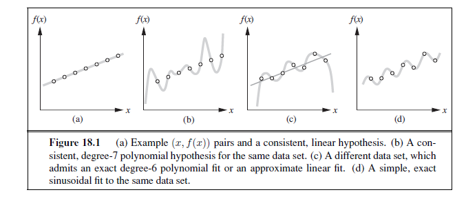

**generalizes** well if it correctly predicts the value of y for novel examples. Sometimes the function f is stochastic—it is not strictly a function of x, and what we have to learn is a conditional probability distribution, **P**(Y | x).

When the output y is one of a finite set of values (such as _sunny, cloudy_ or _rainy_), the learning problem is called **classification,** and is called Boolean or binary classification if there are only two values. When y is a number (such as tomorrow’s temperature), the learning problem is called **regression**. (Technically, solving a regression problem is finding a conditional expectation or average value of y, because the probability that we have found _exactly_ the right real-valued number for y is 0.)

Figure 18.1 shows a familiar example: fitting a function of a single variable to some data points. The examples are points in the (x, y) plane, where y = f(x). We don’t know what f is, but we will approximate it with a function h selected from a **hypothesis space**, H, which for this example we will take to be the set of polynomials, such as x^5^+3x^2^+2. Figure 18.1(a)
shows some data with an exact fit by a straight line (the polynomial 0.4x + 3). The line is called a **consistent** hypothesis because it agrees with all the data. Figure 18.1(b) shows a high-degree polynomial that is also consistent with the same data. This illustrates a fundamental problem in inductive learning: _how do we choose from among multiple consistent hypotheses?_ One answer is to prefer the _simplest_ hypothesis consistent with the data. This principle is called **Ockham’s razor**, after the 14th-century English philosopher William of Ockham, who used it to argue sharply against all sorts of complications. Defining simplicity is not easy, but it seems clear that a degree-1 polynomial is simpler than a degree-7 polynomial, and thus (a) should be preferred to (b). We will make this intuition more precise in Section 18.4.3.

Figure 18.1(c) shows a second data set. There is no consistent straight line for this data set; in fact, it requires a degree-6 polynomial for an exact fit. There are just 7 data points, so a polynomial with 7 parameters does not seem to be finding any pattern in the data and we do not expect it to generalize well. A straight line that is not consistent with any of the data points, but might generalize fairly well for unseen values of x, is also shown in (c). _In general, there is a tradeoff between complex hypotheses that fit the training data well and simpler hypotheses that may generalize better._ In Figure 18.1(d) we expand the hypothesis space H to allow polynomials over both x and sin(x), and find that the data in (c) can be fitted exactly by a simple function of the form ax + b + c sin(x). This shows the importance of the choice of hypothesis space. We say that a learning problem is **realizable** if the hypothesis space contains the true function. Unfortunately, we cannot always tell whether a given learning problem is realizable, because the true function is not known.

In some cases, an analyst looking at a problem is willing to make more fine-grained distinctions about the hypothesis space, to say—even before seeing any data—not just that a hypothesis is possible or impossible, but rather how probable it is. Supervised learning can be done by choosing the hypothesis h^∗^that is most probable given the data:

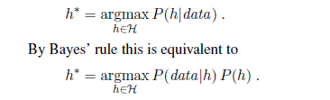

Then we can say that the prior probability P (h) is high for a degree-1 or -2 polynomial, lower for a degree-7 polynomial, and especially low for degree-7 polynomials with large, sharp spikes as in Figure 18.1(b). We allow unusual-looking functions when the data say we really need them, but we discourage them by giving them a low prior probability.

Why not let H be the class of all Java programs, or Turing machines? After all, every computable function can be represented by some Turing machine, and that is the best we can do. One problem with this idea is that it does not take into account the computational complexity of learning. _There is a tradeoff between the expressiveness of a hypothesis space and the complexity of finding a good hypothesis within that space._ For example, fitting a straight line to data is an easy computation; fitting high-degree polynomials is somewhat harder; and fitting Turing machines is in general undecidable. A second reason to prefer simple hypothesis spaces is that presumably we will want to use h after we have learned it, and computing h(x) when h is a linear function is guaranteed to be fast, while computing an arbitrary Turing machine program is not even guaranteed to terminate. For these reasons, most work on learning has focused on simple representations.

We will see that the expressiveness–complexity tradeoff is not as simple as it first seems: it is often the case, as we saw with first-order logic in Chapter 8, that an expressive language makes it possible for a _simple_ hypothesis to fit the data, whereas restricting the expressiveness of the language means that any consistent hypothesis must be very complex. For example, the rules of chess can be written in a page or two of first-order logic, but require thousands of pages when written in propositional logic.

## LEARNING DECISION TREES

Decision tree induction is one of the simplest and yet most successful forms of machine learning. We first describe the representation—the hypothesis space—and then show how to learn a good hypothesis.  


### The decision tree representation

A **decision tree** represents a function that takes as input a vector of attribute values and returns a “decision”—a single output value. The input and output values can be discrete or continuous. For now we will concentrate on problems where the inputs have discrete values and the output has exactly two possible values; this is Boolean classification, where each example input will be classified as true (a **positive** example) or false (a **negative** example).

 A decision tree reaches its decision by performing a sequence of tests. Each internal node in the tree corresponds to a test of the value of one of the input attributes, Ai, and the branches from the node are labeled with the possible values of the attribute, Ai = vik. Each leaf node in the tree specifies a value to be returned by the function. The decision tree representation is natural for humans; indeed, many “How To” manuals (e.g., for car repair) are written entirely as a single decision tree stretching over hundreds of pages.

As an example, we will build a decision tree to decide whether to wait for a table at a restaurant. The aim here is to learn a definition for the **goal predicate** WillWait . First we list the attributes that we will consider as part of the input:

1\. Alternate: whether there is a suitable alternative restaurant nearby.

2\. Bar : whether the restaurant has a comfortable bar area to wait in.

3\. Fri/Sat : true on Fridays and Saturdays.

4\. Hungry: whether we are hungry.

5\. Patrons : how many people are in the restaurant (values are None, Some , and Full ).

6\. Price: the restaurant’s price range ($, $$, $$$). 7. Raining : whether it is raining outside.

8\. Reservation : whether we made a reservation.

9\. Type: the kind of restaurant (French, Italian, Thai, or burger).

10\. WaitEstimate: the wait estimated by the host (0–10 minutes, 10–30, 30–60, or >60).

Note that every variable has a small set of possible values; the value of WaitEstimate , for example, is not an integer, rather it is one of the four discrete values 0–10, 10–30, 30–60, or >60. The decision tree usually used by one of us (SR) for this domain is shown in Figure 18.2. Notice that the tree ignores the Price and Type attributes. Examples are processed by the tree starting at the root and following the appropriate branch until a leaf is reached. For instance, an example with Patrons =Full and WaitEstimate = 0–10 will be classified as positive (i.e., yes, we will wait for a table).

### Expressiveness of decision trees

A Boolean decision tree is logically equivalent to the assertion that the goal attribute is true if and only if the input attributes satisfy one of the paths leading to a leaf with value true . Writing this out in propositional logic, we have

Goal ⇔ (Path~1~ ∨ Path~2~ ∨ · · ·) ,

where each Path is a conjunction of attribute-value tests required to follow that path. Thus, the whole expression is equivalent to disjunctive normal form (see page 283), which means that any function in propositional logic can be expressed as a decision tree. As an example, the rightmost path in Figure 18.2 is

Path = (Patrons =Full ∧WaitEstimate = 0–10) .

For a wide variety of problems, the decision tree format yields a nice, concise result. But some functions cannot be represented concisely. For example, the majority function, which returns true if and only if more than half of the inputs are true, requires an exponentially large decision tree. In other words, decision trees are good for some kinds of functions and bad for others. Is there _any_ kind of representation that is efficient for _all_ kinds of functions? Unfortunately, the answer is no. We can show this in a general way. Consider the set of all Boolean functions on n attributes. How many different functions are in this set? This is just the number of different truth tables that we can write down, because the function is defined by its truth table. A truth table over n attributes has 2n rows, one for each combination of values of the attributes. We can consider the “answer” column of the table as a 2n-bit number that defines the function. That means there are 22n different functions (and there will be more than that number of trees, since more than one tree can compute the same function). This is a scary number. For example, with just the ten Boolean attributes of our restaurant problem there are 21024 or about 10308 different functions to choose from, and for 20 attributes there are over 10300,000. We will need some ingenious algorithms to find good hypotheses in such a large space.

### Inducing decision trees from examples

An example for a Boolean decision tree consists of an (**x**, y) pair, where **x** is a vector of values for the input attributes, and y is a single Boolean output value. A training set of 12 examples

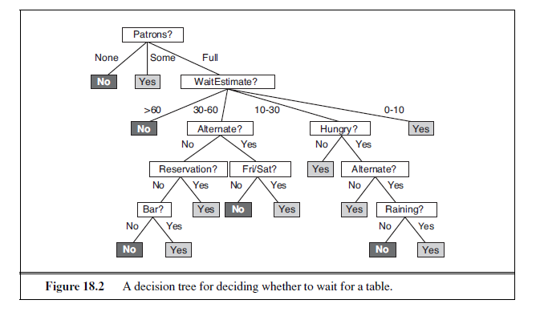

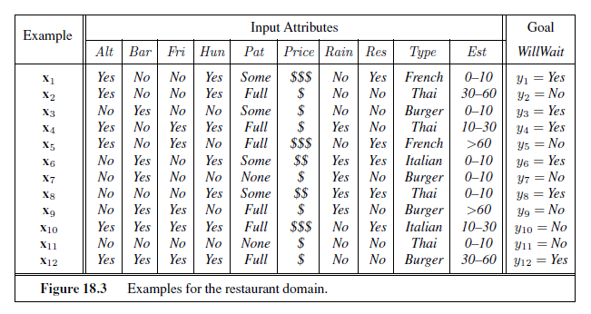


is shown in Figure 18.3. The positive examples are the ones in which the goal WillWait is true (**x**~1~, **x**~3~, . . .); the negative examples are the ones in which it is false (**x**~2~, **x**~5~, . . .).

We want a tree that is consistent with the examples and is as small as possible. Unfortunately, no matter how we measure size, it is an intractable problem to find the smallest consistent tree; there is no way to efficiently search through the 22n trees. With some simple heuristics, however, we can find a good approximate solution: a small (but not smallest) consistent tree. The DECISION-TREE-LEARNING algorithm adopts a greedy divide-and-conquer strategy: always test the most important attribute first. This test divides the problem up into smaller subproblems that can then be solved recursively. By “most important attribute,” we mean the one that makes the most difference to the classification of an example. That way, we hope to get to the correct classification with a small number of tests, meaning that all paths in the tree will be short and the tree as a whole will be shallow.

Figure 18.4(a) shows that Type is a poor attribute, because it leaves us with four possible outcomes, each of which has the same number of positive as negative examples. On the other hand, in (b) we see that Patrons is a fairly important attribute, because if the value is None or Some , then we are left with example sets for which we can answer definitively (No and Yes , respectively). If the value is Full , we are left with a mixed set of examples. In general, after the first attribute test splits up the examples, each outcome is a new decision tree learning problem in itself, with fewer examples and one less attribute. There are four cases to consider for these recursive problems:

1\. If the remaining examples are all positive (or all negative), then we are done: we can answer Yes or No. Figure 18.4(b) shows examples of this happening in the None and Some branches.

2\. If there are some positive and some negative examples, then choose the best attribute to split them. Figure 18.4(b) shows Hungry being used to split the remaining examples.

3\. If there are no examples left, it means that no example has been observed for this com 

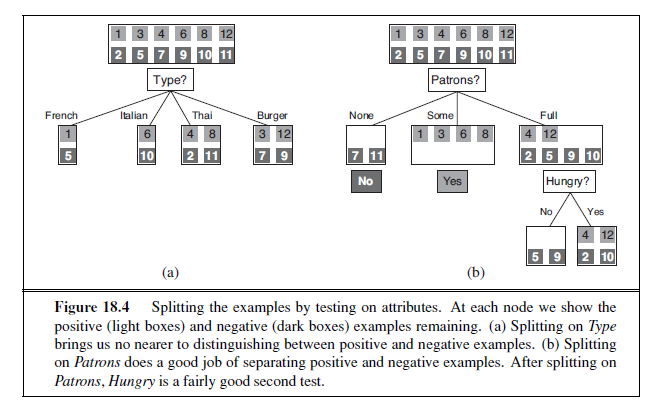

bination of attribute values, and we return a default value calculated from the plurality classification of all the examples that were used in constructing the node’s parent. These are passed along in the variable parent examples .

4\. If there are no attributes left, but both positive and negative examples, it means that these examples have exactly the same description, but different classifications. This can happen because there is an error or **noise** in the data; because the domain is nondeter-ministic; or because we can’t observe an attribute that would distinguish the examples. The best we can do is return the plurality classification of the remaining examples.

The DECISION-TREE-LEARNING algorithm is shown in Figure 18.5. Note that the set of examples is crucial for _constructing_ the tree, but nowhere do the examples appear in the tree itself. A tree consists of just tests on attributes in the interior nodes, values of attributes on the branches, and output values on the leaf nodes. The details of the IMPORTANCE function are given in Section 18.3.4. The output of the learning algorithm on our sample training set is shown in Figure 18.6. The tree is clearly different from the original tree shown in Figure 18.2. One might conclude that the learning algorithm is not doing a very good job of learning the correct function. This would be the wrong conclusion to draw, however. The learning algorithm looks at the _examples_, not at the correct function, and in fact, its hypothesis (see Figure 18.6) not only is consistent with all the examples, but is considerably simpler than the original tree! The learning algorithm has no reason to include tests for Raining and Reservation , because it can classify all the examples without them. It has also detected an interesting and previously unsuspected pattern: the first author will wait for Thai food on weekends. It is also bound to make some mistakes for cases where it has seen no examples. For example, it has never seen a case where the wait is 0–10 minutes but the restaurant is full.  

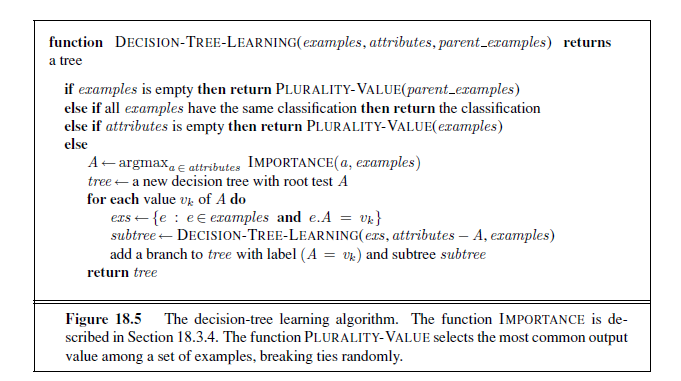

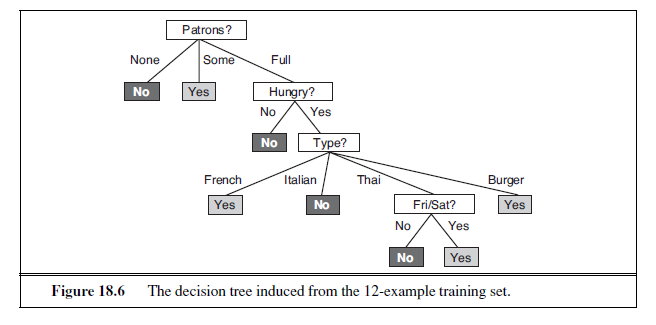

In that case it says not to wait when Hungry is false, but I (SR) would certainly wait. With more training examples the learning program could correct this mistake.

We note there is a danger of over-interpreting the tree that the algorithm selects. When there are several variables of similar importance, the choice between them is somewhat arbitrary: with slightly different input examples, a different variable would be chosen to split on first, and the whole tree would look completely different. The function computed by the tree would still be similar, but the structure of the tree can vary widely.

We can evaluate the accuracy of a learning algorithm with a **learning curve**, as shown in Figure 18.7. We have 100 examples at our disposal, which we split into a training set and 

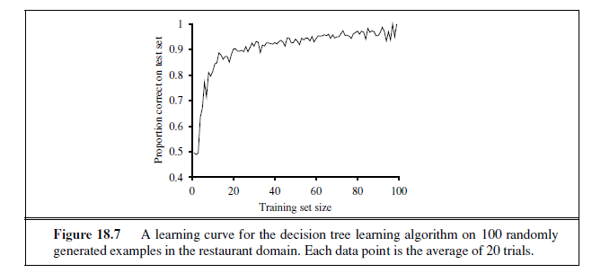

a test set. We learn a hypothesis h with the training set and measure its accuracy with the test set. We do this starting with a training set of size 1 and increasing one at a time up to size 99. For each size we actually repeat the process of randomly splitting 20 times, and average the results of the 20 trials. The curve shows that as the training set size grows, the accuracy increases. (For this reason, learning curves are also called **happy graphs**.) In this graph we reach 95% accuracy, and it looks like the curve might continue to increase with more data.

### Choosing attribute tests

The greedy search used in decision tree learning is designed to approximately minimize the depth of the final tree. The idea is to pick the attribute that goes as far as possible toward providing an exact classification of the examples. A perfect attribute divides the examples into sets, each of which are all positive or all negative and thus will be leaves of the tree. The Patrons attribute is not perfect, but it is fairly good. A really useless attribute, such as Type , leaves the example sets with roughly the same proportion of positive and negative examples as the original set.

All we need, then, is a formal measure of “fairly good” and “really useless” and we can implement the IMPORTANCE function of Figure 18.5. We will use the notion of information gain, which is defined in terms of **entropy**, the fundamental quantity in information theo (Shannon and Weaver, 1949). Entropy is a measure of the uncertainty of a random variable; acquisition of information corresponds to a reduction in entropy. A random variable with only one value—a coin that always comes up heads—has no uncertainty and thus its entropy is defined as zero; thus, we gain no information by observing its value. A flip of a fair coin is equally likely to come up heads or tails, 0 or 1, and we will soon show that this counts as “1 bit” of entropy. The roll of a fair _four_-sided die has 2 bits of entropy, because it takes two bits to describe one of four equally probable choices. Now consider an unfair coin that comes up heads 99% of the time. Intuitively, this coin has less uncertainty than the fair coin—if we guess heads we’ll be wrong only 1% of the time—so we would like it to have an entropy measure that is close to zero, but  positive. In general, the entropy of a random variable V with values vk, each with probability P (vk), is defined as

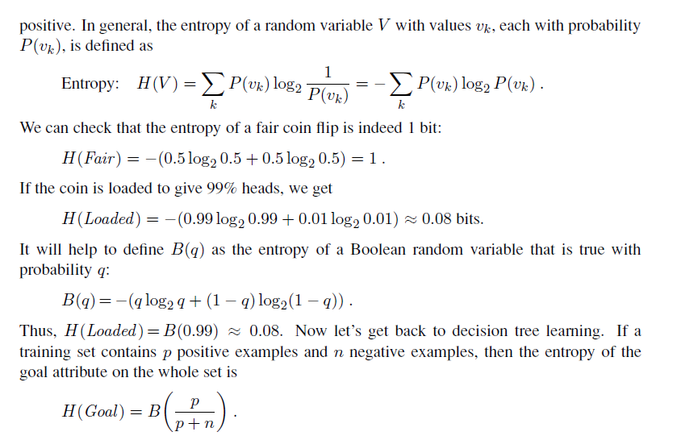
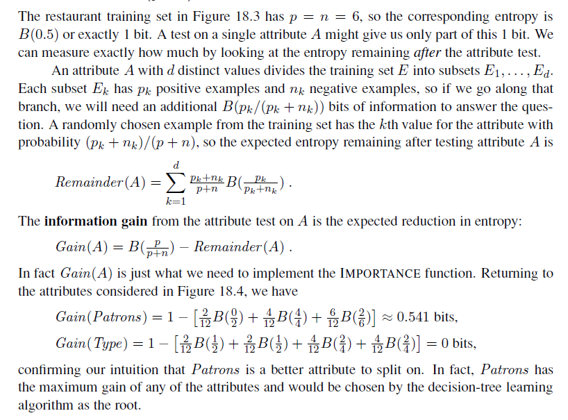

### Generalization and overfitting

On some problems, the DECISION-TREE-LEARNING algorithm will generate a large tree when there is actually no pattern to be found. Consider the problem of trying to predict whether the roll of a die will come up as 6 or not. Suppose that experiments are carried out with various dice and that the attributes describing each training example include the color of the die, its weight, the time when the roll was done, and whether the experimenters had their fingers crossed. If the dice are fair, the right thing to learn is a tree with a single node that says “no,” But the DECISION-TREE-LEARNING algorithm will seize on any pattern it can find in the input. If it turns out that there are 2 rolls of a 7-gram blue die with fingers crossed and they both come out 6, then the algorithm may construct a path that predicts 6 in that case. This problem is called **overfitting.** A general phenomenon, overfitting occurs with all types of learners, even when the target function is not at all random. In Figure 18.1(b) and (c), we saw polynomial functions overfitting the data. Overfitting becomes more likely as the hypothesis space and the number of input attributes grows, and less likely as we increase the number of training examples.

For decision trees, a technique called **decision tree pruning** combats overfitting. Pruning works by eliminating nodes that are not clearly relevant. We start with a full tree, as generated by DECISION-TREE-LEARNING. We then look at a test node that has only leaf nodes as descendants. If the test appears to be irrelevant—detecting only noise in the data— then we eliminate the test, replacing it with a leaf node. We repeat this process, considering each test with only leaf descendants, until each one has either been pruned or accepted as is.

The question is, how do we detect that a node is testing an irrelevant attribute? Suppose we are at a node consisting of p positive and n negative examples. If the attribute is irrelevant, we would expect that it would split the examples into subsets that each have roughly the same proportion of positive examples as the whole set, p/(p + n), and so the information gain will be close to zero.2 Thus, the information gain is a good clue to irrelevance. Now the question is, how large a gain should we require in order to split on a particular attribute?

We can answer this question by using a statistical **significance test**. Such a test begins by assuming that there is no underlying pattern (the so-called **null hypothesis**). Then the actual data are analyzed to calculate the extent to which they deviate from a perfect absence of pattern. If the degree of deviation is statistically unlikely (usually taken to mean a 5% probability or less), then that is considered to be good evidence for the presence of a significant pattern in the data. The probabilities are calculated from standard distributions of the amount of deviation one would expect to see in random sampling.

In this case, the null hypothesis is that the attribute is irrelevant and, hence, that the information gain for an infinitely large sample would be zero. We need to calculate the probability that, under the null hypothesis, a sample of size v = n + p would exhibit the observed deviation from the expected distribution of positive and negative examples. We can measure the deviation by comparing the actual numbers of positive and negative examples in
```
2 The gain will be strictly positive except for the unlikely case where all the proportions are _exactly_ the same. (See Exercise 18.5.)  
```
each subset, pk and nk, with the expected numbers, p̂k and n̂k, assuming true irrelevance:

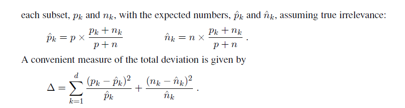

Under the null hypothesis, the value of Δ is distributed according to the χ 2 (chi-squared) distribution with v − 1 degrees of freedom. We can use a χ 2 table or a standard statistical library routine to see if a particular Δ value confirms or rejects the null hypothesis. For example, consider the restaurant type attribute, with four values and thus three degrees of freedom. A value of Δ = 7.82 or more would reject the null hypothesis at the 5% level (and a value of Δ = 11.35 or more would reject at the 1% level). Exercise 18.8 asks you to extend the DECISION-TREE-LEARNING algorithm to implement this form of pruning, which is known as χ2 **pruning**.χ 2 With pruning, noise in the examples can be tolerated. Errors in the example’s label (e.g., an example (**x**,Yes) that should be (**x**,No)) give a linear increase in prediction error, whereas errors in the descriptions of examples (e.g., Price = $ when it was actually Price = $$) have an asymptotic effect that gets worse as the tree shrinks down to smaller sets. Pruned trees perform significantly better than unpruned trees when the data contain a large amount of noise. Also, the pruned trees are often much smaller and hence easier to understand.

One final warning: You might think that χ 2 pruning and information gain look similar,so why not combine them using an approach called **early stopping**—have the decision tree algorithm stop generating nodes when there is no good attribute to split on, rather than going to all the trouble of generating nodes and then pruning them away. The problem with early stopping is that it stops us from recognizing situations where there is no one good attribute, but there are combinations of attributes that are informative. For example, consider the XOR function of two binary attributes. If there are roughly equal number of examples for all four combinations of input values, then neither attribute will be informative, yet the correct thing to do is to split on one of the attributes (it doesn’t matter which one), and then at the second level we will get splits that are informative. Early stopping would miss this, but generateand-then-prune handles it correctly.

### Broadening the applicability of decision trees

In order to extend decision tree induction to a wider variety of problems, a number of issues must be addressed. We will briefly mention several, suggesting that a full understanding is best obtained by doing the associated exercises:

- **Missing data**: In many domains, not all the attribute values will be known for every example. The values might have gone unrecorded, or they might be too expensive to obtain. This gives rise to two problems: First, given a complete decision tree, how should one classify an example that is missing one of the test attributes? Second, how should one modify the information-gain formula when some examples have unknown values for the attribute? These questions are addressed in Exercise 18.9.

- **Multivalued attributes**: When an attribute has many possible values, the information gain measure gives an inappropriate indication of the attribute’s usefulness. In the extreme case, an attribute such as ExactTime has a different value for every example, which means each subset of examples is a singleton with a unique classification, and the information gain measure would have its highest value for this attribute. But choosing this split first is unlikely to yield the best tree. One solution is to use the **gain ratio** (Exercise 18.10). Another possibility is to allow a Boolean test of the form A= vk, that is, picking out just one of the possible values for an attribute, leaving the remaining values to possibly be tested later in the tree.

- **Continuous and integer-valued input attributes**: Continuous or integer-valued attributes such as Height and Weight , have an infinite set of possible values. Rather than generate infinitely many branches, decision-tree learning algorithms typically find the **split point** that gives the highest information gain. For example, at a given node in the tree, it might be the case that testing on Weight > 160 gives the most information. Efficient methods exist for finding good split points: start by sorting the values of the attribute, and then consider only split points that are between two examples in sorted order that have different classifications, while keeping track of the running totals of positive and negative examples on each side of the split point. Splitting is the most expensive part of real-world decision tree learning applications.

- **Continuous-valued output attributes**: If we are trying to predict a numerical output value, such as the price of an apartment, then we need a **regression tree** rather than a classification tree. A regression tree has at each leaf a linear function of some subset of numerical attributes, rather than a single value. For example, the branch for twobedroom apartments might end with a linear function of square footage, number of bathrooms, and average income for the neighborhood. The learning algorithm must decide when to stop splitting and begin applying linear regression (see Section 18.6) over the attributes.

A decision-tree learning system for real-world applications must be able to handle all of these problems. Handling continuous-valued variables is especially important, because both physical and financial processes provide numerical data. Several commercial packages have been built that meet these criteria, and they have been used to develop thousands of fielded systems. In many areas of industry and commerce, decision trees are usually the first method tried when a classification method is to be extracted from a data set. One important property of decision trees is that it is possible for a human to understand the reason for the output of the learning algorithm. (Indeed, this is a _legal requirement_ for financial decisions that are subject to anti-discrimination laws.) This is a property not shared by some other representations, such as neural networks.  


## EVALUATING AND CHOOSING THE BEST HYPOTHESIS

We want to learn a hypothesis that fits the future data best. To make that precise we need to define “future data” and “best.” We make the **stationarity assumption**: that there is a probability distribution over examples that remains stationary over time. Each example data point (before we see it) is a random variable Ej whose observed value ej = (x~j~, y~j~) is sampled from that distribution, and is independent of the previous examples:

**P**(E~j~ |E~j−1~, E~j−2~, . . .) = **P**(E~j~) ,

and each example has an identical prior probability distribution:

**P**(E~j~) = **P**(E~j−1~) = **P**(E~j−2~) = · · · .

Examples that satisfy these assumptions are called _independent and identically distributed_ or **i.i.d.**. An i.i.d. assumption connects the past to the future; without some such connection, allbets are off—the future could be anything. (We will see later that learning can still occur if there are _slow_ changes in the distribution.)

The next step is to define “best fit.” We define the **error rate** of a hypothesis as the proportion of mistakes it makes—the proportion of times that h(x) == y for an (x, y) example. Now, just because a hypothesis h has a low error rate on the training set does not mean that it will generalize well. A professor knows that an exam will not accurately evaluate students if they have already seen the exam questions. Similarly, to get an accurate evaluation of a hypothesis, we need to test it on a set of examples it has not seen yet. The simplest approach is the one we have seen already: randomly split the available data into a training set from which the learning algorithm produces h and a test set on which the accuracy of h is evaluated. This method, sometimes called **holdout cross-validation**, has the disadvantage that it fails to use all the available data; if we use half the data for the test set, then we are only training on half the data, and we may get a poor hypothesis. On the other hand, if we reserve only 10% of the data for the test set, then we may, by statistical chance, get a poor estimate of the actual accuracy.

We can squeeze more out of the data and still get an accurate estimate using a technique called k **-fold cross-validation**. The idea is that each example serves double duty—as training K- data and test data. First we split the data into k equal subsets. We then perform k rounds of learning; on each round 1/k of the data is held out as a test set and the remaining examples are used as training data. The average test set score of the k rounds should then be a better estimate than a single score. Popular values for k are 5 and 10—enough to give an estimate that is statistically likely to be accurate, at a cost of 5 to 10 times longer computation time. The extreme is k = n, also known as **leave-one-out cross-validation** or **LOOCV**. LOOCV Despite the best efforts of statistical methodologists, users frequently invalidate their results by inadvertently **peeking** at the test data. Peeking can happen like this: A learning algorithm has various “knobs” that can be twiddled to tune its behavior—for example, various different criteria for choosing the next attribute in decision tree learning. The researcher generates hypotheses for various different settings of the knobs, measures their error rates on the test set, and reports the error rate of the best hypothesis. Alas, peeking has occurred! The reason is that the hypothesis was selected _on the basis of its test set error rate_, so information about the test set has leaked into the learning algorithm.

Peeking is a consequence of using test-set performance to both _choose_ a hypothesis and _evaluate_ it. The way to avoid this is to _really_ hold the test set out—lock it away until you are completely done with learning and simply wish to obtain an independent evaluation of the final hypothesis. (And then, if you don’t like the results . . . you have to obtain, and lock away, a completely new test set if you want to go back and find a better hypothesis.) If the test set is locked away, but you still want to measure performance on unseen data as a way of selecting a good hypothesis, then divide the available data (without the test set) into a training set and a **validation set**. The next section shows how to use validation sets to find a good tradeoff between hypothesis complexity and goodness of fit.

### Model selection: Complexity versus goodness of fit

In Figure 18.1 (page 696) we showed that higher-degree polynomials can fit the training data better, but when the degree is too high they will overfit, and perform poorly on validation data. Choosing the degree of the polynomial is an instance of the problem of **model selection**. You can think of the task of finding the best hypothesis as two tasks: model selection defines the hypothesis space and then **optimization** finds the best hypothesis within that space.In this section we explain how to select among models that are parameterized by size . For example, with polynomials we have size = 1 for linear functions, size = 2 for quadratics, and so on. For decision trees, the size could be the number of nodes in the tree. In all cases we want to find the value of the size parameter that best balances underfitting and overfitting to give the best test set accuracy.

An algorithm to perform model selection and optimization is shown in Figure 18.8. It is a **wrapper** that takes a learning algorithm as an argument (DECISION-TREE-LEARNING, for example). The wrapper enumerates models according to a parameter, size . For each size, it uses cross validation on Learner to compute the average error rate on the training and test sets. We start with the smallest, simplest models (which probably underfit the data), and iterate, considering more complex models at each step, until the models start to overfit. In Figure 18.9 we see typical curves: the training set error decreases monotonically (although there may in general be slight random variation), while the validation set error decreases at first, and then increases when the model begins to overfit. The cross-validation procedure picks the value of size with the lowest validation set error; the bottom of the U-shaped curve. We then generate a hypothesis of that size , using all the data (without holding out any of it). Finally, of course, we should evaluate the returned hypothesis on a separate test set.

This approach requires that the learning algorithm accept a parameter, size , and deliver a hypothesis of that size. As we said, for decision tree learning, the size can be the number of nodes. We can modify DECISION-TREE-LEARNER so that it takes the number of nodes as an input, builds the tree breadth-first rather than depth-first (but at each level it still chooses the highest gain attribute first), and stops when it reaches the desired number of nodes.  

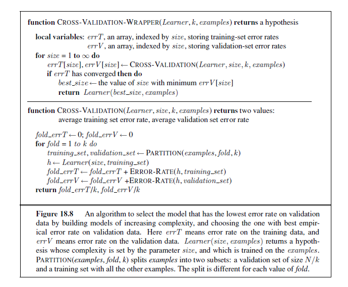

### From error rates to loss

So far, we have been trying to minimize error rate. This is clearly better than maximizing error rate, but it is not the full story. Consider the problem of classifying email messages as spam or non-spam. It is worse to classify non-spam as spam (and thus potentially miss an important message) then to classify spam as non-spam (and thus suffer a few seconds of annoyance). So a classifier with a 1% error rate, where almost all the errors were classifying spam as non-spam, would be better than a classifier with only a 0.5% error rate, if most of those errors were classifying non-spam as spam. We saw in Chapter 16 that decision-makers should maximize expected utility, and utility is what learners should maximize as well. In machine learning it is traditional to express utilities by means of a **loss function**. The loss\ function L(x, y, ŷ) is defined as the amount of utility lost by predicting h(x)= ŷ when the correct answer is f(x)= y:

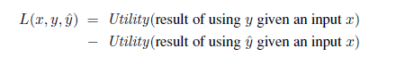

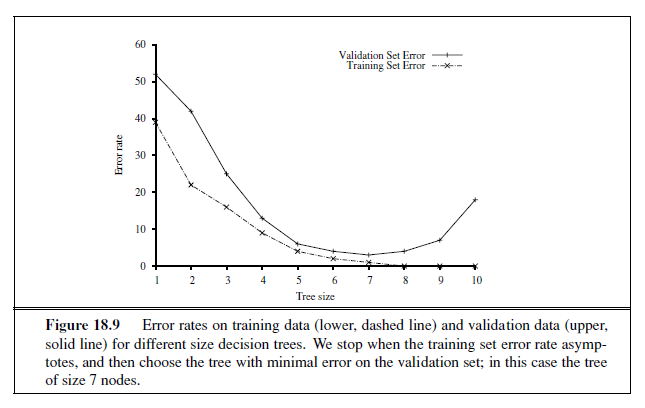

This is the most general formulation of the loss function. Often a simplified version is used, L(y, ŷ), that is independent of x. We will use the simplified version for the rest of this chapter, which means we can’t say that it is worse to misclassify a letter from Mom than it is to misclassify a letter from our annoying cousin, but we can say it is 10 times worse to classify non-spam as spam than vice-versa:
```
L(spam ,nospam) = 1, L(nospam , spam) = 10 .
```
Note that L(y, y) is always zero; by definition there is no loss when you guess exactly right. For functions with discrete outputs, we can enumerate a loss value for each possible misclassification, but we can’t enumerate all the possibilities for real-valued data. If f(x) is 137.035999, we would be fairly happy with h(x) = 137.036, but just how happy should we be? In general small errors are better than large ones; two functions that implement that idea are the absolute value of the difference (called the L1 loss), and the square of the difference (called the L2 loss). If we are content with the idea of minimizing error rate, we can use the L0/1 loss function, which has a loss of 1 for an incorrect answer and is appropriate for discrete-valued outputs:
```
Absolute value loss: L1(y, ŷ) = |y − ŷ|

Squared error loss: L2(y, ŷ) = (y − ŷ)2

0/1 loss: L0/1(y, ŷ) = 0 if y = ŷ, else 1
```
The learning agent can theoretically maximize its expected utility by choosing the hypothesis that minimizes expected loss over all input–output pairs it will see. It is meaningless to talk about this expectation without defining a prior probability distribution, **P**(X,Y ) over examples. Let E be the set of all possible input–output examples. Then the expected **generalization loss** for a hypothesis h (with respect to loss function L) is

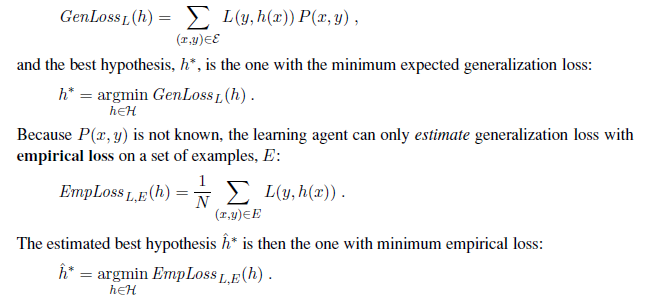


There are four reasons why ĥ ∗ may differ from the true function, f : unrealizability, variance noise, and computational complexity. First, f may not be realizable—may not be in H—or may be present in such a way that other hypotheses are preferred. Second, a learning algorithm will return different hypotheses for different sets of examples, even if those sets are drawn from the same true function f , and those hypotheses will make different predictions on new examples. The higher the variance among the predictions, the higher the probability of significant error. Note that even when the problem is realizable, there will still be random variance, but that variance decreases towards zero as the number of training examples increases. Third, f may be nondeterministic or **noisy**—it may return different values for f(x) each time x occurs. By definition, noise cannot be predicted; in many cases, it arises because the observed labels y are the result of attributes of the environment not listed in x. And finally, when H is complex, it can be computationally intractable to systematically search the whole hypothesis space. The best we can do is a local search (hill climbing or greedy search) that explores only part of the space. That gives us an approximation error. Combining the sources of error, we’re left with an estimation of an approximation of the true function f .

Traditional methods in statistics and the early years of machine learning concentrated on **small-scale learning**, where the number of training examples ranged from dozens to the low thousands. Here the generalization error mostly comes from the approximation error of not having the true f in the hypothesis space, and from estimation error of not having enough training examples to limit variance. In recent years there has been more emphasis on **largescale learning**, often with millions of examples. Here the generalization error is dominated by limits of computation: there is enough data and a rich enough model that we could find an h that is very close to the true f , but the computation to find it is too complex, so we settle for a sub-optimal approximation.

### Regularization

In Section 18.4.1, we saw how to do model selection with cross-validation on model size. An alternative approach is to search for a hypothesis that directly minimizes the weighted sum of empirical loss and the complexity of the hypothesis, which we will call the total cost:
```
Cost(h) = EmpLoss(h) + λComplexity(h)

ĥ^∗^ = argmin~h∈H~ Cost(h) .
```
Here λ is a parameter, a positive number that serves as a conversion rate between loss and hypothesis complexity (which after all are not measured on the same scale). This approach combines loss and complexity into one metric, allowing us to find the best hypothesis all at once. Unfortunately we still need to do a cross-validation search to find the hypothesis that generalizes best, but this time it is with different values of λ rather than size . We select the value of λ that gives us the best validation set score.

This process of explicitly penalizing complex hypotheses is called **regularization** (be- cause it looks for a function that is more regular, or less complex). Note that the cost function requires us to make two choices: the loss function and the complexity measure, which is called a regularization function. The choice of regularization function depends on the hypothesis space. For example, a good regularization function for polynomials is the sum of the squares of the coefficients—keeping the sum small would guide us away from the wiggly polynomials in Figure 18.1(b) and (c). We will show an example of this type of regularization in Section 18.6.

Another way to simplify models is to reduce the dimensions that the models work with. A process of **feature selection** can be performed to discard attributes that appear to be irrelevant. χ 2 pruning is a kind of feature selection.

It is in fact possible to have the empirical loss and the complexity measured on the same scale, without the conversion factor λ: they can both be measured in bits. First encode the hypothesis as a Turing machine program, and count the number of bits. Then count the number of bits required to encode the data, where a correctly predicted example costs zero bits and the cost of an incorrectly predicted example depends on how large the error is. The **minimum description length** or MDL hypothesis minimizes the total number of bits required. This works well in the limit, but for smaller problems there is a difficulty in that the choice of encoding for the program—for example, how best to encode a decision tree as a bit string—affects the outcome. In Chapter 20 (page 805), we describe a probabilistic interpretation of the MDL approach.

## THE THEORY OF LEARNING

The main unanswered question in learning is this: How can we be sure that our learning algorithm has produced a hypothesis that will predict the correct value for previously unseen inputs? In formal terms, how do we know that the hypothesis h is close to the target function f if we don’t know what f is? These questions have been pondered for several centuries. In more recent decades, other questions have emerged: how many examples do we need to get a good h? What hypothesis space should we use? If the hypothesis space is very complex, can we even find the best h, or do we have to settle for a local maximum in the space of hypotheses? How complex should h be? How do we avoid overfitting? This section examines these questions.

We’ll start with the question of how many examples are needed for learning. We saw from the learning curve for decision tree learning on the restaurant problem (Figure 18.7 on page 703) that improves with more training data. Learning curves are useful, but they are specific to a particular learning algorithm on a particular problem. Are there some more general principles governing the number of examples needed in general? Questions like this are addressed by **computational learning theory**, which lies at the intersection of AI, statistics, and theoretical computer science. The underlying principle is that _any hypothesis that is seriously wrong will almost certainly be “found out” with high probability after a small number of examples, because it will make an incorrect prediction. Thus, any hypothesis that is consistent with a sufficiently large set of training examples is unlikely to be seriously wrong: that is, it must be **probably approximately correct**._ Any learning algorithm that returns hypotheses that are probably approximately correct is called a **PAC learning** algorithm; we can use this approach to provide bounds on the performance of various learning algorithms. PAC-learning theorems, like all theorems, are logical consequences of axioms. When a _theorem_ (as opposed to, say, a political pundit) states something about the future based on the past, the axioms have to provide the “juice” to make that connection. For PAC learning, the juice is provided by the stationarity assumption introduced on page 708, which says that future examples are going to be drawn from the same fixed distribution **P**(E)= **P**(X,Y ) as past examples. (Note that we do not have to know what distribution that is, just that it doesn’t change.) In addition, to keep things simple, we will assume that the true function f is deterministic and is a member of the hypothesis class H that is being considered. The simplest PAC theorems deal with Boolean functions, for which the 0/1 loss is appropriate. The **error rate** of a hypothesis h, defined informally earlier, is defined formally here as the expected generalization error for examples drawn from the stationary distribution:
```
error(h) = GenLoss~L0/1~ (h) = ∑~x,y~ L~0/1~(y, h(x))P (x, y) .
```
In other words, error(h) is the probability that h misclassifies a new example. This is the same quantity being measured experimentally by the learning curves shown earlier.

A hypothesis h is called **approximately correct** if error(h) ≤ ε, where ε is a small constant. We will show that we can find an N such that, after seeing N examples, with high probability, all consistent hypotheses will be approximately correct. One can think of an approximately correct hypothesis as being “close” to the true function in hypothesis space: it lies inside what is called the ε**\-ball** around the true function f . The hypothesis space outsideε-BALL this ball is called H~bad~. 

We can calculate the probability that a “seriously wrong” hypothesis hb ∈ Hbad is consistent with the first N examples as follows. We know that error(hb) > ε. Thus, the probability that it agrees with a given example is at most 1 − ε. Since the examples are independent, the bound for N examples is
```
P (h~b~ agrees with N examples) ≤ (1− ε)^N^
```

The probability that Hbad contains at least one consistent hypothesis is bounded by the sum of the individual probabilities:

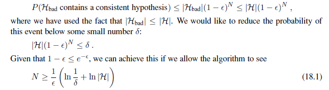

examples. Thus, if a learning algorithm returns a hypothesis that is consistent with this many examples, then with probability at least 1 − δ, it has error at most ε. In other words, it is probably approximately correct. The number of required examples, as a function of ε and δ, is called the **sample complexity** of the hypothesis space.

As we saw earlier, if H is the set of all Boolean functions on n attributes, then |H| = 2~2~n. Thus, the sample complexity of the space grows as 2n. Because the number of possible examples is also 2n, this suggests that PAC-learning in the class of all Boolean functions requires seeing all, or nearly all, of the possible examples. A moment’s thought reveals the reason for this: H contains enough hypotheses to classify any given set of examples in all possible ways. In particular, for any set of N examples, the set of hypotheses consistent with those examples contains equal numbers of hypotheses that predict xN+1 to be positive and hypotheses that predict xN+1 to be negative.

To obtain real generalization to unseen examples, then, it seems we need to restrict the hypothesis space H in some way; but of course, if we do restrict the space, we might eliminate the true function altogether. There are three ways to escape this dilemma. The first, which we will cover in Chapter 19, is to bring prior knowledge to bear on the problem. The second, which we introduced in Section 18.4.3, is to insist that the algorithm return not just any consistent hypothesis, but preferably a simple one (as is done in decision tree learning). In cases where finding simple consistent hypotheses is tractable, the sample complexity results are generally better than for analyses based only on consistency. The third escape, which we pursue next, is to focus on learnable subsets of the entire hypothesis space of Boolean functions. This approach relies on the assumption that the restricted language contains a hypothesis h that is close enough to the true function f ; the benefits are that the restricted hypothesis space allows for effective generalization and is typically easier to search. We now examine one such restricted language in more detail.

### PAC learning example: Learning decision lists

We now show how to apply PAC learning to a new hypothesis space: **decision lists**.decision list consists of a series of tests, each of which is a conjunction of literals. If a test succeeds when applied to an example description, the decision list specifies the value to be returned. If the test fails, processing continues with the next test in the list. Decision lists resemble decision trees, but their overall structure is simpler: they branch only in one  

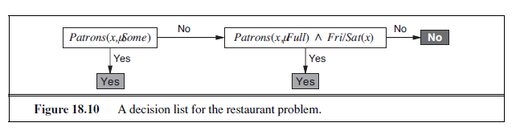

direction. In contrast, the individual tests are more complex. Figure 18.10 shows a decision list that represents the following hypothesis:
```
WillWait ⇔ (Patrons = Some) ∨ (Patrons = Full ∧ Fri/Sat) .
```
If we allow tests of arbitrary size, then decision lists can represent any Boolean function (Exercise 18.14). On the other hand, if we restrict the size of each test to at most k literals, then it is possible for the learning algorithm to generalize successfully from a small number of examples. We call this language k**\-DL**. The example in Figure 18.10 is in 2-DL. It is easy tok-DL show (Exercise 18.14) that k-DL includes as a subset the language k**\-DT**, the set of all decisionk-DT trees of depth at most k. It is important to remember that the particular language referred to by k-DL depends on the attributes used to describe the examples. We will use the notation k-DL(n) to denote a k-DL language using n Boolean attributes.

The first task is to show that k-DL is learnable—that is, that any function in k-DL can be approximated accurately after training on a reasonable number of examples. To do this, we need to calculate the number of hypotheses in the language. Let the language of tests— conjunctions of at most k literals using n attributes—be Conj (n, k). Because a decision list is constructed of tests, and because each test can be attached to either a Yes or a No outcome or can be absent from the decision list, there are at most 3|Conj (n,k)| distinct sets of component tests. Each of these sets of tests can be in any order, so

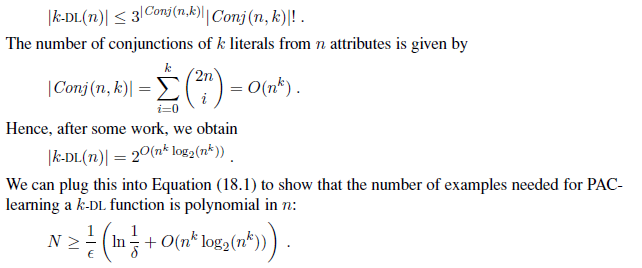

Therefore, any algorithm that returns a consistent decision list will PAC-learn a k-DL function in a reasonable number of examples, for small k.

The next task is to find an efficient algorithm that returns a consistent decision list. We will use a greedy algorithm called 
DECISION-LIST-LEARNING that repeatedly finds a  

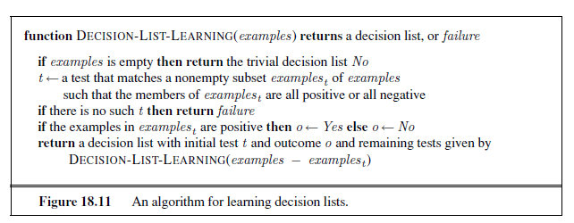

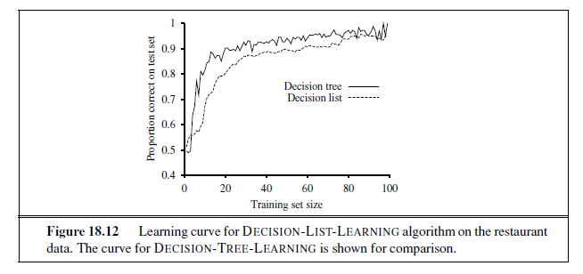


test that agrees exactly with some subset of the training set. Once it finds such a test, it adds it to the decision list under construction and removes the corresponding examples. It then constructs the remainder of the decision list, using just the remaining examples. This is repeated until there are no examples left. The algorithm is shown in Figure 18.11.

This algorithm does not specify the method for selecting the next test to add to the decision list. Although the formal results given earlier do not depend on the selection method, it would seem reasonable to prefer small tests that match large sets of uniformly classified examples, so that the overall decision list will be as compact as possible. The simplest strategy is to find the smallest test t that matches any uniformly classified subset, regardless of the size of the subset. Even this approach works quite well, as Figure 18.12 suggests.

## REGRESSION AND CLASSIFICATION WITH LINEAR MODELS

Now it is time to move on from decision trees and lists to a different hypothesis space, one that has been used for hundred of years: the class of **linear functions** of continuous-valued 

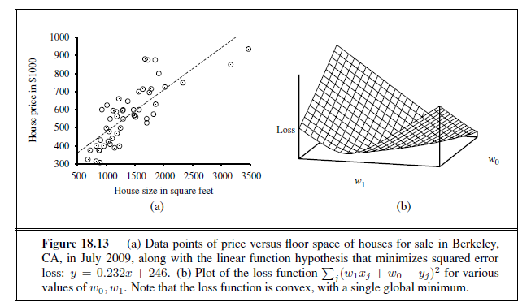


inputs. We’ll start with the simplest case: regression with a univariate linear function, otherwise known as “fitting a straight line.” Section 18.6.2 covers the multivariate case. Sections 18.6.3 and 18.6.4 show how to turn linear functions into classifiers by applying hard and soft thresholds.

### Univariate linear regression

A univariate linear function (a straight line) with input x and output y has the form y = w~1~x+ w~0~, where w~0~ and w~1~ are real-valued coefficients to be learned. We use the letter w because we think of the coefficients as **weights**; the value of y is changed by changing the relative weight of one term or another. We’ll define **w** to be the vector \[w~0~, w~1~\], and define

h**w**(x)= w~1~x + w~0~ .

Figure 18.13(a) shows an example of a training set of n points in the x, y plane, each point representing the size in square feet and the price of a house offered for sale. The task of finding the h**w** that best fits these data is called **linear regression**. To fit a line to the data, all we have to do is find the values of the weights \[w0, w1\] that minimize the empirical loss. It is traditional (going back to Gauss3) to use the squared loss function, L2, summed over all the training examples:

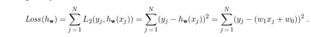
```
3 Gauss showed that if the y~j~ values have normally distributed noise, then the most likely values of w~1~ and w~0~ are obtained by minimizing the sum of the squares of the errors.  
```

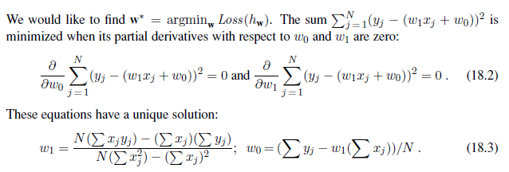

For the example in Figure 18.13(a), the solution is w1 = 0.232, w0 = 246, and the line with those weights is shown as a dashed line in the figure.

Many forms of learning involve adjusting weights to minimize a loss, so it helps to have a mental picture of what’s going on in **weight space**—the space defined by all possible settings of the weights. For univariate linear regression, the weight space defined by w0 and w1 is two-dimensional, so we can graph the loss as a function of w0 and w1 in a 3D plot (see Figure 18.13(b)). We see that the loss function is **convex**, as defined on page 133; this is true for _every_ linear regression problem with an L2 loss function, and implies that there are no local minima. In some sense that’s the end of the story for linear models; if we need to fit lines to data, we apply Equation (18.3).4

To go beyond linear models, we will need to face the fact that the equations defining minimum loss (as in Equation (18.2)) will often have no closed-form solution. Instead, we will face a general optimization search problem in a continuous weight space. As indicated in Section 4.2 (page 129), such problems can be addressed by a hill-climbing algorithm that follows the **gradient** of the function to be optimized. In this case, because we are trying to minimize the loss, we will use **gradient descent**. We choose any starting point in weight space—here, a point in the (w0, w1) plane—and then move to a neighboring point that is downhill, repeating until we converge on the minimum possible loss:

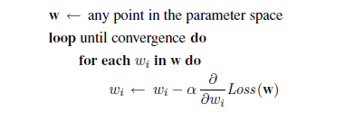

The parameter α, which we called the **step size** in Section 4.2, is usually called the **learning rate** when we are trying to minimize loss in a learning problem. It can be a fixed constant, or it can decay over time as the learning process proceeds. 

For univariate regression, the loss function is a quadratic function, so the partial derivative will be a linear function. (The only calculus you need to know is that ∂/∂x x^2^=2x and∂/∂x x= 1.) Let’s first work out the partial derivatives—the slopes—in the simplified case of
```
4 With some caveats: the L2 loss function is appropriate when there is normally-distributed noise that is independent of x; all results rely on the stationarity assumption; etc.  
```

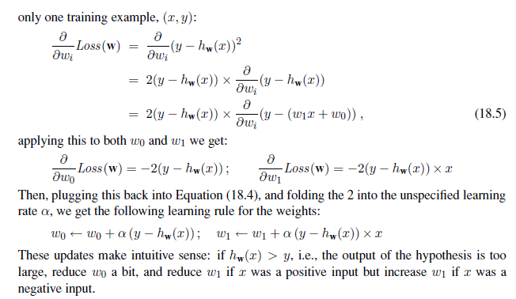

The preceding equations cover one training example. For N training examples, we want to minimize the sum of the individual losses for each example. The derivative of a sum is the sum of the derivatives, so we have:

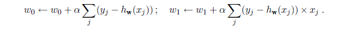

These updates constitute the **batch gradient descent** learning rule for univariate linear regression. Convergence to the unique global minimum is guaranteed (as long as we pick α small enough) but may be very slow: we have to cycle through all the training data for every step, and there may be many steps.

There is another possibility, called **stochastic gradient descent**, where we consider only a single training point at a time, taking a step after each one using Equation (18.5). Stochastic gradient descent can be used in an online setting, where new data are coming in one at a time, or offline, where we cycle through the same data as many times as is necessary, taking a step after considering each single example. It is often faster than batch gradient descent. With a fixed learning rate α, however, it does not guarantee convergence; it can oscillate around the minimum without settling down. In some cases, as we see later, a schedule of decreasing learning rates (as in simulated annealing) does guarantee convergence.

### Multivariate linear regression

We can easily extend to **multivariate linear regression** problems, in which each example **x**j is an n-element vector.5 Our hypothesis space is the set of functions of the form

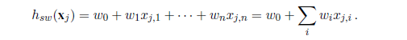
```
5 The reader may wish to consult Appendix A for a brief summary of linear algebra.  
```
The w~0~ term, the intercept, stands out as different from the others. We can fix that by inventing a dummy input attribute, x~j,0~, which is defined as always equal to 1. Then h is simply the dot product of the weights and the input vector (or equivalently, the matrix product of the transpose of the weights and the input vector):

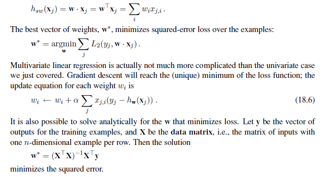

With univariate linear regression we didn’t have to worry about overfitting. But with multivariate linear regression in high-dimensional spaces it is possible that some dimension that is actually irrelevant appears by chance to be useful, resulting in **overfitting.**

Thus, it is common to use **regularization** on multivariate linear functions to avoid overfitting. Recall that with regularization we minimize the total cost of a hypothesis, counting both the empirical loss and the complexity of the hypothesis:

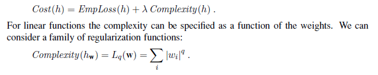

As with loss functions,6 with q =1 we have L1 regularization, which minimizes the sum of the absolute values; with q =2, L2 regularization minimizes the sum of squares. Which regularization function should you pick? That depends on the specific problem, but L1 regularization has an important advantage: it tends to produce a **sparse model**. That is, it often sets many weights to zero, effectively declaring the corresponding attributes to be irrelevant—just as DECISION-TREE-LEARNING does (although by a different mechanism). Hypotheses that discard attributes can be easier for a human to understand, and may be less likely to overfit.
```
6 It is perhaps confusing that L1 and L2 are used for both loss functions and regularization functions. They need not be used in pairs: you could use L2 loss with L1 regularization, or vice versa.  
```

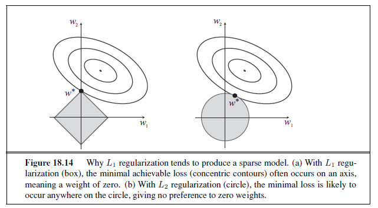

Figure 18.14 gives an intuitive explanation of why L1 regularization leads to weights of zero, while L2 regularization does not. Note that minimizing Loss(**w**) + λComplexity(**w**) is equivalent to minimizing Loss(**w**) subject to the constraint that Complexity(**w**) ≤ c, for some constant c that is related to λ. Now, in Figure 18.14(a) the diamond-shaped box represents the set of points **w** in two-dimensional weight space that have L1 complexity less than c; our solution will have to be somewhere inside this box. The concentric ovals represent contours of the loss function, with the minimum loss at the center. We want to find the point in the box that is closest to the minimum; you can see from the diagram that, for an arbitrary position of the minimum and its contours, it will be common for the corner of the box to find its way closest to the minimum, just because the corners are pointy. And of course the corners are the points that have a value of zero in some dimension. In Figure 18.14(b), we’ve done the same for the L2 complexity measure, which represents a circle rather than a diamond. Here you can see that, in general, there is no reason for the intersection to appear on one of the axes; thus L2 regularization does not tend to produce zero weights. The result is that the number of examples required to find a good h is linear in the number of irrelevant features for L2 regularization, but only logarithmic with L1 regularization. Empirical evidence on many problems supports this analysis.

Another way to look at it is that L1 regularization takes the dimensional axes seriously, while L2 treats them as arbitrary. The L2 function is spherical, which makes it rotationally invariant: Imagine a set of points in a plane, measured by their x and y coordinates. Now imagine rotating the axes by 45o. You’d get a different set of (x′, y ′) values representing the same points. If you apply L2 regularization before and after rotating, you get exactly the same point as the answer (although the point would be described with the new (x′, y ′) coordinates). That is appropriate when the choice of axes really is arbitrary—when it doesn’t matter whether your two dimensions are distances north and east; or distances north-east and south-east. With L1 regularization you’d get a different answer, because the L1 function is not rotationally invariant. That is appropriate when the axes are not interchangeable; it doesn’t make sense to rotate “number of bathrooms” 45o towards “lot size.”

### Linear classifiers with a hard threshold

Linear functions can be used to do classification as well as regression. For example, Figure 18.15(a) shows data points of two classes: earthquakes (which are of interest to seismologists) and underground explosions (which are of interest to arms control experts). Each point is defined by two input values, x~1~ and x~2~, that refer to body and surface wave magnitudes computed from the seismic signal. Given these training data, the task of classification is to learn a hypothesis h that will take new (x~1~, x~2~) points and return either 0 for earthquakes or 1 for explosions.

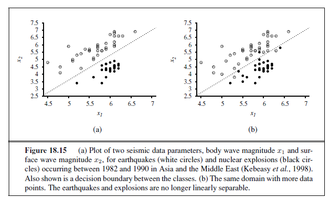

A **decision boundary** is a line (or a surface, in higher dimensions) that separates theDECISION BOUNDARY two classes. In Figure 18.15(a), the decision boundary is a straight line. A linear decision boundary is called a **linear separator** and data that admit such a separator are called **linearly** **separable**. The linear separator in this case is defined by

x~2~ = 1.7x~1~ − 4.9 or − 4.9 + 1.7x~1~ − x~2~ = 0 .

The explosions, which we want to classify with value 1, are to the right of this line with higher values of x~1~ and lower values of x~2~, so they are points for which −4.9 + 1.7x~1~ − x~2~ > 0, while earthquakes have −4.9 + 1.7x~1~ − x~2~ < 0. Using the convention of a dummy input x0 =1, we can write the classification hypothesis as

h**w**(**x**) = 1 if **w** · **x** ≥ 0 and 0 otherwise.  

Alternatively, we can think of h as the result of passing the linear function **w** · **x** through a **threshold function**:

h**w**(**x**) = Threshold (**w** · **x**) where Threshold (z)= 1 if z ≥ 0 and 0 otherwise.

The threshold function is shown in Figure 18.17(a). Now that the hypothesis h**w**(**x**) has a well-defined mathematical form, we can think about choosing the weights **w** to minimize the loss. In Sections 18.6.1 and 18.6.2, we did this both in closed form (by setting the gradient to zero and solving for the weights) and by gradient descent in weight space. Here, we cannot do either of those things because the gradient is zero almost everywhere in weight space except at those points where **w** · **x** \= 0, and at those points the gradient is undefined.

There is, however, a simple weight update rule that converges to a solution—that is, a linear separator that classifies the data perfectly–provided the data are linearly separable. For a single example (**x**, y), we have

w~i~ ← w~i~ + α (y − h**w**(**x**))× x~i~ (18.7)

which is essentially identical to the Equation (18.6), the update rule for linear regression! This rule is called the **perceptron learning rule**, for reasons that will become clear in Section 18.7. Because we are considering a 0/1 classification problem, however, the behavior is somewhat different. Both the true value y and the hypothesis output h**w**(**x**) are either 0 or 1, so there are three possibilities:

- If the output is correct, i.e., y = h**w**(**x**), then the weights are not changed.

- If y is 1 but h**w**(**x**) is 0, then wi is _increased_ when the corresponding input xi is positive and _decreased_ when xi is negative. This makes sense, because we want to make **w** · **x** bigger so that h**w**(**x**) outputs a 1.

- If y is 0 but h**w**(**x**) is 1, then wi is _decreased_ when the corresponding input xi is positive and _increased_ when xi is negative. This makes sense, because we want to make **w** · **x** smaller so that h**w**(**x**) outputs a 0.

Typically the learning rule is applied one example at a time, choosing examples at random (as in stochastic gradient descent). Figure 18.16(a) shows a **training curve** for this learningTRAINING CURVE

rule applied to the earthquake/explosion data shown in Figure 18.15(a). A training curve measures the classifier performance on a fixed training set as the learning process proceeds on that same training set. The curve shows the update rule converging to a zero-error linear separator. The “convergence” process isn’t exactly pretty, but it always works. This particular run takes 657 steps to converge, for a data set with 63 examples, so each example is presented roughly 10 times on average. Typically, the variation across runs is very large.

We have said that the perceptron learning rule converges to a perfect linear separator when the data points are linearly separable, but what if they are not? This situation is all too common in the real world. For example, Figure 18.15(b) adds back in the data points left out by Kebeasy _et al._ (1998) when they plotted the data shown in Figure 18.15(a). In Figure 18.16(b), we show the perceptron learning rule failing to converge even after 10,000 steps: even though it hits the minimum-error solution (three errors) many times, the algorithm keeps changing the weights. In general, the perceptron rule may not converge to a  

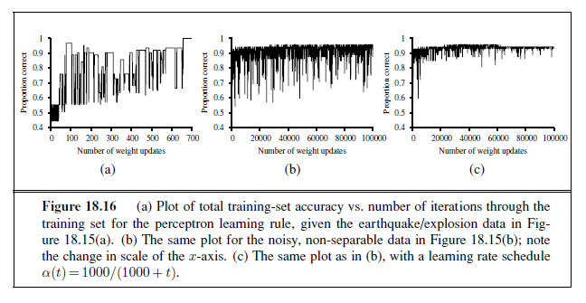

stable solution for fixed learning rate α, but if α decays as O(1/t) where t is the iteration number, then the rule can be shown to converge to a minimum-error solution when examples are presented in a random sequence.7 It can also be shown that finding the minimum-error solution is NP-hard, so one expects that many presentations of the examples will be required for convergence to be achieved. Figure 18.16(b) shows the training process with a learning rate schedule α(t)= 1000/(1000 + t): convergence is not perfect after 100,000 iterations, but it is much better than the fixed-α case.

### Linear classification with logistic regression

We have seen that passing the output of a linear function through the threshold function creates a linear classifier; yet the hard nature of the threshold causes some problems: the hypothesis h**w**(**x**) is not differentiable and is in fact a discontinuous function of its inputs and its weights; this makes learning with the perceptron rule a very unpredictable adventure. Furthermore, the linear classifier always announces a completely confident prediction of 1 or 0, even for examples that are very close to the boundary; in many situations, we really need more gradated predictions.

All of these issues can be resolved to a large extent by softening the threshold function— approximating the hard threshold with a continuous, differentiable function. In Chapter 14 (page 522), we saw two functions that look like soft thresholds: the integral of the standard normal distribution (used for the probit model) and the logistic function (used for the logit model). Although the two functions are very similar in shape, the logistic function

Logistic(z) = 1/1 + e −z

  
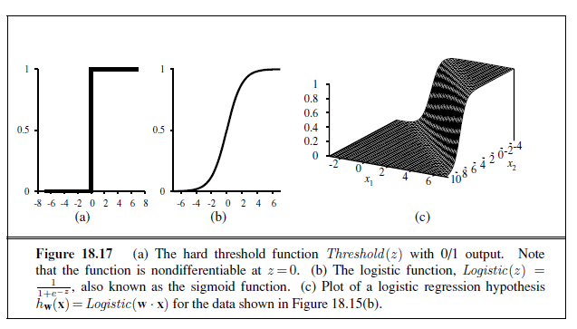


has more convenient mathematical properties. The function is shown in Figure 18.17(b). With the logistic function replacing the threshold function, we now have

h~**w**~(**x**) = Logistic(**w** · **x**) = 1/1 + e −^**w**·**x**^ .

An example of such a hypothesis for the two-input earthquake/explosion problem is shown in Figure 18.17(c). Notice that the output, being a number between 0 and 1, can be interpreted as a _probability_ of belonging to the class labeled 1. The hypothesis forms a soft boundary in the input space and gives a probability of 0.5 for any input at the center of the boundary region, and approaches 0 or 1 as we move away from the boundary.

The process of fitting the weights of this model to minimize loss on a data set is called **logistic regression**. There is no easy closed-form solution to find the optimal value of **w** with this model, but the gradient descent computation is straightforward. Because our hypotheses no longer output just 0 or 1, we will use the L2 loss function; also, to keep the formulas readable, we’ll use g to stand for the logistic function, with g′ its derivative. For a single example (**x**, y), the derivation of the gradient is the same as for linear regression (Equation (18.5)) up to the point where the actual form of h is inserted. (For this derivation, we will need the **chain rule**: ∂g(f(x))/∂x= g

′(f(x)) ∂f(x)/∂x.) We have

∂

∂wi

Loss(**w**) = ∂

∂wi

(y − h**w**(**x**)) 2

\= 2(y − h**w**(**x**))× ∂

∂wi

(y − h**w**(**x**))

\= −2(y − h**w**(**x**))× g ′

(**w** · **x**)× ∂

∂wi

**w** · **x**

\= −2(y − h**w**(**x**))× g ′

(**w** · **x**)×xi .  

Section 18.7. Artificial Neural Networks 727

0.4

0.5

0.6

0.7

0.8

0.9

1

0 1000 2000 3000 4000 5000

Sq ua

re d

er ro

r pe

r ex

am pl

e

Number of weight updates

0.4

0.5

0.6

0.7

0.8

0.9

1

0 20000 40000 60000 80000 100000

Sq ua

re d

er ro

r pe

r ex

am pl

e

Number of weight updates

0.4

0.5

0.6

0.7

0.8

0.9

1

0 20000 40000 60000 80000 100000

Sq ua

re d

er ro

r pe

r ex

am pl

e

Number of weight updates

(a) (b) (c)

**Figure 18.18** Repeat of the experiments in Figure 18.16 using logistic regression and squared error. The plot in (a) covers 5000 iterations rather than 1000, while (b) and (c) use the same scale.

The derivative g ′ of the logistic function satisfies g

′(z)= g(z)(1 − g(z)), so we have

g ′

(**w** · **x**) = g(**w** · **x**)(1− g(**w** · **x**)) = h**w**(**x**)(1− h**w**(**x**))

so the weight update for minimizing the loss is

wi ← wi + α (y − h**w**(**x**))× h**w**(**x**)(1− h**w**(**x**))× xi . (18.8)

Repeating the experiments of Figure 18.16 with logistic regression instead of the linear threshold classifier, we obtain the results shown in Figure 18.18. In (a), the linearly separable case, logistic regression is somewhat slower to converge, but behaves much more predictably. In (b) and (c), where the data are noisy and nonseparable, logistic regression converges far more quickly and reliably. These advantages tend to carry over into real-world applications and logistic regression has become one of the most popular classification techniques for problems in medicine, marketing and survey analysis, credit scoring, public health, and other applications.

18.7 ARTIFICIAL NEURAL NETWORKS

We turn now to what seems to be a somewhat unrelated topic: the brain. In fact, as we will see, the technical ideas we have discussed so far in this chapter turn out to be useful in building mathematical models of the brain’s activity; conversely, thinking about the brain has helped in extending the scope of the technical ideas.

Chapter 1 touched briefly on the basic findings of neuroscience—in particular, the hypothesis that mental activity consists primarily of electrochemical activity in networks of brain cells called **neurons**. (Figure 1.2 on page 11 showed a schematic diagram of a typical neuron.) Inspired by this hypothesis, some of the earliest AI work aimed to create artificial **neural networks**. (Other names for the field include **connectionism**, **parallel distributed**NEURAL NETWORK

**processing**, and **neural computation**.) Figure 18.19 shows a simple mathematical model of the neuron devised by McCulloch and Pitts (1943). Roughly speaking, it “fires” when a linear combination of its inputs exceeds some (hard or soft) threshold—that is, it implements  


Output

Σ

Input Links

Activation Function

Input Function

Output Links

_a_0 = 1 _aj_ \= _g_(_inj_)

_aj_

_g injwi,j_

_w_0_,j_

Bias Weight

_ai_

**Figure 18.19** A simple mathematical model for a neuron. The unit’s output activation is aj = g(

∑n i =0

wi,jai), where ai is the output activation of unit i and wi,j is the weight on the link from unit i to this unit.

a linear classifier of the kind described in the preceding section. A neural network is just a collection of units connected together; the properties of the network are determined by its topology and the properties of the “neurons.”

Since 1943, much more detailed and realistic models have been developed, both for neurons and for larger systems in the brain, leading to the modern field of **computational neuroscience**. On the other hand, researchers in AI and statistics became interested in theCOMPUTATIONAL

NEUROSCIENCE

more abstract properties of neural networks, such as their ability to perform distributed computation, to tolerate noisy inputs, and to learn. Although we understand now that other kinds of systems—including Bayesian networks—have these properties, neural networks remain one of the most popular and effective forms of learning system and are worthy of study in their own right.

**18.7.1 Neural network structures**

Neural networks are composed of nodes or **units** (see Figure 18.19) connected by directedUNIT

**links**. A link from unit i to unit j serves to propagate the **activation** ai from i to j.8 Each linkLINK

ACTIVATION also has a numeric **weight** wi,j associated with it, which determines the strength and sign of WEIGHT the connection. Just as in linear regression models, each unit has a dummy input a0 = 1 with

an associated weight w0,j . Each unit j first computes a weighted sum of its inputs:

inj =

n∑

i =0

wi,jai .

Then it applies an **activation function** g to this sum to derive the output:ACTIVATION FUNCTION

aj = g(inj) = g

( n∑

i =0

wi,jai

)

. (18.9)

8 A note on notation: for this section, we are forced to suspend our usual conventions. Input attributes are still indexed by i , so that an “external” activation ai is given by input xi; but index j will refer to internal units rather than examples. Throughout this section, the mathematical derivations concern a single generic example **x**, omitting the usual summations over examples to obtain results for the whole data set.  

Section 18.7. Artificial Neural Networks 729

The activation function g is typically either a hard threshold (Figure 18.17(a)), in which case the unit is called a **perceptron**, or a logistic function (Figure 18.17(b)), in which case the termPERCEPTRON

**sigmoid perceptron** is sometimes used. Both of these nonlinear activation function ensureSIGMOID PERCEPTRON

the important property that the entire network of units can represent a nonlinear function (see Exercise 18.22). As mentioned in the discussion of logistic regression (page 725), the logistic activation function has the added advantage of being differentiable.

Having decided on the mathematical model for individual “neurons,” the next task is to connect them together to form a network. There are two fundamentally distinct ways to do this. A **feed-forward network** has connections only in one direction—that is, it forms aFEED-FORWARD

NETWORK

directed acyclic graph. Every node receives input from “upstream” nodes and delivers output to “downstream” nodes; there are no loops. A feed-forward network represents a function of its current input; thus, it has no internal state other than the weights themselves. A **recurrent network**, on the other hand, feeds its outputs back into its own inputs. This means thatRECURRENT

NETWORK

the activation levels of the network form a dynamical system that may reach a stable state or exhibit oscillations or even chaotic behavior. Moreover, the response of the network to a given input depends on its initial state, which may depend on previous inputs. Hence, recurrent networks (unlike feed-forward networks) can support short-term memory. This makes them more interesting as models of the brain, but also more difficult to understand. This section will concentrate on feed-forward networks; some pointers for further reading on recurrent networks are given at the end of the chapter.

Feed-forward networks are usually arranged in **layers**, such that each unit receives inputLAYERS

only from units in the immediately preceding layer. In the next two subsections, we will look at single-layer networks, in which every unit connects directly from the network’s inputs to its outputs, and multilayer networks, which have one or more layers of **hidden units** that areHIDDEN UNIT

not connected to the outputs of the network. So far in this chapter, we have considered only learning problems with a single output variable y, but neural networks are often used in cases where multiple outputs are appropriate. For example, if we want to train a network to add two input bits, each a 0 or a 1, we will need one output for the sum bit and one for the carry bit. Also, when the learning problem involves classification into more than two classes—for example, when learning to categorize images of handwritten digits—it is common to use one output unit for each class.

**18.7.2 Single-layer feed-forward neural networks (perceptrons)**

A network with all the inputs connected directly to the outputs is called a **single-layer neural network**, or a **perceptron network**. Figure 18.20 shows a simple two-input, two-outputPERCEPTRON

NETWORK

perceptron network. With such a network, we might hope to learn the two-bit adder function, for example. Here are all the training data we will need:

x~1~ x~2~ y3 (carry) y4 (sum) 0 0 0 0 0 1 0 1 1 0 0 1 1 1 1 0  


The first thing to notice is that a perceptron network with m outputs is really m separate networks, because each weight affects only one of the outputs. Thus, there will be m separate training processes. Furthermore, depending on the type of activation function used, the training processes will be either the **perceptron learning rule** (Equation (18.7) on page 724) or gradient descent rule for the **logistic regression** (Equation (18.8) on page 727).

If you try either method on the two-bit-adder data, something interesting happens. Unit 3 learns the carry function easily, but unit 4 completely fails to learn the sum function. No, unit 4 is not defective! The problem is with the sum function itself. We saw in Section 18.6 that linear classifiers (whether hard or soft) can represent linear decision boundaries in the input space. This works fine for the carry function, which is a logical AND (see Figure 18.21(a)). The sum function, however, is an XOR (exclusive OR) of the two inputs. As Figure 18.21(c) illustrates, this function is not linearly separable so the perceptron cannot learn it.

The linearly separable functions constitute just a small fraction of all Boolean functions; Exercise 18.20 asks you to quantify this fraction. The inability of perceptrons to learn even such simple functions as XOR was a significant setback to the nascent neural network

_w_3,5

3,6_w_

4,5_w_

4,6_w_

5

6

_w_1,3

1,4_w_

2,3_w_

2,4_w_

1

2

3

4

_w_1,3

1,4_w_

2,3_w_

2,4_w_

1

2

3

4

(b)(a)

**Figure 18.20** (a) A perceptron network with two inputs and two output units. (b) A neural network with two inputs, one hidden layer of two units, and one output unit. Not shown are the dummy inputs and their associated weights.

(a) _x_1 **and** _x_2

1

0 0 1

_x_1

_x_2

(b) _x_1 **or** _x_2

0 1

1

0

_x_1

_x_2

(c) _x_1 **xor** _x_2

**?**

0 1

1

0

_x_1

_x_2

**Figure 18.21** Linear separability in threshold perceptrons. Black dots indicate a point in the input space where the value of the function is 1, and white dots indicate a point where the value is 0. The perceptron returns 1 on the region on the non-shaded side of the line. In (c), no such line exists that correctly classifies the inputs.  

Section 18.7. Artificial Neural Networks 731

0.4

0.5

0.6

0.7

0.8

0.9

1

0 10 20 30 40 50 60 70 80 90 100

Pr op

or tio

n co

rr ec

t o n

te st

s et

Training set size

Perceptron Decision tree

0.4

0.5

0.6

0.7

0.8

0.9

1

0 10 20 30 40 50 60 70 80 90 100

Pr op

or tio

n co

rr ec

t o n

te st

s et

Training set size

Perceptron Decision tree

(a) (b)

**Figure 18.22** Comparing the performance of perceptrons and decision trees. (a) Perceptrons are better at learning the majority function of 11 inputs. (b) Decision trees are better at learning the WillWait predicate in the restaurant example.

community in the 1960s. Perceptrons are far from useless, however. Section 18.6.4 noted that logistic regression (i.e., training a sigmoid perceptron) is even today a very popular and effective tool. Moreover, a perceptron can represent some quite “complex” Boolean functions very compactly. For example, the **majority function**, which outputs a 1 only if more than half of its n inputs are 1, can be represented by a perceptron with each wi = 1 and with w0 =−n/2. A decision tree would need exponentially many nodes to represent this function.

Figure 18.22 shows the learning curve for a perceptron on two different problems. On the left, we show the curve for learning the majority function with 11 Boolean inputs (i.e., the function outputs a 1 if 6 or more inputs are 1). As we would expect, the perceptron learns the function quite quickly, because the majority function is linearly separable. On the other hand, the decision-tree learner makes no progress, because the majority function is very hard (although not impossible) to represent as a decision tree. On the right, we have the restaurant example. The solution problem is easily represented as a decision tree, but is not linearly separable. The best plane through the data correctly classifies only 65%.

**18.7.3 Multilayer feed-forward neural networks**

(McCulloch and Pitts, 1943) were well aware that a single threshold unit would not solve all their problems. In fact, their paper proves that such a unit can represent the basic Boolean functions AND, OR, and NOT and then goes on to argue that any desired functionality can be obtained by connecting large numbers of units into (possibly recurrent) networks of arbitrary depth. The problem was that nobody knew how to train such networks.

This turns out to be an easy problem if we think of a network the right way: as a function h**w**(**x**) parameterized by the weights **w**. Consider the simple network shown in Figure 18.20(b), which has two input units, two hidden units, and two output unit. (In addition, each unit has a dummy input fixed at 1.) Given an input vector **x** \= (x~1~, x~2~), the activations  


\-4 -2 0 2 4_x_1 -4

\-2 0

2 4

_x_2

0 0.2 0.4 0.6 0.8

1

_h_**W**(_x_1, _x_2)

\-4 -2 0 2 4_x_1 -4

\-2 0

2 4

_x_2

0 0.2 0.4 0.6 0.8

1

_h_**W**(_x_1, _x_2)

(a) (b)

**Figure 18.23** (a) The result of combining two opposite-facing soft threshold functions to produce a ridge. (b) The result of combining two ridges to produce a bump.

of the input units are set to (a1, a2)= (x~1~, x~2~). The output at unit 5 is given by

a5 = g(w0,5,+w3,5 a3 + w4,5 a4)

\= g(w0,5,+w3,5 g(w0,3 + w1,3 a1 + w2,3 a2) + w4,5 g(w04 + w1,4 a1 + w2,4 a2))

\= g(w0,5,+w3,5 g(w0,3 + w1,3 x~1~ + w2,3 x~2~) + w4,5 g(w04 + w1,4 x~1~ + w2,4 x~2~)).

Thus, we have the output expressed as a function of the inputs and the weights. A similar expression holds for unit 6. As long as we can calculate the derivatives of such expressions with respect to the weights, we can use the gradient-descent loss-minimization method to train the network. Section 18.7.4 shows exactly how to do this. And because the function represented by a network can be highly nonlinear—composed, as it is, of nested nonlinear soft threshold functions—we can see neural networks as a tool for doing **nonlinear regression**.NONLINEAR

REGRESSION

Before delving into learning rules, let us look at the ways in which networks generate complicated functions. First, remember that each unit in a sigmoid network represents a soft threshold in its input space, as shown in Figure 18.17(c) (page 726). With one hidden layer and one output layer, as in Figure 18.20(b), each output unit computes a soft-thresholded linear combination of several such functions. For example, by adding two opposite-facing soft threshold functions and thresholding the result, we can obtain a “ridge” function as shown in Figure 18.23(a). Combining two such ridges at right angles to each other (i.e., combining the outputs from four hidden units), we obtain a “bump” as shown in Figure 18.23(b).

With more hidden units, we can produce more bumps of different sizes in more places. In fact, with a single, sufficiently large hidden layer, it is possible to represent any continuous function of the inputs with arbitrary accuracy; with two layers, even discontinuous functions can be represented.9 Unfortunately, for any _particular_ network structure, it is harder to characterize exactly which functions can be represented and which ones cannot.

9 The proof is complex, but the main point is that the required number of hidden units grows exponentially with the number of inputs. For example, 2

n /n hidden units are needed to encode all Boolean functions of n inputs.  

Section 18.7. Artificial Neural Networks 733

**18.7.4 Learning in multilayer networks**

First, let us dispense with one minor complication arising in multilayer networks: interactions among the learning problems when the network has multiple outputs. In such cases, we should think of the network as implementing a vector function **hw** rather than a scalar function h**w**; for example, the network in Figure 18.20(b) returns a vector \[a5, a6\]. Similarly, the target output will be a vector **y**. Whereas a perceptron network decomposes into m separate learning problems for an m-output problem, this decomposition fails in a multilayer network. For example, both a5 and a6 in Figure 18.20(b) depend on all of the input-layer weights, so updates to those weights will depend on errors in both a5 and a6. Fortunately, this dependency is very simple in the case of any loss function that is _additive_ across the components of the error vector **y**− **hw**(**x**). For the L2 loss, we have, for any weight w,

∂

∂w

Loss(**w**) = ∂

∂w

|**y**− **hw**(**x**)|2 = ∂

∂w

∑

k

(yk − ak) 2

\=

∑

k

∂

∂w

(yk − ak) 2 (18.10)

where the index k ranges over nodes in the output layer. Each term in the final summation is just the gradient of the loss for the kth output, computed as if the other outputs did not exist. Hence, we can decompose an m-output learning problem into m learning problems, provided we remember to add up the gradient contributions from each of them when updating the weights.

The major complication comes from the addition of hidden layers to the network. Whereas the error **y** − **hw** at the output layer is clear, the error at the hidden layers seems mysterious because the training data do not say what value the hidden nodes should have. Fortunately, it turns out that we can **back-propagate** the error from the output layer to theBACK-PROPAGATION

hidden layers. The back-propagation process emerges directly from a derivation of the overall error gradient. First, we will describe the process with an intuitive justification; then, we will show the derivation.

At the output layer, the weight-update rule is identical to Equation (18.8). We have multiple output units, so let Errk be the kth component of the error vector **y** − **hw**. We will also find it convenient to define a modified error Δk =Errk × g

′(ink), so that the weightupdate rule becomes

wj,k ← wj,k + α× aj ×Δk . (18.11)

To update the connections between the input units and the hidden units, we need to define a quantity analogous to the error term for output nodes. Here is where we do the error backpropagation. The idea is that hidden node j is “responsible” for some fraction of the error Δk

in each of the output nodes to which it connects. Thus, the Δk values are divided according to the strength of the connection between the hidden node and the output node and are propagated back to provide the Δj values for the hidden layer. The propagation rule for the Δ

values is the following:

Δj = g ′

(inj)

∑

k

wj,kΔk . (18.12)  


**function** BACK-PROP-LEARNING(examples ,network ) **returns** a neural network **inputs**: examples , a set of examples, each with input vector **x** and output vector **y**

network , a multilayer network with L layers, weights wi,j , activation function g

**local variables**: Δ, a vector of errors, indexed by network node

**repeat for each** weight wi,j in network **do**

wi,j ← a small random number **for each** example (**x**, **y**) **in** examples **do**

/\* _Propagate the inputs forward to compute the outputs_ \*/ **for each** node i in the input layer **do**

ai←xi

**for**  = 2 **to** L **do for each** node j in layer  **do**

inj ← ∑

i wi,j ai

aj ← g(in j)

/\* _Propagate deltas backward from output layer to input layer_ \*/ **for each** node j in the output layer **do**

Δ\[j\]← g ′(inj) × (yj − aj)

**for**  = L− 1 **to** 1 **do for each** node i in layer  **do**

Δ\[i\]← g ′(ini) ∑

j wi,j Δ\[j\]

/\* _Update every weight in network using deltas_ \*/ **for each** weight wi,j in network **do**

wi,j ←wi,j + α × ai × Δ\[j\]

**until** some stopping criterion is satisfied **return** network

**Figure 18.24** The back-propagation algorithm for learning in multilayer networks.

Now the weight-update rule for the weights between the inputs and the hidden layer is essentially identical to the update rule for the output layer:

wi,j ← wi,j + α× ai ×Δj .

The back-propagation process can be summarized as follows:

- Compute the Δ values for the output units, using the observed error.

- Starting with output layer, repeat the following for each layer in the network, until the earliest hidden layer is reached:

**–** Propagate the Δ values back to the previous layer.

**–** Update the weights between the two layers.

The detailed algorithm is shown in Figure 18.24. For the mathematically inclined, we will now derive the back-propagation equations

from first principles. The derivation is quite similar to the gradient calculation for logistic  

Section 18.7. Artificial Neural Networks 735

regression (leading up to Equation (18.8) on page 727), except that we have to use the chain rule more than once.

Following Equation (18.10), we compute just the gradient for Lossk = (yk − ak) 2 at

the kth output. The gradient of this loss with respect to weights connecting the hidden layer to the output layer will be zero except for weights wj,k that connect to the kth output unit. For those weights, we have

∂Lossk

∂wj,k

\= −2(yk − ak) ∂ak

∂wj,k

\= −2(yk − ak) ∂g(ink)

∂wj,k

\= −2(yk − ak)g ′

(ink) ∂ink

∂wj,k

\= −2(yk − ak)g ′

(ink) ∂

∂wj,k

⎛

⎝ ∑

j

wj,kaj

⎞

⎠

\= −2(yk − ak)g ′

(ink)aj = −ajΔk ,

with Δk defined as before. To obtain the gradient with respect to the wi,j weights connecting the input layer to the hidden ¡layer, we have to expand out the activations aj and reapply the chain rule. We will show the derivation in gory detail because it is interesting to see how the derivative operator propagates back through the network:

∂Lossk

∂wi,j

\= −2(yk − ak) ∂ak

∂wi,j

\= −2(yk − ak) ∂g(ink)

∂wi,j

\= −2(yk − ak)g ′

(ink) ∂ink

∂wi,j

\= −2Δk

∂

∂wi,j

⎛

⎝ ∑

j

wj,kaj

⎞

⎠

\= −2Δkwj,k

∂aj

∂wi,j

\= −2Δkwj,k

∂g(inj)

∂wi,j

\= −2Δkwj,kg ′

(inj) ∂inj

∂wi,j

\= −2Δkwj,kg ′

(inj) ∂

∂wi,j

( ∑

i

wi,jai

)

\= −2Δkwj,kg ′

(inj)ai = −aiΔj ,

where Δj is defined as before. Thus, we obtain the update rules obtained earlier from intuitive considerations. It is also clear that the process can be continued for networks with more than one hidden layer, which justifies the general algorithm given in Figure 18.24.

Having made it through (or skipped over) all the mathematics, let’s see how a singlehidden-layer network performs on the restaurant problem. First, we need to determine the structure of the network. We have 10 attributes describing each example, so we will need 10 input units. Should we have one hidden layer or two? How many nodes in each layer? Should they be fully connected? There is no good theory that will tell us the answer. (See the next section.) As always, we can use cross-validation: try several different structures and see which one works best. It turns out that a network with one hidden layer containing four nodes is about right for this problem. In Figure 18.25, we show two curves. The first is a training curve showing the mean squared error on a given training set of 100 restaurant examples  


0

2

4

6

8

10

12

14

0 50 100 150 200 250 300 350 400

T ot

al e

rr or

o n

tr ai

ni ng

s et

Number of epochs

0.4

0.5

0.6

0.7

0.8

0.9

1

0 10 20 30 40 50 60 70 80 90 100

Pr op

or tio

n co

rr ec

t o n

te st

s et

Training set size

Decision tree Multilayer network

(a) (b)

**Figure 18.25** (a) Training curve showing the gradual reduction in error as weights are modified over several epochs, for a given set of examples in the restaurant domain. (b) Comparative learning curves showing that decision-tree learning does slightly better on the restaurant problem than back-propagation in a multilayer network.

during the weight-updating process. This demonstrates that the network does indeed converge to a perfect fit to the training data. The second curve is the standard learning curve for the restaurant data. The neural network does learn well, although not quite as fast as decisiontree learning; this is perhaps not surprising, because the data were generated from a simple decision tree in the first place.

Neural networks are capable of far more complex learning tasks of course, although it must be said that a certain amount of twiddling is needed to get the network structure right and to achieve convergence to something close to the global optimum in weight space. There are literally tens of thousands of published applications of neural networks. Section 18.11.1 looks at one such application in more depth.

**18.7.5 Learning neural network structures**

So far, we have considered the problem of learning weights, given a fixed network structure; just as with Bayesian networks, we also need to understand how to find the best network structure. If we choose a network that is too big, it will be able to memorize all the examples by forming a large lookup table, but will not necessarily generalize well to inputs that have not been seen before.10 In other words, like all statistical models, neural networks are subject to **overfitting** when there are too many parameters in the model. We saw this in Figure 18.1 (page 696), where the high-parameter models in (b) and (c) fit all the data, but might not generalize as well as the low-parameter models in (a) and (d).

If we stick to fully connected networks, the only choices to be made concern the number

10 It has been observed that very large networks _do_ generalize well _as long as the weights are kept small_. This restriction keeps the activation values in the _linear_ region of the sigmoid function g(x) where x is close to zero. This, in turn, means that the network behaves like a linear function (Exercise 18.22) with far fewer parameters.  

Section 18.8. Nonparametric Models 737

of hidden layers and their sizes. The usual approach is to try several and keep the best. The **cross-validation** techniques of Chapter 18 are needed if we are to avoid **peeking** at the test set. That is, we choose the network architecture that gives the highest prediction accuracy on the validation sets.

If we want to consider networks that are not fully connected, then we need to find some effective search method through the very large space of possible connection topologies. The **optimal brain damage** algorithm begins with a fully connected network and removesOPTIMAL BRAIN

DAMAGE

connections from it. After the network is trained for the first time, an information-theoretic approach identifies an optimal selection of connections that can be dropped. The network is then retrained, and if its performance has not decreased then the process is repeated. In addition to removing connections, it is also possible to remove units that are not contributing much to the result.

Several algorithms have been proposed for growing a larger network from a smaller one. One, the **tiling** algorithm, resembles decision-list learning. The idea is to start with a singleTILING

unit that does its best to produce the correct output on as many of the training examples as possible. Subsequent units are added to take care of the examples that the first unit got wrong. The algorithm adds only as many units as are needed to cover all the examples.

18.8 NONPARAMETRIC MODELS

Linear regression and neural networks use the training data to estimate a fixed set of parameters **w**. That defines our hypothesis h**w**(**x**), and at that point we can throw away the training data, because they are all summarized by **w**. A learning model that summarizes data with a set of parameters of fixed size (independent of the number of training examples) is called a **parametric model**.PARAMETRIC MODEL

No matter how much data you throw at a parametric model, it won’t change its mind about how many parameters it needs. When data sets are small, it makes sense to have a strong restriction on the allowable hypotheses, to avoid overfitting. But when there are thousands or millions or billions of examples to learn from, it seems like a better idea to let the data speak for themselves rather than forcing them to speak through a tiny vector of parameters. If the data say that the correct answer is a very wiggly function, we shouldn’t restrict ourselves to linear or slightly wiggly functions.

A **nonparametric model** is one that cannot be characterized by a bounded set of param-NONPARAMETRIC MODEL

eters. For example, suppose that each hypothesis we generate simply retains within itself all of the training examples and uses all of them to predict the next example. Such a hypothesis family would be nonparametric because the effective number of parameters is unbounded— it grows with the number of examples. This approach is called **instance-based learning** orINSTANCE-BASED

LEARNING

**memory-based learning**. The simplest instance-based learning method is **table lookup**: takeTABLE LOOKUP

all the training examples, put them in a lookup table, and then when asked for h(**x**), see if **x** is in the table; if it is, return the corresponding y. The problem with this method is that it does not generalize well: when **x** is not in the table all it can do is return some default value.  


2.5 3

3.5 4

4.5 5

5.5 6

6.5 7

7.5

4.5 5 5.5 6 6.5 7

_x 1_

_x 2_

2.5 3

3.5 4

4.5 5

5.5 6

6.5 7

7.5

4.5 5 5.5 6 6.5 7

_x 1_

_x 2_

(k =1) (k = 5)

**Figure 18.26** (a) A k-nearest-neighbor model showing the extent of the explosion class for the data in Figure 18.15, with k = 1. Overfitting is apparent. (b) With k = 5, the overfitting problem goes away for this data set.

**18.8.1 Nearest neighbor models**

We can improve on table lookup with a slight variation: given a query **x**q , find the k examples that are _nearest_ to **x**q. This is called k**\-nearest neighbors** lookup. We’ll use the notationNEAREST

NEIGHBORS

NN (k, **x**q) to denote the set of k nearest neighbors. To do classification, first find NN (k, **x**q), then take the plurality vote of the neighbors

(which is the majority vote in the case of binary classification). To avoid ties, k is always chosen to be an odd number. To do regression, we can take the mean or median of the k

neighbors, or we can solve a linear regression problem on the neighbors. In Figure 18.26, we show the decision boundary of k-nearest-neighbors classification

for k = 1 and 5 on the earthquake data set from Figure 18.15. Nonparametric methods are still subject to underfitting and overfitting, just like parametric methods. In this case 1-nearest neighbors is overfitting; it reacts too much to the black outlier in the upper right and the white outlier at (5.4, 3.7). The 5-nearest-neighbors decision boundary is good; higher k would underfit. As usual, cross-validation can be used to select the best value of k.

The very word “nearest” implies a distance metric. How do we measure the distance from a query point **x**q to an example point **x**j? Typically, distances are measured with a **Minkowski distance** or L

p norm, defined asMINKOWSKI DISTANCE

L p (**x**j, **x**q) = (

∑

i

|xj,i − xq,i| p ) 1/p

.

With p = 2 this is Euclidean distance and with p = 1 it is Manhattan distance. With Boolean attribute values, the number of attributes on which the two points differ is called the **Hamming distance**. Often p =2 is used if the dimensions are measuring similar properties, suchHAMMING DISTANCE

as the width, height and depth of parts on a conveyor belt, and Manhattan distance is used if they are dissimilar, such as age, weight, and gender of a patient. Note that if we use the raw numbers from each dimension then the total distance will be affected by a change in scale in any dimension. That is, if we change dimension i from measurements in centimeters to  

Section 18.8. Nonparametric Models 739

miles while keeping the other dimensions the same, we’ll get different nearest neighbors. To avoid this, it is common to apply **normalization** to the measurements in each dimension. OneNORMALIZATION

simple approach is to compute the mean μi and standard deviation σi of the values in each dimension, and rescale them so that xj,i becomes (xj,i − μi)/σi. A more complex metric known as the **Mahalanobis distance** takes into account the covariance between dimensions.MAHALANOBIS

DISTANCE

In low-dimensional spaces with plenty of data, nearest neighbors works very well: we are likely to have enough nearby data points to get a good answer. But as the number of dimensions rises we encounter a problem: the nearest neighbors in high-dimensional spaces are usually not very near! Consider k-nearest-neighbors on a data set of N points uniformly distributed throughout the interior of an n-dimensional unit hypercube. We’ll define the kneighborhood of a point as the smallest hypercube that contains the k-nearest neighbors. Let  be the average side length of a neighborhood. Then the volume of the neighborhood (which contains k points) is 

n and the volume of the full cube (which contains N points) is 1. So, on average, 

n = k/N . Taking nth roots of both sides we get  = (k/N)1/n. To be concrete, let k = 10 and N =1, 000, 000. In two dimensions (n = 2; a unit

square), the average neighborhood has = 0.003, a small fraction of the unit square, and in 3 dimensions  is just 2% of the edge length of the unit cube. But by the time we get to 17 dimensions,  is half the edge length of the unit hypercube, and in 200 dimensions it is 94%. This problem has been called the **curse of dimensionality**.CURSE OF

DIMENSIONALITY

Another way to look at it: consider the points that fall within a thin shell making up the outer 1% of the unit hypercube. These are outliers; in general it will be hard to find a good value for them because we will be extrapolating rather than interpolating. In one dimension, these outliers are only 2% of the points on the unit line (those points where x < .01 or x > .99), but in 200 dimensions, over 98% of the points fall within this thin shell—almost all the points are outliers. You can see an example of a poor nearest-neighbors fit on outliers if you look ahead to Figure 18.28(b).

The NN (k, **x**q) function is conceptually trivial: given a set of N examples and a query **x**q, iterate through the examples, measure the distance to **x**q from each one, and keep the best k. If we are satisfied with an implementation that takes O(N) execution time, then that is the end of the story. But instance-based methods are designed for large data sets, so we would like an algorithm with sublinear run time. Elementary analysis of algorithms tells us that exact table lookup is O(N) with a sequential table, O(log N) with a binary tree, and O(1)

with a hash table. We will now see that binary trees and hash tables are also applicable for finding nearest neighbors.

**18.8.2 Finding nearest neighbors with k-d trees**

A balanced binary tree over data with an arbitrary number of dimensions is called a **k-d tree**,K-D TREE

for k-dimensional tree. (In our notation, the number of dimensions is n, so they would be n-d trees. The construction of a k-d tree is similar to the construction of a one-dimensional balanced binary tree. We start with a set of examples and at the root node we split them along the ith dimension by testing whether xi ≤ m. We chose the value m to be the median of the examples along the ith dimension; thus half the examples will be in the left branch of the tree  


0 0.1 0.2 0.3 0.4 0.5 0.6 0.7 0.8 0.9

1

25 50 75 100 125 150 175 200

E dg

e le

ng th

o f

ne ig

hb or

ho od

Number of dimensions

0 0.1 0.2 0.3 0.4 0.5 0.6 0.7 0.8 0.9

1

25 50 75 100 125 150 175 200

Pr op

or tio

n of

p oi

nt s

in e

xt er

io r

sh el

l

Number of dimensions

(a) (b)

**Figure 18.27** The curse of dimensionality: (a) The length of the average neighborhood for 10-nearest-neighbors in a unit hypercube with 1,000,000 points, as a function of the number of dimensions. (b) The proportion of points that fall within a thin shell consisting of the outer 1% of the hypercube, as a function of the number of dimensions. Sampled from 10,000 randomly distributed points.

and half in the right. We then recursively make a tree for the left and right sets of examples, stopping when there are fewer than two examples left. To choose a dimension to split on at each node of the tree, one can simply select dimension i mod n at level i of the tree. (Note that we may need to split on any given dimension several times as we proceed down the tree.) Another strategy is to split on the dimension that has the widest spread of values.

Exact lookup from a k-d tree is just like lookup from a binary tree (with the slight complication that you need to pay attention to which dimension you are testing at each node). But nearest neighbor lookup is more complicated. As we go down the branches, splitting the examples in half, in some cases we can discard the other half of the examples. But not always. Sometimes the point we are querying for falls very close to the dividing boundary. The query point itself might be on the left hand side of the boundary, but one or more of the k nearest neighbors might actually be on the right-hand side. We have to test for this possibility by computing the distance of the query point to the dividing boundary, and then searching both sides if we can’t find k examples on the left that are closer than this distance. Because of this problem, k-d trees are appropriate only when there are many more examples than dimensions, preferably at least 2n examples. Thus, k-d trees work well with up to 10 dimensions with thousands of examples or up to 20 dimensions with millions of examples. If we don’t have enough examples, lookup is no faster than a linear scan of the entire data set.

**18.8.3 Locality-sensitive hashing**

Hash tables have the potential to provide even faster lookup than binary trees. But how can we find nearest neighbors using a hash table, when hash codes rely on an _exact_ match? Hash codes randomly distribute values among the bins, but we want to have near points grouped together in the same bin; we want a **locality-sensitive hash** (LSH).LOCALITY-SENSITIVE

HASH  

Section 18.8. Nonparametric Models 741

We can’t use hashes to solve NN (k, **x**q) exactly, but with a clever use of randomized algorithms, we can find an _approximate_ solution. First we define the **approximate nearneighbors** problem: given a data set of example points and a query point **x**q, find, with highAPPROXIMATE

NEAR-NEIGHBORS

probability, an example point (or points) that is near **x**q. To be more precise, we require that if there is a point **x**j that is within a radius r of **x**q, then with high probability the algorithm will find a point **x**j′ that is within distance c r of q. If there is no point within radius r then the algorithm is allowed to report failure. The values of c and “high probability” are parameters of the algorithm.

To solve approximate near neighbors, we will need a hash function g(**x**) that has the property that, for any two points **x**j and **x**j′ , the probability that they have the same hash code is small if their distance is more than c r, and is high if their distance is less than r. For simplicity we will treat each point as a bit string. (Any features that are not Boolean can be encoded into a set of Boolean features.)

The intuition we rely on is that if two points are close together in an n-dimensional space, then they will necessarily be close when projected down onto a one-dimensional space (a line). In fact, we can discretize the line into bins—hash buckets—so that, with high probability, near points project down to exactly the same bin. Points that are far away from each other will tend to project down into different bins for most projections, but there will always be a few projections that coincidentally project far-apart points into the same bin. Thus, the bin for point **x**q contains many (but not all) points that are near to **x**q, as well as some points that are far away.

The trick of LSH is to create _multiple_ random projections and combine them. A random projection is just a random subset of the bit-string representation. We choose  different random projections and create  hash tables, g1(**x**), . . . , g(**x**). We then enter all the examples into each hash table. Then when given a query point **x**q, we fetch the set of points in bin gk(q)

for each k, and union these sets together into a set of candidate points, C . Then we compute the actual distance to **x**q for each of the points in C and return the k closest points. With high probability, each of the points that are near to **x**q will show up in at least one of the bins, and although some far-away points will show up as well, we can ignore those. With large realworld problems, such as finding the near neighbors in a data set of 13 million Web images using 512 dimensions (Torralba _et al._, 2008), locality-sensitive hashing needs to examine only a few thousand images out of 13 million to find nearest neighbors; a thousand-fold speedup over exhaustive or k-d tree approaches.

**18.8.4 Nonparametric regression**

Now we’ll look at nonparametric approaches to _regression_ rather than classification. Figure 18.28 shows an example of some different models. In (a), we have perhaps the simplest method of all, known informally as “connect-the-dots,” and superciliously as “piecewiselinear nonparametric regression.” This model creates a function h(x) that, when given a query xq, solves the ordinary linear regression problem with just two points: the training examples immediately to the left and right of xq. When noise is low, this trivial method is actually not too bad, which is why it is a standard feature of charting software in spreadsheets.  


0

1

2

3

4

5

6

7

8

0 2 4 6 8 10 12 14 0

1

2

3

4

5

6

7

8

0 2 4 6 8 10 12 14

(a) (b)

0

1

2

3

4

5

6

7

8

0 2 4 6 8 10 12 14 0

1

2

3

4

5

6

7

8

0 2 4 6 8 10 12 14

(c) (d)

**Figure 18.28** Nonparametric regression models: (a) connect the dots, (b) 3-nearest neighbors average, (c) 3-nearest-neighbors linear regression, (d) locally weighted regression with a quadratic kernel of width k =10.

But when the data are noisy, the resulting function is spiky, and does not generalize well. k-**nearest-neighbors regression** (Figure 18.28(b)) improves on connect-the-dots. In-

NEARESTNEIGHBORS REGRESSION

stead of using just the two examples to the left and right of a query point xq, we use the k nearest neighbors (here 3). A larger value of k tends to smooth out the magnitude of the spikes, although the resulting function has discontinuities. In (b), we have the k-nearestneighbors average: h(x) is the mean value of the k points,

∑ yj/k. Notice that at the outlying

points, near x= 0 and x= 14, the estimates are poor because all the evidence comes from one side (the interior), and ignores the trend. In (c), we have k-nearest-neighbor linear regression, which finds the best line through the k examples. This does a better job of capturing trends at the outliers, but is still discontinuous. In both (b) and (c), we’re left with the question of how to choose a good value for k. The answer, as usual, is cross-validation.

**Locally weighted regression** (Figure 18.28(d)) gives us the advantages of nearest neigh-LOCALLY WEIGHTED REGRESSION

bors, without the discontinuities. To avoid discontinuities in h(x), we need to avoid disconti 

Section 18.8. Nonparametric Models 743

0

0.5

1

\-10 -5 0 5 10

**Figure 18.29** A quadratic kernel, K(d)= max(0, 1 − (2|x|/k)2), with kernel width k = 10, centered on the query point x=0.

nuities in the set of examples we use to estimate h(x). The idea of locally weighted regression is that at each query point xq, the examples that are close to xq are weighted heavily, and the examples that are farther away are weighted less heavily or not at all. The decrease in weight over distance is always gradual, not sudden.

We decide how much to weight each example with a function known as a **kernel**. AKERNEL

kernel function looks like a bump; in Figure 18.29 we see the specific kernel used to generate Figure 18.28(d). We can see that the weight provided by this kernel is highest in the center and reaches zero at a distance of ±5. Can we choose just any function for a kernel? No. First, note that we invoke a kernel function K with K(Distance(**x**j , **x**q)), where **x**q is a query point that is a given distance from **x**j , and we want to know how much to weight that distance. So K should be symmetric around 0 and have a maximum at 0. The area under the kernel must remain bounded as we go to ±∞. Other shapes, such as Gaussians, have been used for kernels, but the latest research suggests that the choice of shape doesn’t matter much. We do have to be careful about the width of the kernel. Again, this is a parameter of the model that is best chosen by cross-validation. Just as in choosing the k for nearest neighbors, if the kernels are too wide we’ll get underfitting and if they are too narrow we’ll get overfitting. In Figure 18.29(d), the value of k = 10 gives a smooth curve that looks about right—but maybe it does not pay enough attention to the outlier at x= 6; a narrower kernel width would be more responsive to individual points.

Doing locally weighted regression with kernels is now straightforward. For a given query point **x**q we solve the following weighted regression problem using gradient descent:

**w**∗

\= argmin **w**

∑

j

K(Distance(**x**q, **x**j)) (yj − **w** · **x**j) 2

,

where Distance is any of the distance metrics discussed for nearest neighbors. Then the answer is h(**x**q)= **w**∗ · **x**q.

Note that we need to solve a new regression problem for _every_ query point—that’s what it means to be _local_. (In ordinary linear regression, we solved the regression problem once, globally, and then used the same h**w** for any query point.) Mitigating against this extra work  


is the fact that each regression problem will be easier to solve, because it involves only the examples with nonzero weight—the examples whose kernels overlap the query point. When kernel widths are small, this may be just a few points.

Most nonparametric models have the advantage that it is easy to do leave-one-out crossvalidation without having to recompute everything. With a k-nearest-neighbors model, for instance, when given a test example (**x**, y) we retrieve the k nearest neighbors once, compute the per-example loss L(y, h(**x**)) from them, and record that as the leave-one-out result for every example that is not one of the neighbors. Then we retrieve the k + 1 nearest neighbors and record distinct results for leaving out each of the k neighbors. With N examples the whole process is O(k), not O(kN).

18.9 SUPPORT VECTOR MACHINES

The **support vector machine** or SVM framework is currently the most popular approach forSUPPORT VECTOR MACHINE

“off-the-shelf” supervised learning: if you don’t have any specialized prior knowledge about a domain, then the SVM is an excellent method to try first. There are three properties that make SVMs attractive:

1\. SVMs construct a **maximum margin separator**—a decision boundary with the largest possible distance to example points. This helps them generalize well.

2\. SVMs create a linear separating hyperplane, but they have the ability to embed the data into a higher-dimensional space, using the so-called **kernel trick**. Often, data that are not linearly separable in the original input space are easily separable in the higherdimensional space. The high-dimensional linear separator is actually nonlinear in the original space. This means the hypothesis space is greatly expanded over methods that use strictly linear representations.

3\. SVMs are a nonparametric method—they retain training examples and potentially need to store them all. On the other hand, in practice they often end up retaining only a small fraction of the number of examples—sometimes as few as a small constant times the number of dimensions. Thus SVMs combine the advantages of nonparametric and parametric models: they have the flexibility to represent complex functions, but they are resistant to overfitting.

You could say that SVMs are successful because of one key insight and one neat trick. We will cover each in turn. In Figure 18.30(a), we have a binary classification problem with three candidate decision boundaries, each a linear separator. Each of them is consistent with all the examples, so from the point of view of 0/1 loss, each would be equally good. Logistic regression would find some separating line; the exact location of the line depends on _all_ the example points. The key insight of SVMs is that some examples are more important than others, and that paying attention to them can lead to better generalization.

Consider the lowest of the three separating lines in (a). It comes very close to 5 of the black examples. Although it classifies all the examples correctly, and thus minimizes loss, it  

Section 18.9. Support Vector Machines 745

0

0.2

0.4

0.6

0.8

1

0 0.2 0.4 0.6 0.8 1 0

0.2

0.4

0.6

0.8

1

0 0.2 0.4 0.6 0.8 1

(a) (b)

**Figure 18.30** Support vector machine classification: (a) Two classes of points (black and white circles) and three candidate linear separators. (b) The maximum margin separator (heavy line), is at the midpoint of the **margin** (area between dashed lines). The **support vectors** (points with large circles) are the examples closest to the separator.

should make you nervous that so many examples are close to the line; it may be that other black examples will turn out to fall on the other side of the line.

SVMs address this issue: Instead of minimizing expected _empirical loss_ on the training data, SVMs attempt to minimize expected _generalization_ loss. We don’t know where the as-yet-unseen points may fall, but under the probabilistic assumption that they are drawn from the same distribution as the previously seen examples, there are some arguments from computational learning theory (Section 18.5) suggesting that we minimize generalization loss by choosing the separator that is farthest away from the examples we have seen so far. We call this separator, shown in Figure 18.30(b) the **maximum margin separator**. The **margin**MAXIMUM MARGIN

SEPARATOR

MARGIN is the width of the area bounded by dashed lines in the figure—twice the distance from the separator to the nearest example point.

Now, how do we find this separator? Before showing the equations, some notation: Traditionally SVMs use the convention that class labels are +1 and -1, instead of the +1 and 0 we have been using so far. Also, where we put the intercept into the weight vector **w** (and a corresponding dummy 1 value into xj,0), SVMs do not do that; they keep the intercept as a separate parameter, b. With that in mind, the separator is defined as the set of points {**x** : **w** · **x** \+ b= 0}. We could search the space of **w** and b with gradient descent to find the parameters that maximize the margin while correctly classifying all the examples.

However, it turns out there is another approach to solving this problem. We won’t show the details, but will just say that there is an alternative representation called the dual  


representation, in which the optimal solution is found by solving

argmax α

∑

j

αj − 1

2

∑

j,k

αjαkyjyk(**x**j · **x**k) (18.13)

subject to the constraints αj ≥ 0 and ∑

j αjyj = 0. This is a **quadratic programming**QUADRATIC PROGRAMMING

optimization problem, for which there are good software packages. Once we have found the vector α we can get back to **w** with the equation **w** \=

∑ j αj**x**j , or we can stay in the dual

representation. There are three important properties of Equation (18.13). First, the expression is convex; it has a single global maximum that can be found efficiently. Second, _the data enter the expression only in the form of dot products of pairs of points._ This second property is also true of the equation for the separator itself; once the optimal αj have been calculated, it is

h(**x**) = sign

⎛

⎝ ∑

j

αjyj(**x** · **x**j)− b

⎞

⎠ . (18.14)

A final important property is that the weights αj associated with each data point are _zero_ except for the **support vectors**—the points closest to the separator. (They are called “support”SUPPORT VECTOR

vectors because they “hold up” the separating plane.) Because there are usually many fewer support vectors than examples, SVMs gain some of the advantages of parametric models.

What if the examples are not linearly separable? Figure 18.31(a) shows an input space defined by attributes **x** \= (x~1~, x~2~), with positive examples (y = + 1) inside a circular region and negative examples (y =−1) outside. Clearly, there is no linear separator for this problem. Now, suppose we re-express the input data—i.e., we map each input vector **x** to a new vector of feature values, F (**x**). In particular, let us use the three features

f1 = x 2

1 , f2 = x 2

2 , f3 = √

2x~1~x~2~ . (18.15)

We will see shortly where these came from, but for now, just look at what happens. Figure 18.31(b) shows the data in the new, three-dimensional space defined by the three features; the data are _linearly separable_ in this space! This phenomenon is actually fairly general: if data are mapped into a space of sufficiently high dimension, then they will almost always be linearly separable—if you look at a set of points from enough directions, you’ll find a way to make them line up. Here, we used only three dimensions;11 Exercise 18.16 asks you to show that four dimensions suffice for linearly separating a circle anywhere in the plane (not just at the origin), and five dimensions suffice to linearly separate any ellipse. In general (with some special cases excepted) if we have N data points then they will always be separable in spaces of N − 1 dimensions or more (Exercise 18.25).

Now, we would not usually expect to find a linear separator in the input space **x**, but we can find linear separators in the high-dimensional feature space F (**x**) simply by replacing **x**j ·**x**k in Equation (18.13) with F (**x**j)·F (**x**k). This by itself is not remarkable—replacing **x** by F (**x**) in _any_ learning algorithm has the required effect—but the dot product has some special properties. It turns out that F (**x**j) · F (**x**k) can often be computed without first computing F

11 The reader may notice that we could have used just f1 and f2, but the 3D mapping illustrates the idea better.  

Section 18.9. Support Vector Machines 747

\-1.5

\-1

\-0.5

0

0.5

1

1.5

\-1.5 -1 -0.5 0 0.5 1 1.5

_x_ 2

_x_1

0 0.5

1 1.5

2_x_1 2 0.5

1

1.5

2

2.5

_x_2 2

\-3 -2 -1 0 1 2 3

√2_x_1_x_2

(a) (b)

**Figure 18.31** (a) A two-dimensional training set with positive examples as black circles and negative examples as white circles. The true decision boundary, x

2

1 + x

2

2 ≤ 1,

is also shown. (b) The same data after mapping into a three-dimensional input space (x~2~

1 , x

2

2 ,

√ 2x~1~x~2~). The circular decision boundary in (a) becomes a linear decision boundary

in three dimensions. Figure 18.30(b) gives a closeup of the separator in (b).

for each point. In our three-dimensional feature space defined by Equation (18.15), a little bit of algebra shows that

F (**x**j) · F (**x**k) = (**x**j · **x**k) 2

.

(That’s why the √

2 is in f3.) The expression (**x**j · **x**k) 2 is called a **kernel function**,12 andKERNEL FUNCTION

is usually written as K(**x**j, **x**k). The kernel function can be applied to pairs of input data to evaluate dot products in some corresponding feature space. So, we can find linear separators in the higher-dimensional feature space F (**x**) simply by replacing **x**j · **x**k in Equation (18.13) with a kernel function K(**x**j , **x**k). Thus, we can learn in the higher-dimensional space, but we compute only kernel functions rather than the full list of features for each data point.

The next step is to see that there’s nothing special about the kernel K(**x**j, **x**k)= (**x**j ·**x**k) 2.

It corresponds to a particular higher-dimensional feature space, but other kernel functions correspond to other feature spaces. A venerable result in mathematics, **Mercer’s theorem** (1909), tells us that any “reasonable”13 kernel function corresponds to _some_ featureMERCER’S THEOREM

space. These feature spaces can be very large, even for innocuous-looking kernels. For example, the **polynomial kernel**, K(**x**j , **x**k)= (1 + **x**j · **x**k)

d, corresponds to a feature spacePOLYNOMIAL KERNEL

whose dimension is exponential in d.

12 This usage of “kernel function” is slightly different from the kernels in locally weighted regression. Some SVM kernels are distance metrics, but not all are. 13 Here, “reasonable” means that the matrix **K**jk = K(**x**j , **x**k) is positive definite.  


This then is the clever **kernel trick**: Plugging these kernels into Equation (18.13),KERNEL TRICK

_optimal linear separators can be found efficiently in feature spaces with billions of (or, in some cases, infinitely many) dimensions._ The resulting linear separators, when mapped back to the original input space, can correspond to arbitrarily wiggly, nonlinear decision boundaries between the positive and negative examples.

In the case of inherently noisy data, we may not want a linear separator in some highdimensional space. Rather, we’d like a decision surface in a lower-dimensional space that does not cleanly separate the classes, but reflects the reality of the noisy data. That is possible with the **soft margin** classifier, which allows examples to fall on the wrong side of theSOFT MARGIN

decision boundary, but assigns them a penalty proportional to the distance required to move them back on the correct side.

The kernel method can be applied not only with learning algorithms that find optimal linear separators, but also with any other algorithm that can be reformulated to work only with dot products of pairs of data points, as in Equations 18.13 and 18.14. Once this is done, the dot product is replaced by a kernel function and we have a **kernelized** versionKERNELIZATION

of the algorithm. This can be done easily for k-nearest-neighbors and perceptron learning (Section 18.7.2), among others.

18.10 ENSEMBLE LEARNING

So far we have looked at learning methods in which a single hypothesis, chosen from a hypothesis space, is used to make predictions. The idea of **ensemble learning** methods isENSEMBLE

LEARNING

to select a collection, or **ensemble**, of hypotheses from the hypothesis space and combine their predictions. For example, during cross-validation we might generate twenty different decision trees, and have them vote on the best classification for a new example.

The motivation for ensemble learning is simple. Consider an ensemble of K =5 hypotheses and suppose that we combine their predictions using simple majority voting. For the ensemble to misclassify a new example, _at least three of the five hypotheses have to misclassify it_. The hope is that this is much less likely than a misclassification by a single hypothesis. Suppose we assume that each hypothesis hk in the ensemble has an error of p—that is, the probability that a randomly chosen example is misclassified by hk is p. Furthermore, suppose we assume that the errors made by each hypothesis are _independent_. In that case, if p is small, then the probability of a large number of misclassifications occurring is minuscule. For example, a simple calculation (Exercise 18.18) shows that using an ensemble of five hypotheses reduces an error rate of 1 in 10 down to an error rate of less than 1 in 100. Now, obviously the assumption of independence is unreasonable, because hypotheses are likely to be misled in the same way by any misleading aspects of the training data. But if the hypotheses are at least a little bit different, thereby reducing the correlation between their errors, then ensemble learning can be very useful.

Another way to think about the ensemble idea is as a generic way of enlarging the hypothesis space. That is, think of the ensemble itself as a hypothesis and the new hypothesis  

Section 18.10. Ensemble Learning 749

\+ +

\+ +

\+ +++++

\+ +

\+ +

––– –

–

– –

–

– –

– –

– –

–

– –

– – ––

– – ––

– –

– –

– –

–

– – –

–

– – –

–

–

**Figure 18.32** Illustration of the increased expressive power obtained by ensemble learning. We take three linear threshold hypotheses, each of which classifies positively on the unshaded side, and classify as positive any example classified positively by all three. The resulting triangular region is a hypothesis not expressible in the original hypothesis space.

space as the set of all possible ensembles constructable from hypotheses in the original space. Figure 18.32 shows how this can result in a more expressive hypothesis space. If the original hypothesis space allows for a simple and efficient learning algorithm, then the ensemble method provides a way to learn a much more expressive class of hypotheses without incurring much additional computational or algorithmic complexity.

The most widely used ensemble method is called **boosting**. To understand how it works,BOOSTING

we need first to explain the idea of a **weighted training set**. In such a training set, eachWEIGHTED TRAINING SET

example has an associated weight wj ≥ 0. The higher the weight of an example, the higher is the importance attached to it during the learning of a hypothesis. It is straightforward to modify the learning algorithms we have seen so far to operate with weighted training sets.14

Boosting starts with wj = 1 for all the examples (i.e., a normal training set). From this set, it generates the first hypothesis, h1. This hypothesis will classify some of the training examples correctly and some incorrectly. We would like the next hypothesis to do better on the misclassified examples, so we increase their weights while decreasing the weights of the correctly classified examples. From this new weighted training set, we generate hypothesis h2. The process continues in this way until we have generated K hypotheses, where K is an input to the boosting algorithm. The final ensemble hypothesis is a weighted-majority combination of all the K hypotheses, each weighted according to how well it performed on the training set. Figure 18.33 shows how the algorithm works conceptually. There are many variants of the basic boosting idea, with different ways of adjusting the weights and combining the hypotheses. One specific algorithm, called ADABOOST, is shown in Figure 18.34. ADABOOST has a very important property: if the input learning algorithm L is a **weak learning** algorithm—whichWEAK LEARNING

14 For learning algorithms in which this is not possible, one can instead create a **replicated training set** where the jth example appears wj times, using randomization to handle fractional weights.  


_h_

_h_1 _= h_2 _= h_3 _= h_4 _=_

**Figure 18.33** How the boosting algorithm works. Each shaded rectangle corresponds to an example; the height of the rectangle corresponds to the weight. The checks and crosses indicate whether the example was classified correctly by the current hypothesis. The size of the decision tree indicates the weight of that hypothesis in the final ensemble.

means that L always returns a hypothesis with accuracy on the training set that is slightly better than random guessing (i.e., 50%+ε for Boolean classification)—then ADABOOST will return a hypothesis that _classifies the training data perfectly_ for large enough K. Thus, the algorithm _boosts_ the accuracy of the original learning algorithm on the training data. This result holds no matter how inexpressive the original hypothesis space and no matter how complex the function being learned.

Let us see how well boosting does on the restaurant data. We will choose as our original hypothesis space the class of **decision stumps**, which are decision trees with just one test, atDECISION STUMP

the root. The lower curve in Figure 18.35(a) shows that unboosted decision stumps are not very effective for this data set, reaching a prediction performance of only 81% on 100 training examples. When boosting is applied (with K = 5), the performance is better, reaching 93% after 100 examples.

An interesting thing happens as the ensemble size K increases. Figure 18.35(b) shows the training set performance (on 100 examples) as a function of K. Notice that the error reaches zero when K is 20; that is, a weighted-majority combination of 20 decision stumps suffices to fit the 100 examples exactly. As more stumps are added to the ensemble, the error remains at zero. The graph also shows that _the test set performance continues to increase long after the training set error has reached zero._ At K = 20, the test performance is 0.95 (or 0.05 error), and the performance increases to 0.98 as late as K = 137, before gradually dropping to 0.95.

This finding, which is quite robust across data sets and hypothesis spaces, came as quite a surprise when it was first noticed. Ockham’s razor tells us not to make hypotheses more  

Section 18.10. Ensemble Learning 751

**function** ADABOOST(examples ,L,K ) **returns** a weighted-majority hypothesis **inputs**: examples , set of N labeled examples (x~1~, y~1~), . . . , (xN , yN )

L, a learning algorithm K , the number of hypotheses in the ensemble

**local variables**: **w**, a vector of N example weights, initially 1/N

**h**, a vector of K hypotheses **z**, a vector of K hypothesis weights

**for** k = 1 **to** K **do h**\[k \]←L(examples , **w**) error← 0 **for** j = 1 **to** N **do**

**if h**\[k \](xj) = yj **then** error ← error + **w**\[j\]

**for** j = 1 **to** N **do if h**\[k \](xj) = yj **then w**\[j\]←**w**\[j\] · error/(1− error )

**w**←NORMALIZE(**w**) **z**\[k \]← log (1 − error)/error

**return** WEIGHTED-MAJORITY(**h**, **z**)

**Figure 18.34** The ADABOOST variant of the boosting method for ensemble learning. The algorithm generates hypotheses by successively reweighting the training examples. The function WEIGHTED-MAJORITY generates a hypothesis that returns the output value with the highest vote from the hypotheses in **h**, with votes weighted by **z**.

0.5 0.55

0.6 0.65

0.7 0.75 0.8

0.85 0.9

0.95 1

0 20 40 60 80 100

Pr op

or tio

n co

rr ec

t o n

te st

s et

Training set size

Boosted decision stumps Decision stump

0.6

0.65

0.7

0.75

0.8

0.85

0.9

0.95

1

0 50 100 150 200

T ra

in in

g/ te

st a

cc ur

ac y

Number of hypotheses _K_

Training error Test error

(a) (b)

**Figure 18.35** (a) Graph showing the performance of boosted decision stumps with K =5

versus unboosted decision stumps on the restaurant data. (b) The proportion correct on the training set and the test set as a function of K , the number of hypotheses in the ensemble. Notice that the test set accuracy improves slightly even after the training accuracy reaches 1, i.e., after the ensemble fits the data exactly.  


complex than necessary, but the graph tells us that the predictions _improve_ as the ensemble hypothesis gets more complex! Various explanations have been proposed for this. One view is that boosting approximates **Bayesian learning** (see Chapter 20), which can be shown to be an optimal learning algorithm, and the approximation improves as more hypotheses are added. Another possible explanation is that the addition of further hypotheses enables the ensemble to be _more definite_ in its distinction between positive and negative examples, which helps it when it comes to classifying new examples.

**18.10.1 Online Learning**

So far, everything we have done in this chapter has relied on the assumption that the data are i.i.d. (independent and identically distributed). On the one hand, that is a sensible assumption: if the future bears no resemblance to the past, then how can we predict anything? On the other hand, it is too strong an assumption: it is rare that our inputs have captured all the information that would make the future truly independent of the past.

In this section we examine what to do when the data are not i.i.d.; when they can change over time. In this case, it matters _when_ we make a prediction, so we will adopt the perspective called **online learning**: an agent receives an input xj from nature, predicts the correspondingONLINE LEARNING

yj , and then is told the correct answer. Then the process repeats with xj+1, and so on. One might think this task is hopeless—if nature is adversarial, all the predictions may be wrong. It turns out that there are some guarantees we can make.

Let us consider the situation where our input consists of predictions from a panel of experts. For example, each day a set of K pundits predicts whether the stock market will go up or down, and our task is to pool those predictions and make our own. One way to do this is to keep track of how well each expert performs, and choose to believe them in proportion to their past performance. This is called the **randomized weighted majority algorithm**. We

RANDOMIZED WEIGHTED MAJORITY ALGORITHM can described it more formally:

1\. Initialize a set of weights {w1, . . . , wK} all to 1.

2\. Receive the predictions {ŷ1, . . . , ŷK} from the experts.

3\. Randomly choose an expert k ∗, in proportion to its weight: P (k)= wk/(

∑ k′ wk′).

4\. Predict ŷk∗ .

5\. Receive the correct answer y.

6\. For each expert k such that ŷk = y, update wk←βwk

Here β is a number, 0 < β < 1, that tells how much to penalize an expert for each mistake. We measure the success of this algorithm in terms of **regret**, which is defined as theREGRET

number of additional mistakes we make compared to the expert who, in hindsight, had the best prediction record. Let M

∗ be the number of mistakes made by the best expert. Then the number of mistakes, M , made by the random weighted majority algorithm, is bounded by~1~5

M <

M ∗ ln(1/β) + ln K

1− β

.

15 See (Blum, 1996) for the proof.  

Section 18.11. Practical Machine Learning 753

This bound holds for _any_ sequence of examples, even ones chosen by adversaries trying to do their worst. To be specific, when there are K = 10 experts, if we choose β = 1/2 then our number of mistakes is bounded by 1.39M∗ + 4.6, and if β = 3/4 by 1.15M∗ + 9.2. In general, if β is close to 1 then we are responsive to change over the long run; if the best expert changes, we will pick up on it before too long. However, we pay a penalty at the beginning, when we start with all experts trusted equally; we may accept the advice of the bad experts for too long. When β is closer to 0, these two factors are reversed. Note that we can choose β

to get asymptotically close to M ∗ in the long run; this is called **no-regret learning** (becauseNO-REGRET

LEARNING

the average amount of regret per trial tends to 0 as the number of trials increases). Online learning is helpful when the data may be changing rapidly over time. It is also

useful for applications that involve a large collection of data that is constantly growing, even if changes are gradual. For example, with a database of millions of Web images, you wouldn’t want to train, say, a linear regression model on all the data, and then retrain from scratch every time a new image is added. It would be more practical to have an online algorithm that allows images to be added incrementally. For most learning algorithms based on minimizing loss, there is an online version based on minimizing regret. It is a bonus that many of these online algorithms come with guaranteed bounds on regret.

To some observers, it is surprising that there are such tight bounds on how well we can do compared to a panel of experts. To others, the really surprising thing is that when panels of human experts congregate—predicting stock market prices, sports outcomes, or political contests—the viewing public is so willing to listen to them pontificate and so unwilling to quantify their error rates.

18.11 PRACTICAL MACHINE LEARNING

We have introduced a wide range of machine learning techniques, each illustrated with simple learning tasks. In this section, we consider two aspects of practical machine learning. The first involves finding algorithms capable of learning to recognize handwritten digits and squeezing every last drop of predictive performance out of them. The second involves anything but— pointing out that obtaining, cleaning, and representing the data can be at least as important as algorithm engineering.

**18.11.1 Case study: Handwritten digit recognition**

Recognizing handwritten digits is an important problem with many applications, including automated sorting of mail by postal code, automated reading of checks and tax returns, and data entry for hand-held computers. It is an area where rapid progress has been made, in part because of better learning algorithms and in part because of the availability of better training sets. The United States National Institute of Science and Technology (**NIST**) has archived a database of 60,000 labeled digits, each 20× 20 =400 pixels with 8-bit grayscale values. It has become one of the standard benchmark problems for comparing new learning algorithms. Some example digits are shown in Figure 18.36.  


**Figure 18.36** Examples from the NIST database of handwritten digits. Top row: examples of digits 0–9 that are easy to identify. Bottom row: more difficult examples of the same digits.

Many different learning approaches have been tried. One of the first, and probably the simplest, is the **3-nearest-neighbor** classifier, which also has the advantage of requiring no training time. As a memory-based algorithm, however, it must store all 60,000 images, and its run time performance is slow. It achieved a test error rate of 2.4%.

A **single-hidden-layer neural network** was designed for this problem with 400 input units (one per pixel) and 10 output units (one per class). Using cross-validation, it was found that roughly 300 hidden units gave the best performance. With full interconnections between layers, there were a total of 123,300 weights. This network achieved a 1.6% error rate.

A series of **specialized neural networks** called LeNet were devised to take advantage of the structure of the problem—that the input consists of pixels in a two–dimensional array, and that small changes in the position or slant of an image are unimportant. Each network had an input layer of 32× 32 units, onto which the 20× 20 pixels were centered so that each input unit is presented with a local neighborhood of pixels. This was followed by three layers of hidden units. Each layer consisted of several planes of n×n arrays, where n is smaller than the previous layer so that the network is down-sampling the input, and where the weights of every unit in a plane are constrained to be identical, so that the plane is acting as a feature detector: it can pick out a feature such as a long vertical line or a short semi-circular arc. The output layer had 10 units. Many versions of this architecture were tried; a representative one had hidden layers with 768, 192, and 30 units, respectively. The training set was augmented by applying affine transformations to the actual inputs: shifting, slightly rotating, and scaling the images. (Of course, the transformations have to be small, or else a 6 will be transformed into a 9!) The best error rate achieved by LeNet was 0.9%.

A **boosted neural network** combined three copies of the LeNet architecture, with the second one trained on a mix of patterns that the first one got 50% wrong, and the third one trained on patterns for which the first two disagreed. During testing, the three nets voted with the majority ruling. The test error rate was 0.7%.

A **support vector machine** (see Section 18.9) with 25,000 support vectors achieved an error rate of 1.1%. This is remarkable because the SVM technique, like the simple nearestneighbor approach, required almost no thought or iterated experimentation on the part of the developer, yet it still came close to the performance of LeNet, which had had years of development. Indeed, the support vector machine makes no use of the structure of the problem, and would perform just as well if the pixels were presented in a permuted order.  

Section 18.11. Practical Machine Learning 755

A **virtual support vector machine** starts with a regular SVM and then improves itVIRTUAL SUPPORT VECTOR MACHINE

with a technique that is designed to take advantage of the structure of the problem. Instead of allowing products of all pixel pairs, this approach concentrates on kernels formed from pairs of nearby pixels. It also augments the training set with transformations of the examples, just as LeNet did. A virtual SVM achieved the best error rate recorded to date, 0.56%.

**Shape matching** is a technique from computer vision used to align corresponding parts of two different images of objects (Belongie _et al._, 2002). The idea is to pick out a set of points in each of the two images, and then compute, for each point in the first image, which point in the second image it corresponds to. From this alignment, we then compute a transformation between the images. The transformation gives us a measure of the distance between the images. This distance measure is better motivated than just counting the number of differing pixels, and it turns out that a 3–nearest neighbor algorithm using this distance measure performs very well. Training on only 20,000 of the 60,000 digits, and using 100 sample points per image extracted from a Canny edge detector, a shape matching classifier achieved 0.63% test error.

**Humans** are estimated to have an error rate of about 0.2% on this problem. This figure is somewhat suspect because humans have not been tested as extensively as have machine learning algorithms. On a similar data set of digits from the United States Postal Service, human errors were at 2.5%.

The following figure summarizes the error rates, run time performance, memory requirements, and amount of training time for the seven algorithms we have discussed. It also adds another measure, the percentage of digits that must be rejected to achieve 0.5% error. For example, if the SVM is allowed to reject 1.8% of the inputs—that is, pass them on for someone else to make the final judgment—then its error rate on the remaining 98.2% of the inputs is reduced from 1.1% to 0.5%.

The following table summarizes the error rate and some of the other characteristics of the seven techniques we have discussed.

3 300 Boosted Virtual Shape NN Hidden LeNet LeNet SVM SVM Match

Error rate (pct.) 2.4 1.6 0.9 0.7 1.1 0.56 0.63 Run time (millisec/digit) 1000 10 30 50 2000 200 Memory requirements (Mbyte) 12 .49 .012 .21 11 Training time (days) 0 7 14 30 10 % rejected to reach 0.5% error 8.1 3.2 1.8 0.5 1.8

**18.11.2 Case study: Word senses and house prices**

In a textbook we need to deal with simple, toy data to get the ideas across: a small data set, usually in two dimensions. But in practical applications of machine learning, the data set is usually large, multidimensional, and messy. The data are not handed to the analyst in a prepackaged set of (**x**, y) values; rather the analyst needs to go out and acquire the right data. There is a task to be accomplished, and most of the engineering problem is deciding what data are necessary to accomplish the task; a smaller part is choosing and implementing an  


0.75

0.8

0.85

0.9

0.95

1

1 10 100 1000 Pr

op or

tio n

co rr

ec t o

n te

st s

et Training set size (millions of words)

**Figure 18.37** Learning curves for five learning algorithms on a common task. Note that there appears to be more room for improvement in the horizontal direction (more training data) than in the vertical direction (different machine learning algorithm). Adapted from Banko and Brill (2001).

appropriate machine learning method to process the data. Figure 18.37 shows a typical realworld example, comparing five learning algorithms on the task of word-sense classification (given a sentence such as “The bank folded,” classify the word “bank” as “money-bank” or “river-bank”). The point is that machine learning researchers have focused mainly on the vertical direction: Can I invent a new learning algorithm that performs better than previously published algorithms on a standard training set of 1 million words? But the graph shows there is more room for improvement in the horizontal direction: instead of inventing a new algorithm, all I need to do is gather 10 million words of training data; even the _worst_ algorithm at 10 million words is performing better than the _best_ algorithm at 1 million. As we gather even more data, the curves continue to rise, dwarfing the differences between algorithms.

Consider another problem: the task of estimating the true value of houses that are for sale. In Figure 18.13 we showed a toy version of this problem, doing linear regression of house size to asking price. You probably noticed many limitations of this model. First, it is measuring the wrong thing: we want to estimate the selling price of a house, not the asking price. To solve this task we’ll need data on actual sales. But that doesn’t mean we should throw away the data about asking price—we can use it as one of the input features. Besides the size of the house, we’ll need more information: the number of rooms, bedrooms and bathrooms; whether the kitchen and bathrooms have been recently remodeled; the age of the house; we’ll also need information about the lot, and the neighborhood. But how do we define neighborhood? By zip code? What if part of one zip code is on the “wrong” side of the highway or train tracks, and the other part is desirable? What about the school district? Should the _name_ of the school district be a feature, or the _average test scores_? In addition to deciding what features to include, we will have to deal with missing data; different areas have different customs on what data are reported, and individual cases will always be missing some data. If the data you want are not available, perhaps you can set up a social networking site to encourage people to share and correct data. In the end, this process of  

Section 18.12. Summary 757

deciding what features to use, and how to use them, is just as important as choosing between linear regression, decision trees, or some other form of learning.

That said, one _does_ have to pick a method (or methods) for a problem. There is no guaranteed way to pick the best method, but there are some rough guidelines. Decision trees are good when there are a lot of discrete features and you believe that many of them may be irrelevant. Nonparametric methods are good when you have a lot of data and no prior knowledge, and when you don’t want to worry too much about choosing just the right features (as long as there are fewer than 20 or so). However, nonparametric methods usually give you a function h that is more expensive to run. Support vector machines are often considered the best method to try first, provided the data set is not too large.

18.12 SUMMARY

This chapter has concentrated on inductive learning of functions from examples. The main points were as follows:

- Learning takes many forms, depending on the nature of the agent, the component to be improved, and the available feedback.

- If the available feedback provides the correct answer for example inputs, then the learning problem is called **supervised learning**. The task is to learn a function y = h(x). Learning a discrete-valued function is called **classification;** learning a continuous function is called **regression**.

- Inductive learning involves finding a hypothesis that agrees well with the examples. **Ockham’s razor** suggests choosing the simplest consistent hypothesis. The difficulty of this task depends on the chosen representation.

- **Decision trees** can represent all Boolean functions. The **information-gain** heuristic provides an efficient method for finding a simple, consistent decision tree.

- The performance of a learning algorithm is measured by the **learning curve**, which shows the prediction accuracy on the **test set** as a function of the **training-set** size.

- When there are multiple models to choose from, **cross-validation** can be used to select a model that will generalize well.

- Sometimes not all errors are equal. A **loss function** tells us how bad each error is; the goal is then to minimize loss over a validation set.

- **Computational learning theory** analyzes the sample complexity and computational complexity of inductive learning. There is a tradeoff between the expressiveness of the hypothesis language and the ease of learning.

- **Linear regression** is a widely used model. The optimal parameters of a linear regression model can be found by gradient descent search, or computed exactly.

- A linear classifier with a hard threshold—also known as a **perceptron**—can be trained by a simple weight update rule to fit data that are **linearly separable**. In other cases, the rule fails to converge.  


- **Logistic regression** replaces the perceptron’s hard threshold with a soft threshold defined by a logistic function. Gradient descent works well even for noisy data that are not linearly separable.

- **Neural networks** represent complex nonlinear functions with a network of linearthreshold units. termMultilayer feed-forward neural networks can represent any function, given enough units. The **back-propagation** algorithm implements a gradient descent in parameter space to minimize the output error.

- **Nonparametric models** use all the data to make each prediction, rather than trying to summarize the data first with a few parameters. Examples include **nearest neighbors** and **locally weighted regression**.

- **Support vector machines** find linear separators with **maximum margin** to improve the generalization performance of the classifier. **Kernel methods** implicitly transform the input data into a high-dimensional space where a linear separator may exist, even if the original data are non-separable.

- Ensemble methods such as **boosting** often perform better than individual methods. In **online learning** we can aggregate the opinions of experts to come arbitrarily close to the best expert’s performance, even when the distribution of the data is constantly shifting.

BIBLIOGRAPHICAL AND HISTORICAL NOTES

Chapter 1 outlined the history of philosophical investigations into inductive learning. William of Ockham16 (1280–1349), the most influential philosopher of his century and a major contributor to medieval epistemology, logic, and metaphysics, is credited with a statement called “Ockham’s Razor”—in Latin, _Entia non sunt multiplicanda praeter necessitatem_, and in English, “Entities are not to be multiplied beyond necessity.” Unfortunately, this laudable piece of advice is nowhere to be found in his writings in precisely these words (although he did say “Pluralitas non est ponenda sine necessitate,” or “plurality shouldn’t be posited without necessity”). A similar sentiment was expressed by Aristotle in 350 B.C. in _Physics_ book I, chapter VI: “For the more limited, if adequate, is always preferable.”

The first notable use of decision trees was in EPAM, the “Elementary Perceiver And Memorizer” (Feigenbaum, 1961), which was a simulation of human concept learning. ID3 (Quinlan, 1979) added the crucial idea of choosing the attribute with maximum entropy; it is the basis for the decision tree algorithm in this chapter. Information theory was developed by Claude Shannon to aid in the study of communication (Shannon and Weaver, 1949). (Shannon also contributed one of the earliest examples of machine learning, a mechanical mouse named Theseus that learned to navigate through a maze by trial and error.) The χ

2 method of tree pruning was described by Quinlan (1986). C4.5, an industrial-strength decision tree package, can be found in Quinlan (1993). An independent tradition of decision tree learning exists in the statistical literature. _Classification and Regression Trees_ (Breiman _et al._, 1984), known as the “CART book,” is the principal reference.

16 The name is often misspelled as “Occam,” perhaps from the French rendering, “Guillaume d’Occam.”  

Bibliographical and Historical Notes 759

**Cross-validation** was first introduced by Larson (1931), and in a form close to what we show by Stone (1974) and Golub _et al._ (1979). The regularization procedure is due to Tikhonov (1963). Guyon and Elisseeff (2003) introduce a journal issue devoted to the problem of feature selection. Banko and Brill (2001) and Halevy _et al._ (2009) discuss the advantages of using large amounts of data. It was Robert Mercer, a speech researcher who said in 1985 “There is no data like more data.” (Lyman and Varian, 2003) estimate that about 5 exabytes (5 × 1018 bytes) of data was produced in 2002, and that the rate of production is doubling every 3 years.

Theoretical analysis of learning algorithms began with the work of Gold (1967) on **identification in the limit**. This approach was motivated in part by models of scientific discovery from the philosophy of science (Popper, 1962), but has been applied mainly to the problem of learning grammars from example sentences (Osherson _et al._, 1986).

Whereas the identification-in-the-limit approach concentrates on eventual convergence, the study of **Kolmogorov complexity** or **algorithmic complexity**, developed independentlyKOLMOGOROV

COMPLEXITY

by Solomonoff (1964, 2009) and Kolmogorov (1965), attempts to provide a formal definition for the notion of simplicity used in Ockham’s razor. To escape the problem that simplicity depends on the way in which information is represented, it is proposed that simplicity be measured by the length of the shortest program for a universal Turing machine that correctly reproduces the observed data. Although there are many possible universal Turing machines, and hence many possible “shortest” programs, these programs differ in length by at most a constant that is independent of the amount of data. This beautiful insight, which essentially shows that _any_ initial representation bias will eventually be overcome by the data itself, is marred only by the undecidability of computing the length of the shortest program. Approximate measures such as the **minimum description length**, or MDL (Rissanen, 1984, 2007)

MINIMUM DESCRIPTION LENGTH

can be used instead and have produced excellent results in practice. The text by Li and Vitanyi (1993) is the best source for Kolmogorov complexity.

The theory of PAC-learning was inaugurated by Leslie Valiant (1984). His work stressed the importance of computational and sample complexity. With Michael Kearns (1990), Valiant showed that several concept classes cannot be PAC-learned tractably, even though sufficient information is available in the examples. Some positive results were obtained for classes such as decision lists (Rivest, 1987).

An independent tradition of sample-complexity analysis has existed in statistics, beginning with the work on **uniform convergence theory** (Vapnik and Chervonenkis, 1971). The

UNIFORM CONVERGENCE THEORY

so-called **VC dimension** provides a measure roughly analogous to, but more general than, theVC DIMENSION

ln |H|measure obtained from PAC analysis. The VC dimension can be applied to continuous function classes, to which standard PAC analysis does not apply. PAC-learning theory and VC theory were first connected by the “four Germans” (none of whom actually is German): Blumer, Ehrenfeucht, Haussler, and Warmuth (1989).

Linear regression with squared error loss goes back to Legendre (1805) and Gauss (1809), who were both working on predicting orbits around the sun. The modern use of multivariate regression for machine learning is covered in texts such as Bishop (2007). Ng (2004) analyzed the differences between L1 and L2 regularization.  


The term **logistic function** comes from Pierre-François Verhulst (1804–1849), a statistician who used the curve to model population growth with limited resources, a more realistic model than the unconstrained geometric growth proposed by Thomas Malthus. Verhulst called it the _courbe logistique_, because of its relation to the logarithmic curve. The term **regression** is due to Francis Galton, nineteenth century statistician, cousin of Charles Darwin, and initiator of the fields of meteorology, fingerprint analysis, and statistical correlation, who used it in the sense of regression to the mean. The term **curse of dimensionality** comes from Richard Bellman (1961).

Logistic regression can be solved with gradient descent, or with the Newton-Raphson method (Newton, 1671; Raphson, 1690). A variant of the Newton method called L-BFGS is sometimes used for large-dimensional problems; the L stands for “limited memory,” meaning that it avoids creating the full matrices all at once, and instead creates parts of them on the fly. BFGS are authors’ initials (Byrd _et al._, 1995).

Nearest-neighbors models date back at least to Fix and Hodges (1951) and have been a standard tool in statistics and pattern recognition ever since. Within AI, they were popularized by Stanfill and Waltz (1986), who investigated methods for adapting the distance metric to the data. Hastie and Tibshirani (1996) developed a way to localize the metric to each point in the space, depending on the distribution of data around that point. Gionis _et al._ (1999) introduced locality-sensitive hashing, which has revolutionized the retrieval of similar objects in highdimensional spaces, particularly in computer vision. Andoni and Indyk (2006) provide a recent survey of LSH and related methods.

The ideas behind kernel machines come from Aizerman _et al._ (1964) (who also introduced the kernel trick), but the full development of the theory is due to Vapnik and his colleagues (Boser _et al._, 1992). SVMs were made practical with the introduction of the soft-margin classifier for handling noisy data in a paper that won the 2008 ACM Theory and Practice Award (Cortes and Vapnik, 1995), and of the Sequential Minimal Optimization (SMO) algorithm for efficiently solving SVM problems using quadratic programming (Platt, 1999). SVMs have proven to be very popular and effective for tasks such as text categorization (Joachims, 2001), computational genomics (Cristianini and Hahn, 2007), and natural language processing, such as the handwritten digit recognition of DeCoste and Schölkopf (2002). As part of this process, many new kernels have been designed that work with strings, trees, and other nonnumerical data types. A related technique that also uses the kernel trick to implicitly represent an exponential feature space is the voted perceptron (Freund and Schapire, 1999; Collins and Duffy, 2002). Textbooks on SVMs include Cristianini and Shawe-Taylor (2000) and Schölkopf and Smola (2002). A friendlier exposition appears in the _AI Magazine_ article by Cristianini and Schölkopf (2002). Bengio and LeCun (2007) show some of the limitations of SVMs and other local, nonparametric methods for learning functions that have a global structure but do not have local smoothness.

Ensemble learning is an increasingly popular technique for improving the performance of learning algorithms. **Bagging** (Breiman, 1996), the first effective method, combines hy-BAGGING

potheses learned from multiple **bootstrap** data sets, each generated by subsampling the original data set. The **boosting** method described in this chapter originated with theoretical work by Schapire (1990). The ADABOOST algorithm was developed by Freund and Schapire  

Bibliographical and Historical Notes 761

(1996) and analyzed theoretically by Schapire (2003). Friedman _et al._ (2000) explain boosting from a statistician’s viewpoint. Online learning is covered in a survey by Blum (1996) and a book by Cesa-Bianchi and Lugosi (2006). Dredze _et al._ (2008) introduce the idea of confidence-weighted online learning for classification: in addition to keeping a weight for each parameter, they also maintain a measure of confidence, so that a new example can have a large effect on features that were rarely seen before (and thus had low confidence) and a small effect on common features that have already been well-estimated.

The literature on neural networks is rather too large (approximately 150,000 papers to date) to cover in detail. Cowan and Sharp (1988b, 1988a) survey the early history, beginning with the work of McCulloch and Pitts (1943). (As mentioned in Chapter 1, John McCarthy has pointed to the work of Nicolas Rashevsky (1936, 1938) as the earliest mathematical model of neural learning.) Norbert Wiener, a pioneer of cybernetics and control theory (Wiener, 1948), worked with McCulloch and Pitts and influenced a number of young researchers including Marvin Minsky, who may have been the first to develop a working neural network in hardware in 1951 (see Minsky and Papert, 1988, pp. ix–x). Turing (1948) wrote a research report titled _Intelligent Machinery_ that begins with the sentence “I propose to investigate the question as to whether it is possible for machinery to show intelligent behaviour” and goes on to describe a recurrent neural network architecture he called “B-type unorganized machines” and an approach to training them. Unfortunately, the report went unpublished until 1969, and was all but ignored until recently.

Frank Rosenblatt (1957) invented the modern “perceptron” and proved the perceptron convergence theorem (1960), although it had been foreshadowed by purely mathematical work outside the context of neural networks (Agmon, 1954; Motzkin and Schoenberg, 1954). Some early work was also done on multilayer networks, including **Gamba perceptrons** (Gamba _et al._, 1961) and **madalines** (Widrow, 1962). _Learning Machines_ (Nilsson, 1965) covers much of this early work and more. The subsequent demise of early perceptron research efforts was hastened (or, the authors later claimed, merely explained) by the book _Perceptrons_ (Minsky and Papert, 1969), which lamented the field’s lack of mathematical rigor. The book pointed out that single-layer perceptrons could represent only linearly separable concepts and noted the lack of effective learning algorithms for multilayer networks.

The papers in (Hinton and Anderson, 1981), based on a conference in San Diego in 1979, can be regarded as marking a renaissance of connectionism. The two-volume “PDP” (Parallel Distributed Processing) anthology (Rumelhart _et al._, 1986a) and a short article in _Nature_ (Rumelhart _et al._, 1986b) attracted a great deal of attention—indeed, the number of papers on “neural networks” multiplied by a factor of 200 between 1980–84 and 1990–94. The analysis of neural networks using the physical theory of magnetic spin glasses (Amit _et al._, 1985) tightened the links between statistical mechanics and neural network theory— providing not only useful mathematical insights but also _respectability_. The back-propagation technique had been invented quite early (Bryson and Ho, 1969) but it was rediscovered several times (Werbos, 1974; Parker, 1985).

The probabilistic interpretation of neural networks has several sources, including Baum and Wilczek (1988) and Bridle (1990). The role of the sigmoid function is discussed by Jordan (1995). Bayesian parameter learning for neural networks was proposed by MacKay  


(1992) and is explored further by Neal (1996). The capacity of neural networks to represent functions was investigated by Cybenko (1988, 1989), who showed that two hidden layers are enough to represent any function and a single layer is enough to represent any _continuous_ function. The “optimal brain damage” method for removing useless connections is by LeCun et al. (1989), and Sietsma and Dow (1988) show how to remove useless units. The tiling algorithm for growing larger structures is due to Mézard and Nadal (1989). LeCun _et al._ (1995) survey a number of algorithms for handwritten digit recognition. Improved error rates since then were reported by Belongie _et al._ (2002) for shape matching and DeCoste and Schölkopf (2002) for virtual support vectors. At the time of writing, the best test error rate reported is 0.39% by Ranzato _et al._ (2007) using a convolutional neural network.

The complexity of neural network learning has been investigated by researchers in computational learning theory. Early computational results were obtained by Judd (1990), who showed that the general problem of finding a set of weights consistent with a set of examples is NP-complete, even under very restrictive assumptions. Some of the first sample complexity results were obtained by Baum and Haussler (1989), who showed that the number of examples required for effective learning grows as roughly W log W , where W is the number of weights.17 Since then, a much more sophisticated theory has been developed (Anthony and Bartlett, 1999), including the important result that the representational capacity of a network depends on the _size_ of the weights as well as on their number, a result that should not be surprising in the light of our discussion of regularization.

The most popular kind of neural network that we did not cover is the **radial basis function**, or RBF, network. A radial basis function combines a weighted collection of kernelsRADIAL BASIS

FUNCTION

(usually Gaussians, of course) to do function approximation. RBF networks can be trained in two phases: first, an unsupervised clustering approach is used to train the parameters of the Gaussians—the means and variances—are trained, as in Section 20.3.1. In the second phase, the relative weights of the Gaussians are determined. This is a system of linear equations, which we know how to solve directly. Thus, both phases of RBF training have a nice benefit: the first phase is unsupervised, and thus does not require labeled training data, and the second phase, although supervised, is efficient. See Bishop (1995) for more details.

**Recurrent networks**, in which units are linked in cycles, were mentioned in the chapter but not explored in depth. **Hopfield networks** (Hopfield, 1982) are probably the best-HOPFIELD NETWORK

understood class of recurrent networks. They use _bidirectional_ connections with _symmetric_ weights (i.e., wi,j = wj,i), all of the units are both input and output units, the activation function g is the sign function, and the activation levels can only be ±1. A Hopfield network functions as an **associative memory**: after the network trains on a set of examples, a newASSOCIATIVE

MEMORY

stimulus will cause it to settle into an activation pattern corresponding to the example in the training set that _most closely resembles_ the new stimulus. For example, if the training set consists of a set of photographs, and the new stimulus is a small piece of one of the photographs, then the network activation levels will reproduce the photograph from which the piece was taken. Notice that the original photographs are not stored separately in the network; each

17 This approximately confirmed “Uncle Bernie’s rule.” The rule was named after Bernie Widrow, who recommended using roughly ten times as many examples as weights.  

Exercises 763

weight is a partial encoding of all the photographs. One of the most interesting theoretical results is that Hopfield networks can reliably store up to 0.138N training examples, where N

is the number of units in the network. **Boltzmann machines** (Hinton and Sejnowski, 1983, 1986) also use symmetric weights,BOLTZMANN

MACHINE

but include hidden units. In addition, they use a _stochastic_ activation function, such that the probability of the output being 1 is some function of the total weighted input. Boltzmann machines therefore undergo state transitions that resemble a simulated annealing search (see Chapter 4) for the configuration that best approximates the training set. It turns out that Boltzmann machines are very closely related to a special case of Bayesian networks evaluated with a stochastic simulation algorithm. (See Section 14.5.)

For neural nets, Bishop (1995), Ripley (1996), and Haykin (2008) are the leading texts. The field of computational neuroscience is covered by Dayan and Abbott (2001).

The approach taken in this chapter was influenced by the excellent course notes of David Cohn, Tom Mitchell, Andrew Moore, and Andrew Ng. There are several top-notch textbooks in Machine Learning (Mitchell, 1997; Bishop, 2007) and in the closely allied and overlapping fields of pattern recognition (Ripley, 1996; Duda _et al._, 2001), statistics (Wasserman, 2004; Hastie _et al._, 2001), data mining (Hand _et al._, 2001; Witten and Frank, 2005), computational learning theory (Kearns and Vazirani, 1994; Vapnik, 1998) and information theory (Shannon and Weaver, 1949; MacKay, 2002; Cover and Thomas, 2006). Other books concentrate on implementations (Segaran, 2007; Marsland, 2009) and comparisons of algorithms (Michie _et al._, 1994). Current research in machine learning is published in the annual proceedings of the International Conference on Machine Learning (ICML) and the conference on Neural Information Processing Systems (NIPS), in _Machine Learning_ and the _Journal of Machine Learning Research_, and in mainstream AI journals.

EXERCISES

**18.1** Consider the problem faced by an infant learning to speak and understand a language. Explain how this process fits into the general learning model. Describe the percepts and actions of the infant, and the types of learning the infant must do. Describe the subfunctions the infant is trying to learn in terms of inputs and outputs, and available example data.

**18.2** Repeat Exercise 18.1 for the case of learning to play tennis (or some other sport with which you are familiar). Is this supervised learning or reinforcement learning?

**18.3** Suppose we generate a training set from a decision tree and then apply decision-tree learning to that training set. Is it the case that the learning algorithm will eventually return the correct tree as the training-set size goes to infinity? Why or why not?

**18.4** In the recursive construction of decision trees, it sometimes happens that a mixed set of positive and negative examples remains at a leaf node, even after all the attributes have been used. Suppose that we have p positive examples and n negative examples.  


**a**. Show that the solution used by DECISION-TREE-LEARNING, which picks the majority classification, minimizes the absolute error over the set of examples at the leaf.

**b**. Show that the **class probability** p/(p + n) minimizes the sum of squared errors.CLASS PROBABILITY

**18.5** Suppose that an attribute splits the set of examples E into subsets Ek and that each subset has pk positive examples and nk negative examples. Show that the attribute has strictly positive information gain unless the ratio pk/(pk + nk) is the same for all k.

**18.6** Consider the following data set comprised of three binary input attributes (A1, A2, and A3) and one binary output:

**Example** A1 A2 A3 Output y

**x**1 1 0 0 0 **x**2 1 0 1 0 **x**3 0 1 0 0 **x**4 1 1 1 1 **x**5 1 1 0 1

Use the algorithm in Figure 18.5 (page 702) to learn a decision tree for these data. Show the computations made to determine the attribute to split at each node.

**18.7** A decision _graph_ is a generalization of a decision tree that allows nodes (i.e., attributes used for splits) to have multiple parents, rather than just a single parent. The resulting graph must still be acyclic. Now, consider the XOR function of _three_ binary input attributes, which produces the value 1 if and only if an odd number of the three input attributes has value 1.

**a**. Draw a minimal-sized decision _tree_ for the three-input XOR function.

**b**. Draw a minimal-sized decision _graph_ for the three-input XOR function.

**18.8** This exercise considers χ 2 pruning of decision trees (Section 18.3.5).

**a**. Create a data set with two input attributes, such that the information gain at the root of the tree for both attributes is zero, but there is a decision tree of depth 2 that is consistent with all the data. What would χ

2 pruning do on this data set if applied bottom up? If applied top down?

**b**. Modify DECISION-TREE-LEARNING to include χ 2-pruning. You might wish to con-

sult Quinlan (1986) or Kearns and Mansour (1998) for details.

**18.9** The standard DECISION-TREE-LEARNING algorithm described in the chapter does not handle cases in which some examples have missing attribute values.

**a**. First, we need to find a way to classify such examples, given a decision tree that includes tests on the attributes for which values can be missing. Suppose that an example **x** has a missing value for attribute A and that the decision tree tests for A at a node that **x** reaches. One way to handle this case is to pretend that the example has _all_ possible values for the attribute, but to weight each value according to its frequency among all of the examples that reach that node in the decision tree. The classification algorithm should follow all branches at any node for which a value is missing and should multiply  

Exercises 765

the weights along each path. Write a modified classification algorithm for decision trees that has this behavior.

**b**. Now modify the information-gain calculation so that in any given collection of examples C at a given node in the tree during the construction process, the examples with missing values for any of the remaining attributes are given “as-if” values according to the frequencies of those values in the set C .

**18.10** In Section 18.3.6, we noted that attributes with many different possible values can cause problems with the gain measure. Such attributes tend to split the examples into numerous small classes or even singleton classes, thereby appearing to be highly relevant according to the gain measure. The **gain-ratio** criterion selects attributes according to the ratio between their gain and their intrinsic information content—that is, the amount of information contained in the answer to the question, “What is the value of this attribute?” The gain-ratio criterion therefore tries to measure how efficiently an attribute provides information on the correct classification of an example. Write a mathematical expression for the information content of an attribute, and implement the gain ratio criterion in DECISION-TREE-LEARNING.

**18.11** Suppose you are running a learning experiment on a new algorithm for Boolean classification. You have a data set consisting of 100 positive and 100 negative examples. You plan to use leave-one-out cross-validation and compare your algorithm to a baseline function, a simple majority classifier. (A majority classifier is given a set of training data and then always outputs the class that is in the majority in the training set, regardless of the input.) You expect the majority classifier to score about 50% on leave-one-out cross-validation, but to your surprise, it scores zero every time. Can you explain why?

**18.12** Construct a _decision list_ to classify the data below. Select tests to be as small as possible (in terms of attributes), breaking ties among tests with the same number of attributes by selecting the one that classifies the greatest number of examples correctly. If multiple tests have the same number of attributes and classify the same number of examples, then break the tie using attributes with lower index numbers (e.g., select A1 over A2).

**Example** A1 A2 A3 A4 y

**x**1 1 0 0 0 1 **x**2 1 0 1 1 1 **x**3 0 1 0 0 1 **x**4 0 1 1 0 0 **x**5 1 1 0 1 1 **x**6 0 1 0 1 0 **x**7 0 0 1 1 1 **x**8 0 0 1 0 0

**18.13** Prove that a decision list can represent the same function as a decision tree while using at most as many rules as there are leaves in the decision tree for that function. Give an example of a function represented by a decision list using strictly fewer rules than the number of leaves in a minimal-sized decision tree for that same function.  


**18.14** This exercise concerns the expressiveness of decision lists (Section 18.5).

**a**. Show that decision lists can represent any Boolean function, if the size of the tests is not limited.

**b**. Show that if the tests can contain at most k literals each, then decision lists can represent any function that can be represented by a decision tree of depth k.

**18.15** Suppose a 7-nearest-neighbors regression search returns {7, 6, 8, 4, 7, 11, 100} as the 7 nearest y values for a given x value. What is the value of ŷ that minimizes the L1 loss function on this data? There is a common name in statistics for this value as a function of the y values; what is it? Answer the same two questions for the L2 loss function.

**18.16** Figure 18.31 showed how a circle at the origin can be linearly separated by mapping from the features (x~1~, x~2~) to the two dimensions (x~2~

1 , x

2 2 ). But what if the circle is not located

at the origin? What if it is an ellipse, not a circle? The general equation for a circle (and hence the decision boundary) is (x~1~ − a)2 + (x~2~− b)2− r

2 = 0, and the general equation for an ellipse is c(x~1~ − a)2 + d(x~2~ − b)2 − 1= 0.

**a**. Expand out the equation for the circle and show what the weights wi would be for the decision boundary in the four-dimensional feature space (x~1~, x~2~, x

2 1 , x

2 2 ). Explain why

this means that any circle is linearly separable in this space.

**b**. Do the same for ellipses in the five-dimensional feature space (x~1~, x~2~, x 2 1 , x

2 2 , x~1~x~2~).

**18.17** Construct a support vector machine that computes the XOR function. Use values of +1 and –1 (instead of 1 and 0) for both inputs and outputs, so that an example looks like (\[−1, 1\], 1) or (\[−1,−1\],−1). Map the input \[x~1~, x~2~\] into a space consisting of x~1~ and x~1~ x~2~. Draw the four input points in this space, and the maximal margin separator. What is the margin? Now draw the separating line back in the original Euclidean input space.

**18.18** Consider an ensemble learning algorithm that uses simple majority voting among K learned hypotheses. Suppose that each hypothesis has error ε and that the errors made by each hypothesis are independent of the others’. Calculate a formula for the error of the ensemble algorithm in terms of K and ε, and evaluate it for the cases where K = 5, 10, and 20 and ε= 0.1, 0.2, and 0.4. If the independence assumption is removed, is it possible for the ensemble error to be _worse_ than ε?

**18.19** Construct by hand a neural network that computes the XOR function of two inputs. Make sure to specify what sort of units you are using.

**18.20** Recall from Chapter 18 that there are 22n

distinct Boolean functions of n inputs. How many of these are representable by a threshold perceptron?

**18.21** Section 18.6.4 (page 725) noted that the output of the logistic function could be interpreted as a _probability_ p assigned by the model to the proposition that f(**x**)= 1; the probability that f(**x**)= 0 is therefore 1 − p. Write down the probability p as a function of **x** and calculate the derivative of log p with respect to each weight wi. Repeat the process for log(1−p). These calculations give a learning rule for minimizing the negative-log-likelihood  

Exercises 767

loss function for a probabilistic hypothesis. Comment on any resemblance to other learning rules in the chapter.

**18.22** Suppose you had a neural network with linear activation functions. That is, for each unit the output is some constant c times the weighted sum of the inputs.

**a**. Assume that the network has one hidden layer. For a given assignment to the weights **w**, write down equations for the value of the units in the output layer as a function of **w** and the input layer **x**, without any explicit mention of the output of the hidden layer. Show that there is a network with no hidden units that computes the same function.

**b**. Repeat the calculation in part (a), but this time do it for a network with any number of hidden layers.

**c**. Suppose a network with one hidden layer and linear activation functions has n input and output nodes and h hidden nodes. What effect does the transformation in part (a) to a network with no hidden layers have on the total number of weights? Discuss in particular the case h\* n.

**18.23** Suppose that a training set contains only a single example, repeated 100 times. In 80 of the 100 cases, the single output value is 1; in the other 20, it is 0. What will a backpropagation network predict for this example, assuming that it has been trained and reaches a global optimum? (_Hint:_ to find the global optimum, differentiate the error function and set it to zero.)

**18.24** The neural network whose learning performance is measured in Figure 18.25 has four hidden nodes. This number was chosen somewhat arbitrarily. Use a cross-validation method to find the best number of hidden nodes.

**18.25** Consider the problem of separating N data points into positive and negative examples using a linear separator. Clearly, this can always be done for N = 2 points on a line of dimension d= 1, regardless of how the points are labeled or where they are located (unless the points are in the same place).

**a**. Show that it can always be done for N = 3 points on a plane of dimension d= 2, unless they are collinear.

**b**. Show that it cannot always be done for N = 4 points on a plane of dimension d= 2.

**c**. Show that it can always be done for N = 4 points in a space of dimension d= 3, unless they are coplanar.

**d**. Show that it cannot always be done for N = 5 points in a space of dimension d= 3.

**e**. The ambitious student may wish to prove that N points in general position (but not N + 1) are linearly separable in a space of dimension N − 1.  

19 KNOWLEDGE IN LEARNING

_In which we examine the problem of learning when you know something already._

In all of the approaches to learning described in the previous chapter, the idea is to construct a function that has the input–output behavior observed in the data. In each case, the learning methods can be understood as searching a hypothesis space to find a suitable function, starting from only a very basic assumption about the form of the function, such as “second-degree polynomial” or “decision tree” and perhaps a preference for simpler hypotheses. Doing this amounts to saying that before you can learn something new, you must first forget (almost) everything you know. In this chapter, we study learning methods that can take advantage of **prior knowledge** about the world. In most cases, the prior knowledge is representedPRIOR KNOWLEDGE

as general first-order logical theories; thus for the first time we bring together the work on knowledge representation and learning.

19.1 A LOGICAL FORMULATION OF LEARNING

Chapter 18 defined pure inductive learning as a process of finding a hypothesis that agrees with the observed examples. Here, we specialize this definition to the case where the hypothesis is represented by a set of logical sentences. Example descriptions and classifications will also be logical sentences, and a new example can be classified by inferring a classification sentence from the hypothesis and the example description. This approach allows for incremental construction of hypotheses, one sentence at a time. It also allows for prior knowledge, because sentences that are already known can assist in the classification of new examples. The logical formulation of learning may seem like a lot of extra work at first, but it turns out to clarify many of the issues in learning. It enables us to go well beyond the simple learning methods of Chapter 18 by using the full power of logical inference in the service of learning.

**19.1.1 Examples and hypotheses**

Recall from Chapter 18 the restaurant learning problem: learning a rule for deciding whether to wait for a table. Examples were described by **attributes** such as Alternate , Bar , Fri/Sat ,

768  

Section 19.1. A Logical Formulation of Learning 769

and so on. In a logical setting, an example is described by a logical sentence; the attributes become unary predicates. Let us generically call the ith example Xi. For instance, the first example from Figure 18.3 (page 700) is described by the sentences

Alternate(x~1~) ∧ ¬Bar(x~1~) ∧ ¬Fri/Sat(x~1~) ∧Hungry(x~1~) ∧ . . .

We will use the notation Di(Xi) to refer to the description of Xi, where Di can be any logical expression taking a single argument. The classification of the example is given by a literal using the goal predicate, in this case

WillWait(x~1~) or ¬WillWait(x~1~) .

The complete training set can thus be expressed as the conjunction of all the example descriptions and goal literals.

The aim of inductive learning in general is to find a hypothesis that classifies the examples well and generalizes well to new examples. Here we are concerned with hypotheses expressed in logic; each hypothesis hj will have the form

∀x Goal (x) ⇔ Cj(x) ,

where Cj(x) is a candidate definition—some expression involving the attribute predicates. For example, a decision tree can be interpreted as a logical expression of this form. Thus, the tree in Figure 18.6 (page 702) expresses the following logical definition (which we will call hr for future reference):

∀ r WillWait(r) ⇔ Patrons(r,Some)

∨ Patrons(r,Full) ∧ Hungry(r) ∧ Type(r,French)

∨ Patrons(r,Full) ∧ Hungry(r) ∧ Type(r,Thai )

∧ Fri/Sat(r)

∨ Patrons(r,Full) ∧ Hungry(r) ∧ Type(r,Burger) .

(19.1)

Each hypothesis predicts that a certain set of examples—namely, those that satisfy its candidate definition—will be examples of the goal predicate. This set is called the **extension** ofEXTENSION

the predicate. Two hypotheses with different extensions are therefore logically inconsistent with each other, because they disagree on their predictions for at least one example. If they have the same extension, they are logically equivalent.

The hypothesis spaceH is the set of all hypotheses {h1, . . . , hn} that the learning algorithm is designed to entertain. For example, the DECISION-TREE-LEARNING algorithm can entertain any decision tree hypothesis defined in terms of the attributes provided; its hypothesis space therefore consists of all these decision trees. Presumably, the learning algorithm believes that one of the hypotheses is correct; that is, it believes the sentence

h1 ∨ h2 ∨ h3 ∨ . . . ∨ hn . (19.2)

As the examples arrive, hypotheses that are not **consistent** with the examples can be ruled out. Let us examine this notion of consistency more carefully. Obviously, if hypothesis hj is consistent with the entire training set, it has to be consistent with each example in the training set. What would it mean for it to be inconsistent with an example? There are two possible ways that this can happen:  


- An example can be a **false negative** for the hypothesis, if the hypothesis says it shouldFALSE NEGATIVE

be negative but in fact it is positive. For instance, the new example x~1~3 described by Patrons(x~1~3,Full) ∧ ¬Hungry(x~1~3) ∧ . . . ∧WillWait(x~1~3)

would be a false negative for the hypothesis hr given earlier. From hr and the example description, we can deduce both WillWait(x~1~3), which is what the example says, and ¬WillWait(x~1~3), which is what the hypothesis predicts. The hypothesis and the example are therefore logically inconsistent.

- An example can be a **false positive** for the hypothesis, if the hypothesis says it shouldFALSE POSITIVE

be positive but in fact it is negative.1

If an example is a false positive or false negative for a hypothesis, then the example and the hypothesis are logically inconsistent with each other. Assuming that the example is a correct observation of fact, then the hypothesis can be ruled out. Logically, this is exactly analogous to the resolution rule of inference (see Chapter 9), where the disjunction of hypotheses corresponds to a clause and the example corresponds to a literal that resolves against one of the literals in the clause. An ordinary logical inference system therefore could, in principle, learn from the example by eliminating one or more hypotheses. Suppose, for example, that the example is denoted by the sentence I1, and the hypothesis space is h1 ∨h2∨h3 ∨h4. Then if I1 is inconsistent with h2 and h3, the logical inference system can deduce the new hypothesis space h1 ∨ h4.

We therefore can characterize inductive learning in a logical setting as a process of gradually eliminating hypotheses that are inconsistent with the examples, narrowing down the possibilities. Because the hypothesis space is usually vast (or even infinite in the case of first-order logic), we do not recommend trying to build a learning system using resolutionbased theorem proving and a complete enumeration of the hypothesis space. Instead, we will describe two approaches that find logically consistent hypotheses with much less effort.

**19.1.2 Current-best-hypothesis search**

The idea behind **current-best-hypothesis** search is to maintain a single hypothesis, and toCURRENT-BESTHYPOTHESIS

adjust it as new examples arrive in order to maintain consistency. The basic algorithm was described by John Stuart Mill (1843), and may well have appeared even earlier.

Suppose we have some hypothesis such as hr, of which we have grown quite fond. As long as each new example is consistent, we need do nothing. Then along comes a false negative example, x~1~3. What do we do? Figure 19.1(a) shows hr schematically as a region: everything inside the rectangle is part of the extension of hr . The examples that have actually been seen so far are shown as “+” or “–”, and we see that hr correctly categorizes all the examples as positive or negative examples of WillWait . In Figure 19.1(b), a new example (circled) is a false negative: the hypothesis says it should be negative but it is actually positive. The extension of the hypothesis must be increased to include it. This is called **generalization**;GENERALIZATION

one possible generalization is shown in Figure 19.1(c). Then in Figure 19.1(d), we see a false positive: the hypothesis says the new example (circled) should be positive, but it actually is

1 The terms “false positive” and “false negative” are used in medicine to describe erroneous results from lab tests. A result is a false positive if it indicates that the patient has the disease when in fact no disease is present.  

Section 19.1. A Logical Formulation of Learning 771

(a) (b) (c) (d) (e)

**\+ +**

**+**

**\+ +**

**++**

**– –**

**–**

**–**

**––**

**–**

**– –**

**–**

**\+ +**

**+**

**\+ +**

**++**

**– –**

**–**

**–**

**––**

**–**

**– –**

**–**

**+**

**\+ +**

**+**

**\+ +**

**++**

**– –**

**–**

**–**

**––**

**–**

**– –**

**–**

**+**

**\+ +**

**+**

**\+ +**

**++**

**– –**

**–**

**–**

**––**

**–**

**–**

**–**

**+–**

**\+ +**

**+**

**\+ +**

**++**

**– –**

**–**

**–**

**––**

**–**

**–**

**–**

**+**

**–**

**–**

**Figure 19.1** (a) A consistent hypothesis. (b) A false negative. (c) The hypothesis is generalized. (d) A false positive. (e) The hypothesis is specialized.

**function** CURRENT-BEST-LEARNING(examples ,h) **returns** a hypothesis or fail

**if** examples is empty **then return** h

e← FIRST(examples) **if** e is consistent with h **then**

**return** CURRENT-BEST-LEARNING(REST(examples), h) **else if** e is a false positive for h **then**

**for each** h′ **in** specializations of h consistent with examples seen so far **do** h′′←CURRENT-BEST-LEARNING(REST(examples), h′) **if** h′′ = fail **then return** h′′

**else if** e is a false negative for h **then for each** h′ **in** generalizations of h consistent with examples seen so far **do**

h′′←CURRENT-BEST-LEARNING(REST(examples), h′) **if** h′′ = fail **then return** h′′

**return** _fail_

**Figure 19.2** The current-best-hypothesis learning algorithm. It searches for a consistent hypothesis that fits all the examples and backtracks when no consistent specialization/generalization can be found. To start the algorithm, any hypothesis can be passed in; it will be specialized or gneralized as needed.

negative. The extension of the hypothesis must be decreased to exclude the example. This is called **specialization**; in Figure 19.1(e) we see one possible specialization of the hypothesis.SPECIALIZATION

The “more general than” and “more specific than” relations between hypotheses provide the logical structure on the hypothesis space that makes efficient search possible.

We can now specify the CURRENT-BEST-LEARNING algorithm, shown in Figure 19.2. Notice that each time we consider generalizing or specializing the hypothesis, we must check for consistency with the other examples, because an arbitrary increase/decrease in the extension might include/exclude previously seen negative/positive examples.  


We have defined generalization and specialization as operations that change the _extension_ of a hypothesis. Now we need to determine exactly how they can be implemented as syntactic operations that change the candidate definition associated with the hypothesis, so that a program can carry them out. This is done by first noting that generalization and specialization are also _logical_ relationships between hypotheses. If hypothesis h1, with definition C1, is a generalization of hypothesis h2 with definition C2, then we must have

∀x C2(x) ⇒ C1(x) .

Therefore in order to construct a generalization of h2, we simply need to find a definition C1 that is logically implied by C2. This is easily done. For example, if C2(x) is Alternate(x) ∧ Patrons(x,Some), then one possible generalization is given by C1(x) ≡

Patrons(x,Some). This is called **dropping conditions**. Intuitively, it generates a weakerDROPPING CONDITIONS

definition and therefore allows a larger set of positive examples. There are a number of other generalization operations, depending on the language being operated on. Similarly, we can specialize a hypothesis by adding extra conditions to its candidate definition or by removing disjuncts from a disjunctive definition. Let us see how this works on the restaurant example, using the data in Figure 18.3.

- The first example, x~1~, is positive. The attribute Alternate(x~1~) is true, so let the initial hypothesis be

h1 : ∀x WillWait(x) ⇔ Alternate(x) .

- The second example, x~2~, is negative. h1 predicts it to be positive, so it is a false positive. Therefore, we need to specialize h1. This can be done by adding an extra condition that will rule out x~2~, while continuing to classify x~1~ as positive. One possibility is

h2 : ∀x WillWait(x) ⇔ Alternate(x) ∧ Patrons(x,Some) .

- The third example, X3, is positive. h2 predicts it to be negative, so it is a false negative. Therefore, we need to generalize h2. We drop the Alternate condition, yielding

h3 : ∀x WillWait(x) ⇔ Patrons(x,Some) .

- The fourth example, X4, is positive. h3 predicts it to be negative, so it is a false negative. We therefore need to generalize h3. We cannot drop the Patrons condition, because that would yield an all-inclusive hypothesis that would be inconsistent with x~2~. One possibility is to add a disjunct:

h4 : ∀x WillWait(x) ⇔ Patrons(x,Some)

∨ (Patrons(x,Full) ∧ Fri/Sat(x)) .

Already, the hypothesis is starting to look reasonable. Obviously, there are other possibilities consistent with the first four examples; here are two of them:

h ′

4 : ∀x WillWait(x) ⇔ ¬WaitEstimate(x, _30-60_) .

h ′′

4 : ∀x WillWait(x) ⇔ Patrons(x,Some)

∨ (Patrons(x,Full) ∧WaitEstimate(x, _10-30_)) .

The CURRENT-BEST-LEARNING algorithm is described nondeterministically, because at any point, there may be several possible specializations or generalizations that can be applied. The  

Section 19.1. A Logical Formulation of Learning 773

**function** VERSION-SPACE-LEARNING(examples) **returns** a version space **local variables**: V , the version space: the set of all hypotheses

V ← the set of all hypotheses **for each** example e in examples **do**

**if** V is not empty **then** V ←VERSION-SPACE-UPDATE(V , e) **return** V

**function** VERSION-SPACE-UPDATE(V , e) **returns** an updated version space

V ←{h∈V : h is consistent with e}

**Figure 19.3** The version space learning algorithm. It finds a subset of V that is consistent with all the examples .

choices that are made will not necessarily lead to the simplest hypothesis, and may lead to an unrecoverable situation where no simple modification of the hypothesis is consistent with all of the data. In such cases, the program must backtrack to a previous choice point.

The CURRENT-BEST-LEARNING algorithm and its variants have been used in many machine learning systems, starting with Patrick Winston’s (1970) “arch-learning” program. With a large number of examples and a large space, however, some difficulties arise:

1\. Checking all the previous examples over again for each modification is very expensive.

2\. The search process may involve a great deal of backtracking. As we saw in Chapter 18, hypothesis space can be a doubly exponentially large place.

**19.1.3 Least-commitment search**

Backtracking arises because the current-best-hypothesis approach has to _choose_ a particular hypothesis as its best guess even though it does not have enough data yet to be sure of the choice. What we can do instead is to keep around all and only those hypotheses that are consistent with all the data so far. Each new example will either have no effect or will get rid of some of the hypotheses. Recall that the original hypothesis space can be viewed as a disjunctive sentence

h1 ∨ h2 ∨ h3 . . . ∨ hn .

As various hypotheses are found to be inconsistent with the examples, this disjunction shrinks, retaining only those hypotheses not ruled out. Assuming that the original hypothesis space does in fact contain the right answer, the reduced disjunction must still contain the right answer because only incorrect hypotheses have been removed. The set of hypotheses remaining is called the **version space**, and the learning algorithm (sketched in Figure 19.3) is called theVERSION SPACE

version space learning algorithm (also the **candidate elimination** algorithm).CANDIDATE ELIMINATION

One important property of this approach is that it is _incremental_: one never has to go back and reexamine the old examples. All remaining hypotheses are guaranteed to be consistent with them already. But there is an obvious problem. We already said that the  


**This region all inconsistent**

**This region all inconsistent**

More general

More specific

_S_1

_G_1

_S_2

_G_2 _G_3 **. . .** _Gm_

**. . .** _Sn_

**Figure 19.4** The version space contains all hypotheses consistent with the examples.

hypothesis space is enormous, so how can we possibly write down this enormous disjunction? The following simple analogy is very helpful. How do you represent all the real num-

bers between 1 and 2? After all, there are an infinite number of them! The answer is to use an interval representation that just specifies the boundaries of the set: \[1,2\]. It works because we have an _ordering_ on the real numbers.

We also have an ordering on the hypothesis space, namely, generalization/specialization. This is a partial ordering, which means that each boundary will not be a point but rather a set of hypotheses called a **boundary set**. The great thing is that we can represent the entireBOUNDARY SET

version space using just two boundary sets: a most general boundary (the **G-set**) and a mostG-SET

specific boundary (the **S-set**). _Everything in between is guaranteed to be consistent with the_S-SET

_examples_. Before we prove this, let us recap:

- The current version space is the set of hypotheses consistent with all the examples so far. It is represented by the S-set and G-set, each of which is a set of hypotheses.

- Every member of the S-set is consistent with all observations so far, and there are no consistent hypotheses that are more specific.

- Every member of the G-set is consistent with all observations so far, and there are no consistent hypotheses that are more general.

We want the initial version space (before any examples have been seen) to represent all possible hypotheses. We do this by setting the G-set to contain True (the hypothesis that contains everything), and the S-set to contain False (the hypothesis whose extension is empty).

Figure 19.4 shows the general structure of the boundary-set representation of the version space. To show that the representation is sufficient, we need the following two properties:  

Section 19.1. A Logical Formulation of Learning 775

1\. Every consistent hypothesis (other than those in the boundary sets) is more specific than some member of the G-set, and more general than some member of the S-set. (That is, there are no “stragglers” left outside.) This follows directly from the definitions of S

and G. If there were a straggler h, then it would have to be no more specific than any member of G, in which case it belongs in G; or no more general than any member of S, in which case it belongs in S.

2\. Every hypothesis more specific than some member of the G-set and more general than some member of the S-set is a consistent hypothesis. (That is, there are no “holes” between the boundaries.) Any h between S and G must reject all the negative examples rejected by each member of G (because it is more specific), and must accept all the positive examples accepted by any member of S (because it is more general). Thus, h must agree with all the examples, and therefore cannot be inconsistent. Figure 19.5 shows the situation: there are no known examples outside S but inside G, so any hypothesis in the gap must be consistent.

We have therefore shown that _if_ S and G are maintained according to their definitions, then they provide a satisfactory representation of the version space. The only remaining problem is how to _update_ S and G for a new example (the job of the VERSION-SPACE-UPDATE

function). This may appear rather complicated at first, but from the definitions and with the help of Figure 19.4, it is not too hard to reconstruct the algorithm.

**\+ +**

**\+ +**

**+**

**\+ ++**

**\+ +**

**– –**

**– –**

**–**

**– –**

**–**

**– – –**

**––**

**–**

**S**1

**G**1

**G**2

**Figure 19.5** The extensions of the members of G and S. No known examples lie in between the two sets of boundaries.

We need to worry about the members Si and Gi of the Sand G-sets. For each one, the new example may be a false positive or a false negative.

1\. False positive for Si: This means Si is too general, but there are no consistent specializations of Si (by definition), so we throw it out of the S-set.

2\. False negative for Si: This means Si is too specific, so we replace it by all its immediate generalizations, provided they are more specific than some member of G.

3\. False positive for Gi: This means Gi is too general, so we replace it by all its immediate specializations, provided they are more general than some member of S.  


4\. False negative for Gi: This means Gi is too specific, but there are no consistent generalizations of Gi (by definition) so we throw it out of the G-set.

We continue these operations for each new example until one of three things happens:

1\. We have exactly one hypothesis left in the version space, in which case we return it as the unique hypothesis.

2\. The version space _collapses_—either S or G becomes empty, indicating that there are no consistent hypotheses for the training set. This is the same case as the failure of the simple version of the decision tree algorithm.

3\. We run out of examples and have several hypotheses remaining in the version space. This means the version space represents a disjunction of hypotheses. For any new example, if all the disjuncts agree, then we can return their classification of the example. If they disagree, one possibility is to take the majority vote.

We leave as an exercise the application of the VERSION-SPACE-LEARNING algorithm to the restaurant data.

There are two principal drawbacks to the version-space approach:

- If the domain contains noise or insufficient attributes for exact classification, the version space will always collapse.

- If we allow unlimited disjunction in the hypothesis space, the S-set will always contain a single most-specific hypothesis, namely, the disjunction of the descriptions of the positive examples seen to date. Similarly, the G-set will contain just the negation of the disjunction of the descriptions of the negative examples.

- For some hypothesis spaces, the number of elements in the S-set or G-set may grow exponentially in the number of attributes, even though efficient learning algorithms exist for those hypothesis spaces.

To date, no completely successful solution has been found for the problem of noise. The problem of disjunction can be addressed by allowing only limited forms of disjunction or by including a **generalization hierarchy** of more general predicates. For example, instead ofGENERALIZATION

HIERARCHY

using the disjunction WaitEstimate(x, _30-60_) ∨WaitEstimate(x,>60), we might use the single literal LongWait(x). The set of generalization and specialization operations can be easily extended to handle this.

The pure version space algorithm was first applied in the Meta-DENDRAL system, which was designed to learn rules for predicting how molecules would break into pieces in a mass spectrometer (Buchanan and Mitchell, 1978). Meta-DENDRAL was able to generate rules that were sufficiently novel to warrant publication in a journal of analytical chemistry— the first real scientific knowledge generated by a computer program. It was also used in the elegant LEX system (Mitchell _et al._, 1983), which was able to learn to solve symbolic integration problems by studying its own successes and failures. Although version space methods are probably not practical in most real-world learning problems, mainly because of noise, they provide a good deal of insight into the logical structure of hypothesis space.  

Section 19.2. Knowledge in Learning 777

_Observations Predictions_Hypotheses

Prior knowledge

Knowledge-based inductive learning

**Figure 19.6** A cumulative learning process uses, and adds to, its stock of background knowledge over time.

19.2 KNOWLEDGE IN LEARNING

The preceding section described the simplest setting for inductive learning. To understand the role of prior knowledge, we need to talk about the logical relationships among hypotheses, example descriptions, and classifications. Let Descriptions denote the conjunction of all the example descriptions in the training set, and let Classifications denote the conjunction of all the example classifications. Then a Hypothesis that “explains the observations” must satisfy the following property (recall that |= means “logically entails”):

Hypothesis ∧Descriptions |= Classifications . (19.3)

We call this kind of relationship an **entailment constraint**, in which Hypothesis is the “un-ENTAILMENT CONSTRAINT

known.” Pure inductive learning means solving this constraint, where Hypothesis is drawn from some predefined hypothesis space. For example, if we consider a decision tree as a logical formula (see Equation (19.1) on page 769), then a decision tree that is consistent with all the examples will satisfy Equation (19.3). If we place _no_ restrictions on the logical form of the hypothesis, of course, then Hypothesis = Classifications also satisfies the constraint. Ockham’s razor tells us to prefer _small_, consistent hypotheses, so we try to do better than simply memorizing the examples.

This simple knowledge-free picture of inductive learning persisted until the early 1980s. The modern approach is to design agents that _already know something_ and are trying to learn some more. This may not sound like a terrifically deep insight, but it makes quite a difference to the way we design agents. It might also have some relevance to our theories about how science itself works. The general idea is shown schematically in Figure 19.6.

An autonomous learning agent that uses background knowledge must somehow obtain the background knowledge in the first place, in order for it to be used in the new learning episodes. This method must itself be a learning process. The agent’s life history will therefore be characterized by _cumulative_, or _incremental_, development. Presumably, the agent could start out with nothing, performing inductions _in vacuo_ like a good little pure induction program. But once it has eaten from the Tree of Knowledge, it can no longer pursue such naive speculations and should use its background knowledge to learn more and more effectively. The question is then how to actually do this.  


**19.2.1 Some simple examples**

Let us consider some commonsense examples of learning with background knowledge. Many apparently rational cases of inferential behavior in the face of observations clearly do not follow the simple principles of pure induction.

- Sometimes one leaps to general conclusions after only one observation. Gary Larson once drew a cartoon in which a bespectacled caveman, Zog, is roasting his lizard on the end of a pointed stick. He is watched by an amazed crowd of his less intellectual contemporaries, who have been using their bare hands to hold their victuals over the fire. This enlightening experience is enough to convince the watchers of a general principle of painless cooking.

- Or consider the case of the traveler to Brazil meeting her first Brazilian. On hearing him speak Portuguese, she immediately concludes that Brazilians speak Portuguese, yet on discovering that his name is Fernando, she does not conclude that all Brazilians are called Fernando. Similar examples appear in science. For example, when a freshman physics student measures the density and conductance of a sample of copper at a particular temperature, she is quite confident in generalizing those values to all pieces of copper. Yet when she measures its mass, she does not even consider the hypothesis that all pieces of copper have that mass. On the other hand, it would be quite reasonable to make such a generalization over all pennies.

- Finally, consider the case of a pharmacologically ignorant but diagnostically sophisticated medical student observing a consulting session between a patient and an expert internist. After a series of questions and answers, the expert tells the patient to take a course of a particular antibiotic. The medical student infers the general rule that that particular antibiotic is effective for a particular type of infection.

These are all cases in which _the use of background knowledge allows much faster learning than one might expect from a pure induction program._

**19.2.2 Some general schemes**

In each of the preceding examples, one can appeal to prior knowledge to try to justify the generalizations chosen. We will now look at what kinds of entailment constraints are operating in each case. The constraints will involve the Background knowledge, in addition to the Hypothesis and the observed Descriptions and Classifications .

In the case of lizard toasting, the cavemen generalize by _explaining_ the success of the pointed stick: it supports the lizard while keeping the hand away from the fire. From this explanation, they can infer a general rule: that any long, rigid, sharp object can be used to toast small, soft-bodied edibles. This kind of generalization process has been called **explanationbased learning**, or **EBL**. Notice that the general rule _follows logically_ from the background

EXPLANATIONBASED LEARNING

knowledge possessed by the cavemen. Hence, the entailment constraints satisfied by EBL are the following:

Hypothesis ∧Descriptions |= Classifications

Background |= Hypothesis .  

Section 19.2. Knowledge in Learning 779

Because EBL uses Equation (19.3), it was initially thought to be a way to learn from examples. But because it requires that the background knowledge be sufficient to explain the Hypothesis , which in turn explains the observations, _the agent does not actually learn anything factually new from the example._ The agent _could have_ derived the example from what it already knew, although that might have required an unreasonable amount of computation. EBL is now viewed as a method for converting first-principles theories into useful, specialpurpose knowledge. We describe algorithms for EBL in Section 19.3.

The situation of our traveler in Brazil is quite different, for she cannot necessarily explain why Fernando speaks the way he does, unless she knows her papal bulls. Moreover, the same generalization would be forthcoming from a traveler entirely ignorant of colonial history. The relevant prior knowledge in this case is that, within any given country, most people tend to speak the same language; on the other hand, Fernando is not assumed to be the name of all Brazilians because this kind of regularity does not hold for names. Similarly, the freshman physics student also would be hard put to explain the particular values that she discovers for the conductance and density of copper. She does know, however, that the material of which an object is composed and its temperature together determine its conductance. In each case, the prior knowledge Background concerns the **relevance** of a set of features toRELEVANCE

the goal predicate. This knowledge, _together with the observations_, allows the agent to infer a new, general rule that explains the observations:

Hypothesis ∧Descriptions |= Classifications ,

Background ∧Descriptions ∧ Classifications |= Hypothesis .

(19.4)

We call this kind of generalization **relevance-based learning**, or **RBL** (although the name isRELEVANCE-BASED LEARNING

not standard). Notice that whereas RBL does make use of the content of the observations, it does not produce hypotheses that go beyond the logical content of the background knowledge and the observations. It is a _deductive_ form of learning and cannot by itself account for the creation of new knowledge starting from scratch.

In the case of the medical student watching the expert, we assume that the student’s prior knowledge is sufficient to infer the patient’s disease D from the symptoms. This is not, however, enough to explain the fact that the doctor prescribes a particular medicine M . The student needs to propose another rule, namely, that M generally is effective against D. Given this rule and the student’s prior knowledge, the student can now explain why the expert prescribes M in this particular case. We can generalize this example to come up with the entailment constraint

Background ∧ Hypothesis ∧Descriptions |= Classifications . (19.5)

That is, _the background knowledge and the new hypothesis combine to explain the examples._ As with pure inductive learning, the learning algorithm should propose hypotheses that are as simple as possible, consistent with this constraint. Algorithms that satisfy constraint (19.5) are called **knowledge-based inductive learning**, or **KBIL**, algorithms.

KNOWLEDGE-BASED INDUCTIVE LEARNING

KBIL algorithms, which are described in detail in Section 19.5, have been studied mainly in the field of **inductive logic programming**, or **ILP**. In ILP systems, prior knowl-INDUCTIVE LOGIC

PROGRAMMING

edge plays two key roles in reducing the complexity of learning:  


1\. Because any hypothesis generated must be consistent with the prior knowledge as well as with the new observations, the effective hypothesis space size is reduced to include only those theories that are consistent with what is already known.

2\. For any given set of observations, the size of the hypothesis required to construct an explanation for the observations can be much reduced, because the prior knowledge will be available to help out the new rules in explaining the observations. The smaller the hypothesis, the easier it is to find.

In addition to allowing the use of prior knowledge in induction, ILP systems can formulate hypotheses in general first-order logic, rather than in the restricted attribute-based language of Chapter 18. This means that they can learn in environments that cannot be understood by simpler systems.

19.3 EXPLANATION-BASED LEARNING

Explanation-based learning is a method for extracting general rules from individual observations. As an example, consider the problem of differentiating and simplifying algebraic expressions (Exercise 9.17). If we differentiate an expression such as X

2 with respect to X, we obtain 2X. (We use a capital letter for the arithmetic unknown X, to distinguish it from the logical variable x.) In a logical reasoning system, the goal might be expressed as ASK(Derivative(x~2~

,X)= d, KB), with solution d = 2X. Anyone who knows differential calculus can see this solution “by inspection” as a result

of practice in solving such problems. A student encountering such problems for the first time, or a program with no experience, will have a much more difficult job. Application of the standard rules of differentiation eventually yields the expression 1 × (2 × (X(2−1))), and eventually this simplifies to 2X. In the authors’ logic programming implementation, this takes 136 proof steps, of which 99 are on dead-end branches in the proof. After such an experience, we would like the program to solve the same problem much more quickly the next time it arises.

The technique of **memoization** has long been used in computer science to speed upMEMOIZATION

programs by saving the results of computation. The basic idea of memo functions is to accumulate a database of input–output pairs; when the function is called, it first checks the database to see whether it can avoid solving the problem from scratch. Explanation-based learning takes this a good deal further, by creating _general_ rules that cover an entire class of cases. In the case of differentiation, memoization would remember that the derivative of X

2 with respect to X is 2X, but would leave the agent to calculate the derivative of Z 2 with

respect to Z from scratch. We would like to be able to extract the general rule that for any arithmetic unknown u, the derivative of u

2 with respect to u is 2u. (An even more general rule for u

n can also be produced, but the current example suffices to make the point.) In logical terms, this is expressed by the rule

ArithmeticUnknown(u) ⇒ Derivative(u 2 , u)= 2u .  

Section 19.3. Explanation-Based Learning 781

If the knowledge base contains such a rule, then any new case that is an instance of this rule can be solved immediately.

This is, of course, merely a trivial example of a very general phenomenon. Once something is understood, it can be generalized and reused in other circumstances. It becomes an “obvious” step and can then be used as a building block in solving problems still more complex. Alfred North Whitehead (1911), co-author with Bertrand Russell of _Principia Mathematica_, wrote _“Civilization advances by extending the number of important operations that we can do without thinking about them,”_ perhaps himself applying EBL to his understanding of events such as Zog’s discovery. If you have understood the basic idea of the differentiation example, then your brain is already busily trying to extract the general principles of explanation-based learning from it. Notice that you hadn’t _already_ invented EBL before you saw the example. Like the cavemen watching Zog, you (and we) needed an example before we could generate the basic principles. This is because _explaining why_ something is a good idea is much easier than coming up with the idea in the first place.

**19.3.1 Extracting general rules from examples**

The basic idea behind EBL is first to construct an explanation of the observation using prior knowledge, and then to establish a definition of the class of cases for which the same explanation structure can be used. This definition provides the basis for a rule covering all of the cases in the class. The “explanation” can be a logical proof, but more generally it can be any reasoning or problem-solving process whose steps are well defined. The key is to be able to identify the necessary conditions for those same steps to apply to another case.

We will use for our reasoning system the simple backward-chaining theorem prover described in Chapter 9. The proof tree for Derivative(x~2~

,X)= 2X is too large to use as an example, so we will use a simpler problem to illustrate the generalization method. Suppose our problem is to simplify 1× (0 + X). The knowledge base includes the following rules:

Rewrite(u, v) ∧ Simplify(v,w) ⇒ Simplify(u,w) .

Primitive(u) ⇒ Simplify(u, u) .

ArithmeticUnknown(u) ⇒ Primitive(u) .

Number(u) ⇒ Primitive(u) .

Rewrite(1× u, u) .

Rewrite(0 + u, u) .

...

The proof that the answer is X is shown in the top half of Figure 19.7. The EBL method actually constructs two proof trees simultaneously. The second proof tree uses a _variabilized_ goal in which the constants from the original goal are replaced by variables. As the original proof proceeds, the variabilized proof proceeds in step, using _exactly the same rule applications_. This could cause some of the variables to become instantiated. For example, in order to use the rule Rewrite(1×u, u), the variable x in the subgoal Rewrite(x× (y + z), v) must be bound to 1. Similarly, y must be bound to 0 in the subgoal Rewrite(y + z, v

′) in order to use the rule Rewrite(0 + u, u). Once we have the generalized proof tree, we take the leaves  


_Primitive_(_X_)

_ArithmeticUnknown_(_X_)

_Primitive_(_z_)

_ArithmeticUnknown_(_z_)

_Simplify_(_X,w_)

_Yes,_ { }

_Yes,_ {_x / 1, v / y+z_}

_Simplify_(_y+z,w_)

_Rewrite_(_y+z,v'_)

_Yes,_ {_y / 0, v'/ z_}

{_w / X_}

_Yes,_ { }

_Yes,_ {_v /_ 0_+X_}

_Yes,_ {_v' / X_}

_Simplify_(_z,w_)

{_w / z_}

_Simplify_(1 × (0_+X_)_,w_)

_Rewrite_(_x_ × (_y+z_)_,v_)

_Simplify_(_x_ × (_y+z_)_,w_)

_Rewrite_(1 × (0_+X_)_,v_) _Simplify_(0_+X,w_)

_Rewrite_(0_+X,v'_)

**Figure 19.7** Proof trees for the simplification problem. The first tree shows the proof for the original problem instance, from which we can derive

ArithmeticUnknown(z) ⇒ Simplify(1 × (0 + z), z) .

The second tree shows the proof for a problem instance with all constants replaced by variables, from which we can derive a variety of other rules.

(with the necessary bindings) and form a general rule for the goal predicate:

Rewrite(1× (0 + z), 0 + z) ∧ Rewrite(0 + z, z) ∧ArithmeticUnknown(z)

⇒ Simplify(1× (0 + z), z) .

Notice that the first two conditions on the left-hand side are true _regardless of the value of_ z. We can therefore drop them from the rule, yielding

ArithmeticUnknown(z) ⇒ Simplify(1× (0 + z), z) .

In general, conditions can be dropped from the final rule if they impose no constraints on the variables on the right-hand side of the rule, because the resulting rule will still be true and will be more efficient. Notice that we cannot drop the condition ArithmeticUnknown(z), because not all possible values of z are arithmetic unknowns. Values other than arithmetic unknowns might require different forms of simplification: for example, if z were 2× 3, then the correct simplification of 1× (0 + (2× 3)) would be 6 and not 2× 3.

To recap, the basic EBL process works as follows:

1\. Given an example, construct a proof that the goal predicate applies to the example using the available background knowledge.  

Section 19.3. Explanation-Based Learning 783

2\. In parallel, construct a generalized proof tree for the variabilized goal using the same inference steps as in the original proof.

3\. Construct a new rule whose left-hand side consists of the leaves of the proof tree and whose right-hand side is the variabilized goal (after applying the necessary bindings from the generalized proof).

4\. Drop any conditions from the left-hand side that are true regardless of the values of the variables in the goal.

**19.3.2 Improving efficiency**

The generalized proof tree in Figure 19.7 actually yields more than one generalized rule. For example, if we terminate, or **prune**, the growth of the right-hand branch in the proof tree when it reaches the Primitive step, we get the rule

Primitive(z) ⇒ Simplify(1× (0 + z), z) .

This rule is as valid as, but _more general_ than, the rule using ArithmeticUnknown , because it covers cases where z is a number. We can extract a still more general rule by pruning after the step Simplify(y + z,w), yielding the rule

Simplify(y + z,w) ⇒ Simplify(1× (y + z), w) .

In general, a rule can be extracted from _any partial subtree_ of the generalized proof tree. Now we have a problem: which of these rules do we choose?

The choice of which rule to generate comes down to the question of efficiency. There are three factors involved in the analysis of efficiency gains from EBL:

1\. Adding large numbers of rules can slow down the reasoning process, because the inference mechanism must still check those rules even in cases where they do not yield a solution. In other words, it increases the **branching factor** in the search space.

2\. To compensate for the slowdown in reasoning, the derived rules must offer significant increases in speed for the cases that they do cover. These increases come about mainly because the derived rules avoid dead ends that would otherwise be taken, but also because they shorten the proof itself.

3\. Derived rules should be as general as possible, so that they apply to the largest possible set of cases.

A common approach to ensuring that derived rules are efficient is to insist on the **operationality** of each subgoal in the rule. A subgoal is operational if it is “easy” to solve. For example,OPERATIONALITY

the subgoal Primitive(z) is easy to solve, requiring at most two steps, whereas the subgoal Simplify(y + z,w) could lead to an arbitrary amount of inference, depending on the values of y and z. If a test for operationality is carried out at each step in the construction of the generalized proof, then we can prune the rest of a branch as soon as an operational subgoal is found, keeping just the operational subgoal as a conjunct of the new rule.

Unfortunately, there is usually a tradeoff between operationality and generality. More specific subgoals are generally easier to solve but cover fewer cases. Also, operationality is a matter of degree: one or two steps is definitely operational, but what about 10 or 100?  


Finally, the cost of solving a given subgoal depends on what other rules are available in the knowledge base. It can go up or down as more rules are added. Thus, EBL systems really face a very complex optimization problem in trying to maximize the efficiency of a given initial knowledge base. It is sometimes possible to derive a mathematical model of the effect on overall efficiency of adding a given rule and to use this model to select the best rule to add. The analysis can become very complicated, however, especially when recursive rules are involved. One promising approach is to address the problem of efficiency empirically, simply by adding several rules and seeing which ones are useful and actually speed things up.

Empirical analysis of efficiency is actually at the heart of EBL. What we have been calling loosely the “efficiency of a given knowledge base” is actually the average-case complexity on a distribution of problems. _By generalizing from past example problems, EBL makes the knowledge base more efficient for the kind of problems that it is reasonable to expect._ This works as long as the distribution of past examples is roughly the same as for future examples—the same assumption used for PAC-learning in Section 18.5. If the EBL system is carefully engineered, it is possible to obtain significant speedups. For example, a very large Prolog-based natural language system designed for speech-to-speech translation between Swedish and English was able to achieve real-time performance only by the application of EBL to the parsing process (Samuelsson and Rayner, 1991).

19.4 LEARNING USING RELEVANCE INFORMATION

Our traveler in Brazil seems to be able to make a confident generalization concerning the language spoken by other Brazilians. The inference is sanctioned by her background knowledge, namely, that people in a given country (usually) speak the same language. We can express this in first-order logic as follows:2

Nationality(x, n) ∧ Nationality(y, n) ∧ Language(x, l) ⇒ Language(y, l) . (19.6)

(Literal translation: “If x and y have the same nationality n and x speaks language l, then y

also speaks it.”) It is not difficult to show that, from this sentence and the observation that

Nationality(Fernando ,Brazil) ∧ Language(Fernando ,Portuguese) ,

the following conclusion is entailed (see Exercise 19.1):

Nationality(x,Brazil) ⇒ Language(x,Portuguese) .

Sentences such as (19.6) express a strict form of relevance: given nationality, language is fully determined. (Put another way: language is a function of nationality.) These sentences are called **functional dependencies** or **determinations**. They occur so commonly in certainFUNCTIONAL

DEPENDENCY

DETERMINATION kinds of applications (e.g., defining database designs) that a special syntax is used to write them. We adopt the notation of Davies (1985):

Nationality(x, n) ' Language(x, l) .

2 We assume for the sake of simplicity that a person speaks only one language. Clearly, the rule would have to be amended for countries such as Switzerland and India.  

Section 19.4. Learning Using Relevance Information 785

As usual, this is simply a syntactic sugaring, but it makes it clear that the determination is really a relationship between the predicates: nationality determines language. The relevant properties determining conductance and density can be expressed similarly:

Material (x,m) ∧Temperature(x, t) ' Conductance(x, ρ) ;

Material (x,m) ∧Temperature(x, t) ' Density(x, d) .

The corresponding generalizations follow logically from the determinations and observations.

**19.4.1 Determining the hypothesis space**

Although the determinations sanction general conclusions concerning all Brazilians, or all pieces of copper at a given temperature, they cannot, of course, yield a general predictive theory for _all_ nationalities, or for _all_ temperatures and materials, from a single example. Their main effect can be seen as limiting the space of hypotheses that the learning agent need consider. In predicting conductance, for example, one need consider only material and temperature and can ignore mass, ownership, day of the week, the current president, and so on. Hypotheses can certainly include terms that are in turn determined by material and temperature, such as molecular structure, thermal energy, or free-electron density. _Determinations specify a sufficient basis vocabulary from which to construct hypotheses concerning the target predicate._ This statement can be proven by showing that a given determination is logically equivalent to a statement that the correct definition of the target predicate is one of the set of all definitions expressible using the predicates on the left-hand side of the determination.

Intuitively, it is clear that a reduction in the hypothesis space size should make it easier to learn the target predicate. Using the basic results of computational learning theory (Section 18.5), we can quantify the possible gains. First, recall that for Boolean functions, log(|H|) examples are required to converge to a reasonable hypothesis, where |H| is the size of the hypothesis space. If the learner has n Boolean features with which to construct hypotheses, then, in the absence of further restrictions, |H| = O(22

n

), so the number of examples is O(2n). If the determination contains d predicates in the left-hand side, the learner will require only O(2d) examples, a reduction of O(2n−d).

**19.4.2 Learning and using relevance information**

As we stated in the introduction to this chapter, prior knowledge is useful in learning; but it too has to be learned. In order to provide a complete story of relevance-based learning, we must therefore provide a learning algorithm for determinations. The learning algorithm we now present is based on a straightforward attempt to find the simplest determination consistent with the observations. A determination P ' Q says that if any examples match on P , then they must also match on Q. A determination is therefore consistent with a set of examples if every pair that matches on the predicates on the left-hand side also matches on the goal predicate. For example, suppose we have the following examples of conductance measurements on material samples:  


**function** MINIMAL-CONSISTENT-DET(E ,A) **returns** a set of attributes **inputs**: E , a set of examples

A, a set of attributes, of size n

**for** i = 0 **to** n **do for each** subset Ai of A of size i **do**

**if** CONSISTENT-DET?(Ai,E ) **then return** Ai

**function** CONSISTENT-DET?(A,E ) **returns** a truth value **inputs**: A, a set of attributes

E , a set of examples **local variables**: H , a hash table

**for each** example e **in** E **do if** some example in H has the same values as e for the attributes A

but a different classification **then return** false

store the class of e in H , indexed by the values for attributes A of the example e

**return** true

**Figure 19.8** An algorithm for finding a minimal consistent determination.

Sample Mass Temperature Material Size Conductance

S1 12 26 Copper 3 0.59 S1 12 100 Copper 3 0.57 S2 24 26 Copper 6 0.59 S3 12 26 Lead 2 0.05 S3 12 100 Lead 2 0.04 S4 24 26 Lead 4 0.05

The minimal consistent determination is Material ∧ Temperature ' Conductance . There is a nonminimal but consistent determination, namely, Mass ∧ Size ∧ Temperature '

Conductance . This is consistent with the examples because mass and size determine density and, in our data set, we do not have two different materials with the same density. As usual, we would need a larger sample set in order to eliminate a nearly correct hypothesis.

There are several possible algorithms for finding minimal consistent determinations. The most obvious approach is to conduct a search through the space of determinations, checking all determinations with one predicate, two predicates, and so on, until a consistent determination is found. We will assume a simple attribute-based representation, like that used for decision tree learning in Chapter 18. A determination d will be represented by the set of attributes on the left-hand side, because the target predicate is assumed to be fixed. The basic algorithm is outlined in Figure 19.8.

The time complexity of this algorithm depends on the size of the smallest consistent determination. Suppose this determination has p attributes out of the n total attributes. Then the algorithm will not find it until searching the subsets of A of size p. There are

( n

p

) = O(np)  

Section 19.4. Learning Using Relevance Information 787

0.4

0.5

0.6

0.7

0.8

0.9

1

0 20 40 60 80 100 120 140 Pr

op or

tio n

co rr

ec t o

n te

st s

et Training set size

RBDTL DTL

**Figure 19.9** A performance comparison between DECISION-TREE-LEARNING and RBDTL on randomly generated data for a target function that depends on only 5 of 16 attributes.

such subsets; hence the algorithm is exponential in the size of the minimal determination. It turns out that the problem is NP-complete, so we cannot expect to do better in the general case. In most domains, however, there will be sufficient local structure (see Chapter 14 for a definition of locally structured domains) that p will be small.

Given an algorithm for learning determinations, a learning agent has a way to construct a minimal hypothesis within which to learn the target predicate. For example, we can combine MINIMAL-CONSISTENT-DET with the DECISION-TREE-LEARNING algorithm. This yields a relevance-based decision-tree learning algorithm RBDTL that first identifies a minimal set of relevant attributes and then passes this set to the decision tree algorithm for learning. Unlike DECISION-TREE-LEARNING, RBDTL simultaneously learns and uses relevance information in order to minimize its hypothesis space. We expect that RBDTL will learn faster than DECISION-TREE-LEARNING, and this is in fact the case. Figure 19.9 shows the learning performance for the two algorithms on randomly generated data for a function that depends on only 5 of 16 attributes. Obviously, in cases where all the available attributes are relevant, RBDTL will show no advantage.

This section has only scratched the surface of the field of **declarative bias**, which aimsDECLARATIVE BIAS

to understand how prior knowledge can be used to identify the appropriate hypothesis space within which to search for the correct target definition. There are many unanswered questions:

- How can the algorithms be extended to handle noise?

- Can we handle continuous-valued variables?

- How can other kinds of prior knowledge be used, besides determinations?

- How can the algorithms be generalized to cover any first-order theory, rather than just an attribute-based representation?

Some of these questions are addressed in the next section.  


19.5 INDUCTIVE LOGIC PROGRAMMING

Inductive logic programming (ILP) combines inductive methods with the power of first-order representations, concentrating in particular on the representation of hypotheses as logic programs.3 It has gained popularity for three reasons. First, ILP offers a rigorous approach to the general knowledge-based inductive learning problem. Second, it offers complete algorithms for inducing general, first-order theories from examples, which can therefore learn successfully in domains where attribute-based algorithms are hard to apply. An example is in learning how protein structures fold (Figure 19.10). The three-dimensional configuration of a protein molecule cannot be represented reasonably by a set of attributes, because the configuration inherently refers to _relationships_ between objects, not to attributes of a single object. First-order logic is an appropriate language for describing the relationships. Third, inductive logic programming produces hypotheses that are (relatively) easy for humans to read. For example, the English translation in Figure 19.10 can be scrutinized and criticized by working biologists. This means that inductive logic programming systems can participate in the scientific cycle of experimentation, hypothesis generation, debate, and refutation. Such participation would not be possible for systems that generate “black-box” classifiers, such as neural networks.

**19.5.1 An example**

Recall from Equation (19.5) that the general knowledge-based induction problem is to “solve” the entailment constraint

Background ∧ Hypothesis ∧Descriptions |= Classifications

for the unknown Hypothesis , given the Background knowledge and examples described by Descriptions and Classifications . To illustrate this, we will use the problem of learning family relationships from examples. The descriptions will consist of an extended family tree, described in terms of Mother , Father , and Married relations and Male and Female

properties. As an example, we will use the family tree from Exercise 8.14, shown here in Figure 19.11. The corresponding descriptions are as follows:

Father (Philip,Charles) Father (Philip,Anne) . . .

Mother (Mum,Margaret) Mother (Mum,Elizabeth) . . .

Married(Diana,Charles) Married(Elizabeth,Philip) . . .

Male(Philip) Male(Charles) . . .

Female(Beatrice) Female(Margaret ) . . .

The sentences in Classifications depend on the target concept being learned. We might want to learn Grandparent , BrotherInLaw , or Ancestor , for example. For Grandparent , the

3 It might be appropriate at this point for the reader to refer to Chapter 7 for some of the underlying concepts, including Horn clauses, conjunctive normal form, unification, and resolution.  

Section 19.5. Inductive Logic Programming 789

complete set of Classifications contains 20× 20 =400 conjuncts of the form

Grandparent (Mum,Charles) Grandparent (Elizabeth ,Beatrice) . . .

¬Grandparent (Mum,Harry) ¬Grandparent (Spencer ,Peter) . . .

We could of course learn from a subset of this complete set. The object of an inductive learning program is to come up with a set of sentences for

the Hypothesis such that the entailment constraint is satisfied. Suppose, for the moment, that the agent has no background knowledge: Background is empty. Then one possible solution

2mhr Four-helical up-and-down bundle

H:1\[19-37\]

H:2\[41-64\]

H:3\[71-84\]

H:4\[93-108\]

H:5\[111-113\]

H:1\[8-17\]

H:2\[26-33\]

H:3\[40-50\]

H:4\[61-64\]

H:5\[66-70\]

H:6\[79-88\]

H:7\[99-106\]

E:1\[57-59\] E:2\[96-98\]

1omd EF-Hand

(a) (b)

**Figure 19.10** (a) and (b) show positive and negative examples, respectively, of the “four-helical up-and-down bundle” concept in the domain of protein folding. Each example structure is coded into a logical expression of about 100 conjuncts such as TotalLength(D2mhr , 118)∧NumberHelices(D2mhr , 6)∧. . .. From these descriptions and from classifications such as Fold(FOUR-HELICAL-UP-AND-DOWN-BUNDLE, D2mhr), the ILP system PROGOL (Muggleton, 1995) learned the following rule:

Fold(FOUR-HELICAL-UP-AND-DOWN-BUNDLE, p)⇐

Helix (p, h1) ∧ Length(h1, HIGH) ∧ Position(p, h1, n)

∧ (1 ≤ n ≤ 3) ∧Adjacent(p, h1, h2) ∧ Helix (p, h2) .

This kind of rule could not be learned, or even represented, by an attribute-based mechanism such as we saw in previous chapters. The rule can be translated into English as “ Protein p

has fold class “Four-helical up-and-down-bundle” if it contains a long helix h1 at a secondary structure position between 1 and 3 and h1 is next to a second helix.”  


for Hypothesis is the following:

Grandparent (x, y) ⇔ \[∃ z Mother (x, z) ∧Mother (z, y)\]

∨ \[∃ z Mother (x, z) ∧ Father (z, y)\]

∨ \[∃ z Father (x, z) ∧Mother(z, y)\]

∨ \[∃ z Father (x, z) ∧ Father (z, y)\] .

Notice that an attribute-based learning algorithm, such as DECISION-TREE-LEARNING, will get nowhere in solving this problem. In order to express Grandparent as an attribute (i.e., a unary predicate), we would need to make _pairs_ of people into objects:

Grandparent (〈Mum,Charles〉) . . .

Then we get stuck in trying to represent the example descriptions. The only possible attributes are horrible things such as

FirstElementIsMotherOfElizabeth(〈Mum,Charles〉) .

The definition of Grandparent in terms of these attributes simply becomes a large disjunction of specific cases that does not generalize to new examples at all. _Attribute-based learning algorithms are incapable of learning relational predicates._ Thus, one of the principal advantages of ILP algorithms is their applicability to a much wider range of problems, including relational problems.

The reader will certainly have noticed that a little bit of background knowledge would help in the representation of the Grandparent definition. For example, if Background included the sentence

Parent(x, y) ⇔ \[Mother (x, y) ∨ Father (x, y)\] ,

then the definition of Grandparent would be reduced to

Grandparent (x, y) ⇔ \[∃ z Parent(x, z) ∧ Parent(z, y)\] .

This shows how background knowledge can dramatically reduce the size of hypotheses required to explain the observations.

It is also possible for ILP algorithms to _create_ new predicates in order to facilitate the expression of explanatory hypotheses. Given the example data shown earlier, it is entirely reasonable for the ILP program to propose an additional predicate, which we would call

Beatrice

Andrew

EugenieWilliam Harry

CharlesDiana

MumGeorge

PhilipElizabeth MargaretKyddSpencer

Peter

Mark

Zara

Anne Sarah Edward Sophie

Louise James

**Figure 19.11** A typical family tree.  

Section 19.5. Inductive Logic Programming 791

“Parent ,” in order to simplify the definitions of the target predicates. Algorithms that can generate new predicates are called **constructive induction** algorithms. Clearly, constructiveCONSTRUCTIVE

INDUCTION

induction is a necessary part of the picture of cumulative learning. It has been one of the hardest problems in machine learning, but some ILP techniques provide effective mechanisms for achieving it.

In the rest of this chapter, we will study the two principal approaches to ILP. The first uses a generalization of decision tree methods, and the second uses techniques based on inverting a resolution proof.

**19.5.2 Top-down inductive learning methods**

The first approach to ILP works by starting with a very general rule and gradually specializing it so that it fits the data. This is essentially what happens in decision-tree learning, where a decision tree is gradually grown until it is consistent with the observations. To do ILP we use first-order literals instead of attributes, and the hypothesis is a set of clauses instead of a decision tree. This section describes FOIL (Quinlan, 1990), one of the first ILP programs.

Suppose we are trying to learn a definition of the Grandfather (x, y) predicate, using the same family data as before. As with decision-tree learning, we can divide the examples into positive and negative examples. Positive examples are

〈George ,Anne〉, 〈Philip,Peter〉, 〈Spencer ,Harry〉, . . .

and negative examples are

〈George ,Elizabeth〉, 〈Harry ,Zara〉, 〈Charles ,Philip〉, . . .

Notice that each example is a _pair_ of objects, because Grandfather is a binary predicate. In all, there are 12 positive examples in the family tree and 388 negative examples (all the other pairs of people).

FOIL constructs a set of clauses, each with Grandfather (x, y) as the head. The clauses must classify the 12 positive examples as instances of the Grandfather (x, y) relationship, while ruling out the 388 negative examples. The clauses are Horn clauses, with the extension that negated literals are allowed in the body of a clause and are interpreted using negation as failure, as in Prolog. The initial clause has an empty body:

⇒ Grandfather (x, y) .

This clause classifies every example as positive, so it needs to be specialized. We do this by adding literals one at a time to the left-hand side. Here are three potential additions:

Father (x, y) ⇒ Grandfather (x, y) .

Parent(x, z) ⇒ Grandfather (x, y) .

Father (x, z) ⇒ Grandfather (x, y) .

(Notice that we are assuming that a clause defining Parent is already part of the background knowledge.) The first of these three clauses incorrectly classifies all of the 12 positive examples as negative and can thus be ignored. The second and third agree with all of the positive examples, but the second is incorrect on a larger fraction of the negative examples—twice as many, because it allows mothers as well as fathers. Hence, we prefer the third clause.  


Now we need to specialize this clause further, to rule out the cases in which x is the father of some z, but z is not a parent of y. Adding the single literal Parent(z, y) gives

Father (x, z) ∧ Parent(z, y) ⇒ Grandfather (x, y) ,

which correctly classifies all the examples. FOIL will find and choose this literal, thereby solving the learning task. In general, the solution is a set of Horn clauses, each of which implies the target predicate. For example, if we didn’t have the Parent predicate in our vocabulary, then the solution might be

Father (x, z) ∧ Father (z, y) ⇒ Grandfather (x, y)

Father (x, z) ∧Mother (z, y) ⇒ Grandfather (x, y) .

Note that each of these clauses covers some of the positive examples, that together they cover all the positive examples, and that NEW-CLAUSE is designed in such a way that no clause will incorrectly cover a negative example. In general FOIL will have to search through many unsuccessful clauses before finding a correct solution.

This example is a very simple illustration of how FOIL operates. A sketch of the complete algorithm is shown in Figure 19.12. Essentially, the algorithm repeatedly constructs a clause, literal by literal, until it agrees with some subset of the positive examples and none of the negative examples. Then the positive examples covered by the clause are removed from the training set, and the process continues until no positive examples remain. The two main subroutines to be explained are NEW-LITERALS, which constructs all possible new literals to add to the clause, and CHOOSE-LITERAL, which selects a literal to add.

NEW-LITERALS takes a clause and constructs all possible “useful” literals that could be added to the clause. Let us use as an example the clause

Father (x, z) ⇒ Grandfather (x, y) .

There are three kinds of literals that can be added:

1\. _Literals using predicates_: the literal can be negated or unnegated, any existing predicate (including the goal predicate) can be used, and the arguments must all be variables. Any variable can be used for any argument of the predicate, with one restriction: each literal must include _at least one_ variable from an earlier literal or from the head of the clause. Literals such as Mother(z, u), Married(z, z), ¬Male(y), and Grandfather (v, x) are allowed, whereas Married(u, v) is not. Notice that the use of the predicate from the head of the clause allows FOIL to learn _recursive_ definitions.

2\. _Equality and inequality literals_: these relate variables already appearing in the clause. For example, we might add z = x. These literals can also include user-specified constants. For learning arithmetic we might use 0 and 1, and for learning list functions we might use the empty list \[ \].

3\. _Arithmetic comparisons_: when dealing with functions of continuous variables, literals such as x > y and y ≤ z can be added. As in decision-tree learning, a constant threshold value can be chosen to maximize the discriminatory power of the test.

The resulting branching factor in this search space is very large (see Exercise 19.6), but FOIL

can also use type information to reduce it. For example, if the domain included numbers as  

Section 19.5. Inductive Logic Programming 793

**function** FOIL(examples , target) **returns** a set of Horn clauses **inputs**: examples , set of examples

target , a literal for the goal predicate **local variables**: clauses , set of clauses, initially empty

**while** examples contains positive examples **do** clause←NEW-CLAUSE(examples , target ) remove positive examples covered by clause from examples

add clause to clauses

**return** clauses

**function** NEW-CLAUSE(examples , target ) **returns** a Horn clause **local variables**: clause, a clause with target as head and an empty body

l , a literal to be added to the clause extended examples , a set of examples with values for new variables

extended examples← examples

**while** extended examples contains negative examples **do** l←CHOOSE-LITERAL(NEW-LITERALS(clause), extended examples) append l to the body of clause

extended examples← set of examples created by applying EXTEND-EXAMPLE

to each example in extended examples

**return** clause

**function** EXTEND-EXAMPLE(example, literal ) **returns** a set of examples **if** example satisfies literal

**then return** the set of examples created by extending example with each possible constant value for each new variable in literal

**else return** the empty set

**Figure 19.12** Sketch of the FOIL algorithm for learning sets of first-order Horn clauses from examples. NEW-LITERALS and CHOOSE-LITERAL are explained in the text.

well as people, type restrictions would prevent NEW-LITERALS from generating literals such as Parent(x, n), where x is a person and n is a number.

CHOOSE-LITERAL uses a heuristic somewhat similar to information gain (see page 704) to decide which literal to add. The exact details are not important here, and a number of different variations have been tried. One interesting additional feature of FOIL is the use of Ockham’s razor to eliminate some hypotheses. If a clause becomes longer (according to some metric) than the total length of the positive examples that the clause explains, that clause is not considered as a potential hypothesis. This technique provides a way to avoid overcomplex clauses that fit noise in the data.

FOIL and its relatives have been used to learn a wide variety of definitions. One of the most impressive demonstrations (Quinlan and Cameron-Jones, 1993) involved solving a long sequence of exercises on list-processing functions from Bratko’s (1986) Prolog textbook. In  


each case, the program was able to learn a correct definition of the function from a small set of examples, using the previously learned functions as background knowledge.

**19.5.3 Inductive learning with inverse deduction**

The second major approach to ILP involves inverting the normal deductive proof process. **Inverse resolution** is based on the observation that if the example Classifications followINVERSE

RESOLUTION

from Background ∧Hypothesis ∧Descriptions , then one must be able to prove this fact by resolution (because resolution is complete). If we can “run the proof backward,” then we can find a Hypothesis such that the proof goes through. The key, then, is to find a way to invert the resolution process.

We will show a backward proof process for inverse resolution that consists of individual backward steps. Recall that an ordinary resolution step takes two clauses C1 and C2 and resolves them to produce the **resolvent** C . An inverse resolution step takes a resolvent C

and produces two clauses C1 and C2, such that C is the result of resolving C1 and C2. Alternatively, it may take a resolvent C and clause C1 and produce a clause C2 such that C

is the result of resolving C1 and C2. The early steps in an inverse resolution process are shown in Figure 19.13, where we

focus on the positive example Grandparent (George ,Anne). The process begins at the end of the proof (shown at the bottom of the figure). We take the resolvent C to be empty clause (i.e. a contradiction) and C2 to be ¬Grandparent (George ,Anne), which is the negation of the goal example. The first inverse step takes C and C2 and generates the clause Grandparent (George ,Anne) for C1. The next step takes this clause as C and the clause Parent(Elizabeth,Anne) as C2, and generates the clause

¬Parent(Elizabeth , y) ∨Grandparent (George , y)

as C1. The final step treats this clause as the resolvent. With Parent(George ,Elizabeth) as C2, one possible clause C1 is the hypothesis

Parent(x, z) ∧ Parent(z, y) ⇒ Grandparent (x, y) .

Now we have a resolution proof that the hypothesis, descriptions, and background knowledge entail the classification Grandparent (George ,Anne).

Clearly, inverse resolution involves a search. Each inverse resolution step is nondeterministic, because for any C , there can be many or even an infinite number of clauses C1 and C2 that resolve to C . For example, instead of choosing ¬Parent(Elizabeth , y) ∨

Grandparent (George , y) for C1 in the last step of Figure 19.13, the inverse resolution step might have chosen any of the following sentences:

¬Parent(Elizabeth ,Anne) ∨Grandparent (George ,Anne) .

¬Parent(z,Anne) ∨Grandparent (George ,Anne) .

¬Parent(z, y) ∨Grandparent (George , y) .

...

(See Exercises 19.4 and 19.5.) Furthermore, the clauses that participate in each step can be chosen from the Background knowledge, from the example Descriptions , from the negated  

Section 19.5. Inductive Logic Programming 795

Classifications , or from hypothesized clauses that have already been generated in the inverse resolution tree. The large number of possibilities means a large branching factor (and therefore an inefficient search) without additional controls. A number of approaches to taming the search have been tried in implemented ILP systems:

1\. Redundant choices can be eliminated—for example, by generating only the most specific hypotheses possible and by requiring that all the hypothesized clauses be consistent with each other, and with the observations. This last criterion would rule out the clause ¬Parent(z, y) ∨Grandparent (George , y), listed before.

2\. The proof strategy can be restricted. For example, we saw in Chapter 9 that **linear resolution** is a complete, restricted strategy. Linear resolution produces proof trees that have a linear branching structure—the whole tree follows one line, with only single clauses branching off that line (as in Figure 19.13).

3\. The representation language can be restricted, for example by eliminating function symbols or by allowing only Horn clauses. For instance, PROGOL operates with Horn clauses using **inverse entailment**. The idea is to change the entailment constraintINVERSE

ENTAILMENT

Background ∧ Hypothesis ∧Descriptions |= Classifications

to the logically equivalent form

Background ∧Descriptions ∧ ¬Classifications |= ¬Hypothesis .

From this, one can use a process similar to the normal Prolog Horn-clause deduction, with negation-as-failure to derive Hypothesis . Because it is restricted to Horn clauses, this is an incomplete method, but it can be more efficient than full resolution. It is also possible to apply complete inference with inverse entailment (Inoue, 2001).

4\. Inference can be done with model checking rather than theorem proving. The PROGOL

system (Muggleton, 1995) uses a form of model checking to limit the search. That

{_y_/_Anne_}

_Parent_(_Elizabeth,Anne_)

_Grandparent_(_George,Anne_)_Grandparent_(_George,Anne_)

_Grandparent_(_George,y_)_Parent_(_Elizabeth,y_)

\>

{_x_/_George, z_/_Elizabeth_}

_Parent_(_George,Elizabeth_)

\>

_Parent_(_z,y_) _Grandparent_(_x,y_)

\>

_Parent_(_x,z_)¬ ¬

¬

¬

**Figure 19.13** Early steps in an inverse resolution process. The shaded clauses are generated by inverse resolution steps from the clause to the right and the clause below. The unshaded clauses are from the Descriptions and Classifications (including negated Classifications).  


is, like answer set programming, it generates possible values for logical variables, and checks for consistency.

5\. Inference can be done with ground propositional clauses rather than in first-order logic. The LINUS system (Lavra**u**c and D**u**zeroski, 1994) works by translating first-order theories into propositional logic, solving them with a propositional learning system, and then translating back. Working with propositional formulas can be more efficient on some problems, as we saw with SATPLAN in Chapter 10.

**19.5.4 Making discoveries with inductive logic programming**

An inverse resolution procedure that inverts a complete resolution strategy is, in principle, a complete algorithm for learning first-order theories. That is, if some unknown Hypothesis

generates a set of examples, then an inverse resolution procedure can generate Hypothesis

from the examples. This observation suggests an interesting possibility: Suppose that the available examples include a variety of trajectories of falling bodies. Would an inverse resolution program be theoretically capable of inferring the law of gravity? The answer is clearly yes, because the law of gravity allows one to explain the examples, given suitable background mathematics. Similarly, one can imagine that electromagnetism, quantum mechanics, and the theory of relativity are also within the scope of ILP programs. Of course, they are also within the scope of a monkey with a typewriter; we still need better heuristics and new ways to structure the search space.

One thing that inverse resolution systems _will_ do for you is invent new predicates. This ability is often seen as somewhat magical, because computers are often thought of as “merely working with what they are given.” In fact, new predicates fall directly out of the inverse resolution step. The simplest case arises in hypothesizing two new clauses C1 and C2, given a clause C . The resolution of C1 and C2 eliminates a literal that the two clauses share; hence, it is quite possible that the eliminated literal contained a predicate that does not appear in C . Thus, when working backward, one possibility is to generate a new predicate from which to reconstruct the missing literal.

Figure 19.14 shows an example in which the new predicate P is generated in the process of learning a definition for Ancestor . Once generated, P can be used in later inverse resolution steps. For example, a later step might hypothesize that Mother(x, y) ⇒ P (x, y). Thus, the new predicate P has its meaning constrained by the generation of hypotheses that involve it. Another example might lead to the constraint Father (x, y) ⇒ P (x, y). In other words, the predicate P is what we usually think of as the Parent relationship. As we mentioned earlier, the invention of new predicates can significantly reduce the size of the definition of the goal predicate. Hence, by including the ability to invent new predicates, inverse resolution systems can often solve learning problems that are infeasible with other techniques.

Some of the deepest revolutions in science come from the invention of new predicates and functions—for example, Galileo’s invention of acceleration or Joule’s invention of thermal energy. Once these terms are available, the discovery of new laws becomes (relatively) easy. The difficult part lies in realizing that some new entity, with a specific relationship to existing entities, will allow an entire body of observations to be explained with a much  

Section 19.6. Summary 797

{_x_/_George_}

_Father_(_x,y_) _P_(_x,y_)

\>

_Father_(_George,y_) _Ancestor_(_George,y_)

\>

_P_(_George,y_) _Ancestor_(_George,y_)

\>¬ ¬

**Figure 19.14** An inverse resolution step that generates a new predicate P .

simpler and more elegant theory than previously existed. As yet, ILP systems have not made discoveries on the level of Galileo or Joule, but their

discoveries have been deemed publishable in the scientific literature. For example, in the _Journal of Molecular Biology_, Turcotte _et al._ (2001) describe the automated discovery of rules for protein folding by the ILP program PROGOL. Many of the rules discovered by PROGOL

could have been derived from known principles, but most had not been previously published as part of a standard biological database. (See Figure 19.10 for an example.). In related work, Srinivasan _et al._ (1994) dealt with the problem of discovering molecular-structurebased rules for the mutagenicity of nitroaromatic compounds. These compounds are found in automobile exhaust fumes. For 80% of the compounds in a standard database, it is possible to identify four important features, and linear regression on these features outperforms ILP. For the remaining 20%, the features alone are not predictive, and ILP identifies relationships that allow it to outperform linear regression, neural nets, and decision trees. Most impressively, King _et al._ (2009) endowed a robot with the ability to perform molecular biology experiments and extended ILP techniques to include experiment design, thereby creating an autonomous scientist that actually discovered new knowledge about the functional genomics of yeast. For all these examples it appears that the ability both to represent relations and to use background knowledge contribute to ILP’s high performance. The fact that the rules found by ILP can be interpreted by humans contributes to the acceptance of these techniques in biology journals rather than just computer science journals.

ILP has made contributions to other sciences besides biology. One of the most important is natural language processing, where ILP has been used to extract complex relational information from text. These results are summarized in Chapter 23.

19.6 SUMMARY

This chapter has investigated various ways in which prior knowledge can help an agent to learn from new experiences. Because much prior knowledge is expressed in terms of relational models rather than attribute-based models, we have also covered systems that allow learning of relational models. The important points are:

- The use of prior knowledge in learning leads to a picture of **cumulative learning**, in which learning agents improve their learning ability as they acquire more knowledge.

- Prior knowledge helps learning by eliminating otherwise consistent hypotheses and by  


“filling in” the explanation of examples, thereby allowing for shorter hypotheses. These contributions often result in faster learning from fewer examples.

- Understanding the different logical roles played by prior knowledge, as expressed by **entailment constraints**, helps to define a variety of learning techniques.

- **Explanation-based learning** (EBL) extracts general rules from single examples by _explaining_ the examples and generalizing the explanation. It provides a deductive method for turning first-principles knowledge into useful, efficient, special-purpose expertise.

- **Relevance-based learning** (RBL) uses prior knowledge in the form of determinations to identify the relevant attributes, thereby generating a reduced hypothesis space and speeding up learning. RBL also allows deductive generalizations from single examples.

- **Knowledge-based inductive learning** (KBIL) finds inductive hypotheses that explain sets of observations with the help of background knowledge.

- **Inductive logic programming** (ILP) techniques perform KBIL on knowledge that is expressed in first-order logic. ILP methods can learn relational knowledge that is not expressible in attribute-based systems.

- ILP can be done with a top-down approach of refining a very general rule or through a bottom-up approach of inverting the deductive process.

- ILP methods naturally generate new predicates with which concise new theories can be expressed and show promise as general-purpose scientific theory formation systems.

BIBLIOGRAPHICAL AND HISTORICAL NOTES

Although the use of prior knowledge in learning would seem to be a natural topic for philosophers of science, little formal work was done until quite recently. _Fact, Fiction, and Forecast_, by the philosopher Nelson Goodman (1954), refuted the earlier supposition that induction was simply a matter of seeing enough examples of some universally quantified proposition and then adopting it as a hypothesis. Consider, for example, the hypothesis “All emeralds are grue,” where _grue_ means “green if observed before time t, but blue if observed thereafter.” At any time up to t, we might have observed millions of instances confirming the rule that emeralds are grue, and no disconfirming instances, and yet we are unwilling to adopt the rule. This can be explained only by appeal to the role of relevant prior knowledge in the induction process. Goodman proposes a variety of different kinds of prior knowledge that might be useful, including a version of determinations called **overhypotheses**. Unfortunately, Goodman’s ideas were never pursued in machine learning.

The **current-best-hypothesis** approach is an old idea in philosophy (Mill, 1843). Early work in cognitive psychology also suggested that it is a natural form of concept learning in humans (Bruner _et al._, 1957). In AI, the approach is most closely associated with the work of Patrick Winston, whose Ph.D. thesis (Winston, 1970) addressed the problem of learning descriptions of complex objects. The **version space** method (Mitchell, 1977, 1982) takes a different approach, maintaining the set of _all_ consistent hypotheses and eliminating those found to be inconsistent with new examples. The approach was used in the Meta-DENDRAL  

Bibliographical and Historical Notes 799

expert system for chemistry (Buchanan and Mitchell, 1978), and later in Mitchell’s (1983) LEX system, which learns to solve calculus problems. A third influential thread was formed by the work of Michalski and colleagues on the AQ series of algorithms, which learned sets of logical rules (Michalski, 1969; Michalski _et al._, 1986).

EBL had its roots in the techniques used by the STRIPS planner (Fikes _et al._, 1972). When a plan was constructed, a generalized version of it was saved in a plan library and used in later planning as a **macro-operator**. Similar ideas appeared in Anderson’s ACT\* architecture, under the heading of **knowledge compilation** (Anderson, 1983), and in the SOAR architecture, as **chunking** (Laird _et al._, 1986). **Schema acquisition** (DeJong, 1981), **analytical generalization** (Mitchell, 1982), and **constraint-based generalization** (Minton, 1984) were immediate precursors of the rapid growth of interest in EBL stimulated by the papers of Mitchell _et al._ (1986) and DeJong and Mooney (1986). Hirsh (1987) introduced the EBL algorithm described in the text, showing how it could be incorporated directly into a logic programming system. Van Harmelen and Bundy (1988) explain EBL as a variant of the **partial evaluation** method used in program analysis systems (Jones _et al._, 1993).

Initial enthusiasm for EBL was tempered by Minton’s finding (1988) that, without extensive extra work, EBL could easily slow down a program significantly. Formal probabilistic analysis of the expected payoff of EBL can be found in Greiner (1989) and Subramanian and Feldman (1990). An excellent survey of early work on EBL appears in Dietterich (1990).

Instead of using examples as foci for generalization, one can use them directly to solve new problems, in a process known as **analogical reasoning**. This form of reasoning rangesANALOGICAL

REASONING

from a form of plausible reasoning based on degree of similarity (Gentner, 1983), through a form of deductive inference based on determinations but requiring the participation of the example (Davies and Russell, 1987), to a form of “lazy” EBL that tailors the direction of generalization of the old example to fit the needs of the new problem. This latter form of analogical reasoning is found most commonly in **case-based reasoning** (Kolodner, 1993) and **derivational analogy** (Veloso and Carbonell, 1993).

Relevance information in the form of functional dependencies was first developed in the database community, where it is used to structure large sets of attributes into manageable subsets. Functional dependencies were used for analogical reasoning by Carbonell and Collins (1973) and rediscovered and given a full logical analysis by Davies and Russell (Davies, 1985; Davies and Russell, 1987). Their role as prior knowledge in inductive learning was explored by Russell and Grosof (1987). The equivalence of determinations to a restricted-vocabulary hypothesis space was proved in Russell (1988). Learning algorithms for determinations and the improved performance obtained by RBDTL were first shown in the FOCUS algorithm, due to Almuallim and Dietterich (1991). Tadepalli (1993) describes a very ingenious algorithm for learning with determinations that shows large improvements in learning speed.

The idea that inductive learning can be performed by inverse deduction can be traced to W. S. Jevons (1874), who wrote, “The study both of Formal Logic and of the Theory of Probabilities has led me to adopt the opinion that there is no such thing as a distinct method of induction as contrasted with deduction, but that induction is simply an inverse employment of deduction.” Computational investigations began with the remarkable Ph.D. thesis by  


Gordon Plotkin (1971) at Edinburgh. Although Plotkin developed many of the theorems and methods that are in current use in ILP, he was discouraged by some undecidability results for certain subproblems in induction. MIS (Shapiro, 1981) reintroduced the problem of learning logic programs, but was seen mainly as a contribution to the theory of automated debugging. Work on rule induction, such as the ID3 (Quinlan, 1986) and CN2 (Clark and Niblett, 1989) systems, led to FOIL (Quinlan, 1990), which for the first time allowed practical induction of relational rules. The field of relational learning was reinvigorated by Muggleton and Buntine (1988), whose CIGOL program incorporated a slightly incomplete version of inverse resolution and was capable of generating new predicates. The inverse resolution method also appears in (Russell, 1986), with a simple algorithm given in a footnote. The next major system was GOLEM (Muggleton and Feng, 1990), which uses a covering algorithm based on Plotkin’s concept of relative least general generalization. ITOU (Rouveirol and Puget, 1989) and CLINT (De Raedt, 1992) were other systems of that era. More recently, PROGOL (Muggleton, 1995) has taken a hybrid (top-down and bottom-up) approach to inverse entailment and has been applied to a number of practical problems, particularly in biology and natural language processing. Muggleton (2000) describes an extension of PROGOL to handle uncertainty in the form of stochastic logic programs.

A formal analysis of ILP methods appears in Muggleton (1991), a large collection of papers in Muggleton (1992), and a collection of techniques and applications in the book by Lavra**u**c and D**u**zeroski (1994). Page and Srinivasan (2002) give a more recent overview of the field’s history and challenges for the future. Early complexity results by Haussler (1989) suggested that learning first-order sentences was intractible. However, with better understanding of the importance of syntactic restrictions on clauses, positive results have been obtained even for clauses with recursion (D**u**zeroski _et al._, 1992). Learnability results for ILP are surveyed by Kietz and D**u**zeroski (1994) and Cohen and Page (1995).

Although ILP now seems to be the dominant approach to constructive induction, it has not been the only approach taken. So-called **discovery systems** aim to model the processDISCOVERY SYSTEM

of scientific discovery of new concepts, usually by a direct search in the space of concept definitions. Doug Lenat’s Automated Mathematician, or AM (Davis and Lenat, 1982), used discovery heuristics expressed as expert system rules to guide its search for concepts and conjectures in elementary number theory. Unlike most systems designed for mathematical reasoning, AM lacked a concept of proof and could only make conjectures. It rediscovered Goldbach’s conjecture and the Unique Prime Factorization theorem. AM’s architecture was generalized in the EURISKO system (Lenat, 1983) by adding a mechanism capable of rewriting the system’s own discovery heuristics. EURISKO was applied in a number of areas other than mathematical discovery, although with less success than AM. The methodology of AM and EURISKO has been controversial (Ritchie and Hanna, 1984; Lenat and Brown, 1984).

Another class of discovery systems aims to operate with real scientific data to find new laws. The systems DALTON, GLAUBER, and STAHL (Langley _et al._, 1987) are rule-based systems that look for quantitative relationships in experimental data from physical systems; in each case, the system has been able to recapitulate a well-known discovery from the history of science. Discovery systems based on probabilistic techniques—especially clustering algorithms that discover new categories—are discussed in Chapter 20.  

Exercises 801

EXERCISES

**19.1** Show, by translating into conjunctive normal form and applying resolution, that the conclusion drawn on page 784 concerning Brazilians is sound.

**19.2** For each of the following determinations, write down the logical representation and explain why the determination is true (if it is):

**a**. Design and denomination determine the mass of a coin.

**b**. For a given program, input determines output.

**c**. Climate, food intake, exercise, and metabolism determine weight gain and loss.

**d**. Baldness is determined by the baldness (or lack thereof) of one’s maternal grandfather.

**19.3** Would a probabilistic version of determinations be useful? Suggest a definition.

**19.4** Fill in the missing values for the clauses C1 or C2 (or both) in the following sets of clauses, given that C is the resolvent of C1 and C2:

**a**. C = True ⇒ P (A,B), C1 = P (x, y) ⇒ Q(x, y), C2 =??.

**b**. C = True ⇒ P (A,B), C1 =??, C2 =??.

**c**. C = P (x, y) ⇒ P (x, f(y)), C1 =??, C2 =??.

If there is more than one possible solution, provide one example of each different kind.

**19.5** Suppose one writes a logic program that carries out a resolution inference step. That is, let Resolve(c1, c2, c) succeed if c is the result of resolving c1 and c2. Normally, Resolve

would be used as part of a theorem prover by calling it with c1 and c2 instantiated to particular clauses, thereby generating the resolvent c. Now suppose instead that we call it with c instantiated and c1 and c2 uninstantiated. Will this succeed in generating the appropriate results of an inverse resolution step? Would you need any special modifications to the logic programming system for this to work?

**19.6** Suppose that FOIL is considering adding a literal to a clause using a binary predicate P and that previous literals (including the head of the clause) contain five different variables.

**a**. How many functionally different literals can be generated? Two literals are functionally identical if they differ only in the names of the _new_ variables that they contain.

**b**. Can you find a general formula for the number of different literals with a predicate of arity r when there are n variables previously used?

**c**. Why does FOIL not allow literals that contain no previously used variables?

**19.7** Using the data from the family tree in Figure 19.11, or a subset thereof, apply the FOIL

algorithm to learn a definition for the Ancestor predicate.  

20 LEARNING PROBABILISTIC MODELS

_In which we view learning as a form of uncertain reasoning from observations._

Chapter 13 pointed out the prevalence of uncertainty in real environments. Agents can handle uncertainty by using the methods of probability and decision theory, but first they must learn their probabilistic theories of the world from experience. This chapter explains how they can do that, by formulating the learning task itself as a process of probabilistic inference (Section 20.1). We will see that a Bayesian view of learning is extremely powerful, providing general solutions to the problems of noise, overfitting, and optimal prediction. It also takes into account the fact that a less-than-omniscient agent can never be certain about which theory of the world is correct, yet must still make decisions by using some theory of the world.

We describe methods for learning probability models—primarily Bayesian networks— in Sections 20.2 and 20.3. Some of the material in this chapter is fairly mathematical, although the general lessons can be understood without plunging into the details. It may benefit the reader to review Chapters 13 and 14 and peek at Appendix A.

20.1 STATISTICAL LEARNING

The key concepts in this chapter, just as in Chapter 18, are **data** and **hypotheses**. Here, the data are **evidence**—that is, instantiations of some or all of the random variables describing the domain. The hypotheses in this chapter are probabilistic theories of how the domain works, including logical theories as a special case.

Consider a simple example. Our favorite Surprise candy comes in two flavors: cherry (yum) and lime (ugh). The manufacturer has a peculiar sense of humor and wraps each piece of candy in the same opaque wrapper, regardless of flavor. The candy is sold in very large bags, of which there are known to be five kinds—again, indistinguishable from the outside:

h1: 100% cherry, h2: 75% cherry + 25% lime, h3: 50% cherry + 50% lime, h4: 25% cherry + 75% lime, h5: 100% lime .

802  

Section 20.1. Statistical Learning 803

Given a new bag of candy, the random variable H (for _hypothesis_) denotes the type of the bag, with possible values h1 through h5. H is not directly observable, of course. As the pieces of candy are opened and inspected, data are revealed—D1, D2, . . ., DN , where each Di is a random variable with possible values cherry and lime . The basic task faced by the agent is to predict the flavor of the next piece of candy.1 Despite its apparent triviality, this scenario serves to introduce many of the major issues. The agent really does need to infer a theory of its world, albeit a very simple one.

**Bayesian learning** simply calculates the probability of each hypothesis, given the data,BAYESIAN LEARNING

and makes predictions on that basis. That is, the predictions are made by using _all_ the hypotheses, weighted by their probabilities, rather than by using just a single “best” hypothesis. In this way, learning is reduced to probabilistic inference. Let **D** represent all the data, with observed value **d**; then the probability of each hypothesis is obtained by Bayes’ rule:

P (hi | **d**) = αP (**d** | hi)P (hi) . (20.1)

Now, suppose we want to make a prediction about an unknown quantity X. Then we have

**P**(X |**d**) =

∑

i

**P**(X | **d**, hi)**P**(hi | **d**) =

∑

i

**P**(X |hi)P (hi |**d**) , (20.2)

where we have assumed that each hypothesis determines a probability distribution over X. This equation shows that predictions are weighted averages over the predictions of the individual hypotheses. The hypotheses themselves are essentially “intermediaries” between the raw data and the predictions. The key quantities in the Bayesian approach are the **hypothesis prior**, P (hi), and the **likelihood** of the data under each hypothesis, P (**d** | hi).HYPOTHESIS PRIOR

LIKELIHOOD For our candy example, we will assume for the time being that the prior distribution over h1, . . . , h5 is given by 〈0.1, 0.2, 0.4, 0.2, 0.1〉, as advertised by the manufacturer. The likelihood of the data is calculated under the assumption that the observations are **i.i.d.** (see page 708), so that

P (**d** | hi) =

∏

j

P (dj | hi) . (20.3)

For example, suppose the bag is really an all-lime bag (h5) and the first 10 candies are all lime; then P (**d** | h3) is 0.510, because half the candies in an h3 bag are lime.2 Figure 20.1(a) shows how the posterior probabilities of the five hypotheses change as the sequence of 10 lime candies is observed. Notice that the probabilities start out at their prior values, so h3

is initially the most likely choice and remains so after 1 lime candy is unwrapped. After 2 lime candies are unwrapped, h4 is most likely; after 3 or more, h5 (the dreaded all-lime bag) is the most likely. After 10 in a row, we are fairly certain of our fate. Figure 20.1(b) shows the predicted probability that the next candy is lime, based on Equation (20.2). As we would expect, it increases monotonically toward 1.

1 Statistically sophisticated readers will recognize this scenario as a variant of the **urn-and-ball** setup. We find urns and balls less compelling than candy; furthermore, candy lends itself to other tasks, such as deciding whether to trade the bag with a friend—see Exercise 20.2. 2 We stated earlier that the bags of candy are very large; otherwise, the i.i.d. assumption fails to hold. Technically, it is more correct (but less hygienic) to rewrap each candy after inspection and return it to the bag.  


0

0.2

0.4

0.6

0.8

1

0 2 4 6 8 10

Po st

er io

r pr

ob ab

ili ty

o f

hy po

th es

is

Number of observations in **d**

_P_(_h_1 | **d**) _P_(_h_2 | **d**) _P_(_h_3 | **d**) _P_(_h_4 | **d**) _P_(_h_5 | **d**)

0.4

0.5

0.6

0.7

0.8

0.9

1

0 2 4 6 8 10

Pr ob

ab ili

ty th

at n

ex t c

an dy

is li

m e

Number of observations in **d**

(a) (b)

**Figure 20.1** (a) Posterior probabilities P (hi | d1, . . . , dN ) from Equation (20.1). The number of observations N ranges from 1 to 10, and each observation is of a lime candy. (b) Bayesian prediction P (dN+1 = lime | d1, . . . , dN ) from Equation (20.2).

The example shows that _the Bayesian prediction eventually agrees with the true hypothesis._ This is characteristic of Bayesian learning. For any fixed prior that does not rule out the true hypothesis, the posterior probability of any false hypothesis will, under certain technical conditions, eventually vanish. This happens simply because the probability of generating “uncharacteristic” data indefinitely is vanishingly small. (This point is analogous to one made in the discussion of PAC learning in Chapter 18.) More important, the Bayesian prediction is _optimal_, whether the data set be small or large. Given the hypothesis prior, any other prediction is expected to be correct less often.

The optimality of Bayesian learning comes at a price, of course. For real learning problems, the hypothesis space is usually very large or infinite, as we saw in Chapter 18. In some cases, the summation in Equation (20.2) (or integration, in the continuous case) can be carried out tractably, but in most cases we must resort to approximate or simplified methods.

A very common approximation—one that is usually adopted in science—is to make predictions based on a single _most probable_ hypothesis—that is, an hi that maximizes P (hi |**d**). This is often called a **maximum a posteriori** or MAP (pronounced “em-ay-pee”) hypothesis.MAXIMUM A

POSTERIORI

Predictions made according to an MAP hypothesis hMAP are approximately Bayesian to the extent that **P**(X |**d**) ≈ **P**(X |hMAP). In our candy example, hMAP = h5 after three lime candies in a row, so the MAP learner then predicts that the fourth candy is lime with probability 1.0—a much more dangerous prediction than the Bayesian prediction of 0.8 shown in Figure 20.1(b). As more data arrive, the MAP and Bayesian predictions become closer, because the competitors to the MAP hypothesis become less and less probable.

Although our example doesn’t show it, finding MAP hypotheses is often much easier than Bayesian learning, because it requires solving an optimization problem instead of a large summation (or integration) problem. We will see examples of this later in the chapter.  

Section 20.1. Statistical Learning 805

In both Bayesian learning and MAP learning, the hypothesis prior P (hi) plays an important role. We saw in Chapter 18 that **overfitting** can occur when the hypothesis space is too expressive, so that it contains many hypotheses that fit the data set well. Rather than placing an arbitrary limit on the hypotheses to be considered, Bayesian and MAP learning methods use the prior to _penalize complexity_. Typically, more complex hypotheses have a lower prior probability—in part because there are usually many more complex hypotheses than simple hypotheses. On the other hand, more complex hypotheses have a greater capacity to fit the data. (In the extreme case, a lookup table can reproduce the data exactly with probability 1.) Hence, the hypothesis prior embodies a tradeoff between the complexity of a hypothesis and its degree of fit to the data.

We can see the effect of this tradeoff most clearly in the logical case, where H contains only _deterministic_ hypotheses. In that case, P (**d** | hi) is 1 if hi is consistent and 0 otherwise. Looking at Equation (20.1), we see that hMAP will then be the _simplest logical theory that is consistent with the data._ Therefore, maximum _a posteriori_ learning provides a natural embodiment of Ockham’s razor.

Another insight into the tradeoff between complexity and degree of fit is obtained by taking the logarithm of Equation (20.1). Choosing hMAP to maximize P (**d** |hi)P (hi) is equivalent to minimizing

− log2 P (**d** | hi)− log2 P (hi) .

Using the connection between information encoding and probability that we introduced in Chapter 18.3.4, we see that the − log2 P (hi) term equals the number of bits required to specify the hypothesis hi. Furthermore, − log2 P (**d** |hi) is the additional number of bits required to specify the data, given the hypothesis. (To see this, consider that no bits are required if the hypothesis predicts the data exactly—as with h5 and the string of lime candies—and log2 1= 0.) Hence, MAP learning is choosing the hypothesis that provides maximum _compression_ of the data. The same task is addressed more directly by the **minimum description length**, or MDL, learning method. Whereas MAP learning expresses simplicity by assigning higher probabilities to simpler hypotheses, MDL expresses it directly by counting the bits in a binary encoding of the hypotheses and data.

A final simplification is provided by assuming a **uniform** prior over the space of hypotheses. In that case, MAP learning reduces to choosing an hi that maximizes P (**d** |hi). This is called a **maximum-likelihood** (ML) hypothesis, hML. Maximum-likelihood learningMAXIMUM-

LIKELIHOOD

is very common in statistics, a discipline in which many researchers distrust the subjective nature of hypothesis priors. It is a reasonable approach when there is no reason to prefer one hypothesis over another _a priori_—for example, when all hypotheses are equally complex. It provides a good approximation to Bayesian and MAP learning when the data set is large, because the data swamps the prior distribution over hypotheses, but it has problems (as we shall see) with small data sets.  


20.2 LEARNING WITH COMPLETE DATA

The general task of learning a probability model, given data that are assumed to be generated from that model, is called **density estimation**. (The term applied originally to probabilityDENSITY ESTIMATION

density functions for continuous variables, but is used now for discrete distributions too.) This section covers the simplest case, where we have **complete data**. Data are com-COMPLETE DATA

plete when each data point contains values for every variable in the probability model being learned. We focus on **parameter learning—finding** the numerical parameters for a proba-PARAMETER

LEARNING

bility model whose structure is fixed. For example, we might be interested in learning the conditional probabilities in a Bayesian network with a given structure. We will also look briefly at the problem of learning structure and at nonparametric density estimation.

**20.2.1 Maximum-likelihood parameter learning: Discrete models**

Suppose we buy a bag of lime and cherry candy from a new manufacturer whose lime–cherry proportions are completely unknown; the fraction could be anywhere between 0 and 1. In that case, we have a continuum of hypotheses. The **parameter** in this case, which we call θ, is the proportion of cherry candies, and the hypothesis is hθ . (The proportion of limes is just 1 − θ.) If we assume that all proportions are equally likely _a priori_, then a maximumlikelihood approach is reasonable. If we model the situation with a Bayesian network, we need just one random variable, Flavor (the flavor of a randomly chosen candy from the bag). It has values cherry and lime , where the probability of cherry is θ (see Figure 20.2(a)). Now suppose we unwrap N candies, of which c are cherries and = N − c are limes. According to Equation (20.3), the likelihood of this particular data set is

P (**d** | hθ) =

N∏

j =1

P (dj | hθ) = θ c · (1− θ)

 .

The maximum-likelihood hypothesis is given by the value of θ that maximizes this expression. The same value is obtained by maximizing the **log likelihood**,LOG LIKELIHOOD

L(**d** | hθ) = log P (**d** | hθ) =

N∑

j =1

log P (dj |hθ) = c log θ +  log(1− θ) .

(By taking logarithms, we reduce the product to a sum over the data, which is usually easier to maximize.) To find the maximum-likelihood value of θ, we differentiate L with respect to θ and set the resulting expression to zero:

dL(**d** | hθ)

dθ

\= c

θ

− 

1− θ

\= 0 ⇒ θ = c

c + 

\= c

N

.

In English, then, the maximum-likelihood hypothesis hML asserts that the actual proportion of cherries in the bag is equal to the observed proportion in the candies unwrapped so far!

It appears that we have done a lot of work to discover the obvious. In fact, though, we have laid out one standard method for maximum-likelihood parameter learning, a method with broad applicability:  

Section 20.2. Learning with Complete Data 807

_Flavor_

_P_(_F=cherry_)

(a)

θ

_P_(_F=cherry_)

_Flavor_

_Wrapper_

(b)

θ

_F_

_cherry_

_lime_

_P_(_W=red_ | _F_)

θ1

θ2

**Figure 20.2** (a) Bayesian network model for the case of candies with an unknown proportion of cherries and limes. (b) Model for the case where the wrapper color depends (probabilistically) on the candy flavor.

1\. Write down an expression for the likelihood of the data as a function of the parameter(s).

2\. Write down the derivative of the log likelihood with respect to each parameter.

3\. Find the parameter values such that the derivatives are zero.

The trickiest step is usually the last. In our example, it was trivial, but we will see that in many cases we need to resort to iterative solution algorithms or other numerical optimization techniques, as described in Chapter 4. The example also illustrates a significant problem with maximum-likelihood learning in general: _when the data set is small enough that some events have not yet been observed—for instance, no cherry candies—the maximum-likelihood hypothesis assigns zero probability to those events._ Various tricks are used to avoid this problem, such as initializing the counts for each event to 1 instead of 0.

Let us look at another example. Suppose this new candy manufacturer wants to give a little hint to the consumer and uses candy wrappers colored red and green. The Wrapper for each candy is selected _probabilistically_, according to some unknown conditional distribution, depending on the flavor. The corresponding probability model is shown in Figure 20.2(b). Notice that it has three parameters: θ, θ1, and θ2. With these parameters, the likelihood of seeing, say, a cherry candy in a green wrapper can be obtained from the standard semantics for Bayesian networks (page 513):

P (Flavor = cherry ,Wrapper = green | hθ,θ1,θ2 )

\= P (Flavor = cherry |hθ,θ1,θ2 )P (Wrapper = green |Flavor = cherry , hθ,θ1,θ2

)

\= θ · (1− θ1) .

Now we unwrap N candies, of which c are cherries and  are limes. The wrapper counts are as follows: rc of the cherries have red wrappers and gc have green, while r of the limes have red and g have green. The likelihood of the data is given by

P (**d** | hθ,θ1,θ2 ) = θ

c (1− θ)

 · θrc

1 (1− θ1)

gc · θ r

2 (1− θ2)

g .  


This looks pretty horrible, but taking logarithms helps:

L = \[c log θ +  log(1− θ)\] + \[rc log θ1 + gc log(1− θ1)\] + \[r log θ2 + g log(1− θ2)\] .

The benefit of taking logs is clear: the log likelihood is the sum of three terms, each of which contains a single parameter. When we take derivatives with respect to each parameter and set them to zero, we get three independent equations, each containing just one parameter:

∂L ∂θ

\= c θ − 

1−θ = 0 ⇒ θ =

c c+

∂L ∂θ1

\= rc

θ1 − gc

1−θ1 = 0 ⇒ θ1 =

rc

rc+gc

∂L ∂θ2

\= r

θ2 − g

1−θ2 = 0 ⇒ θ2 =

r

r+g

.

The solution for θ is the same as before. The solution for θ1, the probability that a cherry candy has a red wrapper, is the observed fraction of cherry candies with red wrappers, and similarly for θ2.

These results are very comforting, and it is easy to see that they can be extended to any Bayesian network whose conditional probabilities are represented as tables. The most important point is that, _with complete data, the maximum-likelihood parameter learning problem for a Bayesian network decomposes into separate learning problems, one for each parameter._ (See Exercise 20.6 for the nontabulated case, where each parameter affects several conditional probabilities.) The second point is that the parameter values for a variable, given its parents, are just the observed frequencies of the variable values for each setting of the parent values. As before, we must be careful to avoid zeroes when the data set is small.

**20.2.2 Naive Bayes models**

Probably the most common Bayesian network model used in machine learning is the **naive Bayes** model first introduced on page 499. In this model, the “class” variable C (which is to be predicted) is the root and the “attribute” variables Xi are the leaves. The model is “naive” because it assumes that the attributes are conditionally independent of each other, given the class. (The model in Figure 20.2(b) is a naive Bayes model with class Flavor and just one attribute, _Wrapper_.) Assuming Boolean variables, the parameters are

θ =P (C = true), θi1 = P (Xi = true |C = true), θi2 = P (Xi = true |C = false).

The maximum-likelihood parameter values are found in exactly the same way as for Figure 20.2(b). Once the model has been trained in this way, it can be used to classify new examples for which the class variable C is unobserved. With observed attribute values x~1~, . . . , xn, the probability of each class is given by

**P**(C |x~1~, . . . , xn) = α **P**(C)

∏

i

**P**(xi |C) .

A deterministic prediction can be obtained by choosing the most likely class. Figure 20.3 shows the learning curve for this method when it is applied to the restaurant problem from Chapter 18. The method learns fairly well but not as well as decision-tree learning; this is presumably because the true hypothesis—which is a decision tree—is not representable exactly using a naive Bayes model. Naive Bayes learning turns out to do surprisingly well in a wide range of applications; the boosted version (Exercise 20.4) is one of the most effective  

Section 20.2. Learning with Complete Data 809

0.4

0.5

0.6

0.7

0.8

0.9

1

0 20 40 60 80 100

Pr op

or tio

n co

rr ec

t o n

te st

s et

Training set size

Decision tree Naive Bayes

**Figure 20.3** The learning curve for naive Bayes learning applied to the restaurant problem from Chapter 18; the learning curve for decision-tree learning is shown for comparison.

general-purpose learning algorithms. Naive Bayes learning scales well to very large problems: with n Boolean attributes, there are just 2n + 1 parameters, and _no search is required to find_ hML_, the maximum-likelihood naive Bayes hypothesis._ Finally, naive Bayes learning systems have no difficulty with noisy or missing data and can give probabilistic predictions when appropriate.

**20.2.3 Maximum-likelihood parameter learning: Continuous models**

Continuous probability models such as the **linear Gaussian** model were introduced in Section 14.3. Because continuous variables are ubiquitous in real-world applications, it is important to know how to learn the parameters of continuous models from data. The principles for maximum-likelihood learning are identical in the continuous and discrete cases.

Let us begin with a very simple case: learning the parameters of a Gaussian density function on a single variable. That is, the data are generated as follows:

P (x) = 1

√ 2πσ

e −

(x−μ) 2

2σ2 .

The parameters of this model are the mean μ and the standard deviation σ. (Notice that the normalizing “constant” depends on σ, so we cannot ignore it.) Let the observed values be x~1~, . . . , xN . Then the log likelihood is

L =

N∑

j = 1

log 1

√ 2πσ

e −

(xj−μ) 2

2σ2 = N(− log √

2π − log σ)−

N∑

j =1

(xj − μ)2

2σ2 .

Setting the derivatives to zero as usual, we obtain

∂L ∂μ

\= − 1

σ2

∑N j=1

(xj − μ) = 0 ⇒ μ =

P j

xj

N

∂L ∂σ

\= −N σ

\+ 1

σ3

∑N j=1

(xj − μ)2 = 0 ⇒ σ =

√P j (xj−μ)2

N .

(20.4)

That is, the maximum-likelihood value of the mean is the sample average and the maximumlikelihood value of the standard deviation is the square root of the sample variance. Again, these are comforting results that confirm “commonsense” practice.  


0 0.2 0.4 0.6 0.8 1_x_ 0 0.2

0.4 0.6

0.8 1

_y_ 0

0.5 1

1.5 2

2.5 3

3.5 4 _P_(_y_ |_x_)

0

0.2

0.4

0.6

0.8

1

0 0.1 0.2 0.3 0.4 0.5 0.6 0.7 0.8 0.9 1

y

x

(a) (b)

**Figure 20.4** (a) A linear Gaussian model described as y = θ1x + θ2 plus Gaussian noise with fixed variance. (b) A set of 50 data points generated from this model.

Now consider a linear Gaussian model with one continuous parent X and a continuous child Y . As explained on page 520, Y has a Gaussian distribution whose mean depends linearly on the value of X and whose standard deviation is fixed. To learn the conditional distribution P (Y |X), we can maximize the conditional likelihood

P (y |x) = 1

√ 2πσ

e −

(y−(θ1x+θ2)) 2

2σ2 . (20.5)

Here, the parameters are θ1, θ2, and σ. The data are a collection of (xj, yj) pairs, as illustrated in Figure 20.4. Using the usual methods (Exercise 20.5), we can find the maximum-likelihood values of the parameters. The point here is different. If we consider just the parameters θ1

and θ2 that define the linear relationship between x and y, it becomes clear that maximizing the log likelihood with respect to these parameters is the same as _minimizing_ the numerator (y − (θ1x + θ2))

2 in the exponent of Equation (20.5). This is the L2 loss, the squared error between the actual value y and the prediction θ1x + θ2. This is the quantity minimized by the standard **linear regression** procedure described in Section 18.6. Now we can understand why: minimizing the sum of squared errors gives the maximum-likelihood straight-line model, _provided that the data are generated with Gaussian noise of fixed variance_.

**20.2.4 Bayesian parameter learning**

Maximum-likelihood learning gives rise to some very simple procedures, but it has some serious deficiencies with small data sets. For example, after seeing one cherry candy, the maximum-likelihood hypothesis is that the bag is 100% cherry (i.e., θ = 1.0). Unless one’s hypothesis prior is that bags must be either all cherry or all lime, this is not a reasonable conclusion. It is more likely that the bag is a mixture of lime and cherry. The Bayesian approach to parameter learning starts by defining a prior probability distribution over the possible hypotheses. We call this the **hypothesis prior**. Then, as data arrives, the posteriorHYPOTHESIS PRIOR

probability distribution is updated.  

Section 20.2. Learning with Complete Data 811

0

0.5

1

1.5

2

2.5

0 0.2 0.4 0.6 0.8 1

_P_ (Θ

\= θ

)

Parameter θ

\[1,1\]

\[2,2\]

\[5,5\]

0

1

2

3

4

5

6

0 0.2 0.4 0.6 0.8 1

_P_ (Θ

\= θ

)

Parameter θ

\[3,1\]

\[6,2\]

\[30,10\]

(a) (b)

**Figure 20.5** Examples of the beta\[a, b\] distribution for different values of \[a, b\].

The candy example in Figure 20.2(a) has one parameter, θ: the probability that a randomly selected piece of candy is cherry-flavored. In the Bayesian view, θ is the (unknown) value of a random variable Θ that defines the hypothesis space; the hypothesis prior is just the prior distribution **P**(Θ). Thus, P (Θ = θ) is the prior probability that the bag has a fraction θ of cherry candies.

If the parameter θ can be any value between 0 and 1, then **P**(Θ) must be a continuous distribution that is nonzero only between 0 and 1 and that integrates to 1. The uniform density P (θ) = Uniform \[0, 1\](θ) is one candidate. (See Chapter 13.) It turns out that the uniform density is a member of the family of **beta distributions**. Each beta distribution is defined byBETA DISTRIBUTION

two **hyperparameters**3 a and b such thatHYPERPARAMETER

beta\[a, b\](θ) = α θ a−1

(1− θ) b−1

, (20.6)

for θ in the range \[0, 1\]. The normalization constant α, which makes the distribution integrate to 1, depends on a and b. (See Exercise 20.7.) Figure 20.5 shows what the distribution looks like for various values of a and b. The mean value of the distribution is a/(a + b), so larger values of a suggest a belief that Θ is closer to 1 than to 0. Larger values of a + b make the distribution more peaked, suggesting greater certainty about the value of Θ. Thus, the beta family provides a useful range of possibilities for the hypothesis prior.

Besides its flexibility, the beta family has another wonderful property: if Θ has a prior beta\[a, b\], then, after a data point is observed, the posterior distribution for Θ is also a beta distribution. In other words, beta is closed under update. The beta family is called the **conjugate prior** for the family of distributions for a Boolean variable.4 Let’s see how thisCONJUGATE PRIOR

works. Suppose we observe a cherry candy; then we have

3 They are called hyperparameters because they parameterize a distribution over θ, which is itself a parameter. 4 Other conjugate priors include the **Dirichlet** family for the parameters of a discrete multivalued distribution and the **Normal–Wishart** family for the parameters of a Gaussian distribution. See Bernardo and Smith (1994).  


_Flavor_1

_Wrapper_1

_Flavor_2

_Wrapper_2

_Flavor_3

_Wrapper_3

Θ

Θ1 Θ2

**Figure 20.6** A Bayesian network that corresponds to a Bayesian learning process. Posterior distributions for the parameter variables Θ, Θ1, and Θ2 can be inferred from their prior distributions and the evidence in the Flavor i and Wrapper i variables.

P (θ |D1 = cherry) = α P (D1 = cherry | θ)P (θ)

\= α ′

θ · beta\[a, b\](θ) = α ′

θ · θa−1 (1− θ)

b−1

\= α ′

θ a (1− θ)

b−1 = beta\[a + 1, b\](θ) .

Thus, after seeing a cherry candy, we simply increment the a parameter to get the posterior; similarly, after seeing a lime candy, we increment the b parameter. Thus, we can view the a

and b hyperparameters as **virtual counts**, in the sense that a prior beta\[a, b\] behaves exactlyVIRTUAL COUNTS

as if we had started out with a uniform prior beta\[1, 1\] and seen a− 1 actual cherry candies and b− 1 actual lime candies.

By examining a sequence of beta distributions for increasing values of a and b, keeping the proportions fixed, we can see vividly how the posterior distribution over the parameter Θ changes as data arrive. For example, suppose the actual bag of candy is 75% cherry. Figure 20.5(b) shows the sequence beta\[3, 1\], beta\[6, 2\], beta\[30, 10\]. Clearly, the distribution is converging to a narrow peak around the true value of Θ. For large data sets, then, Bayesian learning (at least in this case) converges to the same answer as maximum-likelihood learning.

Now let us consider a more complicated case. The network in Figure 20.2(b) has three parameters, θ, θ1, and θ2, where θ1 is the probability of a red wrapper on a cherry candy and θ2 is the probability of a red wrapper on a lime candy. The Bayesian hypothesis prior must cover all three parameters—that is, we need to specify **P**(Θ,Θ1,Θ2). Usually, we assume **parameter independence**:PARAMETER

INDEPENDENCE

**P**(Θ,Θ1,Θ2) = **P**(Θ)**P**(Θ1)**P**(Θ2) .  

Section 20.2. Learning with Complete Data 813

With this assumption, each parameter can have its own beta distribution that is updated separately as data arrive. Figure 20.6 shows how we can incorporate the hypothesis prior and any data into one Bayesian network. The nodes Θ,Θ1,Θ2 have no parents. But each time we make an observation of a wrapper and corresponding flavor of a piece of candy, we add a node Flavor i, which is dependent on the flavor parameter Θ:

P (Flavor i = cherry |Θ = θ) = θ .

We also add a node Wrapper i, which is dependent on Θ1 and Θ2:

P (Wrapper i = red |Flavor i = cherry ,Θ1 = θ1) = θ1

P (Wrapper i = red |Flavor i = lime,Θ2 = θ2) = θ2 .

Now, the entire Bayesian learning process can be formulated as an _inference_ problem. We add new evidence nodes, then query the unknown nodes (in this case, Θ,Θ1,Θ2). This formulation of learning and prediction makes it clear that Bayesian learning requires no extra “principles of learning.” Furthermore, _there is, in essence, just one learning algorithm_ —the inference algorithm for Bayesian networks. Of course, the nature of these networks is somewhat different from those of Chapter 14 because of the potentially huge number of evidence variables representing the training set and the prevalence of continuous-valued parameter variables.

**20.2.5 Learning Bayes net structures**

So far, we have assumed that the structure of the Bayes net is given and we are just trying to learn the parameters. The structure of the network represents basic causal knowledge about the domain that is often easy for an expert, or even a naive user, to supply. In some cases, however, the causal model may be unavailable or subject to dispute—for example, certain corporations have long claimed that smoking does not cause cancer—so it is important to understand how the structure of a Bayes net can be learned from data. This section gives a brief sketch of the main ideas.

The most obvious approach is to _search_ for a good model. We can start with a model containing no links and begin adding parents for each node, fitting the parameters with the methods we have just covered and measuring the accuracy of the resulting model. Alternatively, we can start with an initial guess at the structure and use hill-climbing or simulated annealing search to make modifications, retuning the parameters after each change in the structure. Modifications can include reversing, adding, or deleting links. We must not introduce cycles in the process, so many algorithms assume that an ordering is given for the variables, and that a node can have parents only among those nodes that come earlier in the ordering (just as in the construction process in Chapter 14). For full generality, we also need to search over possible orderings.

There are two alternative methods for deciding when a good structure has been found. The first is to test whether the conditional independence assertions implicit in the structure are actually satisfied in the data. For example, the use of a naive Bayes model for the restaurant problem assumes that

**P**(Fri/Sat ,Bar |WillWait) = **P**(Fri/Sat |WillWait)**P**(Bar |WillWait)  


and we can check in the data that the same equation holds between the corresponding conditional frequencies. But even if the structure describes the true causal nature of the domain, statistical fluctuations in the data set mean that the equation will never be satisfied _exactly_, so we need to perform a suitable statistical test to see if there is sufficient evidence that the independence hypothesis is violated. The complexity of the resulting network will depend on the threshold used for this test—the stricter the independence test, the more links will be added and the greater the danger of overfitting.

An approach more consistent with the ideas in this chapter is to assess the degree to which the proposed model explains the data (in a probabilistic sense). We must be careful how we measure this, however. If we just try to find the maximum-likelihood hypothesis, we will end up with a fully connected network, because adding more parents to a node cannot decrease the likelihood (Exercise 20.8). We are forced to penalize model complexity in some way. The MAP (or MDL) approach simply subtracts a penalty from the likelihood of each structure (after parameter tuning) before comparing different structures. The Bayesian approach places a joint prior over structures and parameters. There are usually far too many structures to sum over (superexponential in the number of variables), so most practitioners use MCMC to sample over structures.

Penalizing complexity (whether by MAP or Bayesian methods) introduces an important connection between the optimal structure and the nature of the representation for the conditional distributions in the network. With tabular distributions, the complexity penalty for a node’s distribution grows exponentially with the number of parents, but with, say, noisy-OR distributions, it grows only linearly. This means that learning with noisy-OR (or other compactly parameterized) models tends to produce learned structures with more parents than does learning with tabular distributions.

**20.2.6 Density estimation with nonparametric models**

It is possible to learn a probability model without making any assumptions about its structure and parameterization by adopting the nonparametric methods of Section 18.8. The task of **nonparametric density estimation** is typically done in continuous domains, such as thatNONPARAMETRIC

DENSITY ESTIMATION

shown in Figure 20.7(a). The figure shows a probability density function on a space defined by two continuous variables. In Figure 20.7(b) we see a sample of data points from this density function. The question is, can we recover the model from the samples?

First we will consider k-**nearest-neighbors** models. (In Chapter 18 we saw nearestneighbor models for classification and regression; here we see them for density estimation.) Given a sample of data points, to estimate the unknown probability density at a query point **x** we can simply measure the density of the data points in the neighborhood of **x**. Figure 20.7(b) shows two query points (small squares). For each query point we have drawn the smallest circle that encloses 10 neighbors—the 10-nearest-neighborhood. We can see that the central circle is large, meaning there is a low density there, and the circle on the right is small, meaning there is a high density there. In Figure 20.8 we show three plots of density estimation using k-nearest-neighbors, for different values of k. It seems clear that (b) is about right, while (a) is too spiky (k is too small) and (c) is too smooth (k is too big).  

Section 20.2. Learning with Complete Data 815

0 0.2

0.4 0.6

0.8 1 0

0.2 0.4

0.6 0.8

1

0 2 4 6 8

10 12 14 16 18

Density

0.3

0.4

0.5

0.6

0.7

0.8

0.9

1

0 0.2 0.4 0.6 0.8 1 (a) (b)

**Figure 20.7** (a) A 3D plot of the mixture of Gaussians from Figure 20.11(a). (b) A 128point sample of points from the mixture, together with two query points (small squares) and their 10-nearest-neighborhoods (medium and large circles).

0 0.20.40.60.8 0 0.2

0.4 0.6

0.8 1

Density

0 0.20.40.60.8 0 0.2

0.4 0.6

0.8 1

Density

0 0.20.40.60.8 0 0.2

0.4 0.6

0.8 1

Density

(a) (b) (c)

**Figure 20.8** Density estimation using k-nearest-neighbors, applied to the data in Figure 20.7(b), for k =3, 10, and 40 respectively. k = 3 is too spiky, 40 is too smooth, and 10 is just about right. The best value for k can be chosen by cross-validation.

0 0.20.40.60.8 0 0.2

0.4 0.6

0.8 1

Density

0 0.20.40.60.8 0 0.2

0.4 0.6

0.8 1

Density

0 0.20.40.60.8 0 0.2

0.4 0.6

0.8 1

Density

(a) (b) (c)

**Figure 20.9** Kernel density estimation for the data in Figure 20.7(b), using Gaussian kernels with w = 0.02, 0.07, and 0.20 respectively. w = 0.07 is about right.  


Another possibility is to use **kernel functions**, as we did for locally weighted regression. To apply a kernel model to density estimation, assume that each data point generates its own little density function, using a Gaussian kernel. The estimated density at a query point **x** is then the average density as given by each kernel function:

P (**x**) = 1

N

N∑

j=1

K(**x**, **x**j) .

We will assume spherical Gaussians with standard deviation w along each axis:

K(**x**, **x**j) = 1

(w2 √

2π)d e −

D(**x**,**x**j) 2

2w2 ,

where d is the number of dimensions in **x** and D is the Euclidean distance function. We still have the problem of choosing a suitable value for kernel width w; Figure 20.9 shows values that are too small, just right, and too large. A good value of w can be chosen by using cross-validation.

20.3 LEARNING WITH HIDDEN VARIABLES: THE EM ALGORITHM

The preceding section dealt with the fully observable case. Many real-world problems have **hidden variables** (sometimes called **latent variables**), which are not observable in the dataLATENT VARIABLE

that are available for learning. For example, medical records often include the observed symptoms, the physician’s diagnosis, the treatment applied, and perhaps the outcome of the treatment, but they seldom contain a direct observation of the disease itself! (Note that the _diagnosis_ is not the _disease_; it is a causal consequence of the observed symptoms, which are in turn caused by the disease.) One might ask, “If the disease is not observed, why not construct a model without it?” The answer appears in Figure 20.10, which shows a small, fictitious diagnostic model for heart disease. There are three observable predisposing factors and three observable symptoms (which are too depressing to name). Assume that each variable has three possible values (e.g., none , moderate , and severe). Removing the hidden variable from the network in (a) yields the network in (b); the total number of parameters increases from 78 to 708. Thus, _latent variables can dramatically reduce the number of parameters required to specify a Bayesian network._ This, in turn, can dramatically reduce the amount of data needed to learn the parameters.

Hidden variables are important, but they do complicate the learning problem. In Figure 20.10(a), for example, it is not obvious how to learn the conditional distribution for HeartDisease , given its parents, because we do not know the value of HeartDisease in each case; the same problem arises in learning the distributions for the symptoms. This section describes an algorithm called **expectation–maximization**, or EM, that solves this problemEXPECTATION–

MAXIMIZATION

in a very general way. We will show three examples and then provide a general description. The algorithm seems like magic at first, but once the intuition has been developed, one can find applications for EM in a huge range of learning problems.  

Section 20.3. Learning with Hidden Variables: The EM Algorithm 817

_Smoking Diet Exercise_

_Symptom_1 _Symptom_2 _Symptom_3

(a) (b)

_HeartDisease_

_Smoking Diet Exercise_

_Symptom_1 _Symptom_2 _Symptom_3

2 2 2

54

6 6 6

2 2 2

54 162 486

**Figure 20.10** (a) A simple diagnostic network for heart disease, which is assumed to be a hidden variable. Each variable has three possible values and is labeled with the number of independent parameters in its conditional distribution; the total number is 78. (b) The equivalent network with HeartDisease removed. Note that the symptom variables are no longer conditionally independent given their parents. This network requires 708 parameters.

**20.3.1 Unsupervised clustering: Learning mixtures of Gaussians**

**Unsupervised clustering** is the problem of discerning multiple categories in a collection ofUNSUPERVISED CLUSTERING

objects. The problem is unsupervised because the category labels are not given. For example, suppose we record the spectra of a hundred thousand stars; are there different _types_ of stars revealed by the spectra, and, if so, how many types and what are their characteristics? We are all familiar with terms such as “red giant” and “white dwarf,” but the stars do not carry these labels on their hats—astronomers had to perform unsupervised clustering to identify these categories. Other examples include the identification of species, genera, orders, and so on in the Linnæan taxonomy and the creation of natural kinds for ordinary objects (see Chapter 12).

Unsupervised clustering begins with data. Figure 20.11(b) shows 500 data points, each of which specifies the values of two continuous attributes. The data points might correspond to stars, and the attributes might correspond to spectral intensities at two particular frequencies. Next, we need to understand what kind of probability distribution might have generated the data. Clustering presumes that the data are generated from a **mixture distribution**, P .MIXTURE

DISTRIBUTION

Such a distribution has k **components**, each of which is a distribution in its own right. ACOMPONENT

data point is generated by first choosing a component and then generating a sample from that component. Let the random variable C denote the component, with values 1, . . . , k; then the mixture distribution is given by

P (**x**) =

k∑

i= 1

P (C = i) P (**x** |C = i) ,

where **x** refers to the values of the attributes for a data point. For continuous data, a natural choice for the component distributions is the multivariate Gaussian, which gives the so-called **mixture of Gaussians** family of distributions. The parameters of a mixture of Gaussians areMIXTURE OF

GAUSSIANS  


0

0.2

0.4

0.6

0.8

1

0 0.2 0.4 0.6 0.8 1 0

0.2

0.4

0.6

0.8

1

0 0.2 0.4 0.6 0.8 1 0

0.2

0.4

0.6

0.8

1

0 0.2 0.4 0.6 0.8 1 (a) (b) (c)

**Figure 20.11** (a) A Gaussian mixture model with three components; the weights (left-toright) are 0.2, 0.3, and 0.5. (b) 500 data points sampled from the model in (a). (c) The model reconstructed by EM from the data in (b).

wi = P (C = i) (the weight of each component), **μ**i (the mean of each component), and **Σ**i

(the covariance of each component). Figure 20.11(a) shows a mixture of three Gaussians; this mixture is in fact the source of the data in (b) as well as being the model shown in Figure 20.7(a) on page 815.

The unsupervised clustering problem, then, is to recover a mixture model like the one in Figure 20.11(a) from raw data like that in Figure 20.11(b). Clearly, if we _knew_ which component generated each data point, then it would be easy to recover the component Gaussians: we could just select all the data points from a given component and then apply (a multivariate version of) Equation (20.4) (page 809) for fitting the parameters of a Gaussian to a set of data. On the other hand, if we _knew_ the parameters of each component, then we could, at least in a probabilistic sense, assign each data point to a component. The problem is that we know neither the assignments nor the parameters.

The basic idea of EM in this context is to _pretend_ that we know the parameters of the model and then to infer the probability that each data point belongs to each component. After that, we refit the components to the data, where each component is fitted to the entire data set with each point weighted by the probability that it belongs to that component. The process iterates until convergence. Essentially, we are “completing” the data by inferring probability distributions over the hidden variables—which component each data point belongs to—based on the current model. For the mixture of Gaussians, we initialize the mixture-model parameters arbitrarily and then iterate the following two steps:

1\. **E-step**: Compute the probabilities pij = P (C = i | **x**j), the probability that datum **x**j

was generated by component i. By Bayes’ rule, we have pij = αP (**x**j |C = i)P (C = i). The term P (**x**j |C = i) is just the probability at **x**j of the ith Gaussian, and the term P (C = i) is just the weight parameter for the ith Gaussian. Define ni =

∑ j pij , the

effective number of data points currently assigned to component i. 2. **M-step**: Compute the new mean, covariance, and component weights using the follow-

ing steps in sequence:  

Section 20.3. Learning with Hidden Variables: The EM Algorithm 819

**μ**i ← ∑

j

pij**x**j/ni

**Σ**i ← ∑

j

pij(**x**j − **μ**i)(**x**j − **μ**i)

/ni

wi ← ni/N

where N is the total number of data points. The E-step, or _expectation_ step, can be viewed as computing the expected values pij of the hidden **indicator variables** Zij , where Zij is 1 ifINDICATOR VARIABLE

datum **x**j was generated by the ith component and 0 otherwise. The M-step, or _maximization_ step, finds the new values of the parameters that maximize the log likelihood of the data, given the expected values of the hidden indicator variables.

The final model that EM learns when it is applied to the data in Figure 20.11(a) is shown in Figure 20.11(c); it is virtually indistinguishable from the original model from which the data were generated. Figure 20.12(a) plots the log likelihood of the data according to the current model as EM progresses.

There are two points to notice. First, the log likelihood for the final learned model slightly _exceeds_ that of the original model, from which the data were generated. This might seem surprising, but it simply reflects the fact that the data were generated randomly and might not provide an exact reflection of the underlying model. The second point is that _EM increases the log likelihood of the data at every iteration._ This fact can be proved in general. Furthermore, under certain conditions (that hold in ost cases), EM can be proven to reach a local maximum in likelihood. (In rare cases, it could reach a saddle point or even a local minimum.) In this sense, EM resembles a gradient-based hill-climbing algorithm, but notice that it has no “step size” parameter.

\-200

\-100

0

100

200

300

400

500

600

700

0 5 10 15 20

L og

\-l ik

el ih

oo d

_L_

Iteration number

\-2025 -2020

\-2015 -2010

\-2005 -2000 -1995

\-1990 -1985

\-1980 -1975

0 20 40 60 80 100 120

L og

\-l ik

el ih

oo d

_L_

Iteration number

(a) (b)

**Figure 20.12** Graphs showing the log likelihood of the data, L, as a function of the EM iteration. The horizontal line shows the log likelihood according to the true model. (a) Graph for the Gaussian mixture model in Figure 20.11. (b) Graph for the Bayesian network in Figure 20.13(a).  


(a) (b)

_C_

**X**_Hole_

_Bag_

_P_(_Bag=_1)

θ

_WrapperFlavor_

_Bag_

1

2

_P_(_F=cherry_ | _B_)

θ_F_2

θ_F_1

**Figure 20.13** (a) A mixture model for candy. The proportions of different flavors, wrappers, presence of holes depend on the bag, which is not observed. (b) Bayesian network for a Gaussian mixture. The mean and covariance of the observable variables **X** depend on the component C.

Things do not always go as well as Figure 20.12(a) might suggest. It can happen, for example, that one Gaussian component shrinks so that it covers just a single data point. Then its variance will go to zero and its likelihood will go to infinity! Another problem is that two components can “merge,” acquiring identical means and variances and sharing their data points. These kinds of degenerate local maxima are serious problems, especially in high dimensions. One solution is to place priors on the model parameters and to apply the MAP version of EM. Another is to restart a component with new random parameters if it gets too small or too close to another component. Sensible initialization also helps.

**20.3.2 Learning Bayesian networks with hidden variables**

To learn a Bayesian network with hidden variables, we apply the same insights that worked for mixtures of Gaussians. Figure 20.13 represents a situation in which there are two bags of candies that have been mixed together. Candies are described by three features: in addition to the Flavor and the Wrapper , some candies have a Hole in the middle and some do not. The distribution of candies in each bag is described by a **naive Bayes** model: the features are independent, given the bag, but the conditional probability distribution for each feature depends on the bag. The parameters are as follows: θ is the prior probability that a candy comes from Bag 1; θF1 and θF2 are the probabilities that the flavor is cherry, given that the candy comes from Bag 1 or Bag 2 respectively; θW1 and θW2 give the probabilities that the wrapper is red; and θH1 and θH2 give the probabilities that the candy has a hole. Notice that the overall model is a mixture model. (In fact, we can also model the mixture of Gaussians as a Bayesian network, as shown in Figure 20.13(b).) In the figure, the bag is a hidden variable because, once the candies have been mixed together, we no longer know which bag each candy came from. In such a case, can we recover the descriptions of the two bags by  

Section 20.3. Learning with Hidden Variables: The EM Algorithm 821

observing candies from the mixture? Let us work through an iteration of EM for this problem. First, let’s look at the data. We generated 1000 samples from a model whose true parameters are as follows:

θ =0.5, θF1 = θW1 = θH1 = 0.8, θF2 = θW2 = θH2 = 0.3 . (20.7)

That is, the candies are equally likely to come from either bag; the first is mostly cherries with red wrappers and holes; the second is mostly limes with green wrappers and no holes. The counts for the eight possible kinds of candy are as follows:

W = red W = green

H = 1 H = 0 H = 1 H = 0

F = cherry 273 93 104 90 F = lime 79 100 94 167

We start by initializing the parameters. For numerical simplicity, we arbitrarily choose5

θ (0)

\= 0.6, θ (0)

F1 = θ

(0)

W1 = θ

(0)

H1 = 0.6, θ

(0)

F2 = θ

(0)

W2 = θ

(0)

H2 =0.4 . (20.8)

First, let us work on the θ parameter. In the fully observable case, we would estimate this directly from the _observed_ counts of candies from bags 1 and 2. Because the bag is a hidden variable, we calculate the _expected_ counts instead. The expected count N̂(Bag =1) is the sum, over all candies, of the probability that the candy came from bag 1:

θ (1)

\= N̂(Bag = 1)/N =

N∑

j = 1

P (Bag = 1 |flavor j ,wrapper j, holes j)/N .

These probabilities can be computed by any inference algorithm for Bayesian networks. For a naive Bayes model such as the one in our example, we can do the inference “by hand,” using Bayes’ rule and applying conditional independence:

θ (1)

\= 1

N

N∑

j = 1

P (flavor j |Bag = 1)P (wrapper j |Bag =1)P (holesj |Bag = 1)P (Bag = 1) ∑

i P (flavor j |Bag = i)P (wrapper j |Bag = i)P (holesj |Bag = i)P (Bag = i) .

Applying this formula to, say, the 273 red-wrapped cherry candies with holes, we get a contribution of

273

1000 ·

θ (0)

F1 θ (0)

W1 θ (0)

H1 θ (0)

θ (0)

F1 θ (0)

W1 θ (0)

H1 θ (0) + θ

(0)

F2 θ (0)

W2 θ (0)

H2 (1− θ

(0))

≈ 0.22797 .

Continuing with the other seven kinds of candy in the table of counts, we obtain θ (1) = 0.6124.

Now let us consider the other parameters, such as θF1. In the fully observable case, we would estimate this directly from the _observed_ counts of cherry and lime candies from bag 1. The _expected_ count of cherry candies from bag 1 is given by

∑

j:Flavor j = cherry

P (Bag = 1 |Flavor j = cherry ,wrapper j , holes j) .

5 It is better in practice to choose them randomly, to avoid local maxima due to symmetry.  


Again, these probabilities can be calculated by any Bayes net algorithm. Completing this process, we obtain the new values of all the parameters:

θ (1) = 0.6124, θ

(1)

F1 = 0.6684, θ

(1)

W1 = 0.6483, θ

(1)

H1 = 0.6558,

θ (1)

F2 = 0.3887, θ

(1)

W2 = 0.3817, θ

(1)

H2 = 0.3827 .

(20.9)

The log likelihood of the data increases from about −2044 initially to about −2021 after the first iteration, as shown in Figure 20.12(b). That is, the update improves the likelihood itself by a factor of about e

23 ≈ 1010. By the tenth iteration, the learned model is a better fit than the original model (L= − 1982.214). Thereafter, progress becomes very slow. This is not uncommon with EM, and many practical systems combine EM with a gradient-based algorithm such as Newton–Raphson (see Chapter 4) for the last phase of learning.

The general lesson from this example is that _the parameter updates for Bayesian network learning with hidden variables are directly available from the results of inference on each example. Moreover, only_ local _posterior probabilities are needed for each parameter._ Here, “local” means that the CPT for each variable Xi can be learned from posterior probabilities involving just Xi and its parents **U**i. Defining θijk to be the CPT parameter P (Xi = xij |**U**i = **u**ik), the update is given by the normalized expected counts as follows:

θijk ← N̂(Xi = xij , **U**i = **uik)/N̂** (**U**i = **u**ik) .

The expected counts are obtained by summing over the examples, computing the probabilities P (Xi = xij, **U**i = **u**ik) for each by using any Bayes net inference algorithm. For the exact algorithms—including variable elimination—all these probabilities are obtainable directly as a by-product of standard inference, with no need for extra computations specific to learning. Moreover, the information needed for learning is available _locally_ for each parameter.

**20.3.3 Learning hidden Markov models**

Our final application of EM involves learning the transition probabilities in hidden Markov models (HMMs). Recall from Section 15.3 that a hidden Markov model can be represented by a dynamic Bayes net with a single discrete state variable, as illustrated in Figure 20.14. Each data point consists of an observation _sequence_ of finite length, so the problem is to learn the transition probabilities from a set of observation sequences (or from just one long sequence).

We have already worked out how to learn Bayes nets, but there is one complication: in Bayes nets, each parameter is distinct; in a hidden Markov model, on the other hand, the individual transition probabilities from state i to state j at time t, θijt = P (Xt+1 = j |Xt = i), are _repeated_ across time—that is, θijt = θij for all t. To estimate the transition probability from state i to state j, we simply calculate the expected proportion of times that the system undergoes a transition to state j when in state i:

θij ← ∑

t

N̂(Xt+1 = j,Xt = i)/

∑

t

N̂(Xt = i) .

The expected counts are computed by an HMM inference algorithm. The **forward–backward** algorithm shown in Figure 15.4 can be modified very easily to compute the necessary probabilities. One important point is that the probabilities required are obtained by **smoothing**  

Section 20.3. Learning with Hidden Variables: The EM Algorithm 823

0.3_f_ 0.7_t P_(_R_ )1_R_0

0.7

_P_(_R_0)

0.2_f_ 0.9_t P_(_U_ )1_R_1

_Umbrella_1

_Rain_0 _Rain_1

0.7

_P_(_R_0)

4

0.2_f_ 0.9_t P_(_U_ )_R_4

_f t_

0.3 0.7

_P_(_R_ )4_R_3

_Umbrella_4

_Rain_4

0.2_f_ 0.9_t P_(_U_ )3_R_3

_f t R_

0.3 0.7

_P_(_R_ )32

_Umbrella_3

_Rain_3

0.2_f_ 0.9_t P_(_U_ )2_R_2

_f t R_

0.3 0.7

_P_(_R_ )21

_Umbrella_2

_Rain_2

0.2_f_ 0.9_t P_(_U_ )1_R_1

_f t R_

0.3 0.7

_P_(_R_ )10

_Umbrella_1

_Rain_0 _Rain_1

**Figure 20.14** An unrolled dynamic Bayesian network that represents a hidden Markov model (repeat of Figure 15.16).

rather than **filtering;** that is, we need to pay attention to subsequent evidence in estimating the probability that a particular transition occurred. The evidence in a murder case is usually obtained _after_ the crime (i.e., the transition from state i to state j) has taken place.

**20.3.4 The general form of the EM algorithm**

We have seen several instances of the EM algorithm. Each involves computing expected values of hidden variables for each example and then recomputing the parameters, using the expected values as if they were observed values. Let **x** be all the observed values in all the examples, let **Z** denote all the hidden variables for all the examples, and let **θ** be all the parameters for the probability model. Then the EM algorithm is

**θ** (i+1)

\= argmax **θ**

∑

**z**

P (**Z** \= **z** | **x**,**θ** (i)

)L(**x**, **Z** \= **z** | **θ**) .

This equation is the EM algorithm in a nutshell. The E-step is the computation of the summation, which is the expectation of the log likelihood of the “completed” data with respect to the distribution P (**Z** \= **z** | **x**,**θ**

(i) ), which is the posterior over the hidden variables, given the data.

The M-step is the maximization of this expected log likelihood with respect to the parameters. For mixtures of Gaussians, the hidden variables are the Zijs, where Zij is 1 if example j

was generated by component i. For Bayes nets, Zij is the value of unobserved variable Xi in example j. For HMMs, Zjt is the state of the sequence in example j at time t. Starting from the general form, it is possible to derive an EM algorithm for a specific application once the appropriate hidden variables have been identified.

As soon as we understand the general idea of EM, it becomes easy to derive all sorts of variants and improvements. For example, in many cases the E-step—the computation of posteriors over the hidden variables—is intractable, as in large Bayes nets. It turns out that one can use an _approximate_ E-step and still obtain an effective learning algorithm. With a sampling algorithm such as MCMC (see Section 14.5), the learning process is very intuitive: each state (configuration of hidden and observed variables) visited by MCMC is treated exactly as if it were a complete observation. Thus, the parameters can be updated directly after each MCMC transition. Other forms of approximate inference, such as variational and loopy methods, have also proved effective for learning very large networks.  


**20.3.5 Learning Bayes net structures with hidden variables**

In Section 20.2.5, we discussed the problem of learning Bayes net structures with complete data. When unobserved variables may be influencing the data that are observed, things get more difficult. In the simplest case, a human expert might tell the learning algorithm that certain hidden variables exist, leaving it to the algorithm to find a place for them in the network structure. For example, an algorithm might try to learn the structure shown in Figure 20.10(a) on page 817, given the information that HeartDisease (a three-valued variable) should be included in the model. As in the complete-data case, the overall algorithm has an outer loop that searches over structures and an inner loop that fits the network parameters given the structure.

If the learning algorithm is not told which hidden variables exist, then there are two choices: either pretend that the data is really complete—which may force the algorithm to learn a parameter-intensive model such as the one in Figure 20.10(b)—or _invent_ new hidden variables in order to simplify the model. The latter approach can be implemented by including new modification choices in the structure search: in addition to modifying links, the algorithm can add or delete a hidden variable or change its arity. Of course, the algorithm will not know that the new variable it has invented is called HeartDisease ; nor will it have meaningful names for the values. Fortunately, newly invented hidden variables will usually be connected to preexisting variables, so a human expert can often inspect the local conditional distributions involving the new variable and ascertain its meaning.

As in the complete-data case, pure maximum-likelihood structure learning will result in a completely connected network (moreover, one with no hidden variables), so some form of complexity penalty is required. We can also apply MCMC to sample many possible network structures, thereby approximating Bayesian learning. For example, we can learn mixtures of Gaussians with an unknown number of components by sampling over the number; the approximate posterior distribution for the number of Gaussians is given by the sampling frequencies of the MCMC process.

For the complete-data case, the inner loop to learn the parameters is very fast—just a matter of extracting conditional frequencies from the data set. When there are hidden variables, the inner loop may involve many iterations of EM or a gradient-based algorithm, and each iteration involves the calculation of posteriors in a Bayes net, which is itself an NP-hard problem. To date, this approach has proved impractical for learning complex models. One possible improvement is the so-called **structural EM** algorithm, which operates in much theSTRUCTURAL EM

same way as ordinary (parametric) EM except that the algorithm can update the structure as well as the parameters. Just as ordinary EM uses the current parameters to compute the expected counts in the E-step and then applies those counts in the M-step to choose new parameters, structural EM uses the current structure to compute expected counts and then applies those counts in the M-step to evaluate the likelihood for potential new structures. (This contrasts with the outer-loop/inner-loop method, which computes new expected counts for each potential structure.) In this way, structural EM may make several structural alterations to the network without once recomputing the expected counts, and is capable of learning nontrivial Bayes net structures. Nonetheless, much work remains to be done before we can say that the structure-learning problem is solved.  

Section 20.4. Summary 825

20.4 SUMMARY

Statistical learning methods range from simple calculation of averages to the construction of complex models such as Bayesian networks. They have applications throughout computer science, engineering, computational biology, neuroscience, psychology, and physics. This chapter has presented some of the basic ideas and given a flavor of the mathematical underpinnings. The main points are as follows:

- **Bayesian learning** methods formulate learning as a form of probabilistic inference, using the observations to update a prior distribution over hypotheses. This approach provides a good way to implement Ockham’s razor, but quickly becomes intractable for complex hypothesis spaces.

- **Maximum a posteriori** (MAP) learning selects a single most likely hypothesis given the data. The hypothesis prior is still used and the method is often more tractable than full Bayesian learning.

- **Maximum-likelihood** learning simply selects the hypothesis that maximizes the likelihood of the data; it is equivalent to MAP learning with a uniform prior. In simple cases such as linear regression and fully observable Bayesian networks, maximum-likelihood solutions can be found easily in closed form. **Naive Bayes** learning is a particularly effective technique that scales well.

- When some variables are hidden, local maximum likelihood solutions can be found using the EM algorithm. Applications include clustering using mixtures of Gaussians, learning Bayesian networks, and learning hidden Markov models.

- Learning the structure of Bayesian networks is an example of **model selection**. This usually involves a discrete search in the space of structures. Some method is required for trading off model complexity against degree of fit.

- **Nonparametric models** represent a distribution using the collection of data points. Thus, the number of parameters grows with the training set. Nearest-neighbors methods look at the examples nearest to the point in question, whereas **kernel** methods form a distance-weighted combination of all the examples.

Statistical learning continues to be a very active area of research. Enormous strides have been made in both theory and practice, to the point where it is possible to learn almost any model for which exact or approximate inference is feasible.

BIBLIOGRAPHICAL AND HISTORICAL NOTES

The application of statistical learning techniques in AI was an active area of research in the early years (see Duda and Hart, 1973) but became separated from mainstream AI as the latter field concentrated on symbolic methods. A resurgence of interest occurred shortly after the introduction of Bayesian network models in the late 1980s; at roughly the same time,  


a statistical view of neural network learning began to emerge. In the late 1990s, there was a noticeable convergence of interests in machine learning, statistics, and neural networks, centered on methods for creating large probabilistic models from data.

The naive Bayes model is one of the oldest and simplest forms of Bayesian network, dating back to the 1950s. Its origins were mentioned in Chapter 13. Its surprising success is partially explained by Domingos and Pazzani (1997). A boosted form of naive Bayes learning won the first KDD Cup data mining competition (Elkan, 1997). Heckerman (1998) gives an excellent introduction to the general problem of Bayes net learning. Bayesian parameter learning with Dirichlet priors for Bayesian networks was discussed by Spiegelhalter _et al._ (1993). The BUGS software package (Gilks _et al._, 1994) incorporates many of these ideas and provides a very powerful tool for formulating and learning complex probability models. The first algorithms for learning Bayes net structures used conditional independence tests (Pearl, 1988; Pearl and Verma, 1991). Spirtes _et al._ (1993) developed a comprehensive approach embodied in the TETRAD package for Bayes net learning. Algorithmic improvements since then led to a clear victory in the 2001 KDD Cup data mining competition for a Bayes net learning method (Cheng _et al._, 2002). (The specific task here was a bioinformatics problem with 139,351 features!) A structure-learning approach based on maximizing likelihood was developed by Cooper and Herskovits (1992) and improved by Heckerman _et al._ (1994). Several algorithmic advances since that time have led to quite respectable performance in the complete-data case (Moore and Wong, 2003; Teyssier and Koller, 2005). One important component is an efficient data structure, the AD-tree, for caching counts over all possible combinations of variables and values (Moore and Lee, 1997). Friedman and Goldszmidt (1996) pointed out the influence of the representation of local conditional distributions on the learned structure.

The general problem of learning probability models with hidden variables and missing data was addressed by Hartley (1958), who described the general idea of what was later called EM and gave several examples. Further impetus came from the Baum–Welch algorithm for HMM learning (Baum and Petrie, 1966), which is a special case of EM. The paper by Dempster, Laird, and Rubin (1977), which presented the EM algorithm in general form and analyzed its convergence, is one of the most cited papers in both computer science and statistics. (Dempster himself views EM as a schema rather than an algorithm, since a good deal of mathematical work may be required before it can be applied to a new family of distributions.) McLachlan and Krishnan (1997) devote an entire book to the algorithm and its properties. The specific problem of learning mixture models, including mixtures of Gaussians, is covered by Titterington _et al._ (1985). Within AI, the first successful system that used EM for mixture modeling was AUTOCLASS (Cheeseman _et al._, 1988; Cheeseman and Stutz, 1996). AUTOCLASS has been applied to a number of real-world scientific classification tasks, including the discovery of new types of stars from spectral data (Goebel _et al._, 1989) and new classes of proteins and introns in DNA/protein sequence databases (Hunter and States, 1992).

For maximum-likelihood parameter learning in Bayes nets with hidden variables, EM and gradient-based methods were introduced around the same time by Lauritzen (1995), Russell _et al._ (1995), and Binder _et al._ (1997a). The structural EM algorithm was developed by Friedman (1998) and applied to maximum-likelihood learning of Bayes net structures with  

Exercises 827

latent variables. Friedman and Koller (2003). describe Bayesian structure learning. The ability to learn the structure of Bayesian networks is closely connected to the issue

of recovering _causal_ information from data. That is, is it possible to learn Bayes nets in such a way that the recovered network structure indicates real causal influences? For many years, statisticians avoided this question, believing that observational data (as opposed to data generated from experimental trials) could yield only correlational information—after all, any two variables that appear related might in fact be influenced by a third, unknown causal factor rather than influencing each other directly. Pearl (2000) has presented convincing arguments to the contrary, showing that there are in fact many cases where causality can be ascertained and developing the **causal network** formalism to express causes and the effectsCAUSAL NETWORK

of intervention as well as ordinary conditional probabilities. Nonparametric density estimation, also called **Parzen window** density estimation, was

investigated initially by Rosenblatt (1956) and Parzen (1962). Since that time, a huge literature has developed investigating the properties of various estimators. Devroye (1987) gives a thorough introduction. There is also a rapidly growing literature on nonparametric Bayesian methods, originating with the seminal work of Ferguson (1973) on the **Dirichlet process**,DIRICHLET PROCESS

which can be thought of as a distribution over Dirichlet distributions. These methods are particularly useful for mixtures with unknown numbers of components. Ghahramani (2005) and Jordan (2005) provide useful tutorials on the many applications of these ideas to statistical learning. The text by Rasmussen and Williams (2006) covers the **Gaussian process**, whichGAUSSIAN PROCESS

gives a way of defining prior distributions over the space of continuous functions.

The material in this chapter brings together work from the fields of statistics and pattern recognition, so the story has been told many times in many ways. Good texts on Bayesian statistics include those by DeGroot (1970), Berger (1985), and Gelman _et al._ (1995). Bishop (2007) and Hastie _et al._ (2009) provide an excellent introduction to statistical machine learning. For pattern classification, the classic text for many years has been Duda and Hart (1973), now updated (Duda _et al._, 2001). The annual NIPS (Neural Information Processing Conference) conference, whose proceedings are published as the series _Advances in Neural Information Processing Systems_, is now dominated by Bayesian papers. Papers on learning Bayesian networks also appear in the _Uncertainty in AI_ and _Machine Learning_ conferences and in several statistics conferences. Journals specific to neural networks include _Neural Computation_, _Neural Networks_, and the _IEEE Transactions on Neural Networks_. Specifically Bayesian venues include the Valencia International Meetings on Bayesian Statistics and the journal _Bayesian Analysis_.

EXERCISES

**20.1** The data used for Figure 20.1 on page 804 can be viewed as being generated by h5. For each of the other four hypotheses, generate a data set of length 100 and plot the corresponding graphs for P (hi | d1, . . . , dN ) and P (DN+1 = lime | d1, . . . , dN ). Comment on your results.  


**20.2** Suppose that Ann’s utilities for cherry and lime candies are cA and A, whereas Bob’s utilities are cB and B. (But once Ann has unwrapped a piece of candy, Bob won’t buy it.) Presumably, if Bob likes lime candies much more than Ann, it would be wise for Ann to sell her bag of candies once she is sufficiently sure of its lime content. On the other hand, if Ann unwraps too many candies in the process, the bag will be worth less. Discuss the problem of determining the optimal point at which to sell the bag. Determine the expected utility of the optimal procedure, given the prior distribution from Section 20.1.

**20.3** Two statisticians go to the doctor and are both given the same prognosis: A 40% chance that the problem is the deadly disease A, and a 60% chance of the fatal disease B. Fortunately, there are anti-A and anti-B drugs that are inexpensive, 100% effective, and free of side-effects. The statisticians have the choice of taking one drug, both, or neither. What will the first statistician (an avid Bayesian) do? How about the second statistician, who always uses the maximum likelihood hypothesis?

The doctor does some research and discovers that disease B actually comes in two versions, dextro-B and levo-B, which are equally likely and equally treatable by the anti-B drug. Now that there are three hypotheses, what will the two statisticians do?

**20.4** Explain how to apply the boosting method of Chapter 18 to naive Bayes learning. Test the performance of the resulting algorithm on the restaurant learning problem.

**20.5** Consider N data points (xj , yj), where the yjs are generated from the xjs according to the linear Gaussian model in Equation (20.5). Find the values of θ1, θ2, and σ that maximize the conditional log likelihood of the data.

**20.6** Consider the noisy-OR model for fever described in Section 14.3. Explain how to apply maximum-likelihood learning to fit the parameters of such a model to a set of complete data. (_Hint_: use the chain rule for partial derivatives.)

**20.7** This exercise investigates properties of the Beta distribution defined in Equation (20.6).

**a**. By integrating over the range \[0, 1\], show that the normalization constant for the distribution beta\[a, b\] is given by α = Γ(a + b)/Γ(a)Γ(b) where Γ(x) is the **Gamma function**, defined by Γ(x + 1)= x · Γ(x) and Γ(1)= 1. (For integer x, Γ(x + 1)= x!.)GAMMA FUNCTION

**b**. Show that the mean is a/(a + b). **c**. Find the mode(s) (the most likely value(s) of θ). **d**. Describe the distribution beta\[ε, ε\] for very small ε. What happens as such a distribution

is updated?

**20.8** Consider an arbitrary Bayesian network, a complete data set for that network, and the likelihood for the data set according to the network. Give a simple proof that the likelihood of the data cannot decrease if we add a new link to the network and recompute the maximumlikelihood parameter values.

**20.9** Consider a single Boolean random variable Y (the “classification”). Let the prior probability P (Y = true) be π. Let’s try to find π, given a training set D = (y~1~, . . . , yN ) with N independent samples of Y . Furthermore, suppose p of the N are positive and n of the N

are negative.  

Exercises 829

**a**. Write down an expression for the likelihood of D (i.e., the probability of seeing this particular sequence of examples, given a fixed value of π) in terms of π, p, and n.

**b**. By differentiating the log likelihood L, find the value of π that maximizes the likelihood.

**c**. Now suppose we add in k Boolean random variables x~1~,x~2~, . . . ,Xk (the “attributes”) that describe each sample, and suppose we assume that the attributes are conditionally independent of each other given the goal Y . Draw the Bayes net corresponding to this assumption.

**d**. Write down the likelihood for the data including the attributes, using the following additional notation:

- αi is P (Xi = true|Y = true). - βi is P (Xi = true|Y = false). - p

+

i is the count of samples for which Xi = true and Y = true. - n

+

i is the count of samples for which Xi = false and Y = true. - p

−

i is the count of samples for which Xi = true and Y = false. - n

−

i is the count of samples for which Xi = false and Y = false.

\[_Hint_: consider first the probability of seeing a single example with specified values for x~1~,x~2~, . . . ,Xk and Y .\]

**e**. By differentiating the log likelihood L, find the values of αi and βi (in terms of the various counts) that maximize the likelihood and say in words what these values represent.

**f**. Let k = 2, and consider a data set with 4 all four possible examples of theXOR function. Compute the maximum likelihood estimates of π, α1, α2, β1, and β2.

**g**. Given these estimates of π, α1, α2, β1, and β2, what are the posterior probabilities P (Y = true|x~1~, x~2~) for each example?

**20.10** Consider the application of EM to learn the parameters for the network in Figure 20.13(a), given the true parameters in Equation (20.7).

**a**. Explain why the EM algorithm would not work if there were just two attributes in the model rather than three.

**b**. Show the calculations for the first iteration of EM starting from Equation (20.8).

**c**. What happens if we start with all the parameters set to the same value p? (_Hint_: you may find it helpful to investigate this empirically before deriving the general result.)

**d**. Write out an expression for the log likelihood of the tabulated candy data on page 821 in terms of the parameters, calculate the partial derivatives with respect to each parameter, and investigate the nature of the fixed point reached in part (c).  

21 REINFORCEMENT LEARNING

_In which we examine how an agent can learn from success and failure, from reward and punishment._

21.1 INTRODUCTION

Chapters 18, 19, and 20 covered methods that learn functions, logical theories, and probability models from examples. In this chapter, we will study how agents can learn _what to do_ in the absence of labeled examples of what to do.

Consider, for example, the problem of learning to play chess. A supervised learning agent needs to be told the correct move for each position it encounters, but such feedback is seldom available. In the absence of feedback from a teacher, an agent can learn a transition model for its own moves and can perhaps learn to predict the opponent’s moves, but _without some feedback about what is good and what is bad, the agent will have no grounds for deciding which move to make._ The agent needs to know that something good has happened when it (accidentally) checkmates the opponent, and that something bad has happened when it is checkmated—or vice versa, if the game is suicide chess. This kind of feedback is called a **reward**, or **reinforcement**. In games like chess, the reinforcement is received only at the endREINFORCEMENT

of the game. In other environments, the rewards come more frequently. In ping-pong, each point scored can be considered a reward; when learning to crawl, any forward motion is an achievement. Our framework for agents regards the reward as _part_ of the input percept, but the agent must be “hardwired” to recognize that part as a reward rather than as just another sensory input. Thus, animals seem to be hardwired to recognize pain and hunger as negative rewards and pleasure and food intake as positive rewards. Reinforcement has been carefully studied by animal psychologists for over 60 years.

Rewards were introduced in Chapter 17, where they served to define optimal policies in **Markov decision processes** (MDPs). An optimal policy is a policy that maximizes the expected total reward. The task of **reinforcement learning** is to use observed rewards to learn an optimal (or nearly optimal) policy for the environment. Whereas in Chapter 17 the agent has a complete model of the environment and knows the reward function, here we assume no

830  

Section 21.1. Introduction 831

prior knowledge of either. Imagine playing a new game whose rules you don’t know; after a hundred or so moves, your opponent announces, “You lose.” This is reinforcement learning in a nutshell.

In many complex domains, reinforcement learning is the only feasible way to train a program to perform at high levels. For example, in game playing, it is very hard for a human to provide accurate and consistent evaluations of large numbers of positions, which would be needed to train an evaluation function directly from examples. Instead, the program can be told when it has won or lost, and it can use this information to learn an evaluation function that gives reasonably accurate estimates of the probability of winning from any given position. Similarly, it is extremely difficult to program an agent to fly a helicopter; yet given appropriate negative rewards for crashing, wobbling, or deviating from a set course, an agent can learn to fly by itself.

Reinforcement learning might be considered to encompass all of AI: an agent is placed in an environment and must learn to behave successfully therein. To keep the chapter manageable, we will concentrate on simple environments and simple agent designs. For the most part, we will assume a fully observable environment, so that the current state is supplied by each percept. On the other hand, we will assume that the agent does not know how the environment works or what its actions do, and we will allow for probabilistic action outcomes. Thus, the agent faces an unknown Markov decision process. We will consider three of the agent designs first introduced in Chapter 2:

- A **utility-based agent** learns a utility function on states and uses it to select actions that maximize the expected outcome utility.

- A **Q-learning** agent learns an **action-utility function**, or **Q-function**, giving the ex-Q-LEARNING

Q-FUNCTION pected utility of taking a given action in a given state.

- A **reflex agent** learns a policy that maps directly from states to actions.

A utility-based agent must also have a model of the environment in order to make decisions, because it must know the states to which its actions will lead. For example, in order to make use of a backgammon evaluation function, a backgammon program must know what its legal moves are _and how they affect the board position_. Only in this way can it apply the utility function to the outcome states. A Q-learning agent, on the other hand, can compare the expected utilities for its available choices without needing to know their outcomes, so it does not need a model of the environment. On the other hand, because they do not know where their actions lead, Q-learning agents cannot look ahead; this can seriously restrict their ability to learn, as we shall see.

We begin in Section 21.2 with **passive learning**, where the agent’s policy is fixed andPASSIVE LEARNING

the task is to learn the utilities of states (or state–action pairs); this could also involve learning a model of the environment. Section 21.3 covers **active learning**, where the agent must alsoACTIVE LEARNING

learn what to do. The principal issue is **exploration**: an agent must experience as much asEXPLORATION

possible of its environment in order to learn how to behave in it. Section 21.4 discusses how an agent can use inductive learning to learn much faster from its experiences. Section 21.5 covers methods for learning direct policy representations in reflex agents. An understanding of Markov decision processes (Chapter 17) is essential for this chapter.  


21.2 PASSIVE REINFORCEMENT LEARNING

To keep things simple, we start with the case of a passive learning agent using a state-based representation in a fully observable environment. In passive learning, the agent’s policy π

is fixed: in state s, it always executes the action π(s). Its goal is simply to learn how good the policy is—that is, to learn the utility function U

π(s). We will use as our example the 4× 3 world introduced in Chapter 17. Figure 21.1 shows a policy for that world and the corresponding utilities. Clearly, the passive learning task is similar to the **policy evaluation** task, part of the **policy iteration** algorithm described in Section 17.3. The main difference is that the passive learning agent does not know the **transition model** P (s′ | s, a), which specifies the probability of reaching state s

′ from state s after doing action a; nor does it know the **reward function** R(s), which specifies the reward for each state.

**–1**

**+1**

**1**

**2**

**3**

**1 2 3 4 1 2 3**

**1**

**2**

**3**

**–1**

**\+ 1**

**4**

**0.611**

**0.812**

**0.655**

**0.762**

**0.918**

**0.705**

**0.660**

**0.868**

**0.388**

(a) (b)

**Figure 21.1** (a) A policy π for the 4× 3 world; this policy happens to be optimal with rewards of R(s)= − 0.04 in the nonterminal states and no discounting. (b) The utilities of the states in the 4×3 world, given policy π.

The agent executes a set of **trials** in the environment using its policy π. In each trial, theTRIAL

agent starts in state (1,1) and experiences a sequence of state transitions until it reaches one of the terminal states, (4,2) or (4,3). Its percepts supply both the current state and the reward received in that state. Typical trials might look like this:

(1, 1)**\-.04**(1, 2)**\-.04**(1, 3)**\-.04**(1, 2)**\-.04**(1, 3)**\-.04**(2, 3)**\-.04**(3, 3)**\-.04**(4, 3)**+1**

(1, 1)**\-.04**(1, 2)**\-.04**(1, 3)**\-.04**(2, 3)**\-.04**(3, 3)**\-.04**(3, 2)**\-.04**(3, 3)**\-.04**(4, 3)**+1**

(1, 1)**\-.04**(2, 1)**\-.04**(3, 1)**\-.04**(3, 2)**\-.04**(4, 2)**\-1** .

Note that each state percept is subscripted with the reward received. The object is to use the information about rewards to learn the expected utility U

π(s) associated with each nonterminal state s. The utility is defined to be the expected sum of (discounted) rewards obtained if  

Section 21.2. Passive Reinforcement Learning 833

policy π is followed. As in Equation (17.2) on page 650, we write

U π (s) = E

\[ ∞∑

t =0

γ t R(St)

\]

(21.1)

where R(s) is the reward for a state, St (a random variable) is the state reached at time t when executing policy π, and S0 = s. We will include a **discount factor** γ in all of our equations, but for the 4× 3 world we will set γ = 1.

**21.2.1 Direct utility estimation**

A simple method for **direct utility estimation** was invented in the late 1950s in the area ofDIRECT UTILITY ESTIMATION

**adaptive control theory** by Widrow and Hoff (1960). The idea is that the utility of a stateADAPTIVE CONTROL THEORY

is the expected total reward from that state onward (called the expected **reward-to-go**), andREWARD-TO-GO

each trial provides a _sample_ of this quantity for each state visited. For example, the first trial in the set of three given earlier provides a sample total reward of 0.72 for state (1,1), two samples of 0.76 and 0.84 for (1,2), two samples of 0.80 and 0.88 for (1,3), and so on. Thus, at the end of each sequence, the algorithm calculates the observed reward-to-go for each state and updates the estimated utility for that state accordingly, just by keeping a running average for each state in a table. In the limit of infinitely many trials, the sample average will converge to the true expectation in Equation (21.1).

It is clear that direct utility estimation is just an instance of supervised learning where each example has the state as input and the observed reward-to-go as output. This means that we have reduced reinforcement learning to a standard inductive learning problem, as discussed in Chapter 18. Section 21.4 discusses the use of more powerful kinds of representations for the utility function. Learning techniques for those representations can be applied directly to the observed data.

Direct utility estimation succeeds in reducing the reinforcement learning problem to an inductive learning problem, about which much is known. Unfortunately, it misses a very important source of information, namely, the fact that the utilities of states are not independent! _The utility of each state equals its own reward plus the expected utility of its successor states._ That is, the utility values obey the Bellman equations for a fixed policy (see also Equation (17.10)):

U π (s) = R(s) + γ

∑

s′

P (s ′ | s, π(s))U

π (s

′

) . (21.2)

By ignoring the connections between states, direct utility estimation misses opportunities for learning. For example, the second of the three trials given earlier reaches the state (3,2), which has not previously been visited. The next transition reaches (3,3), which is known from the first trial to have a high utility. The Bellman equation suggests immediately that (3,2) is also likely to have a high utility, because it leads to (3,3), but direct utility estimation learns nothing until the end of the trial. More broadly, we can view direct utility estimation as searching for U in a hypothesis space that is much larger than it needs to be, in that it includes many functions that violate the Bellman equations. For this reason, the algorithm often converges very slowly.  


**function** PASSIVE-ADP-AGENT(percept ) **returns** an action **inputs**: percept , a percept indicating the current state s ′ and reward signal r ′

**persistent**: π, a fixed policy mdp, an MDP with model P , rewards R, discount γ

U , a table of utilities, initially empty Nsa , a table of frequencies for state–action pairs, initially zero Ns′|sa , a table of outcome frequencies given state–action pairs, initially zero s , a, the previous state and action, initially null

**if** s ′ is new **then** U \[s ′\]← r ′; R\[s ′\]← r ′

**if** s is not null **then** increment Nsa \[s ,a\] and Ns′|sa \[s ′, s ,a\] **for each** t such that Ns′|sa \[t , s ,a\] is nonzero **do**

P (t | s , a)←Ns′|sa \[t , s ,a\] / Nsa \[s ,a\] U ← POLICY-EVALUATION(π,U ,mdp) **if** s ′.TERMINAL? **then** s ,a← null **else** s ,a← s ′, π\[s ′\]

**return** a

**Figure 21.2** A passive reinforcement learning agent based on adaptive dynamic programming. The POLICY-EVALUATION function solves the fixed-policy Bellman equations, as described on page 657.

**21.2.2 Adaptive dynamic programming**

An **adaptive dynamic programming** (or ADP) agent takes advantage of the constraintsADAPTIVE DYNAMIC PROGRAMMING

among the utilities of states by learning the transition model that connects them and solving the corresponding Markov decision process using a dynamic programming method. For a passive learning agent, this means plugging the learned transition model P (s′ | s, π(s)) and the observed rewards R(s) into the Bellman equations (21.2) to calculate the utilities of the states. As we remarked in our discussion of policy iteration in Chapter 17, these equations are linear (no maximization involved) so they can be solved using any linear algebra package. Alternatively, we can adopt the approach of **modified policy iteration** (see page 657), using a simplified value iteration process to update the utility estimates after each change to the learned model. Because the model usually changes only slightly with each observation, the value iteration process can use the previous utility estimates as initial values and should converge quite quickly.

The process of learning the model itself is easy, because the environment is fully observable. This means that we have a supervised learning task where the input is a state–action pair and the output is the resulting state. In the simplest case, we can represent the transition model as a table of probabilities. We keep track of how often each action outcome occurs and estimate the transition probability P (s′ | s, a) from the frequency with which s

′

is reached when executing a in s. For example, in the three trials given on page 832, Right

is executed three times in (1,3) and two out of three times the resulting state is (2,3), so P ((2, 3) | (1, 3),Right ) is estimated to be 2/3.  

Section 21.2. Passive Reinforcement Learning 835

0

0.2

0.4

0.6

0.8

1

0 20 40 60 80 100

U til

ity e

st im

at es

Number of trials

(1,1) (1,3)

(3,2)

(3,3) (4,3)

0

0.1

0.2

0.3

0.4

0.5

0.6

0 20 40 60 80 100

R M

S er

ro r

in u

til ity

Number of trials

(a) (b)

**Figure 21.3** The passive ADP learning curves for the 4×3 world, given the optimal policy shown in Figure 21.1. (a) The utility estimates for a selected subset of states, as a function of the number of trials. Notice the large changes occurring around the 78th trial—this is the first time that the agent falls into the −1 terminal state at (4,2). (b) The root-mean-square error (see Appendix A) in the estimate for U(1, 1), averaged over 20 runs of 100 trials each.

The full agent program for a passive ADP agent is shown in Figure 21.2. Its performance on the 4× 3 world is shown in Figure 21.3. In terms of how quickly its value estimates improve, the ADP agent is limited only by its ability to learn the transition model. In this sense, it provides a standard against which to measure other reinforcement learning algorithms. It is, however, intractable for large state spaces. In backgammon, for example, it would involve solving roughly 1050 equations in 1050 unknowns.

A reader familiar with the Bayesian learning ideas of Chapter 20 will have noticed that the algorithm in Figure 21.2 is using maximum-likelihood estimation to learn the transition model; moreover, by choosing a policy based solely on the _estimated_ model it is acting _as if_ the model were correct. This is not necessarily a good idea! For example, a taxi agent that didn’t know about how traffic lights might ignore a red light once or twice without no ill effects and then formulate a policy to ignore red lights from then on. Instead, it might be a good idea to choose a policy that, while not optimal for the model estimated by maximum likelihood, works reasonably well for the whole range of models that have a reasonable chance of being the true model. There are two mathematical approaches that have this flavor.

The first approach, **Bayesian reinforcement learning**, assumes a prior probability BAYESIAN REINFORCEMENT LEARNING

P (h) for each hypothesis h about what the true model is; the posterior probability P (h | **e**) is obtained in the usual way by Bayes’ rule given the observations to date. Then, if the agent has decided to stop learning, the optimal policy is the one that gives the highest expected utility. Let u

π h be the expected utility, averaged over all possible start states, obtained by executing

policy π in model h. Then we have

π ∗

\= argmax π

∑

h

P (h | **e**)uπ h .  


In some special cases, this policy can even be computed! If the agent will continue learning in the future, however, then finding an optimal policy becomes considerably more difficult, because the agent must consider the effects of future observations on its beliefs about the transition model. The problem becomes a POMDP whose belief states are distributions over models. This concept provides an analytical foundation for understanding the exploration problem described in Section 21.3.

The second approach, derived from **robust control theory**, allows for a _set_ of possibleROBUST CONTROL THEORY

modelsH and defines an optimal robust policy as one that gives the best outcome in the _worst case_ over H:

π ∗

\= argmax π

min h

u π h .

Often, the set H will be the set of models that exceed some likelihood threshold on P (h | **e**), so the robust and Bayesian approaches are related. Sometimes, the robust solution can be computed efficiently. There are, moreover, reinforcement learning algorithms that tend to produce robust solutions, although we do not cover them here.

**21.2.3 Temporal-difference learning**

Solving the underlying MDP as in the preceding section is not the only way to bring the Bellman equations to bear on the learning problem. Another way is to use the observed transitions to adjust the utilities of the observed states so that they agree with the constraint equations. Consider, for example, the transition from (1,3) to (2,3) in the second trial on page 832. Suppose that, as a result of the first trial, the utility estimates are U

π(1, 3)= 0.84

and U π(2, 3)= 0.92. Now, if this transition occurred all the time, we would expect the utili-

ties to obey the equation

U π (1, 3) = −0.04 + U

π (2, 3) ,

so U π(1, 3) would be 0.88. Thus, its current estimate of 0.84 might be a little low and should

be increased. More generally, when a transition occurs from state s to state s ′, we apply the

following update to U π(s):

U π (s) ← U

π (s) + α(R(s) + γ U

π (s

′

)− U π (s)) . (21.3)

Here, α is the **learning rate** parameter. Because this update rule uses the difference in utilities between successive states, it is often called the **temporal-difference**, or TD, equation.TEMPORAL-

DIFFERENCE

All temporal-difference methods work by adjusting the utility estimates towards the ideal equilibrium that holds locally when the utility estimates are correct. In the case of passive learning, the equilibrium is given by Equation (21.2). Now Equation (21.3) does in fact cause the agent to reach the equilibrium given by Equation (21.2), but there is some subtlety involved. First, notice that the update involves only the observed successor s

′, whereas the actual equilibrium conditions involve all possible next states. One might think that this causes an improperly large change in U

π(s) when a very rare transition occurs; but, in fact, because rare transitions occur only rarely, the _average value_ of U

π(s) will converge to the correct value. Furthermore, if we change α from a fixed parameter to a function that decreases as the number of times a state has been visited increases, then U

π(s) itself will converge to the  

Section 21.2. Passive Reinforcement Learning 837

**function** PASSIVE-TD-AGENT(percept) **returns** an action **inputs**: percept , a percept indicating the current state s ′ and reward signal r ′

**persistent**: π, a fixed policy U , a table of utilities, initially empty Ns, a table of frequencies for states, initially zero s , a, r , the previous state, action, and reward, initially null

**if** s ′ is new **then** U \[s ′\]← r ′

**if** s is not null **then** increment N s\[s\] U \[s\]←U \[s \] + α(Ns\[s \])(r + γ U \[s ′\] − U \[s \])

**if** s ′.TERMINAL? **then** s ,a, r← null **else** s ,a, r ← s ′, π\[s ′\], r ′

**return** a

**Figure 21.4** A passive reinforcement learning agent that learns utility estimates using temporal differences. The step-size function α(n) is chosen to ensure convergence, as described in the text.

correct value.1 This gives us the agent program shown in Figure 21.4. Figure 21.5 illustrates the performance of the passive TD agent on the 4× 3 world. It does not learn quite as fast as the ADP agent and shows much higher variability, but it is much simpler and requires much less computation per observation. Notice that _TD does not need a transition model to perform its updates._ The environment supplies the connection between neighboring states in the form of observed transitions.

The ADP approach and the TD approach are actually closely related. Both try to make local adjustments to the utility estimates in order to make each state “agree” with its successors. One difference is that TD adjusts a state to agree with its _observed_ successor (Equation (21.3)), whereas ADP adjusts the state to agree with _all_ of the successors that might occur, weighted by their probabilities (Equation (21.2)). This difference disappears when the effects of TD adjustments are averaged over a large number of transitions, because the frequency of each successor in the set of transitions is approximately proportional to its probability. A more important difference is that whereas TD makes a single adjustment per observed transition, ADP makes as many as it needs to restore consistency between the utility estimates U and the environment model P . Although the observed transition makes only a local change in P , its effects might need to be propagated throughout U . Thus, TD can be viewed as a crude but efficient first approximation to ADP.

Each adjustment made by ADP could be seen, from the TD point of view, as a result of a “pseudoexperience” generated by simulating the current environment model. It is possible to extend the TD approach to use an environment model to generate several pseudoexperiences—transitions that the TD agent can imagine _might_ happen, given its current model. For each observed transition, the TD agent can generate a large number of imaginary

1 The technical conditions are given on page 725. In Figure 21.5 we have used α(n) = 60/(59 + n), which satisfies the conditions.  


0

0.2

0.4

0.6

0.8

1

0 100 200 300 400 500

U til

ity e

st im

at es

Number of trials

(1,1) (1,3)

(2,1)

(3,3) (4,3)

0

0.1

0.2

0.3

0.4

0.5

0.6

0 20 40 60 80 100

R M

S er

ro r

in u

til ity

Number of trials

(a) (b)

**Figure 21.5** The TD learning curves for the 4 × 3 world. (a) The utility estimates for a selected subset of states, as a function of the number of trials. (b) The root-mean-square error in the estimate for U(1, 1), averaged over 20 runs of 500 trials each. Only the first 100 trials are shown to enable comparison with Figure 21.3.

transitions. In this way, the resulting utility estimates will approximate more and more closely those of ADP—of course, at the expense of increased computation time.

In a similar vein, we can generate more efficient versions of ADP by directly approximating the algorithms for value iteration or policy iteration. Even though the value iteration algorithm is efficient, it is intractable if we have, say, 10100 states. However, many of the necessary adjustments to the state values on each iteration will be extremely tiny. One possible approach to generating reasonably good answers quickly is to bound the number of adjustments made after each observed transition. One can also use a heuristic to rank the possible adjustments so as to carry out only the most significant ones. The **prioritized sweeping**PRIORITIZED

SWEEPING

heuristic prefers to make adjustments to states whose _likely_ successors have just undergone a _large_ adjustment in their own utility estimates. Using heuristics like this, approximate ADP algorithms usually can learn roughly as fast as full ADP, in terms of the number of training sequences, but can be several orders of magnitude more efficient in terms of computation. (See Exercise 21.3.) This enables them to handle state spaces that are far too large for full ADP. Approximate ADP algorithms have an additional advantage: in the early stages of learning a new environment, the environment model P often will be far from correct, so there is little point in calculating an exact utility function to match it. An approximation algorithm can use a minimum adjustment size that decreases as the environment model becomes more accurate. This eliminates the very long value iterations that can occur early in learning due to large changes in the model.  

Section 21.3. Active Reinforcement Learning 839

21.3 ACTIVE REINFORCEMENT LEARNING

A passive learning agent has a fixed policy that determines its behavior. An active agent must decide what actions to take. Let us begin with the adaptive dynamic programming agent and consider how it must be modified to handle this new freedom.

First, the agent will need to learn a complete model with outcome probabilities for all actions, rather than just the model for the fixed policy. The simple learning mechanism used by PASSIVE-ADP-AGENT will do just fine for this. Next, we need to take into account the fact that the agent has a choice of actions. The utilities it needs to learn are those defined by the _optimal_ policy; they obey the Bellman equations given on page 652, which we repeat here for convenience:

U(s) = R(s) + γ max a

∑

s′

P (s ′ | s, a)U(s

′

) . (21.4)

These equations can be solved to obtain the utility function U using the value iteration or policy iteration algorithms from Chapter 17. The final issue is what to do at each step. Having obtained a utility function U that is optimal for the learned model, the agent can extract an optimal action by one-step look-ahead to maximize the expected utility; alternatively, if it uses policy iteration, the optimal policy is already available, so it should simply execute the action the optimal policy recommends. Or should it?

**21.3.1 Exploration**

Figure 21.6 shows the results of one sequence of trials for an ADP agent that follows the recommendation of the optimal policy for the learned model at each step. The agent _does not_ learn the true utilities or the true optimal policy! What happens instead is that, in the 39th trial, it finds a policy that reaches the +1 reward along the lower route via (2,1), (3,1), (3,2), and (3,3). (See Figure 21.6(b).) After experimenting with minor variations, from the 276th trial onward it sticks to that policy, never learning the utilities of the other states and never finding the optimal route via (1,2), (1,3), and (2,3). We call this agent the **greedy agent**.GREEDY AGENT

Repeated experiments show that the greedy agent _very seldom_ converges to the optimal policy for this environment and sometimes converges to really horrendous policies.

How can it be that choosing the optimal action leads to suboptimal results? The answer is that the learned model is not the same as the true environment; what is optimal in the learned model can therefore be suboptimal in the true environment. Unfortunately, the agent does not know what the true environment is, so it cannot compute the optimal action for the true environment. What, then, is to be done?

What the greedy agent has overlooked is that actions do more than provide rewards according to the current learned model; they also contribute to learning the true model by affecting the percepts that are received. By improving the model, the agent will receive greater rewards in the future.2 An agent therefore must make a tradeoff between **exploitation** toEXPLOITATION

maximize its reward—as reflected in its current utility estimates—and **exploration** to maxi-EXPLORATION

2 Notice the direct analogy to the theory of information value in Chapter 16.  


0

0.5

1

1.5

2

0 50 100 150 200 250 300 350 400 450 500

R M

S er

ro r,

p ol

ic y

lo ss

Number of trials

RMS error Policy loss

**1 2 3**

**1**

**2**

**3**

**–1**

**+1**

**4**

(a) (b)

**Figure 21.6** Performance of a greedy ADP agent that executes the action recommended by the optimal policy for the learned model. (a) RMS error in the utility estimates averaged over the nine nonterminal squares. (b) The suboptimal policy to which the greedy agent converges in this particular sequence of trials.

mize its long-term well-being. Pure exploitation risks getting stuck in a rut. Pure exploration to improve one’s knowledge is of no use if one never puts that knowledge into practice. In the real world, one constantly has to decide between continuing in a comfortable existence and striking out into the unknown in the hopes of discovering a new and better life. With greater understanding, less exploration is necessary.

Can we be a little more precise than this? Is there an _optimal_ exploration policy? This question has been studied in depth in the subfield of statistical decision theory that deals with so-called **bandit problems**. (See sidebar.)BANDIT PROBLEM

Although bandit problems are extremely difficult to solve exactly to obtain an _optimal_ exploration method, it is nonetheless possible to come up with a _reasonable_ scheme that will eventually lead to optimal behavior by the agent. Technically, any such scheme needs to be greedy in the limit of infinite exploration, or **GLIE**. A GLIE scheme must try eachGLIE

action in each state an unbounded number of times to avoid having a finite probability that an optimal action is missed because of an unusually bad series of outcomes. An ADP agent using such a scheme will eventually learn the true environment model. A GLIE scheme must also eventually become greedy, so that the agent’s actions become optimal with respect to the learned (and hence the true) model.

There are several GLIE schemes; one of the simplest is to have the agent choose a random action a fraction 1/t of the time and to follow the greedy policy otherwise. While this does eventually converge to an optimal policy, it can be extremely slow. A more sensible approach would give some weight to actions that the agent has not tried very often, while tending to avoid actions that are believed to be of low utility. This can be implemented by altering the constraint equation (21.4) so that it assigns a higher utility estimate to relatively  

Section 21.3. Active Reinforcement Learning 841

EXPLORATION AND BANDITS

In Las Vegas, a _one-armed bandit_ is a slot machine. A gambler can insert a coin, pull the lever, and collect the winnings (if any). An n**\-armed bandit** has n levers. The gambler must choose which lever to play on each successive coin—the one that has paid off best, or maybe one that has not been tried?

The n-armed bandit problem is a formal model for real problems in many vitally important areas, such as deciding on the annual budget for AI research and development. Each arm corresponds to an action (such as allocating $20 million for the development of new AI textbooks), and the payoff from pulling the arm corresponds to the benefits obtained from taking the action (immense). Exploration, whether it is exploration of a new research field or exploration of a new shopping mall, is risky, is expensive, and has uncertain payoffs; on the other hand, failure to explore at all means that one never discovers _any_ actions that are worthwhile.

To formulate a bandit problem properly, one must define exactly what is meant by optimal behavior. Most definitions in the literature assume that the aim is to maximize the expected total reward obtained over the agent’s lifetime. These definitions require that the expectation be taken over the possible worlds that the agent could be in, as well as over the possible results of each action sequence in any given world. Here, a “world” is defined by the transition model P (s′ | s, a). Thus, in order to act optimally, the agent needs a prior distribution over the possible models. The resulting optimization problems are usually wildly intractable.

In some cases—for example, when the payoff of each machine is independent and discounted rewards are used—it is possible to calculate a **Gittins index** for each slot machine (Gittins, 1989). The index is a function only of the number of times the slot machine has been played and how much it has paid off. The index for each machine indicates how worthwhile it is to invest more; generally speaking, the higher the expected return and the higher the uncertainty in the utility of a given choice, the better. Choosing the machine with the highest index value gives an optimal exploration policy. Unfortunately, no way has been found to extend Gittins indices to sequential decision problems.

One can use the theory of n-armed bandits to argue for the reasonableness of the selection strategy in genetic algorithms. (See Chapter 4.) If you consider each arm in an _n_\-armed bandit problem to be a possible string of genes, and the investment of a coin in one arm to be the reproduction of those genes, then it can be proven that genetic algorithms allocate coins optimally, given an appropriate set of independence assumptions.  


unexplored state–action pairs. Essentially, this amounts to an optimistic prior over the possible environments and causes the agent to behave initially as if there were wonderful rewards scattered all over the place. Let us use U

+(s) to denote the optimistic estimate of the utility (i.e., the expected reward-to-go) of the state s, and let N(s, a) be the number of times action a has been tried in state s. Suppose we are using value iteration in an ADP learning agent; then we need to rewrite the update equation (Equation (17.6) on page 652) to incorporate the optimistic estimate. The following equation does this:

U + (s) ← R(s) + γ max

a f

( ∑

s′ P (s′ | s, a)U+(s′), N(s, a)

)

. (21.5)

Here, f(u, n) is called the **exploration function**. It determines how greed (preference forEXPLORATION FUNCTION

high values of u) is traded off against curiosity (preference for actions that have not been tried often and have low n). The function f(u, n) should be increasing in u and decreasing in n. Obviously, there are many possible functions that fit these conditions. One particularly simple definition is

f(u, n) =

{ R

\+ if n < Ne

u otherwise

where R + is an optimistic estimate of the best possible reward obtainable in any state and Ne

is a fixed parameter. This will have the effect of making the agent try each action–state pair at least Ne times.

The fact that U + rather than U appears on the right-hand side of Equation (21.5) is

very important. As exploration proceeds, the states and actions near the start state might well be tried a large number of times. If we used U , the more pessimistic utility estimate, then the agent would soon become disinclined to explore further afield. The use of U

\+ means that the benefits of exploration are propagated back from the edges of unexplored regions, so that actions that lead _toward_ unexplored regions are weighted more highly, rather than just actions that are themselves unfamiliar. The effect of this exploration policy can be seen clearly in Figure 21.7, which shows a rapid convergence toward optimal performance, unlike that of the greedy approach. A very nearly optimal policy is found after just 18 trials. Notice that the utility estimates themselves do not converge as quickly. This is because the agent stops exploring the unrewarding parts of the state space fairly soon, visiting them only “by accident” thereafter. However, it makes perfect sense for the agent not to care about the exact utilities of states that it knows are undesirable and can be avoided.

**21.3.2 Learning an action-utility function**

Now that we have an active ADP agent, let us consider how to construct an active temporaldifference learning agent. The most obvious change from the passive case is that the agent is no longer equipped with a fixed policy, so, if it learns a utility function U , it will need to learn a model in order to be able to choose an action based on U via one-step look-ahead. The model acquisition problem for the TD agent is identical to that for the ADP agent. What of the TD update rule itself? Perhaps surprisingly, the update rule (21.3) remains unchanged. This might seem odd, for the following reason: Suppose the agent takes a step that normally  

Section 21.3. Active Reinforcement Learning 843

0.6

0.8

1

1.2

1.4

1.6

1.8

2

2.2

0 20 40 60 80 100

U til

ity e

st im

at es

Number of trials

(1,1) (1,2) (1,3) (2,3) (3,2) (3,3) (4,3)

0

0.2

0.4

0.6

0.8

1

1.2

1.4

0 20 40 60 80 100

R M

S er

ro r,

p ol

ic y

lo ss

Number of trials

RMS error Policy loss

(a) (b)

**Figure 21.7** Performance of the exploratory ADP agent. using R + = 2 and Ne = 5. (a)

Utility estimates for selected states over time. (b) The RMS error in utility values and the associated policy loss.

leads to a good destination, but because of nondeterminism in the environment the agent ends up in a catastrophic state. The TD update rule will take this as seriously as if the outcome had been the normal result of the action, whereas one might suppose that, because the outcome was a fluke, the agent should not worry about it too much. In fact, of course, the unlikely outcome will occur only infrequently in a large set of training sequences; hence in the long run its effects will be weighted proportionally to its probability, as we would hope. Once again, it can be shown that the TD algorithm will converge to the same values as ADP as the number of training sequences tends to infinity.

There is an alternative TD method, called **Q-learning**, which learns an action-utility representation instead of learning utilities. We will use the notation Q(s, a) to denote the value of doing action a in state s. Q-values are directly related to utility values as follows:

U(s) = max a

Q(s, a) . (21.6)

Q-functions may seem like just another way of storing utility information, but they have a very important property: _a TD agent that learns a Q-function does not need a model of the form_ P (s′ | s, a)_, either for learning or for action selection._ For this reason, Q-learning is called a **model-free** method. As with utilities, we can write a constraint equation that must

MODEL-FREE hold at equilibrium when the Q-values are correct:

Q(s, a) = R(s) + γ

∑

s′

P (s ′ | s, a)max

a′

Q(s ′

, a ′

) . (21.7)

As in the ADP learning agent, we can use this equation directly as an update equation for an iteration process that calculates exact Q-values, given an estimated model. This does, however, require that a model also be learned, because the equation uses P (s′ | s, a). The temporal-difference approach, on the other hand, requires no model of state transitions—all  


**function** Q-LEARNING-AGENT(percept) **returns** an action **inputs**: percept , a percept indicating the current state s ′ and reward signal r ′

**persistent**: Q , a table of action values indexed by state and action, initially zero Nsa , a table of frequencies for state–action pairs, initially zero s , a, r , the previous state, action, and reward, initially null

**if** TERMINAL?(s) **then** Q \[s ,None\]← r ′

**if** s is not null **then** increment Nsa \[s ,a\] Q \[s ,a\]←Q \[s ,a\] + α(Nsa \[s , a\])(r + γ maxa′ Q \[s′, a′\] − Q \[s ,a\])

s ,a, r ← s ′, argmaxa′ f(Q \[s ′, a′\],Nsa \[s ′, a′\]), r ′

**return** a

**Figure 21.8** An exploratory Q-learning agent. It is an active learner that learns the value Q(s, a) of each action in each situation. It uses the same exploration function f as the exploratory ADP agent, but avoids having to learn the transition model because the Q-value of a state can be related directly to those of its neighbors.

it needs are the Q values. The update equation for TD Q-learning is

Q(s, a) ← Q(s, a) + α(R(s) + γ max a′

Q(s ′

, a ′

)−Q(s, a)) , (21.8)

which is calculated whenever action a is executed in state s leading to state s ′.

The complete agent design for an exploratory Q-learning agent using TD is shown in Figure 21.8. Notice that it uses exactly the same exploration function f as that used by the exploratory ADP agent—hence the need to keep statistics on actions taken (the table N ). If a simpler exploration policy is used—say, acting randomly on some fraction of steps, where the fraction decreases over time—then we can dispense with the statistics.

Q-learning has a close relative called **SARSA** (for State-Action-Reward-State-Action).SARSA

The update rule for SARSA is very similar to Equation (21.8):

Q(s, a) ← Q(s, a) + α(R(s) + γ Q(s ′

, a ′

)−Q(s, a)) , (21.9)

where a ′ is the action _actually taken_ in state s

′. The rule is applied at the end of each s, a, r, s

′

, a ′ quintuplet—hence the name. The difference from Q-learning is quite subtle:

whereas Q-learning backs up the _best_ Q-value from the state reached in the observed transition, SARSA waits until an action is actually taken and backs up the Q-value for that action. Now, for a greedy agent that always takes the action with best Q-value, the two algorithms are identical. When exploration is happening, however, they differ significantly. Because Q-learning uses the best Q-value, it pays no attention to the actual policy being followed—it is an **off-policy** learning algorithm, whereas SARSA is an **on-policy** algorithm. Q-learning isOFF-POLICY

ON-POLICY more flexible than SARSA, in the sense that a Q-learning agent can learn how to behave well even when guided by a random or adversarial exploration policy. On the other hand, SARSA is more realistic: for example, if the overall policy is even partly controlled by other agents, it is better to learn a Q-function for what will actually happen rather than what the agent would like to happen.  

Section 21.4. Generalization in Reinforcement Learning 845

Both Q-learning and SARSA learn the optimal policy for the 4× 3 world, but do so at a much slower rate than the ADP agent. This is because the local updates do not enforce consistency among all the Q-values via the model. The comparison raises a general question: is it better to learn a model and a utility function or to learn an action-utility function with no model? In other words, what is the best way to represent the agent function? This is an issue at the foundations of artificial intelligence. As we stated in Chapter 1, one of the key historical characteristics of much of AI research is its (often unstated) adherence to the **knowledge-based** approach. This amounts to an assumption that the best way to represent the agent function is to build a representation of some aspects of the environment in which the agent is situated.

Some researchers, both inside and outside AI, have claimed that the availability of model-free methods such as Q-learning means that the knowledge-based approach is unnecessary. There is, however, little to go on but intuition. Our intuition, for what it’s worth, is that as the environment becomes more complex, the advantages of a knowledge-based approach become more apparent. This is borne out even in games such as chess, checkers (draughts), and backgammon (see next section), where efforts to learn an evaluation function by means of a model have met with more success than Q-learning methods.

21.4 GENERALIZATION IN REINFORCEMENT LEARNING

So far, we have assumed that the utility functions and Q-functions learned by the agents are represented in tabular form with one output value for each input tuple. Such an approach works reasonably well for small state spaces, but the time to convergence and (for ADP) the time per iteration increase rapidly as the space gets larger. With carefully controlled, approximate ADP methods, it might be possible to handle 10,000 states or more. This suffices for two-dimensional maze-like environments, but more realistic worlds are out of the question. Backgammon and chess are tiny subsets of the real world, yet their state spaces contain on the order of 1020 and 1040 states, respectively. It would be absurd to suppose that one must visit all these states many times in order to learn how to play the game!

One way to handle such problems is to use **function approximation**, which simplyFUNCTION APPROXIMATION

means using any sort of representation for the Q-function other than a lookup table. The representation is viewed as approximate because it might not be the case that the _true_ utility function or Q-function can be represented in the chosen form. For example, in Chapter 5 we described an **evaluation function** for chess that is represented as a weighted linear function of a set of **features** (or **basis functions**) f1, . . . , fn:BASIS FUNCTION

Ûθ(s) = θ1 f1(s) + θ2 f2(s) + · · ·+ θn fn(s) .

A reinforcement learning algorithm can learn values for the parameters θ = θ1, . . . , θn such that the evaluation function Ûθ approximates the true utility function. Instead of, say, 1040

values in a table, this function approximator is characterized by, say, n = 20 parameters— an _enormous_ compression. Although no one knows the true utility function for chess, no one believes that it can be represented exactly in 20 numbers. If the approximation is good  


enough, however, the agent might still play excellent chess.3 Function approximation makes it practical to represent utility functions for very large state spaces, but that is not its principal benefit. _The compression achieved by a function approximator allows the learning agent to generalize from states it has visited to states it has not visited._ That is, the most important aspect of function approximation is not that it requires less space, but that it allows for inductive generalization over input states. To give you some idea of the power of this effect: by examining only one in every 1012 of the possible backgammon states, it is possible to learn a utility function that allows a program to play as well as any human (Tesauro, 1992).

On the flip side, of course, there is the problem that there could fail to be any function in the chosen hypothesis space that approximates the true utility function sufficiently well. As in all inductive learning, there is a tradeoff between the size of the hypothesis space and the time it takes to learn the function. A larger hypothesis space increases the likelihood that a good approximation can be found, but also means that convergence is likely to be delayed.

Let us begin with the simplest case, which is direct utility estimation. (See Section 21.2.) With function approximation, this is an instance of **supervised learning**. For example, suppose we represent the utilities for the 4× 3 world using a simple linear function. The features of the squares are just their x and y coordinates, so we have

Ûθ(x, y) = θ0 + θ1x + θ2y . (21.10)

Thus, if (θ0, θ1, θ2)= (0.5, 0.2, 0.1), then Ûθ(1, 1)= 0.8. Given a collection of trials, we obtain a set of sample values of Ûθ(x, y), and we can find the best fit, in the sense of minimizing the squared error, using standard linear regression. (See Chapter 18.)

For reinforcement learning, it makes more sense to use an _online_ learning algorithm that updates the parameters after each trial. Suppose we run a trial and the total reward obtained starting at (1,1) is 0.4. This suggests that Ûθ(1, 1), currently 0.8, is too large and must be reduced. How should the parameters be adjusted to achieve this? As with neuralnetwork learning, we write an error function and compute its gradient with respect to the parameters. If uj(s) is the observed total reward from state s onward in the jth trial, then the error is defined as (half) the squared difference of the predicted total and the actual total: Ej(s) = (Ûθ(s)− uj(s))

2 /2. The rate of change of the error with respect to each parameter

θi is ∂Ej/∂θi, so to move the parameter in the direction of decreasing the error, we want

θi ← θi − α

∂Ej(s)

∂θi

\= θi + α (uj(s)− Ûθ(s)) ∂Ûθ(s)

∂θi

. (21.11)

This is called the **Widrow–Hoff rule**, or the **delta rule**, for online least-squares. For theWIDROW–HOFF RULE

DELTA RULE linear function approximator Ûθ(s) in Equation (21.10), we get three simple update rules:

θ0 ← θ0 + α (uj(s)− Ûθ(s)) ,

θ1 ← θ1 + α (uj(s)− Ûθ(s))x ,

θ2 ← θ2 + α (uj(s)− Ûθ(s))y .

3 We do know that the exact utility function can be represented in a page or two of Lisp, Java, or C++. That is, it can be represented by a program that solves the game exactly every time it is called. We are interested only in function approximators that use a _reasonable_ amount of computation. It might in fact be better to learn a very simple function approximator and combine it with a certain amount of look-ahead search. The tradeoffs involved are currently not well understood.  

Section 21.4. Generalization in Reinforcement Learning 847

We can apply these rules to the example where Ûθ(1, 1) is 0.8 and uj(1, 1) is 0.4. θ0, θ1, and θ2 are all decreased by 0.4α, which reduces the error for (1,1). Notice that _changing the parameters_ θ _in response to an observed transition between two states also changes the values of_ Ûθ _for every other state!_ This is what we mean by saying that function approximation allows a reinforcement learner to generalize from its experiences.

We expect that the agent will learn faster if it uses a function approximator, provided that the hypothesis space is not too large, but includes some functions that are a reasonably good fit to the true utility function. Exercise 21.5 asks you to evaluate the performance of direct utility estimation, both with and without function approximation. The improvement in the 4× 3 world is noticeable but not dramatic, because this is a very small state space to begin with. The improvement is much greater in a 10× 10 world with a +1 reward at (10,10). This world is well suited for a linear utility function because the true utility function is smooth and nearly linear. (See Exercise 21.8.) If we put the +1 reward at (5,5), the true utility is more like a pyramid and the function approximator in Equation (21.10) will fail miserably. All is not lost, however! Remember that what matters for linear function approximation is that the function be linear in the _parameters_—the features themselves can be arbitrary nonlinear functions of the state variables. Hence, we can include a term such as θ3f3(x, y) =

θ3

√ (x− xg)

2 + (y − yg) 2 that measures the distance to the goal.

We can apply these ideas equally well to temporal-difference learners. All we need do is adjust the parameters to try to reduce the temporal difference between successive states. The new versions of the TD and Q-learning equations (21.3 on page 836 and 21.8 on page 844) are given by

θi ← θi + α \[R(s) + γ Ûθ(s ′

)− Ûθ(s)\] ∂Ûθ(s)

∂θi

(21.12)

for utilities and

θi ← θi + α \[R(s) + γ max a′

Q̂θ(s ′

, a ′

)− Q̂θ(s, a)\] ∂Q̂θ(s, a)

∂θi

(21.13)

for Q-values. For passive TD learning, the update rule can be shown to converge to the closest possible4 approximation to the true function when the function approximator is _linear_ in the parameters. With active learning and _nonlinear_ functions such as neural networks, all bets are off: There are some very simple cases in which the parameters can go off to infinity even though there are good solutions in the hypothesis space. There are more sophisticated algorithms that can avoid these problems, but at present reinforcement learning with general function approximators remains a delicate art.

Function approximation can also be very helpful for learning a model of the environment. Remember that learning a model for an _observable_ environment is a _supervised_ learning problem, because the next percept gives the outcome state. Any of the supervised learning methods in Chapter 18 can be used, with suitable adjustments for the fact that we need to predict a complete state description rather than just a Boolean classification or a single real value. For a _partially observable_ environment, the learning problem is much more difficult. If we know what the hidden variables are and how they are causally related to each other and to the

4 The definition of distance between utility functions is rather technical; see Tsitsiklis and Van Roy (1997).  


observable variables, then we can fix the structure of a dynamic Bayesian network and use the EM algorithm to learn the parameters, as was described in Chapter 20. Inventing the hidden variables and learning the model structure are still open problems. Some practical examples are described in Section 21.6.

21.5 POLICY SEARCH

The final approach we will consider for reinforcement learning problems is called **policy search**. In some ways, policy search is the simplest of all the methods in this chapter: thePOLICY SEARCH

idea is to keep twiddling the policy as long as its performance improves, then stop. Let us begin with the policies themselves. Remember that a policy π is a function that

maps states to actions. We are interested primarily in _parameterized_ representations of π that have far fewer parameters than there are states in the state space (just as in the preceding section). For example, we could represent π by a collection of parameterized Q-functions, one for each action, and take the action with the highest predicted value:

π(s) = max a

Q̂θ(s, a) . (21.14)

Each Q-function could be a linear function of the parameters θ, as in Equation (21.10), or it could be a nonlinear function such as a neural network. Policy search will then adjust the parameters θ to improve the policy. Notice that if the policy is represented by Qfunctions, then policy search results in a process that learns Q-functions. _This process is not the same as Q-learning!_ In Q-learning with function approximation, the algorithm finds a value of θ such that Q̂θ is “close” to Q

∗, the optimal Q-function. Policy search, on the other hand, finds a value of θ that results in good performance; the values found by the two methods may differ very substantially. (For example, the approximate Q-function defined by Q̂θ(s, a)= Q

∗(s, a)/10 gives optimal performance, even though it is not at all close to Q

∗.) Another clear instance of the difference is the case where π(s) is calculated using, say, depth-10 look-ahead search with an approximate utility function Ûθ. A value of θ that gives good results may be a long way from making Ûθ resemble the true utility function.

One problem with policy representations of the kind given in Equation (21.14) is that the policy is a _discontinuous_ function of the parameters when the actions are discrete. (For a continuous action space, the policy can be a smooth function of the parameters.) That is, there will be values of θ such that an infinitesimal change in θ causes the policy to switch from one action to another. This means that the value of the policy may also change discontinuously, which makes gradient-based search difficult. For this reason, policy search methods often use a **stochastic policy** representation πθ(s, a), which specifies the _probability_ of selecting actionSTOCHASTIC POLICY

a in state s. One popular representation is the **softmax function**:SOFTMAX FUNCTION

πθ(s, a) = e Q̂θ(s,a)

/

∑

a′

e Q̂θ(s,a′

) .

Softmax becomes nearly deterministic if one action is much better than the others, but it always gives a differentiable function of θ; hence, the value of the policy (which depends in  

Section 21.5. Policy Search 849

a continuous fashion on the action selection probabilities) is a differentiable function of θ. Softmax is a generalization of the logistic function (page 725) to multiple variables.

Now let us look at methods for improving the policy. We start with the simplest case: a deterministic policy and a deterministic environment. Let ρ(θ) be the **policy value**, i.e., thePOLICY VALUE

expected reward-to-go when πθ is executed. If we can derive an expression for ρ(θ) in closed form, then we have a standard optimization problem, as described in Chapter 4. We can follow the **policy gradient** vector ∇θρ(θ) provided ρ(θ) is differentiable. Alternatively, if ρ(θ) isPOLICY GRADIENT

not available in closed form, we can evaluate πθ simply by executing it and observing the accumulated reward. We can follow the **empirical gradient** by hill climbing—i.e., evaluating the change in policy value for small increments in each parameter. With the usual caveats, this process will converge to a local optimum in policy space.

When the environment (or the policy) is stochastic, things get more difficult. Suppose we are trying to do hill climbing, which requires comparing ρ(θ) and ρ(θ + Δθ) for some small Δθ. The problem is that the total reward on each trial may vary widely, so estimates of the policy value from a small number of trials will be quite unreliable; trying to compare two such estimates will be even more unreliable. One solution is simply to run lots of trials, measuring the sample variance and using it to determine that enough trials have been run to get a reliable indication of the direction of improvement for ρ(θ). Unfortunately, this is impractical for many real problems where each trial may be expensive, time-consuming, and perhaps even dangerous.

For the case of a stochastic policy πθ(s, a), it is possible to obtain an unbiased estimate of the gradient at θ, ∇θρ(θ), directly from the results of trials executed at θ. For simplicity, we will derive this estimate for the simple case of a nonsequential environment in which the reward R(a) is obtained immediately after doing action a in the start state s0. In this case, the policy value is just the expected value of the reward, and we have

∇θρ(θ) = ∇θ

∑

a

πθ(s0, a)R(a) =

∑

a

(∇θπθ(s0, a))R(a) .

Now we perform a simple trick so that this summation can be approximated by samples generated from the probability distribution defined by πθ(s0, a). Suppose that we have N

trials in all and the action taken on the jth trial is aj . Then

∇θρ(θ) =

∑

a

πθ(s0, a) · (∇θπθ(s0, a))R(a)

πθ(s0, a) ≈

1

N

N∑

j =1

(∇θπθ(s0, aj))R(aj)

πθ(s0, aj) .

Thus, the true gradient of the policy value is approximated by a sum of terms involving the gradient of the action-selection probability in each trial. For the sequential case, this generalizes to

∇θρ(θ) ≈ 1

N

N∑

j = 1

(∇θπθ(s, aj))Rj(s)

πθ(s, aj)

for each state s visited, where aj is executed in s on the jth trial and Rj(s) is the total reward received from state s onwards in the jth trial. The resulting algorithm is called REINFORCE (Williams, 1992); it is usually much more effective than hill climbing using lots of trials at each value of θ. It is still much slower than necessary, however.  


Consider the following task: given two blackjack5 programs, determine which is best. One way to do this is to have each play against a standard “dealer” for a certain number of hands and then to measure their respective winnings. The problem with this, as we have seen, is that the winnings of each program fluctuate widely depending on whether it receives good or bad cards. An obvious solution is to generate a certain number of hands in advance and _have each program play the same set of hands._ In this way, we eliminate the measurement error due to differences in the cards received. This idea, called **correlated sampling**, un-CORRELATED

SAMPLING

derlies a policy-search algorithm called PEGASUS (Ng and Jordan, 2000). The algorithm is applicable to domains for which a simulator is available so that the “random” outcomes of actions can be repeated. The algorithm works by generating in advance N sequences of random numbers, each of which can be used to run a trial of any policy. Policy search is carried out by evaluating each candidate policy using the _same_ set of random sequences to determine the action outcomes. It can be shown that the number of random sequences required to ensure that the value of _every_ policy is well estimated depends only on the complexity of the policy space, and not at all on the complexity of the underlying domain.

21.6 APPLICATIONS OF REINFORCEMENT LEARNING

We now turn to examples of large-scale applications of reinforcement learning. We consider applications in game playing, where the transition model is known and the goal is to learn the utility function, and in robotics, where the model is usually unknown.

**21.6.1 Applications to game playing**

The first significant application of reinforcement learning was also the first significant learning program of any kind—the checkers program written by Arthur Samuel (1959, 1967). Samuel first used a weighted linear function for the evaluation of positions, using up to 16 terms at any one time. He applied a version of Equation (21.12) to update the weights. There were some significant differences, however, between his program and current methods. First, he updated the weights using the difference between the current state and the backed-up value generated by full look-ahead in the search tree. This works fine, because it amounts to viewing the state space at a different granularity. A second difference was that the program did _not_ use any observed rewards! That is, the values of terminal states reached in self-play were ignored. This means that it is theoretically possible for Samuel’s program not to converge, or to converge on a strategy designed to lose rather than to win. He managed to avoid this fate by insisting that the weight for material advantage should always be positive. Remarkably, this was sufficient to direct the program into areas of weight space corresponding to good checkers play.

Gerry Tesauro’s backgammon program TD-GAMMON (1992) forcefully illustrates the potential of reinforcement learning techniques. In earlier work (Tesauro and Sejnowski, 1989), Tesauro tried learning a neural network representation of Q(s, a) directly from ex-

5 Also known as twenty-one or pontoon.  

Section 21.6. Applications of Reinforcement Learning 851

_x_

θ

**Figure 21.9** Setup for the problem of balancing a long pole on top of a moving cart. The cart can be jerked left or right by a controller that observes x, θ, ẋ, and θ̇.

amples of moves labeled with relative values by a human expert. This approach proved extremely tedious for the expert. It resulted in a program, called NEUROGAMMON, that was strong by computer standards, but not competitive with human experts. The TD-GAMMON

project was an attempt to learn from self-play alone. The only reward signal was given at the end of each game. The evaluation function was represented by a fully connected neural network with a single hidden layer containing 40 nodes. Simply by repeated application of Equation (21.12), TD-GAMMON learned to play considerably better than NEUROGAMMON, even though the input representation contained just the raw board position with no computed features. This took about 200,000 training games and two weeks of computer time. Although that may seem like a lot of games, it is only a vanishingly small fraction of the state space. When precomputed features were added to the input representation, a network with 80 hidden nodes was able, after 300,000 training games, to reach a standard of play comparable to that of the top three human players worldwide. Kit Woolsey, a top player and analyst, said that “There is no question in my mind that its positional judgment is far better than mine.”

**21.6.2 Application to robot control**

The setup for the famous **cart–pole** balancing problem, also known as the **inverted pendu-**CART–POLE

**lum**, is shown in Figure 21.9. The problem is to control the position x of the cart so thatINVERTED PENDULUM

the pole stays roughly upright (θ ≈ π/2), while staying within the limits of the cart track as shown. Several thousand papers in reinforcement learning and control theory have been published on this seemingly simple problem. The cart–pole problem differs from the problems described earlier in that the state variables x, θ, ẋ, and θ̇ are continuous. The actions are usually discrete: jerk left or jerk right, the so-called **bang-bang control** regime.BANG-BANG

CONTROL

The earliest work on learning for this problem was carried out by Michie and Chambers (1968). Their BOXES algorithm was able to balance the pole for over an hour after only about 30 trials. Moreover, unlike many subsequent systems, BOXES was implemented with a  


real cart and pole, not a simulation. The algorithm first discretized the four-dimensional state space into boxes—hence the name. It then ran trials until the pole fell over or the cart hit the end of the track. Negative reinforcement was associated with the final action in the final box and then propagated back through the sequence. It was found that the discretization caused some problems when the apparatus was initialized in a position different from those used in training, suggesting that generalization was not perfect. Improved generalization and faster learning can be obtained using an algorithm that _adaptively_ partitions the state space according to the observed variation in the reward, or by using a continuous-state, nonlinear function approximator such as a neural network. Nowadays, balancing a _triple_ inverted pendulum is a common exercise—a feat far beyond the capabilities of most humans.

Still more impressive is the application of reinforcement learning to helicopter flight (Figure 21.10). This work has generally used policy search (Bagnell and Schneider, 2001) as well as the PEGASUS algorithm with simulation based on a learned transition model (Ng _et al._, 2004). Further details are given in Chapter 25.

**Figure 21.10** Superimposed time-lapse images of an autonomous helicopter performing a very difficult “nose-in circle” maneuver. The helicopter is under the control of a policy developed by the PEGASUS policy-search algorithm. A simulator model was developed by observing the effects of various control manipulations on the real helicopter; then the algorithm was run on the simulator model overnight. A variety of controllers were developed for different maneuvers. In all cases, performance far exceeded that of an expert human pilot using remote control. (Image courtesy of Andrew Ng.)  

Section 21.7. Summary 853

21.7 SUMMARY

This chapter has examined the reinforcement learning problem: how an agent can become proficient in an unknown environment, given only its percepts and occasional rewards. Reinforcement learning can be viewed as a microcosm for the entire AI problem, but it is studied in a number of simplified settings to facilitate progress. The major points are:

- The overall agent design dictates the kind of information that must be learned. The three main designs we covered were the model-based design, using a model P and a utility function U ; the model-free design, using an action-utility function Q ; and the reflex design, using a policy π.

- Utilities can be learned using three approaches:

1\. **Direct utility estimation** uses the total observed reward-to-go for a given state as direct evidence for learning its utility.

2\. **Adaptive dynamic programming** (ADP) learns a model and a reward function from observations and then uses value or policy iteration to obtain the utilities or an optimal policy. ADP makes optimal use of the local constraints on utilities of states imposed through the neighborhood structure of the environment.

3\. **Temporal-difference** (TD) methods update utility estimates to match those of successor states. They can be viewed as simple approximations to the ADP approach that can learn without requiring a transition model. Using a learned model to generate pseudoexperiences can, however, result in faster learning.

- Action-utility functions, or Q-functions, can be learned by an ADP approach or a TD approach. With TD, Q-learning requires no model in either the learning or actionselection phase. This simplifies the learning problem but potentially restricts the ability to learn in complex environments, because the agent cannot simulate the results of possible courses of action.

- When the learning agent is responsible for selecting actions while it learns, it must trade off the estimated value of those actions against the potential for learning useful new information. An exact solution of the exploration problem is infeasible, but some simple heuristics do a reasonable job.

- In large state spaces, reinforcement learning algorithms must use an approximate functional representation in order to generalize over states. The temporal-difference signal can be used directly to update parameters in representations such as neural networks.

- Policy-search methods operate directly on a representation of the policy, attempting to improve it based on observed performance. The variation in the performance in a stochastic domain is a serious problem; for simulated domains this can be overcome by fixing the randomness in advance.

Because of its potential for eliminating hand coding of control strategies, reinforcement learning continues to be one of the most active areas of machine learning research. Applications in robotics promise to be particularly valuable; these will require methods for handling con 


tinuous, high-dimensional, partially observable environments in which successful behaviors may consist of thousands or even millions of primitive actions.

BIBLIOGRAPHICAL AND HISTORICAL NOTES

Turing (1948, 1950) proposed the reinforcement-learning approach, although he was not convinced of its effectiveness, writing, “the use of punishments and rewards can at best be a part of the teaching process.” Arthur Samuel’s work (1959) was probably the earliest successful machine learning research. Although this work was informal and had a number of flaws, it contained most of the modern ideas in reinforcement learning, including temporal differencing and function approximation. Around the same time, researchers in adaptive control theory (Widrow and Hoff, 1960), building on work by Hebb (1949), were training simple networks using the delta rule. (This early connection between neural networks and reinforcement learning may have led to the persistent misperception that the latter is a subfield of the former.) The cart–pole work of Michie and Chambers (1968) can also be seen as a reinforcement learning method with a function approximator. The psychological literature on reinforcement learning is much older; Hilgard and Bower (1975) provide a good survey. Direct evidence for the operation of reinforcement learning in animals has been provided by investigations into the foraging behavior of bees; there is a clear neural correlate of the reward signal in the form of a large neuron mapping from the nectar intake sensors directly to the motor cortex (Montague _et al._, 1995). Research using single-cell recording suggests that the dopamine system in primate brains implements something resembling value function learning (Schultz _et al._, 1997). The neuroscience text by Dayan and Abbott (2001) describes possible neural implementations of temporal-difference learning, while Dayan and Niv (2008) survey the latest evidence from neuroscientific and behavioral experiments.

The connection between reinforcement learning and Markov decision processes was first made by Werbos (1977), but the development of reinforcement learning in AI stems from work at the University of Massachusetts in the early 1980s (Barto _et al._, 1981). The paper by Sutton (1988) provides a good historical overview. Equation (21.3) in this chapter is a special case for λ= 0 of Sutton’s general TD(λ) algorithm. TD(λ) updates the utility values of all states in a sequence leading up to each transition by an amount that drops off as λ

t for states t steps in the past. TD(1) is identical to the Widrow–Hoff or delta rule. Boyan (2002), building on work by Bradtke and Barto (1996), argues that TD(λ) and related algorithms make inefficient use of experiences; essentially, they are online regression algorithms that converge much more slowly than offline regression. His LSTD (least-squares temporal differencing) algorithm is an online algorithm for passive reinforcement learning that gives the same results as offline regression. Least-squares policy iteration, or LSPI (Lagoudakis and Parr, 2003), combines this idea with the policy iteration algorithm, yielding a robust, statistically efficient, model-free algorithm for learning policies.

The combination of temporal-difference learning with the model-based generation of simulated experiences was proposed in Sutton’s DYNA architecture (Sutton, 1990). The idea of prioritized sweeping was introduced independently by Moore and Atkeson (1993) and  

Bibliographical and Historical Notes 855

Peng and Williams (1993). Q-learning was developed in Watkins’s Ph.D. thesis (1989), while SARSA appeared in a technical report by Rummery and Niranjan (1994).

Bandit problems, which model the problem of exploration for nonsequential decisions, are analyzed in depth by Berry and Fristedt (1985). Optimal exploration strategies for several settings are obtainable using the technique called **Gittins indices** (Gittins, 1989). A variety of exploration methods for sequential decision problems are discussed by Barto _et al._ (1995). Kearns and Singh (1998) and Brafman and Tennenholtz (2000) describe algorithms that explore unknown environments and are guaranteed to converge on near-optimal policies in polynomial time. Bayesian reinforcement learning (Dearden _et al._, 1998, 1999) provides another angle on both model uncertainty and exploration.

Function approximation in reinforcement learning goes back to the work of Samuel, who used both linear and nonlinear evaluation functions and also used feature-selection methods to reduce the feature space. Later methods include the **CMAC** (Cerebellar Model Artic-CMAC

ulation Controller) (Albus, 1975), which is essentially a sum of overlapping local kernel functions, and the associative neural networks of Barto _et al._ (1983). Neural networks are currently the most popular form of function approximator. The best-known application is TD-Gammon (Tesauro, 1992, 1995), which was discussed in the chapter. One significant problem exhibited by neural-network-based TD learners is that they tend to forget earlier experiences, especially those in parts of the state space that are avoided once competence is achieved. This can result in catastrophic failure if such circumstances reappear. Function approximation based on **instance-based learning** can avoid this problem (Ormoneit and Sen, 2002; Forbes, 2002).

The convergence of reinforcement learning algorithms using function approximation is an extremely technical subject. Results for TD learning have been progressively strengthened for the case of linear function approximators (Sutton, 1988; Dayan, 1992; Tsitsiklis and Van Roy, 1997), but several examples of divergence have been presented for nonlinear functions (see Tsitsiklis and Van Roy, 1997, for a discussion). Papavassiliou and Russell (1999) describe a new type of reinforcement learning that converges with any form of function approximator, provided that a best-fit approximation can be found for the observed data.

Policy search methods were brought to the fore by Williams (1992), who developed the REINFORCE family of algorithms. Later work by Marbach and Tsitsiklis (1998), Sutton _et al._ (2000), and Baxter and Bartlett (2000) strengthened and generalized the convergence results for policy search. The method of correlated sampling for comparing different configurations of a system was described formally by Kahn and Marshall (1953), but seems to have been known long before that. Its use in reinforcement learning is due to Van Roy (1998) and Ng and Jordan (2000); the latter paper also introduced the PEGASUS algorithm and proved its formal properties.

As we mentioned in the chapter, the performance of a _stochastic_ policy is a continuous function of its parameters, which helps with gradient-based search methods. This is not the only benefit: Jaakkola _et al._ (1995) argue that stochastic policies actually work better than deterministic policies in partially observable environments, if both are limited to acting based on the current percept. (One reason is that the stochastic policy is less likely to get “stuck” because of some unseen hindrance.) Now, in Chapter 17 we pointed out that  


optimal policies in partially observable MDPs are deterministic functions of the _belief state_ rather than the current percept, so we would expect still better results by keeping track of the belief state using the **filtering** methods of Chapter 15. Unfortunately, belief-state space is high-dimensional and continuous, and effective algorithms have not yet been developed for reinforcement learning with belief states.

Real-world environments also exhibit enormous complexity in terms of the number of primitive actions required to achieve significant reward. For example, a robot playing soccer might make a hundred thousand individual leg motions before scoring a goal. One common method, used originally in animal training, is called **reward shaping**. This involvesREWARD SHAPING

supplying the agent with additional rewards, called **pseudorewards**, for “making progress.”PSEUDOREWARD

For example, in soccer the real reward is for scoring a goal, but pseudorewards might be given for making contact with the ball or for kicking it toward the goal. Such rewards can speed up learning enormously and are simple to provide, but there is a risk that the agent will learn to maximize the pseudorewards rather than the true rewards; for example, standing next to the ball and “vibrating” causes many contacts with the ball. Ng _et al._ (1999) show that the agent will still learn the optimal policy provided that the pseudoreward F (s, a, s

′)

satisfies F (s, a, s ′)= γΦ(s′) − Φ(s), where Φ is an arbitrary function of the state. Φ can be

constructed to reflect any desirable aspects of the state, such as achievement of subgoals or distance to a goal state.

The generation of complex behaviors can also be facilitated by **hierarchical reinforcement learning** methods, which attempt to solve problems at multiple levels of abstraction—

HIERARCHICAL REINFORCEMENT LEARNING

much like the **HTN planning** methods of Chapter 11. For example, “scoring a goal” can be broken down into “obtain possession,” “dribble towards the goal,” and “shoot;” and each of these can be broken down further into lower-level motor behaviors. The fundamental result in this area is due to Forestier and Varaiya (1978), who proved that lower-level behaviors of arbitrary complexity can be treated just like primitive actions (albeit ones that can take varying amounts of time) from the point of view of the higher-level behavior that invokes them. Current approaches (Parr and Russell, 1998; Dietterich, 2000; Sutton _et al._, 2000; Andre and Russell, 2002) build on this result to develop methods for supplying an agent with a **partial program** that constrains the agent’s behavior to have a particular hierarchicalPARTIAL PROGRAM

structure. The partial-programming language for agent programs extends an ordinary programming language by adding primitives for unspecified choices that must be filled in by learning. Reinforcement learning is then applied to learn the best behavior consistent with the partial program. The combination of function approximation, shaping, and hierarchical reinforcement learning has been shown to solve large-scale problems—for example, policies that execute for 104 steps in state spaces of 10100 states with branching factors of 1030 (Marthi _et al._, 2005). One key result (Dietterich, 2000) is that the hierarchical structure provides a natural _additive decomposition_ of the overall utility function into terms that depend on small subsets of the variables defining the state space. This is somewhat analogous to the representation theorems underlying the conciseness of Bayes nets (Chapter 14).

The topic of distributed and multiagent reinforcement learning was not touched upon in the chapter but is of great current interest. In distributed RL, the aim is to devise methods by which multiple, coordinated agents learn to optimize a common utility function. For example,  

Bibliographical and Historical Notes 857

can we devise methods whereby separate **subagents** for robot navigation and robot obstacleSUBAGENT

avoidance could cooperatively achieve a combined control system that is globally optimal? Some basic results in this direction have been obtained (Guestrin _et al._, 2002; Russell and Zimdars, 2003). The basic idea is that each subagent learns its own Q-function from its own stream of rewards. For example, a robot-navigation component can receive rewards for making progress towards the goal, while the obstacle-avoidance component receives negative rewards for every collision. Each global decision maximizes the sum of Q-functions and the whole process converges to globally optimal solutions.

Multiagent RL is distinguished from distributed RL by the presence of agents who cannot coordinate their actions (except by explicit communicative acts) and who may not share the same utility function. Thus, multiagent RL deals with sequential game-theoretic problems or **Markov games**, as defined in Chapter 17. The consequent requirement for randomized policies is not a significant complication, as we saw on page 848. What _does_ cause problems is the fact that, while an agent is learning to defeat its opponent’s policy, the opponent is changing its policy to defeat the agent. Thus, the environment is **nonstationary** (see page 568). Littman (1994) noted this difficulty when introducing the first RL algorithms for zero-sum Markov games. Hu and Wellman (2003) present a Q-learning algorithm for general-sum games that converges when the Nash equilibrium is unique; when there are multiple equilibria, the notion of convergence is not so easy to define (Shoham _et al._, 2004).

Sometimes the reward function is not easy to define. Consider the task of driving a car. There are extreme states (such as crashing the car) that clearly should have a large penalty. But beyond that, it is difficult to be precise about the reward function. However, it is easy enough for a human to drive for a while and then tell a robot “do it like that.” The robot then has the task of **apprenticeship learning**; learning from an example of the task done right,APPRENTICESHIP

LEARNING

without explicit rewards. Ng _et al._ (2004) and Coates _et al._ (2009) show how this technique works for learning to fly a helicopter; see Figure 25.25 on page 1002 for an example of the acrobatics the resulting policy is capable of. Russell (1998) describes the task of **inverse reinforcement learning—figuring** out what the reward function must be from an example

INVERSE REINFORCEMENT LEARNING

path through that state space. This is useful as a part of apprenticeship learning, or as a part of doing science—we can understand an animal or robot by working backwards from what it does to what its reward function must be.

This chapter has dealt only with atomic states—all the agent knows about a state is the set of available actions and the utilities of the resulting states (or of state-action pairs). But it is also possible to apply reinforcement learning to structured representations rather than atomic ones; this is called **relational reinforcement learning** (Tadepalli _et al._, 2004).

RELATIONAL REINFORCEMENT LEARNING

The survey by Kaelbling _et al._ (1996) provides a good entry point to the literature. The text by Sutton and Barto (1998), two of the field’s pioneers, focuses on architectures and algorithms, showing how reinforcement learning weaves together the ideas of learning, planning, and acting. The somewhat more technical work by Bertsekas and Tsitsiklis (1996) gives a rigorous grounding in the theory of dynamic programming and stochastic convergence. Reinforcement learning papers are published frequently in _Machine Learning_, in the _Journal of Machine Learning Research_, and in the International Conferences on Machine Learning and the Neural Information Processing Systems meetings.  


EXERCISES

**21.1** Implement a passive learning agent in a simple environment, such as the 4× 3 world. For the case of an initially unknown environment model, compare the learning performance of the direct utility estimation, TD, and ADP algorithms. Do the comparison for the optimal policy and for several random policies. For which do the utility estimates converge faster? What happens when the size of the environment is increased? (Try environments with and without obstacles.)

**21.2** Chapter 17 defined a **proper policy** for an MDP as one that is guaranteed to reach a terminal state. Show that it is possible for a passive ADP agent to learn a transition model for which its policy π is improper even if π is proper for the true MDP; with such models, the POLICY-EVALUATION step may fail if γ = 1. Show that this problem cannot arise if POLICY-EVALUATION is applied to the learned model only at the end of a trial.

**21.3** Starting with the passive ADP agent, modify it to use an approximate ADP algorithm as discussed in the text. Do this in two steps:

**a**. Implement a priority queue for adjustments to the utility estimates. Whenever a state is adjusted, all of its predecessors also become candidates for adjustment and should be added to the queue. The queue is initialized with the state from which the most recent transition took place. Allow only a fixed number of adjustments.

**b**. Experiment with various heuristics for ordering the priority queue, examining their effect on learning rates and computation time.

**21.4** Write out the parameter update equations for TD learning with

Û(x, y) = θ0 + θ1x + θ2y + θ3

√ (x− xg)

2 + (y − yg) 2

.

**21.5** Implement an exploring reinforcement learning agent that uses direct utility estimation. Make two versions—one with a tabular representation and one using the function approximator in Equation (21.10). Compare their performance in three environments:

**a**. The 4× 3 world described in the chapter. **b**. A 10× 10 world with no obstacles and a +1 reward at (10,10).

**c**. A 10× 10 world with no obstacles and a +1 reward at (5,5).

**21.6** Devise suitable features for reinforcement learning in stochastic grid worlds (generalizations of the 4× 3 world) that contain multiple obstacles and multiple terminal states with rewards of +1 or −1.

**21.7** Extend the standard game-playing environment (Chapter 5) to incorporate a reward signal. Put two reinforcement learning agents into the environment (they may, of course, share the agent program) and have them play against each other. Apply the generalized TD update rule (Equation (21.12)) to update the evaluation function. You might wish to start with a simple linear weighted evaluation function and a simple game, such as tic-tac-toe.  

Exercises 859

**21.8** Compute the true utility function and the best linear approximation in x and y (as in Equation (21.10)) for the following environments:

**a**. A 10× 10 world with a single +1 terminal state at (10,10).

**b**. As in (a), but add a −1 terminal state at (10,1).

**c**. As in (b), but add obstacles in 10 randomly selected squares.

**d**. As in (b), but place a wall stretching from (5,2) to (5,9).

**e**. As in (a), but with the terminal state at (5,5).

The actions are deterministic moves in the four directions. In each case, compare the results using three-dimensional plots. For each environment, propose additional features (besides x

and y) that would improve the approximation and show the results.

**21.9** Implement the REINFORCE and PEGASUS algorithms and apply them to the 4× 3

world, using a policy family of your own choosing. Comment on the results.

**21.10** Is reinforcement learning an appropriate abstract model for evolution? What connection exists, if any, between hardwired reward signals and evolutionary fitness?